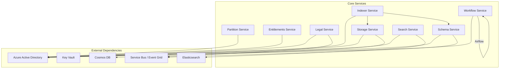
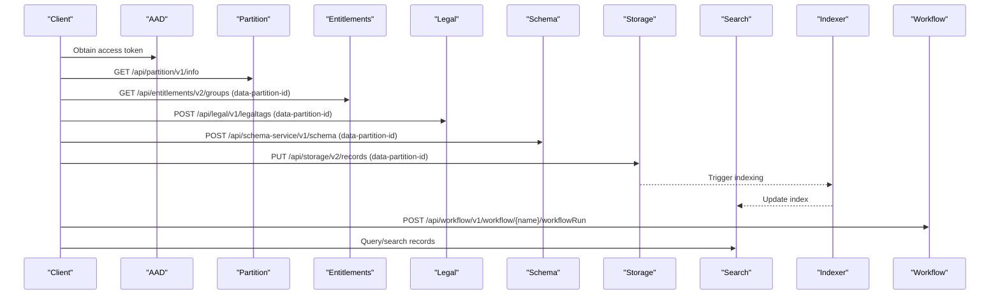
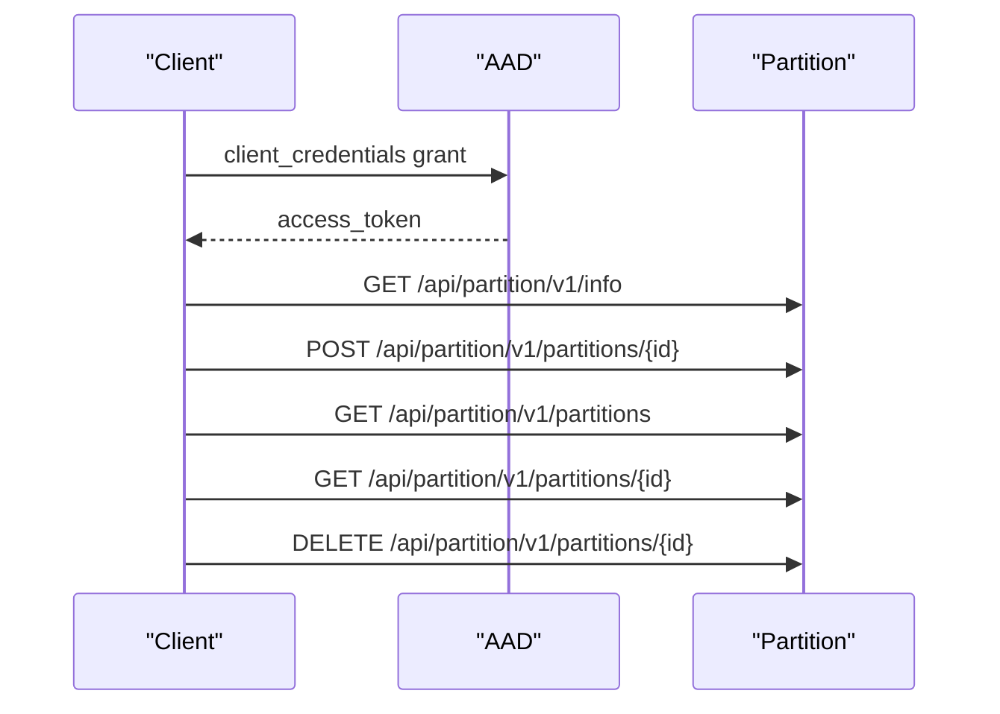
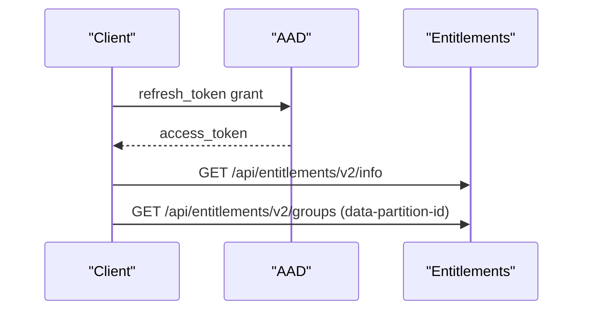
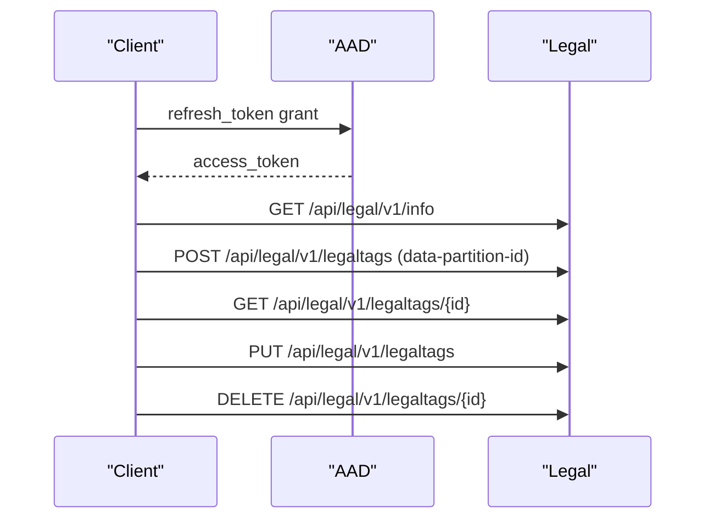
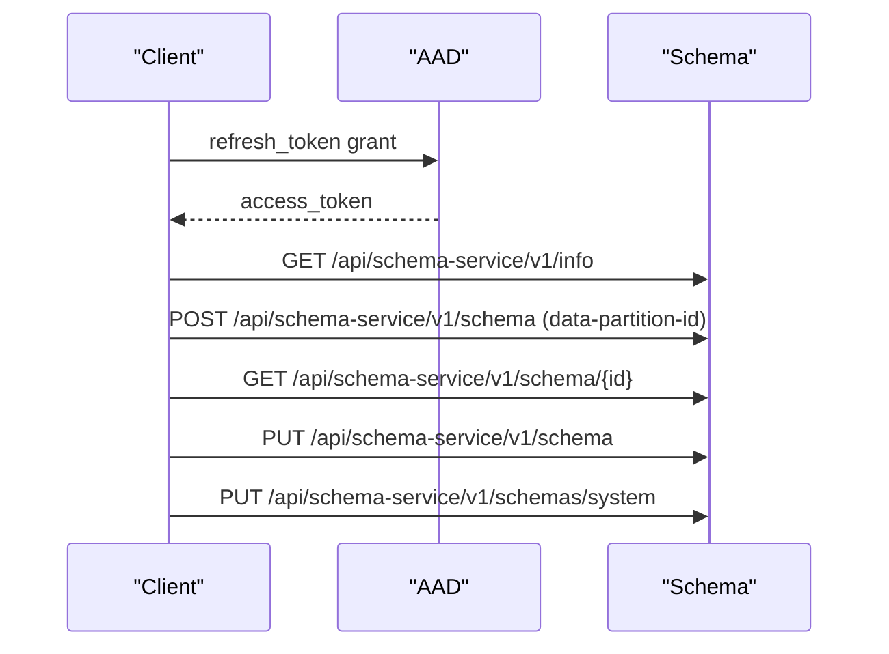
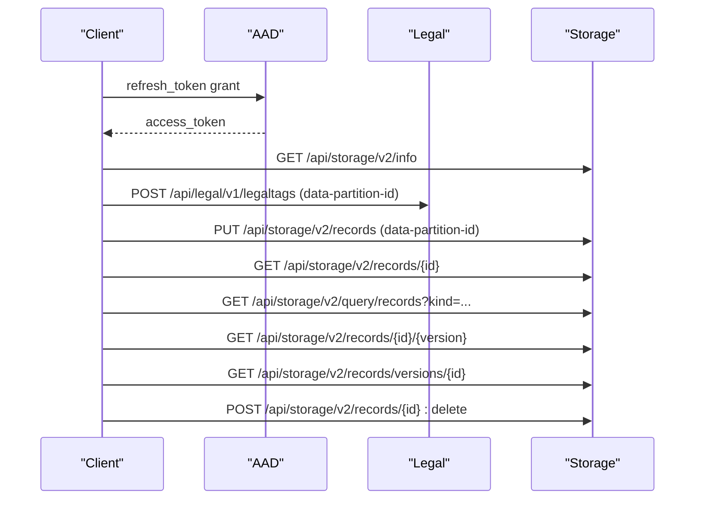
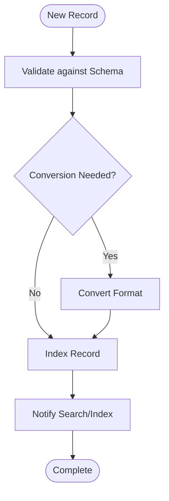
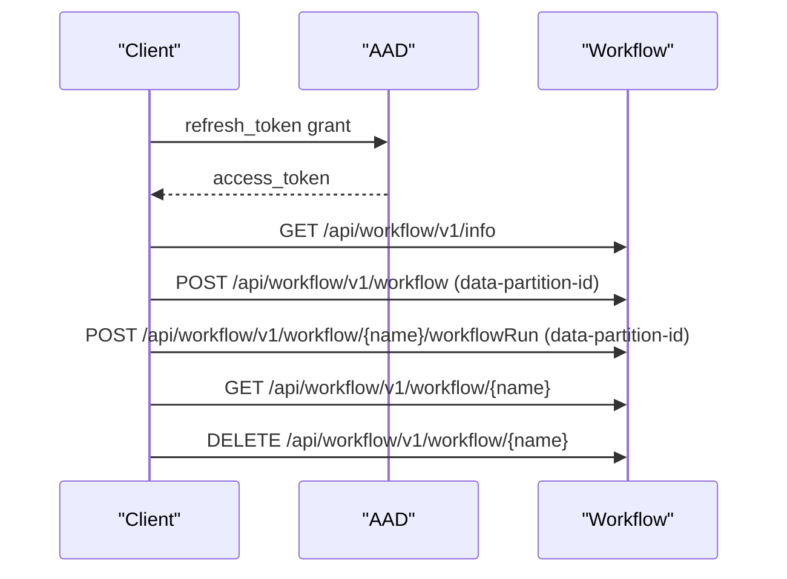
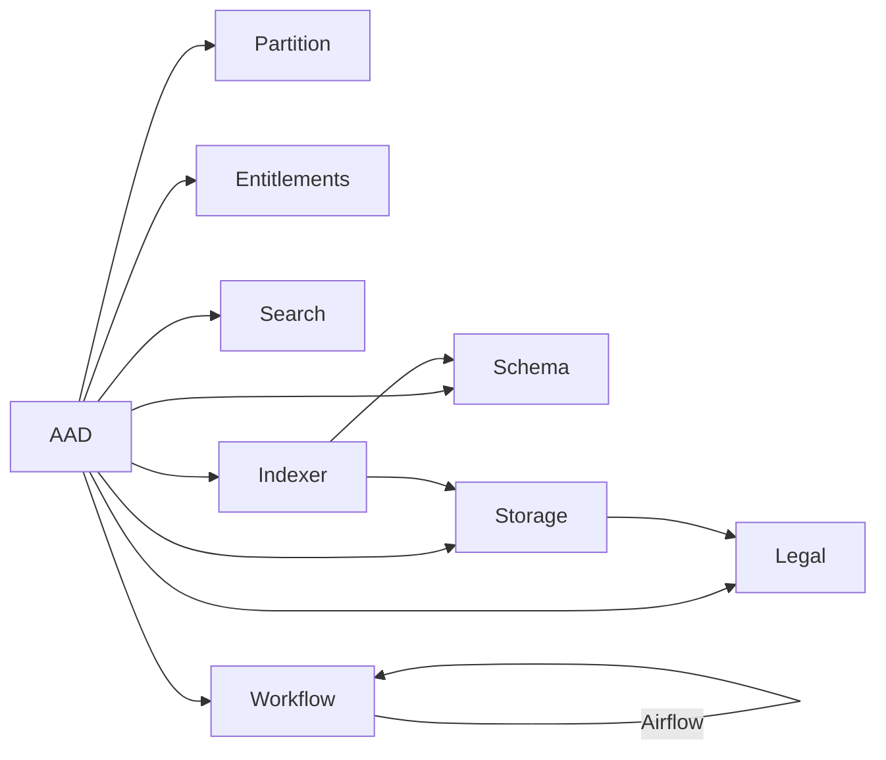

# API Reference

<cite>
**Referenced Files in This Document**
- [services_core.md](file://docs/src/services_core.md)
- [services_overview.md](file://docs/src/services_overview.md)
- [services_core_partition.md](file://docs/src/services_core_partition.md)
- [services_core_entitlements.md](file://docs/src/services_core_entitlements.md)
- [services_core_legal.md](file://docs/src/services_core_legal.md)
- [services_core_schema.md](file://docs/src/services_core_schema.md)
- [services_core_storage.md](file://docs/src/services_core_storage.md)
- [services_core_search.md](file://docs/src/services_core_search.md)
- [services_core_indexer.md](file://docs/src/services_core_indexer.md)
- [services_core_workflow.md](file://docs/src/services_core_workflow.md)
- [partition.http](file://tools/rest-scripts/partition.http)
- [entitlement.http](file://tools/rest-scripts/entitlement.http)
- [legal.http](file://tools/rest-scripts/legal.http)
- [schema.http](file://tools/rest-scripts/schema.http)
- [storage.http](file://tools/rest-scripts/storage.http)
- [workflow.http](file://tools/rest-scripts/workflow.http)
</cite>

## Table of Contents
1. Introduction
2. Project Structure
3. Core Components
4. Architecture Overview
5. Detailed Component Analysis
6. Dependency Analysis
7. Performance Considerations
8. Troubleshooting Guide
9. Conclusion
10. Appendices

## Introduction
This document provides a comprehensive API reference for the OSDU platform core services: Partition, Entitlements, Legal, Schema, Storage, Search, Indexer, and Workflow. It consolidates service endpoints, authentication requirements, request/response patterns, versioning, and practical examples derived from the repository’s documentation and REST sample scripts.

## Project Structure
The repository includes:
- Service configuration and environment variables per service under docs/src
- REST client samples under tools/rest-scripts that demonstrate actual HTTP calls used to exercise each service
- A services overview describing core and reference services

**Diagram sources**
- [services_core.md:201-315](file://docs/src/services_core.md#L201-L315)
- [services_core_search.md:14-38](file://docs/src/services_core_search.md#L14-L38)
- [services_core_indexer.md:14-31](file://docs/src/services_core_indexer.md#L14-L31)
- [services_core_workflow.md:15-39](file://docs/src/services_core_workflow.md#L15-L39)

**Section sources**
- [services_overview.md:17-31](file://docs/src/services_overview.md#L17-L31)
- [services_core.md:8-384](file://docs/src/services_core.md#L8-L384)

## Core Components
Each core service exposes a consistent set of capabilities:
- Version/info endpoint for health and capability discovery
- Domain-specific CRUD or query operations
- Authentication via Azure Active Directory (OAuth 2.0 Bearer tokens)
- Data partition scoping via headers where applicable

Common cross-cutting concerns:
- Authentication: OAuth 2.0 with Bearer tokens; refresh token flows are demonstrated in sample scripts
- Partitioning: data-partition-id header used by multiple services
- Configuration: Key Vault, Cosmos DB, Elasticsearch, Service Bus/Event Grid as backend dependencies

**Section sources**
- [services_core.md:8-384](file://docs/src/services_core.md#L8-L384)
- [partition.http:14-47](file://tools/rest-scripts/partition.http#L14-L47)
- [entitlement.http:10-61](file://tools/rest-scripts/entitlement.http#L10-L61)
- [legal.http:10-46](file://tools/rest-scripts/legal.http#L10-L46)
- [schema.http:10-48](file://tools/rest-scripts/schema.http#L10-L48)
- [storage.http:10-59](file://tools/rest-scripts/storage.http#L10-L59)
- [workflow.http:10-52](file://tools/rest-scripts/workflow.http#L10-L52)

## Architecture Overview
The services interact through well-defined REST APIs and rely on shared infrastructure:
- Partition Service manages tenant isolation and runtime configuration
- Entitlements Service resolves user/group permissions
- Legal Service manages compliance tags and policies
- Schema Service defines and serves record schemas
- Storage Service persists records and metadata
- Search Service indexes and queries records
- Indexer Service coordinates indexing and conversion workflows
- Workflow Service orchestrates business processes using Apache Airflow

**Diagram sources**
- [partition.http:41-47](file://tools/rest-scripts/partition.http#L41-L47)
- [entitlement.http:44-61](file://tools/rest-scripts/entitlement.http#L44-L61)
- [legal.http:41-89](file://tools/rest-scripts/legal.http#L41-L89)
- [schema.http:43-90](file://tools/rest-scripts/schema.http#L43-L90)
- [storage.http:54-139](file://tools/rest-scripts/storage.http#L54-L139)
- [services_core_indexer.md:14-31](file://docs/src/services_core_indexer.md#L14-L31)
- [services_core_search.md:14-38](file://docs/src/services_core_search.md#L14-L38)
- [workflow.http:47-116](file://tools/rest-scripts/workflow.http#L47-L116)

## Detailed Component Analysis

### Partition Service
- Base path: /api/partition/v1
- Authentication: Bearer token from AAD
- Common headers: data-partition-id where applicable
- Endpoints observed:
  - GET /info
  - POST /partitions/{id}
  - GET /partitions
  - GET /partitions/{id}
  - DELETE /partitions/{id}
- Example flow: Acquire token, then call info or manage partitions

**Diagram sources**
- [partition.http:14-47](file://tools/rest-scripts/partition.http#L14-L47)
- [partition.http:52-220](file://tools/rest-scripts/partition.http#L52-L220)

**Section sources**
- [services_core_partition.md:14-51](file://docs/src/services_core_partition.md#L14-L51)
- [partition.http:14-220](file://tools/rest-scripts/partition.http#L14-L220)

### Entitlements Service
- Base path: /api/entitlements/v2
- Authentication: Bearer token from AAD
- Common headers: data-partition-id
- Endpoints observed:
  - GET /info
  - GET /groups
- Typical use: Resolve user groups/permissions for authorization decisions

**Diagram sources**
- [entitlement.http:10-61](file://tools/rest-scripts/entitlement.http#L10-L61)

**Section sources**
- [services_core_entitlements.md:14-42](file://docs/src/services_core_entitlements.md#L14-L42)
- [entitlement.http:10-61](file://tools/rest-scripts/entitlement.http#L10-L61)

### Legal Service
- Base path: /api/legal/v1
- Authentication: Bearer token from AAD
- Common headers: data-partition-id
- Endpoints observed:
  - GET /info
  - GET /legaltags:properties
  - GET /legaltags
  - POST /legaltags
  - GET /legaltags/{id}
  - PUT /legaltags
  - DELETE /legaltags/{id}
- Typical use: Manage legal tags and compliance metadata for records

**Diagram sources**
- [legal.http:10-121](file://tools/rest-scripts/legal.http#L10-L121)

**Section sources**
- [services_core_legal.md:14-50](file://docs/src/services_core_legal.md#L14-L50)
- [legal.http:10-121](file://tools/rest-scripts/legal.http#L10-L121)

### Schema Service
- Base path: /api/schema-service/v1
- Authentication: Bearer token from AAD
- Common headers: data-partition-id
- Endpoints observed:
  - GET /info
  - GET /schema
  - POST /schema
  - GET /schema/{id}
  - PUT /schema
  - PUT /schemas/system (system schema management)
- Typical use: Define and manage JSON schemas for record kinds

**Diagram sources**
- [schema.http:10-199](file://tools/rest-scripts/schema.http#L10-L199)

**Section sources**
- [services_core_schema.md:14-40](file://docs/src/services_core_schema.md#L14-L40)
- [schema.http:10-199](file://tools/rest-scripts/schema.http#L10-L199)

### Storage Service
- Base path: /api/storage/v2
- Authentication: Bearer token from AAD
- Common headers: data-partition-id
- Endpoints observed:
  - GET /info
  - PUT /records
  - GET /records/{id}
  - GET /query/records?kind=...
  - GET /records/{id}/{version}
  - GET /records/versions/{id}
  - POST /records/{id}:delete
- Typical use: Create, retrieve, list, version, and delete records

**Diagram sources**
- [storage.http:10-197](file://tools/rest-scripts/storage.http#L10-L197)

**Section sources**
- [services_core_storage.md:14-40](file://docs/src/services_core_storage.md#L14-L40)
- [storage.http:10-197](file://tools/rest-scripts/storage.http#L10-L197)

### Search Service
- Base path: Not directly exercised in sample scripts; typically integrates with Storage and Indexer
- Authentication: Bearer token from AAD
- Configuration indicates integration with Policy service and caching layers
- Typical use: Query indexed records based on attributes and filters

[No sources needed since this section summarizes configuration without analyzing specific files]

**Section sources**
- [services_core_search.md:14-38](file://docs/src/services_core_search.md#L14-L38)

### Indexer Service
- Base path: Not directly exposed in sample scripts; primarily internal processing
- Authentication: Bearer token from AAD
- Integrations: Storage, Schema, and external storage/query endpoints
- Typical use: Ingest new records, convert formats, update search indexes

**Diagram sources**
- [services_core_indexer.md:14-31](file://docs/src/services_core_indexer.md#L14-L31)

**Section sources**
- [services_core_indexer.md:14-31](file://docs/src/services_core_indexer.md#L14-L31)

### Workflow Service
- Base path: /api/workflow/v1
- Authentication: Bearer token from AAD
- Common headers: data-partition-id
- Endpoints observed:
  - GET /info
  - GET /workflow
  - POST /workflow
  - GET /workflow/{name}
  - POST /workflow/{name}/workflowRun
  - DELETE /workflow/{name}
- Typical use: Register, execute, and manage workflows backed by Apache Airflow

**Diagram sources**
- [workflow.http:10-116](file://tools/rest-scripts/workflow.http#L10-L116)

**Section sources**
- [services_core_workflow.md:15-39](file://docs/src/services_core_workflow.md#L15-L39)
- [workflow.http:10-116](file://tools/rest-scripts/workflow.http#L10-L116)

## Dependency Analysis
Services depend on shared infrastructure and other services:
- All services authenticate via AAD
- Storage depends on Legal for compliance tags and may publish events
- Indexer depends on Storage and Schema to process records
- Search depends on indexed content produced by Indexer
- Workflow depends on Airflow and may coordinate with Storage and Legal

**Diagram sources**
- [services_core.md:201-315](file://docs/src/services_core.md#L201-L315)
- [services_core_indexer.md:14-31](file://docs/src/services_core_indexer.md#L14-L31)
- [services_core_workflow.md:15-39](file://docs/src/services_core_workflow.md#L15-L39)

**Section sources**
- [services_core.md:201-315](file://docs/src/services_core.md#L201-L315)

## Performance Considerations
- Use pagination and attribute filtering on query endpoints to reduce payload sizes
- Cache frequently accessed metadata (e.g., schema definitions) at the client layer when appropriate
- Batch operations where supported (e.g., batch record queries) to minimize network overhead
- Monitor service bus/event grid throughput for high-volume ingestion scenarios
- Tune cache expiration and size parameters for search and indexer components

[No sources needed since this section provides general guidance]

## Troubleshooting Guide
Common issues and checks:
- Authentication failures: Ensure valid Bearer token and correct scopes; verify refresh token flow if tokens expire
- Partition errors: Confirm data-partition-id is set and matches configured partitions
- Legal tag errors: Validate tag existence and properties before record creation
- Schema validation errors: Ensure record kind matches a registered schema version
- Storage errors: Check record IDs, versions, and deletion syntax
- Workflow execution errors: Verify workflow registration and Airflow connectivity

Operational tips:
- Use /info endpoints to confirm service availability and version
- Inspect logs and metrics via Application Insights where enabled
- Validate environment variables for Key Vault, Cosmos DB, and Service Bus endpoints

**Section sources**
- [partition.http:14-47](file://tools/rest-scripts/partition.http#L14-L47)
- [entitlement.http:10-61](file://tools/rest-scripts/entitlement.http#L10-L61)
- [legal.http:10-121](file://tools/rest-scripts/legal.http#L10-L121)
- [schema.http:10-199](file://tools/rest-scripts/schema.http#L10-L199)
- [storage.http:10-197](file://tools/rest-scripts/storage.http#L10-L197)
- [workflow.http:10-116](file://tools/rest-scripts/workflow.http#L10-L116)

## Conclusion
The OSDU platform exposes a cohesive set of REST APIs across core services, unified by OAuth 2.0 authentication and data partitioning. The included REST scripts provide practical, reproducible examples for common operations such as managing partitions, entitlements, legal tags, schemas, records, and workflows. By following the patterns shown here, clients can integrate reliably with the platform while leveraging its scalability and governance features.

[No sources needed since this section summarizes without analyzing specific files]

## Appendices

### Authentication and Authorization
- All services require an OAuth 2.0 Bearer token obtained from Azure Active Directory
- Sample scripts demonstrate both client_credentials and refresh_token flows
- Include required headers such as data-partition-id where specified

**Section sources**
- [partition.http:14-47](file://tools/rest-scripts/partition.http#L14-L47)
- [entitlement.http:10-61](file://tools/rest-scripts/entitlement.http#L10-L61)
- [legal.http:10-46](file://tools/rest-scripts/legal.http#L10-L46)
- [schema.http:10-48](file://tools/rest-scripts/schema.http#L10-L48)
- [storage.http:10-59](file://tools/rest-scripts/storage.http#L10-L59)
- [workflow.http:10-52](file://tools/rest-scripts/workflow.http#L10-L52)

### API Versioning
- Partition: v1
- Entitlements: v2
- Legal: v1
- Schema: v1
- Storage: v2
- Workflow: v1
- Search and Indexer: Internal orchestration; no direct public endpoints shown in scripts

**Section sources**
- [partition.http:33-47](file://tools/rest-scripts/partition.http#L33-L47)
- [entitlement.http:36-61](file://tools/rest-scripts/entitlement.http#L36-L61)
- [legal.http:33-46](file://tools/rest-scripts/legal.http#L33-L46)
- [schema.http:33-48](file://tools/rest-scripts/schema.http#L33-L48)
- [storage.http:43-59](file://tools/rest-scripts/storage.http#L43-L59)
- [workflow.http:36-52](file://tools/rest-scripts/workflow.http#L36-L52)

### Practical Examples (curl-style)
- Partition info:
  - curl -H "Authorization: Bearer <token>" https://<host>/api/partition/v1/info
- Entitlements groups:
  - curl -H "Authorization: Bearer <token>" -H "data-partition-id: <partition>" https://<host>/api/entitlements/v2/groups
- Legal tag creation:
  - curl -X POST -H "Authorization: Bearer <token>" -H "data-partition-id: <partition>" -H "Content-Type: application/json" -d '<body>' https://<host>/api/legal/v1/legaltags
- Storage record creation:
  - curl -X PUT -H "Authorization: Bearer <token>" -H "data-partition-id: <partition>" -H "Content-Type: application/json" -d '<body>' https://<host>/api/storage/v2/records
- Workflow run:
  - curl -X POST -H "Authorization: Bearer <token>" -H "data-partition-id: <partition>" -H "Content-Type: application/json" -d '<body>' https://<host>/api/workflow/v1/workflow/<name>/workflowRun

Note: Replace placeholders with your environment values. See sample scripts for full payloads and variable usage.

**Section sources**
- [partition.http:41-47](file://tools/rest-scripts/partition.http#L41-L47)
- [entitlement.http:44-61](file://tools/rest-scripts/entitlement.http#L44-L61)
- [legal.http:41-89](file://tools/rest-scripts/legal.http#L41-L89)
- [storage.http:54-139](file://tools/rest-scripts/storage.http#L54-L139)
- [workflow.http:47-116](file://tools/rest-scripts/workflow.http#L47-L116)