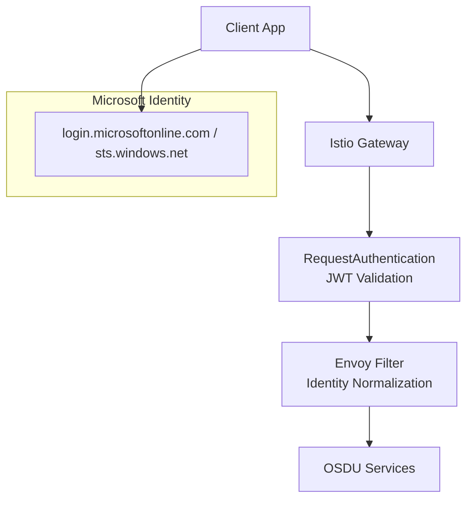
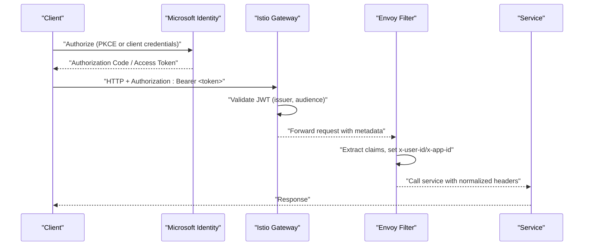
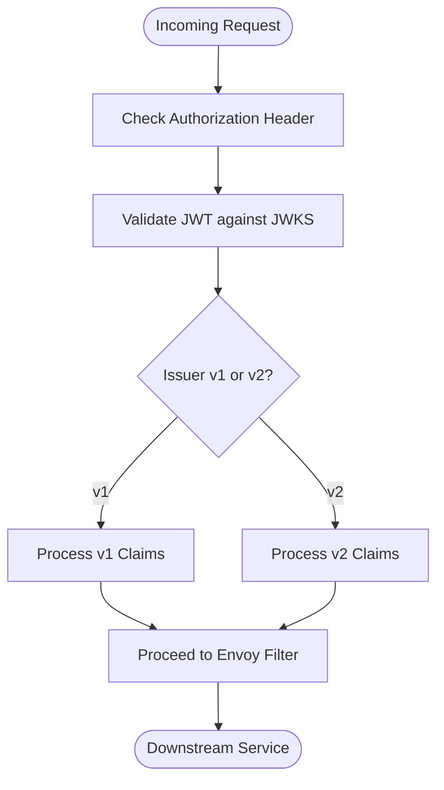
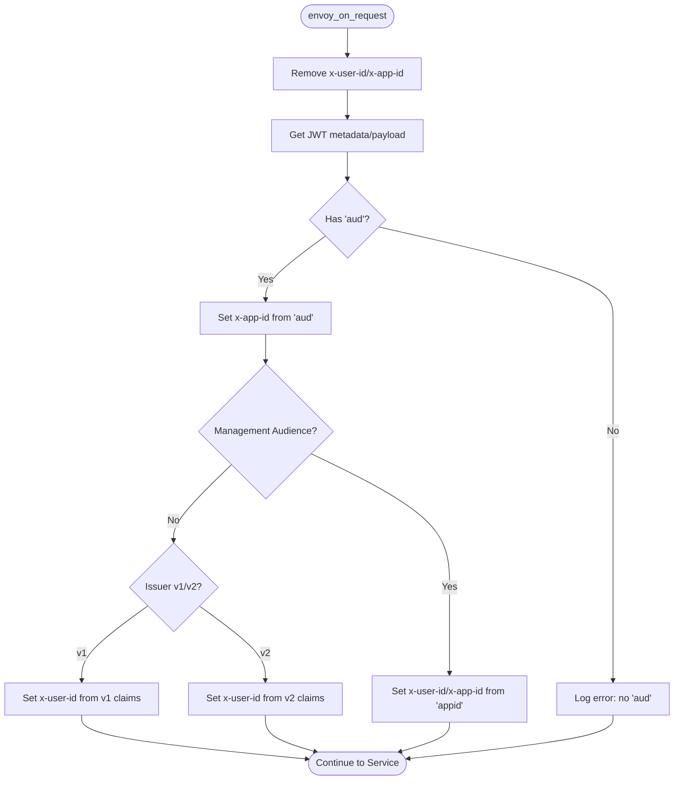
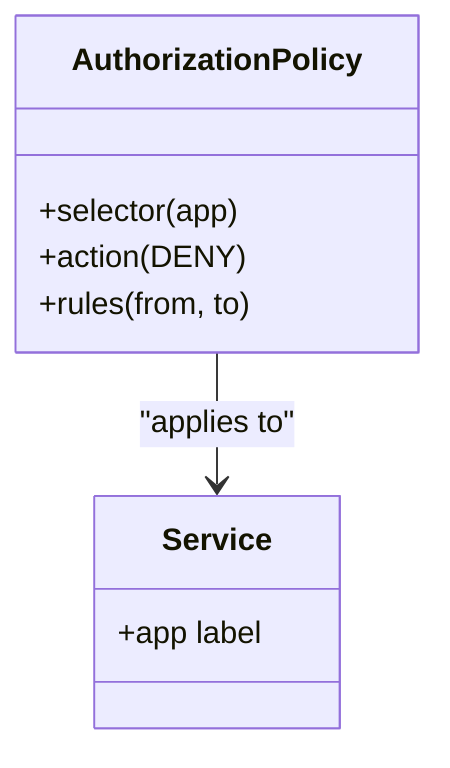
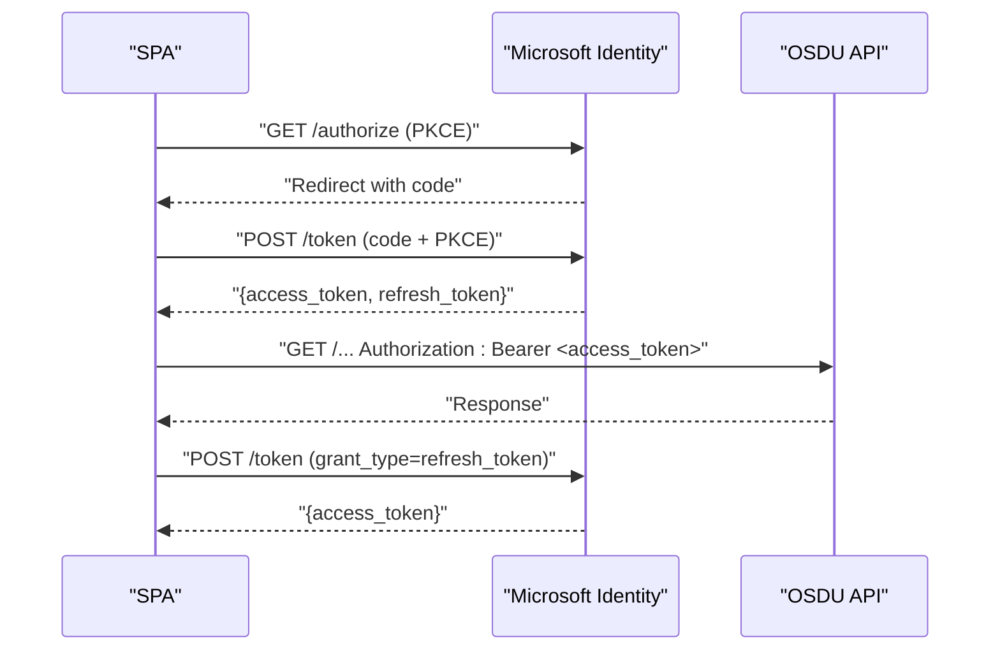
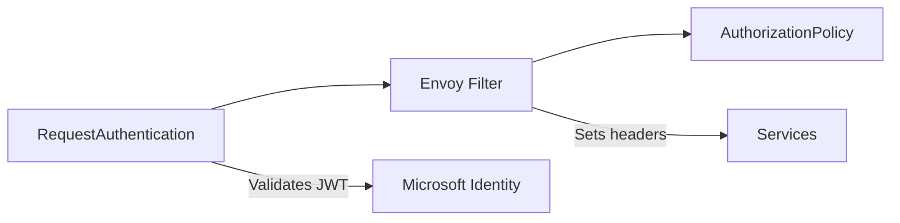

# Authentication API

<cite>
**Referenced Files in This Document**
- [request-authentication.yaml](file://charts/osdu-developer-base/templates/request-authentication.yaml)
- [envoy-filter.yaml](file://charts/osdu-developer-base/templates/envoy-filter.yaml)
- [envoy-filter.md](file://charts/osdu-developer-base/envoy-filter.md)
- [auth-policy.yaml](file://charts/osdu-developer-service/templates/auth-policy.yaml)
- [config-map.yaml](file://charts/osdu-developer-auth/templates/config-map.yaml)
- [config-map-spa.yaml](file://charts/osdu-developer-auth/templates/config-map-spa.yaml)
- [admin.http](file://tools/rest-scripts/admin.http)
- [local.http](file://tools/rest-scripts/local.http)
- [settings.ps1](file://scripts/settings.ps1)
</cite>

## Table of Contents
1. [Introduction](#introduction)
2. [Project Structure](#project-structure)
3. [Core Components](#core-components)
4. [Architecture Overview](#architecture-overview)
5. [Detailed Component Analysis](#detailed-component-analysis)
6. [Dependency Analysis](#dependency-analysis)
7. [Performance Considerations](#performance-considerations)
8. [Troubleshooting Guide](#troubleshooting-guide)
9. [Conclusion](#conclusion)
10. [Appendices](#appendices)

## Introduction
This document describes the authentication and authorization model for the OSDU platform as implemented in this repository. It focuses on OAuth2/OpenID Connect flows with Microsoft Identity Platform (Azure AD), token handling at the ingress layer, identity propagation to downstream services, and practical examples for service-to-service, user, and administrative scenarios. It also covers error handling patterns, token expiration management, and troubleshooting guidance based on the provided configuration and scripts.

## Project Structure
The authentication stack is composed of:
- Ingress-level JWT validation via Istio RequestAuthentication
- Envoy filter that normalizes identities into well-known headers for downstream services
- Authorization policies to enforce access control per service
- Developer tooling (HTML/JS SPA and HTTP samples) demonstrating OAuth flows and token usage
- Scripts to obtain refresh tokens using authorization codes

**Diagram sources**
- [request-authentication.yaml:1-33](file://charts/osdu-developer-base/templates/request-authentication.yaml#L1-L33)
- [envoy-filter.yaml:89-143](file://charts/osdu-developer-base/templates/envoy-filter.yaml#L89-L143)
- [auth-policy.yaml:1-29](file://charts/osdu-developer-service/templates/auth-policy.yaml#L1-L29)

**Section sources**
- [request-authentication.yaml:1-33](file://charts/osdu-developer-base/templates/request-authentication.yaml#L1-L33)
- [envoy-filter.yaml:89-143](file://charts/osdu-developer-base/templates/envoy-filter.yaml#L89-L143)
- [auth-policy.yaml:1-29](file://charts/osdu-developer-service/templates/auth-policy.yaml#L1-L29)

## Core Components
- JWT validation at the gateway: Requests must include a Bearer token in the Authorization header. The gateway validates tokens from both v1 and v2 issuers and forwards the original token to downstream services.
- Identity normalization: An Envoy filter extracts claims from validated JWTs and sets x-user-id and x-app-id headers for downstream services. It supports multiple issuer patterns and audience-based special cases.
- Authorization enforcement: Per-service AuthorizationPolicy denies requests without a valid request principal unless explicitly allowed by configured paths.
- Developer tooling: HTML/JS pages demonstrate OAuth authorize and token exchange flows, including PKCE support and refresh token usage. HTTP sample files show how to call OSDU APIs with Bearer tokens.
- Refresh token acquisition: PowerShell script demonstrates exchanging an authorization code for a refresh token.

**Section sources**
- [request-authentication.yaml:1-33](file://charts/osdu-developer-base/templates/request-authentication.yaml#L1-L33)
- [envoy-filter.md:1-12](file://charts/osdu-developer-base/envoy-filter.md#L1-L12)
- [envoy-filter.yaml:57-87](file://charts/osdu-developer-base/templates/envoy-filter.yaml#L57-L87)
- [auth-policy.yaml:1-29](file://charts/osdu-developer-service/templates/auth-policy.yaml#L1-L29)
- [config-map.yaml:113-146](file://charts/osdu-developer-auth/templates/config-map.yaml#L113-L146)
- [config-map-spa.yaml:86-114](file://charts/osdu-developer-auth/templates/config-map-spa.yaml#L86-L114)
- [admin.http:18-29](file://tools/rest-scripts/admin.http#L18-L29)
- [local.http:14-25](file://tools/rest-scripts/local.http#L14-L25)
- [settings.ps1:93-111](file://scripts/settings.ps1#L93-L111)

## Architecture Overview
The platform uses a layered approach:
- Clients authenticate with Microsoft Identity Platform and receive access tokens (and optionally refresh tokens).
- The Istio gateway validates JWTs and enforces audience and issuer rules.
- The Envoy filter maps token claims to standardized headers (x-user-id, x-app-id) and handles delegation via x-on-behalf-of when present.
- Downstream services rely on these headers for authorization decisions.

**Diagram sources**
- [request-authentication.yaml:11-32](file://charts/osdu-developer-base/templates/request-authentication.yaml#L11-L32)
- [envoy-filter.yaml:89-143](file://charts/osdu-developer-base/templates/envoy-filter.yaml#L89-L143)
- [config-map-spa.yaml:107-114](file://charts/osdu-developer-auth/templates/config-map-spa.yaml#L107-L114)

## Detailed Component Analysis

### JWT Validation and Issuer Handling
- Two issuers are supported:
  - v1: https://sts.windows.net/{tenant}/
  - v2: https://login.microsoftonline.com/{tenant}/v2.0
- Both accept audiences corresponding to the application and client identifiers, plus a special management audience.
- The gateway forwards the original token and exposes the decoded payload to the Envoy filter.

**Diagram sources**
- [request-authentication.yaml:11-32](file://charts/osdu-developer-base/templates/request-authentication.yaml#L11-L32)

**Section sources**
- [request-authentication.yaml:1-33](file://charts/osdu-developer-base/templates/request-authentication.yaml#L1-L33)

### Identity Propagation via Envoy Filter
- Removes any pre-existing x-user-id and x-app-id headers to prevent spoofing.
- Extracts aud to set x-app-id; supports special handling for management.azure.com audience.
- Determines issuer pattern and populates x-user-id from appropriate claims:
  - v1: unique_name, oid/upn fallbacks
  - v2: unique_name, oid, azp fallbacks
- Supports OAuth On-Behalf-Of flow by preserving user identity through the chain.

**Diagram sources**
- [envoy-filter.yaml:89-143](file://charts/osdu-developer-base/templates/envoy-filter.yaml#L89-L143)
- [envoy-filter.md:14-30](file://charts/osdu-developer-base/envoy-filter.md#L14-L30)

**Section sources**
- [envoy-filter.yaml:57-87](file://charts/osdu-developer-base/templates/envoy-filter.yaml#L57-L87)
- [envoy-filter.yaml:89-143](file://charts/osdu-developer-base/templates/envoy-filter.yaml#L89-L143)
- [envoy-filter.md:14-30](file://charts/osdu-developer-base/envoy-filter.md#L14-L30)

### Authorization Policies
- Per-service AuthorizationPolicy denies requests lacking a valid request principal unless the path is explicitly excluded.
- This ensures only authenticated and authorized callers can reach protected endpoints.

**Diagram sources**
- [auth-policy.yaml:1-29](file://charts/osdu-developer-service/templates/auth-policy.yaml#L1-L29)

**Section sources**
- [auth-policy.yaml:1-29](file://charts/osdu-developer-service/templates/auth-policy.yaml#L1-L29)

### OAuth Flows and Token Management
- Authorization Code Flow with PKCE:
  - The developer SPA generates a code verifier and challenge, redirects to the Microsoft authorize endpoint, and exchanges the code for tokens.
  - Supports offline_access to obtain refresh tokens.
- Client Credentials Flow:
  - Demonstrated in HTTP samples for service-to-service calls using client_id and client_secret.
- Refresh Token Usage:
  - The SPA stores and reuses refresh tokens to obtain new access tokens.
  - A PowerShell script shows exchanging an authorization code for a refresh token.

**Diagram sources**
- [config-map-spa.yaml:86-114](file://charts/osdu-developer-auth/templates/config-map-spa.yaml#L86-L114)
- [config-map-spa.yaml:168-189](file://charts/osdu-developer-auth/templates/config-map-spa.yaml#L168-L189)
- [config-map-spa.yaml:191-231](file://charts/osdu-developer-auth/templates/config-map-spa.yaml#L191-L231)
- [admin.http:18-29](file://tools/rest-scripts/admin.http#L18-L29)
- [settings.ps1:93-111](file://scripts/settings.ps1#L93-L111)

**Section sources**
- [config-map.yaml:113-146](file://charts/osdu-developer-auth/templates/config-map.yaml#L113-L146)
- [config-map-spa.yaml:86-114](file://charts/osdu-developer-auth/templates/config-map-spa.yaml#L86-L114)
- [config-map-spa.yaml:168-189](file://charts/osdu-developer-auth/templates/config-map-spa.yaml#L168-L189)
- [config-map-spa.yaml:191-231](file://charts/osdu-developer-auth/templates/config-map-spa.yaml#L191-L231)
- [admin.http:18-29](file://tools/rest-scripts/admin.http#L18-L29)
- [local.http:14-25](file://tools/rest-scripts/local.http#L14-L25)
- [settings.ps1:93-111](file://scripts/settings.ps1#L93-L111)

### Authentication Scenarios and Examples
- Service-to-Service (Client Credentials):
  - Use client_id and client_secret to obtain an access token and call OSDU APIs with Authorization: Bearer.
  - Example references: [admin.http:18-29](file://tools/rest-scripts/admin.http#L18-L29), [local.http:14-25](file://tools/rest-scripts/local.http#L14-L25)
- User Authentication (Authorization Code with PKCE):
  - Redirect to Microsoft authorize, handle code callback, exchange for tokens, store refresh token, and use access tokens for API calls.
  - Example references: [config-map-spa.yaml:107-114](file://charts/osdu-developer-auth/templates/config-map-spa.yaml#L107-L114), [config-map-spa.yaml:191-231](file://charts/osdu-developer-auth/templates/config-map-spa.yaml#L191-L231)
- Administrative Operations:
  - Use tokens with appropriate scopes to call entitlements and other admin endpoints.
  - Example references: [admin.http:47-51](file://tools/rest-scripts/admin.http#L47-L51), [admin.http:84-100](file://tools/rest-scripts/admin.http#L84-L100)

**Section sources**
- [admin.http:18-29](file://tools/rest-scripts/admin.http#L18-L29)
- [admin.http:47-51](file://tools/rest-scripts/admin.http#L47-L51)
- [admin.http:84-100](file://tools/rest-scripts/admin.http#L84-L100)
- [local.http:14-25](file://tools/rest-scripts/local.http#L14-L25)
- [config-map-spa.yaml:107-114](file://charts/osdu-developer-auth/templates/config-map-spa.yaml#L107-L114)
- [config-map-spa.yaml:191-231](file://charts/osdu-developer-auth/templates/config-map-spa.yaml#L191-L231)

## Dependency Analysis
- Istio RequestAuthentication depends on Microsoft Identity JWKS endpoints and configured issuers/audiences.
- Envoy Filter depends on the presence of validated JWT metadata and processes specific claims.
- AuthorizationPolicy depends on successful request authentication to establish principals.
- Developer tooling depends on Microsoft Identity endpoints and environment variables for tenant/client IDs.

**Diagram sources**
- [request-authentication.yaml:11-32](file://charts/osdu-developer-base/templates/request-authentication.yaml#L11-L32)
- [envoy-filter.yaml:89-143](file://charts/osdu-developer-base/templates/envoy-filter.yaml#L89-L143)
- [auth-policy.yaml:1-29](file://charts/osdu-developer-service/templates/auth-policy.yaml#L1-L29)

**Section sources**
- [request-authentication.yaml:1-33](file://charts/osdu-developer-base/templates/request-authentication.yaml#L1-L33)
- [envoy-filter.yaml:89-143](file://charts/osdu-developer-base/templates/envoy-filter.yaml#L89-L143)
- [auth-policy.yaml:1-29](file://charts/osdu-developer-service/templates/auth-policy.yaml#L1-L29)

## Performance Considerations
- JWT validation occurs at the gateway; ensure JWKS endpoints are reachable and cache-friendly to minimize latency.
- Envoy filter operations are lightweight but should be monitored for high traffic volumes.
- Prefer short-lived access tokens and refresh tokens to reduce token churn and improve security posture.
- Avoid unnecessary logging of sensitive payloads in production environments.

[No sources needed since this section provides general guidance]

## Troubleshooting Guide
Common issues and resolutions:
- Missing or invalid Authorization header:
  - Ensure requests include Authorization: Bearer <token>.
  - Reference: [request-authentication.yaml:20-32](file://charts/osdu-developer-base/templates/request-authentication.yaml#L20-L32)
- Unknown issuer or audience mismatch:
  - Verify issuer matches v1 or v2 and audience includes the intended app/client ID.
  - Reference: [request-authentication.yaml:11-28](file://charts/osdu-developer-base/templates/request-authentication.yaml#L11-L28)
- No x-user-id or x-app-id set:
  - Check Envoy filter logs for claim extraction errors and confirm token contains required claims.
  - Reference: [envoy-filter.yaml:96-138](file://charts/osdu-developer-base/templates/envoy-filter.yaml#L96-L138)
- Authorization denied:
  - Confirm AuthorizationPolicy allows the caller’s principal or path exceptions.
  - Reference: [auth-policy.yaml:15-27](file://charts/osdu-developer-service/templates/auth-policy.yaml#L15-L27)
- Token expiration:
  - Implement refresh token flow to obtain new access tokens before expiry.
  - Reference: [config-map-spa.yaml:168-189](file://charts/osdu-developer-auth/templates/config-map-spa.yaml#L168-L189), [settings.ps1:93-111](file://scripts/settings.ps1#L93-L111)

**Section sources**
- [request-authentication.yaml:11-32](file://charts/osdu-developer-base/templates/request-authentication.yaml#L11-L32)
- [envoy-filter.yaml:96-138](file://charts/osdu-developer-base/templates/envoy-filter.yaml#L96-L138)
- [auth-policy.yaml:15-27](file://charts/osdu-developer-service/templates/auth-policy.yaml#L15-L27)
- [config-map-spa.yaml:168-189](file://charts/osdu-developer-auth/templates/config-map-spa.yaml#L168-L189)
- [settings.ps1:93-111](file://scripts/settings.ps1#L93-L111)

## Conclusion
The OSDU platform integrates robust OAuth2/OpenID Connect authentication via Microsoft Identity Platform, enforced at the Istio gateway and normalized by an Envoy filter for consistent identity propagation. Authorization policies secure service endpoints, while developer tooling and scripts provide practical examples for common authentication scenarios. Following the recommended flows and best practices ensures secure, scalable, and maintainable authentication across the platform.

[No sources needed since this section summarizes without analyzing specific files]

## Appendices

### Headers and Token Formats
- Authorization: Bearer <JWT>
- x-user-id: Populated by Envoy filter from token claims
- x-app-id: Populated by Envoy filter from token audience
- x-payload: Optional forwarded token payload header (gateway configuration)

**Section sources**
- [request-authentication.yaml:18-32](file://charts/osdu-developer-base/templates/request-authentication.yaml#L18-L32)
- [envoy-filter.yaml:107-126](file://charts/osdu-developer-base/templates/envoy-filter.yaml#L107-L126)

### Security Best Practices
- Use HTTPS for all communications.
- Employ PKCE for public clients.
- Limit scopes to minimum required.
- Store refresh tokens securely and rotate access tokens proactively.
- Monitor and audit authentication events and policy denials.

[No sources needed since this section provides general guidance]