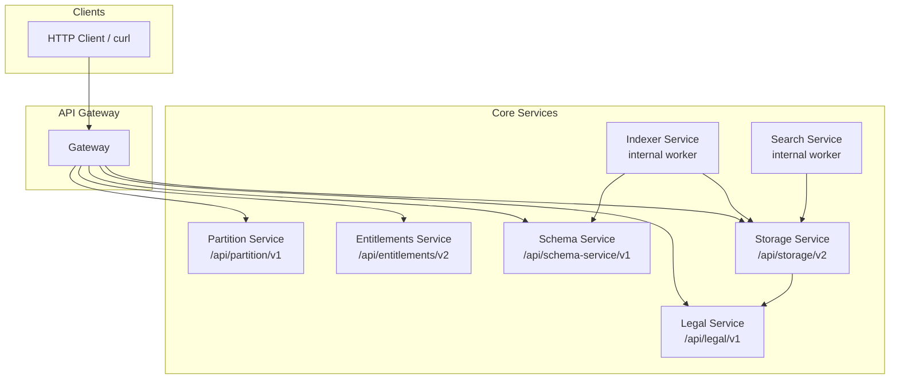
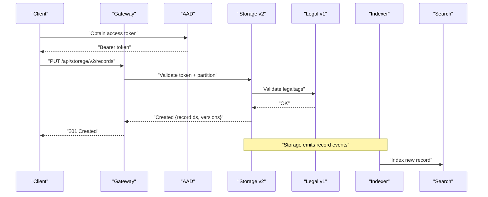
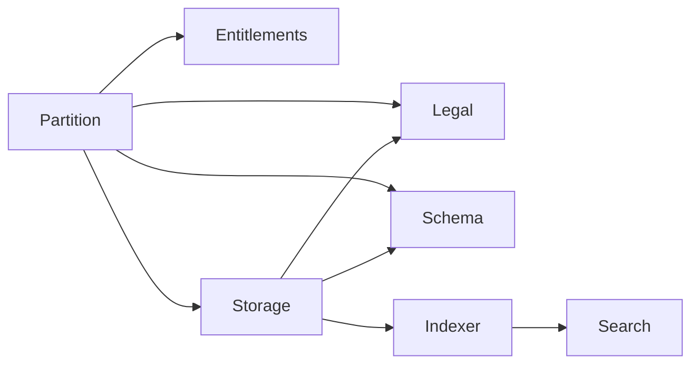

# Core Services API

<cite>
**Referenced Files in This Document**
- [services_core_partition.md](file://docs/src/services_core_partition.md)
- [services_core_entitlements.md](file://docs/src/services_core_entitlements.md)
- [services_core_legal.md](file://docs/src/services_core_legal.md)
- [services_core_schema.md](file://docs/src/services_core_schema.md)
- [services_core_storage.md](file://docs/src/services_core_storage.md)
- [services_core_indexer.md](file://docs/src/services_core_indexer.md)
- [services_core_search.md](file://docs/src/services_core_search.md)
- [partition.http](file://tools/rest-scripts/partition.http)
- [entitlement.http](file://tools/rest-scripts/entitlement.http)
- [legal.http](file://tools/rest-scripts/legal.http)
- [schema.http](file://tools/rest-scripts/schema.http)
- [storage.http](file://tools/rest-scripts/storage.http)
</cite>

## Table of Contents
1. Introduction
2. Project Structure
3. Core Components
4. Architecture Overview
5. Detailed Component Analysis
6. Dependency Analysis
7. Performance Considerations
8. Troubleshooting Guide
9. Conclusion

## Introduction
This document provides comprehensive API documentation for OSDU core services: Partition, Entitlements, Legal, Schema, Storage, and Indexer. It covers REST endpoints, HTTP methods, URL patterns, request/response schemas, authentication requirements, error handling considerations, and practical examples using HTTP clients. It also includes guidance on versioning, rate limiting, and best practices for client implementation.

## Project Structure
The repository contains service-specific configuration and usage notes under docs/src, along with sample HTTP requests under tools/rest-scripts that demonstrate how to call each service’s REST APIs. The services are Spring Boot applications deployed behind an API gateway and typically secured via Azure Active Directory (AAD) tokens.

**Diagram sources**
- [services_core_partition.md:14-29](file://docs/src/services_core_partition.md#L14-L29)
- [services_core_entitlements.md:14-28](file://docs/src/services_core_entitlements.md#L14-L28)
- [services_core_legal.md:14-36](file://docs/src/services_core_legal.md#L14-L36)
- [services_core_schema.md:14-39](file://docs/src/services_core_schema.md#L14-L39)
- [services_core_storage.md:14-39](file://docs/src/services_core_storage.md#L14-L39)
- [services_core_indexer.md:14-30](file://docs/src/services_core_indexer.md#L14-L30)
- [services_core_search.md:14-38](file://docs/src/services_core_search.md#L14-L38)

**Section sources**
- [services_core_partition.md:14-29](file://docs/src/services_core_partition.md#L14-L29)
- [services_core_entitlements.md:14-28](file://docs/src/services_core_entitlements.md#L14-L28)
- [services_core_legal.md:14-36](file://docs/src/services_core_legal.md#L14-L36)
- [services_core_schema.md:14-39](file://docs/src/services_core_schema.md#L14-L39)
- [services_core_storage.md:14-39](file://docs/src/services_core_storage.md#L14-L39)
- [services_core_indexer.md:14-30](file://docs/src/services_core_indexer.md#L14-L30)
- [services_core_search.md:14-38](file://docs/src/services_core_search.md#L14-L38)

## Core Components
- Partition Service: Manages data partitions and their properties.
- Entitlements Service: Resolves user/group permissions within a partition.
- Legal Service: Manages legal tags and compliance metadata for records.
- Schema Service: Registers and retrieves JSON schemas used by records.
- Storage Service: CRUD operations for records, including queries and versioning.
- Indexer Service: Consumes storage events to index records into search backends.
- Search Service: Provides query capabilities over indexed data.

Authentication is typically AAD bearer tokens; some scripts show refresh token flows for local testing. All services expose an /info endpoint for health/version checks.

**Section sources**
- [partition.http:14-47](file://tools/rest-scripts/partition.http#L14-L47)
- [entitlement.http:10-59](file://tools/rest-scripts/entitlement.http#L10-L59)
- [legal.http:10-56](file://tools/rest-scripts/legal.http#L10-L56)
- [schema.http:10-59](file://tools/rest-scripts/schema.http#L10-L59)
- [storage.http:10-59](file://tools/rest-scripts/storage.http#L10-L59)

## Architecture Overview
The typical flow involves authenticated clients calling the API gateway, which routes to the appropriate service. Storage interacts with Legal for tag validation and emits events consumed by Indexer and Search.

**Diagram sources**
- [storage.http:103-139](file://tools/rest-scripts/storage.http#L103-L139)
- [legal.http:67-89](file://tools/rest-scripts/legal.http#L67-L89)
- [services_core_indexer.md:14-30](file://docs/src/services_core_indexer.md#L14-L30)
- [services_core_search.md:14-38](file://docs/src/services_core_search.md#L14-L38)

## Detailed Component Analysis

### Partition Service
- Base path: /api/partition/v1
- Authentication: Bearer token from AAD
- Common headers: Authorization, Accept, data-partition-id (where applicable)

Endpoints
- GET /api/partition/v1/info
  - Purpose: Service info/health
  - Auth: Bearer
  - Response: JSON service info
- POST /api/partition/v1/partitions/{data-partition-id}
  - Purpose: Create or update partition properties
  - Auth: Bearer
  - Request body: JSON with properties map
  - Response: 200/201 with updated partition
- GET /api/partition/v1/partitions
  - Purpose: List partitions
  - Auth: Bearer
  - Response: Array of partition IDs
- GET /api/partition/v1/partitions/{id}
  - Purpose: Get partition details
  - Auth: Bearer
  - Response: Partition object
- DELETE /api/partition/v1/partitions/{data-partition-id}
  - Purpose: Delete partition
  - Auth: Bearer
  - Response: 204 No Content on success

Example (curl)
- Info:
  - curl -H "Authorization: Bearer <token>" https://<host>/api/partition/v1/info
- Create partition:
  - curl -X POST -H "Authorization: Bearer <token>" -H "Content-Type: application/json" -H "data-partition-id: opendes" -d '{"properties":{...}}' https://<host>/api/partition/v1/partitions/opendes
- List partitions:
  - curl -H "Authorization: Bearer <token>" https://<host>/api/partition/v1/partitions

Notes
- Use environment variables for tenant/client credentials to obtain tokens before calling.
- Some operations require administrative privileges.

**Section sources**
- [partition.http:14-47](file://tools/rest-scripts/partition.http#L14-L47)
- [partition.http:52-220](file://tools/rest-scripts/partition.http#L52-L220)

### Entitlements Service
- Base path: /api/entitlements/v2
- Authentication: Bearer token from AAD
- Common headers: Authorization, Accept, data-partition-id

Endpoints
- GET /api/entitlements/v2/info
  - Purpose: Service info/health
  - Auth: Bearer
  - Response: JSON service info
- GET /api/entitlements/v2/groups
  - Purpose: Resolve groups/permissions for the caller
  - Auth: Bearer
  - Query/header: data-partition-id
  - Response: Array of group identifiers

Example (curl)
- Groups:
  - curl -H "Authorization: Bearer <token>" -H "data-partition-id: opendes" https://<host>/api/entitlements/v2/groups

Notes
- Ensure the token has required scopes for the target resource.
- Use refresh token flow for long-lived local sessions if needed.

**Section sources**
- [entitlement.http:10-59](file://tools/rest-scripts/entitlement.http#L10-L59)

### Legal Service
- Base path: /api/legal/v1
- Authentication: Bearer token from AAD
- Common headers: Authorization, Accept, data-partition-id

Endpoints
- GET /api/legal/v1/info
  - Purpose: Service info/health
  - Auth: Bearer
  - Response: JSON service info
- GET /api/legal/v1/legaltags:properties
  - Purpose: Retrieve available legal tag properties
  - Auth: Bearer
  - Response: Properties schema
- GET /api/legal/v1/legaltags
  - Purpose: List all legal tags in partition
  - Auth: Bearer
  - Response: Array of tag names
- POST /api/legal/v1/legaltags
  - Purpose: Create a legal tag
  - Auth: Bearer
  - Request body: JSON with name, description, properties
  - Response: 201 Created
- GET /api/legal/v1/legaltags/{partition}-{tag}
  - Purpose: Get a specific legal tag
  - Auth: Bearer
  - Response: Tag object
- PUT /api/legal/v1/legaltags
  - Purpose: Update a legal tag
  - Auth: Bearer
  - Request body: Partial or full tag fields
  - Response: 200 OK
- DELETE /api/legal/v1/legaltags/{partition}-{tag}
  - Purpose: Delete a legal tag
  - Auth: Bearer
  - Response: 204 No Content

Example (curl)
- Create tag:
  - curl -X POST -H "Authorization: Bearer <token>" -H "Content-Type: application/json" -H "data-partition-id: opendes" -d '{"name":"opendes-tag","description":"...","properties":{...}}' https://<host>/api/legal/v1/legaltags
- Get tag:
  - curl -H "Authorization: Bearer <token>" https://<host>/api/legal/v1/legaltags/opendes-tag

Notes
- Tags must exist before creating records that reference them.
- Property values should conform to the returned properties schema.

**Section sources**
- [legal.http:10-56](file://tools/rest-scripts/legal.http#L10-L56)
- [legal.http:67-121](file://tools/rest-scripts/legal.http#L67-L121)

### Schema Service
- Base path: /api/schema-service/v1
- Authentication: Bearer token from AAD
- Common headers: Authorization, Accept, data-partition-id

Endpoints
- GET /api/schema-service/v1/info
  - Purpose: Service info/health
  - Auth: Bearer
  - Response: JSON service info
- GET /api/schema-service/v1/schema
  - Purpose: List schemas in partition
  - Auth: Bearer
  - Response: Array of schema identities
- POST /api/schema-service/v1/schema
  - Purpose: Register a new schema
  - Auth: Bearer
  - Request body: JSON with schemaInfo and schema
  - Response: 201 Created
- GET /api/schema-service/v1/schema/{identity}
  - Purpose: Get a specific schema by identity
  - Auth: Bearer
  - Response: Schema object
- PUT /api/schema-service/v1/schema
  - Purpose: Update a schema (new version)
  - Auth: Bearer
  - Request body: Updated schemaInfo and schema
  - Response: 200 OK
- PUT /api/schema-service/v1/schemas/system
  - Purpose: Register system-level schema (restricted)
  - Auth: Bearer
  - Request body: System schema payload
  - Response: 200/201

Example (curl)
- List schemas:
  - curl -H "Authorization: Bearer <token>" -H "data-partition-id: opendes" https://<host>/api/schema-service/v1/schema
- Register schema:
  - curl -X POST -H "Authorization: Bearer <token>" -H "Content-Type: application/json" -H "data-partition-id: opendes" -d '{"schemaInfo":{...},"schema":{...}}' https://<host>/api/schema-service/v1/schema

Notes
- Schemas are versioned; updates create new versions.
- System schemas may require elevated privileges.

**Section sources**
- [schema.http:10-59](file://tools/rest-scripts/schema.http#L10-L59)
- [schema.http:62-199](file://tools/rest-scripts/schema.http#L62-L199)

### Storage Service
- Base path: /api/storage/v2
- Authentication: Bearer token from AAD
- Common headers: Authorization, Accept, data-partition-id

Endpoints
- GET /api/storage/v2/info
  - Purpose: Service info/health
  - Auth: Bearer
  - Response: JSON service info
- PUT /api/storage/v2/records
  - Purpose: Create one or more records
  - Auth: Bearer
  - Request body: Array of records with kind, acl, legal, data
  - Response: 201 Created with recordIds and recordIdVersions
- GET /api/storage/v2/records/{id}
  - Purpose: Get latest version of a record
  - Auth: Bearer
  - Response: Record object
- GET /api/storage/v2/query/records?kind={kind}
  - Purpose: Query records by kind (GET variant)
  - Auth: Bearer
  - Response: Array of matching records
- GET /api/storage/v2/records/{id}/{version}
  - Purpose: Get a specific version of a record
  - Auth: Bearer
  - Response: Record object
- GET /api/storage/v2/records/versions/{id}
  - Purpose: List all versions of a record
  - Auth: Bearer
  - Response: Array of versions
- POST /api/storage/v2/query/records
  - Purpose: Query records by IDs with attribute selection
  - Auth: Bearer
  - Request body: {"records":[...], "attributes":[...]}
  - Response: Array of selected attributes
- POST /api/storage/v2/records/{id}:delete
  - Purpose: Soft-delete a record
  - Auth: Bearer
  - Response: 200/204

Example (curl)
- Create record:
  - curl -X PUT -H "Authorization: Bearer <token>" -H "Content-Type: application/json" -H "data-partition-id: opendes" -d '[{"kind":"osdu:wks:reference-data--ProcessingParameterType:1.0.0","acl":{"viewers":[...],"owners":[...]},"legal":{"legaltags":["opendes-tag"],"otherRelevantDataCountries":["US"],"status":"compliant"},"data":{...}}]' https://<host>/api/storage/v2/records
- Query by kind:
  - curl -H "Authorization: Bearer <token>" -H "data-partition-id: opendes" "https://<host>/api/storage/v2/query/records?kind=osdu:wks:reference-data--ProcessingParameterType:1.0.0"

Notes
- Ensure referenced legal tags exist prior to record creation.
- Use versioned retrieval when necessary for auditability.

**Section sources**
- [storage.http:10-59](file://tools/rest-scripts/storage.http#L10-L59)
- [storage.http:65-96](file://tools/rest-scripts/storage.http#L65-L96)
- [storage.http:102-197](file://tools/rest-scripts/storage.http#L102-L197)

### Indexer Service
- Role: Background worker that indexes records after storage events.
- Integration points:
  - Reads from Storage Service (records and batch queries)
  - Uses Schema Service for schema resolution
  - Writes to search backend (via Search Service integration)
- Authentication: Internal service-to-service calls typically use mTLS or internal tokens depending on deployment.

Operational notes
- Ensure Storage emits events and Indexer is configured with correct endpoints.
- Monitor indexing jobs for failures and retries.

**Section sources**
- [services_core_indexer.md:14-30](file://docs/src/services_core_indexer.md#L14-L30)

### Search Service
- Role: Provides querying capabilities over indexed data.
- Integration points:
  - Depends on Indexer to populate indices
  - May integrate with Policy Service for policy enforcement
- Authentication: Typically internal or via gateway with token validation.

Operational notes
- Validate index health and consistency.
- Tune cache and performance settings per environment.

**Section sources**
- [services_core_search.md:14-38](file://docs/src/services_core_search.md#L14-L38)

## Dependency Analysis
Service dependencies observed through configuration and request flows:
- Storage depends on Legal (tag validation), Schema (validation), and emits events consumed by Indexer.
- Indexer depends on Storage and Schema.
- Search depends on Indexer-populated indices.
- Entitlements is called by clients and other services to resolve permissions.
- Partition defines the scope for data isolation.

**Diagram sources**
- [services_core_storage.md:14-39](file://docs/src/services_core_storage.md#L14-L39)
- [services_core_indexer.md:14-30](file://docs/src/services_core_indexer.md#L14-L30)
- [services_core_search.md:14-38](file://docs/src/services_core_search.md#L14-L38)

**Section sources**
- [services_core_storage.md:14-39](file://docs/src/services_core_storage.md#L14-L39)
- [services_core_indexer.md:14-30](file://docs/src/services_core_indexer.md#L14-L30)
- [services_core_search.md:14-38](file://docs/src/services_core_search.md#L14-L38)

## Performance Considerations
- Prefer batch operations where supported (e.g., Storage batch queries).
- Cache frequently accessed schemas and entitlements at the client layer when safe.
- Use minimal attribute selection in queries to reduce payload sizes.
- Monitor service logs and metrics; adjust logging levels per environment.
- Avoid excessive polling; rely on event-driven flows between Storage, Indexer, and Search.

[No sources needed since this section provides general guidance]

## Troubleshooting Guide
Common issues and resolutions:
- Authentication errors:
  - Ensure valid AAD token and correct scopes.
  - For local development, use refresh token flow as shown in scripts.
- Missing legal tags:
  - Create tags in Legal before referencing them in Storage records.
- Schema mismatches:
  - Verify schema identity and version match the record kind.
- Indexing delays:
  - Check Indexer configuration and storage event emissions.
- Rate limiting:
  - Implement exponential backoff and retry logic in clients.
  - Observe gateway/service limits and throttle requests accordingly.

Error codes
- 400 Bad Request: Invalid request body or parameters.
- 401 Unauthorized: Missing or invalid token.
- 403 Forbidden: Insufficient permissions.
- 404 Not Found: Resource not found.
- 409 Conflict: Version or uniqueness conflicts.
- 429 Too Many Requests: Rate limited; retry with backoff.
- 5xx Server Errors: Transient; retry with backoff.

**Section sources**
- [partition.http:14-47](file://tools/rest-scripts/partition.http#L14-L47)
- [entitlement.http:10-59](file://tools/rest-scripts/entitlement.http#L10-L59)
- [legal.http:10-56](file://tools/rest-scripts/legal.http#L10-L56)
- [schema.http:10-59](file://tools/rest-scripts/schema.http#L10-L59)
- [storage.http:10-59](file://tools/rest-scripts/storage.http#L10-L59)

## Conclusion
The OSDU core services provide a robust foundation for managing data partitions, permissions, legal compliance, schemas, records, and search indexing. By following the documented endpoints, authentication flows, and best practices, clients can reliably integrate with the platform. Always validate tokens, handle errors gracefully, and leverage batching and caching to optimize performance.

[No sources needed since this section summarizes without analyzing specific files]