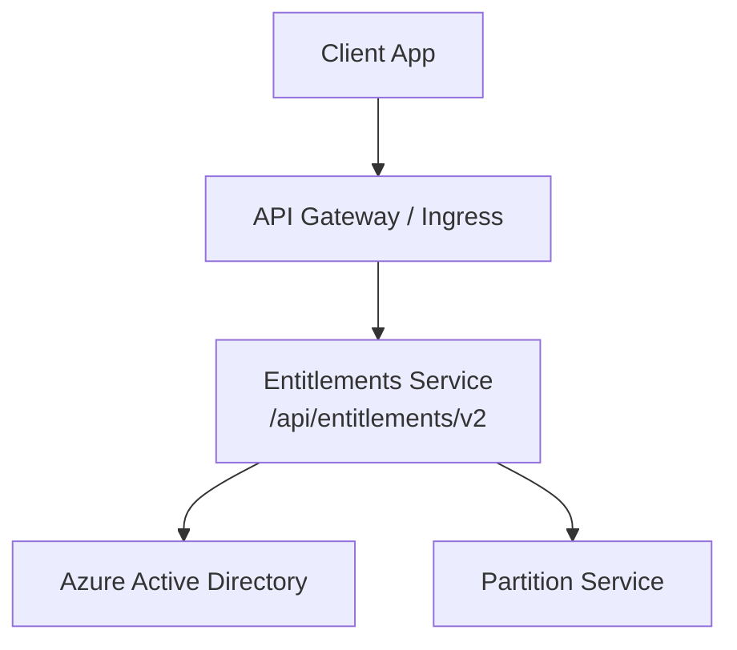
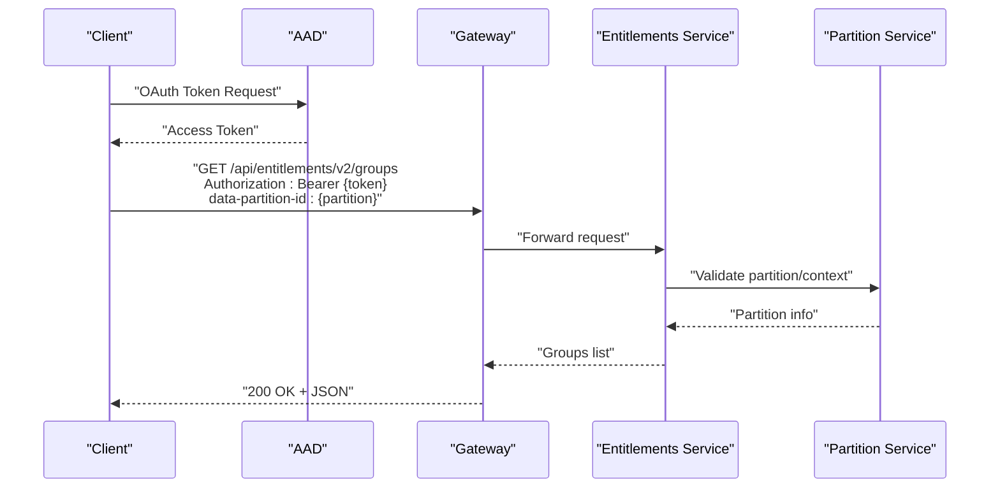
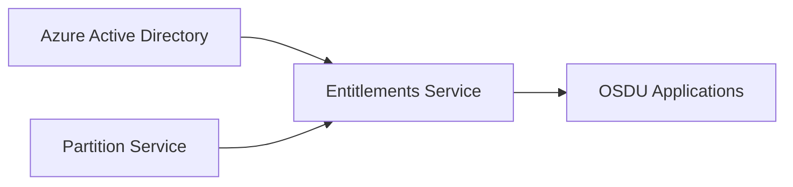

# Entitlements Service API

<cite>
**Referenced Files in This Document**
- [entitlement.http](file://tools/rest-scripts/entitlement.http)
- [admin.http](file://tools/rest-scripts/admin.http)
- [services_core_entitlements.md](file://docs/src/services_core_entitlements.md)
- [entitlements.yaml](file://software/applications/osdu-core/entitlements.yaml)
</cite>

## Table of Contents
1. Introduction
2. Project Structure
3. Core Components
4. Architecture Overview
5. Detailed Component Analysis
6. Dependency Analysis
7. Performance Considerations
8. Troubleshooting Guide
9. Conclusion

## Introduction
This document provides detailed API documentation for the OSDU Entitlements service as used in this repository. It covers REST endpoints for managing user permissions, roles, and access controls; authentication and authorization flows using Azure Active Directory (AAD); request/response schemas inferred from sample scripts; and practical examples for granting and revoking access to partitions and resources. It also outlines the entitlement model including user-to-partition mappings, group-based roles, and inheritance patterns observed through group membership.

## Project Structure
The entitlements functionality is exercised via HTTP client samples and deployed with Kubernetes manifests that configure the service context path and security exemptions. The key artifacts are:
- HTTP client samples demonstrating OAuth flows and API calls
- Deployment configuration exposing the service under a specific base path
- Developer documentation describing local run configuration and environment variables

**Diagram sources**
- [entitlements.yaml:63-103](file://software/applications/osdu-core/entitlements.yaml#L63-L103)
- [services_core_entitlements.md:14-28](file://docs/src/services_core_entitlements.md#L14-L28)

**Section sources**
- [entitlements.yaml:63-103](file://software/applications/osdu-core/entitlements.yaml#L63-L103)
- [services_core_entitlements.md:14-28](file://docs/src/services_core_entitlements.md#L14-L28)

## Core Components
- Authentication: OAuth 2.0 via AAD using either refresh token or client credentials flow.
- Authorization: Bearer tokens validated by the gateway/service; certain endpoints exempted for health/info.
- Partitioning: All requests include a data-partition-id header to scope operations per partition.
- Group-based roles: Users are assigned roles within groups; common roles include MEMBER, READER, CONTRIBUTOR, ADMIN, OPS.

Key observations:
- Base path: /api/entitlements/v2
- Exempted paths: /info, Swagger-related, webjars, actuator health
- Partition scoping: data-partition-id required on most calls

**Section sources**
- [entitlement.http:10-48](file://tools/rest-scripts/entitlement.http#L10-L48)
- [admin.http:18-52](file://tools/rest-scripts/admin.http#L18-L52)
- [entitlements.yaml:63-103](file://software/applications/osdu-core/entitlements.yaml#L63-L103)

## Architecture Overview
The entitlements service integrates with identity providers and partition management to enforce access control across the platform. Clients authenticate with AAD, obtain a bearer token, and call the entitlements endpoints scoped to a data partition.

**Diagram sources**
- [entitlement.http:36-60](file://tools/rest-scripts/entitlement.http#L36-L60)
- [entitlements.yaml:63-103](file://software/applications/osdu-core/entitlements.yaml#L63-L103)
- [services_core_entitlements.md:14-28](file://docs/src/services_core_entitlements.md#L14-L28)

## Detailed Component Analysis

### Authentication and Authorization
- OAuth flows:
  - Refresh token flow to obtain an access token for user-scoped calls
  - Client credentials flow for service-to-service admin operations
- Authorization:
  - Bearer token required on all protected endpoints
  - Some endpoints are explicitly exempted in deployment config (e.g., /info, swagger, webjars, health)

Examples:
- Obtain token via refresh token
- Call /info without auth exemption where applicable

**Section sources**
- [entitlement.http:10-48](file://tools/rest-scripts/entitlement.http#L10-L48)
- [admin.http:18-52](file://tools/rest-scripts/admin.http#L18-L52)
- [entitlements.yaml:63-73](file://software/applications/osdu-core/entitlements.yaml#L63-L73)

### Endpoints Reference

#### Version and Discovery
- GET /api/entitlements/v2/info
  - Purpose: Retrieve service version/info
  - Auth: Bearer token (may be exempted depending on deployment)
  - Headers: Accept: application/json
  - Response: Service metadata (JSON)

**Section sources**
- [entitlement.http:44-48](file://tools/rest-scripts/entitlement.http#L44-L48)
- [admin.http:47-52](file://tools/rest-scripts/admin.http#L47-L52)
- [entitlements.yaml:70-73](file://software/applications/osdu-core/entitlements.yaml#L70-L73)

#### Groups and Permissions
- GET /api/entitlements/v2/groups
  - Purpose: Get groups for the authenticated user
  - Auth: Bearer token
  - Headers: data-partition-id: <partition>, Accept: application/json
  - Response: Array of group identifiers

- POST /api/entitlements/v2/groups
  - Purpose: Create a new group
  - Auth: Bearer token (admin privileges typically required)
  - Headers: data-partition-id: <partition>, Content-Type: application/json
  - Request body: name, description
  - Response: Created group details

- GET /api/entitlements/v2/groups/{group}
  - Purpose: List members of a group
  - Auth: Bearer token
  - Headers: data-partition-id: <partition>
  - Response: Array of member entries

- POST /api/entitlements/v2/groups/{group}/members
  - Purpose: Add a member to a group
  - Auth: Bearer token
  - Headers: data-partition-id: <partition>, Content-Type: application/json
  - Request body: email, role
  - Response: Member assignment confirmation

- DELETE /api/entitlements/v2/groups/{group}/members/{email}
  - Purpose: Remove a member from a group
  - Auth: Bearer token
  - Headers: data-partition-id: <partition>
  - Response: Deletion confirmation

Notes:
- Group identifier format includes domain and partition: {name}@{DATA_PARTITION}.{domain}
- Roles observed: MEMBER, READER, CONTRIBUTOR, ADMIN, OPS

**Section sources**
- [entitlement.http:54-60](file://tools/rest-scripts/entitlement.http#L54-L60)
- [admin.http:106-151](file://tools/rest-scripts/admin.http#L106-L151)
- [admin.http:172-264](file://tools/rest-scripts/admin.http#L172-L264)
- [admin.http:267-342](file://tools/rest-scripts/admin.http#L267-L342)

#### User Management
- GET /api/entitlements/v2/members/{email}/groups?type=none
  - Purpose: Validate groups for a user
  - Auth: Bearer token
  - Headers: data-partition-id: <partition>
  - Response: User’s groups

- DELETE /api/entitlements/v2/members/{email}
  - Purpose: Delete a user
  - Auth: Bearer token
  - Headers: data-partition-id: <partition>
  - Response: Deletion confirmation

**Section sources**
- [admin.http:191-199](file://tools/rest-scripts/admin.http#L191-L199)
- [admin.http:349-356](file://tools/rest-scripts/admin.http#L349-L356)

#### Tenant Provisioning
- POST /api/entitlements/v2/tenant-provisioning
  - Purpose: Initialize a partition (service principal only)
  - Auth: Bearer token (service principal)
  - Headers: data-partition-id: <partition>
  - Response: Provisioning status

**Section sources**
- [admin.http:84-100](file://tools/rest-scripts/admin.http#L84-L100)

### Request and Response Schemas
- Common headers:
  - Authorization: Bearer {access_token}
  - data-partition-id: {partition}
  - Accept: application/json
  - Content-Type: application/json (for POST/DELETE with bodies)

- Group creation request:
  - Fields: name (string), description (string)

- Member assignment request:
  - Fields: email (string), role (string)

- Typical responses:
  - Success: 2xx with JSON payload reflecting created/updated entities or lists
  - Errors: 4xx/5xx with error details (not shown in samples)

**Section sources**
- [admin.http:106-118](file://tools/rest-scripts/admin.http#L106-L118)
- [admin.http:125-137](file://tools/rest-scripts/admin.http#L125-L137)
- [admin.http:172-184](file://tools/rest-scripts/admin.http#L172-L184)

### Entitlement Model
- User-to-partition mapping:
  - Users are associated with groups scoped to a partition via the group identifier containing the partition and domain
  - Operations require data-partition-id to ensure correct scoping

- Role hierarchy and inheritance:
  - Roles such as READER, CONTRIBUTOR, ADMIN, OPS imply increasing privileges
  - Membership in multiple groups can combine permissions
  - Example roles observed: MEMBER, READER, CONTRIBUTOR, ADMIN, OPS

- Inheritance patterns:
  - Group membership grants roles; users inherit permissions based on their group memberships
  - Admin and OPS roles may have elevated capabilities (e.g., deletion restrictions noted for Legal/Schema/Storage)

**Section sources**
- [admin.http:63-68](file://tools/rest-scripts/admin.http#L63-L68)
- [admin.http:233-264](file://tools/rest-scripts/admin.http#L233-L264)
- [admin.http:267-342](file://tools/rest-scripts/admin.http#L267-L342)

### Practical Examples

#### Grant Access to a Partition
- Create a group for the partition
- Assign users to the group with appropriate roles
- Ensure data-partition-id is set on all calls

References:
- Create group and assign members
- Use partition-scoped group identifiers

**Section sources**
- [admin.http:106-137](file://tools/rest-scripts/admin.http#L106-L137)
- [admin.http:172-264](file://tools/rest-scripts/admin.http#L172-L264)

#### Revoke Access
- Remove users from groups using DELETE endpoints
- Confirm removal by listing group members

References:
- Remove members from viewer/editor/admin/ops groups

**Section sources**
- [admin.http:305-342](file://tools/rest-scripts/admin.http#L305-L342)

#### Integration with Identity Providers
- Use AAD OAuth flows to obtain tokens
- For service-to-service calls, use client credentials flow
- For user actions, use refresh token flow

References:
- OAuth token acquisition examples

**Section sources**
- [entitlement.http:10-48](file://tools/rest-scripts/entitlement.http#L10-L48)
- [admin.http:18-52](file://tools/rest-scripts/admin.http#L18-L52)

## Dependency Analysis
The entitlements service depends on:
- Azure Active Directory for authentication
- Partition service for partition validation and context
- Kubernetes ingress/gateway for routing and security policies

**Diagram sources**
- [services_core_entitlements.md:14-28](file://docs/src/services_core_entitlements.md#L14-L28)
- [entitlements.yaml:63-103](file://software/applications/osdu-core/entitlements.yaml#L63-L103)

**Section sources**
- [services_core_entitlements.md:14-28](file://docs/src/services_core_entitlements.md#L14-L28)
- [entitlements.yaml:63-103](file://software/applications/osdu-core/entitlements.yaml#L63-L103)

## Performance Considerations
- Cache TTL: Redis TTL configured for short intervals to reduce load
- Stateless sessions: Enabled for AAD to improve scalability
- Health checks: Actuator endpoints exposed for liveness/readiness

Recommendations:
- Use efficient token caching on clients
- Batch group membership queries where possible
- Monitor health endpoints and scale horizontally as needed

**Section sources**
- [services_core_entitlements.md:24-28](file://docs/src/services_core_entitlements.md#L24-L28)
- [entitlements.yaml:55-73](file://software/applications/osdu-core/entitlements.yaml#L55-L73)

## Troubleshooting Guide
Common issues and resolutions:
- Missing data-partition-id: Ensure the header is included on all scoped requests
- Unauthorized errors: Verify bearer token validity and scopes
- Endpoint not found: Confirm base path /api/entitlements/v2 and correct URL patterns
- Health/info access: Some endpoints are exempted; others require authentication

Debugging steps:
- Use /info endpoint to verify service availability
- Check gateway logs for routing and auth failures
- Validate AAD token issuance and expiration

**Section sources**
- [entitlement.http:44-60](file://tools/rest-scripts/entitlement.http#L44-L60)
- [admin.http:47-52](file://tools/rest-scripts/admin.http#L47-L52)
- [entitlements.yaml:63-73](file://software/applications/osdu-core/entitlements.yaml#L63-L73)

## Conclusion
The OSDU Entitlements service provides group-based access control with partition scoping, integrated with AAD for authentication. The documented endpoints enable creating groups, assigning roles, querying permissions, and managing users. By following the provided examples and adhering to the partition and authentication requirements, integrators can implement robust access control workflows aligned with OSDU best practices.