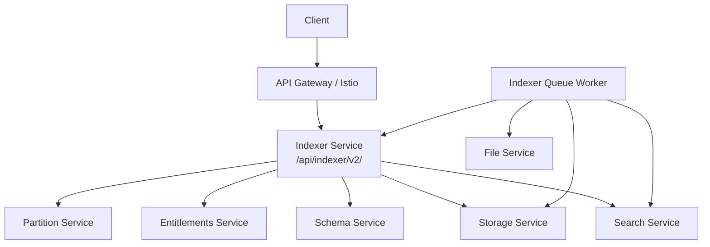
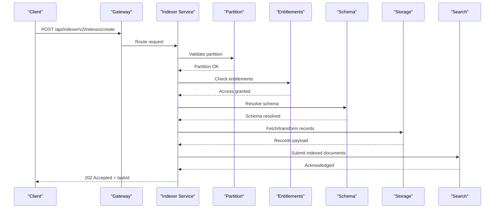
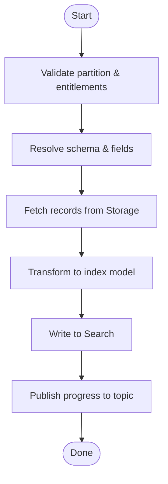
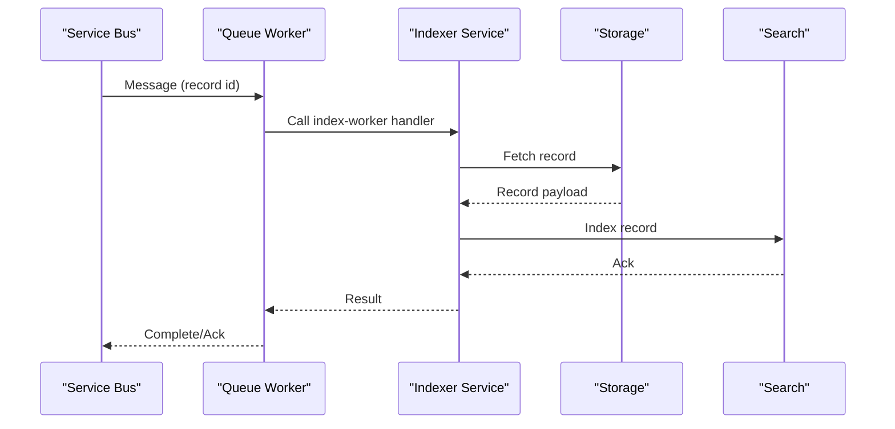
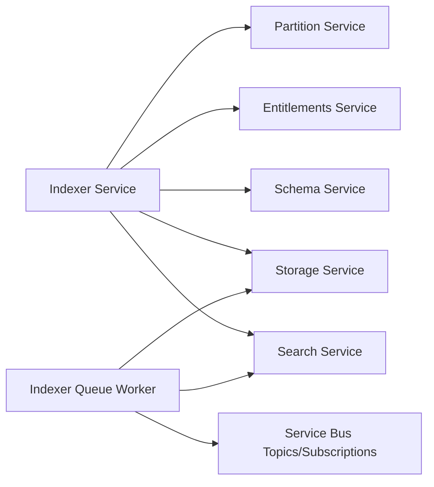

# Indexer Service API

<cite>
**Referenced Files in This Document**
- [services_core_indexer.md](file://docs/src/services_core_indexer.md)
- [indexer.yaml](file://software/applications/osdu-core/indexer.yaml)
- [docker-bake.hcl](file://src/docker-bake.hcl)
</cite>

## Table of Contents
1. Introduction
2. Project Structure
3. Core Components
4. Architecture Overview
5. Detailed Component Analysis
6. Dependency Analysis
7. Performance Considerations
8. Troubleshooting Guide
9. Conclusion

## Introduction
This document provides API documentation for the OSDU Indexer service, focusing on data indexing endpoints, search query execution, and ingestion monitoring. It outlines HTTP methods, URL patterns, request/response schemas for index creation, query submission, and status tracking. It also includes practical examples for batch processing, real-time indexing, search optimization, pipeline configuration, queue management, error handling, custom indexer setup, performance tuning, and progress/failure monitoring.

## Project Structure
The OSDU platform exposes the Indexer service under a versioned context path and integrates with other core services (Partition, Entitlements, Schema, Storage, Search). The deployment configuration defines the base path, authentication exemptions, health probes, environment variables, and integration endpoints.

**Diagram sources**
- [indexer.yaml:38-129](file://software/applications/osdu-core/indexer.yaml#L38-L129)

**Section sources**
- [indexer.yaml:38-129](file://software/applications/osdu-core/indexer.yaml#L38-L129)
- [docker-bake.hcl:98-118](file://src/docker-bake.hcl#L98-L118)

## Core Components
- Indexer Service: Exposes REST APIs under /api/indexer/v2/ for indexing operations, including index creation, query submission, and status tracking. It integrates with Partition, Entitlements, Schema, Storage, and Search services.
- Indexer Queue Worker: Consumes messages from Azure Service Bus topics to drive background indexing tasks and interacts with Storage, File, and Search services.

Key configuration highlights:
- Base path: /api/indexer/v2/
- Health endpoint: /actuator/health
- Authentication exemptions include info, swagger, api-docs, webjars, index-worker, task-handlers, and reindex endpoints.
- Environment variables configure external service endpoints and topic names for progress and reindexing.

**Section sources**
- [indexer.yaml:38-129](file://software/applications/osdu-core/indexer.yaml#L38-L129)
- [services_core_indexer.md:1-31](file://docs/src/services_core_indexer.md#L1-L31)

## Architecture Overview
The Indexer service coordinates indexing workflows by interacting with core OSDU services. Clients submit indexing requests via REST; the service validates partition and entitlements, retrieves or transforms records via Storage and Schema, and writes indexed content to Search. Background workers process queued tasks asynchronously.

**Diagram sources**
- [indexer.yaml:38-129](file://software/applications/osdu-core/indexer.yaml#L38-L129)

## Detailed Component Analysis

### REST Endpoints
Base path: /api/indexer/v2/

- Index Creation
  - Method: POST
  - Path: /api/indexer/v2/indexes/create
  - Description: Create an index definition or trigger indexing workflow for a given schema/partition.
  - Request headers:
    - Authorization: Bearer <token>
    - data-partition-id: <partition>
  - Request body: Index creation payload (schema-specific; see your OpenAPI docs at /api/indexer/v2/api-docs).
  - Response: 202 Accepted with taskId for asynchronous processing.

- Query Submission
  - Method: POST
  - Path: /api/indexer/v2/queries
  - Description: Submit a search query to be executed against indexed data.
  - Request headers:
    - Authorization: Bearer <token>
    - data-partition-id: <partition>
  - Request body: Query specification (filters, facets, pagination; see OpenAPI).
  - Response: 200 OK with results or 202 Accepted with taskId if async.

- Status Tracking
  - Method: GET
  - Path: /api/indexer/v2/tasks/{taskId}
  - Description: Retrieve the status of a previously submitted task (create index, run query).
  - Request headers:
    - Authorization: Bearer <token>
  - Response: Task status object (status, progress, errors).

- Info and Documentation
  - Method: GET
  - Path: /api/indexer/v2/info
  - Description: Service information and capabilities. No auth required per configuration.

- Swagger/OpenAPI
  - Method: GET
  - Path: /api/indexer/v2/swagger-ui.html or /api/indexer/v2/api-docs
  - Description: Interactive API documentation and JSON spec.

Notes:
- Authentication exemptions are configured for info, swagger, api-docs, webjars, index-worker, task-handlers, and reindex endpoints.
- Use the data-partition-id header for multi-tenant isolation.

**Section sources**
- [indexer.yaml:57-70](file://software/applications/osdu-core/indexer.yaml#L57-L70)
- [indexer.yaml:98-129](file://software/applications/osdu-core/indexer.yaml#L98-L129)

### Indexing Pipeline
The indexing pipeline orchestrates validation, transformation, and persistence steps:

**Diagram sources**
- [indexer.yaml:112-129](file://software/applications/osdu-core/indexer.yaml#L112-L129)

### Queue Management
Background workers consume messages from Azure Service Bus topics to perform indexing tasks asynchronously. Topics and subscriptions are configured for record processing and schema change events.

- Topics:
  - Record processing topic
  - Reindex topic
  - Schema changed topic

- Subscriptions:
  - Record processing subscription
  - Reindex subscription
  - Schema changed subscription

- Concurrency and retries:
  - MAX_CONCURRENT_CALLS
  - MAX_DELIVERY_COUNT
  - EXECUTOR_N_THREADS
  - MAX_LOCK_RENEW_DURATION_SECONDS

**Diagram sources**
- [indexer.yaml:178-228](file://software/applications/osdu-core/indexer.yaml#L178-L228)

**Section sources**
- [indexer.yaml:178-228](file://software/applications/osdu-core/indexer.yaml#L178-L228)

### Error Handling
- Health checks: /actuator/health exposed for liveness/readiness.
- Authentication exemptions allow unauthenticated access to health, info, swagger, and specific worker endpoints.
- Topic delivery limits and retry policies help manage transient failures.

Operational tips:
- Monitor /actuator/health for service status.
- Inspect logs and Application Insights for errors.
- Adjust MAX_DELIVERY_COUNT and concurrency settings based on workload.

**Section sources**
- [indexer.yaml:50-70](file://software/applications/osdu-core/indexer.yaml#L50-L70)
- [indexer.yaml:215-222](file://software/applications/osdu-core/indexer.yaml#L215-L222)

### Practical Examples

- Batch Processing
  - Use the Storage batch query endpoint to fetch large datasets for transformation and bulk indexing.
  - Configure executor threads and concurrent calls to scale throughput.

- Real-Time Indexing
  - Trigger immediate indexing via the create index endpoint for newly ingested records.
  - Leverage task IDs to poll status until completion.

- Search Optimization
  - Tune query parameters (filters, facets, pagination) to reduce payload size.
  - Ensure proper schema field mappings for efficient indexing.

- Custom Indexers
  - Implement custom handlers under task-handlers to extend indexing logic.
  - Register new handlers and expose them via the indexer service.

- Monitoring Progress and Failures
  - Poll /api/indexer/v2/tasks/{taskId} to track progress.
  - Use Application Insights and Service Bus diagnostics to identify bottlenecks and failures.

[No sources needed since this section provides general guidance]

## Dependency Analysis
The Indexer service depends on several core services and uses Azure Service Bus for asynchronous processing.

**Diagram sources**
- [indexer.yaml:112-129](file://software/applications/osdu-core/indexer.yaml#L112-L129)
- [indexer.yaml:178-228](file://software/applications/osdu-core/indexer.yaml#L178-L228)

**Section sources**
- [indexer.yaml:112-129](file://software/applications/osdu-core/indexer.yaml#L112-L129)
- [indexer.yaml:178-228](file://software/applications/osdu-core/indexer.yaml#L178-L228)

## Performance Considerations
- Concurrency: Increase MAX_CONCURRENT_CALLS and EXECUTOR_N_THREADS to handle higher throughput.
- Retries: Tune MAX_DELIVERY_COUNT to balance reliability and latency.
- Lock Renewal: Adjust MAX_LOCK_RENEW_DURATION_SECONDS for long-running tasks.
- Batch Queries: Use Storage batch endpoints to minimize network overhead.
- Caching: Consider caching frequently accessed schemas or metadata where appropriate.

[No sources needed since this section provides general guidance]

## Troubleshooting Guide
- Health Checks: Verify /actuator/health returns healthy status.
- Authentication: Ensure tokens are valid and partitions are correctly set via headers.
- Queues: Check Service Bus topics/subscriptions for message flow and dead-letter queues.
- Logs: Review Application Insights for errors and performance metrics.
- Configuration: Validate environment variables for service endpoints and topic names.

**Section sources**
- [indexer.yaml:50-70](file://software/applications/osdu-core/indexer.yaml#L50-L70)
- [indexer.yaml:112-129](file://software/applications/osdu-core/indexer.yaml#L112-L129)
- [indexer.yaml:178-228](file://software/applications/osdu-core/indexer.yaml#L178-L228)

## Conclusion
The OSDU Indexer service provides robust REST APIs for creating indexes, submitting queries, and tracking task status. It integrates seamlessly with core OSDU services and leverages Azure Service Bus for scalable, asynchronous processing. By tuning concurrency, retries, and leveraging batch operations, you can optimize performance and reliability for both batch and real-time indexing scenarios.

[No sources needed since this section summarizes without analyzing specific files]