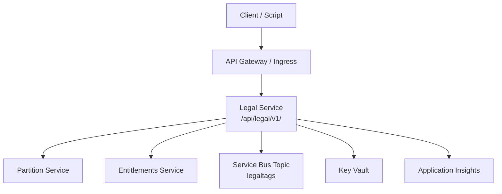
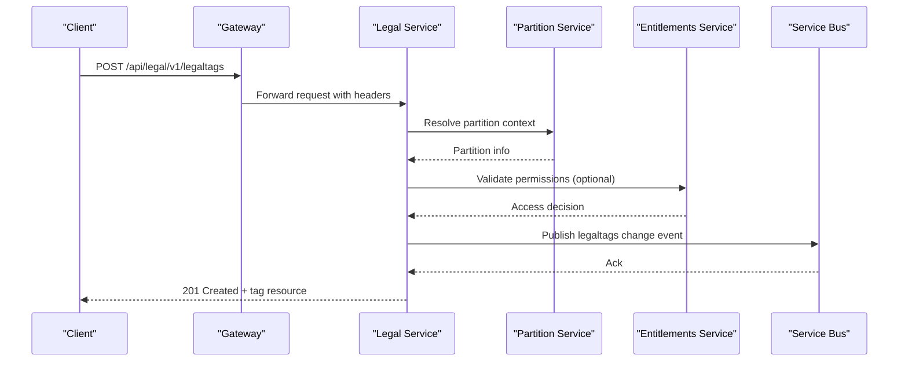
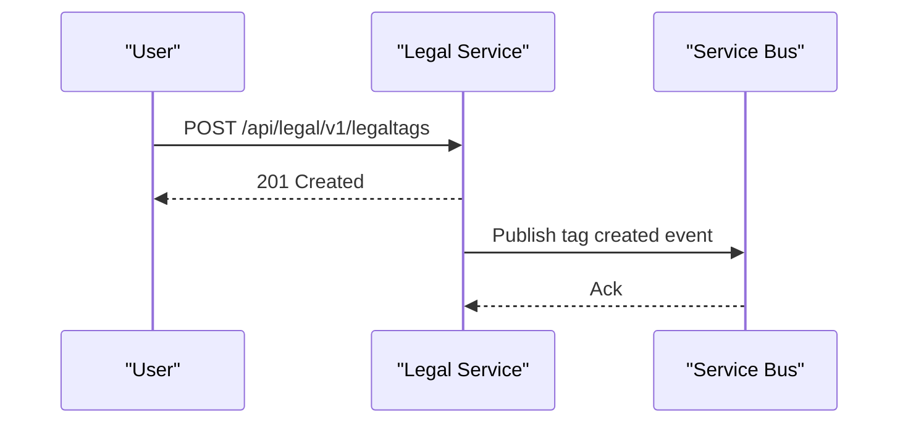
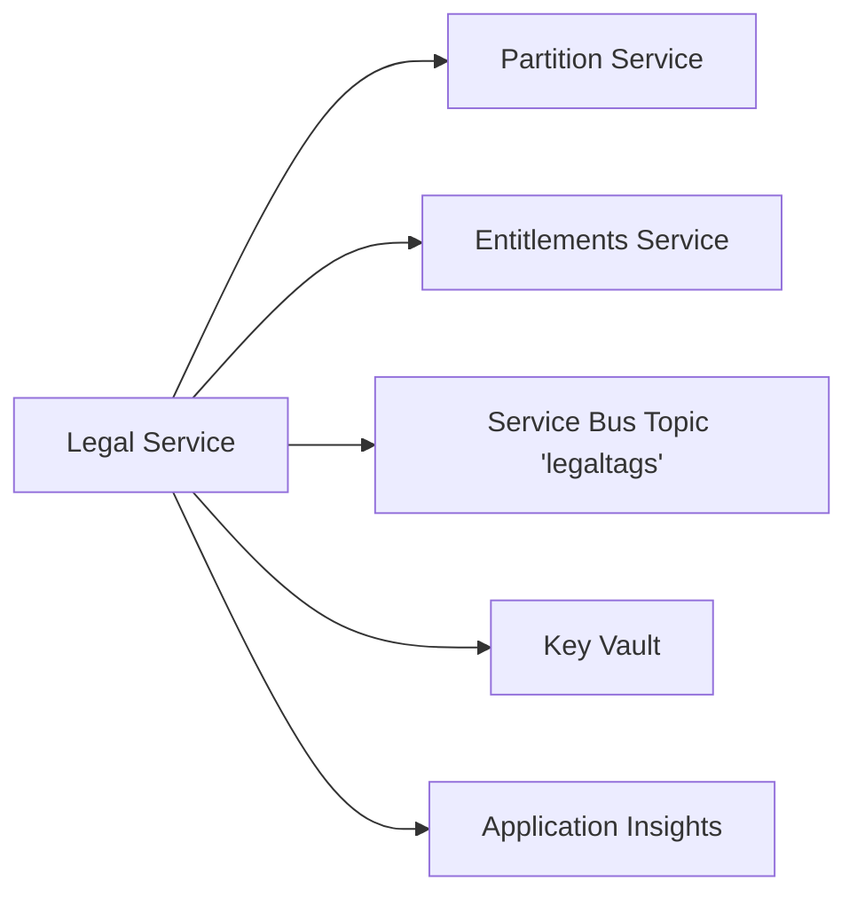

# Legal Service API

<cite>
**Referenced Files in This Document**
- [services_core_legal.md](file://docs/src/services_core_legal.md)
- [legal.http](file://tools/rest-scripts/legal.http)
- [check-file.http](file://tools/rest-scripts/check-file.http)
- [check-ingest.http](file://tools/rest-scripts/check-ingest.http)
- [storage.http](file://tools/rest-scripts/storage.http)
- [legal.yaml](file://software/applications/osdu-core/legal.yaml)
- [README.md](file://src/core/README.md)
</cite>

## Table of Contents
1. [Introduction](#introduction)
2. [Project Structure](#project-structure)
3. [Core Components](#core-components)
4. [Architecture Overview](#architecture-overview)
5. [Detailed Component Analysis](#detailed-component-analysis)
6. [Dependency Analysis](#dependency-analysis)
7. [Performance Considerations](#performance-considerations)
8. [Troubleshooting Guide](#troubleshooting-guide)
9. [Conclusion](#conclusion)
10. [Appendices](#appendices)

## Introduction
This document provides comprehensive API documentation for the OSDU Legal service, focusing on managing legal tags and supporting compliance workflows. It covers REST endpoints for creating, retrieving, updating, and deleting legal tags; querying tag properties; and integrating with other OSDU services such as Storage, Entitlements, and Partition. It also outlines the legal framework including tag types, policy enforcement mechanisms, and audit capabilities based on configuration and observed usage patterns.

## Project Structure
The Legal service is deployed as part of the core services stack and exposed under a dedicated path. The deployment configuration defines the service context path, authentication exemptions, and environment variables required to operate within the platform.

**Diagram sources**
- [legal.yaml:42-73](file://software/applications/osdu-core/legal.yaml#L42-L73)
- [legal.yaml:74-124](file://software/applications/osdu-core/legal.yaml#L74-L124)

**Section sources**
- [legal.yaml:42-73](file://software/applications/osdu-core/legal.yaml#L42-L73)
- [legal.yaml:74-124](file://software/applications/osdu-core/legal.yaml#L74-L124)

## Core Components
- Legal Tags API: Create, read, update, delete, list, and query tag properties.
- Integration Points:
  - Partition Service: Used to resolve data partitions and tenant context.
  - Entitlements Service: Used for access control and group-based permissions.
  - Service Bus: Emits events when legal tags change (topic name configured).
  - Key Vault and Application Insights: Secrets management and telemetry.

Authentication and authorization are enforced via Azure Active Directory and Istio where enabled. Certain endpoints are exempted from auth for health checks and public metadata.

**Section sources**
- [legal.yaml:63-73](file://software/applications/osdu-core/legal.yaml#L63-L73)
- [legal.yaml:74-124](file://software/applications/osdu-core/legal.yaml#L74-L124)
- [README.md:104-152](file://src/core/README.md#L104-L152)

## Architecture Overview
The Legal service exposes a REST API under a fixed base path. Clients authenticate using OAuth bearer tokens and include a data partition header. The service interacts with backend systems for partition resolution, entitlement checks, and event publishing.

**Diagram sources**
- [legal.yaml:42-73](file://software/applications/osdu-core/legal.yaml#L42-L73)
- [legal.yaml:74-124](file://software/applications/osdu-core/legal.yaml#L74-L124)
- [legal.http:68-89](file://tools/rest-scripts/legal.http#L68-L89)

## Detailed Component Analysis

### Legal Tags Endpoints
All endpoints require:
- Authorization: Bearer token
- Header: data-partition-id
- Base path: /api/legal/v1

Endpoints:
- GET /info
  - Purpose: Service information endpoint
  - Auth exemption: Enabled by configuration
  - Headers: Accept: application/json

- GET /legaltags:properties
  - Purpose: Retrieve supported tag property definitions or metadata
  - Headers: data-partition-id

- GET /legaltags
  - Purpose: List all legal tags in the partition
  - Headers: data-partition-id

- POST /legaltags
  - Purpose: Create a new legal tag
  - Request body fields:
    - name: string (unique within partition)
    - description: string
    - properties: object containing tag attributes such as:
      - countryOfOrigin: array of strings
      - contractId: string
      - expirationDate: string (date)
      - originator: string
      - dataType: string
      - securityClassification: string
      - personalData: string
      - exportClassification: string

- GET /legaltags/{id}
  - Purpose: Retrieve a specific legal tag by id
  - Path parameter: id can be either {DATA_PARTITION}-{tag} or just {tag} depending on usage
  - Headers: data-partition-id

- PUT /legaltags
  - Purpose: Update an existing legal tag
  - Request body fields:
    - name: string (target tag identity)
    - description: string
    - contractId: string
    - expirationDate: string (date)

- DELETE /legaltags/{id}
  - Purpose: Delete a legal tag by id
  - Path parameter: id can be either {DATA_PARTITION}-{tag} or just {tag}
  - Headers: data-partition-id

Notes:
- Some scripts demonstrate both forms of the id path segment:
  - Full form: {DATA_PARTITION}-{tag}
  - Short form: {tag}
- All requests must include the data-partition-id header.

Examples:
- Creating a tag: See [legal.http:68-89](file://tools/rest-scripts/legal.http#L68-L89), [check-file.http:60-81](file://tools/rest-scripts/check-file.http#L60-L81), [check-ingest.http:70-91](file://tools/rest-scripts/check-ingest.http#L70-L91), [storage.http:66-87](file://tools/rest-scripts/storage.http#L66-L87)
- Retrieving a tag: See [legal.http:92-97](file://tools/rest-scripts/legal.http#L92-L97), [check-file.http:84-89](file://tools/rest-scripts/check-file.http#L84-L89), [check-ingest.http:94-99](file://tools/rest-scripts/check-ingest.http#L94-L99)
- Updating a tag: See [legal.http:100-112](file://tools/rest-scripts/legal.http#L100-L112)
- Deleting a tag: See [legal.http:115-120](file://tools/rest-scripts/legal.http#L115-L120), [check-file.http:218-223](file://tools/rest-scripts/check-file.http#L218-L223), [check-ingest.http:1330-1335](file://tools/rest-scripts/check-ingest.http#L1330-L1335)

**Section sources**
- [legal.http:41-120](file://tools/rest-scripts/legal.http#L41-L120)
- [check-file.http:60-89](file://tools/rest-scripts/check-file.http#L60-L89)
- [check-file.http:218-223](file://tools/rest-scripts/check-file.http#L218-L223)
- [check-ingest.http:70-99](file://tools/rest-scripts/check-ingest.http#L70-L99)
- [storage.http:66-87](file://tools/rest-scripts/storage.http#L66-L87)

### Compliance Rules and Policy Enforcement
- Tag Properties: Tags carry structured properties that encode compliance constraints such as origin, classification, and expiration. These properties drive downstream policy decisions.
- Eventing: Changes to legal tags emit events to a Service Bus topic named legaltags, enabling external systems to react to updates.
- Integration:
  - Storage service references the Legal service endpoint and may enforce policies at record creation/update time.
  - Entitlements service integration supports permission checks for tag operations.

Operational notes:
- The Service Bus topic name is configurable and defaults to legaltags in local/dev configurations.
- Health and info endpoints are publicly accessible per configuration.

**Section sources**
- [legal.yaml:42-73](file://software/applications/osdu-core/legal.yaml#L42-L73)
- [legal.yaml:115-116](file://software/applications/osdu-core/legal.yaml#L115-L116)
- [README.md:104-152](file://src/core/README.md#L104-L152)

### Audit Capabilities
- Telemetry: Application Insights is configured for logging and metrics collection.
- Events: Service Bus emissions provide an audit trail for tag lifecycle changes.
- Access Control: AAD-based authentication ensures auditable access to protected endpoints.

**Section sources**
- [legal.yaml:83-90](file://software/applications/osdu-core/legal.yaml#L83-L90)
- [legal.yaml:115-116](file://software/applications/osdu-core/legal.yaml#L115-L116)

### Practical Compliance Workflows

#### Workflow: Create Compliance Rule (Tag)
- Steps:
  1. Authenticate and obtain a bearer token.
  2. Call POST /api/legal/v1/legaltags with tag definition and properties.
  3. Confirm creation response.
  4. External consumers subscribe to the legaltags topic to react to changes.

**Diagram sources**
- [legal.http:68-89](file://tools/rest-scripts/legal.http#L68-L89)
- [legal.yaml:115-116](file://software/applications/osdu-core/legal.yaml#L115-L116)

#### Workflow: Assign Tags to Records
- While tag assignment to records is typically handled by Storage or workflow integrations, the Legal service provides the authoritative tag definitions used during assignment.
- Typical pattern:
  1. Ensure the tag exists via GET /api/legal/v1/legaltags/{id}.
  2. Use Storage APIs to associate the tag with a record (outside scope of this document).
  3. Monitor Service Bus events for tag changes if needed.

**Section sources**
- [legal.http:92-97](file://tools/rest-scripts/legal.http#L92-L97)
- [legal.yaml:115-116](file://software/applications/osdu-core/legal.yaml#L115-L116)

#### Workflow: Check Legal Status
- To check whether a tag applies to a record, retrieve the tag details and evaluate its properties (e.g., expiration date, classification).
- Use GET /api/legal/v1/legaltags/{id} and inspect returned properties.

**Section sources**
- [legal.http:92-97](file://tools/rest-scripts/legal.http#L92-L97)

### Integration Patterns with External Legal Systems
- Event-driven integration:
  - Subscribe to the legaltags Service Bus topic to receive notifications when tags are created, updated, or deleted.
  - Enforce downstream policies in external systems based on tag properties.
- Synchronous validation:
  - Integrate with Storage to validate record metadata against legal tags before ingestion or exposure.

**Section sources**
- [legal.yaml:115-116](file://software/applications/osdu-core/legal.yaml#L115-L116)
- [README.md:104-152](file://src/core/README.md#L104-L152)

## Dependency Analysis
The Legal service depends on several platform services and infrastructure components:

**Diagram sources**
- [legal.yaml:42-73](file://software/applications/osdu-core/legal.yaml#L42-L73)
- [legal.yaml:74-124](file://software/applications/osdu-core/legal.yaml#L74-L124)

**Section sources**
- [legal.yaml:42-73](file://software/applications/osdu-core/legal.yaml#L42-L73)
- [legal.yaml:74-124](file://software/applications/osdu-core/legal.yaml#L74-L124)

## Performance Considerations
- Authentication overhead: Enable stateless sessions where appropriate to reduce token validation latency.
- Event throughput: Size Service Bus topics and subscriptions to handle peak tag change rates.
- Caching: Consider caching frequently accessed tag metadata behind a cache layer if read-heavy workloads are expected.
- Connection pooling: Ensure proper connection pooling for outbound calls to Partition and Entitlements services.

[No sources needed since this section provides general guidance]

## Troubleshooting Guide
Common issues and resolutions:
- Missing data-partition-id header: Ensure all requests include the data-partition-id header.
- Authentication failures: Verify bearer token validity and scopes; confirm AAD configuration.
- Endpoint not found: Confirm base path /api/legal/v1 and correct endpoint paths.
- Service Bus connectivity: Validate topic name and credentials; ensure network access to Service Bus.
- Health checks: Use /actuator/health or configured health endpoints to verify service status.

**Section sources**
- [legal.yaml:56-73](file://software/applications/osdu-core/legal.yaml#L56-L73)
- [legal.yaml:74-124](file://software/applications/osdu-core/legal.yaml#L74-L124)

## Conclusion
The OSDU Legal service provides a robust API for managing legal tags that underpin compliance and policy enforcement across the platform. By leveraging structured tag properties, event-driven architecture, and tight integration with Partition and Entitlements services, it enables scalable and auditable legal workflows. Consumers should use the documented endpoints and headers, subscribe to Service Bus events for real-time reactions, and integrate with Storage to enforce policies at record boundaries.

[No sources needed since this section summarizes without analyzing specific files]

## Appendices

### Environment Variables and Configuration Highlights
- Service base path: /api/legal/v1/
- Service Bus topic: legaltags
- Key Vault and Application Insights integration enabled
- Authentication exemptions for health and info endpoints

**Section sources**
- [legal.yaml:42-73](file://software/applications/osdu-core/legal.yaml#L42-L73)
- [legal.yaml:74-124](file://software/applications/osdu-core/legal.yaml#L74-L124)
- [services_core_legal.md:14-37](file://docs/src/services_core_legal.md#L14-L37)