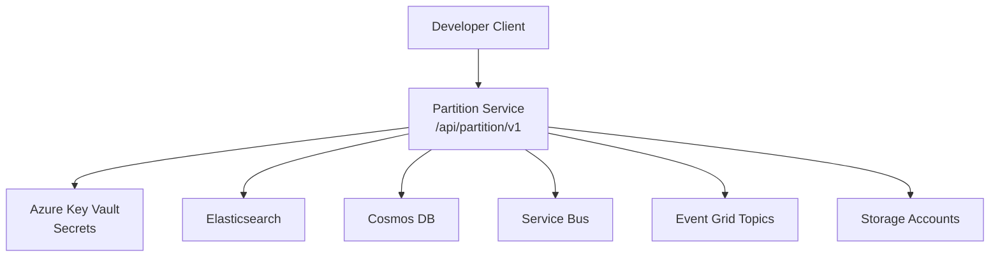
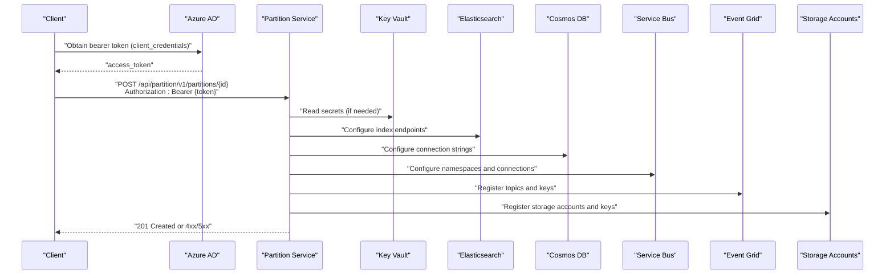
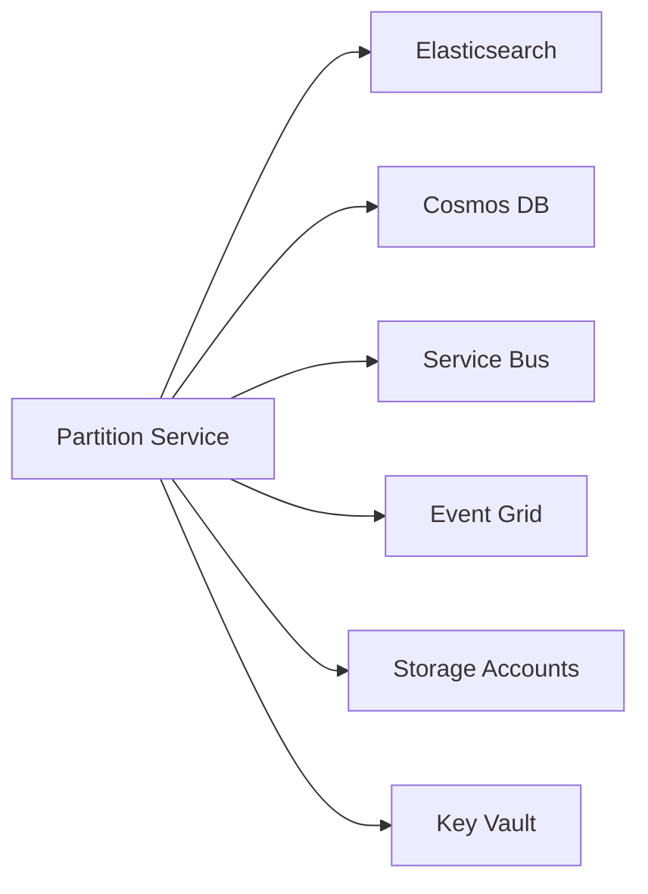

# Partition Service API

<cite>
**Referenced Files in This Document**
- [partition.http](file://tools/rest-scripts/partition.http)
- [local.http](file://tools/rest-scripts/local.http)
- [services_core_partition.md](file://docs/src/services_core_partition.md)
- [partition-init.yaml](file://charts/osdu-developer-init/templates/partition-init.yaml)
</cite>

## Table of Contents
1. [Introduction](#introduction)
2. [Project Structure](#project-structure)
3. [Core Components](#core-components)
4. [Architecture Overview](#architecture-overview)
5. [Detailed Component Analysis](#detailed-component-analysis)
6. [Dependency Analysis](#dependency-analysis)
7. [Performance Considerations](#performance-considerations)
8. [Troubleshooting Guide](#troubleshooting-guide)
9. [Conclusion](#conclusion)
10. [Appendices](#appendices)

## Introduction
This document provides comprehensive API documentation for the OSDU Partition service, focusing on partition management operations: creation, retrieval, listing, and deletion. It covers HTTP methods, URL patterns under /api/partition/v1/partitions, authentication using OAuth2 bearer tokens, request/response schemas, error handling guidance, and configuration properties for partitions including compliance rules, storage accounts, database connections, and Event Grid topics. It also explains the multi-tenant data isolation model and partition-based access control patterns used by OSDU.

## Project Structure
The repository includes sample REST client scripts that demonstrate how to interact with the Partition service, as well as deployment templates that reference the service endpoints. The key artifacts relevant to this API are:
- Sample HTTP requests for the Partition service (authentication, partition CRUD operations)
- Documentation describing local run configuration and environment variables for the Partition service
- Kubernetes/manifest template that invokes the Partition service endpoint during initialization

**Diagram sources**
- [partition.http:33-219](file://tools/rest-scripts/partition.http#L33-L219)
- [partition-init.yaml:222-222](file://charts/osdu-developer-init/templates/partition-init.yaml#L222-L222)

**Section sources**
- [partition.http:1-220](file://tools/rest-scripts/partition.http#L1-L220)
- [services_core_partition.md:1-51](file://docs/src/services_core_partition.md#L1-L51)
- [partition-init.yaml:222-222](file://charts/osdu-developer-init/templates/partition-init.yaml#L222-L222)

## Core Components
- Authentication: All requests require an OAuth2 bearer token obtained via client credentials flow.
- Base path: /api/partition/v1
- Endpoints:
  - GET /info
  - POST /partitions/{partitionId}
  - GET /partitions
  - GET /partitions/{partitionId}
  - DELETE /partitions/{partitionId}

Key behaviors:
- Requests must include Authorization: Bearer <token>
- For write operations, include data-partition-id header matching the target partition
- Request bodies use a properties object to configure partition settings such as compliance rules, storage accounts, database connections, and Event Grid topics

**Section sources**
- [partition.http:14-34](file://tools/rest-scripts/partition.http#L14-L34)
- [partition.http:41-219](file://tools/rest-scripts/partition.http#L41-L219)

## Architecture Overview
The Partition service exposes a REST API for managing logical partitions that isolate tenant data. Clients authenticate via Azure AD using client credentials, obtain a bearer token, and then call the Partition service endpoints. The service persists partition metadata and configuration, and integrates with downstream services (Elasticsearch, Cosmos DB, Service Bus, Storage Accounts, Event Grid) based on partition properties.

**Diagram sources**
- [partition.http:14-34](file://tools/rest-scripts/partition.http#L14-L34)
- [partition.http:52-197](file://tools/rest-scripts/partition.http#L52-L197)

## Detailed Component Analysis

### Authentication
- Flow: Use client credentials to obtain an access token from Azure AD.
- Header: Include Authorization: Bearer <access_token> on all Partition service calls.
- Variables: The sample script defines login and token extraction steps, then sets a base host for the Partition service.

Example references:
- Token acquisition and variable setup
- Using bearer token in subsequent requests

**Section sources**
- [partition.http:14-34](file://tools/rest-scripts/partition.http#L14-L34)

### Version Endpoint
- Method: GET
- Path: /api/partition/v1/info
- Purpose: Retrieve service information/version details.
- Auth: Requires bearer token.

Example reference:
- GET /api/partition/v1/info with bearer token

**Section sources**
- [partition.http:41-46](file://tools/rest-scripts/partition.http#L41-L46)

### Create Partition
- Method: POST
- Path: /api/partition/v1/partitions/{partitionId}
- Headers:
  - Authorization: Bearer <token>
  - Content-Type: application/json
  - data-partition-id: <partitionId>
- Body: JSON object containing a properties map to configure the partition.

Properties commonly configured include:
- compliance-ruleset
- elastic-endpoint, elastic-username, elastic-password
- cosmos-connection, cosmos-endpoint, cosmos-primary-key
- sb-connection, sb-namespace
- storage-account-name, storage-account-key, storage-account-blob-endpoint
- ingest-storage-account-name, ingest-storage-account-key
- hierarchical-storage-account-name, hierarchical-storage-account-key
- eventgrid-recordstopic, eventgrid-recordstopic-accesskey
- eventgrid-legaltagschangedtopic, eventgrid-legaltagschangedtopic-accesskey
- eventgrid-resourcegroup
- encryption-key-identifier
- sdms-storage-account-name, sdms-storage-account-key
- eventgrid-schemanotificationtopic, eventgrid-schemanotificationtopic-accesskey
- eventgrid-gsmtopic, eventgrid-gsmtopic-accesskey
- eventgrid-statuschangedtopic, eventgrid-statuschangedtopic-accesskey
- eventgrid-schemachangedtopic, eventgrid-schemachangedtopic-accesskey
- reservoir-connection
- indexer-decimation-enabled

Notes:
- Sensitive values should be stored securely; the sample marks many properties as sensitive.
- Ensure the partitionId matches the data-partition-id header.

Example reference:
- POST /api/partition/v1/partitions/{data_partition_id} with full properties payload

**Section sources**
- [partition.http:52-197](file://tools/rest-scripts/partition.http#L52-L197)

### List Partitions
- Method: GET
- Path: /api/partition/v1/partitions
- Purpose: Retrieve all available partitions.
- Auth: Requires bearer token.

Example reference:
- GET /api/partition/v1/partitions with bearer token

**Section sources**
- [partition.http:200-205](file://tools/rest-scripts/partition.http#L200-L205)

### Get Partition
- Method: GET
- Path: /api/partition/v1/partitions/{partitionId}
- Purpose: Retrieve details for a specific partition.
- Auth: Requires bearer token.

Example reference:
- GET /api/partition/v1/partitions/{partitionId} with bearer token

**Section sources**
- [partition.http:207-212](file://tools/rest-scripts/partition.http#L207-L212)

### Delete Partition
- Method: DELETE
- Path: /api/partition/v1/partitions/{partitionId}
- Purpose: Remove a partition.
- Headers:
  - Authorization: Bearer <token>
  - data-partition-id: <partitionId>

Example reference:
- DELETE /api/partition/v1/partitions/{data_partition_id} with bearer token

**Section sources**
- [partition.http:214-219](file://tools/rest-scripts/partition.http#L214-L219)

### Local Script Usage
Additional examples in the local script demonstrate:
- Creating a partition
- Listing partitions
- Getting a specific partition
- Deleting a partition

These can be used as practical references when testing locally.

**Section sources**
- [local.http:48-48](file://tools/rest-scripts/local.http#L48-L48)
- [local.http:195-195](file://tools/rest-scripts/local.http#L195-L195)
- [local.http:206-206](file://tools/rest-scripts/local.http#L206-L206)
- [local.http:213-213](file://tools/rest-scripts/local.http#L213-L213)

## Dependency Analysis
The Partition service depends on several cloud resources configured via partition properties:
- Elasticsearch: indexing and search
- Cosmos DB: metadata storage
- Service Bus: messaging
- Event Grid: event routing for records, legal tags, schema changes, status changes
- Storage Accounts: blob/file storage for data and ingestion
- Key Vault: secure secret management

Integration points are driven by the properties provided at partition creation time.

**Diagram sources**
- [partition.http:52-197](file://tools/rest-scripts/partition.http#L52-L197)

**Section sources**
- [partition.http:52-197](file://tools/rest-scripts/partition.http#L52-L197)

## Performance Considerations
- Batch operations: Prefer listing and retrieving only necessary partitions to reduce payload size.
- Property minimization: Provide only required properties to avoid unnecessary resource provisioning.
- Secrets management: Store sensitive values in Key Vault and reference them securely to minimize exposure and improve performance.
- Idempotency: Design clients to handle retries safely for create/list/get/delete operations.

[No sources needed since this section provides general guidance]

## Troubleshooting Guide
Common issues and resolutions:
- Authentication failures:
  - Ensure the bearer token is valid and corresponds to the correct audience/resource.
  - Verify client credentials and permissions in Azure AD.
- Missing headers:
  - Include Authorization: Bearer <token> on all requests.
  - For write operations, include data-partition-id header matching the target partition.
- Invalid properties:
  - Validate property names and values; ensure sensitive fields are correctly set.
  - Confirm connectivity to referenced services (Elasticsearch, Cosmos DB, Service Bus, Event Grid, Storage Accounts).
- Service availability:
  - Check service health via GET /api/partition/v1/info.
  - Review logs and monitoring for errors during partition creation.

Operational notes:
- Local development requires setting environment variables as documented for the Partition service.
- Initialization scripts may invoke the Partition service endpoint during deployment; ensure the service is reachable and properly authenticated.

**Section sources**
- [services_core_partition.md:14-29](file://docs/src/services_core_partition.md#L14-L29)
- [partition-init.yaml:222-222](file://charts/osdu-developer-init/templates/partition-init.yaml#L222-L222)

## Conclusion
The OSDU Partition service provides a RESTful interface to manage logical partitions that enforce multi-tenant data isolation. By authenticating with OAuth2 bearer tokens and configuring partition properties, clients can provision isolated environments backed by Elasticsearch, Cosmos DB, Service Bus, Event Grid, and Storage Accounts. Use the included sample scripts to test and validate partition lifecycle operations, and follow best practices for security, performance, and reliability.

[No sources needed since this section summarizes without analyzing specific files]

## Appendices

### API Reference Summary
- Base path: /api/partition/v1
- Endpoints:
  - GET /info
  - POST /partitions/{partitionId}
  - GET /partitions
  - GET /partitions/{partitionId}
  - DELETE /partitions/{partitionId}

Authentication:
- OAuth2 bearer token via client credentials
- Include Authorization: Bearer <token> on all requests

Headers:
- data-partition-id: Required for write operations to specify target partition

Request body (create):
- properties: Map of configuration keys/values for compliance, storage, databases, messaging, events, and indexing

Response codes:
- 201 Created: Successful partition creation
- 200 OK: Successful read operations
- 4xx: Client errors (e.g., invalid token, missing headers, invalid properties)
- 5xx: Server errors (e.g., service unavailability, internal errors)

Example references:
- Authentication and token usage
- Create partition with full properties
- List and get partitions
- Delete partition

**Section sources**
- [partition.http:14-34](file://tools/rest-scripts/partition.http#L14-L34)
- [partition.http:41-46](file://tools/rest-scripts/partition.http#L41-L46)
- [partition.http:52-197](file://tools/rest-scripts/partition.http#L52-L197)
- [partition.http:200-219](file://tools/rest-scripts/partition.http#L200-L219)

### Multi-Tenant Data Isolation and Access Control
- Partition-based isolation: Each partition represents a tenant boundary, isolating data and configuration.
- Access control: Enforced via bearer tokens and entitlements; only authorized users can operate within a specified partition.
- Configuration-driven integration: Partition properties determine which backend resources are used, ensuring strict separation per tenant.

[No sources needed since this section doesn't analyze specific source files]