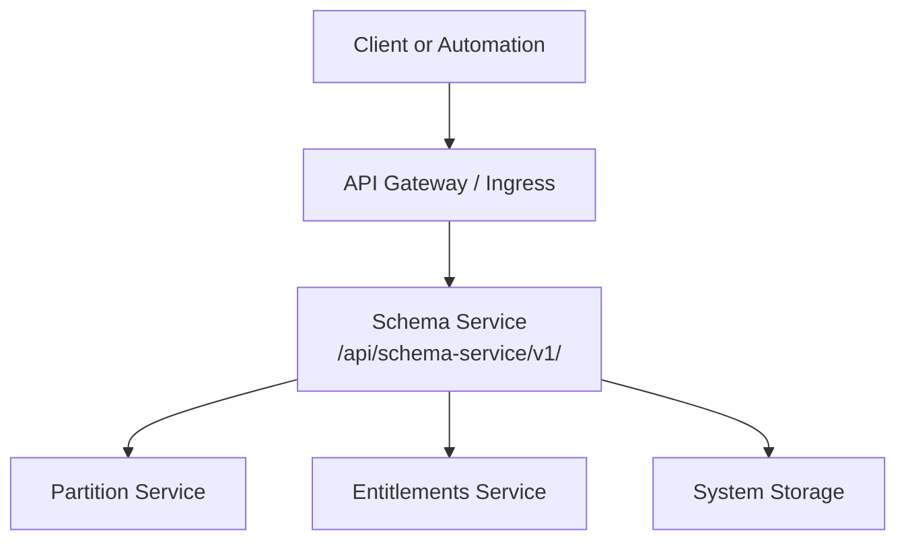
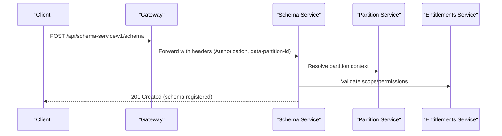
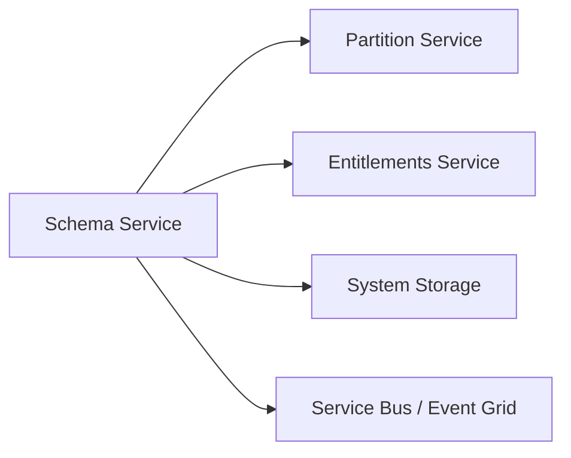

# Schema Service API

<cite>
**Referenced Files in This Document**
- [schema.http](file://tools/rest-scripts/schema.http)
- [register_schemas.sh](file://ofp-schema-deploy/register_schemas.sh)
- [services_core_schema.md](file://docs/src/services_core_schema.md)
- [schema.yaml](file://software/applications/osdu-core/schema.yaml)
- [generate_schemas.py](file://ofp-schema-deploy/generate_schemas.py)
- [EmissionScopeType schema](file://ofp-schema-deploy/schemas/ofp_wks_reference-data--EmissionScopeType_3.0.0.json)
</cite>

## Table of Contents
1. [Introduction](#introduction)
2. [Project Structure](#project-structure)
3. [Core Components](#core-components)
4. [Architecture Overview](#architecture-overview)
5. [Detailed Component Analysis](#detailed-component-analysis)
6. [Dependency Analysis](#dependency-analysis)
7. [Performance Considerations](#performance-considerations)
8. [Troubleshooting Guide](#troubleshooting-guide)
9. [Conclusion](#conclusion)
10. [Appendices](#appendices)

## Introduction
This document provides detailed API documentation for the OSDU Schema service as used in this repository. It covers REST endpoints for schema registration, versioning, retrieval, updates, and lifecycle management; request/response schemas; examples of schema definitions; validation rules; migration strategies; and practical workflows for registering custom schemas, validating data against schemas, and managing dependencies across domains.

The repository exposes:
- A reference HTTP client file with example requests to the Schema service
- A deployment configuration that mounts the Schema service under a well-known path
- Scripts and generated artifacts that demonstrate how to register schemas at scale
- Example schema payloads that follow OSDU conventions

## Project Structure
Key files relevant to the Schema service API and usage:
- tools/rest-scripts/schema.http: Example HTTP requests for interacting with the Schema service
- software/applications/osdu-core/schema.yaml: Deployment configuration exposing the Schema service endpoint
- docs/src/services_core_schema.md: Local development notes and environment variables for running the Schema service
- ofp-schema-deploy/register_schemas.sh: Script that registers generated schemas via POST to the Schema service
- ofp-schema-deploy/generate_schemas.py: Generator that produces full Schema service POST bodies (schemaInfo + schema)
- ofp-schema-deploy/schemas/*.json: Example registered schemas demonstrating OSDU record structure

**Diagram sources**
- [schema.yaml:40-67](file://software/applications/osdu-core/schema.yaml#L40-L67)
- [schema.yaml:112-115](file://software/applications/osdu-core/schema.yaml#L112-L115)

**Section sources**
- [schema.http:34-37](file://tools/rest-scripts/schema.http#L34-L37)
- [schema.yaml:40-67](file://software/applications/osdu-core/schema.yaml#L40-L67)
- [services_core_schema.md:14-39](file://docs/src/services_core_schema.md#L14-L39)

## Core Components
- Schema Service Endpoint: Exposed under /api/schema-service/v1/
- Authentication: Bearer token required for most operations; some endpoints are explicitly allowed without auth (e.g., info)
- Data Partitioning: Requests must include the data-partition-id header
- Versioning: Schemas are identified by kind IDs including authority, source, entityType, and semantic version components
- Lifecycle: Schemas can be created, retrieved, updated, and listed; system schemas can be created via a dedicated endpoint

**Section sources**
- [schema.http:34-37](file://tools/rest-scripts/schema.http#L34-L37)
- [schema.http:43-48](file://tools/rest-scripts/schema.http#L43-L48)
- [schema.http:54-99](file://tools/rest-scripts/schema.http#L54-L99)
- [schema.http:101-139](file://tools/rest-scripts/schema.http#L101-L139)
- [schema.http:141-199](file://tools/rest-scripts/schema.http#L141-L199)
- [schema.yaml:58-67](file://software/applications/osdu-core/schema.yaml#L58-L67)

## Architecture Overview
The Schema service is deployed as part of the core platform and exposed through an ingress/gateway layer. Clients authenticate via OAuth bearer tokens and target the Schema service base path. The service integrates with partition and entitlement services for multi-tenant scoping and access control. System storage is used for persistence.

**Diagram sources**
- [schema.http:62-90](file://tools/rest-scripts/schema.http#L62-L90)
- [schema.yaml:112-115](file://software/applications/osdu-core/schema.yaml#L112-L115)

## Detailed Component Analysis

### REST Endpoints Reference
Base path: /api/schema-service/v1/

- GET /info
  - Purpose: Retrieve service information
  - Auth: Not required (explicitly whitelisted)
  - Headers: Authorization (optional), Accept: application/json
  - Response: JSON object describing service capabilities

- GET /schema
  - Purpose: List schemas (query/filter may apply depending on implementation)
  - Auth: Required (Bearer token)
  - Headers: data-partition-id
  - Response: Array/list of schema metadata

- POST /schema
  - Purpose: Register a new schema version
  - Auth: Required (Bearer token)
  - Headers: Content-Type: application/json, data-partition-id
  - Request body: { schemaInfo, schema }
  - Response: 201 Created with stored schema metadata

- GET /schema/{kindId}
  - Purpose: Retrieve a specific schema by kind ID
  - Auth: Required (Bearer token)
  - Headers: data-partition-id
  - Response: Full schema payload

- PUT /schema
  - Purpose: Update or create a new version of a schema
  - Auth: Required (Bearer token)
  - Headers: Content-Type: application/json, data-partition-id
  - Request body: { schemaInfo, schema }
  - Response: Updated schema metadata

- PUT /schemas/system
  - Purpose: Create system-level schemas (restricted)
  - Auth: Required (Bearer token); additional restrictions apply
  - Headers: AppKey: None (as per example)
  - Request body: { schemaInfo, schema }
  - Response: Stored system schema metadata

Notes:
- All user-facing endpoints require a valid bearer token except /info
- All data-scoped endpoints require data-partition-id
- System schema creation is restricted and intended for platform use

**Section sources**
- [schema.http:43-48](file://tools/rest-scripts/schema.http#L43-L48)
- [schema.http:54-99](file://tools/rest-scripts/schema.http#L54-L99)
- [schema.http:101-139](file://tools/rest-scripts/schema.http#L101-L139)
- [schema.http:141-199](file://tools/rest-scripts/schema.http#L141-L199)
- [schema.yaml:58-67](file://software/applications/osdu-core/schema.yaml#L58-L67)

### Request and Response Schemas

- Common Headers
  - Authorization: Bearer <token>
  - data-partition-id: <partition>
  - Content-Type: application/json (for POST/PUT)
  - Accept: application/json (for GET)

- POST/PUT Body Shape
  - schemaInfo:
    - schemaIdentity:
      - authority: string
      - source: string
      - entityType: string
      - schemaVersionMajor: integer
      - schemaVersionMinor: integer
      - schemaVersionPatch: integer
      - id: string (canonical kind ID)
    - status: string (e.g., DEVELOPMENT, PUBLISHED)
    - scope: string (e.g., INTERNAL, SHARED)
    - createdBy: string
    - dateCreated: string (date-time)
  - schema:
    - $schema: string (JSON Schema draft-07)
    - $id: string (URI identifying the schema)
    - x-osdu-schema-source: string (kind ID)
    - title: string
    - description: string
    - type: object
    - properties: object (system properties + data)
    - required: array (must include kind, acl, legal, data)
    - additionalProperties: boolean

- GET Responses
  - Returns the stored schema payload matching the requested kind ID

Examples:
- See example request bodies and responses in the HTTP client file for each endpoint

**Section sources**
- [schema.http:62-90](file://tools/rest-scripts/schema.http#L62-L90)
- [schema.http:101-139](file://tools/rest-scripts/schema.http#L101-L139)
- [schema.http:141-199](file://tools/rest-scripts/schema.http#L141-L199)

### Schema Definition Format and Validation Rules
- JSON Schema draft-07 is used for schema definitions
- OSDU records must include system properties: id, kind, version, acl, legal, tags, createTime/createUser, modifyTime/modifyUser
- Required top-level fields for records: kind, acl, legal, data
- Data section contains domain-specific properties; additionalProperties can be set to false to enforce strictness
- Arrays should declare items to ensure indexer compatibility

Practical guidance:
- Use snake_case or pascal_case consistently for property keys based on your data model strategy
- Mark required fields in the data object to enforce validation
- Include descriptions for clarity and tooling support

**Section sources**
- [generate_schemas.py:80-96](file://ofp-schema-deploy/generate_schemas.py#L80-L96)
- [generate_schemas.py:111-129](file://ofp-schema-deploy/generate_schemas.py#L111-L129)
- [EmissionScopeType schema:104-143](file://ofp-schema-deploy/schemas/ofp_wks_reference-data--EmissionScopeType_3.0.0.json#L104-L143)

### Versioning and Lifecycle Management
- Versioning uses semantic version components within the kind ID (major.minor.patch)
- Status values:
  - DEVELOPMENT: Mutable; safe for iterative changes
  - PUBLISHED: Immutable; cannot be deleted; superseded by higher versions
- Scope values:
  - INTERNAL: Scoped to a single partition or tenant
  - SHARED: Broader visibility across partitions (subject to permissions)
- Promotion strategy:
  - Develop and test in DEVELOPMENT
  - Once validated, promote to PUBLISHED to freeze the schema
  - Introduce breaking changes only via new major/minor versions

Operational constraints:
- Schemas cannot be deleted once registered
- System schemas have restricted creation paths

**Section sources**
- [schema.http:62-90](file://tools/rest-scripts/schema.http#L62-L90)
- [schema.http:101-139](file://tools/rest-scripts/schema.http#L101-L139)
- [schema.http:141-199](file://tools/rest-scripts/schema.http#L141-L199)
- [register_schemas.sh:15-17](file://ofp-schema-deploy/register_schemas.sh#L15-L17)

### Migration Strategies
- Backward-compatible evolution:
  - Add optional fields in data
  - Keep required arrays minimal and stable
  - Preserve existing property names and types
- Breaking changes:
  - Increment major or minor version in schemaIdentity
  - Maintain old versions alongside new ones during transition
  - Update consumers to adopt new versions gradually
- Dependency ordering:
  - Register reference-data before master-data when there are cross-kind references
  - Use manifests to control order and deduplicate kinds

Automation:
- Use the provided generator to produce consistent schema payloads
- Use the registration script to batch-register schemas with error handling

**Section sources**
- [generate_schemas.py:105-141](file://ofp-schema-deploy/generate_schemas.py#L105-L141)
- [register_schemas.sh:51-88](file://ofp-schema-deploy/register_schemas.sh#L51-L88)

### Practical Examples

#### Registering a Custom Schema
Steps:
1. Prepare a schema payload with schemaInfo and schema sections
2. Send a POST to /api/schema-service/v1/schema with Authorization and data-partition-id headers
3. Verify response and retrieve the schema using GET /schema/{kindId}

Reference:
- Example POST body and headers in the HTTP client file

**Section sources**
- [schema.http:62-90](file://tools/rest-scripts/schema.http#L62-L90)
- [schema.http:93-99](file://tools/rest-scripts/schema.http#L93-L99)

#### Validating Data Against a Schema
- Ensure records conform to the schema’s required fields and property types
- Use JSON Schema validators to check data prior to ingestion
- Enforce additionalProperties: false to prevent unexpected fields

Reference:
- Example schema enforcing required fields and strict data shape

**Section sources**
- [EmissionScopeType schema:104-143](file://ofp-schema-deploy/schemas/ofp_wks_reference-data--EmissionScopeType_3.0.0.json#L104-L143)

#### Managing Dependencies Across Domains
- Register reference-data first, then master-data, then transactional work-product components
- Use manifests to deduplicate and order registrations
- Handle errors early to avoid partial deployments

Reference:
- Registration script modes and ordering logic

**Section sources**
- [register_schemas.sh:51-88](file://ofp-schema-deploy/register_schemas.sh#L51-L88)

### Conceptual Overview

```mermaid
flowchart TD
Start(["Start"]) --> Draft["Draft schema in DEVELOPMENT"]
Draft --> Test["Validate records against schema"]
Test --> Valid{"Valid?"}
Valid --> |No| Iterate["Iterate schema changes"]
Iterate --> Test
Valid --> |Yes| Promote["Promote to PUBLISHED"]
Promote --> Freeze["Schema frozen; no deletions"]
Freeze --> NextVer["Introduce next version for changes"]
```

[No sources needed since this diagram shows conceptual workflow, not actual code structure]

## Dependency Analysis
The Schema service depends on:
- Partition service for multi-tenant isolation
- Entitlements service for authorization checks
- System storage for persistence
- Optional messaging (Service Bus/Event Grid) for change notifications

**Diagram sources**
- [schema.yaml:102-115](file://software/applications/osdu-core/schema.yaml#L102-L115)

**Section sources**
- [schema.yaml:102-115](file://software/applications/osdu-core/schema.yaml#L102-L115)

## Performance Considerations
- Batch registrations: Use scripts to register multiple schemas efficiently
- Deduplication: Avoid re-registering identical schemas to reduce overhead
- Versioning: Prefer additive changes to minimize reprocessing
- Indexer compatibility: Ensure arrays declare items to avoid mapping failures

[No sources needed since this section provides general guidance]

## Troubleshooting Guide
Common issues and resolutions:
- Missing or invalid token: Ensure Authorization header includes a valid bearer token
- Wrong partition: Provide correct data-partition-id header
- Already present: Registration returns a 400 with “already present”; skip or update version
- Restricted endpoints: System schema creation requires elevated privileges
- Non-2xx responses: Inspect response body for details and retry with corrected payload

References:
- Error handling in registration script
- Whitelisted endpoints for unauthenticated access

**Section sources**
- [register_schemas.sh:33-49](file://ofp-schema-deploy/register_schemas.sh#L33-L49)
- [schema.yaml:58-67](file://software/applications/osdu-core/schema.yaml#L58-L67)

## Conclusion
The OSDU Schema service in this repository provides a robust API for registering, retrieving, updating, and listing schemas with strong versioning and lifecycle controls. Use the provided HTTP client examples and automation scripts to streamline schema management, validate data against schemas, and manage dependencies across domains. Follow best practices for backward-compatible evolution and careful promotion to PUBLISHED to maintain stability and compliance.

[No sources needed since this section summarizes without analyzing specific files]

## Appendices

### Environment and Configuration
- Local development: See local run instructions and environment variables
- Deployment: Service path and gateway configuration

**Section sources**
- [services_core_schema.md:14-39](file://docs/src/services_core_schema.md#L14-L39)
- [schema.yaml:40-67](file://software/applications/osdu-core/schema.yaml#L40-L67)

### Example Schema Payloads
- Reference schema demonstrating OSDU record structure and validation rules

**Section sources**
- [EmissionScopeType schema:1-144](file://ofp-schema-deploy/schemas/ofp_wks_reference-data--EmissionScopeType_3.0.0.json#L1-L144)