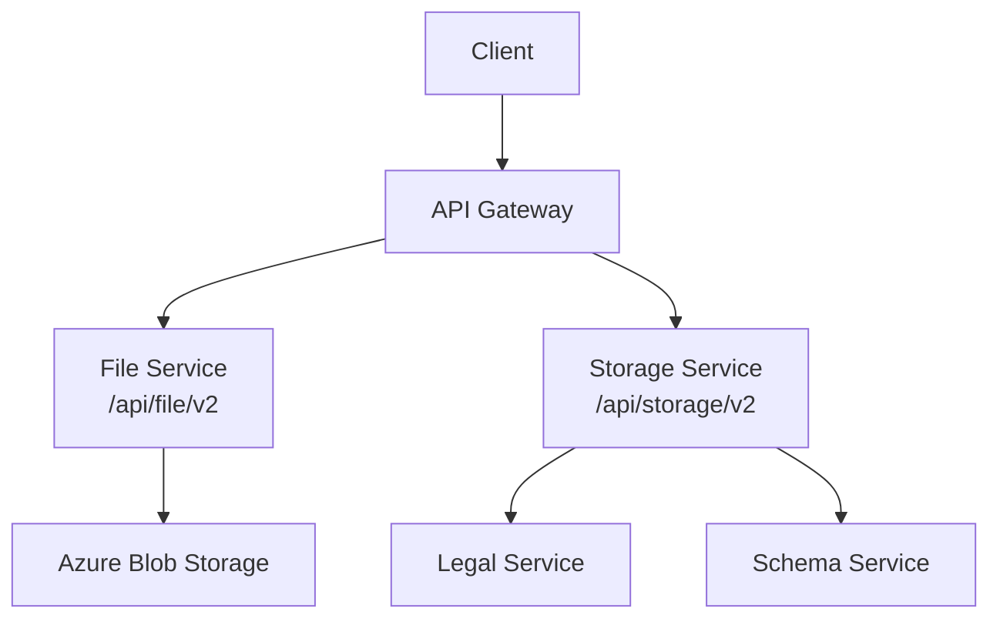
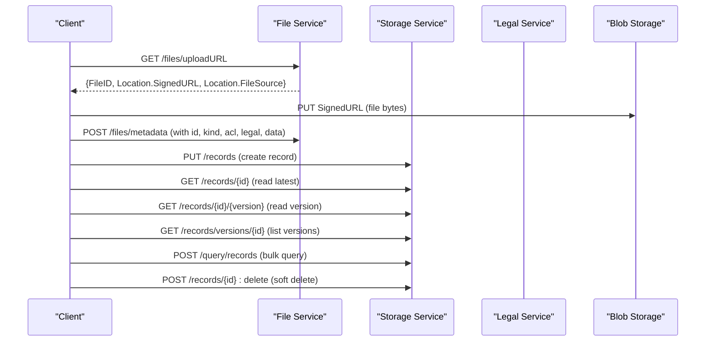
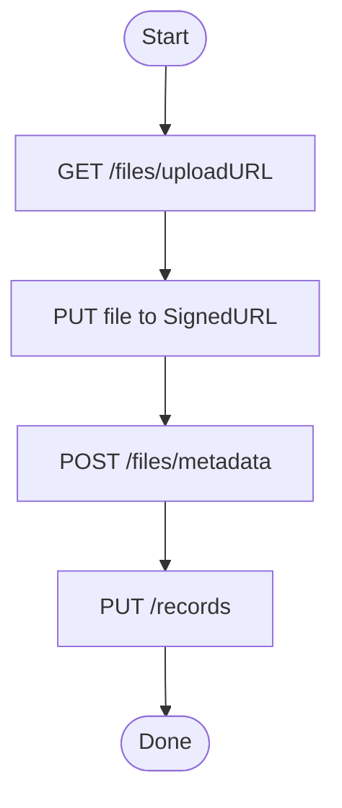
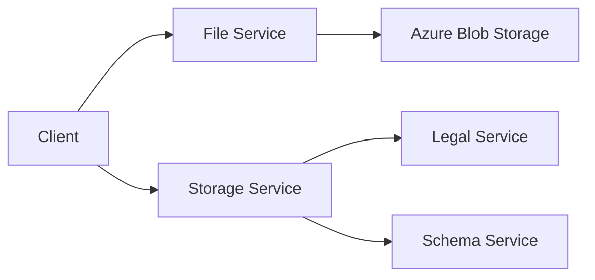

# Storage Service API

<cite>
**Referenced Files in This Document**
- [storage.http](file://tools/rest-scripts/storage.http)
- [check-file.http](file://tools/rest-scripts/check-file.http)
- [check-csv.http](file://tools/rest-scripts/check-csv.http)
- [services_core_storage.md](file://docs/src/services_core_storage.md)
- [services_core_file.md](file://docs/src/services_core_file.md)
- [docker-bake.hcl](file://src/docker-bake.hcl)
- [main.bicep](file://bicep/modules/storage-account/main.bicep)
</cite>

## Table of Contents
1. [Introduction](#introduction)
2. [Project Structure](#project-structure)
3. [Core Components](#core-components)
4. [Architecture Overview](#architecture-overview)
5. [Detailed Component Analysis](#detailed-component-analysis)
6. [Dependency Analysis](#dependency-analysis)
7. [Performance Considerations](#performance-considerations)
8. [Troubleshooting Guide](#troubleshooting-guide)
9. [Conclusion](#conclusion)
10. [Appendices](#appendices)

## Introduction
This document provides comprehensive API documentation for the OSDU Storage service and its related File service endpoints used for file upload, download, metadata management, and storage operations. It consolidates observed REST endpoints from repository scripts and configuration artifacts to guide integration with cloud storage backends, implement secure workflows, and manage data lifecycle (versioning, retention).

The Storage service exposes record CRUD and query APIs under /api/storage/v2, while the File service exposes file upload/download and metadata APIs under /api/file/v2. Together they enable:
- Secure, authenticated access using OAuth Bearer tokens
- Partition-scoped operations via the data-partition-id header
- Large file uploads via signed URLs directly to blob storage
- Metadata enrichment and retrieval for files
- Record versioning and deletion

## Project Structure
The repository includes:
- REST client scripts demonstrating Storage and File service usage
- Documentation describing local run configurations for Storage and File services
- Docker build targets that reference core modules for storage and file services
- Infrastructure templates configuring Azure Storage accounts with encryption and authentication settings

**Diagram sources**
- [check-file.http:108-114](file://tools/rest-scripts/check-file.http#L108-L114)
- [storage.http:43-56](file://tools/rest-scripts/storage.http#L43-L56)
- [docker-bake.hcl:76-96](file://src/docker-bake.hcl#L76-L96)

**Section sources**
- [docker-bake.hcl:76-96](file://src/docker-bake.hcl#L76-L96)
- [services_core_storage.md:1-39](file://docs/src/services_core_storage.md#L1-L39)
- [services_core_file.md:1-12](file://docs/src/services_core_file.md#L1-L12)

## Core Components
- Storage Service (/api/storage/v2): Provides record creation, retrieval by ID or kind, versioned reads, listing versions, bulk queries, and deletion.
- File Service (/api/file/v2): Provides upload URL generation, direct PUT to blob storage, file list retrieval, metadata creation/retrieval, and download URL generation.
- Legal and Schema Services: Used by Storage and File flows for legal tags and schema validation.

Key operational headers:
- Authorization: Bearer <token>
- data-partition-id: <partition>

**Section sources**
- [storage.http:43-56](file://tools/rest-scripts/storage.http#L43-L56)
- [check-file.http:33-45](file://tools/rest-scripts/check-file.http#L33-L45)

## Architecture Overview
The typical workflow involves:
- Obtaining an OAuth token
- Requesting a signed upload URL from the File service
- Uploading the file directly to Azure Blob Storage using the signed URL
- Creating or updating file metadata via the File service
- Managing records and versions via the Storage service

**Diagram sources**
- [check-file.http:108-114](file://tools/rest-scripts/check-file.http#L108-L114)
- [check-file.http:135-139](file://tools/rest-scripts/check-file.http#L135-L139)
- [check-file.http:143-187](file://tools/rest-scripts/check-file.http#L143-L187)
- [storage.http:102-195](file://tools/rest-scripts/storage.http#L102-L195)

## Detailed Component Analysis

### File Service Endpoints
- GET /files/uploadURL
  - Purpose: Obtain a signed URL for uploading a file directly to blob storage.
  - Headers: Authorization, data-partition-id
  - Response fields (observed): FileID, Location.SignedURL, Location.FileSource
  - Notes: Use the returned SignedURL to PUT the file content; include x-ms-blob-type: BlockBlob when uploading to Azure Blob.

- PUT <SignedURL>
  - Purpose: Upload file bytes to blob storage using the signed URL obtained above.
  - Headers: x-ms-blob-type: BlockBlob (for Azure)
  - Body: Binary file content

- POST /files/metadata
  - Purpose: Create or update metadata for a file record.
  - Headers: Authorization, data-partition-id
  - Request body fields (observed): id, version, kind, acl (viewers, owners), legal (legaltags, otherRelevantDataCountries, status), tags, data (dataset properties including FileSourceInfo), meta
  - Response fields (observed): id

- GET /files/{id}/metadata
  - Purpose: Retrieve metadata for a specific file.
  - Headers: Authorization, data-partition-id

- GET /files/{id}/downloadURL
  - Purpose: Get a signed URL to download a file.
  - Headers: Authorization, data-partition-id
  - Response fields (observed): SignedUrl

- POST /getFileList
  - Purpose: List recent files based on filters.
  - Headers: Authorization, data-partition-id
  - Request body fields (observed): Items, PageNum, TimeFrom, TimeTo, UserID

- GET /info
  - Purpose: Service info endpoint.
  - Headers: Authorization

Security and partitioning:
- All endpoints require Authorization: Bearer token
- All endpoints require data-partition-id header to scope requests

Examples and references:
- See [check-file.http:108-114](file://tools/rest-scripts/check-file.http#L108-L114) for upload URL request
- See [check-file.http:135-139](file://tools/rest-scripts/check-file.http#L135-L139) for direct blob upload
- See [check-file.http:143-187](file://tools/rest-scripts/check-file.http#L143-L187) for metadata creation
- See [check-file.http:192-198](file://tools/rest-scripts/check-file.http#L192-L198) for metadata retrieval
- See [check-file.http:203-215](file://tools/rest-scripts/check-file.http#L203-L215) for download URL and download

**Section sources**
- [check-file.http:108-114](file://tools/rest-scripts/check-file.http#L108-L114)
- [check-file.http:135-139](file://tools/rest-scripts/check-file.http#L135-L139)
- [check-file.http:143-187](file://tools/rest-scripts/check-file.http#L143-L187)
- [check-file.http:192-198](file://tools/rest-scripts/check-file.http#L192-L198)
- [check-file.http:203-215](file://tools/rest-scripts/check-file.http#L203-L215)

### Storage Service Endpoints
- GET /info
  - Purpose: Service info endpoint.
  - Headers: Authorization

- PUT /records
  - Purpose: Create one or more records.
  - Headers: Authorization, data-partition-id
  - Request body fields (observed): Array of records with kind, acl (viewers, owners), legal (legaltags, otherRelevantDataCountries, status), data
  - Response fields (observed): recordIds, recordIdVersions

- GET /records/{id}
  - Purpose: Read the latest version of a record.
  - Headers: Authorization, data-partition-id

- GET /records/{id}/{version}
  - Purpose: Read a specific version of a record.
  - Headers: Authorization, data-partition-id

- GET /records/versions/{id}
  - Purpose: List all versions of a record.
  - Headers: Authorization, data-partition-id

- GET /query/records?kind={kind}
  - Purpose: Query records by kind.
  - Headers: Authorization, data-partition-id

- POST /query/records
  - Purpose: Bulk query records with attributes selection.
  - Headers: Authorization, data-partition-id
  - Request body fields (observed): records (array of IDs), attributes (array of field paths)

- POST /records/{id}:delete
  - Purpose: Soft-delete a record.
  - Headers: Authorization, data-partition-id

Examples and references:
- See [storage.http:54-56](file://tools/rest-scripts/storage.http#L54-L56) for info
- See [storage.http:102-139](file://tools/rest-scripts/storage.http#L102-L139) for create record
- See [storage.http:142-169](file://tools/rest-scripts/storage.http#L142-L169) for read latest, versioned read, and list versions
- See [storage.http:173-195](file://tools/rest-scripts/storage.http#L173-L195) for bulk query and delete

**Section sources**
- [storage.http:54-56](file://tools/rest-scripts/storage.http#L54-L56)
- [storage.http:102-139](file://tools/rest-scripts/storage.http#L102-L139)
- [storage.http:142-169](file://tools/rest-scripts/storage.http#L142-L169)
- [storage.http:173-195](file://tools/rest-scripts/storage.http#L173-L195)

### File Handling Workflows

#### Large File Uploads (Chunked and Direct)
- Direct upload via signed URL:
  - Request GET /files/uploadURL to obtain a signed URL
  - PUT file bytes to the signed URL with appropriate blob type header
  - Create metadata referencing the uploaded file source
- Chunked uploads:
  - The repository demonstrates direct block blob uploads via signed URLs. For very large files, chunked uploads can be implemented at the client side against the same signed URL using the underlying storage SDK’s multipart capabilities.

References:
- [check-file.http:108-114](file://tools/rest-scripts/check-file.http#L108-L114)
- [check-file.http:135-139](file://tools/rest-scripts/check-file.http#L135-L139)
- [check-csv.http:546-564](file://tools/rest-scripts/check-csv.http#L546-L564)

#### Streaming Downloads
- Obtain a signed download URL:
  - GET /files/{id}/downloadURL
- Download the file using the returned SignedUrl directly from storage

References:
- [check-file.http:203-215](file://tools/rest-scripts/check-file.http#L203-L215)

#### Metadata Enrichment
- Create or update metadata after upload:
  - POST /files/metadata with id, kind, acl, legal, tags, data (including DatasetProperties.FileSourceInfo)
- Retrieve metadata:
  - GET /files/{id}/metadata

References:
- [check-file.http:143-187](file://tools/rest-scripts/check-file.http#L143-L187)
- [check-file.http:192-198](file://tools/rest-scripts/check-file.http#L192-L198)

**Diagram sources**
- [check-file.http:108-114](file://tools/rest-scripts/check-file.http#L108-L114)
- [check-file.http:135-139](file://tools/rest-scripts/check-file.http#L135-L139)
- [check-file.http:143-187](file://tools/rest-scripts/check-file.http#L143-L187)
- [storage.http:102-139](file://tools/rest-scripts/storage.http#L102-L139)

### Storage Backends, Access Controls, and Security
- Backend: Azure Blob Storage is used for file persistence, accessed via signed URLs generated by the File service.
- Authentication: All service calls require Authorization: Bearer token.
- Partitioning: All calls must include data-partition-id to scope operations.
- Encryption: Storage account supports encryption with customer-managed keys via Key Vault.
- Access control: ACLs are specified per record/metadata (viewers, owners).

References:
- [services_core_storage.md:14-39](file://docs/src/services_core_storage.md#L14-L39)
- [main.bicep:351-396](file://bicep/modules/storage-account/main.bicep#L351-L396)

**Section sources**
- [services_core_storage.md:14-39](file://docs/src/services_core_storage.md#L14-L39)
- [main.bicep:351-396](file://bicep/modules/storage-account/main.bicep#L351-L396)

### Practical Integration Examples

#### Integrating with Cloud Storage Services
- Use File service to obtain signed URLs for direct blob uploads/downloads
- Configure storage account encryption and identity settings as needed
- Ensure network policies allow client access to storage endpoints

References:
- [check-file.http:108-114](file://tools/rest-scripts/check-file.http#L108-L114)
- [main.bicep:351-396](file://bicep/modules/storage-account/main.bicep#L351-L396)

#### Implementing File Versioning
- Storage service supports versioned reads and listing versions
- Use GET /records/{id}/{version} and GET /records/versions/{id} to manage versions

References:
- [storage.http:142-169](file://tools/rest-scripts/storage.http#L142-L169)

#### Managing Storage Quotas and Retention Policies
- Configure storage account-level policies and quotas through infrastructure templates
- Apply management policies for lifecycle rules (e.g., tiering, expiration)

References:
- [main.bicep:351-396](file://bicep/modules/storage-account/main.bicep#L351-L396)

## Dependency Analysis
The following diagram shows dependencies among services and external components as evidenced by scripts and configuration:

**Diagram sources**
- [check-file.http:33-45](file://tools/rest-scripts/check-file.http#L33-L45)
- [storage.http:43-56](file://tools/rest-scripts/storage.http#L43-L56)

**Section sources**
- [check-file.http:33-45](file://tools/rest-scripts/check-file.http#L33-L45)
- [storage.http:43-56](file://tools/rest-scripts/storage.http#L43-L56)

## Performance Considerations
- Prefer direct uploads/downloads via signed URLs to minimize server-side bandwidth usage
- Use pagination and filtering in file list queries to reduce payload sizes
- Leverage versioned reads only when necessary to avoid unnecessary overhead
- Enable HTTPS for storage connections as configured

[No sources needed since this section provides general guidance]

## Troubleshooting Guide
Common issues and checks:
- Authentication failures: Ensure valid Bearer token and correct scopes
- Partition errors: Verify data-partition-id matches the target partition
- Upload errors: Confirm blob type header and signed URL validity
- Metadata mismatches: Validate kind, acl, and legal fields against schemas and legal tags

Operational notes:
- Local development requires proper service endpoints and environment variables
- Application Insights and logging prefixes can aid diagnostics

References:
- [services_core_storage.md:14-39](file://docs/src/services_core_storage.md#L14-L39)
- [services_core_file.md:1-12](file://docs/src/services_core_file.md#L1-L12)

**Section sources**
- [services_core_storage.md:14-39](file://docs/src/services_core_storage.md#L14-L39)
- [services_core_file.md:1-12](file://docs/src/services_core_file.md#L1-L12)

## Conclusion
The OSDU Storage and File services provide a robust foundation for secure, partitioned, and versioned data management with direct cloud storage integration. By leveraging signed URLs for large transfers, metadata enrichment for discoverability, and versioned record management, teams can build scalable ingestion and retrieval pipelines aligned with compliance and security requirements.

[No sources needed since this section summarizes without analyzing specific files]

## Appendices

### Endpoint Reference Summary
- File Service
  - GET /files/uploadURL
  - PUT <SignedURL>
  - POST /files/metadata
  - GET /files/{id}/metadata
  - GET /files/{id}/downloadURL
  - POST /getFileList
  - GET /info

- Storage Service
  - GET /info
  - PUT /records
  - GET /records/{id}
  - GET /records/{id}/{version}
  - GET /records/versions/{id}
  - GET /query/records?kind={kind}
  - POST /query/records
  - POST /records/{id}:delete

References:
- [check-file.http:108-114](file://tools/rest-scripts/check-file.http#L108-L114)
- [check-file.http:135-139](file://tools/rest-scripts/check-file.http#L135-L139)
- [check-file.http:143-187](file://tools/rest-scripts/check-file.http#L143-L187)
- [check-file.http:192-198](file://tools/rest-scripts/check-file.http#L192-L198)
- [check-file.http:203-215](file://tools/rest-scripts/check-file.http#L203-L215)
- [storage.http:54-56](file://tools/rest-scripts/storage.http#L54-L56)
- [storage.http:102-139](file://tools/rest-scripts/storage.http#L102-L139)
- [storage.http:142-169](file://tools/rest-scripts/storage.http#L142-L169)
- [storage.http:173-195](file://tools/rest-scripts/storage.http#L173-L195)