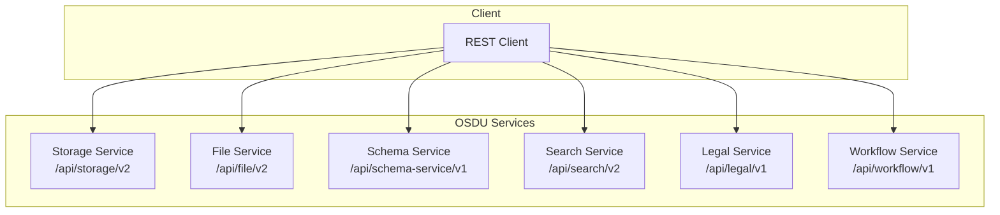
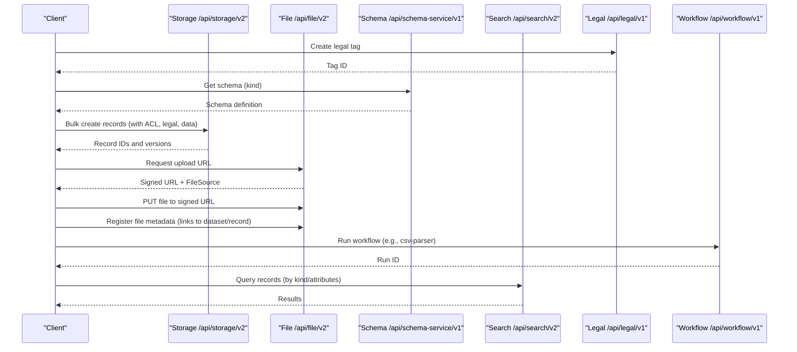
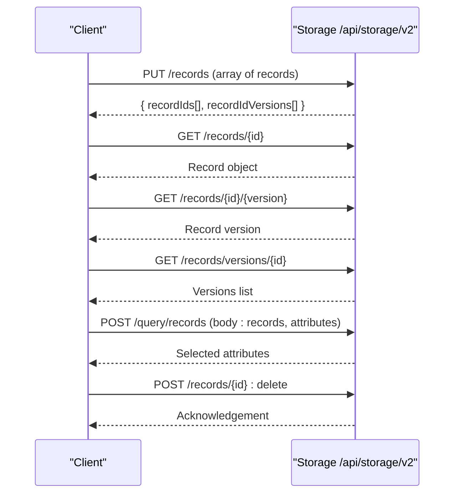
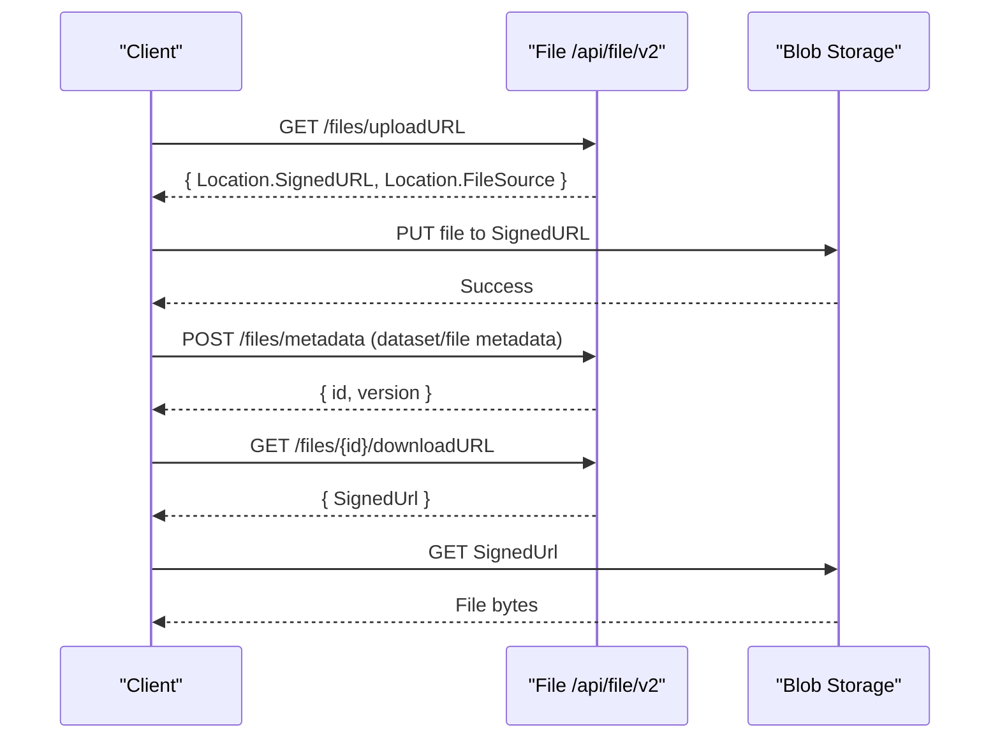
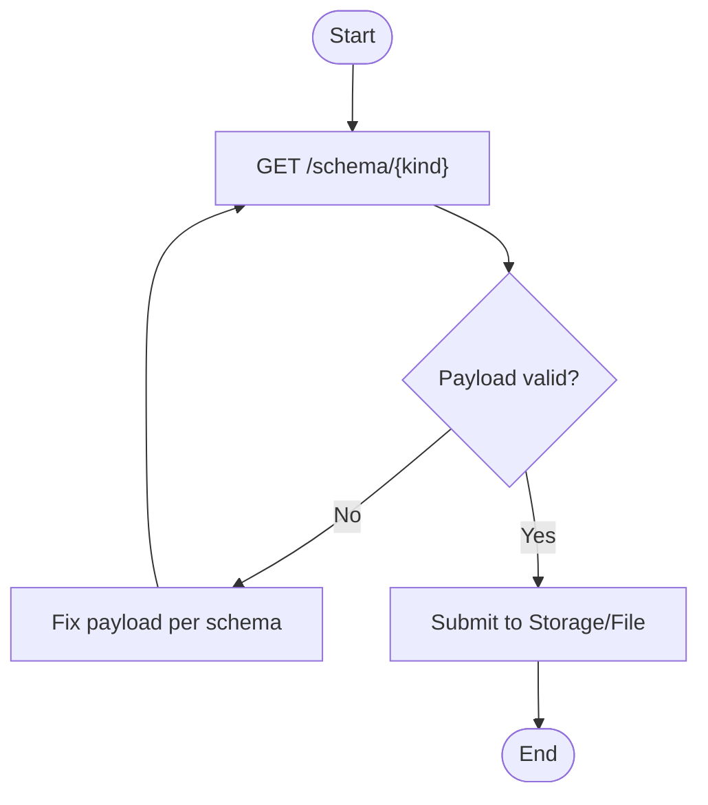
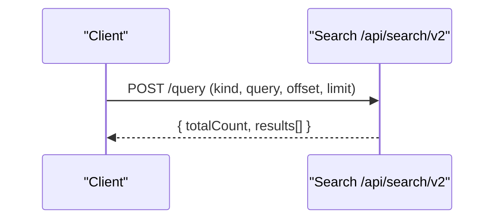
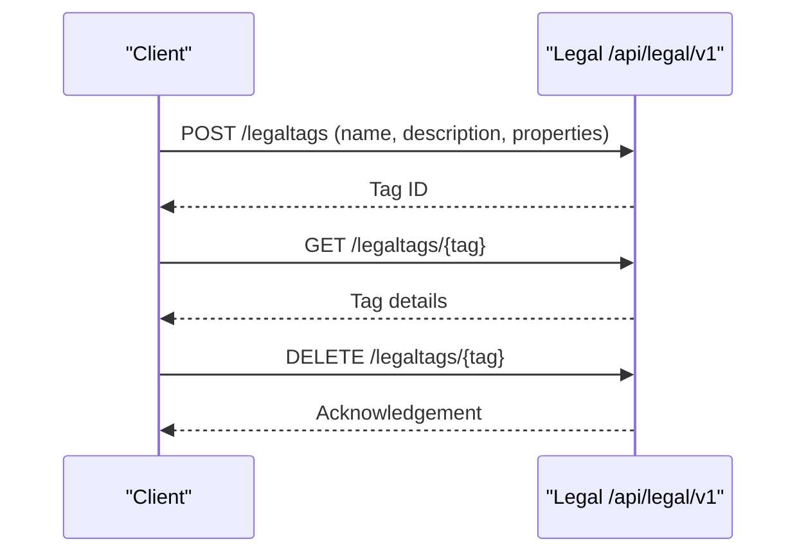
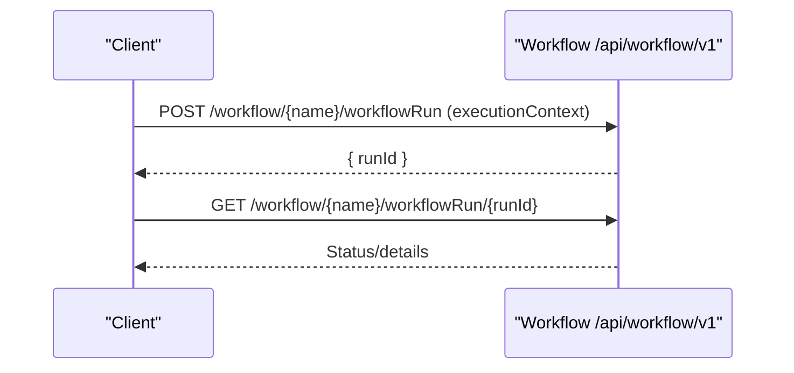
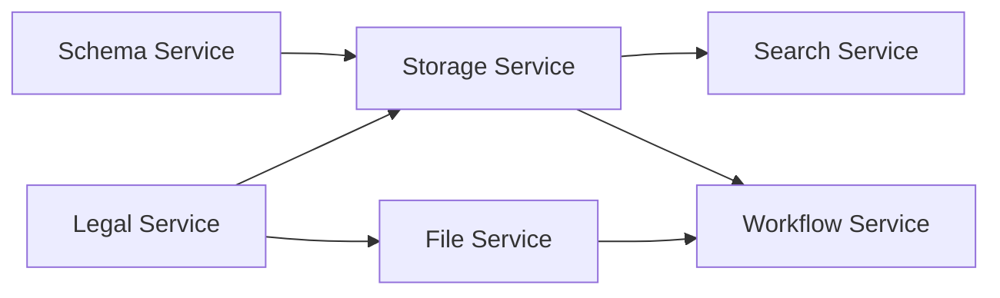

# Data Management API

<cite>
**Referenced Files in This Document**
- [storage.http](file://tools/rest-scripts/storage.http)
- [check-file.http](file://tools/rest-scripts/check-file.http)
- [check-csv.http](file://tools/rest-scripts/check-csv.http)
- [check-record.http](file://tools/rest-scripts/check-record.http)
- [services_core_storage.md](file://docs/src/services_core_storage.md)
- [services_core_file.md](file://docs/src/services_core_file.md)
- [services_core_schema.md](file://docs/src/services_core_schema.md)
- [services_core_search.md](file://docs/src/services_core_search.md)
</cite>

## Table of Contents
1. [Introduction](#introduction)
2. [Project Structure](#project-structure)
3. [Core Components](#core-components)
4. [Architecture Overview](#architecture-overview)
5. [Detailed Component Analysis](#detailed-component-analysis)
6. [Dependency Analysis](#dependency-analysis)
7. [Performance Considerations](#performance-considerations)
8. [Troubleshooting Guide](#troubleshooting-guide)
9. [Conclusion](#conclusion)
10. [Appendices](#appendices)

## Introduction
This document provides detailed API documentation for OSDU data management operations, focusing on record CRUD, file management, and data validation workflows. It consolidates endpoints and request/response patterns demonstrated in the repository’s REST scripts and service configuration docs. The scope includes:
- Record lifecycle: create (bulk), read (by ID/version), update (via re-create with versioning), delete, and query
- File lifecycle: upload via signed URL, metadata registration, download via signed URL
- Validation and schema usage: leveraging schemas to validate records and files
- Data lifecycle management: versioning, legal tags, ACLs, and auditability through search and workflow integration
- Performance considerations for large datasets and batch operations

## Project Structure
The repository exposes operational examples and service configuration that define how OSDU services are used:
- REST scripts under tools/rest-scripts demonstrate end-to-end flows for storage, file, schema, search, and workflow interactions
- Service configuration docs describe environment variables and endpoints for Storage, File, Schema, and Search services

**Diagram sources**
- [storage.http:40-49](file://tools/rest-scripts/storage.http#L40-L49)
- [check-file.http:33-45](file://tools/rest-scripts/check-file.http#L33-L45)
- [check-csv.http:37-50](file://tools/rest-scripts/check-csv.http#L37-L50)
- [services_core_storage.md:14-39](file://docs/src/services_core_storage.md#L14-L39)
- [services_core_file.md:14-27](file://docs/src/services_core_file.md#L14-L27)
- [services_core_schema.md:14-39](file://docs/src/services_core_schema.md#L14-L39)
- [services_core_search.md:14-37](file://docs/src/services_core_search.md#L14-L37)

**Section sources**
- [storage.http:40-49](file://tools/rest-scripts/storage.http#L40-L49)
- [check-file.http:33-45](file://tools/rest-scripts/check-file.http#L33-L45)
- [check-csv.http:37-50](file://tools/rest-scripts/check-csv.http#L37-L50)
- [services_core_storage.md:14-39](file://docs/src/services_core_storage.md#L14-L39)
- [services_core_file.md:14-27](file://docs/src/services_core_file.md#L14-L27)
- [services_core_schema.md:14-39](file://docs/src/services_core_schema.md#L14-L39)
- [services_core_search.md:14-37](file://docs/src/services_core_search.md#L14-L37)

## Core Components
- Storage Service: Provides record CRUD, versioning, and bulk operations. Endpoints include creating records (bulk), retrieving by ID or version, listing versions, querying by kind or attributes, and deleting records.
- File Service: Handles file uploads via signed URLs, metadata registration, retrieval of metadata, and downloads via signed URLs. Also supports listing recent file activity.
- Schema Service: Supplies JSON schemas used to validate record and file payloads.
- Search Service: Enables full-text and attribute-based queries against indexed records.
- Legal Service: Manages legal tags applied to records and files for compliance and governance.
- Workflow Service: Triggers processing pipelines (e.g., CSV parsing) based on uploaded files or created records.

Key responsibilities and typical requests are illustrated in the REST scripts.

**Section sources**
- [storage.http:102-197](file://tools/rest-scripts/storage.http#L102-L197)
- [check-file.http:107-215](file://tools/rest-scripts/check-file.http#L107-L215)
- [check-csv.http:545-708](file://tools/rest-scripts/check-csv.http#L545-L708)
- [check-record.http:95-189](file://tools/rest-scripts/check-record.http#L95-L189)
- [services_core_storage.md:14-39](file://docs/src/services_core_storage.md#L14-L39)
- [services_core_file.md:14-27](file://docs/src/services_core_file.md#L14-L27)
- [services_core_schema.md:14-39](file://docs/src/services_core_schema.md#L14-L39)
- [services_core_search.md:14-37](file://docs/src/services_core_search.md#L14-L37)

## Architecture Overview
The data management flow integrates multiple services:
- Records are created and managed via Storage; they carry ACL, legal tags, and typed data defined by Schema.
- Files are uploaded directly to storage using signed URLs from File; metadata is registered to link files to records or datasets.
- Search indexes records for efficient querying.
- Legal tags govern access and compliance.
- Workflows process files (e.g., CSV ingestion) and can produce new records.

**Diagram sources**
- [check-csv.http:69-708](file://tools/rest-scripts/check-csv.http#L69-L708)
- [check-file.http:59-215](file://tools/rest-scripts/check-file.http#L59-L215)
- [storage.http:65-197](file://tools/rest-scripts/storage.http#L65-L197)
- [check-record.http:48-189](file://tools/rest-scripts/check-record.http#L48-L189)

## Detailed Component Analysis

### Storage Service: Record CRUD and Versioning
- Create records (bulk): POST/PUT to records endpoint with an array of record objects including kind, acl, legal, and data.
- Read record: GET by record ID; also GET by record ID and specific version.
- List versions: GET versions for a given record ID.
- Query records: GET by kind or POST with body specifying records and attributes to retrieve.
- Delete record: POST with :delete suffix or DELETE by ID.

Request/response highlights:
- Create returns recordIds and recordIdVersions for each created record.
- Query supports selecting specific attributes (e.g., data.Name).
- Versioning allows reading historical states and auditing changes.

**Diagram sources**
- [storage.http:102-197](file://tools/rest-scripts/storage.http#L102-L197)
- [check-record.http:95-189](file://tools/rest-scripts/check-record.http#L95-L189)

**Section sources**
- [storage.http:102-197](file://tools/rest-scripts/storage.http#L102-L197)
- [check-record.http:95-189](file://tools/rest-scripts/check-record.http#L95-L189)

### File Service: Upload, Metadata, Download
- Upload: Request signed URL, then PUT file content to the provided URL.
- Metadata: Register file metadata linking to dataset/record kinds, ACL, legal tags, and data properties (e.g., DatasetProperties.FileSourceInfo).
- Download: Request download URL and GET the signed URL to retrieve the file.
- Activity: Retrieve recent file activity logs.

**Diagram sources**
- [check-file.http:107-215](file://tools/rest-scripts/check-file.http#L107-L215)
- [check-csv.http:545-680](file://tools/rest-scripts/check-csv.http#L545-L680)

**Section sources**
- [check-file.http:107-215](file://tools/rest-scripts/check-file.http#L107-L215)
- [check-csv.http:545-680](file://tools/rest-scripts/check-csv.http#L545-L680)

### Schema Service: Validation and Types
- Retrieve schema by kind to validate record/file payloads before submission.
- Create custom schemas for domain-specific entities (e.g., wellbore) with properties, types, and constraints.
- Use schema definitions to ensure consistency across records and files.

Validation workflow:
- Fetch schema for target kind
- Validate payload locally or rely on service-side validation
- Submit validated payload to Storage or File metadata

**Diagram sources**
- [check-csv.http:107-122](file://tools/rest-scripts/check-csv.http#L107-L122)
- [check-csv.http:533-538](file://tools/rest-scripts/check-csv.http#L533-L538)
- [services_core_schema.md:14-39](file://docs/src/services_core_schema.md#L14-L39)

**Section sources**
- [check-csv.http:107-122](file://tools/rest-scripts/check-csv.http#L107-L122)
- [check-csv.http:533-538](file://tools/rest-scripts/check-csv.http#L533-L538)
- [services_core_schema.md:14-39](file://docs/src/services_core_schema.md#L14-L39)

### Search Service: Querying Records
- Query by kind and free-text or attribute-based queries.
- Supports offset and limit for pagination.
- Useful for validating created records and discovering datasets.

**Diagram sources**
- [check-record.http:163-179](file://tools/rest-scripts/check-record.http#L163-L179)
- [check-csv.http:723-738](file://tools/rest-scripts/check-csv.http#L723-L738)
- [services_core_search.md:14-37](file://docs/src/services_core_search.md#L14-L37)

**Section sources**
- [check-record.http:163-179](file://tools/rest-scripts/check-record.http#L163-L179)
- [check-csv.http:723-738](file://tools/rest-scripts/check-csv.http#L723-L738)
- [services_core_search.md:14-37](file://docs/src/services_core_search.md#L14-L37)

### Legal Service: Tags and Compliance
- Create, get, and delete legal tags to enforce compliance policies on records and files.
- Tags are referenced in ACL and legal sections of records/files.

**Diagram sources**
- [check-file.http:59-90](file://tools/rest-scripts/check-file.http#L59-L90)
- [check-csv.http:69-99](file://tools/rest-scripts/check-csv.http#L69-L99)
- [storage.http:65-96](file://tools/rest-scripts/storage.http#L65-L96)
- [check-record.http:48-79](file://tools/rest-scripts/check-record.http#L48-L79)

**Section sources**
- [check-file.http:59-90](file://tools/rest-scripts/check-file.http#L59-L90)
- [check-csv.http:69-99](file://tools/rest-scripts/check-csv.http#L69-L99)
- [storage.http:65-96](file://tools/rest-scripts/storage.http#L65-L96)
- [check-record.http:48-79](file://tools/rest-scripts/check-record.http#L48-L79)

### Workflow Service: Processing Pipelines
- Trigger workflows (e.g., csv-parser) to process uploaded files and generate records.
- Execution context includes dataPartitionId and entity id.

**Diagram sources**
- [check-csv.http:695-714](file://tools/rest-scripts/check-csv.http#L695-L714)
- [check-ingest.http:116-139](file://tools/rest-scripts/check-ingest.http#L116-L139)

**Section sources**
- [check-csv.http:695-714](file://tools/rest-scripts/check-csv.http#L695-L714)
- [check-ingest.http:116-139](file://tools/rest-scripts/check-ingest.http#L116-L139)

## Dependency Analysis
- Storage depends on Legal for tags and on Schema for kind definitions.
- File depends on Storage for blob operations and on Legal for tags.
- Search indexes Storage records and supports queries across kinds.
- Workflow consumes File outputs and may create/update Storage records.

**Diagram sources**
- [services_core_storage.md:14-39](file://docs/src/services_core_storage.md#L14-L39)
- [services_core_file.md:14-27](file://docs/src/services_core_file.md#L14-L27)
- [services_core_schema.md:14-39](file://docs/src/services_core_schema.md#L14-L39)
- [services_core_search.md:14-37](file://docs/src/services_core_search.md#L14-L37)
- [check-csv.http:545-708](file://tools/rest-scripts/check-csv.http#L545-L708)

**Section sources**
- [services_core_storage.md:14-39](file://docs/src/services_core_storage.md#L14-L39)
- [services_core_file.md:14-27](file://docs/src/services_core_file.md#L14-L27)
- [services_core_schema.md:14-39](file://docs/src/services_core_schema.md#L14-L39)
- [services_core_search.md:14-37](file://docs/src/services_core_search.md#L14-L37)
- [check-csv.http:545-708](file://tools/rest-scripts/check-csv.http#L545-L708)

## Performance Considerations
- Batch record creation: Use bulk endpoints to reduce round-trips when creating many records.
- Pagination: For large result sets, use offset and limit in search queries.
- Signed URL uploads: Offload large file transfers directly to storage via signed URLs to minimize service load.
- Attribute selection: When querying, specify only needed attributes to reduce payload size.
- Caching and indexing: Leverage Search service caching configurations where applicable.
- Workflow throughput: Process files asynchronously via workflows to avoid blocking client requests.

[No sources needed since this section provides general guidance]

## Troubleshooting Guide
Common issues and resolutions:
- Authentication failures: Ensure proper OAuth token acquisition and correct scopes.
- Missing legal tags: Create tags before attaching them to records/files.
- Schema mismatches: Validate payloads against schemas prior to submission.
- File upload errors: Verify signed URL validity and headers (e.g., blob type).
- Workflow execution failures: Check workflow status and inputs (executionContext).

Operational references:
- OAuth refresh and token usage in scripts
- Legal tag lifecycle (create/get/delete)
- Schema retrieval and validation steps
- File upload/download flows
- Workflow run status checks

**Section sources**
- [storage.http:18-58](file://tools/rest-scripts/storage.http#L18-L58)
- [check-file.http:18-55](file://tools/rest-scripts/check-file.http#L18-L55)
- [check-csv.http:22-50](file://tools/rest-scripts/check-csv.http#L22-L50)
- [check-record.http:18-43](file://tools/rest-scripts/check-record.http#L18-L43)
- [check-csv.http:69-99](file://tools/rest-scripts/check-csv.http#L69-L99)
- [check-csv.http:545-714](file://tools/rest-scripts/check-csv.http#L545-L714)

## Conclusion
The OSDU data management APIs provide robust capabilities for managing records and files with strong support for versioning, legal compliance, schema-driven validation, search, and workflow automation. By following the documented flows and leveraging batch operations, clients can efficiently handle large datasets while maintaining governance and auditability.

[No sources needed since this section summarizes without analyzing specific files]

## Appendices

### API Endpoints Summary
- Storage
  - Create records (bulk): PUT /records
  - Read record: GET /records/{id}
  - Read version: GET /records/{id}/{version}
  - List versions: GET /records/versions/{id}
  - Query records: GET /query/records?kind=... or POST /query/records
  - Delete record: POST /records/{id}:delete or DELETE /records/{id}
- File
  - Upload URL: GET /files/uploadURL
  - Upload file: PUT to SignedURL
  - Register metadata: POST /files/metadata
  - Get metadata: GET /files/{id}/metadata
  - Download URL: GET /files/{id}/downloadURL
  - Download file: GET SignedURL
  - Activity log: POST /getFileList
- Schema
  - Get schema: GET /schema/{kind}
  - Create schema: POST /schema
- Search
  - Query: POST /query
- Legal
  - Create tag: POST /legaltags
  - Get tag: GET /legaltags/{tag}
  - Delete tag: DELETE /legaltags/{tag}
- Workflow
  - Run workflow: POST /workflow/{name}/workflowRun
  - Get run status: GET /workflow/{name}/workflowRun/{runId}

**Section sources**
- [storage.http:102-197](file://tools/rest-scripts/storage.http#L102-L197)
- [check-file.http:107-215](file://tools/rest-scripts/check-file.http#L107-L215)
- [check-csv.http:107-122](file://tools/rest-scripts/check-csv.http#L107-L122)
- [check-csv.http:545-714](file://tools/rest-scripts/check-csv.http#L545-L714)
- [check-record.http:95-189](file://tools/rest-scripts/check-record.http#L95-L189)