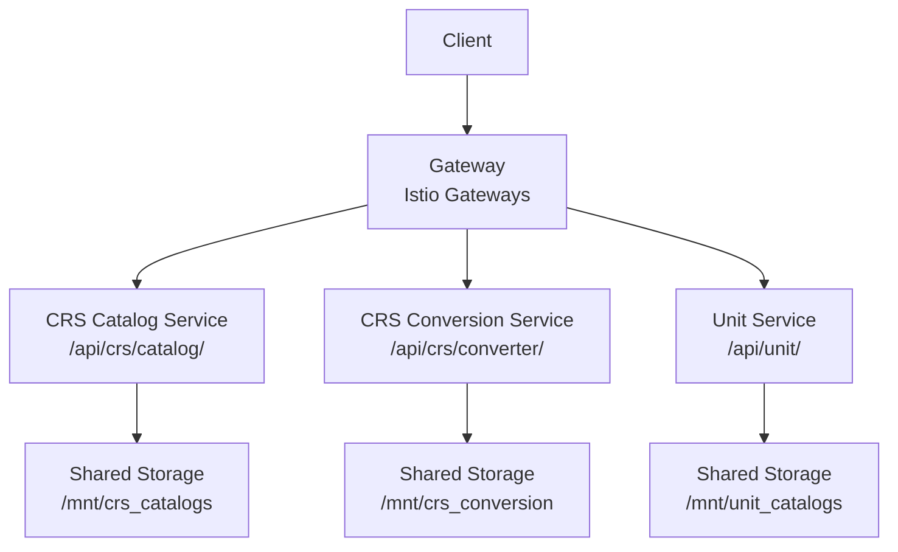
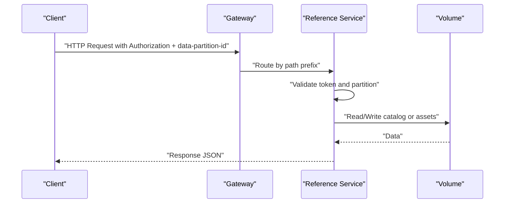
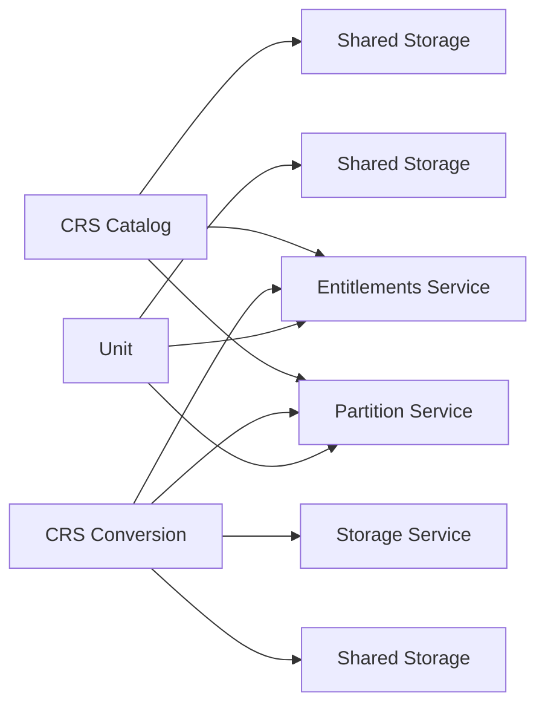

# Reference Services API

<cite>
**Referenced Files in This Document**
- [crs-catalog.http](file://tools/rest-scripts/crs-catalog.http)
- [crs-conversion.http](file://tools/rest-scripts/crs-conversion.http)
- [unit.http](file://tools/rest-scripts/unit.http)
- [crs-catalog.yaml](file://software/applications/osdu-reference/crs-catalog.yaml)
- [crs-conversion.yaml](file://software/applications/osdu-reference/crs-conversion.yaml)
- [unit.yaml](file://software/applications/osdu-reference/unit.yaml)
</cite>

## Table of Contents
1. [Introduction](#introduction)
2. [Project Structure](#project-structure)
3. [Core Components](#core-components)
4. [Architecture Overview](#architecture-overview)
5. [Detailed Component Analysis](#detailed-component-analysis)
6. [Dependency Analysis](#dependency-analysis)
7. [Performance Considerations](#performance-considerations)
8. [Troubleshooting Guide](#troubleshooting-guide)
9. [Conclusion](#conclusion)

## Introduction
This document provides detailed API documentation for the OSDU reference services: CRS Catalog, CRS Conversion, and Unit services. It covers REST endpoints for coordinate reference system management, unit conversion operations, and reference data access. For each service, you will find HTTP methods, URL patterns, request/response schemas, authentication requirements, practical examples, supported coordinate systems, available units, error handling, validation rules, and performance considerations for large datasets.

## Project Structure
The three reference services are deployed as separate Helm releases under the osdu-reference namespace and exposed via a common gateway with distinct context paths:
- CRS Catalog: /api/crs/catalog/
- CRS Conversion: /api/crs/converter/
- Unit: /api/unit/

Each service is containerized, health-checked, and secured using Azure AD (OAuth 2.0). The deployment manifests also mount shared storage volumes to host catalogs and conversion assets.

**Diagram sources**
- [crs-catalog.yaml:38-74](file://software/applications/osdu-reference/crs-catalog.yaml#L38-L74)
- [crs-conversion.yaml:38-75](file://software/applications/osdu-reference/crs-conversion.yaml#L38-L75)
- [unit.yaml:38-74](file://software/applications/osdu-reference/unit.yaml#L38-L74)

**Section sources**
- [crs-catalog.yaml:1-107](file://software/applications/osdu-reference/crs-catalog.yaml#L1-L107)
- [crs-conversion.yaml:1-114](file://software/applications/osdu-reference/crs-conversion.yaml#L1-L114)
- [unit.yaml:1-110](file://software/applications/osdu-reference/unit.yaml#L1-L110)

## Core Components
- CRS Catalog Service: Provides discovery and listing of coordinate reference systems and related metadata.
- CRS Conversion Service: Performs point, GeoJSON, and trajectory conversions between coordinate reference systems.
- Unit Service: Exposes unit catalogs, measurement types, unit maps, and unit systems for consistent physical quantity handling.

Authentication and partitioning:
- All requests require an Authorization header with a Bearer token obtained from Azure AD OAuth 2.0.
- Requests must include the data-partition-id header to scope calls to a specific partition.

Version endpoints:
- Each service exposes a version/info endpoint under its respective context path and version segment.

**Section sources**
- [crs-catalog.http:45-76](file://tools/rest-scripts/crs-catalog.http#L45-L76)
- [crs-conversion.http:104-142](file://tools/rest-scripts/crs-conversion.http#L104-L142)
- [unit.http:45-89](file://tools/rest-scripts/unit.http#L45-L89)
- [crs-catalog.yaml:57-67](file://software/applications/osdu-reference/crs-catalog.yaml#L57-L67)
- [crs-conversion.yaml:57-67](file://software/applications/osdu-reference/crs-conversion.yaml#L57-L67)
- [unit.yaml:57-67](file://software/applications/osdu-reference/unit.yaml#L57-L67)

## Architecture Overview
The services follow a consistent pattern:
- Gateway routes requests to the appropriate service based on the path prefix.
- Services validate OAuth tokens and partition headers.
- Services read/write catalog or conversion assets from mounted shared storage.
- Health and readiness probes ensure availability.

[No sources needed since this diagram shows conceptual workflow, not actual code structure]

## Detailed Component Analysis

### CRS Catalog Service
Base path: /api/crs/catalog/

Endpoints
- GET /v2/info
  - Purpose: Service info/version.
  - Headers: Authorization: Bearer <token>, data-partition-id: <partition>.
  - Response: JSON service metadata.

- GET /v2/area
  - Purpose: List area-related CRS entries.
  - Headers: Authorization: Bearer <token>, data-partition-id: <partition>.
  - Response: JSON array of area CRS items.

- GET /v2/catalog
  - Purpose: Retrieve the full CRS catalog.
  - Headers: Authorization: Bearer <token>, data-partition-id: <partition>.
  - Response: JSON catalog object.

- GET /v2/crs
  - Purpose: List CRS definitions.
  - Headers: Authorization: Bearer <token>, data-partition-id: <partition>.
  - Response: JSON array of CRS definitions.

Authentication
- Requires Azure AD OAuth 2.0 bearer token.
- Some endpoints may be unauthenticated per configuration; consult service-specific auth exemptions.

Partitioning
- data-partition-id header required for scoped access.

Examples
- See sample requests in the REST script file for v2/info, v2/area, v2/catalog, and v2/crs.

Supported Coordinate Systems
- The service exposes CRS definitions that typically include EPSG codes and WKT representations. Use the catalog and crs endpoints to discover available systems.

Error Handling
- Standard HTTP status codes apply (e.g., 401 Unauthorized, 403 Forbidden, 404 Not Found, 5xx Server Error).
- Validate presence of Authorization and data-partition-id headers.

Performance Considerations
- Large catalogs can be heavy; consider filtering at the client side after retrieval or use pagination if supported by the service implementation.
- Cache responses where appropriate to reduce repeated network calls.

**Section sources**
- [crs-catalog.http:45-76](file://tools/rest-scripts/crs-catalog.http#L45-L76)
- [crs-catalog.yaml:38-74](file://software/applications/osdu-reference/crs-catalog.yaml#L38-L74)
- [crs-catalog.yaml:57-67](file://software/applications/osdu-reference/crs-catalog.yaml#L57-L67)

### CRS Conversion Service
Base path: /api/crs/converter/

Endpoints
- GET /v2/info
  - Purpose: Service info/version.
  - Headers: Authorization: Bearer <token>, data-partition-id: <partition>.
  - Response: JSON service metadata.

- POST /v2/convert
  - Purpose: Convert points between coordinate reference systems.
  - Request body:
    - fromCRS: Stringified CRS definition (WKT-based).
    - points: Array of {x, y, z} coordinates.
    - toCRS: Stringified target CRS definition (WKT-based).
  - Response: Converted points in target CRS.

- POST /v2/convertGeoJson
  - Purpose: Convert GeoJSON-like structures involving azimuth references, input stations, interpolation, and trajectory CRS.
  - Request body includes fields such as azimuthReference, inputKind, inputStations, interpolate, method, referencePoint, trajectoryCRS, unitXY, unitZ.
  - Response: Converted geometry or trajectory data.

- POST /v2/convertTrajectory
  - Purpose: Compute and convert trajectories given station data and trajectory CRS.
  - Request body similar to convertGeoJson.
  - Response: Converted trajectory results.

Authentication
- Requires Azure AD OAuth 2.0 bearer token.
- Some endpoints may be unauthenticated per configuration; consult service-specific auth exemptions.

Partitioning
- data-partition-id header required for scoped access.

Examples
- See sample payloads and requests in the REST script file for basic point conversion, GeoJSON conversion, and trajectory computation.

Supported Coordinate Systems
- Uses WKT-based CRS definitions including geographic and projected coordinate systems. Discoverable via CRS Catalog or provided directly in conversion requests.

Validation Rules
- Ensure valid WKT strings for CRS definitions.
- Provide numeric x, y, z values within expected ranges.
- For trajectory endpoints, supply required fields like method, referencePoint, and units.

Error Handling
- Standard HTTP status codes apply.
- Common errors include invalid CRS WKT, missing fields, and unsupported transformations.

Performance Considerations
- Batch multiple points in a single request to minimize overhead.
- Reuse CRS definitions across calls to avoid redundant parsing.
- For large datasets, process in chunks and handle partial failures gracefully.

**Section sources**
- [crs-conversion.http:104-142](file://tools/rest-scripts/crs-conversion.http#L104-L142)
- [crs-conversion.yaml:38-75](file://software/applications/osdu-reference/crs-conversion.yaml#L38-L75)
- [crs-conversion.yaml:57-67](file://software/applications/osdu-reference/crs-conversion.yaml#L57-L67)

### Unit Service
Base path: /api/unit/

Endpoints
- GET /v3/info
  - Purpose: Service info/version.
  - Headers: Authorization: Bearer <token>.
  - Response: JSON service metadata.

- GET /v3/unit
  - Purpose: List units.
  - Headers: Authorization: Bearer <token>, data-partition-id: <partition>.
  - Response: JSON array of unit entries.

- GET /v3/catalog
  - Purpose: Retrieve unit catalog.
  - Headers: Authorization: Bearer <token>, data-partition-id: <partition>.
  - Response: JSON catalog object.

- GET /v3/measurement/list
  - Purpose: List measurement types.
  - Headers: Authorization: Bearer <token>, data-partition-id: <partition>.
  - Response: JSON array of measurement types.

- GET /v3/unit/maps
  - Purpose: Retrieve unit mapping tables.
  - Headers: Authorization: Bearer <token>, data-partition-id: <partition>.
  - Response: JSON mapping tables.

- GET /v3/unitsystem/list
  - Purpose: List unit systems.
  - Headers: Authorization: Bearer <token>, data-partition-id: <partition>.
  - Response: JSON array of unit systems.

Authentication
- Requires Azure AD OAuth 2.0 bearer token.
- Some endpoints may be unauthenticated per configuration; consult service-specific auth exemptions.

Partitioning
- data-partition-id header required for most endpoints.

Examples
- See sample requests in the REST script file for unit listing, catalog retrieval, measurement list, unit maps, and unit systems.

Available Units
- Units are organized by measurement types and unit systems. Use the measurement list and unit systems endpoints to discover supported categories and symbols.

Validation Rules
- Ensure correct partition scoping via data-partition-id.
- Validate unit symbols and measurement types against returned catalogs.

Error Handling
- Standard HTTP status codes apply.
- Handle cases where requested units or measurements are not found.

Performance Considerations
- Cache unit catalogs and mappings locally when possible.
- Avoid repeated enumeration of large catalogs; filter or paginate if supported.

**Section sources**
- [unit.http:45-89](file://tools/rest-scripts/unit.http#L45-L89)
- [unit.yaml:38-74](file://software/applications/osdu-reference/unit.yaml#L38-L74)
- [unit.yaml:57-67](file://software/applications/osdu-reference/unit.yaml#L57-L67)

## Dependency Analysis
Services depend on:
- Gateway routing by path prefix.
- Azure AD for authentication.
- Shared storage volumes for catalogs and conversion assets.
- Internal core services for partition and entitlement resolution.

**Diagram sources**
- [crs-catalog.yaml:104-107](file://software/applications/osdu-reference/crs-catalog.yaml#L104-L107)
- [crs-conversion.yaml:105-114](file://software/applications/osdu-reference/crs-conversion.yaml#L105-L114)
- [unit.yaml:106-109](file://software/applications/osdu-reference/unit.yaml#L106-L109)

**Section sources**
- [crs-catalog.yaml:104-107](file://software/applications/osdu-reference/crs-catalog.yaml#L104-L107)
- [crs-conversion.yaml:105-114](file://software/applications/osdu-reference/crs-conversion.yaml#L105-L114)
- [unit.yaml:106-109](file://software/applications/osdu-reference/unit.yaml#L106-L109)

## Performance Considerations
- Batch processing: Combine multiple points or records into single requests to reduce latency and overhead.
- Caching: Cache static catalogs (CRS definitions, unit lists, mappings) on the client side to minimize repeated calls.
- Chunking: For large datasets, split work into manageable chunks and implement retry logic for transient failures.
- Concurrency: Use asynchronous calls judiciously while respecting rate limits and quotas.
- Monitoring: Track response times and error rates; alert on degraded performance or high failure rates.

[No sources needed since this section provides general guidance]

## Troubleshooting Guide
Common issues and resolutions:
- Authentication failures:
  - Ensure a valid Azure AD bearer token is included in the Authorization header.
  - Verify token scopes and expiration.

- Partition errors:
  - Include the data-partition-id header where required.
  - Confirm the partition exists and is accessible.

- Invalid CRS or units:
  - Validate WKT strings for CRS definitions.
  - Cross-check unit symbols and measurement types against catalog endpoints.

- Service health:
  - Check health/readiness endpoints configured in deployments.
  - Review logs for runtime errors or dependency failures.

- Storage issues:
  - Verify shared storage mounts and permissions.
  - Ensure catalog files are present and readable.

**Section sources**
- [crs-catalog.yaml:57-67](file://software/applications/osdu-reference/crs-catalog.yaml#L57-L67)
- [crs-conversion.yaml:57-67](file://software/applications/osdu-reference/crs-conversion.yaml#L57-L67)
- [unit.yaml:57-67](file://software/applications/osdu-reference/unit.yaml#L57-L67)

## Conclusion
The OSDU reference services provide robust APIs for managing coordinate reference systems, performing conversions, and accessing unit catalogs. By following the documented endpoints, authentication requirements, and best practices for performance and error handling, clients can reliably integrate with these services to support geospatial and unit-aware workflows.

[No sources needed since this section summarizes without analyzing specific files]