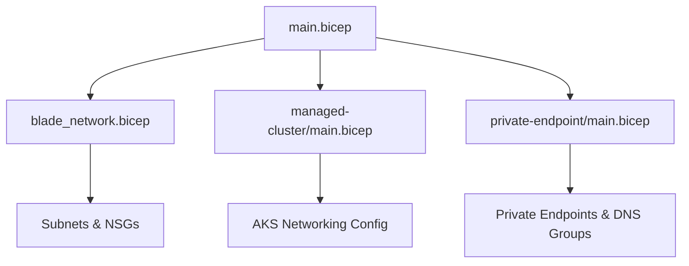
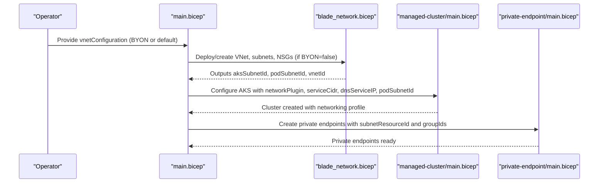
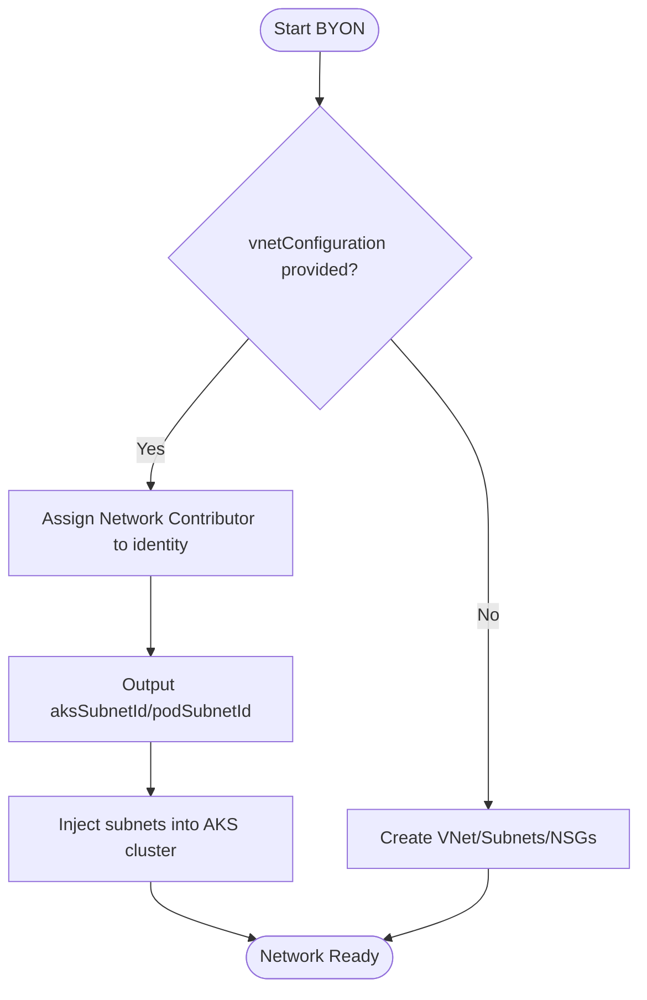
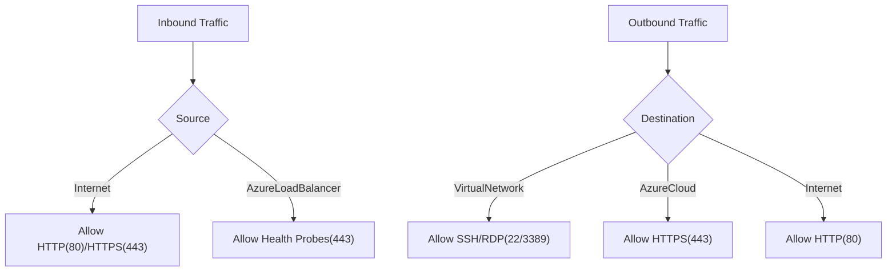
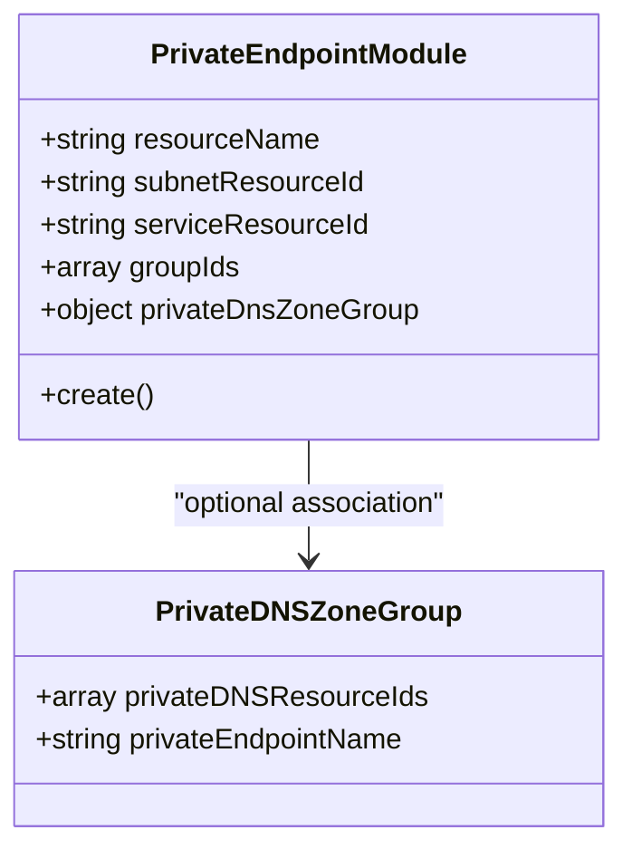
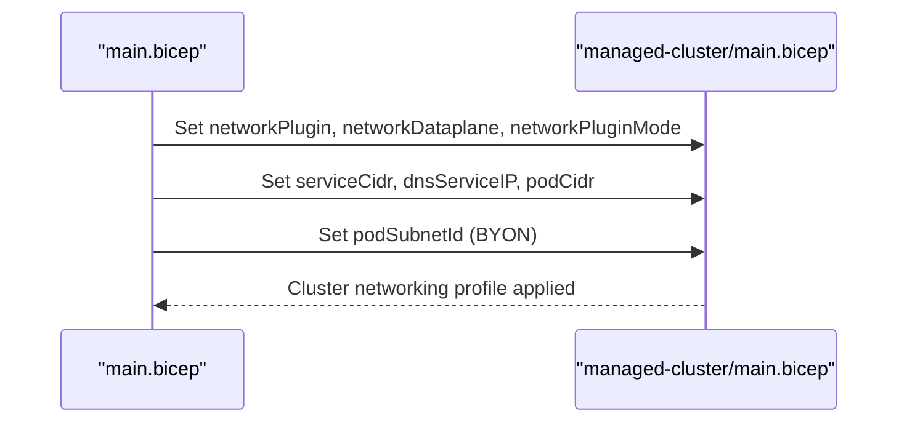
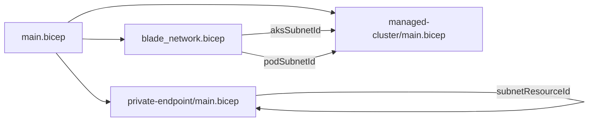

# Advanced Networking

<cite>
**Referenced Files in This Document**
- [advanced_vnet.md](file://docs/src/advanced_vnet.md)
- [main.bicep](file://bicep/main.bicep)
- [blade_network.bicep](file://bicep/modules/blade_network.bicep)
- [managed-cluster/main.bicep](file://bicep/modules/managed-cluster/main.bicep)
- [private-endpoint/main.bicep](file://bicep/modules/private-endpoint/main.bicep)
- [design_infrastructure.md](file://docs/src/design_infrastructure.md)
</cite>

## Table of Contents
1. [Introduction](#introduction)
2. [Project Structure](#project-structure)
3. [Core Components](#core-components)
4. [Architecture Overview](#architecture-overview)
5. [Detailed Component Analysis](#detailed-component-analysis)
6. [Dependency Analysis](#dependency-analysis)
7. [Performance Considerations](#performance-considerations)
8. [Troubleshooting Guide](#troubleshooting-guide)
9. [Conclusion](#conclusion)
10. [Appendices](#appendices)

## Introduction
This document provides comprehensive guidance for advanced networking configurations in OSDU platform deployments on Azure. It focuses on VNet integration patterns, custom network planning with Azure CNI, private endpoints configuration, and DNS customization. It also covers subnet sizing calculations, NSG rule setup, network security best practices, Bring Your Own Network (BYON) steps, configuring pod subnets, setting up managed identities for network access, troubleshooting connectivity issues, and performance optimization techniques for large-scale deployments.

## Project Structure
The OSDU deployment uses a stamp-based architecture orchestrated by a main Bicep file that composes modular “blades.” The networking blade provisions virtual networks, subnets, and NSGs or integrates with an existing VNet when BYON is selected. The cluster blade configures AKS networking options and injects the appropriate subnets. Private endpoints are provisioned via a dedicated module to connect services privately within the VNet.

**Diagram sources**
- [main.bicep:296-385](file://bicep/main.bicep#L296-L385)
- [blade_network.bicep:158-297](file://bicep/modules/blade_network.bicep#L158-L297)
- [managed-cluster/main.bicep:16-50](file://bicep/modules/managed-cluster/main.bicep#L16-L50)
- [private-endpoint/main.bicep:71-94](file://bicep/modules/private-endpoint/main.bicep#L71-L94)

**Section sources**
- [design_infrastructure.md:24-38](file://docs/src/design_infrastructure.md#L24-L38)
- [main.bicep:296-385](file://bicep/main.bicep#L296-L385)

## Core Components
- Virtual Network and Subnets:
  - Default VNet creation with cluster and optional pod subnets when not using BYON.
  - BYON support via vnetConfiguration parameters to reuse existing VNet/subnets.
- Network Security Groups:
  - Inbound/outbound rules for HTTP/HTTPS, SSH, and Azure Load Balancer health probes.
  - Service endpoints for Storage, Key Vault, and Container Registry on cluster subnet.
- AKS Networking:
  - Network plugin selection (azure/kubenet), dataplane (azure/cilium), and plugin mode (overlay).
  - Pod CIDR, service CIDR, DNS service IP, outbound type, and private cluster options.
- Private Endpoints:
  - Module to create private endpoints with optional private DNS zone groups and RBAC.
- Managed Identities:
  - Identity used to manage network resources and assign roles for subnet access.

**Section sources**
- [blade_network.bicep:52-194](file://bicep/modules/blade_network.bicep#L52-L194)
- [managed-cluster/main.bicep:16-50](file://bicep/modules/managed-cluster/main.bicep#L16-L50)
- [private-endpoint/main.bicep:71-140](file://bicep/modules/private-endpoint/main.bicep#L71-L140)
- [main.bicep:59-81](file://bicep/main.bicep#L59-L81)

## Architecture Overview
The deployment supports two primary networking modes:
- Default Mode: Creates a new VNet with a cluster subnet and an optional pod subnet, applies NSGs, and deploys AKS with Azure CNI overlay.
- BYON Mode: Reuses an existing VNet/subnets, assigns a managed identity with Network Contributor role, and injects those subnets into AKS.

**Diagram sources**
- [main.bicep:296-385](file://bicep/main.bicep#L296-L385)
- [blade_network.bicep:158-297](file://bicep/modules/blade_network.bicep#L158-L297)
- [managed-cluster/main.bicep:16-50](file://bicep/modules/managed-cluster/main.bicep#L16-L50)
- [private-endpoint/main.bicep:71-94](file://bicep/modules/private-endpoint/main.bicep#L71-L94)

## Detailed Component Analysis

### BYON and Custom Network Planning
- Use vnetConfiguration to specify existing VNet details and subnets for AKS and pods.
- When BYON is enabled, the network blade outputs resource IDs for the AKS and pod subnets to be consumed by the cluster blade.
- Ensure the managed identity has Network Contributor role over the VNet scope to allow AKS to attach subnets.

**Diagram sources**
- [main.bicep:59-81](file://bicep/main.bicep#L59-L81)
- [blade_network.bicep:158-194](file://bicep/modules/blade_network.bicep#L158-L194)
- [blade_network.bicep:294-297](file://bicep/modules/blade_network.bicep#L294-L297)

**Section sources**
- [main.bicep:59-81](file://bicep/main.bicep#L59-L81)
- [blade_network.bicep:158-194](file://bicep/modules/blade_network.bicep#L158-L194)
- [advanced_vnet.md:68-222](file://docs/src/advanced_vnet.md#L68-L222)

### Subnet Sizing Calculations
- Minimum subnet size formula: (number of nodes + 1) + ((number of nodes + 1) * maximum pods per node).
- Example: For 8 nodes with default 30 pods per node, minimum subnet size is /23 or larger.
- Kubernetes Service Address range must be smaller than /12.

**Section sources**
- [advanced_vnet.md:45-51](file://docs/src/advanced_vnet.md#L45-L51)

### NSG Rules Setup
- Default NSG rules include:
  - Allow inbound HTTP/HTTPS from Internet.
  - Allow inbound from AzureLoadBalancer for health checks.
  - Allow outbound SSH/RDP to VirtualNetwork.
  - Allow outbound to AzureCloud on port 443.
  - Allow outbound HTTP to Internet on port 80.
- Service endpoints for Storage, Key Vault, and Container Registry are attached to the cluster subnet.

**Diagram sources**
- [blade_network.bicep:52-156](file://bicep/modules/blade_network.bicep#L52-L156)

**Section sources**
- [blade_network.bicep:52-156](file://bicep/modules/blade_network.bicep#L52-L156)
- [blade_network.bicep:158-194](file://bicep/modules/blade_network.bicep#L158-L194)
- [advanced_vnet.md:102-158](file://docs/src/advanced_vnet.md#L102-L158)

### Private Endpoints Configuration
- Use the private endpoint module to create connections to services within a specified subnet.
- Optionally associate private DNS zone groups to resolve service names privately.
- Apply RBAC role assignments to control access to the private endpoint.

**Diagram sources**
- [private-endpoint/main.bicep:71-140](file://bicep/modules/private-endpoint/main.bicep#L71-L140)

**Section sources**
- [private-endpoint/main.bicep:71-140](file://bicep/modules/private-endpoint/main.bicep#L71-L140)

### AKS Networking Options and Pod Subnets
- Network plugin/dataplane/mode:
  - networkPlugin: azure or kubenet
  - networkDataplane: azure or cilium
  - networkPluginMode: overlay
- Pod/service CIDRs and DNS service IP can be configured.
- Pod subnet injection enables dynamic IP allocation with Azure CNI.

**Diagram sources**
- [managed-cluster/main.bicep:16-50](file://bicep/modules/managed-cluster/main.bicep#L16-L50)
- [managed-cluster/main.bicep:1097-1099](file://bicep/modules/managed-cluster/main.bicep#L1097-L1099)

**Section sources**
- [managed-cluster/main.bicep:16-50](file://bicep/modules/managed-cluster/main.bicep#L16-L50)
- [managed-cluster/main.bicep:1097-1099](file://bicep/modules/managed-cluster/main.bicep#L1097-L1099)

### DNS Customization
- Private cluster control plane FQDN exposure can be configured.
- Web application routing can integrate with DNS zones; contributor role assignment can be granted to the cluster’s web app routing identity.
- Private endpoints can be associated with private DNS zone groups for internal name resolution.

**Section sources**
- [managed-cluster/main.bicep:156-187](file://bicep/modules/managed-cluster/main.bicep#L156-L187)
- [managed-cluster/main.bicep:946-965](file://bicep/modules/managed-cluster/main.bicep#L946-L965)
- [private-endpoint/main.bicep:96-103](file://bicep/modules/private-endpoint/main.bicep#L96-L103)

### Step-by-Step Guides

#### Bring Your Own Network (BYON)
- Prepare an existing VNet with:
  - Cluster subnet (required)
  - Pod subnet (optional, enables Azure CNI dynamic IP allocation)
- Create a managed identity and assign Network Contributor role scoped to the VNet.
- Configure environment variables to point to your VNet and subnets, then run azd provision.

**Section sources**
- [advanced_vnet.md:68-222](file://docs/src/advanced_vnet.md#L68-L222)
- [advanced_vnet.md:282-387](file://docs/src/advanced_vnet.md#L282-L387)

#### Configure Pod Subnets
- Enable pod subnet by providing podSubnet.name and podSubnet.prefix in vnetConfiguration.
- Ensure sufficient address space per the subnet sizing formula.
- The network blade will output podSubnetId for AKS injection.

**Section sources**
- [main.bicep:59-81](file://bicep/main.bicep#L59-L81)
- [blade_network.bicep:158-194](file://bicep/modules/blade_network.bicep#L158-L194)
- [advanced_vnet.md:45-51](file://docs/src/advanced_vnet.md#L45-L51)

#### Set Up Managed Identities for Network Access
- Create a user-assigned identity and grant Network Contributor role over the VNet.
- Pass the identity ID to the network blade so it can manage subnets and NSGs.
- If using BYON, ensure the identity is authorized to attach subnets to AKS.

**Section sources**
- [advanced_vnet.md:198-222](file://docs/src/advanced_vnet.md#L198-L222)
- [blade_network.bicep:174-194](file://bicep/modules/blade_network.bicep#L174-L194)

## Dependency Analysis
The orchestration layer coordinates networking resources and AKS configuration:
- main.bicep conditionally invokes the network blade based on vnetConfiguration presence.
- The network blade outputs subnet IDs consumed by the cluster blade.
- Private endpoints are deployed independently but rely on subnet references.

**Diagram sources**
- [main.bicep:296-385](file://bicep/main.bicep#L296-L385)
- [blade_network.bicep:294-297](file://bicep/modules/blade_network.bicep#L294-L297)
- [private-endpoint/main.bicep:71-94](file://bicep/modules/private-endpoint/main.bicep#L71-L94)

**Section sources**
- [main.bicep:296-385](file://bicep/main.bicep#L296-L385)

## Performance Considerations
- Choose appropriate network plugin/dataplane:
  - Azure CNI with overlay mode offers efficient pod IP management.
  - Cilium dataplane can provide enhanced observability and policy enforcement.
- Outbound traffic:
  - Use managed NAT Gateway or user-defined routing for predictable egress.
- Subnet sizing:
  - Right-size subnets to avoid IP exhaustion under scale-out scenarios.
- Private endpoints:
  - Minimize hops and use private DNS zones to reduce latency and improve reliability.

[No sources needed since this section provides general guidance]

## Troubleshooting Guide
Common networking challenges and resolutions:
- Connectivity failures after BYON:
  - Verify NSG rules allow required inbound/outbound traffic.
  - Confirm service endpoints are enabled on the cluster subnet for Storage, Key Vault, and Container Registry.
- Pod scheduling issues:
  - Ensure pod subnet has sufficient IP addresses per the sizing formula.
  - Validate AKS networkPlugin and podSubnetId alignment.
- Private endpoint resolution:
  - Associate private DNS zone groups to enable internal name resolution.
  - Check that subnets have correct route tables and firewall/NAT policies.

**Section sources**
- [blade_network.bicep:52-156](file://bicep/modules/blade_network.bicep#L52-L156)
- [blade_network.bicep:158-194](file://bicep/modules/blade_network.bicep#L158-L194)
- [private-endpoint/main.bicep:96-103](file://bicep/modules/private-endpoint/main.bicep#L96-L103)

## Conclusion
OSDU’s networking design supports flexible VNet integration through BYON and default modes, robust NSG configurations, and private endpoints for secure service access. Proper subnet sizing, DNS customization, and managed identity permissions are critical for successful deployments. Following the step-by-step guides and troubleshooting recommendations ensures reliable, scalable, and secure networking for large-scale OSDU environments.

[No sources needed since this section summarizes without analyzing specific files]

## Appendices

### Reference Parameters and Flags
- vnetConfiguration fields:
  - group, name, prefix, identityId
  - aksSubnet: name, prefix
  - podSubnet: name, prefix
  - vmSubnet: name, prefix
  - bastionSubnet: name, prefix
- AKS networking parameters:
  - networkPlugin, networkDataplane, networkPluginMode
  - podCidr, serviceCidr, dnsServiceIP
  - outboundType, publicNetworkAccess, enablePrivateCluster

**Section sources**
- [main.bicep:59-81](file://bicep/main.bicep#L59-L81)
- [managed-cluster/main.bicep:16-50](file://bicep/modules/managed-cluster/main.bicep#L16-L50)