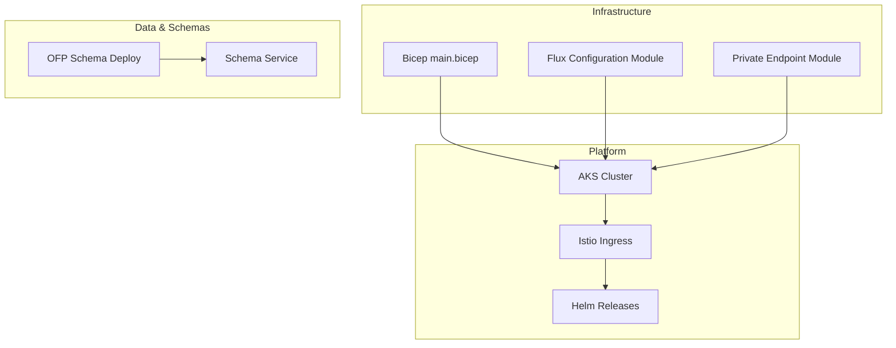
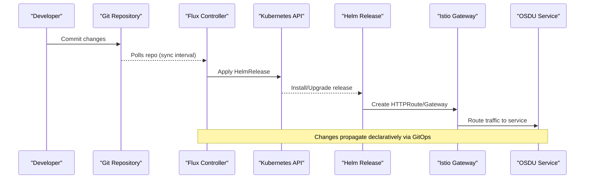
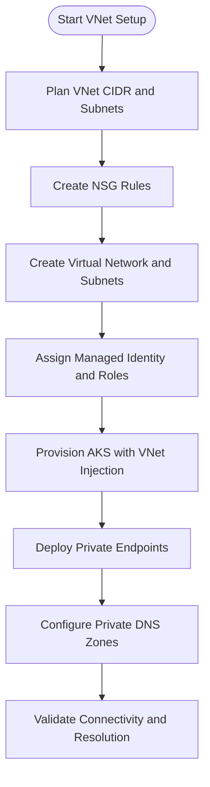
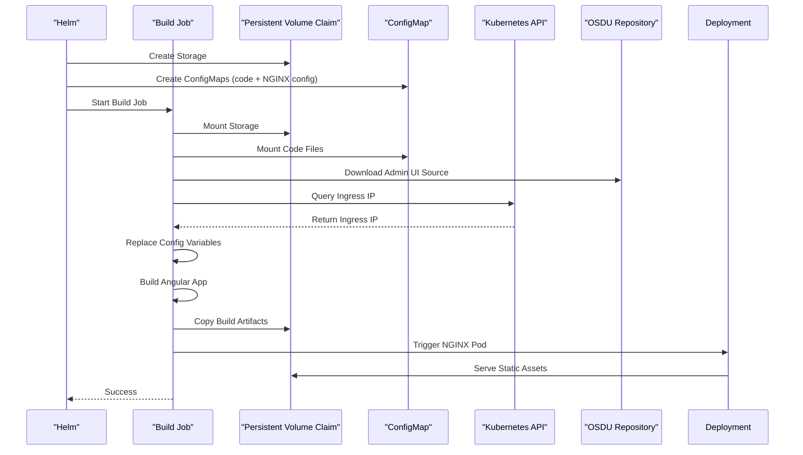
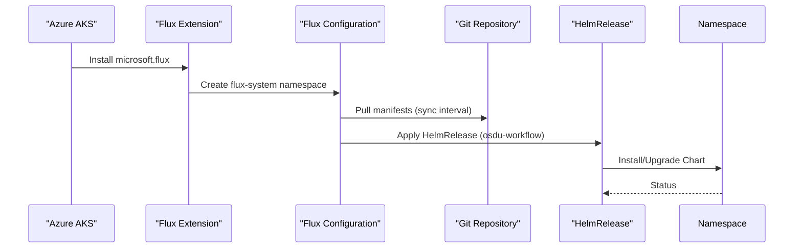
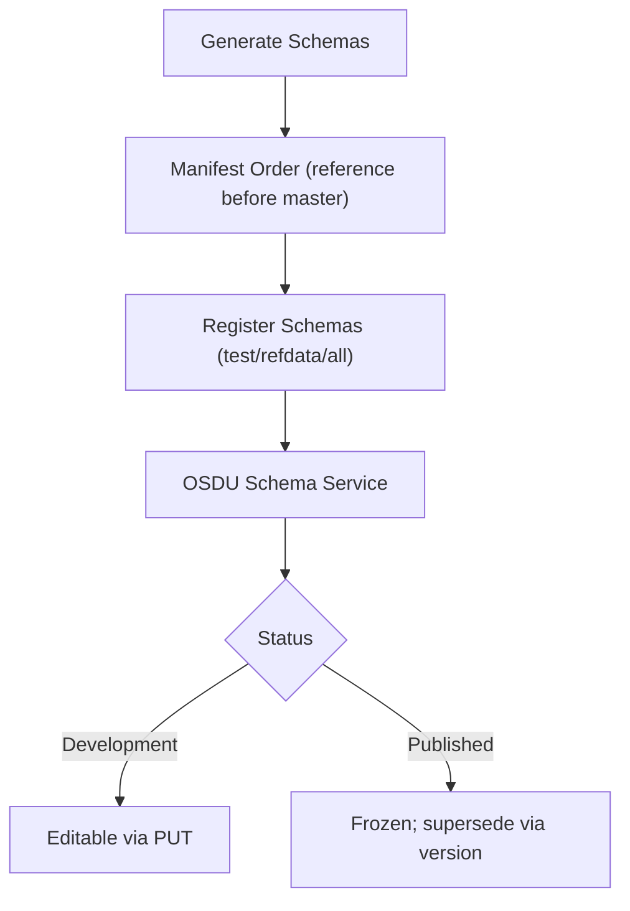
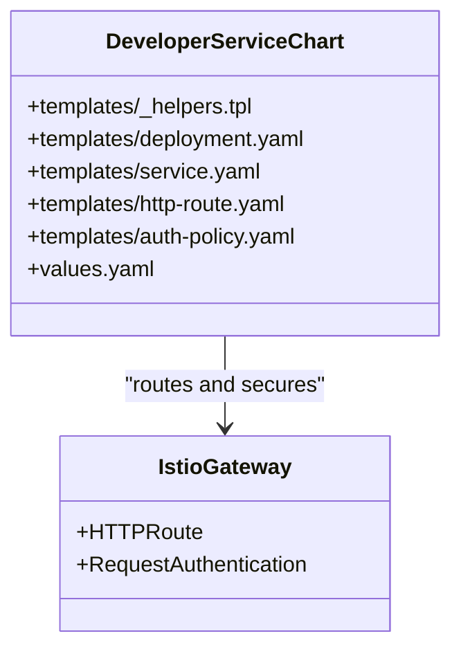
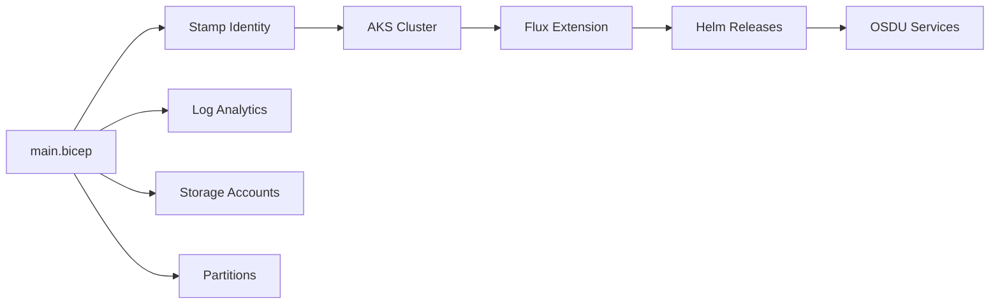

# Advanced Topics

<cite>
**Referenced Files in This Document**
- [advanced_vnet.md](file://docs/src/advanced_vnet.md)
- [experimental_adminui.md](file://docs/src/experimental_adminui.md)
- [flux-configuration README.md](file://bicep/modules/flux-configuration/README.md)
- [flux-extension README.md](file://bicep/modules/flux-extension/README.md)
- [private-endpoint README.md](file://bicep/modules/private-endpoint/README.md)
- [OFP schema deploy README.md](file://ofp-schema-deploy/README.md)
- [register_schemas.sh](file://ofp-schema-deploy/register_schemas.sh)
- [main.bicep](file://bicep/main.bicep)
- [design_infrastructure.md](file://docs/src/design_infrastructure.md)
- [services_core_schema.md](file://docs/src/services_core_schema.md)
- [workflow.yaml](file://software/applications/osdu-core/workflow.yaml)
- [admin-ui README.md](file://software/experimental/admin-ui/README.md)
</cite>

## Table of Contents
1. [Introduction](#introduction)
2. [Project Structure](#project-structure)
3. [Core Components](#core-components)
4. [Architecture Overview](#architecture-overview)
5. [Detailed Component Analysis](#detailed-component-analysis)
6. [Dependency Analysis](#dependency-analysis)
7. [Performance Considerations](#performance-considerations)
8. [Troubleshooting Guide](#troubleshooting-guide)
9. [Conclusion](#conclusion)
10. [Appendices](#appendices)

## Introduction
This document provides expert-level guidance for customizing and extending the OSDU platform with advanced networking, GitOps workflows, experimental features, schema deployment, and enterprise integration patterns. It focuses on VNet integration, private endpoints, custom DNS, Flux CD configuration, custom schema deployment processes, extensibility points, performance optimization, capacity planning, migration strategies, and approaches to building custom services.

## Project Structure
The repository organizes infrastructure as code (IaC), Helm charts, scripts, and documentation into clear layers:
- Infrastructure: Bicep modules for AKS, networking, private endpoints, and Flux configuration
- Applications and Services: Kubernetes manifests and Helm charts for core and reference services
- Experimental: Admin UI and related components
- Schema Deployment: Tools and scripts to generate and register OFP schemas into OSDU Schema Service
- Documentation: Guides for advanced networking, debugging, and service details

**Diagram sources**
- [main.bicep:1-200](file://bicep/main.bicep#L1-L200)
- [flux-configuration README.md:1-629](file://bicep/modules/flux-configuration/README.md#L1-L629)
- [private-endpoint README.md:1-115](file://bicep/modules/private-endpoint/README.md#L1-L115)
- [OFP schema deploy README.md:1-78](file://ofp-schema-deploy/README.md#L1-L78)

**Section sources**
- [design_infrastructure.md:1-38](file://docs/src/design_infrastructure.md#L1-L38)
- [main.bicep:1-200](file://bicep/main.bicep#L1-L200)

## Core Components
- Advanced Networking: VNet injection, pod subnet, NSG rules, and private endpoints with custom DNS zones
- GitOps with Flux: Azure-managed Flux extension and configurations driving Helm releases from Git
- Experimental Admin UI: Build pipeline via a Job, NGINX serving static assets from persistent storage
- Schema Deployment: Generate and register OFP entity model schemas into OSDU Schema Service
- Extensibility: Helm-based service chart for deploying custom services with Istio routing and auth policies

**Section sources**
- [advanced_vnet.md:1-387](file://docs/src/advanced_vnet.md#L1-L387)
- [flux-configuration README.md:1-629](file://bicep/modules/flux-configuration/README.md#L1-L629)
- [flux-extension README.md:1-619](file://bicep/modules/flux-extension/README.md#L1-L619)
- [private-endpoint README.md:1-115](file://bicep/modules/private-endpoint/README.md#L1-L115)
- [OFP schema deploy README.md:1-78](file://ofp-schema-deploy/README.md#L1-L78)
- [admin-ui README.md:1-29](file://software/experimental/admin-ui/README.md#L1-L29)

## Architecture Overview
The platform uses a stamp-based architecture enabling independent deployments per tenant or environment. Infrastructure is provisioned via Bicep, which provisions AKS, networking, and optional private endpoints. Flux is installed as an AKS extension and configured to reconcile Helm releases from a Git repository. Custom services are deployed using a standardized Helm chart that integrates with Istio for ingress and authentication.

**Diagram sources**
- [flux-extension README.md:1-619](file://bicep/modules/flux-extension/README.md#L1-L619)
- [flux-configuration README.md:1-629](file://bicep/modules/flux-configuration/README.md#L1-L629)
- [workflow.yaml:1-59](file://software/applications/osdu-core/workflow.yaml#L1-L59)

## Detailed Component Analysis

### Advanced Networking: VNet Integration, Private Endpoints, Custom DNS
- VNet Injection: Configure pre-existing virtual networks with dedicated subnets for cluster nodes and pods. Enable pod subnet for dynamic IP allocation and ensure proper NSGs and identity assignments.
- Private Endpoints: Use the private endpoint module to connect platform resources securely within the VNet, optionally associating private DNS zone groups for internal resolution.
- Custom DNS: Leverage private DNS zones and group configurations to resolve private endpoints by name inside the VNet.

**Diagram sources**
- [advanced_vnet.md:1-387](file://docs/src/advanced_vnet.md#L1-L387)
- [private-endpoint README.md:1-115](file://bicep/modules/private-endpoint/README.md#L1-L115)

**Section sources**
- [advanced_vnet.md:1-387](file://docs/src/advanced_vnet.md#L1-L387)
- [private-endpoint README.md:1-115](file://bicep/modules/private-endpoint/README.md#L1-L115)

### Experimental Features: Admin UI Usage Patterns
- Build Pipeline: A Job installs dependencies, downloads the Admin UI source, injects environment variables (including Ingress IP), builds the Angular app, and copies artifacts to persistent storage.
- Serving Assets: An NGINX deployment serves the built application from persistent storage, exposed via Ingress or HTTPRoute.

**Diagram sources**
- [admin-ui README.md:1-29](file://software/experimental/admin-ui/README.md#L1-L29)

**Section sources**
- [experimental_adminui.md:1-3](file://docs/src/experimental_adminui.md#L1-L3)
- [admin-ui README.md:1-29](file://software/experimental/admin-ui/README.md#L1-L29)

### Flux CD Configuration for GitOps Workflows
- Extension Installation: Install Flux as an AKS extension with configurable controllers (source-controller, kustomize-controller).
- Flux Configuration: Define GitRepository sources and Kustomizations to reconcile Helm releases into namespaces.
- Workflow Example: The workflow HelmRelease depends on partition and targets the osdu-core namespace, pulling values from ConfigMaps and exposing routes through Istio gateways.

**Diagram sources**
- [flux-extension README.md:1-619](file://bicep/modules/flux-extension/README.md#L1-L619)
- [flux-configuration README.md:1-629](file://bicep/modules/flux-configuration/README.md#L1-L629)
- [workflow.yaml:1-59](file://software/applications/osdu-core/workflow.yaml#L1-L59)

**Section sources**
- [flux-extension README.md:1-619](file://bicep/modules/flux-extension/README.md#L1-L619)
- [flux-configuration README.md:1-629](file://bicep/modules/flux-configuration/README.md#L1-L629)
- [workflow.yaml:1-59](file://software/applications/osdu-core/workflow.yaml#L1-L59)

### Custom Schema Deployment Processes
- Generation: Scripts generate OSDU draft-07 schema bodies from the OFP model, producing one file per kind with system properties inlined.
- Registration: A staged script posts schemas to the Schema Service, supporting test, reference-data, transaction-data, and all modes.
- Constraints: Schemas cannot be deleted; only promoted versions can supersede published kinds.

**Diagram sources**
- [OFP schema deploy README.md:1-78](file://ofp-schema-deploy/README.md#L1-L78)
- [register_schemas.sh:70-90](file://ofp-schema-deploy/register_schemas.sh#L70-L90)

**Section sources**
- [OFP schema deploy README.md:1-78](file://ofp-schema-deploy/README.md#L1-L78)
- [register_schemas.sh:70-90](file://ofp-schema-deploy/register_schemas.sh#L70-L90)
- [services_core_schema.md:1-40](file://docs/src/services_core_schema.md#L1-L40)

### Platform Extensibility Points
- Custom Service Chart: The developer service chart standardizes deployment with Istio policies, resource limits, secrets, and scaling options.
- Values-driven Configuration: Use ConfigMaps and values files to inject environment-specific settings without modifying templates.
- Routing and Auth: HTTPRoutes and RequestAuthentication integrate with Istio for secure access control.

**Diagram sources**
- [charts/osdu-developer-service/README.md:1-23](file://charts/osdu-developer-service/README.md#L1-L23)
- [workflow.yaml:1-59](file://software/applications/osdu-core/workflow.yaml#L1-L59)

**Section sources**
- [charts/osdu-developer-service/README.md:1-23](file://charts/osdu-developer-service/README.md#L1-L23)
- [workflow.yaml:1-59](file://software/applications/osdu-core/workflow.yaml#L1-L59)

## Dependency Analysis
- Infrastructure Dependencies: main.bicep orchestrates stamps, identities, logging, storage, and partitions; it includes feature flags for telemetry and VNet injection.
- Application Dependencies: Helm releases depend on foundational services (e.g., partition) and use ConfigMaps for values.
- External Integrations: Private endpoints require DNS zones and role assignments; Flux requires AKS extension manager feature registration.

**Diagram sources**
- [main.bicep:1-200](file://bicep/main.bicep#L1-L200)
- [flux-extension README.md:1-619](file://bicep/modules/flux-extension/README.md#L1-L619)

**Section sources**
- [main.bicep:1-200](file://bicep/main.bicep#L1-L200)
- [flux-extension README.md:1-619](file://bicep/modules/flux-extension/README.md#L1-L619)

## Performance Considerations
- Capacity Planning: Size subnets based on node count and maximum pods per node; ensure Kubernetes Service CIDR meets constraints.
- Scaling: Use Horizontal Pod Autoscaler and scaled objects where applicable; tune replica counts per service.
- Networking: Prefer pod subnet for dynamic IP allocation; isolate workloads with NSGs and private endpoints to reduce latency and improve security posture.
- Observability: Enable Application Insights and configure logging levels appropriately per service to balance visibility and overhead.

[No sources needed since this section provides general guidance]

## Troubleshooting Guide
- Flux Reconciliation Failures: Check sync intervals, timeouts, and repository access; verify controller enablement via extension configuration.
- Private Endpoint DNS Issues: Ensure private DNS zone groups are correctly associated and that resolution works within the VNet.
- Schema Registration Errors: Confirm bearer token permissions and data-partition headers; validate schema order and dependencies when registering multiple kinds.
- Admin UI Build Failures: Inspect Job logs for dependency installation and build steps; verify ConfigMap mounts and Ingress IP retrieval.

**Section sources**
- [flux-configuration README.md:1-629](file://bicep/modules/flux-configuration/README.md#L1-L629)
- [private-endpoint README.md:1-115](file://bicep/modules/private-endpoint/README.md#L1-L115)
- [OFP schema deploy README.md:1-78](file://ofp-schema-deploy/README.md#L1-L78)
- [admin-ui README.md:1-29](file://software/experimental/admin-ui/README.md#L1-L29)

## Conclusion
This guide consolidates advanced customization techniques for OSDU, emphasizing secure networking, GitOps-driven deployments, experimental features, schema management, and extensibility. By leveraging VNet injection, private endpoints, Flux CD, and standardized Helm charts, teams can scale and operate OSDU platforms reliably in enterprise environments.

[No sources needed since this section summarizes without analyzing specific files]

## Appendices

### Enterprise Integration Patterns
- Authentication and Authorization: Integrate with Active Directory and Istio RequestAuthentication for zero-trust access control.
- Secrets Management: Use Key Vault-backed secrets injected via ConfigMaps or secret references in Helm releases.
- Multi-Tenancy: Utilize stamps and partitions to isolate tenants while sharing infrastructure efficiently.

[No sources needed since this section provides general guidance]

### Migration Strategies for Large-Scale Deployments
- Incremental Rollouts: Use Helm upgrades with retries and health checks; leverage Flux’s reconciliation to apply changes gradually.
- Backward Compatibility: Maintain schema compatibility; publish new versions rather than mutating existing ones.
- Data Partitioning: Scale horizontally by adding partitions and distributing workloads across them.

[No sources needed since this section provides general guidance]