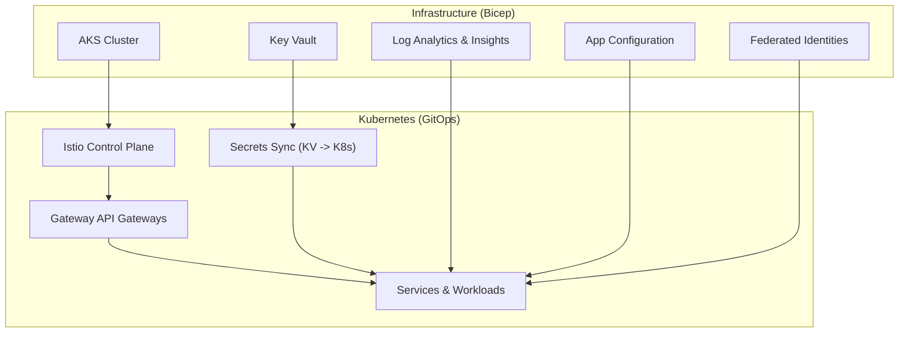
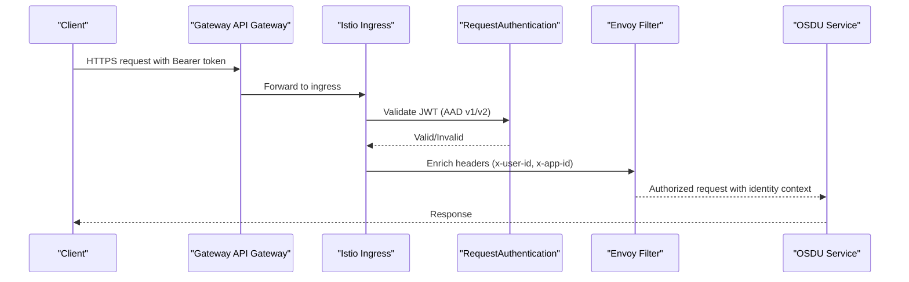
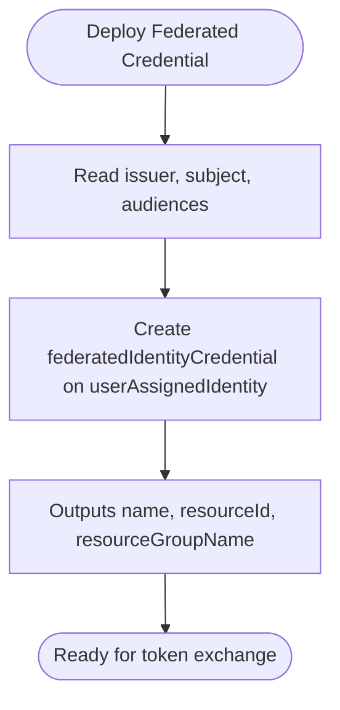
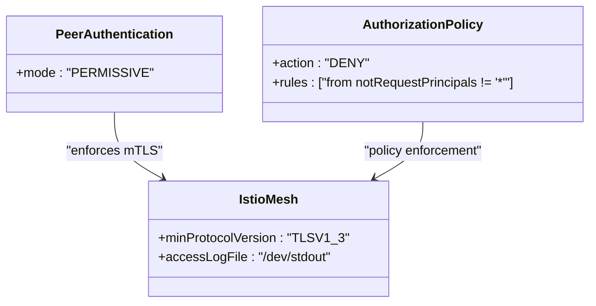
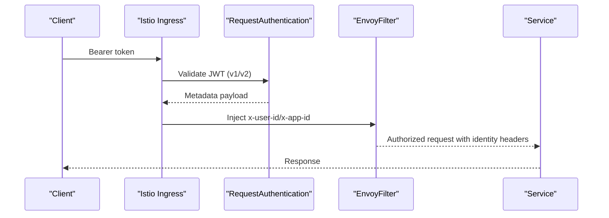
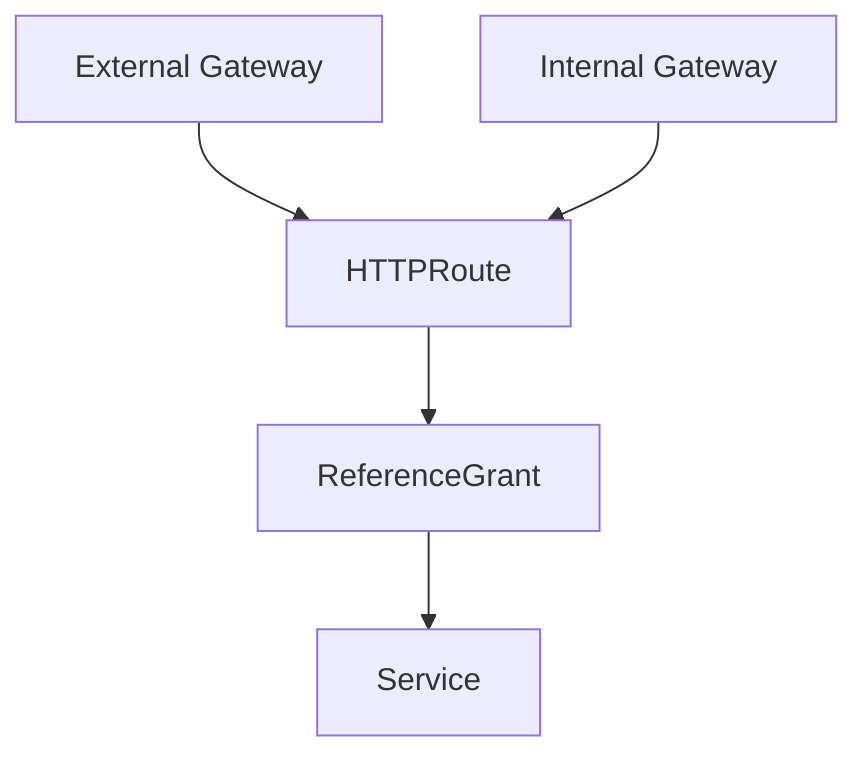
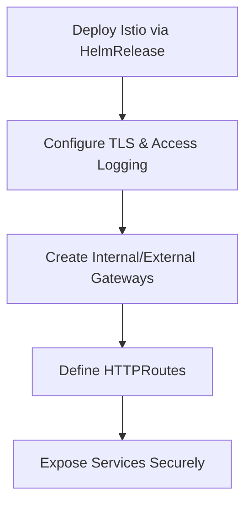
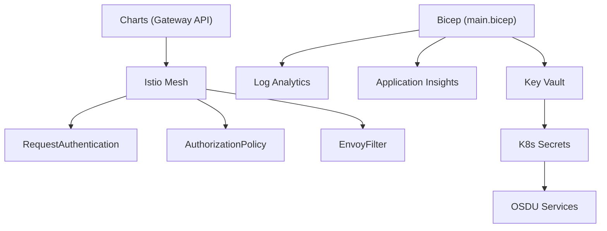

# Enterprise Integration Patterns

<cite>
**Referenced Files in This Document**
- [README.md](file://README.md)
- [SECURITY.md](file://SECURITY.md)
- [main.bicep](file://bicep/main.bicep)
- [federated_identity.bicep](file://bicep/modules/federated_identity.bicep)
- [blade_configuration.bicep](file://bicep/modules/blade_configuration.bicep)
- [request-authentication.yaml](file://charts/osdu-developer-base/templates/request-authentication.yaml)
- [envoy-filter.yaml](file://charts/osdu-developer-base/templates/envoy-filter.yaml)
- [envoy-filter.md](file://charts/osdu-developer-base/envoy-filter.md)
- [gateways.yaml](file://charts/istio-ingress/templates/gateways.yaml)
- [reference-grant.yaml](file://charts/osdu-developer-service/templates/reference-grant.yaml)
- [auth-policy.yaml](file://charts/osdu-developer-service/templates/auth-policy.yaml)
- [peer-authentication.yaml](file://charts/osdu-developer-base/templates/peer-authentication.yaml)
- [mesh.yaml](file://software/components/osdu-system/mesh.yaml)
- [values.yaml](file://charts/keyvault-secrets/values.yaml)
- [gateway-migration-summary.md](file://docs/gateway-migration-summary.md)
- [advanced_vnet.md](file://docs/src/advanced_vnet.md)
- [services_core_search.md](file://docs/src/services_core_search.md)
- [design_architecture.md](file://docs/src/design_architecture.md)
- [Application_Insights.md](file://src/Application_Insights.md)
</cite>

## Table of Contents
1. [Introduction](#introduction)
2. [Project Structure](#project-structure)
3. [Core Components](#core-components)
4. [Architecture Overview](#architecture-overview)
5. [Detailed Component Analysis](#detailed-component-analysis)
6. [Dependency Analysis](#dependency-analysis)
7. [Performance Considerations](#performance-considerations)
8. [Troubleshooting Guide](#troubleshooting-guide)
9. [Conclusion](#conclusion)
10. [Appendices](#appendices)

## Introduction
This document describes enterprise-grade integration patterns for deploying the OSDU platform on Azure, focusing on:
- Identity federation with Active Directory (Azure AD) and external identity providers
- Secret management via Azure Key Vault
- Secure service-to-service communication using Istio mTLS and JWT-based authentication
- API gateway configuration with Gateway API and dual ingress (internal/external)
- Microservice orchestration strategies, audit logging, compliance, disaster recovery, backup strategies, and multi-environment management

The repository provides Infrastructure as Code (Bicep), GitOps-driven Kubernetes manifests (Helm/Kustomize), and operational scripts to provision and manage a secure, compliant OSDU deployment.

**Section sources**
- [README.md:15-35](file://README.md#L15-L35)
- [design_architecture.md:11-28](file://docs/src/design_architecture.md#L11-L28)

## Project Structure
At a high level, the project is organized into:
- bicep: Infrastructure definitions for AKS, Key Vault, Log Analytics, App Configuration, storage, networking, and federated identities
- charts: Helm charts for Istio, Ingress/Gateway API, secrets synchronization, services, and base configurations
- software: Kustomize overlays and component manifests (e.g., mesh, observability, databases)
- docs: Architecture, services, and operational guidance
- scripts: Provisioning hooks and environment generation utilities

**Diagram sources**
- [main.bicep:191-247](file://bicep/main.bicep#L191-L247)
- [main.bicep:599-661](file://bicep/main.bicep#L599-L661)
- [mesh.yaml:101-143](file://software/components/osdu-system/mesh.yaml#L101-L143)
- [gateways.yaml:1-96](file://charts/istio-ingress/templates/gateways.yaml#L1-L96)

**Section sources**
- [design_architecture.md:111-169](file://docs/src/design_architecture.md#L111-L169)
- [bicep/README.md:1-87](file://bicep/README.md#L1-L87)

## Core Components
- Identity Federation: Federated identity credentials enable trust between external OIDC issuers and Azure-managed identities for workload authentication without long-lived secrets.
- Secret Management: Key Vault stores secrets; a chart synchronizes them into Kubernetes Secrets consumed by workloads.
- Authentication & Authorization: Istio RequestAuthentication validates JWTs from Azure AD v1/v2; Envoy filter enriches requests with user/app context headers; AuthorizationPolicy enforces per-service access rules.
- API Gateway: Gateway API defines external/internal gateways bound to Istio services; HTTPRoutes route traffic to services with cross-namespace permissions via ReferenceGrants.
- Service Mesh: Istio provides mTLS, telemetry, and policy enforcement across microservices.
- Observability & Compliance: Application Insights and Log Analytics provide telemetry; scripts enforce compliance settings.

**Section sources**
- [federated_identity.bicep:1-42](file://bicep/modules/federated_identity.bicep#L1-L42)
- [blade_configuration.bicep:194-206](file://bicep/modules/blade_configuration.bicep#L194-L206)
- [values.yaml:1-11](file://charts/keyvault-secrets/values.yaml#L1-L11)
- [request-authentication.yaml:1-33](file://charts/osdu-developer-base/templates/request-authentication.yaml#L1-L33)
- [envoy-filter.md:1-67](file://charts/osdu-developer-base/envoy-filter.md#L1-L67)
- [auth-policy.yaml:1-28](file://charts/osdu-developer-service/templates/auth-policy.yaml#L1-L28)
- [gateways.yaml:1-96](file://charts/istio-ingress/templates/gateways.yaml#L1-L96)
- [reference-grant.yaml:1-21](file://charts/osdu-developer-service/templates/reference-grant.yaml#L1-L21)
- [peer-authentication.yaml:1-7](file://charts/osdu-developer-base/templates/peer-authentication.yaml#L1-L7)
- [mesh.yaml:101-143](file://software/components/osdu-system/mesh.yaml#L101-L143)

## Architecture Overview
The deployment uses a layered architecture:
- External and internal gateways expose services over HTTPS/TLS termination
- Istio enforces mutual TLS and JWT validation at the edge and within the mesh
- Workloads consume secrets from Key Vault via synchronized Kubernetes Secrets
- Federated identities allow secure service-to-service calls and integrations with external systems

**Diagram sources**
- [gateways.yaml:1-96](file://charts/istio-ingress/templates/gateways.yaml#L1-L96)
- [request-authentication.yaml:1-33](file://charts/osdu-developer-base/templates/request-authentication.yaml#L1-L33)
- [envoy-filter.yaml:65-112](file://charts/osdu-developer-base/templates/envoy-filter.yaml#L65-L112)

**Section sources**
- [gateway-migration-summary.md:1-138](file://docs/gateway-migration-summary.md#L1-L138)
- [mesh.yaml:101-143](file://software/components/osdu-system/mesh.yaml#L101-L143)

## Detailed Component Analysis

### Identity Federation with Active Directory and External IdPs
- Federated identity credentials are created for user-assigned managed identities, enabling trust with external OIDC issuers.
- Audiences and subjects are configured to match tokens issued by external identity providers.
- Blade configuration iterates over federated credentials to create multiple mappings for different subjects.

**Diagram sources**
- [federated_identity.bicep:1-42](file://bicep/modules/federated_identity.bicep#L1-L42)
- [blade_configuration.bicep:194-206](file://bicep/modules/blade_configuration.bicep#L194-L206)

**Section sources**
- [federated_identity.bicep:1-42](file://bicep/modules/federated_identity.bicep#L1-L42)
- [blade_configuration.bicep:194-206](file://bicep/modules/blade_configuration.bicep#L194-L206)

### Secret Management with Key Vault
- Key Vault is provisioned with RBAC and network ACLs; secrets are injected during provisioning.
- A dedicated chart maps Key Vault secrets to Kubernetes Secrets for consumption by workloads.
- Values define client ID, tenant ID, vault name, and secret mappings.

**Diagram sources**
- [main.bicep:599-661](file://bicep/main.bicep#L599-L661)
- [values.yaml:1-11](file://charts/keyvault-secrets/values.yaml#L1-L11)

**Section sources**
- [main.bicep:599-661](file://bicep/main.bicep#L599-L661)
- [values.yaml:1-11](file://charts/keyvault-secrets/values.yaml#L1-L11)

### Secure Service-to-Service Communication
- PeerAuthentication enables mTLS in permissive mode to support gradual rollout.
- Istio control plane configures minimum TLS versions and access logging.
- AuthorizationPolicy denies unauthenticated requests except for explicitly allowed paths.

**Diagram sources**
- [peer-authentication.yaml:1-7](file://charts/osdu-developer-base/templates/peer-authentication.yaml#L1-L7)
- [auth-policy.yaml:1-28](file://charts/osdu-developer-service/templates/auth-policy.yaml#L1-L28)
- [mesh.yaml:127-143](file://software/components/osdu-system/mesh.yaml#L127-L143)

**Section sources**
- [peer-authentication.yaml:1-7](file://charts/osdu-developer-base/templates/peer-authentication.yaml#L1-L7)
- [auth-policy.yaml:1-28](file://charts/osdu-developer-service/templates/auth-policy.yaml#L1-L28)
- [mesh.yaml:127-143](file://software/components/osdu-system/mesh.yaml#L127-L143)

### Authentication and Authorization Patterns
- RequestAuthentication validates JWTs from both Azure AD v1 and v2 endpoints, extracting audiences and forwarding original tokens.
- EnvoyFilter processes Microsoft Identity tokens to set x-user-id and x-app-id headers based on claims and issuer type, including delegation flows.
- AuthorizationPolicy restricts access to services unless authenticated, with exceptions for specific paths.

**Diagram sources**
- [request-authentication.yaml:1-33](file://charts/osdu-developer-base/templates/request-authentication.yaml#L1-L33)
- [envoy-filter.yaml:65-112](file://charts/osdu-developer-base/templates/envoy-filter.yaml#L65-L112)
- [envoy-filter.md:14-31](file://charts/osdu-developer-base/envoy-filter.md#L14-L31)

**Section sources**
- [request-authentication.yaml:1-33](file://charts/osdu-developer-base/templates/request-authentication.yaml#L1-L33)
- [envoy-filter.md:1-67](file://charts/osdu-developer-base/envoy-filter.md#L1-L67)
- [auth-policy.yaml:1-28](file://charts/osdu-developer-service/templates/auth-policy.yaml#L1-L28)

### API Gateway Configurations
- Gateway API defines external and internal gateways with TLS termination and hostname binding.
- HTTPRoutes route traffic to services; ReferenceGrants allow cross-namespace routing from istio-system to service namespaces.
- Migration summary documents dual-gateway access and verification steps.

**Diagram sources**
- [gateways.yaml:1-96](file://charts/istio-ingress/templates/gateways.yaml#L1-L96)
- [reference-grant.yaml:1-21](file://charts/osdu-developer-service/templates/reference-grant.yaml#L1-L21)
- [gateway-migration-summary.md:1-138](file://docs/gateway-migration-summary.md#L1-L138)

**Section sources**
- [gateways.yaml:1-96](file://charts/istio-ingress/templates/gateways.yaml#L1-L96)
- [reference-grant.yaml:1-21](file://charts/osdu-developer-service/templates/reference-grant.yaml#L1-L21)
- [gateway-migration-summary.md:1-138](file://docs/gateway-migration-summary.md#L1-L138)

### Microservice Orchestration Strategies
- Istio control plane is deployed via HelmRelease with strict TLS settings and access logging enabled.
- Dual gateways (internal/external) provide flexible ingress strategies for VNet and internet access.
- Services are exposed through standardized HTTPRoutes and ReferenceGrants for secure cross-namespace routing.

**Diagram sources**
- [mesh.yaml:101-143](file://software/components/osdu-system/mesh.yaml#L101-L143)
- [mesh.yaml:144-241](file://software/components/osdu-system/mesh.yaml#L144-L241)

**Section sources**
- [mesh.yaml:101-143](file://software/components/osdu-system/mesh.yaml#L101-L143)
- [mesh.yaml:144-241](file://software/components/osdu-system/mesh.yaml#L144-L241)

### Integrating with Existing Enterprise Systems
- Environment variables configure endpoints for Partition, Entitlements, Policy services, and AAD client IDs.
- Advanced VNet documentation shows setting application IDs and feature flags for custom environments.
- Application Insights agent setup supports local development telemetry.

**Section sources**
- [services_core_search.md:14-38](file://docs/src/services_core_search.md#L14-L38)
- [advanced_vnet.md:282-342](file://docs/src/advanced_vnet.md#L282-L342)
- [Application_Insights.md:1-71](file://src/Application_Insights.md#L1-L71)

### Audit Logging and Compliance
- Istio access logs are enabled and streamed to stdout for centralized collection.
- Application Insights integration provides telemetry and diagnostics.
- Security policy outlines vulnerability reporting and coordinated disclosure practices.

**Section sources**
- [mesh.yaml:127-143](file://software/components/osdu-system/mesh.yaml#L127-L143)
- [Application_Insights.md:1-71](file://src/Application_Insights.md#L1-L71)
- [SECURITY.md:1-42](file://SECURITY.md#L1-L42)

### Disaster Recovery and Backup Strategies
- Cosmos DB backup policies support continuous or periodic modes with configurable retention and redundancy.
- Storage lifecycle policies automate tiering and deletion based on access patterns.
- These mechanisms ensure data durability and recoverability across regions.

**Section sources**
- [main.bicep:269-307](file://bicep/modules/cosmos-db/main.bicep#L269-L307)
- [storage-account/tests/e2e/max/main.test.bicep:459-512](file://bicep/modules/storage-account/tests/e2e/max/main.test.bicep#L459-L512)
- [storage-account/tests/e2e/waf-aligned/main.test.bicep:142-312](file://bicep/modules/storage-account/tests/e2e/waf-aligned/main.test.bicep#L142-L312)

### Multi-Environment Management Approaches
- GitOps-driven deployments use Helm releases and Flux to synchronize desired state across environments.
- Environment-specific values and feature toggles are applied via azd environment variables and configuration files.
- Dual gateways and ReferenceGrants enable consistent routing across dev/test/prod.

**Section sources**
- [design_architecture.md:111-169](file://docs/src/design_architecture.md#L111-L169)
- [gateway-migration-summary.md:1-138](file://docs/gateway-migration-summary.md#L1-L138)
- [advanced_vnet.md:282-342](file://docs/src/advanced_vnet.md#L282-L342)

## Dependency Analysis
The following diagram illustrates key dependencies among components:

**Diagram sources**
- [main.bicep:191-247](file://bicep/main.bicep#L191-L247)
- [main.bicep:599-661](file://bicep/main.bicep#L599-L661)
- [gateways.yaml:1-96](file://charts/istio-ingress/templates/gateways.yaml#L1-L96)
- [request-authentication.yaml:1-33](file://charts/osdu-developer-base/templates/request-authentication.yaml#L1-L33)
- [auth-policy.yaml:1-28](file://charts/osdu-developer-service/templates/auth-policy.yaml#L1-L28)
- [envoy-filter.yaml:65-112](file://charts/osdu-developer-base/templates/envoy-filter.yaml#L65-L112)
- [values.yaml:1-11](file://charts/keyvault-secrets/values.yaml#L1-L11)

**Section sources**
- [main.bicep:191-247](file://bicep/main.bicep#L191-L247)
- [main.bicep:599-661](file://bicep/main.bicep#L599-L661)
- [gateways.yaml:1-96](file://charts/istio-ingress/templates/gateways.yaml#L1-L96)
- [request-authentication.yaml:1-33](file://charts/osdu-developer-base/templates/request-authentication.yaml#L1-L33)
- [auth-policy.yaml:1-28](file://charts/osdu-developer-service/templates/auth-policy.yaml#L1-L28)
- [envoy-filter.yaml:65-112](file://charts/osdu-developer-base/templates/envoy-filter.yaml#L65-L112)
- [values.yaml:1-11](file://charts/keyvault-secrets/values.yaml#L1-L11)

## Performance Considerations
- Enforce minimum TLS versions (TLS 1.3) for secure and efficient communications.
- Enable access logging for observability and performance analysis.
- Use permissive mTLS during rollout to avoid disruptions, then tighten to STRICT as needed.
- Optimize gateway sizing and autoscaling for expected traffic patterns.

[No sources needed since this section provides general guidance]

## Troubleshooting Guide
- Verify gateway services and HTTPRoutes status when routes fail to apply.
- Check ReferenceGrants for cross-namespace permissions if services cannot be reached.
- Increase Istio proxy logging levels for detailed debugging of JWT validation and header enrichment.
- Ensure Key Vault RBAC and network ACLs allow access from cluster nodes and services.

**Section sources**
- [gateway-migration-summary.md:122-138](file://docs/gateway-migration-summary.md#L122-L138)
- [envoy-filter.md:58-67](file://charts/osdu-developer-base/envoy-filter.md#L58-L67)
- [main.bicep:599-661](file://bicep/main.bicep#L599-L661)

## Conclusion
This repository provides a comprehensive, enterprise-ready pattern for deploying OSDU on Azure with strong security and operational controls:
- Federated identities enable secure integrations with external systems
- Key Vault-backed secret management ensures sensitive data protection
- Istio-based mesh and Gateway API deliver robust authentication, authorization, and routing
- Observability and compliance features support auditing and regulatory requirements
- Backup and lifecycle policies enhance resilience and cost efficiency

[No sources needed since this section summarizes without analyzing specific files]

## Appendices
- Quickstart and CLI instructions for provisioning and configuring the environment
- Documentation links for advanced networking and service details

**Section sources**
- [README.md:25-73](file://README.md#L25-L73)
- [advanced_vnet.md:282-342](file://docs/src/advanced_vnet.md#L282-L342)