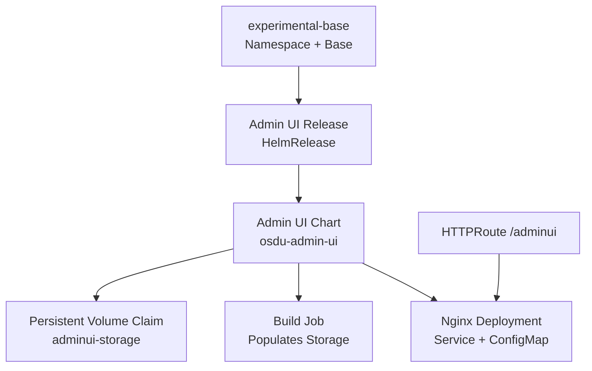
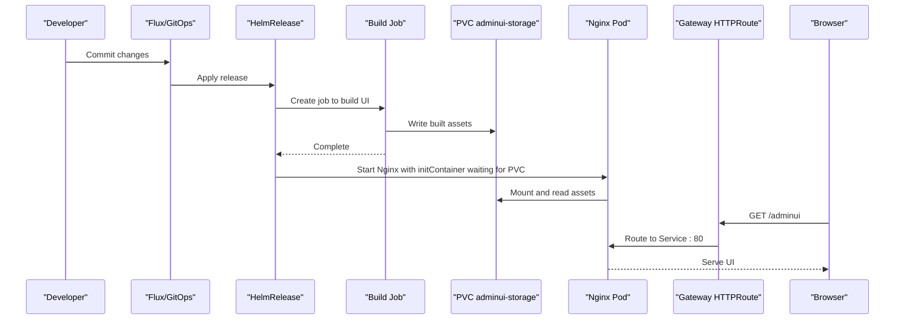
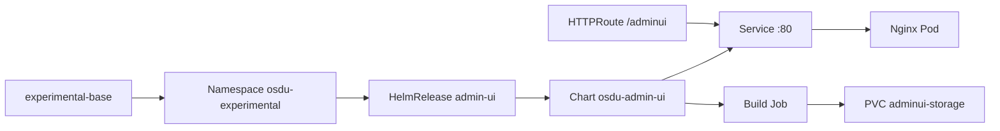

# Experimental Features

<cite>
**Referenced Files in This Document**
- [experimental_adminui.md](file://docs/src/experimental_adminui.md)
- [feature_flags.md](file://docs/src/feature_flags.md)
- [design_software.md](file://docs/src/design_software.md)
- [namespace.yaml](file://software/experimental/experimental-base/namespace.yaml)
- [release.yaml](file://software/experimental/admin-ui/release.yaml)
- [httproute.yaml](file://software/experimental/admin-ui/httproute.yaml)
- [ingress.yaml](file://software/experimental/admin-ui/ingress.yaml)
- [Chart.yaml](file://charts/osdu-admin-ui/Chart.yaml)
- [values.yaml](file://charts/osdu-admin-ui/values.yaml)
- [web-site.yaml](file://charts/osdu-admin-ui/templates/web-site.yaml)
- [code.yaml](file://charts/osdu-admin-ui/templates/code.yaml)
</cite>

## Table of Contents
1. [Introduction](#introduction)
2. [Project Structure](#project-structure)
3. [Core Components](#core-components)
4. [Architecture Overview](#architecture-overview)
5. [Detailed Component Analysis](#detailed-component-analysis)
6. [Dependency Analysis](#dependency-analysis)
7. [Performance Considerations](#performance-considerations)
8. [Troubleshooting Guide](#troubleshooting-guide)
9. [Conclusion](#conclusion)
10. [Appendices](#appendices)

## Introduction
This document explains the experimental features available in the OSDU platform with a focus on the Admin UI and other preview capabilities. It covers purpose, installation via feature flags, usage patterns, configuration options, integration points with core services, known limitations, migration guidance when features stabilize, and examples for customization and extension.

The Admin UI is an experimental web application that provides administrative capabilities over OSDU services. It is packaged as a Helm chart and deployed into a dedicated namespace. Access is provided through Gateway API HTTPRoute (with a deprecated Ingress path for reference). The UI is served by Nginx and built artifacts are delivered via a persistent volume populated by a job.

**Section sources**
- [feature_flags.md:73-80](file://docs/src/feature_flags.md#L73-L80)
- [design_software.md:251-275](file://docs/src/design_software.md#L251-L275)
- [Chart.yaml:1-9](file://charts/osdu-admin-ui/Chart.yaml#L1-L9)

## Project Structure
Experimental components are organized under software/experimental and charts/osdu-admin-ui. The base namespace and secrets are provisioned first, followed by the Admin UI release and routing resources.

**Diagram sources**
- [namespace.yaml:1-7](file://software/experimental/experimental-base/namespace.yaml#L1-L7)
- [release.yaml:1-54](file://software/experimental/admin-ui/release.yaml#L1-L54)
- [web-site.yaml:1-70](file://charts/osdu-admin-ui/templates/web-site.yaml#L1-L70)
- [httproute.yaml:1-28](file://software/experimental/admin-ui/httproute.yaml#L1-L28)

**Section sources**
- [design_software.md:251-275](file://docs/src/design_software.md#L251-L275)
- [namespace.yaml:1-7](file://software/experimental/experimental-base/namespace.yaml#L1-L7)
- [release.yaml:1-54](file://software/experimental/admin-ui/release.yaml#L1-L54)
- [httproute.yaml:1-28](file://software/experimental/admin-ui/httproute.yaml#L1-L28)

## Core Components
- Admin UI Helm chart: Installs Nginx-based serving, build job, storage, and environment configuration.
- Namespace isolation: Deployed in osdu-experimental to separate experimental workloads.
- Routing: Exposed via Gateway API HTTPRoute at /adminui; legacy Ingress template included for reference.
- Configuration injection: Values from ConfigMaps and Secrets provide client ID, tenant ID, MSI client ID, storage account name, and insights key.

Key responsibilities:
- Build and serve static assets for the Admin UI.
- Wire authentication scopes and API endpoints via generated environment files.
- Provide stable service endpoint behind cluster ingress/gateway.

**Section sources**
- [Chart.yaml:1-9](file://charts/osdu-admin-ui/Chart.yaml#L1-L9)
- [values.yaml:1-1](file://charts/osdu-admin-ui/values.yaml#L1-L1)
- [web-site.yaml:1-70](file://charts/osdu-admin-ui/templates/web-site.yaml#L1-L70)
- [code.yaml:1-29](file://charts/osdu-admin-ui/templates/code.yaml#L1-L29)
- [httproute.yaml:1-28](file://software/experimental/admin-ui/httproute.yaml#L1-L28)

## Architecture Overview
The Admin UI follows a simple, robust pattern:
- A build job prepares static content and writes it to a PersistentVolumeClaim.
- An init container waits until the build completes before starting Nginx.
- Nginx serves the UI from the mounted PVC.
- Gateway API routes /adminui to the Nginx Service.

**Diagram sources**
- [release.yaml:1-54](file://software/experimental/admin-ui/release.yaml#L1-L54)
- [web-site.yaml:1-70](file://charts/osdu-admin-ui/templates/web-site.yaml#L1-L70)
- [httproute.yaml:1-28](file://software/experimental/admin-ui/httproute.yaml#L1-L28)

## Detailed Component Analysis

### Admin UI Helm Chart
- Purpose: Install and run the Admin UI using Nginx, with a build step and persistent storage.
- Key templates:
  - web-site.yaml: Creates ConfigMap, Service, Deployment with init container, volumes, and mounts.
  - code.yaml: Generates environment configuration used by the UI for API endpoints and scopes.
  - values.yaml: Default values for the chart.
  - Chart.yaml: Metadata for the chart.

Behavioral notes:
- The deployment uses an init container to wait for the build artifact to appear in the PVC before starting Nginx.
- The Service exposes port 80 internally.
- Environment configuration is injected via a ConfigMap consumed by the UI.

Customization points:
- Adjust replica count or resource limits in the Deployment.
- Modify Nginx configuration via the ConfigMap if needed.
- Extend environment configuration in code.yaml to add new scopes or endpoints.

**Section sources**
- [Chart.yaml:1-9](file://charts/osdu-admin-ui/Chart.yaml#L1-L9)
- [values.yaml:1-1](file://charts/osdu-admin-ui/values.yaml#L1-L1)
- [web-site.yaml:1-70](file://charts/osdu-admin-ui/templates/web-site.yaml#L1-L70)
- [code.yaml:1-29](file://charts/osdu-admin-ui/templates/code.yaml#L1-L29)

### Namespace and Isolation
- The Admin UI runs in the osdu-experimental namespace, isolated from core services.
- Labels and Istio injection settings are defined for the namespace.

Operational implications:
- RBAC policies should scope access to this namespace for administrators.
- Network policies can be applied to restrict traffic to/from the Admin UI.

**Section sources**
- [namespace.yaml:1-7](file://software/experimental/experimental-base/namespace.yaml#L1-L7)

### Routing and Exposure
- Primary exposure: Gateway API HTTPRoute matching path prefix /adminui and rewriting to root.
- Legacy support: Deprecated Ingress/VirtualService template remains for reference.

Routing behavior:
- Requests to /adminui are rewritten to / and forwarded to the Admin UI Service on port 80.
- Both internal and external gateways are referenced.

**Section sources**
- [httproute.yaml:1-28](file://software/experimental/admin-ui/httproute.yaml#L1-L28)
- [ingress.yaml:1-25](file://software/experimental/admin-ui/ingress.yaml#L1-L25)

### Feature Flags and Installation
- Enable experimental software globally with ENABLE_EXPERIMENTAL.
- Enable the Admin UI specifically with ENABLE_ADMIN_UI.
- These flags control whether experimental manifests are loaded during provisioning.

Installation steps:
- Set the feature flags prior to provisioning.
- Ensure required ConfigMaps and Secrets exist for client_id, tenant_id, azure_msi_client_id, azurestorageaccountname, and azureinsightskey.
- Apply the experimental base namespace and then the Admin UI release.

Usage patterns:
- After deployment, access the UI via the gateway route /adminui.
- Configure scopes and API endpoints via the generated environment configuration.

**Section sources**
- [feature_flags.md:73-80](file://docs/src/feature_flags.md#L73-L80)
- [release.yaml:1-54](file://software/experimental/admin-ui/release.yaml#L1-L54)

### Integration Points with Core Services
- Authentication and authorization: Uses client_id, tenant_id, and msi_client_id to integrate with identity providers.
- Storage and telemetry: Uses azurestorageaccountname and azureinsightskey for storage and monitoring integrations.
- API endpoints and Graph API: Environment configuration maps API endpoints and scopes for protected calls.

Security considerations:
- Ensure proper scoping of tokens to only necessary APIs.
- Restrict network access to the Admin UI via Gateway policies.

**Section sources**
- [release.yaml:1-54](file://software/experimental/admin-ui/release.yaml#L1-L54)
- [code.yaml:1-29](file://charts/osdu-admin-ui/templates/code.yaml#L1-L29)

## Dependency Analysis
The Admin UI depends on:
- experimental-base namespace and base resources.
- ConfigMaps and Secrets containing identity and storage configuration.
- Gateway API HTTPRoute for exposure.
- Persistent storage for build artifacts.

**Diagram sources**
- [namespace.yaml:1-7](file://software/experimental/experimental-base/namespace.yaml#L1-L7)
- [release.yaml:1-54](file://software/experimental/admin-ui/release.yaml#L1-L54)
- [web-site.yaml:1-70](file://charts/osdu-admin-ui/templates/web-site.yaml#L1-L70)
- [httproute.yaml:1-28](file://software/experimental/admin-ui/httproute.yaml#L1-L28)

**Section sources**
- [design_software.md:251-275](file://docs/src/design_software.md#L251-L275)
- [release.yaml:1-54](file://software/experimental/admin-ui/release.yaml#L1-L54)

## Performance Considerations
- Single replica Nginx deployment is suitable for development and small teams. Scale replicas if concurrent admin sessions increase.
- Persistent storage ensures build artifacts persist across pod restarts; ensure adequate capacity for large UI builds.
- Init container waits for build completion; monitor job duration and adjust timeouts if builds are slow.
- Gateway rewrite adds minimal overhead; consider caching strategies at the edge if high traffic is expected.

[No sources needed since this section provides general guidance]

## Troubleshooting Guide
Common issues and resolutions:
- Admin UI not accessible at /adminui:
  - Verify HTTPRoute exists and matches /adminui path prefix.
  - Confirm backend Service and Pod are ready and listening on port 80.
  - Check that both internal and external gateways are configured.

- Build artifacts missing:
  - Inspect the build job logs to ensure assets were written to the PVC.
  - Validate the init container is waiting for the file and the PVC is mounted correctly.

- Authentication failures:
  - Ensure client_id, tenant_id, and msi_client_id are correctly set in valuesFrom.
  - Verify scopes include required permissions for OSDU APIs and Graph API.

- Storage or telemetry errors:
  - Confirm azurestorageaccountname and azureinsightskey are present and valid.
  - Check network policies and firewall rules allowing outbound calls.

**Section sources**
- [httproute.yaml:1-28](file://software/experimental/admin-ui/httproute.yaml#L1-L28)
- [web-site.yaml:1-70](file://charts/osdu-admin-ui/templates/web-site.yaml#L1-L70)
- [release.yaml:1-54](file://software/experimental/admin-ui/release.yaml#L1-L54)

## Conclusion
The Admin UI is an experimental feature designed to provide administrative capabilities over OSDU services. It is installed via feature flags, isolated in its own namespace, and exposed through Gateway API routing. The chart encapsulates build, storage, and serving logic, while configuration is injected via ConfigMaps and Secrets. As the feature matures, expect stabilization of APIs, enhanced security controls, and clearer migration paths to production-grade alternatives.

[No sources needed since this section summarizes without analyzing specific files]

## Appendices

### Known Limitations
- Experimental status: Subject to change; not recommended for production without careful evaluation.
- Documentation placeholder: Some documentation pages indicate upcoming content.

**Section sources**
- [experimental_adminui.md:1-3](file://docs/src/experimental_adminui.md#L1-L3)

### Migration Path When Stable
- Plan to replace experimental components with supported equivalents once GA.
- Preserve configuration in ConfigMaps/Secrets to ease migration.
- Update routing to use stable ingress/gateway configurations.
- Validate authentication scopes and API endpoints against updated contracts.

[No sources needed since this section provides general guidance]

### Customization Examples
- Add new API endpoints or scopes:
  - Edit the environment configuration template to include additional endpoints and scopes.
  - Rebuild and redeploy to apply changes.

- Customize Nginx behavior:
  - Modify the Nginx ConfigMap to add headers, redirects, or caching rules.

- Extend build process:
  - Adjust the build job to include additional asset generation steps.

**Section sources**
- [code.yaml:1-29](file://charts/osdu-admin-ui/templates/code.yaml#L1-L29)
- [web-site.yaml:1-70](file://charts/osdu-admin-ui/templates/web-site.yaml#L1-L70)