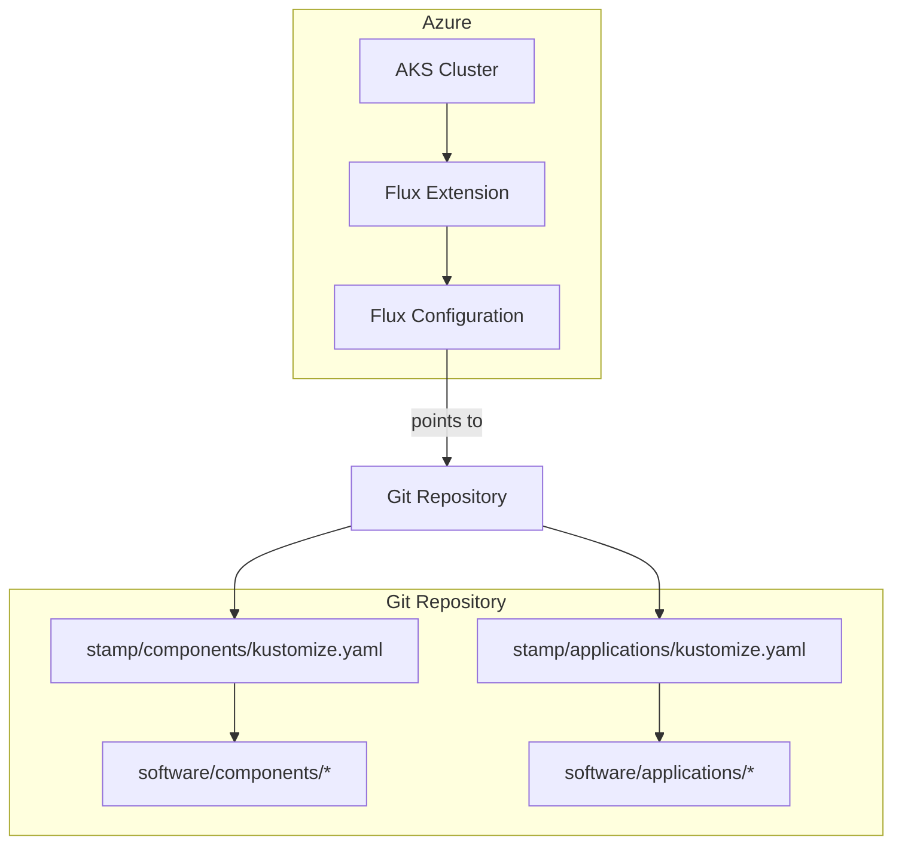
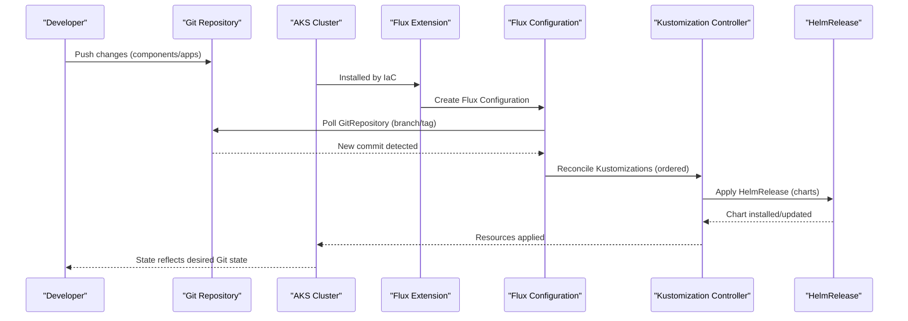
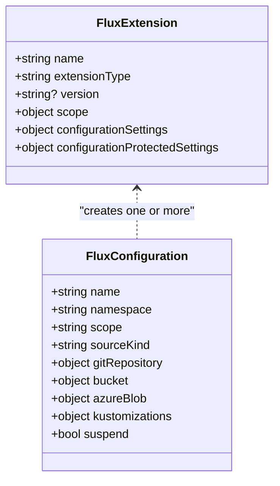
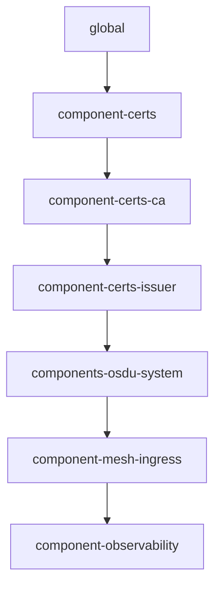
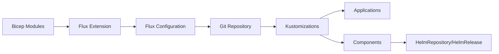

# GitOps with Flux CD

<cite>
**Referenced Files in This Document**
- [main.bicep](file://bicep/modules/flux-configuration/main.bicep)
- [main.bicep](file://bicep/modules/flux-extension/main.bicep)
- [blade_configuration.bicep](file://bicep/modules/blade_configuration.bicep)
- [kustomize.yaml](file://stamp/components/kustomize.yaml)
- [kustomize.yaml](file://stamp/applications/kustomize.yaml)
- [kustomization.yaml](file://software/applications/kustomization.yaml)
- [kustomization.yaml](file://software/components/global/kustomization.yaml)
- [source.yaml](file://software/components/global/source.yaml)
- [release.yaml](file://software/components/global/release.yaml)
- [monitor-flux.sh](file://monitor-flux.sh)
- [monitor-eastus-deployment.sh](file://monitor-eastus-deployment.sh)
- [design_architecture.md](file://docs/src/design_architecture.md)
- [pipelines.md](file://docs/pipelines.md)
- [test.yml](file://.github/workflows/test.yml)
- [dependabot.yml](file://.github/dependabot.yml)
</cite>

## Table of Contents
1. [Introduction](#introduction)
2. [Project Structure](#project-structure)
3. [Core Components](#core-components)
4. [Architecture Overview](#architecture-overview)
5. [Detailed Component Analysis](#detailed-component-analysis)
6. [Dependency Analysis](#dependency-analysis)
7. [Performance Considerations](#performance-considerations)
8. [Troubleshooting Guide](#troubleshooting-guide)
9. [Conclusion](#conclusion)
10. [Appendices](#appendices)

## Introduction
This document explains how OSDU implements GitOps using Flux CD to manage application versions, automate deployments, and maintain configuration drift control on Azure Kubernetes Service (AKS). It covers the end-to-end flow from infrastructure provisioning through Bicep modules that install the Flux extension and configure a GitRepository source, to Kustomization resources that reconcile components and applications from a Git repository. It also includes monitoring scripts, CI/CD integration points, security considerations, and best practices for team collaboration.

## Project Structure
The repository organizes GitOps-related artifacts across several layers:
- Infrastructure-as-code (Bicep) provisions AKS and installs the Kubernetes Configuration Extension for Flux, then creates a Flux Configuration pointing to a Git repository.
- The Git repository contains Kustomization manifests that declare ordered reconciliation of components and applications.
- Application and component directories under software/ hold Kustomize overlays and Kubernetes manifests referenced by Kustomizations.
- Monitoring scripts poll AKS and Flux compliance state to provide operational visibility.
- GitHub Actions define CI/CD workflows for validation, builds, and releases.

**Diagram sources**
- [main.bicep:77-91](file://bicep/modules/flux-configuration/main.bicep#L77-L91)
- [main.bicep:65-88](file://bicep/modules/flux-extension/main.bicep#L65-L88)
- [blade_configuration.bicep:494-559](file://bicep/modules/blade_configuration.bicep#L494-L559)
- [kustomize.yaml:1-19](file://stamp/components/kustomize.yaml#L1-L19)
- [kustomize.yaml:1-19](file://stamp/applications/kustomize.yaml#L1-L19)

**Section sources**
- [main.bicep:77-91](file://bicep/modules/flux-configuration/main.bicep#L77-L91)
- [main.bicep:65-88](file://bicep/modules/flux-extension/main.bicep#L65-L88)
- [blade_configuration.bicep:494-559](file://bicep/modules/blade_configuration.bicep#L494-L559)
- [kustomize.yaml:1-19](file://stamp/components/kustomize.yaml#L1-L19)
- [kustomize.yaml:1-19](file://stamp/applications/kustomize.yaml#L1-L19)

## Core Components
- Flux Extension and Configuration:
  - The extension is installed on the AKS cluster and can create one or more Flux Configurations. Each configuration defines the source kind (GitRepository or Bucket), repository reference (branch/tag), sync intervals, and kustomizations to reconcile.
- Kustomization Manifests:
  - stamp/components/kustomize.yaml and stamp/applications/kustomize.yaml define ordered Kustomizations that pull manifests from paths within the same Git repository. They set prune, wait, timeouts, retry intervals, and health checks.
- Application and Component Overlays:
  - software/applications/kustomization.yaml aggregates application resources; software/components/global/kustomization.yaml aggregates global components such as CRDs and HelmRelease definitions.
- Source and Release:
  - software/components/global/source.yaml declares external Helm repositories consumed by Flux.
  - software/components/global/release.yaml defines a HelmRelease to install a chart from the declared HelmRepository.

Key responsibilities:
- Version pinning via branch/tag in the GitRepository reference.
- Ordered rollout via dependsOn between Kustomizations.
- Drift control via prune and wait semantics.
- Health checks to gate progression and signal readiness.

**Section sources**
- [main.bicep:77-91](file://bicep/modules/flux-configuration/main.bicep#L77-L91)
- [main.bicep:90-109](file://bicep/modules/flux-extension/main.bicep#L90-L109)
- [blade_configuration.bicep:494-559](file://bicep/modules/blade_configuration.bicep#L494-L559)
- [kustomize.yaml:1-19](file://stamp/components/kustomize.yaml#L1-L19)
- [kustomize.yaml:1-19](file://stamp/applications/kustomize.yaml#L1-L19)
- [kustomization.yaml:1-10](file://software/applications/kustomization.yaml#L1-L10)
- [kustomization.yaml:1-9](file://software/components/global/kustomization.yaml#L1-L9)
- [source.yaml:1-9](file://software/components/global/source.yaml#L1-L9)
- [release.yaml:1-43](file://software/components/global/release.yaml#L1-L43)

## Architecture Overview
The deployment lifecycle begins with Bicep provisioning AKS and installing the Flux extension. A Flux Configuration is created to point at a Git repository containing Kustomization manifests. Flux reconciles these Kustomizations in order, applying components first (global, certs, mesh, observability) and then applications (OSDU services, web site). External Helm charts are sourced via HelmRepository and installed using HelmRelease.

**Diagram sources**
- [main.bicep:77-91](file://bicep/modules/flux-configuration/main.bicep#L77-L91)
- [main.bicep:90-109](file://bicep/modules/flux-extension/main.bicep#L90-L109)
- [blade_configuration.bicep:494-559](file://bicep/modules/blade_configuration.bicep#L494-L559)
- [kustomize.yaml:1-19](file://stamp/components/kustomize.yaml#L1-L19)
- [kustomize.yaml:1-19](file://stamp/applications/kustomize.yaml#L1-L19)
- [release.yaml:1-43](file://software/components/global/release.yaml#L1-L43)

## Detailed Component Analysis

### Flux Extension and Configuration
- The extension resource configures the Flux extension type, optional version pinning, release/target namespaces, and protected settings.
- The configuration resource binds the AKS cluster to a GitRepository (or Bucket/AzureBlob), sets sync intervals, and defines multiple Kustomizations for components, applications, and optional experimental workloads. Dependencies between Kustomizations ensure safe rollout order.

**Diagram sources**
- [main.bicep:65-88](file://bicep/modules/flux-extension/main.bicep#L65-L88)
- [main.bicep:90-109](file://bicep/modules/flux-extension/main.bicep#L90-L109)
- [main.bicep:77-91](file://bicep/modules/flux-configuration/main.bicep#L77-L91)

**Section sources**
- [main.bicep:65-88](file://bicep/modules/flux-extension/main.bicep#L65-L88)
- [main.bicep:90-109](file://bicep/modules/flux-extension/main.bicep#L90-L109)
- [main.bicep:77-91](file://bicep/modules/flux-configuration/main.bicep#L77-L91)
- [blade_configuration.bicep:494-559](file://bicep/modules/blade_configuration.bicep#L494-L559)

### Kustomization Orchestration
- stamp/components/kustomize.yaml defines a dependency chain starting from global, then certs, CA, issuer, OS DU system, mesh ingress, and observability. Each Kustomization references a path in the Git repository and enables pruning and waiting.
- stamp/applications/kustomize.yaml mirrors this pattern for application-level Kustomizations, ensuring base components are ready before apps are deployed.

**Diagram sources**
- [kustomize.yaml:1-19](file://stamp/components/kustomize.yaml#L1-L19)
- [kustomize.yaml:21-91](file://stamp/components/kustomize.yaml#L21-L91)
- [kustomize.yaml:243-306](file://stamp/components/kustomize.yaml#L243-L306)
- [kustomize.yaml:1-19](file://stamp/applications/kustomize.yaml#L1-L19)

**Section sources**
- [kustomize.yaml:1-19](file://stamp/components/kustomize.yaml#L1-L19)
- [kustomize.yaml:21-91](file://stamp/components/kustomize.yaml#L21-L91)
- [kustomize.yaml:243-306](file://stamp/components/kustomize.yaml#L243-L306)
- [kustomize.yaml:1-19](file://stamp/applications/kustomize.yaml#L1-L19)

### Application Aggregation and Component Base
- software/applications/kustomization.yaml aggregates application manifests (e.g., osdu-auth, osdu-core, osdu-reference, web-site).
- software/components/global/kustomization.yaml aggregates global resources like CRDs and HelmRelease definitions.

These files enable modular composition and consistent application of overlays per environment.

**Section sources**
- [kustomization.yaml:1-10](file://software/applications/kustomization.yaml#L1-L10)
- [kustomization.yaml:1-9](file://software/components/global/kustomization.yaml#L1-L9)

### HelmRepository and HelmRelease
- software/components/global/source.yaml declares an external HelmRepository URL used by Flux.
- software/components/global/release.yaml defines a HelmRelease to install a specific chart version from that repository, referencing values from a ConfigMap.

This pattern decouples chart sourcing from installation and allows controlled upgrades via version pinning.

**Section sources**
- [source.yaml:1-9](file://software/components/global/source.yaml#L1-L9)
- [release.yaml:1-43](file://software/components/global/release.yaml#L1-L43)

## Dependency Analysis
- Infrastructure to Runtime:
  - Bicep deploys AKS, installs the Flux extension, and creates a Flux Configuration that points to a Git repository.
- Git to Cluster:
  - Kustomizations in stamp/ orchestrate ordering and health checks for components and applications.
- External Sources:
  - HelmRepository and HelmRelease integrate third-party charts into the GitOps workflow.

**Diagram sources**
- [blade_configuration.bicep:494-559](file://bicep/modules/blade_configuration.bicep#L494-L559)
- [main.bicep:77-91](file://bicep/modules/flux-configuration/main.bicep#L77-L91)
- [kustomize.yaml:1-19](file://stamp/components/kustomize.yaml#L1-L19)
- [kustomize.yaml:1-19](file://stamp/applications/kustomize.yaml#L1-L19)
- [source.yaml:1-9](file://software/components/global/source.yaml#L1-L9)
- [release.yaml:1-43](file://software/components/global/release.yaml#L1-L43)

**Section sources**
- [blade_configuration.bicep:494-559](file://bicep/modules/blade_configuration.bicep#L494-L559)
- [main.bicep:77-91](file://bicep/modules/flux-configuration/main.bicep#L77-L91)
- [kustomize.yaml:1-19](file://stamp/components/kustomize.yaml#L1-L19)
- [kustomize.yaml:1-19](file://stamp/applications/kustomize.yaml#L1-L19)
- [source.yaml:1-9](file://software/components/global/source.yaml#L1-L9)
- [release.yaml:1-43](file://software/components/global/release.yaml#L1-L43)

## Performance Considerations
- Sync Intervals and Timeouts:
  - Configure appropriate syncIntervalInSeconds and timeout for GitRepository and Kustomizations to balance responsiveness and load.
- Prune and Wait:
  - Enable prune to remove orphaned resources and use wait to ensure dependencies are healthy before proceeding.
- Retry Strategy:
  - Set retryIntervalInSeconds to handle transient failures during reconciliation.
- Health Checks:
  - Define healthChecks per Kustomization to gate progression based on critical resources (e.g., Deployments, Secrets).
- Resource Limits:
  - Ensure nodes have sufficient CPU/memory for components like Elasticsearch and Istio.

[No sources needed since this section provides general guidance]

## Troubleshooting Guide
- Monitor Flux Compliance:
  - Use the provided script to check AKS status and Flux compliance state. It prints whether the cluster is ready and if Flux reports compliant, non-compliant, or in-progress states.
- Continuous Monitoring:
  - Another script loops to monitor resource group creation, AKS readiness, and Flux status over time.
- Common Issues:
  - Non-compliant state may indicate failed reconciliations; inspect Kustomization events and logs.
  - Git reference mismatches (branch/tag) can cause sync failures; verify repositoryRef in the Flux Configuration.
  - External chart pulls may fail due to network or registry issues; validate HelmRepository connectivity.

**Section sources**
- [monitor-flux.sh:1-52](file://monitor-flux.sh#L1-L52)
- [monitor-eastus-deployment.sh:1-42](file://monitor-eastus-deployment.sh#L1-L42)

## Conclusion
OSDU’s GitOps implementation leverages Azure’s Kubernetes Configuration Extension and Flux to declaratively manage AKS clusters and applications from a Git repository. By structuring Kustomizations with clear dependencies, enabling pruning and waits, and integrating Helm charts via sources, the platform achieves consistent, auditable, and reversible deployments. Monitoring scripts and CI/CD pipelines complete the feedback loop, enabling teams to collaborate safely and operate reliably.

[No sources needed since this section summarizes without analyzing specific files]

## Appendices

### Managing Application Versions
- Pin versions via branch or tag in the GitRepository reference configured by Bicep.
- For Helm charts, pin chart versions in HelmRelease specifications.
- Promote versions by moving tags or updating branches in the Git repository; Flux will reconcile accordingly.

**Section sources**
- [blade_configuration.bicep:503-510](file://bicep/modules/blade_configuration.bicep#L503-L510)
- [release.yaml:9-16](file://software/components/global/release.yaml#L9-L16)

### Handling Configuration Drift
- Enable prune in Kustomizations to remove resources not present in Git.
- Use wait and healthChecks to ensure stable state transitions.
- Regularly review Flux compliance state and reconcile errors.

**Section sources**
- [kustomize.yaml:1-19](file://stamp/components/kustomize.yaml#L1-L19)
- [kustomize.yaml:1-19](file://stamp/applications/kustomize.yaml#L1-L19)

### Rollback Strategies
- Revert Git commits to a known-good state; Flux will reconcile back to the previous manifest set.
- For Helm charts, revert to a previously pinned chart version in the HelmRelease.
- Validate rollback by checking Flux compliance and application health.

**Section sources**
- [design_architecture.md:139-172](file://docs/src/design_architecture.md#L139-L172)

### Custom Flux Policies
- Add custom Kustomization entries to enforce policies (e.g., resource limits, labels) via overlays in software/components or software/applications.
- Use dependsOn to sequence policy enforcement before application deployments.

**Section sources**
- [kustomize.yaml:1-19](file://stamp/components/kustomize.yaml#L1-L19)
- [kustomize.yaml:1-19](file://stamp/applications/kustomize.yaml#L1-L19)

### Monitoring GitOps Operations
- Use the monitoring scripts to poll AKS and Flux compliance state.
- Inspect Kustomization events and logs for reconciliation details.
- Integrate Prometheus/Grafana via the observability component for dashboards.

**Section sources**
- [monitor-flux.sh:1-52](file://monitor-flux.sh#L1-L52)
- [monitor-eastus-deployment.sh:1-42](file://monitor-eastus-deployment.sh#L1-L42)
- [kustomize.yaml:243-306](file://stamp/components/kustomize.yaml#L243-L306)

### Integrating with CI/CD Pipelines
- GitHub Actions validate and build Bicep templates, generate changelogs, and create releases.
- Dependabot automates updates for GitHub Actions dependencies.
- Post-deploy validations can be added to verify Flux compliance and application health.

**Section sources**
- [pipelines.md:33-108](file://docs/pipelines.md#L33-L108)
- [test.yml:35-82](file://.github/workflows/test.yml#L35-L82)
- [dependabot.yml:1-8](file://.github/dependabot.yml#L1-L8)

### Security Considerations
- Protect sensitive configuration using protected settings in the Flux Configuration and Extension.
- Restrict Git repository access and enforce PR reviews for all changes.
- Use least-privilege identities for AKS and Flux to access external resources (registries, storage).

**Section sources**
- [main.bicep:23-25](file://bicep/modules/flux-configuration/main.bicep#L23-L25)
- [main.bicep:17-19](file://bicep/modules/flux-extension/main.bicep#L17-L19)

### Best Practices for Team Collaboration
- Organize Git repository structure with clear separation of components and applications.
- Use branching strategies aligned with versioning (branches for features, tags for releases).
- Leverage pull requests and code reviews to ensure quality and compliance.

**Section sources**
- [design_architecture.md:139-172](file://docs/src/design_architecture.md#L139-L172)