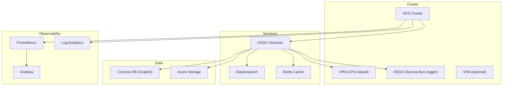
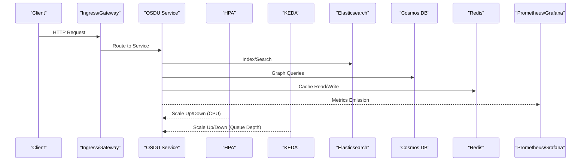
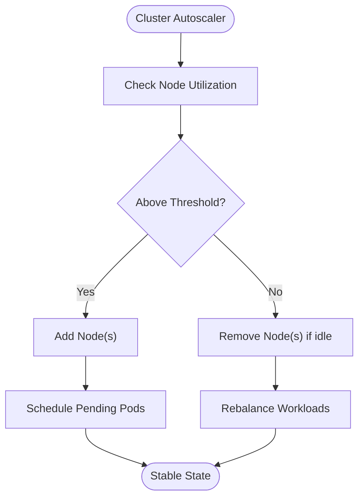
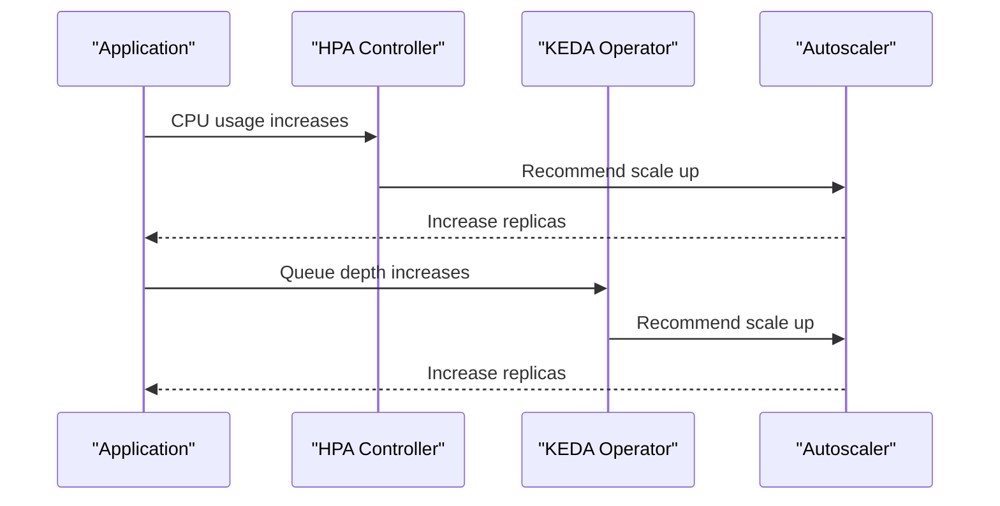
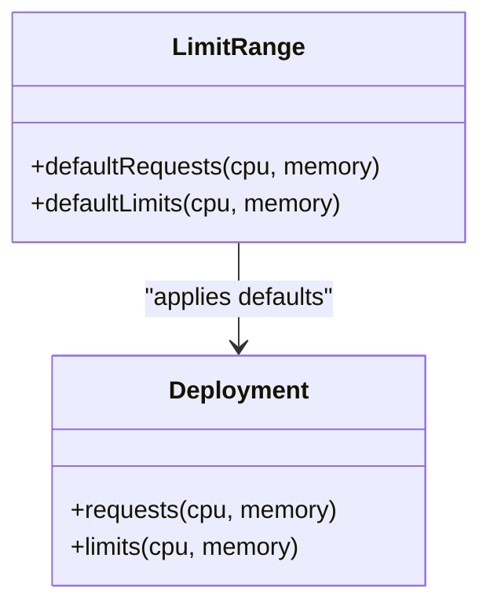
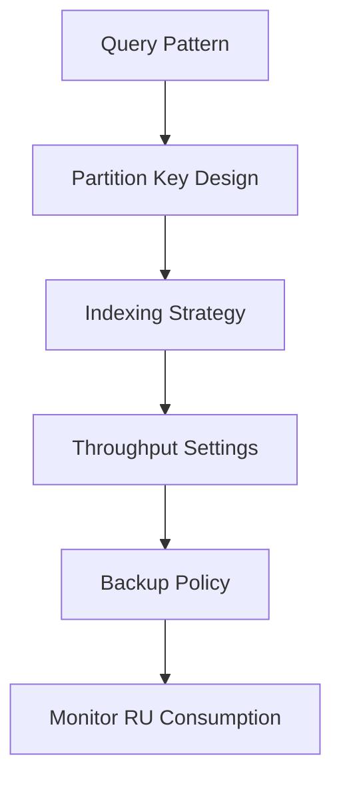
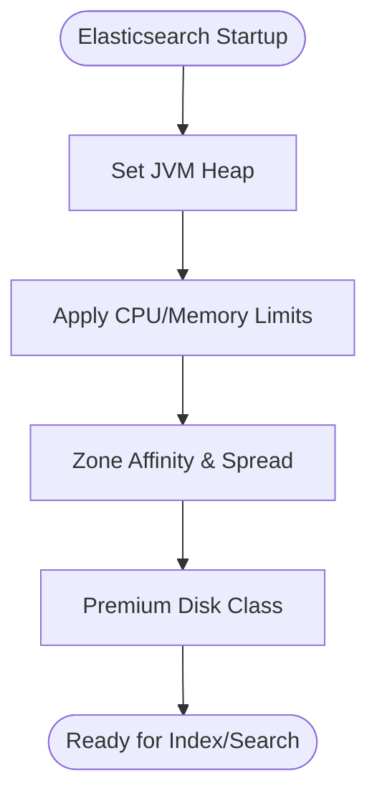
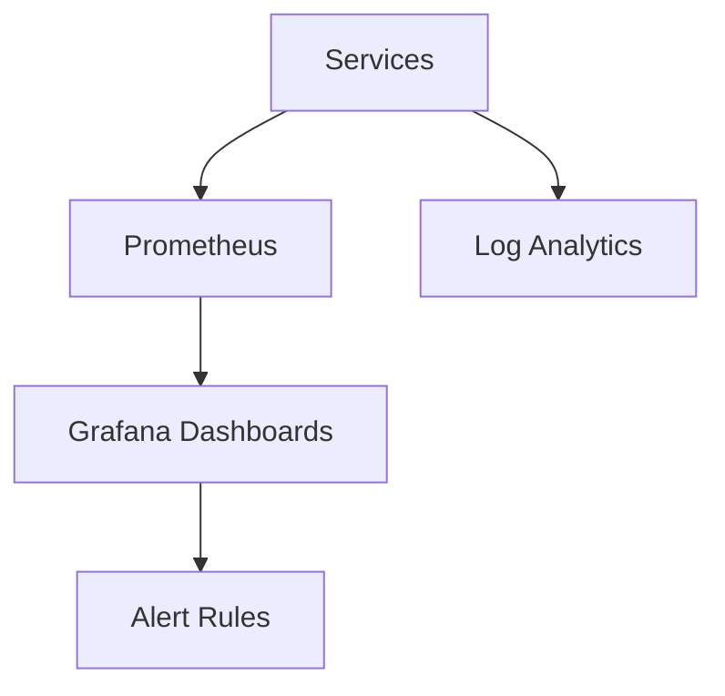
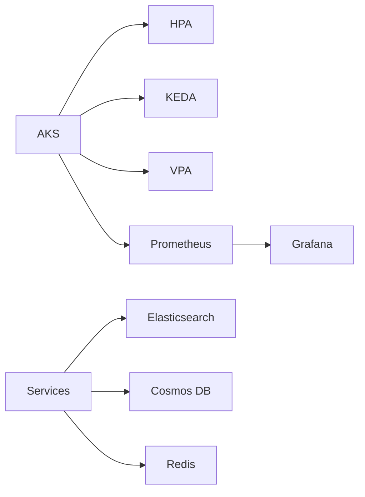

# Performance Optimization

<cite>
**Referenced Files in This Document**
- [README.md](file://README.md)
- [design_platform.md](file://docs/src/design_platform.md)
- [main.bicep](file://bicep/main.bicep)
- [managed-cluster/main.bicep](file://bicep/modules/managed-cluster/main.bicep)
- [blade_partition.bicep](file://bicep/modules/blade_partition.bicep)
- [cosmos-db/main.bicep](file://bicep/modules/cosmos-db/main.bicep)
- [resource-limits.yaml](file://charts/osdu-developer-base/templates/resource-limits.yaml)
- [values.yaml (base)](file://charts/osdu-developer-base/values.yaml)
- [values.yaml (service)](file://charts/osdu-developer-service/values.yaml)
- [hpa.yaml](file://charts/osdu-developer-service/templates/hpa.yaml)
- [scaledobject.yaml](file://charts/osdu-developer-service/templates/scaledobject.yaml)
- [elastic-search.yaml](file://software/components/elastic-search/elastic-search.yaml)
- [storage-class.yaml](file://software/components/elastic-storage/storage-class.yaml)
- [grafana.yaml](file://software/components/observability/grafana.yaml)
- [subnet_monitoring.yaml](file://software/components/observability/subnet_monitoring.yaml)
- [elastic-init.yaml](file://charts/osdu-developer-init/templates/elastic-init.yaml)
- [partition-init.yaml](file://charts/osdu-developer-init/templates/partition-init.yaml)
- [check-record.http](file://tools/rest-scripts/check-record.http)
- [check-ingest.http](file://tools/rest-scripts/check-ingest.http)
</cite>

## Table of Contents
1. Introduction
2. Project Structure
3. Core Components
4. Architecture Overview
5. Detailed Component Analysis
6. Dependency Analysis
7. Performance Considerations
8. Troubleshooting Guide
9. Conclusion
10. Appendices

## Introduction
This document provides expert-level guidance for optimizing the OSDU platform at scale on Azure Kubernetes Service (AKS). It focuses on resource allocation strategies, Kubernetes cluster tuning, service scaling patterns, monitoring key performance indicators, identifying bottlenecks, and implementing performance improvements. It also covers capacity planning guidelines, load testing approaches, performance regression detection, database optimization, caching strategies, and network performance tuning for high-throughput scenarios.

## Project Structure
The repository organizes infrastructure as code with Bicep modules, Helm charts for application deployment, and observability components. Key areas impacting performance include:
- AKS cluster configuration and autoscaling settings
- Horizontal and event-driven autoscaling for services
- Resource limits and requests via LimitRange and per-service values
- Data stores: Cosmos DB (graphs), Elasticsearch, Redis cache
- Observability stack: Prometheus, Grafana, Log Analytics integration
- Network policies and storage classes tuned for performance

**Diagram sources**
- [managed-cluster/main.bicep:662-669](file://bicep/modules/managed-cluster/main.bicep#L662-L669)
- [hpa.yaml:1-32](file://charts/osdu-developer-service/templates/hpa.yaml#L1-L32)
- [scaledobject.yaml:1-25](file://charts/osdu-developer-service/templates/scaledobject.yaml#L1-L25)
- [elastic-search.yaml:1-89](file://software/components/elastic-search/elastic-search.yaml#L1-L89)
- [grafana.yaml:1-59](file://software/components/observability/grafana.yaml#L1-L59)

**Section sources**
- [README.md:16-35](file://README.md#L16-L35)
- [design_platform.md:151-167](file://docs/src/design_platform.md#L151-L167)

## Core Components
- Autoscaling:
  - Horizontal Pod Autoscaler (CPU utilization target)
  - KEDA event-driven scaling based on Azure Service Bus queue depth
  - Optional Vertical Pod Autoscaler for right-sizing
- Resource Limits:
  - Namespace-wide LimitRange defaults
  - Per-service CPU/memory requests and limits
- Data Stores:
  - Cosmos DB graphs with partition keys and indexing controls
  - Elasticsearch with zone-aware placement and premium storage
  - Redis cache for session/state acceleration
- Observability:
  - Prometheus metrics collection and Grafana dashboards
  - Log Analytics integration for logs and metrics

**Section sources**
- [hpa.yaml:1-32](file://charts/osdu-developer-service/templates/hpa.yaml#L1-L32)
- [scaledobject.yaml:1-25](file://charts/osdu-developer-service/templates/scaledobject.yaml#L1-L25)
- [resource-limits.yaml:15-27](file://charts/osdu-developer-base/templates/resource-limits.yaml#L15-L27)
- [values.yaml (base):15-19](file://charts/osdu-developer-base/values.yaml#L15-L19)
- [values.yaml (service):20-25](file://charts/osdu-developer-service/values.yaml#L20-L25)
- [blade_partition.bicep:105-108](file://bicep/modules/blade_partition.bicep#L105-L108)
- [cosmos-db/main.bicep:269-307](file://bicep/modules/cosmos-db/main.bicep#L269-L307)
- [elastic-search.yaml:17-89](file://software/components/elastic-search/elastic-search.yaml#L17-L89)
- [storage-class.yaml:1-13](file://software/components/elastic-storage/storage-class.yaml#L1-L13)
- [grafana.yaml:42-59](file://software/components/observability/grafana.yaml#L42-L59)

## Architecture Overview
The platform deploys AKS with optional KEDA and VPA add-ons. Services are horizontally scaled by CPU or event-driven triggers. Data is persisted across Cosmos DB graphs, Elasticsearch, and Azure Storage, with Redis used for caching. Observability is provided by Prometheus and Grafana, integrated with Log Analytics for centralized monitoring.

**Diagram sources**
- [hpa.yaml:1-32](file://charts/osdu-developer-service/templates/hpa.yaml#L1-L32)
- [scaledobject.yaml:1-25](file://charts/osdu-developer-service/templates/scaledobject.yaml#L1-L25)
- [elastic-search.yaml:17-89](file://software/components/elastic-search/elastic-search.yaml#L17-L89)
- [grafana.yaml:42-59](file://software/components/observability/grafana.yaml#L42-L59)

## Detailed Component Analysis

### Kubernetes Cluster Tuning and Autoscaling
- Enable KEDA and VPA add-ons for event-driven and vertical scaling.
- Configure AKS auto-scaler profile parameters (scan interval, thresholds, delays) to balance responsiveness and stability.
- Use node pools with appropriate sizing and taints/tolerations for specialized workloads.

**Diagram sources**
- [managed-cluster/main.bicep:234-286](file://bicep/modules/managed-cluster/main.bicep#L234-L286)
- [managed-cluster/main.bicep:662-669](file://bicep/modules/managed-cluster/main.bicep#L662-L669)

**Section sources**
- [managed-cluster/main.bicep:234-286](file://bicep/modules/managed-cluster/main.bicep#L234-L286)
- [managed-cluster/main.bicep:662-669](file://bicep/modules/managed-cluster/main.bicep#L662-L669)

### Service Scaling Patterns
- CPU-based horizontal scaling via HPA with a target utilization threshold.
- Event-driven scaling via KEDA triggered by Azure Service Bus message backlog.
- Right-sizing via VPA recommendations applied to requests/limits.

**Diagram sources**
- [hpa.yaml:1-32](file://charts/osdu-developer-service/templates/hpa.yaml#L1-L32)
- [scaledobject.yaml:1-25](file://charts/osdu-developer-service/templates/scaledobject.yaml#L1-L25)

**Section sources**
- [hpa.yaml:1-32](file://charts/osdu-developer-service/templates/hpa.yaml#L1-L32)
- [scaledobject.yaml:1-25](file://charts/osdu-developer-service/templates/scaledobject.yaml#L1-L25)
- [values.yaml (service):20-25](file://charts/osdu-developer-service/values.yaml#L20-L25)

### Resource Allocation Strategies
- Apply namespace-wide default requests and limits using LimitRange to prevent unbounded resource consumption.
- Set per-service requests/limits aligned with workload profiles; ensure sufficient headroom for bursts.
- Use affinity and topology spread constraints to distribute stateful workloads across zones.

**Diagram sources**
- [resource-limits.yaml:15-27](file://charts/osdu-developer-base/templates/resource-limits.yaml#L15-L27)
- [values.yaml (base):15-19](file://charts/osdu-developer-base/values.yaml#L15-L19)

**Section sources**
- [resource-limits.yaml:15-27](file://charts/osdu-developer-base/templates/resource-limits.yaml#L15-L27)
- [values.yaml (base):15-19](file://charts/osdu-developer-base/values.yaml#L15-L19)
- [elastic-search.yaml:46-87](file://software/components/elastic-search/elastic-search.yaml#L46-L87)

### Database Optimization (Cosmos DB)
- Configure throughput and backup policy suitable for workload patterns.
- Define partition keys and automatic indexing to optimize query performance.
- Consider multi-region write capabilities when latency and availability requirements demand it.

**Diagram sources**
- [blade_partition.bicep:105-108](file://bicep/modules/blade_partition.bicep#L105-L108)
- [cosmos-db/main.bicep:269-307](file://bicep/modules/cosmos-db/main.bicep#L269-L307)

**Section sources**
- [blade_partition.bicep:105-108](file://bicep/modules/blade_partition.bicep#L105-L108)
- [cosmos-db/main.bicep:269-307](file://bicep/modules/cosmos-db/main.bicep#L269-L307)

### Caching Strategies (Redis)
- Deploy Redis cache to reduce read latency and offload downstream databases.
- Use cache-aside or write-through patterns depending on consistency needs.
- Ensure proper network proximity and security rules to minimize overhead.

**Section sources**
- [main.bicep:250-278](file://bicep/main.bicep#L250-L278)

### Search Engine Optimization (Elasticsearch)
- Size JVM heap appropriately and set resource requests/limits.
- Spread nodes across zones using topology spread constraints and node affinity.
- Use premium managed disks for low-latency I/O.

**Diagram sources**
- [elastic-search.yaml:64-89](file://software/components/elastic-search/elastic-search.yaml#L64-L89)
- [storage-class.yaml:1-13](file://software/components/elastic-storage/storage-class.yaml#L1-L13)

**Section sources**
- [elastic-search.yaml:17-89](file://software/components/elastic-search/elastic-search.yaml#L17-L89)
- [storage-class.yaml:1-13](file://software/components/elastic-storage/storage-class.yaml#L1-L13)

### Monitoring and Observability
- Collect metrics with Prometheus and visualize in Grafana.
- Integrate with Log Analytics for centralized logging and alerting.
- Tune metric collection to capture persistent volume metrics where needed.

**Diagram sources**
- [grafana.yaml:42-59](file://software/components/observability/grafana.yaml#L42-L59)
- [subnet_monitoring.yaml:136-142](file://software/components/observability/subnet_monitoring.yaml#L136-L142)

**Section sources**
- [grafana.yaml:42-59](file://software/components/observability/grafana.yaml#L42-L59)
- [subnet_monitoring.yaml:136-142](file://software/components/observability/subnet_monitoring.yaml#L136-L142)

### Network Performance Tuning
- Choose appropriate network plugin and dataplane for performance.
- Configure outbound type and load balancer SKU to handle egress and ingress loads.
- Apply network policies to restrict unnecessary traffic and reduce attack surface.

**Section sources**
- [managed-cluster/main.bicep:16-41](file://bicep/modules/managed-cluster/main.bicep#L16-L41)
- [managed-cluster/main.bicep:52-80](file://bicep/modules/managed-cluster/main.bicep#L52-L80)

## Dependency Analysis
Key dependencies that influence performance:
- AKS autoscaler and add-ons (KEDA, VPA) drive scaling behavior.
- Services depend on data stores (Cosmos DB, Elasticsearch, Redis) and storage.
- Observability depends on metrics and logs pipelines.

**Diagram sources**
- [managed-cluster/main.bicep:662-669](file://bicep/modules/managed-cluster/main.bicep#L662-L669)
- [hpa.yaml:1-32](file://charts/osdu-developer-service/templates/hpa.yaml#L1-L32)
- [scaledobject.yaml:1-25](file://charts/osdu-developer-service/templates/scaledobject.yaml#L1-L25)
- [elastic-search.yaml:17-89](file://software/components/elastic-search/elastic-search.yaml#L17-L89)
- [grafana.yaml:42-59](file://software/components/observability/grafana.yaml#L42-L59)

**Section sources**
- [managed-cluster/main.bicep:662-669](file://bicep/modules/managed-cluster/main.bicep#L662-L669)
- [hpa.yaml:1-32](file://charts/osdu-developer-service/templates/hpa.yaml#L1-L32)
- [scaledobject.yaml:1-25](file://charts/osdu-developer-service/templates/scaledobject.yaml#L1-L25)

## Performance Considerations
- Capacity Planning:
  - Estimate CPU/memory per replica based on profiling; size node pools accordingly.
  - Plan Elasticsearch disk capacity considering growth and retention policies.
  - Provision Cosmos DB throughput aligned with peak RUs and partition distribution.
- Load Testing:
  - Use REST scripts to simulate ingestion and search workloads; measure latency and throughput.
  - Validate autoscaling under load to ensure timely scale-up events.
- Regression Detection:
  - Establish SLOs and alerts on latency, error rates, and resource saturation.
  - Compare metrics against baselines post-deployment to detect regressions.
- Database Optimization:
  - Tune partition keys and indexes; monitor RU consumption and adjust throughput.
- Caching Strategies:
  - Implement cache warming for hot datasets; monitor hit ratios and eviction policies.
- Network Tuning:
  - Optimize outbound IP counts and LB SKU; use private endpoints where applicable.

[No sources needed since this section provides general guidance]

## Troubleshooting Guide
- Elasticsearch readiness:
  - Initialization job waits for cluster health before proceeding; check job logs and health endpoint.
- Partition initialization:
  - ConfigMaps provide endpoints and credentials; verify connectivity and permissions.
- Observability gaps:
  - Confirm Prometheus scraping targets and Grafana datasources; enable PV metrics collection if needed.

**Section sources**
- [elastic-init.yaml:1-176](file://charts/osdu-developer-init/templates/elastic-init.yaml#L1-L176)
- [partition-init.yaml:51-94](file://charts/osdu-developer-init/templates/partition-init.yaml#L51-L94)
- [subnet_monitoring.yaml:136-142](file://software/components/observability/subnet_monitoring.yaml#L136-L142)

## Conclusion
Optimizing OSDU at scale requires coordinated tuning across compute, storage, networking, and observability. Leverage AKS autoscaling features, right-size resources, design efficient data access patterns, and maintain robust monitoring to sustain high throughput and low latency. Continuously validate performance through load testing and regression detection to ensure reliability as workloads evolve.

[No sources needed since this section summarizes without analyzing specific files]

## Appendices

### Load Testing Scripts
- Use provided REST scripts to exercise storage and search APIs; capture response times and error rates.

**Section sources**
- [check-record.http:102-168](file://tools/rest-scripts/check-record.http#L102-L168)
- [check-ingest.http:1276-1335](file://tools/rest-scripts/check-ingest.http#L1276-L1335)