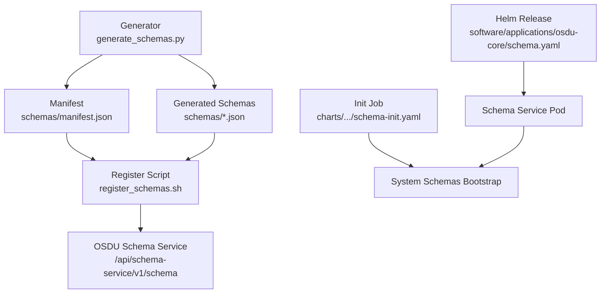
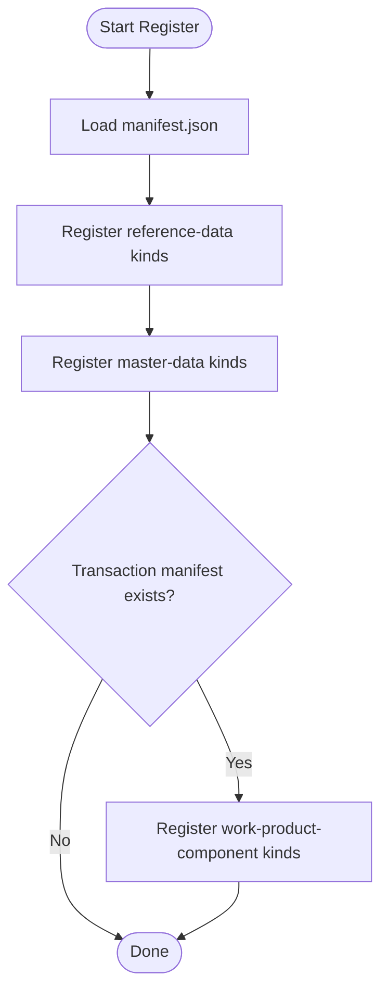
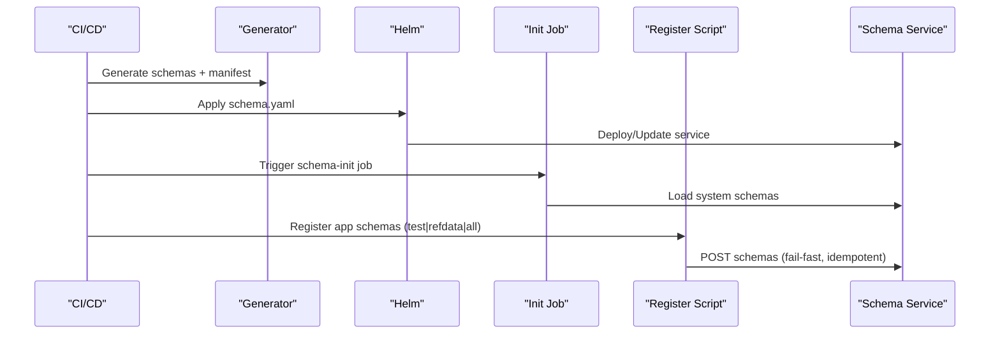
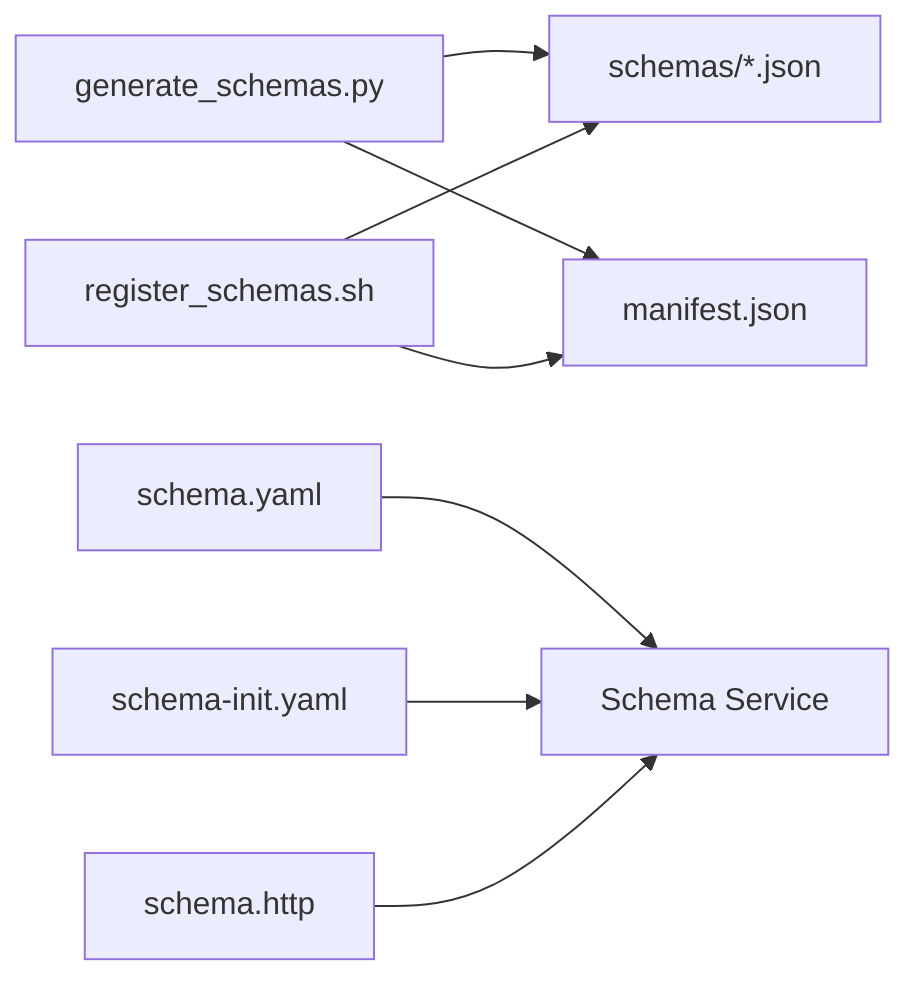

# Schema Management and Deployment

<cite>
**Referenced Files in This Document**
- [README.md](file://ofp-schema-deploy/README.md)
- [generate_schemas.py](file://ofp-schema-deploy/generate_schemas.py)
- [register_schemas.sh](file://ofp-schema-deploy/register_schemas.sh)
- [manifest.json](file://ofp-schema-deploy/schemas/manifest.json)
- [ofp_wks_reference-data--EmissionScopeType_3.0.0.json](file://ofp-schema-deploy/schemas/ofp_wks_reference-data--EmissionScopeType_3.0.0.json)
- [schema.yaml](file://software/applications/osdu-core/schema.yaml)
- [schema-init.yaml](file://charts/osdu-developer-init/templates/schema-init.yaml)
- [services_core_schema.md](file://docs/src/services_core_schema.md)
- [schema.http](file://tools/rest-scripts/schema.http)
</cite>

## Table of Contents
1. [Introduction](#introduction)
2. [Project Structure](#project-structure)
3. [Core Components](#core-components)
4. [Architecture Overview](#architecture-overview)
5. [Detailed Component Analysis](#detailed-component-analysis)
6. [Dependency Analysis](#dependency-analysis)
7. [Performance Considerations](#performance-considerations)
8. [Troubleshooting Guide](#troubleshooting-guide)
9. [Conclusion](#conclusion)
10. [Appendices](#appendices)

## Introduction
This document explains how schemas are defined, versioned, validated, and deployed on the OSDU platform within this repository. It focuses on:
- Schema definition standards for custom entities under a domain authority
- Versioning strategy and promotion workflow (DEVELOPMENT to PUBLISHED)
- The schema deployment pipeline from generation to registration
- Validation behavior and error handling during registration
- Rollback strategies given OSDU’s immutable published schemas
- Managing dependencies across reference, master, and transactional data kinds
- Governance considerations for production deployments

## Project Structure
The schema management capability is centered around a dedicated deployment package that generates and registers OFP entity schemas into the OSDU Schema Service. Core artifacts include:
- A generator that produces JSON Schema bodies compliant with OSDU conventions
- A manifest that defines the safe order for registering dependent schemas
- A shell script that posts schemas to the Schema Service with idempotency and fail-fast behavior
- Helm releases and init jobs that provision and bootstrap the Schema Service and system schemas



**Diagram sources**
- [generate_schemas.py:1-149](file://ofp-schema-deploy/generate_schemas.py#L1-L149)
- [register_schemas.sh:1-91](file://ofp-schema-deploy/register_schemas.sh#L1-L91)
- [manifest.json:1-211](file://ofp-schema-deploy/schemas/manifest.json#L1-L211)
- [schema.yaml:1-169](file://software/applications/osdu-core/schema.yaml#L1-L169)
- [schema-init.yaml:1-172](file://charts/osdu-developer-init/templates/schema-init.yaml#L1-L172)

**Section sources**
- [README.md:1-78](file://ofp-schema-deploy/README.md#L1-L78)
- [schema.yaml:1-169](file://software/applications/osdu-core/schema.yaml#L1-L169)
- [schema-init.yaml:1-172](file://charts/osdu-developer-init/templates/schema-init.yaml#L1-L172)

## Core Components
- Schema generator: Produces self-contained OSDU draft-07 schemas with system properties inlined and a data object for entity fields. Outputs one file per kind plus a manifest defining dependency-aware registration order.
- Registration script: Posts each schema to the Schema Service with environment-driven base URL, partition, and token. Stops on first non-2xx response and skips already registered kinds.
- Manifest: Declares the canonical set of kinds and their files, grouped by category (reference-data before master-data), ensuring dependencies are satisfied.
- Helm release and init job: Deploy the Schema Service and run an initialization job that loads system schemas via a provided script and token helper.

Key behaviors:
- All generated schemas register as DEVELOPMENT and INTERNAL scope, enabling iterative updates without affecting production until promoted.
- System schemas are bootstrapped by an init job using workload identity and a token helper.

**Section sources**
- [generate_schemas.py:1-149](file://ofp-schema-deploy/generate_schemas.py#L1-L149)
- [register_schemas.sh:1-91](file://ofp-schema-deploy/register_schemas.sh#L1-L91)
- [manifest.json:1-211](file://ofp-schema-deploy/schemas/manifest.json#L1-L211)
- [schema.yaml:1-169](file://software/applications/osdu-core/schema.yaml#L1-L169)
- [schema-init.yaml:1-172](file://charts/osdu-developer-init/templates/schema-init.yaml#L1-L172)

## Architecture Overview
The end-to-end flow spans code generation, artifact creation, service provisioning, and registration.

```mermaid
sequenceDiagram
participant Dev as "Developer"
participant Gen as "Generator<br/>generate_schemas.py"
participant Reg as "Register Script<br/>register_schemas.sh"
participant Svc as "Schema Service"
participant Helm as "Helm Release<br/>schema.yaml"
participant Init as "Init Job<br/>schema-init.yaml"
Dev->>Gen : Run generator
Gen-->>Dev : schemas/*.json + manifest.json
Dev->>Reg : Execute with token/partition/base
Reg->>Svc : POST /api/schema-service/v1/schema (per kind)
Note over Reg,Svc : Stop on first failure; skip if already present
Helm->>Svc : Install/Update Schema Service
Init->>Svc : Load system schemas via bootstrap script
```

**Diagram sources**
- [generate_schemas.py:1-149](file://ofp-schema-deploy/generate_schemas.py#L1-L149)
- [register_schemas.sh:1-91](file://ofp-schema-deploy/register_schemas.sh#L1-L91)
- [schema.yaml:1-169](file://software/applications/osdu-core/schema.yaml#L1-L169)
- [schema-init.yaml:1-172](file://charts/osdu-developer-init/templates/schema-init.yaml#L1-L172)

## Detailed Component Analysis

### Schema Definition Standards
- Kind convention: authority:source:entityType:version, e.g., ofp:wks:<group>--Entity:M.m.p
- Scope and status: Generated schemas use INTERNAL scope and DEVELOPMENT status to allow mutable iteration
- Self-contained schema shape: System properties (id, kind, version, acl, legal, tags, timestamps) are inlined; a data object holds entity-specific fields
- Required top-level fields: kind, acl, legal, data
- Property naming: Default snake_case to match source models; can be switched to pascal case via configuration

Examples of generated schemas demonstrate these conventions and required fields.

**Section sources**
- [README.md:30-46](file://ofp-schema-deploy/README.md#L30-L46)
- [generate_schemas.py:80-133](file://ofp-schema-deploy/generate_schemas.py#L80-L133)
- [ofp_wks_reference-data--EmissionScopeType_3.0.0.json:1-144](file://ofp-schema-deploy/schemas/ofp_wks_reference-data--EmissionScopeType_3.0.0.json#L1-L144)

### Versioning Strategy
- Versions follow semantic versioning embedded in the kind ID (major.minor.patch)
- New versions are created by incrementing the version in the kind ID; existing versions remain immutable once published
- Promotion path: DEVELOPMENT -> test record validation -> PUBLISHED (frozen)
- Irreversibility: Published schemas cannot be deleted; evolution requires a higher version

**Section sources**
- [README.md:66-70](file://ofp-schema-deploy/README.md#L66-L70)
- [generate_schemas.py:98-133](file://ofp-schema-deploy/generate_schemas.py#L98-L133)
- [schema.http:63-130](file://tools/rest-scripts/schema.http#L63-L130)

### Migration Procedures
- Reference-first ordering: The manifest ensures reference-data kinds are registered before master-data kinds to satisfy dependencies
- Transactional work-product-component kinds have a separate manifest and are registered after reference and master sets
- Idempotent registration: The script skips kinds already present and fails fast on errors



**Diagram sources**
- [register_schemas.sh:51-88](file://ofp-schema-deploy/register_schemas.sh#L51-L88)
- [manifest.json:1-211](file://ofp-schema-deploy/schemas/manifest.json#L1-L211)

**Section sources**
- [register_schemas.sh:51-88](file://ofp-schema-deploy/register_schemas.sh#L51-L88)
- [manifest.json:1-211](file://ofp-schema-deploy/schemas/manifest.json#L1-L211)

### Schema Deployment Pipeline
- Generation: Python script reads curated mappings and model definitions to produce schema payloads and a manifest
- Provisioning: Helm release installs the Schema Service with required configuration and dependencies
- Initialization: An init job runs a bootstrap script to load system schemas using workload identity and a token helper
- Registration: Shell script posts application schemas to the Schema Service with strict error handling



**Diagram sources**
- [generate_schemas.py:1-149](file://ofp-schema-deploy/generate_schemas.py#L1-L149)
- [schema.yaml:1-169](file://software/applications/osdu-core/schema.yaml#L1-L169)
- [schema-init.yaml:1-172](file://charts/osdu-developer-init/templates/schema-init.yaml#L1-L172)
- [register_schemas.sh:1-91](file://ofp-schema-deploy/register_schemas.sh#L1-L91)

**Section sources**
- [schema.yaml:1-169](file://software/applications/osdu-core/schema.yaml#L1-L169)
- [schema-init.yaml:1-172](file://charts/osdu-developer-init/templates/schema-init.yaml#L1-L172)
- [register_schemas.sh:1-91](file://ofp-schema-deploy/register_schemas.sh#L1-L91)

### Validation Processes
- Schema Service validates incoming schema payloads against internal rules and JSON Schema constraints
- Registration script treats any non-2xx response as a failure and prints the response snippet for debugging
- Idempotency: Duplicate registrations are skipped when the service reports the kind is already present

Operational notes:
- Ensure correct bearer token permissions (editors role) and data-partition-id header
- Use test mode to validate end-to-end before full batch registration

**Section sources**
- [register_schemas.sh:33-49](file://ofp-schema-deploy/register_schemas.sh#L33-L49)
- [schema.http:63-90](file://tools/rest-scripts/schema.http#L63-L90)

### Rollback Mechanisms
- Published schemas are immutable and cannot be deleted; rollback is achieved by promoting a previous version or introducing a new version that supersedes changes
- Development-phase schemas can be updated via PUT until they are promoted to PUBLISHED
- Best practice: Validate with sample records in DEVELOPMENT before promoting to PUBLISHED

**Section sources**
- [README.md:66-70](file://ofp-schema-deploy/README.md#L66-L70)
- [schema.http:101-130](file://tools/rest-scripts/schema.http#L101-L130)

### Managing Schema Dependencies
- Reference-data kinds must be registered before master-data kinds; the manifest enforces this order
- Transactional work-product-component kinds are handled separately and registered after core sets
- Deduplication logic prevents duplicate registrations across batches

**Section sources**
- [manifest.json:1-211](file://ofp-schema-deploy/schemas/manifest.json#L1-L211)
- [register_schemas.sh:51-88](file://ofp-schema-deploy/register_schemas.sh#L51-L88)

### Handling Schema Evolution Across Environments
- Use environment variables to target different platforms and partitions (base URL, partition, token)
- Keep generated schemas committed so deployments are reproducible without external sources
- Promote schemas to PUBLISHED only after successful validation in the target environment

**Section sources**
- [README.md:48-64](file://ofp-schema-deploy/README.md#L48-L64)
- [register_schemas.sh:9-23](file://ofp-schema-deploy/register_schemas.sh#L9-L23)

### Schema Governance, Approval Workflows, and Compliance
- Authority and scope: Custom authority under INTERNAL scope for development; promote to shared/public scopes only after governance approval
- Status gating: DEVELOPMENT allows iteration; PUBLISHED requires formal review and validation
- Auditability: Each schema includes metadata such as createdBy and dateCreated; maintain change logs outside the repo for approvals
- Production readiness: Ensure tokens, ACLs, and legal tags are configured per policy before publishing

**Section sources**
- [generate_schemas.py:17-23](file://ofp-schema-deploy/generate_schemas.py#L17-L23)
- [schema.http:141-199](file://tools/rest-scripts/schema.http#L141-L199)

## Dependency Analysis
The components interact through well-defined interfaces:
- Generator outputs schema payloads consumed by the registration script
- Registration script depends on the manifest for ordering and deduplication
- Helm release provisions the Schema Service; init job bootstraps system schemas
- REST scripts provide examples for manual operations and testing



**Diagram sources**
- [generate_schemas.py:1-149](file://ofp-schema-deploy/generate_schemas.py#L1-L149)
- [register_schemas.sh:1-91](file://ofp-schema-deploy/register_schemas.sh#L1-L91)
- [schema.yaml:1-169](file://software/applications/osdu-core/schema.yaml#L1-L169)
- [schema-init.yaml:1-172](file://charts/osdu-developer-init/templates/schema-init.yaml#L1-L172)
- [schema.http:1-199](file://tools/rest-scripts/schema.http#L1-L199)

**Section sources**
- [generate_schemas.py:1-149](file://ofp-schema-deploy/generate_schemas.py#L1-L149)
- [register_schemas.sh:1-91](file://ofp-schema-deploy/register_schemas.sh#L1-L91)
- [schema.yaml:1-169](file://software/applications/osdu-core/schema.yaml#L1-L169)
- [schema-init.yaml:1-172](file://charts/osdu-developer-init/templates/schema-init.yaml#L1-L172)
- [schema.http:1-199](file://tools/rest-scripts/schema.http#L1-L199)

## Performance Considerations
- Batch registration: Use modes like refdata or all to process multiple schemas efficiently while maintaining fail-fast semantics
- Deduplication: Avoid redundant network calls by leveraging idempotent behavior and manifests
- Service health: Monitor Schema Service endpoints and ensure timeouts and retries are appropriate for large batches

[No sources needed since this section provides general guidance]

## Troubleshooting Guide
Common issues and resolutions:
- Authentication failures: Ensure bearer token has required permissions and is correctly passed via environment variable or file
- Partition mismatch: Verify data-partition-id header matches the target partition
- Already present: Skipped registrations indicate prior existence; verify intended version
- Non-2xx responses: Inspect the printed response snippet to identify validation errors or server issues
- Init job failures: Check logs for token acquisition and system schema loading steps

Operational tips:
- Use test mode to validate connectivity and permissions before running full batches
- Confirm Schema Service is healthy and reachable at the configured base URL
- For local development, consult service configuration documentation for environment variables and endpoints

**Section sources**
- [register_schemas.sh:25-49](file://ofp-schema-deploy/register_schemas.sh#L25-L49)
- [schema-init.yaml:57-118](file://charts/osdu-developer-init/templates/schema-init.yaml#L57-L118)
- [services_core_schema.md:1-40](file://docs/src/services_core_schema.md#L1-L40)

## Conclusion
This repository provides a robust, repeatable process for managing custom schemas on OSDU:
- Generate standardized schemas from authoritative models
- Register them in dependency-safe order with idempotent, fail-fast behavior
- Provision and initialize the Schema Service via Helm and init jobs
- Govern lifecycle through status transitions and versioning, ensuring immutability of published schemas

Adopting these practices enables safe evolution of domain schemas across environments while maintaining compliance and operational reliability.

[No sources needed since this section summarizes without analyzing specific files]

## Appendices

### Example: Creating a Custom Schema
- Define entity properties and required fields in your model source
- Run the generator to produce schema payloads and update the manifest
- Register using the script with appropriate environment variables
- Validate with sample records in DEVELOPMENT before promoting

**Section sources**
- [generate_schemas.py:1-149](file://ofp-schema-deploy/generate_schemas.py#L1-L149)
- [register_schemas.sh:1-91](file://ofp-schema-deploy/register_schemas.sh#L1-L91)
- [README.md:48-64](file://ofp-schema-deploy/README.md#L48-L64)

### Example: Managing Dependencies
- Reference-data kinds are listed first in the manifest to ensure availability for master-data kinds
- Transactional kinds are managed via a separate manifest and registered last

**Section sources**
- [manifest.json:1-211](file://ofp-schema-deploy/schemas/manifest.json#L1-L211)
- [register_schemas.sh:51-88](file://ofp-schema-deploy/register_schemas.sh#L51-L88)

### Example: Environment-Specific Deployment
- Configure base URL, partition, and token per environment
- Use test mode to validate connectivity and permissions before full deployment

**Section sources**
- [register_schemas.sh:9-23](file://ofp-schema-deploy/register_schemas.sh#L9-L23)
- [README.md:48-64](file://ofp-schema-deploy/README.md#L48-L64)