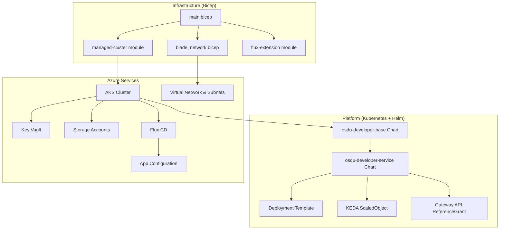
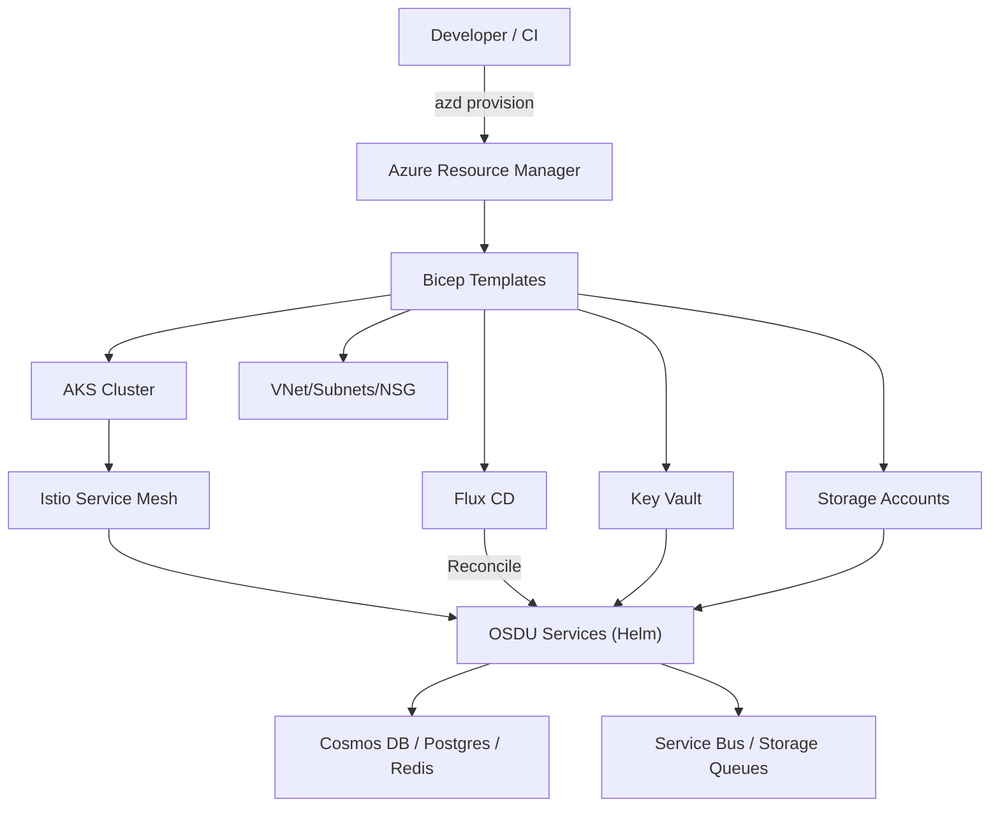
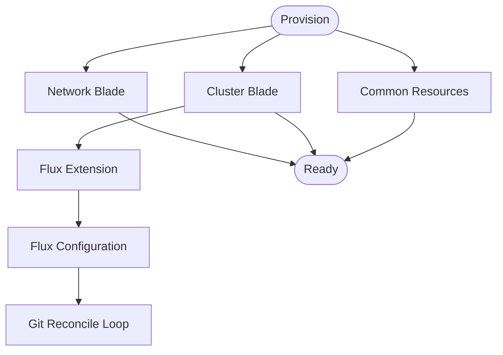
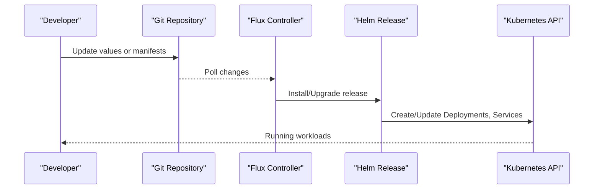
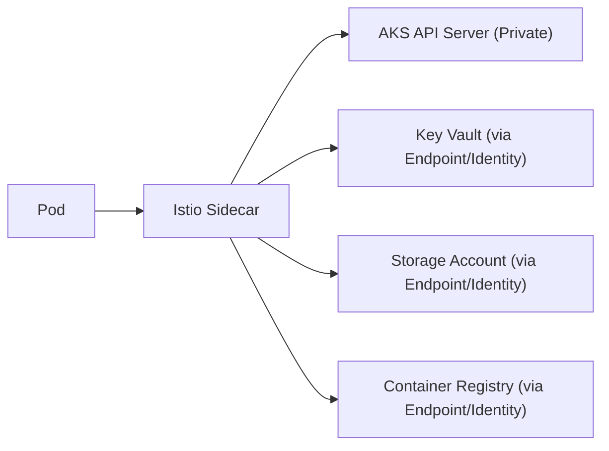
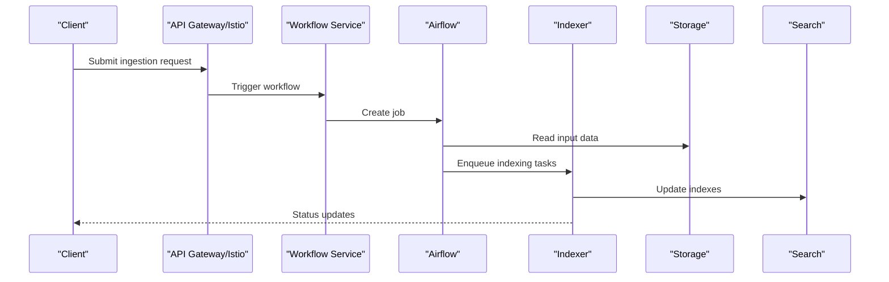
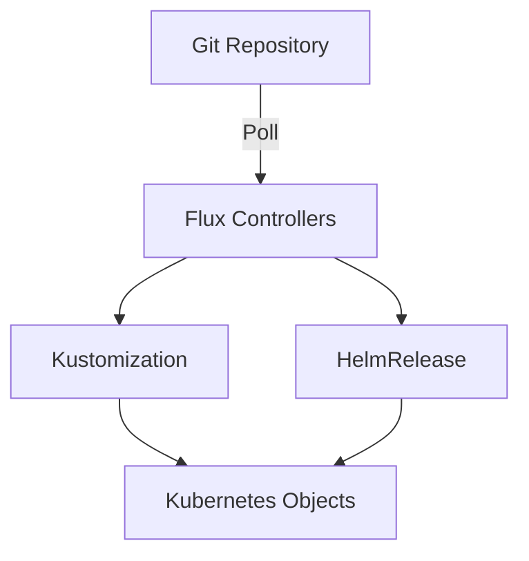
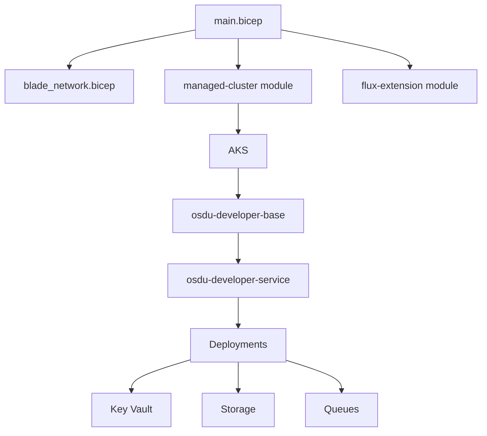

# Architecture Overview

<cite>
**Referenced Files in This Document**
- [README.md](file://README.md)
- [azure.yaml](file://azure.yaml)
- [bicep/README.md](file://bicep/README.md)
- [bicep/main.bicep](file://bicep/main.bicep)
- [bicep/modules/blade_network.bicep](file://bicep/modules/blade_network.bicep)
- [bicep/modules/flux-extension/main.json](file://bicep/modules/flux-extension/main.json)
- [bicep/modules/managed-cluster/main.json](file://bicep/modules/managed-cluster/main.json)
- [charts/osdu-developer-base/Chart.yaml](file://charts/osdu-developer-base/Chart.yaml)
- [charts/osdu-developer-service/Chart.yaml](file://charts/osdu-developer-service/Chart.yaml)
- [charts/osdu-developer-service/templates/deployment.yaml](file://charts/osdu-developer-service/templates/deployment.yaml)
- [charts/osdu-developer-service/templates/scaledobject.yaml](file://charts/osdu-developer-service/templates/scaledobject.yaml)
- [charts/osdu-developer-service/templates/reference-grant.yaml](file://charts/osdu-developer-service/templates/reference-grant.yaml)
- [docs/src/design_architecture.md](file://docs/src/design_architecture.md)
- [docs/src/design_infrastructure.md](file://docs/src/design_infrastructure.md)
- [docs/src/design_platform.md](file://docs/src/design_platform.md)
- [docs/src/services_overview.md](file://docs/src/services_overview.md)
</cite>

## Table of Contents
1. Introduction
2. Project Structure
3. Core Components
4. Architecture Overview
5. Detailed Component Analysis
6. Dependency Analysis
7. Performance Considerations
8. Troubleshooting Guide
9. Conclusion

## Introduction
This document provides an architectural overview of the OSDU Developer platform deployed on Microsoft Azure. It explains how infrastructure, platform services, and application layers interact to deliver a secure, scalable, and GitOps-driven data platform. The design emphasizes:
- Declarative Infrastructure as Code using Bicep
- Kubernetes-based microservices with Istio service mesh
- GitOps with Flux CD for continuous delivery
- Azure-native networking, storage, identity, and security controls
- Event-driven scaling via KEDA and observability through Azure Monitor and open-source tools

The repository also includes Helm charts for packaging applications and Kustomize-style overlays for environment-specific configuration.

**Section sources**
- [README.md:16-35](file://README.md#L16-L35)
- [docs/src/design_architecture.md:11-28](file://docs/src/design_architecture.md#L11-L28)

## Project Structure
At a high level, the repository is organized into:
- bicep: Infrastructure definitions (main entrypoint and modular blades)
- charts: Helm charts for base components and OSDU services
- software: Application manifests and component releases
- docs: Design and operational documentation
- scripts and azure.yaml: Azure Developer CLI hooks and workflow orchestration

**Diagram sources**
- [bicep/main.bicep:296-421](file://bicep/main.bicep#L296-L421)
- [bicep/modules/blade_network.bicep:158-194](file://bicep/modules/blade_network.bicep#L158-L194)
- [bicep/modules/flux-extension/main.json:139-171](file://bicep/modules/flux-extension/main.json#L139-L171)
- [bicep/modules/managed-cluster/main.json:2602-2634](file://bicep/modules/managed-cluster/main.json#L2602-L2634)
- [charts/osdu-developer-base/Chart.yaml:1-9](file://charts/osdu-developer-base/Chart.yaml#L1-L9)
- [charts/osdu-developer-service/Chart.yaml:1-10](file://charts/osdu-developer-service/Chart.yaml#L1-L10)
- [charts/osdu-developer-service/templates/deployment.yaml:1-178](file://charts/osdu-developer-service/templates/deployment.yaml#L1-L178)
- [charts/osdu-developer-service/templates/scaledobject.yaml:1-24](file://charts/osdu-developer-service/templates/scaledobject.yaml#L1-L24)
- [charts/osdu-developer-service/templates/reference-grant.yaml:1-21](file://charts/osdu-developer-service/templates/reference-grant.yaml#L1-L21)

**Section sources**
- [bicep/main.bicep:296-421](file://bicep/main.bicep#L296-L421)
- [charts/osdu-developer-base/Chart.yaml:1-9](file://charts/osdu-developer-base/Chart.yaml#L1-L9)
- [charts/osdu-developer-service/Chart.yaml:1-10](file://charts/osdu-developer-service/Chart.yaml#L1-L10)

## Core Components
- Infrastructure Orchestration: Bicep modules define network, cluster, storage, identity, and GitOps integration.
- Kubernetes Platform: AKS hosts workloads; Istio provides service mesh; Gateway API routes external traffic.
- Applications: OSDU core and reference services packaged via Helm charts; event-driven scaling via KEDA.
- Data Plane: Storage accounts, Cosmos DB, Redis cache, and queues support ingestion and processing.
- Observability: Azure Monitor, Log Analytics, Prometheus, Grafana, and optional Jaeger/Kibana.

Key responsibilities:
- Bicep main orchestrates blade modules and installs Flux extension and configurations.
- Helm templates render Deployments, Services, Ingress/Gateway resources, and autoscaling policies.
- Flux continuously reconciles desired state from Git into the cluster.

**Section sources**
- [docs/src/design_infrastructure.md:1-13](file://docs/src/design_infrastructure.md#L1-L13)
- [docs/src/design_platform.md:20-86](file://docs/src/design_platform.md#L20-L86)
- [docs/src/services_overview.md:17-56](file://docs/src/services_overview.md#L17-L56)

## Architecture Overview
The system follows a stamp-based architecture where each deployment can be independently scaled and configured. Infrastructure is provisioned declaratively, and applications are delivered via GitOps.

**Diagram sources**
- [bicep/main.bicep:296-421](file://bicep/main.bicep#L296-L421)
- [bicep/modules/blade_network.bicep:158-194](file://bicep/modules/blade_network.bicep#L158-L194)
- [bicep/modules/flux-extension/main.json:139-171](file://bicep/modules/flux-extension/main.json#L139-L171)
- [docs/src/design_infrastructure.md:190-308](file://docs/src/design_infrastructure.md#L190-L308)

## Detailed Component Analysis

### Infrastructure Orchestration (Bicep)
- Main entrypoint composes blades for network, cluster, common resources, partitions, and services.
- Network blade configures subnets, service endpoints, and NSGs based on feature flags.
- Cluster blade provisions AKS, node pools, and integrates with managed identities and private networking.
- Flux extension and configuration enable GitOps reconciliation from a Git repository.

**Diagram sources**
- [bicep/main.bicep:296-421](file://bicep/main.bicep#L296-L421)
- [bicep/modules/blade_network.bicep:158-194](file://bicep/modules/blade_network.bicep#L158-L194)
- [bicep/modules/flux-extension/main.json:139-171](file://bicep/modules/flux-extension/main.json#L139-L171)

**Section sources**
- [bicep/main.bicep:296-421](file://bicep/main.bicep#L296-L421)
- [bicep/modules/blade_network.bicep:158-194](file://bicep/modules/blade_network.bicep#L158-L194)
- [bicep/modules/flux-extension/main.json:139-171](file://bicep/modules/flux-extension/main.json#L139-L171)

### Kubernetes Workloads and Helm Charts
- osdu-developer-base chart installs foundational platform components.
- osdu-developer-service chart renders per-service Deployments, Services, and optional autoscaling.
- Deployment template supports readiness/liveness probes, resource requests/limits, Key Vault CSI mounts, PVCs, and environment injection.
- KEDA ScaledObject enables event-driven scaling triggered by Azure Service Bus.
- Gateway API ReferenceGrant allows cross-namespace routing from istio-system to application services.

**Diagram sources**
- [charts/osdu-developer-base/Chart.yaml:1-9](file://charts/osdu-developer-base/Chart.yaml#L1-L9)
- [charts/osdu-developer-service/Chart.yaml:1-10](file://charts/osdu-developer-service/Chart.yaml#L1-L10)
- [charts/osdu-developer-service/templates/deployment.yaml:1-178](file://charts/osdu-developer-service/templates/deployment.yaml#L1-L178)
- [charts/osdu-developer-service/templates/scaledobject.yaml:1-24](file://charts/osdu-developer-service/templates/scaledobject.yaml#L1-L24)
- [charts/osdu-developer-service/templates/reference-grant.yaml:1-21](file://charts/osdu-developer-service/templates/reference-grant.yaml#L1-L21)

**Section sources**
- [charts/osdu-developer-service/templates/deployment.yaml:1-178](file://charts/osdu-developer-service/templates/deployment.yaml#L1-L178)
- [charts/osdu-developer-service/templates/scaledobject.yaml:1-24](file://charts/osdu-developer-service/templates/scaledobject.yaml#L1-L24)
- [charts/osdu-developer-service/templates/reference-grant.yaml:1-21](file://charts/osdu-developer-service/templates/reference-grant.yaml#L1-L21)

### Azure Networking and Security
- Virtual Network with dedicated subnets for cluster and pods; service endpoints for Storage, Key Vault, and Container Registry.
- Private cluster mode and API server VNet integration reduce exposure.
- Node Resource Group lockdown and disabled SSH improve node security posture.
- Workload Identity and Key Vault CSI provide secure runtime secrets and Azure access without long-lived credentials.

**Diagram sources**
- [bicep/modules/blade_network.bicep:158-194](file://bicep/modules/blade_network.bicep#L158-L194)
- [docs/src/design_platform.md:60-86](file://docs/src/design_platform.md#L60-L86)

**Section sources**
- [docs/src/design_platform.md:20-86](file://docs/src/design_platform.md#L20-L86)
- [bicep/modules/blade_network.bicep:158-194](file://bicep/modules/blade_network.bicep#L158-L194)

### Data Flow Patterns and Integration Points
- Ingestion workflows use Apache Airflow DAGs orchestrated by the Workflow service.
- Indexing pipeline processes metadata and files, leveraging queues and storage.
- Search and schema services expose APIs for querying and managing schemas.
- Event-driven scaling uses KEDA triggers (e.g., Service Bus) to scale consumers.

**Diagram sources**
- [docs/src/services_overview.md:17-56](file://docs/src/services_overview.md#L17-L56)
- [charts/osdu-developer-service/templates/scaledobject.yaml:1-24](file://charts/osdu-developer-service/templates/scaledobject.yaml#L1-L24)

**Section sources**
- [docs/src/services_overview.md:17-56](file://docs/src/services_overview.md#L17-L56)

### GitOps Workflow with Flux CD
- Flux extension is installed on AKS and configured to sync a Git repository containing Kustomizations and Helm releases.
- Changes in Git drive continuous reconciliation of application state in the cluster.

**Diagram sources**
- [bicep/modules/flux-extension/main.json:139-171](file://bicep/modules/flux-extension/main.json#L139-L171)
- [bicep/modules/managed-cluster/main.json:2602-2634](file://bicep/modules/managed-cluster/main.json#L2602-L2634)

**Section sources**
- [bicep/modules/flux-extension/main.json:139-171](file://bicep/modules/flux-extension/main.json#L139-L171)
- [bicep/modules/managed-cluster/main.json:2602-2634](file://bicep/modules/managed-cluster/main.json#L2602-L2634)

## Dependency Analysis
- Bicep main depends on network, cluster, and flux modules to assemble the stamp.
- Helm charts depend on platform primitives (network, identity, storage) provisioned by Bicep.
- Services rely on Key Vault for secrets, storage for data, and queues for async processing.
- Flux controllers depend on Git repository and cluster permissions to reconcile state.

**Diagram sources**
- [bicep/main.bicep:296-421](file://bicep/main.bicep#L296-L421)
- [charts/osdu-developer-base/Chart.yaml:1-9](file://charts/osdu-developer-base/Chart.yaml#L1-L9)
- [charts/osdu-developer-service/Chart.yaml:1-10](file://charts/osdu-developer-service/Chart.yaml#L1-L10)

**Section sources**
- [bicep/main.bicep:296-421](file://bicep/main.bicep#L296-L421)
- [charts/osdu-developer-service/Chart.yaml:1-10](file://charts/osdu-developer-service/Chart.yaml#L1-L10)

## Performance Considerations
- Autoscaling: Use KEDA for event-driven scaling and Vertical Pod Autoscaler for resource optimization.
- Node Scaling: Enable node auto-provisioning to right-size clusters dynamically.
- Networking: Prefer overlay networking and private endpoints to reduce latency and improve security.
- Storage: Choose appropriate SKUs and tiers; leverage caching (Redis) where applicable.
- Observability: Instrument services and collect metrics/logs for capacity planning.

[No sources needed since this section provides general guidance]

## Troubleshooting Guide
- Provisioning issues: Validate feature flags and prerequisites before running azd commands.
- Networking: Ensure subnets have required service endpoints and NSGs allow necessary traffic.
- Secrets: Confirm Key Vault RBAC and network ACLs permit AKS access.
- GitOps: Check Flux controller logs and Git repository permissions if reconciliation fails.
- Services: Inspect pod events, readiness probes, and environment variable injection from ConfigMaps/Secrets.

**Section sources**
- [README.md:46-65](file://README.md#L46-L65)
- [bicep/modules/blade_network.bicep:158-194](file://bicep/modules/blade_network.bicep#L158-L194)
- [charts/osdu-developer-service/templates/deployment.yaml:102-116](file://charts/osdu-developer-service/templates/deployment.yaml#L102-L116)

## Conclusion
The OSDU Developer platform combines Azure-native infrastructure, Kubernetes microservices, and GitOps practices to deliver a secure, scalable, and maintainable data platform. Bicep defines a repeatable stamp pattern, Helm packages applications consistently, and Flux ensures continuous reconciliation. With strong identity, networking, and observability controls, teams can iterate rapidly while maintaining reliability and compliance.

[No sources needed since this section summarizes without analyzing specific files]