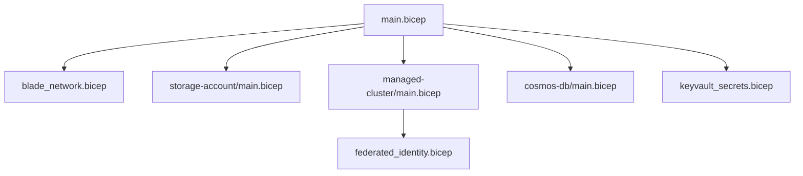
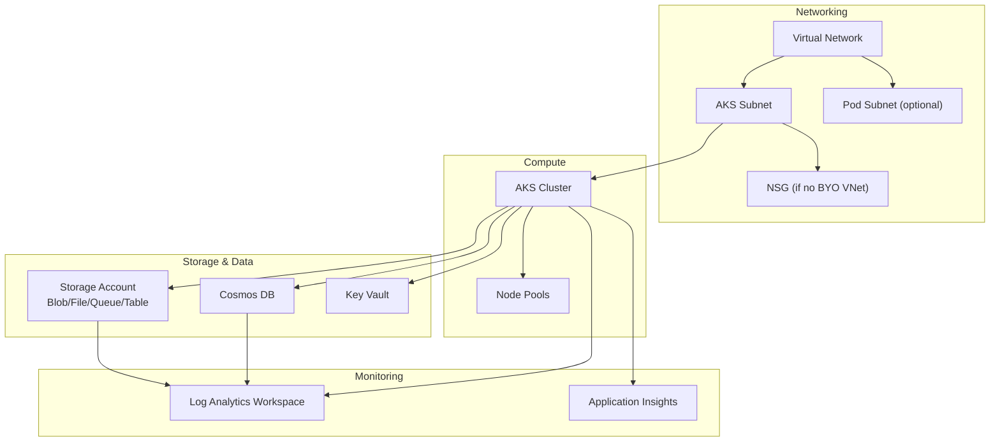
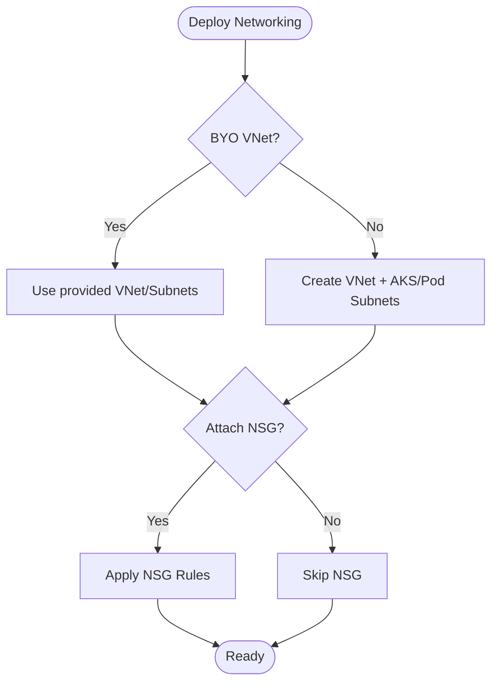
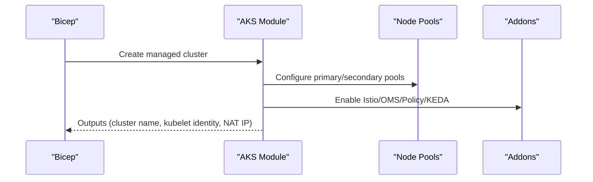
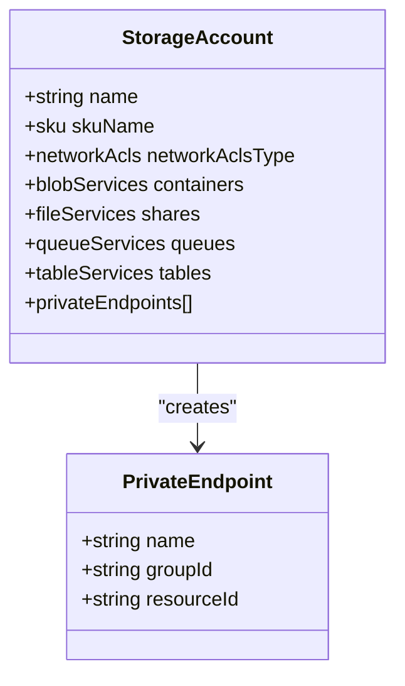
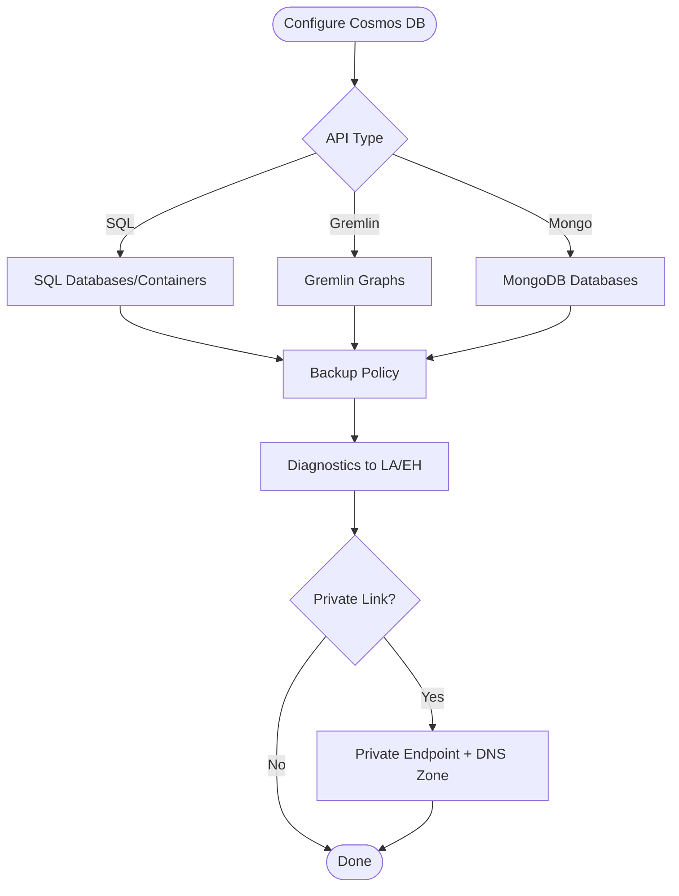
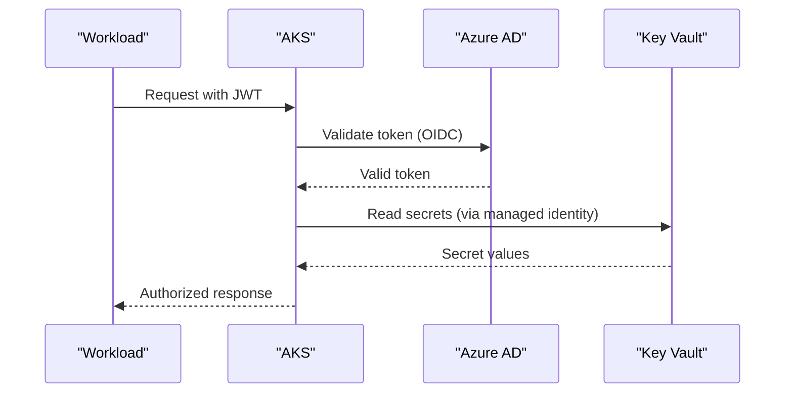
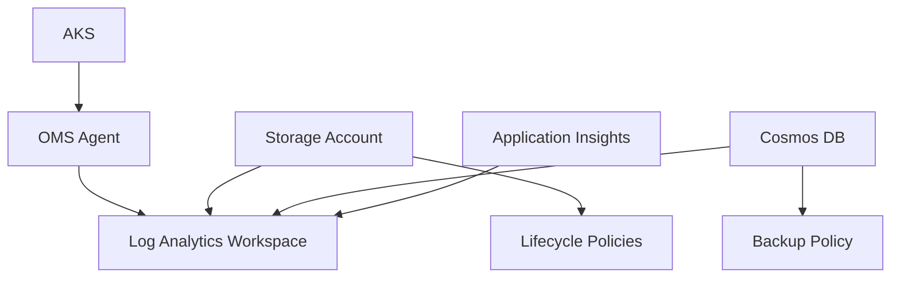
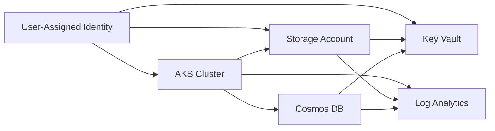

# Infrastructure Design

<cite>
**Referenced Files in This Document**
- [main.bicep](file://bicep/main.bicep)
- [README.md](file://bicep/README.md)
- [design_infrastructure.md](file://docs/src/design_infrastructure.md)
- [azure.yaml](file://azure.yaml)
- [blade_network.bicep](file://bicep/modules/blade_network.bicep)
- [storage-account main.bicep](file://bicep/modules/storage-account/main.bicep)
- [managed-cluster main.bicep](file://bicep/modules/managed-cluster/main.bicep)
- [cosmos-db main.bicep](file://bicep/modules/cosmos-db/main.bicep)
- [keyvault_secrets.bicep](file://bicep/modules/keyvault_secrets.bicep)
- [federated_identity.bicep](file://bicep/modules/federated_identity.bicep)
- [envoy-filter.yaml](file://charts/osdu-developer-base/templates/envoy-filter.yaml)
- [post-provision.ps1](file://scripts/post-provision.ps1)
</cite>

## Table of Contents
1. [Introduction](#introduction)
2. [Project Structure](#project-structure)
3. [Core Components](#core-components)
4. [Architecture Overview](#architecture-overview)
5. [Detailed Component Analysis](#detailed-component-analysis)
6. [Dependency Analysis](#dependency-analysis)
7. [Performance Considerations](#performance-considerations)
8. [Troubleshooting Guide](#troubleshooting-guide)
9. [Conclusion](#conclusion)
10. [Appendices](#appendices)

## Introduction
This document describes the infrastructure design for deploying the OSDU platform on Azure using a stamp-based architecture. It covers the resource hierarchy (Virtual Network, AKS clusters, storage accounts, and database services), networking with subnets, NSGs, private endpoints, and DNS configuration, storage design across blob/file/queue/table and Cosmos DB, identity and access management via Azure Active Directory integration, and infrastructure-level monitoring, logging, and backup strategies. The design is implemented as Bicep modules orchestrated by a main entrypoint and supports both BYO VNet and default network creation.

## Project Structure
The infrastructure is defined declaratively with Bicep. A top-level module orchestrates deployment of “blades” that group related resources:
- Main orchestration: bicep/main.bicep
- Networking blade: bicep/modules/blade_network.bicep
- Storage account module: bicep/modules/storage-account/main.bicep
- AKS cluster module: bicep/modules/managed-cluster/main.bicep
- Cosmos DB module: bicep/modules/cosmos-db/main.bicep
- Key Vault secrets helper: bicep/modules/keyvault_secrets.bicep
- Federated identity credential module: bicep/modules/federated_identity.bicep
- Post-provision scripts configure AAD app redirect URIs and environment settings

**Diagram sources**
- [main.bicep:166-800](file://bicep/main.bicep#L166-L800)
- [blade_network.bicep:1-332](file://bicep/modules/blade_network.bicep#L1-L332)
- [storage-account main.bicep:351-740](file://bicep/modules/storage-account/main.bicep#L351-L740)
- [managed-cluster main.bicep:556-800](file://bicep/modules/managed-cluster/main.bicep#L556-L800)
- [cosmos-db main.bicep:343-512](file://bicep/modules/cosmos-db/main.bicep#L343-L512)
- [keyvault_secrets.bicep:17-97](file://bicep/modules/keyvault_secrets.bicep#L17-L97)
- [federated_identity.bicep:20-32](file://bicep/modules/federated_identity.bicep#L20-L32)

**Section sources**
- [main.bicep:1-120](file://bicep/main.bicep#L1-L120)
- [design_infrastructure.md:1-40](file://docs/src/design_infrastructure.md#L1-L40)
- [azure.yaml:1-26](file://azure.yaml#L1-L26)

## Core Components
- Virtual Network and Subnets: Conditional creation or BYO VNet; cluster and optional pod subnets with service endpoints to Storage, Key Vault, and Container Registry; NSGs for inbound/outbound rules when not using BYO VNet.
- AKS Cluster: Managed Kubernetes with configurable addons (Istio, OMS/Azure Monitor, Policy), RBAC, private cluster option, outbound type, and node pools.
- Storage Account: Blob containers, file shares, queues, tables; diagnostics to Log Analytics; network ACLs; optional private endpoints; secret export to Key Vault.
- Cosmos DB: SQL/Gremlin/MongoDB APIs; consistency, backups, diagnostics; optional private link and private DNS zone; secrets exported to Key Vault.
- Key Vault: Centralized secrets for workspace keys, cache credentials, storage endpoints, and connection strings; RBAC and network ACLs.
- Identity and Access: User-assigned managed identities, federated identity credentials for workload identity, AAD integration for AKS and ingress filtering.

**Section sources**
- [blade_network.bicep:37-194](file://bicep/modules/blade_network.bicep#L37-L194)
- [managed-cluster main.bicep:556-800](file://bicep/modules/managed-cluster/main.bicep#L556-L800)
- [storage-account main.bicep:351-740](file://bicep/modules/storage-account/main.bicep#L351-L740)
- [cosmos-db main.bicep:295-512](file://bicep/modules/cosmos-db/main.bicep#L295-L512)
- [keyvault_secrets.bicep:17-97](file://bicep/modules/keyvault_secrets.bicep#L17-L97)
- [federated_identity.bicep:20-32](file://bicep/modules/federated_identity.bicep#L20-L32)

## Architecture Overview
The solution deploys a stamp containing shared services and per-partition resources. Networking can be created by the template or provided externally. AKS runs workloads that consume storage and databases through secure paths (service endpoints, private endpoints). Monitoring and logging are centralized in Log Analytics and Application Insights. Secrets are stored in Key Vault and consumed by applications at runtime.

**Diagram sources**
- [blade_network.bicep:158-287](file://bicep/modules/blade_network.bicep#L158-L287)
- [managed-cluster main.bicep:556-800](file://bicep/modules/managed-cluster/main.bicep#L556-L800)
- [storage-account main.bicep:351-740](file://bicep/modules/storage-account/main.bicep#L351-L740)
- [cosmos-db main.bicep:343-512](file://bicep/modules/cosmos-db/main.bicep#L343-L512)
- [main.bicep:191-247](file://bicep/main.bicep#L191-L247)

## Detailed Component Analysis

### Networking: Virtual Network, Subnets, NSGs, Private Endpoints, DNS
- BYO VNet support: If vnetConfiguration is provided, the module uses existing VNet/subnets; otherwise it creates a new VNet with an AKS subnet and optional Pod subnet.
- Service endpoints: AKS subnet enables Microsoft.Storage, Microsoft.KeyVault, Microsoft.ContainerRegistry endpoints for secure access without public internet.
- NSGs: When not using BYO VNet, a dedicated NSG is attached to the AKS subnet with rules for HTTP/HTTPS inbound, SSH/RDP outbound, and cloud egress.
- Private endpoints: Storage and Cosmos DB support private endpoints with private DNS zones to resolve internal addresses.
- DNS: AKS private cluster can use system-managed private DNS or a custom private DNS zone; storage and Cosmos DB private endpoints integrate with private DNS zones.

**Diagram sources**
- [blade_network.bicep:37-194](file://bicep/modules/blade_network.bicep#L37-L194)
- [blade_network.bicep:205-287](file://bicep/modules/blade_network.bicep#L205-L287)

**Section sources**
- [blade_network.bicep:37-194](file://bicep/modules/blade_network.bicep#L37-L194)
- [blade_network.bicep:205-287](file://bicep/modules/blade_network.bicep#L205-L287)

### Compute: AKS Cluster and Addons
- Cluster options: Public/private API server, outbound type, load balancer SKU, network plugin/dataplane/policy, and addon profiles (Istio, OMS/Azure Monitor, Policy, KEDA/VPA).
- Identity: Managed identities (system/user-assigned), AAD integration with Azure RBAC for Kubernetes, OIDC issuer profile, and Workload Identity support.
- Node pools: Primary and additional agent pools with autoscaling profiles and maintenance configurations.
- Monitoring: Optional container insights and metrics collection to Log Analytics.

**Diagram sources**
- [managed-cluster main.bicep:556-800](file://bicep/modules/managed-cluster/main.bicep#L556-L800)

**Section sources**
- [managed-cluster main.bicep:556-800](file://bicep/modules/managed-cluster/main.bicep#L556-L800)

### Storage: Blob, File, Queue, Table, Private Endpoints, DNS
- Services: Blob containers, file shares, queues, and tables are provisioned via the storage module. Diagnostics stream to Log Analytics.
- Security: Network ACLs with default deny and allowlisted IPs/subnets; HTTPS-only traffic; optional private endpoints with private DNS zones.
- Secrets export: Storage account names, keys, endpoints, and SAS tokens can be exported to Key Vault for application consumption.

**Diagram sources**
- [storage-account main.bicep:351-740](file://bicep/modules/storage-account/main.bicep#L351-L740)

**Section sources**
- [storage-account main.bicep:351-740](file://bicep/modules/storage-account/main.bicep#L351-L740)

### Database: Cosmos DB Configuration and Private Link
- APIs: Supports SQL, Gremlin, and MongoDB APIs with configurable consistency levels and multi-region write settings.
- Backups: Periodic or continuous backup policies with retention and redundancy options.
- Diagnostics: Logs and metrics streamed to Log Analytics or Event Hubs.
- Private Link: Optional private endpoint with private DNS zone linking to the virtual network for secure access.

**Diagram sources**
- [cosmos-db main.bicep:295-512](file://bicep/modules/cosmos-db/main.bicep#L295-L512)

**Section sources**
- [cosmos-db main.bicep:295-512](file://bicep/modules/cosmos-db/main.bicep#L295-L512)

### Identity and Access Management: Azure Active Directory Integration
- Managed Identities: User-assigned identities used by deployments and workloads; role assignments to Key Vault and storage.
- Federated Identity: Federated identity credentials enable external CI/CD or workload identities to authenticate to Azure AD without secrets.
- AKS AAD: Managed AAD integration with Azure RBAC for Kubernetes; OIDC issuer and Workload Identity supported.
- Ingress Filtering: Envoy filter extracts JWT claims to set request headers for downstream authorization.

**Diagram sources**
- [federated_identity.bicep:20-32](file://bicep/modules/federated_identity.bicep#L20-L32)
- [managed-cluster main.bicep:698-706](file://bicep/modules/managed-cluster/main.bicep#L698-L706)
- [envoy-filter.yaml:84-112](file://charts/osdu-developer-base/templates/envoy-filter.yaml#L84-L112)
- [keyvault_secrets.bicep:17-97](file://bicep/modules/keyvault_secrets.bicep#L17-L97)

**Section sources**
- [federated_identity.bicep:20-32](file://bicep/modules/federated_identity.bicep#L20-L32)
- [managed-cluster main.bicep:698-706](file://bicep/modules/managed-cluster/main.bicep#L698-L706)
- [envoy-filter.yaml:84-112](file://charts/osdu-developer-base/templates/envoy-filter.yaml#L84-L112)
- [post-provision.ps1:210-233](file://scripts/post-provision.ps1#L210-L233)

### Monitoring, Logging, and Backup Strategies
- Monitoring: Application Insights component configured with diagnostic settings; AKS OMS agent sends logs/metrics to Log Analytics.
- Logging: Storage and Cosmos DB diagnostics enabled to Log Analytics; retention configured.
- Backups: Cosmos DB supports periodic or continuous backups with configurable tiers and retention; storage lifecycle policies can manage data tiering and deletion.

**Diagram sources**
- [main.bicep:191-247](file://bicep/main.bicep#L191-L247)
- [storage-account main.bicep:453-473](file://bicep/modules/storage-account/main.bicep#L453-L473)
- [cosmos-db main.bicep:388-404](file://bicep/modules/cosmos-db/main.bicep#L388-L404)

**Section sources**
- [main.bicep:191-247](file://bicep/main.bicep#L191-L247)
- [storage-account main.bicep:453-473](file://bicep/modules/storage-account/main.bicep#L453-L473)
- [cosmos-db main.bicep:388-404](file://bicep/modules/cosmos-db/main.bicep#L388-L404)

## Dependency Analysis
- Orchestrator dependencies: main.bicep depends on identity, monitoring, network (conditional), cluster, storage, and key vault modules.
- Network dependencies: Blade network outputs VNet/subnet IDs consumed by AKS and storage private endpoints.
- Storage dependencies: Storage module exports secrets to Key Vault; Key Vault RBAC grants access to managed identities.
- Database dependencies: Cosmos DB module can create private endpoints linked to the same VNet; diagnostics depend on Log Analytics.

**Diagram sources**
- [main.bicep:166-800](file://bicep/main.bicep#L166-L800)
- [blade_network.bicep:294-297](file://bicep/modules/blade_network.bicep#L294-L297)
- [storage-account main.bicep:648-700](file://bicep/modules/storage-account/main.bicep#L648-L700)
- [cosmos-db main.bicep:388-512](file://bicep/modules/cosmos-db/main.bicep#L388-L512)

**Section sources**
- [main.bicep:166-800](file://bicep/main.bicep#L166-L800)
- [blade_network.bicep:294-297](file://bicep/modules/blade_network.bicep#L294-L297)
- [storage-account main.bicep:648-700](file://bicep/modules/storage-account/main.bicep#L648-L700)
- [cosmos-db main.bicep:388-512](file://bicep/modules/cosmos-db/main.bicep#L388-L512)

## Performance Considerations
- AKS outbound routing: Choose appropriate outbound type (load balancer vs. managed NAT gateway) based on egress requirements and scalability needs.
- Storage performance: Select appropriate SKU and access tier; consider lifecycle policies for cost/performance balance.
- Cosmos DB throughput: Configure RU provisioning or autoscale limits aligned with workload patterns; choose consistency level appropriate for data access patterns.
- Monitoring overhead: Tune OMS agent and metric scraping to avoid excessive costs while maintaining observability.

[No sources needed since this section provides general guidance]

## Troubleshooting Guide
- Network connectivity issues: Verify service endpoints on AKS subnet and NSG rules; ensure private endpoints have correct DNS zones and VNet links.
- Key Vault access errors: Confirm managed identity has required roles (e.g., Key Vault Secrets User); check network ACLs and allowed IPs.
- AKS authentication failures: Validate AAD integration settings, OIDC issuer, and Workload Identity configuration; inspect Envoy filter behavior for JWT claim processing.
- Storage/Diagnostic streams: Ensure diagnostic settings point to the correct Log Analytics workspace and that permissions are granted.

**Section sources**
- [blade_network.bicep:205-287](file://bicep/modules/blade_network.bicep#L205-L287)
- [keyvault_secrets.bicep:17-97](file://bicep/modules/keyvault_secrets.bicep#L17-L97)
- [managed-cluster main.bicep:698-706](file://bicep/modules/managed-cluster/main.bicep#L698-L706)
- [envoy-filter.yaml:84-112](file://charts/osdu-developer-base/templates/envoy-filter.yaml#L84-L112)

## Conclusion
The OSDU infrastructure on Azure is designed around a modular, stamp-based approach using Bicep. It provides flexible networking with BYO VNet support, secure compute via AKS with robust identity integration, comprehensive storage and database services with private endpoints and diagnostics, and centralized monitoring/logging backed by Key Vault for secrets. This design balances security, scalability, and operational visibility while enabling GitOps-driven software delivery.

[No sources needed since this section summarizes without analyzing specific files]

## Appendices
- Deployment orchestration: azure.yaml defines provider, path, and hooks for pre/post provisioning steps.
- Documentation references: design_infrastructure.md outlines blades and their responsibilities; README.md in bicep provides a high-level dependency graph.

**Section sources**
- [azure.yaml:1-26](file://azure.yaml#L1-L26)
- [design_infrastructure.md:132-308](file://docs/src/design_infrastructure.md#L132-L308)
- [README.md:1-87](file://bicep/README.md#L1-L87)