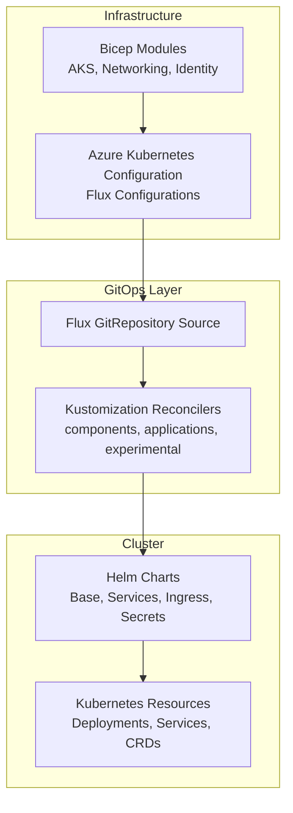
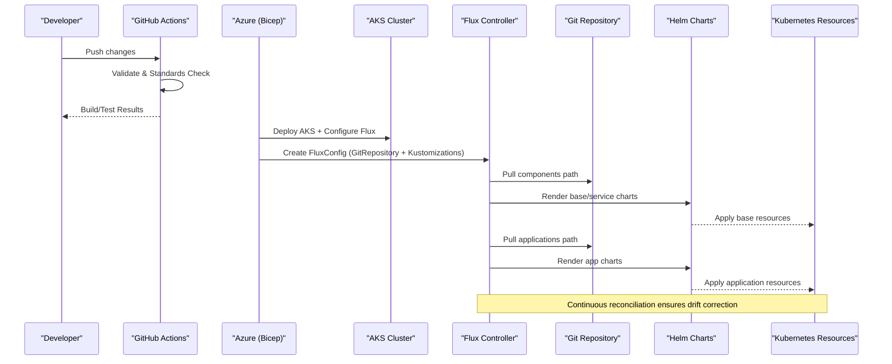
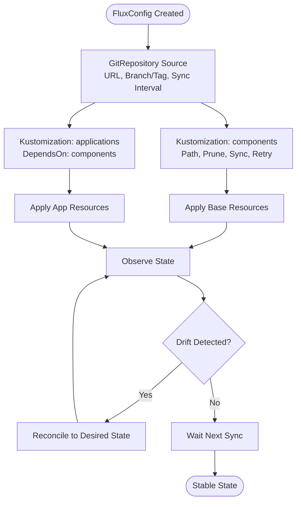
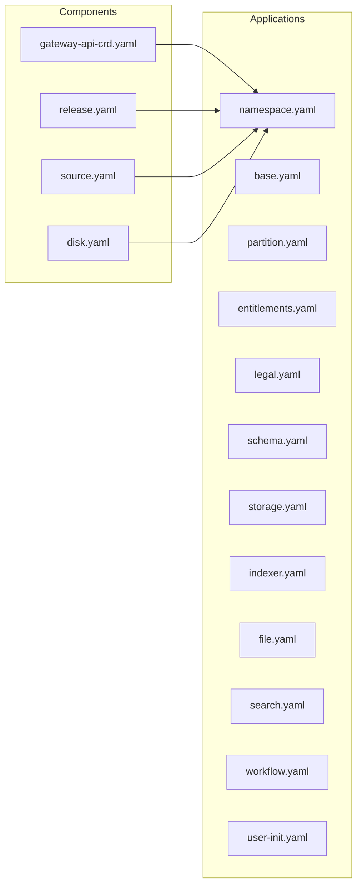
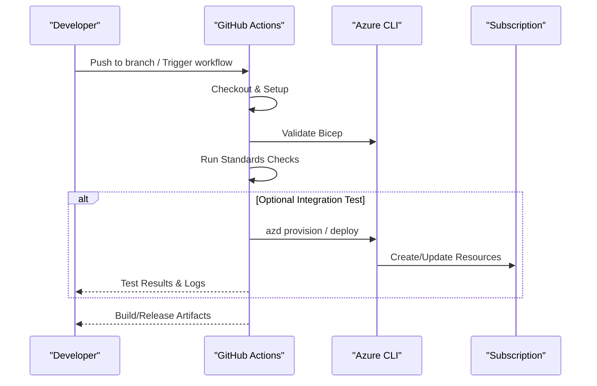
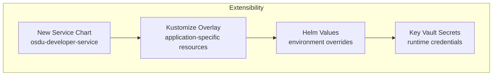
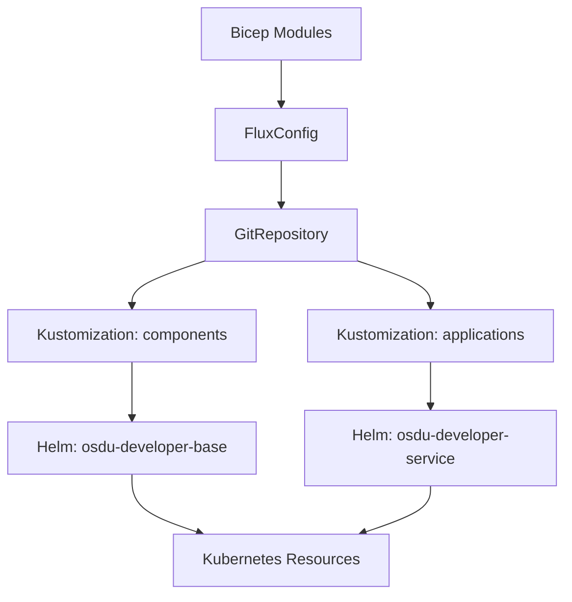

# Platform Design

<cite>
**Referenced Files in This Document**
- [README.md](file://README.md)
- [design_platform.md](file://docs/src/design_platform.md)
- [pipelines.md](file://docs/pipelines.md)
- [test.yml](file://.github/workflows/test.yml)
- [main.bicep](file://bicep/main.bicep)
- [blade_configuration.bicep](file://bicep/modules/blade_configuration.bicep)
- [flux-configuration/main.bicep](file://bicep/modules/flux-configuration/main.bicep)
- [kustomization.yaml (osdu-core)](file://software/applications/osdu-core/kustomization.yaml)
- [kustomization.yaml (global)](file://software/components/global/kustomization.yaml)
- [Chart.yaml (osdu-developer-base)](file://charts/osdu-developer-base/Chart.yaml)
- [values.yaml (osdu-developer-base)](file://charts/osdu-developer-base/values.yaml)
- [Chart.yaml (osdu-developer-service)](file://charts/osdu-developer-service/Chart.yaml)
- [config-map-values.yaml](file://software/applications/config-map-values.yaml)
</cite>

## Table of Contents
1. Introduction
2. Project Structure
3. Core Components
4. Architecture Overview
5. Detailed Component Analysis
6. Dependency Analysis
7. Performance Considerations
8. Troubleshooting Guide
9. Conclusion

## Introduction
This document describes the platform design for the OSDU Developer platform with a focus on GitOps-driven application management using Flux CD, Helm chart organization, Kustomize overlays for environment-specific configurations, and CI/CD automation. It also covers extensibility points for custom service integration, configuration management, environment provisioning, security, multi-tenancy support, and operational procedures. The goal is to provide both high-level architecture and code-level insights so that engineers can understand how infrastructure code, application manifests, and deployment automation interact end-to-end.

## Project Structure
The repository organizes platform assets into clear layers:
- Infrastructure as Code (IaC): Bicep modules provision AKS, networking, identity, and configure Azure Kubernetes Configuration (Flux).
- Application Manifests: Kustomizations define components and applications deployed into the cluster.
- Helm Charts: Custom charts package reusable templates for services, base components, secrets, ingress, and more.
- CI/CD: GitHub Actions automate validation, build, release, and optional integration tests.
- Documentation: Design docs describe security controls, operational excellence, and pipelines.

**Diagram sources**
- [blade_configuration.bicep:490-564](file://bicep/modules/blade_configuration.bicep#L490-L564)
- [flux-configuration/main.bicep:73-91](file://bicep/modules/flux-configuration/main.bicep#L73-L91)
- [kustomization.yaml (global):1-9](file://software/components/global/kustomization.yaml#L1-L9)
- [kustomization.yaml (osdu-core):1-18](file://software/applications/osdu-core/kustomization.yaml#L1-L18)

**Section sources**
- [README.md:16-22](file://README.md#L16-L22)
- [design_platform.md:123-145](file://docs/src/design_platform.md#L123-L145)

## Core Components
- Infrastructure Provisioning (Bicep): Defines AKS, networking, identity, and configures Flux via Azure Kubernetes Configuration.
- GitOps Orchestration (Flux): Declares GitRepository sources and Kustomization reconcilers for components and applications with dependency ordering and pruning.
- Application Packaging (Helm): Provides reusable charts for base setup, services, ingress, secrets, and utilities.
- Environment-Specific Configuration (Kustomize): Organizes resources per layer (components vs applications) and allows overlays for different environments.
- CI/CD Automation (GitHub Actions): Validates IaC, builds artifacts, runs standards checks, and supports scheduled or manual integration tests.

Key responsibilities:
- Bicep modules ensure consistent, secure infrastructure and inject Flux configuration pointing to the repo’s component/application paths.
- Flux continuously reconciles desired state from Git into the cluster.
- Helm charts encapsulate templated Kubernetes resources with configurable values.
- Kustomize composes layered manifests for reproducible deployments.
- GitHub Actions enforce quality gates and automate releases.

**Section sources**
- [blade_configuration.bicep:490-564](file://bicep/modules/blade_configuration.bicep#L490-L564)
- [flux-configuration/main.bicep:5-52](file://bicep/modules/flux-configuration/main.bicep#L5-L52)
- [Chart.yaml (osdu-developer-base):1-9](file://charts/osdu-developer-base/Chart.yaml#L1-L9)
- [Chart.yaml (osdu-developer-service):1-10](file://charts/osdu-developer-service/Chart.yaml#L1-L10)
- [kustomization.yaml (global):1-9](file://software/components/global/kustomization.yaml#L1-L9)
- [kustomization.yaml (osdu-core):1-18](file://software/applications/osdu-core/kustomization.yaml#L1-L18)

## Architecture Overview
The platform uses a GitOps model where Flux is installed and configured by Bicep-based IaC. Flux watches a Git repository and applies Kustomizations for components and applications in a defined order. Helm charts are used within these layers to template and parameterize Kubernetes resources.

**Diagram sources**
- [test.yml:35-82](file://.github/workflows/test.yml#L35-L82)
- [blade_configuration.bicep:490-564](file://bicep/modules/blade_configuration.bicep#L490-L564)
- [flux-configuration/main.bicep:73-91](file://bicep/modules/flux-configuration/main.bicep#L73-L91)
- [kustomization.yaml (global):1-9](file://software/components/global/kustomization.yaml#L1-L9)
- [kustomization.yaml (osdu-core):1-18](file://software/applications/osdu-core/kustomization.yaml#L1-L18)

## Detailed Component Analysis

### GitOps Platform Architecture (Flux CD)
Flux is configured via Azure Kubernetes Configuration to reconcile two primary Kustomization paths:
- Components: Base platform capabilities such as mesh, storage classes, CRDs, and system services.
- Applications: OSDU core services, experimental features, and integrations.

The configuration enforces dependency ordering (applications depend on components), pruning of deleted resources, and sync intervals for continuous reconciliation.

**Diagram sources**
- [blade_configuration.bicep:490-564](file://bicep/modules/blade_configuration.bicep#L490-L564)
- [flux-configuration/main.bicep:73-91](file://bicep/modules/flux-configuration/main.bicep#L73-L91)

**Section sources**
- [blade_configuration.bicep:490-564](file://bicep/modules/blade_configuration.bicep#L490-L564)
- [flux-configuration/main.bicep:5-52](file://bicep/modules/flux-configuration/main.bicep#L5-L52)

### Helm Chart Structure and Kustomize Overlays
Helm charts provide reusable templates for base and service layers:
- osdu-developer-base: Installs foundational components and shared settings.
- osdu-developer-service: Deploys individual OSDU services with templated resources.

Kustomize organizes resources into layers:
- components: Global platform capabilities (e.g., gateway API CRDs, disk classes, global releases).
- applications: Feature sets like osdu-core, auth, reference data, and web site.

Environment-specific overrides are applied through Kustomize files and values injected via ConfigMaps or Helm values.

**Diagram sources**
- [kustomization.yaml (global):1-9](file://software/components/global/kustomization.yaml#L1-L9)
- [kustomization.yaml (osdu-core):1-18](file://software/applications/osdu-core/kustomization.yaml#L1-L18)

**Section sources**
- [Chart.yaml (osdu-developer-base):1-9](file://charts/osdu-developer-base/Chart.yaml#L1-L9)
- [Chart.yaml (osdu-developer-service):1-10](file://charts/osdu-developer-service/Chart.yaml#L1-L10)
- [kustomization.yaml (global):1-9](file://software/components/global/kustomization.yaml#L1-L9)
- [kustomization.yaml (osdu-core):1-18](file://software/applications/osdu-core/kustomization.yaml#L1-L18)

### CI/CD Pipeline Design
The pipeline automates validation, standards checks, and optional integration tests:
- Validation: Ensures Bicep templates are syntactically valid and adhere to policies.
- Standards: Runs non-blocking policy checks to assess alignment with best practices.
- Integration Tests: Optionally deploys to a target resource group and region, verifying end-to-end functionality.
- Release: Produces ARM templates from Bicep for traceability and reuse.

**Diagram sources**
- [test.yml:35-82](file://.github/workflows/test.yml#L35-L82)
- [pipelines.md:47-108](file://docs/pipelines.md#L47-L108)

**Section sources**
- [test.yml:35-82](file://.github/workflows/test.yml#L35-L82)
- [pipelines.md:47-108](file://docs/pipelines.md#L47-L108)

### Extensibility Points
- Custom Service Integration: Add new services under applications with their own Kustomization and Helm chart; Flux will reconcile them after components are ready.
- Configuration Management: Use Helm values and ConfigMaps to inject environment-specific parameters; Key Vault integration is supported via charts and CSI driver patterns.
- Environment Provisioning: Extend Bicep modules to add new clusters or network topologies; configure additional Flux Kustomizations for isolated environments.

[No diagram sources needed since this diagram shows conceptual relationships]

**Section sources**
- [values.yaml (osdu-developer-base):1-38](file://charts/osdu-developer-base/values.yaml#L1-L38)
- [config-map-values.yaml:1-20](file://software/applications/config-map-values.yaml#L1-L20)
- [design_platform.md:103-121](file://docs/src/design_platform.md#L103-L121)

### Security, Multi-Tenancy, and Operations
Security controls include:
- Cluster protection with Defender for Containers, RBAC, Node Resource Group Lockdown.
- Network isolation via Private Cluster, API VNet Integration, CNI Overlay, NAT Gateway, and Istio service mesh.
- Pod security with Workload Identity, Secrets Store CSI Driver, and Policy Controls.

Multi-tenancy is supported by:
- Namespace-scoped Kustomizations and Helm releases per tenant.
- Fine-grained RBAC and Entra ID integration for access control.
- Isolated Flux Kustomizations for tenant-specific applications.

Operational procedures:
- Automated upgrades and node OS updates.
- Autoscaling via KEDA and Vertical Pod Autoscaler.
- Monitoring and observability via built-in components.

**Section sources**
- [design_platform.md:20-121](file://docs/src/design_platform.md#L20-L121)
- [design_platform.md:147-185](file://docs/src/design_platform.md#L147-L185)

## Dependency Analysis
The platform exhibits clear separation of concerns:
- Bicep provisions infrastructure and configures Flux.
- Flux depends on GitRepository sources and orchestrates Kustomizations.
- Kustomizations depend on Helm charts for templating.
- Helm charts produce Kubernetes resources consumed by the cluster.

**Diagram sources**
- [blade_configuration.bicep:490-564](file://bicep/modules/blade_configuration.bicep#L490-L564)
- [flux-configuration/main.bicep:73-91](file://bicep/modules/flux-configuration/main.bicep#L73-L91)
- [kustomization.yaml (global):1-9](file://software/components/global/kustomization.yaml#L1-L9)
- [kustomization.yaml (osdu-core):1-18](file://software/applications/osdu-core/kustomization.yaml#L1-L18)

**Section sources**
- [blade_configuration.bicep:490-564](file://bicep/modules/blade_configuration.bicep#L490-L564)
- [flux-configuration/main.bicep:73-91](file://bicep/modules/flux-configuration/main.bicep#L73-L91)

## Performance Considerations
- Autoscaling: Leverage KEDA for event-driven scaling and Vertical Pod Autoscaler for resource optimization.
- Sync Intervals: Tune Flux sync intervals and retry intervals to balance responsiveness and cluster load.
- Pruning: Enable pruning to remove orphaned resources and maintain clean state.
- Networking: Use CNI Overlay and private endpoints to reduce latency and improve security posture.

[No sources needed since this section provides general guidance]

## Troubleshooting Guide
Common issues and resolutions:
- Flux not reconciling: Verify GitRepository URL, branch/tag, and sync interval; check Flux logs for errors.
- Kustomization failures: Inspect component/application Kustomization paths and dependencies; ensure prerequisites are met.
- Helm rendering errors: Validate values and templates; confirm required variables are provided via ConfigMaps or values files.
- Secret injection issues: Ensure Key Vault integration is configured and CSI driver is functioning; verify permissions for workload identities.

Operational tips:
- Use GitHub Actions logs to validate IaC and pipeline steps.
- Monitor cluster events and pod statuses for failed deployments.
- Leverage observability components (Prometheus, Grafana, Jaeger) for diagnostics.

**Section sources**
- [test.yml:35-82](file://.github/workflows/test.yml#L35-L82)
- [pipelines.md:47-108](file://docs/pipelines.md#L47-L108)

## Conclusion
The OSDU Developer platform adopts a robust GitOps approach powered by Flux CD, orchestrated through Bicep-based IaC and organized with Helm charts and Kustomize overlays. This design enables secure, scalable, and automated deployments with strong operational practices. Extensibility points allow teams to integrate custom services, manage configuration centrally, and provision environments consistently. Security controls and multi-tenancy support ensure compliance and isolation, while CI/CD automation maintains quality and reliability across the lifecycle.

[No sources needed since this section summarizes without analyzing specific files]