# Software Architecture

<cite>
**Referenced Files in This Document**
- [README.md](file://README.md)
- [design_architecture.md](file://docs/src/design_architecture.md)
- [services_overview.md](file://docs/src/services_overview.md)
- [services_core_partition.md](file://docs/src/services_core_partition.md)
- [services_core_entitlements.md](file://docs/src/services_core_entitlements.md)
- [services_core_legal.md](file://docs/src/services_core_legal.md)
- [services_core_schema.md](file://docs/src/services_core_schema.md)
- [services_core_storage.md](file://docs/src/services_core_storage.md)
- [services_core_search.md](file://docs/src/services_core_search.md)
- [services_core_indexer.md](file://docs/src/services_core_indexer.md)
- [services_core_workflow.md](file://docs/src/services_core_workflow.md)
- [base.yaml](file://software/applications/osdu-core/base.yaml)
- [gateways.yaml](file://charts/istio-ingress/templates/gateways.yaml)
- [httproutes.yaml](file://charts/istio-ingress/templates/httproutes.yaml)
- [reference-grant.yaml](file://charts/osdu-developer-service/templates/reference-grant.yaml)
- [mesh.yaml](file://software/components/osdu-system/mesh.yaml)
- [docker-bake.hcl](file://src/docker-bake.hcl)
- [main.bicep](file://bicep/main.bicep)
</cite>

## Table of Contents
1. [Introduction](#introduction)
2. [Project Structure](#project-structure)
3. [Core Components](#core-components)
4. [Architecture Overview](#architecture-overview)
5. [Detailed Component Analysis](#detailed-component-analysis)
6. [Dependency Analysis](#dependency-analysis)
7. [Performance Considerations](#performance-considerations)
8. [Troubleshooting Guide](#troubleshooting-guide)
9. [Conclusion](#conclusion)
10. [Appendices](#appendices)

## Introduction
This document provides comprehensive software architecture documentation for the OSDU platform as implemented in this repository. It covers microservices, communication patterns, data architecture, API gateway with Istio, deployment strategies, scaling policies, and service discovery. The goal is to make the system understandable for both technical and non-technical readers while remaining grounded in the repository’s configuration and service definitions.

## Project Structure
The repository organizes infrastructure and application deployments using GitOps principles:
- Infrastructure-as-Code (IaC) via Bicep modules for Azure resources.
- Kubernetes manifests and Helm charts under charts/ for services, gateways, and observability.
- Application manifests under software/applications/ orchestrate core OSDU services and their initialization order.
- Documentation under docs/src explains architecture, services, and operational guidance.

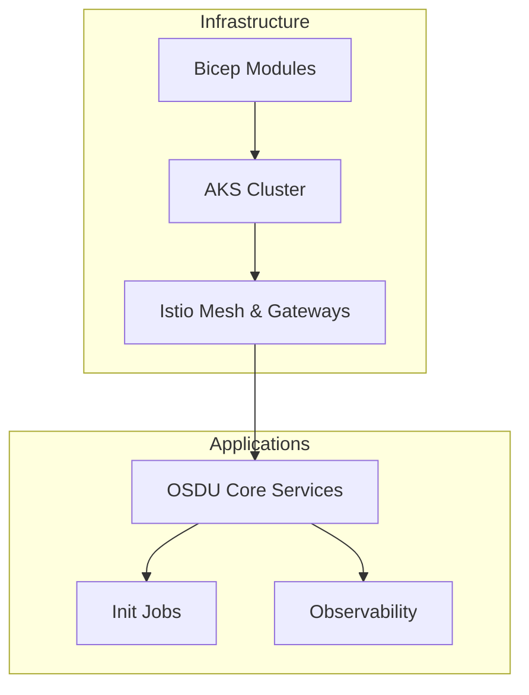

**Diagram sources**
- [mesh.yaml:47-241](file://software/components/osdu-system/mesh.yaml#L47-L241)
- [base.yaml:1-72](file://software/applications/osdu-core/base.yaml#L1-L72)
- [main.bicep:1-200](file://bicep/main.bicep#L1-L200)

**Section sources**
- [design_architecture.md:11-28](file://docs/src/design_architecture.md#L11-L28)
- [base.yaml:1-72](file://software/applications/osdu-core/base.yaml#L1-L72)
- [mesh.yaml:47-241](file://software/components/osdu-system/mesh.yaml#L47-L241)

## Core Components
OSDU core services include Partition, Entitlements, Legal, Schema, Storage, Search, Indexer, and Workflow. Each service exposes REST APIs, integrates with shared infrastructure (Cosmos DB, Redis, Service Bus, Blob storage), and participates in mesh-based traffic management and authentication.

Key responsibilities:
- Partition: Data partitioning and routing metadata.
- Entitlements: Access control and permissions.
- Legal: Compliance tagging and policy enforcement.
- Schema: Schema registry and validation.
- Storage: Record and file persistence.
- Search: Full-text search over indexed records.
- Indexer: Asynchronous indexing triggered by events.
- Workflow: Orchestration integration with Airflow for ingestion workflows.

**Section sources**
- [services_overview.md:17-46](file://docs/src/services_overview.md#L17-L46)
- [docker-bake.hcl:65-130](file://src/docker-bake.hcl#L65-L130)

## Architecture Overview
The platform follows a microservices architecture deployed on AKS with Istio as the service mesh and Gateway API for ingress. Services communicate via:
- REST APIs over mTLS within the mesh.
- Event-driven messaging via Azure Service Bus topics and subscriptions.
- Caching through Redis for performance-sensitive lookups.
- Persistence in Cosmos DB and Azure Blob storage.
- Search indexing into Elasticsearch-backed search.

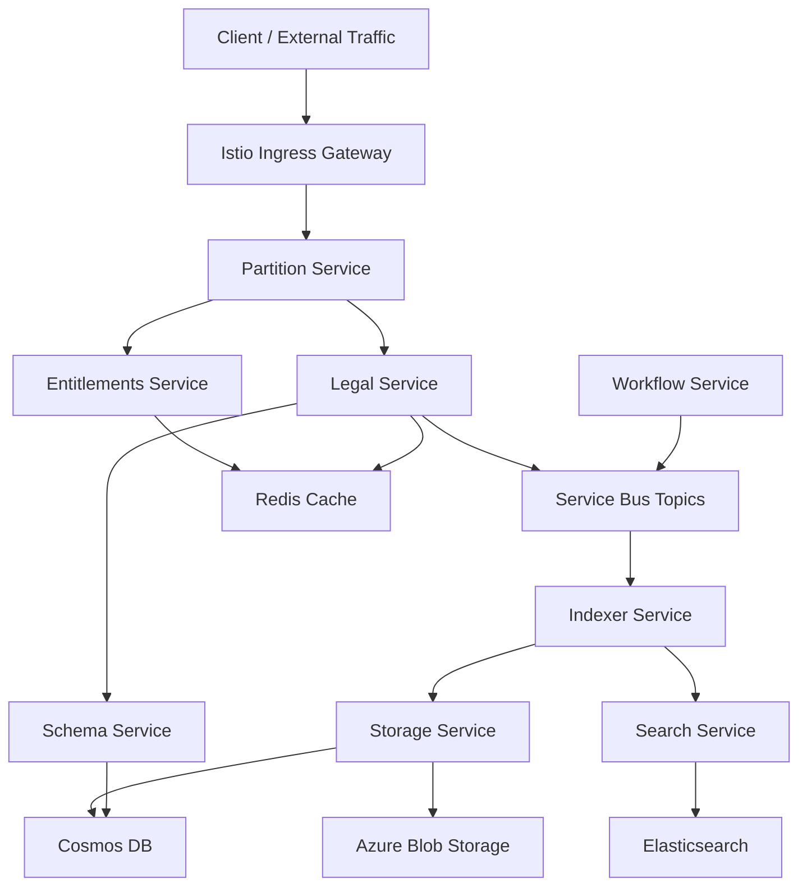

**Diagram sources**
- [mesh.yaml:144-241](file://software/components/osdu-system/mesh.yaml#L144-L241)
- [services_core_partition.md:14-29](file://docs/src/services_core_partition.md#L14-L29)
- [services_core_entitlements.md:14-28](file://docs/src/services_core_entitlements.md#L14-L28)
- [services_core_legal.md:14-36](file://docs/src/services_core_legal.md#L14-L36)
- [services_core_schema.md:14-40](file://docs/src/services_core_schema.md#L14-L40)
- [services_core_storage.md:14-39](file://docs/src/services_core_storage.md#L14-L39)
- [services_core_search.md:14-38](file://docs/src/services_core_search.md#L14-L38)
- [services_core_indexer.md:14-31](file://docs/src/services_core_indexer.md#L14-L31)
- [services_core_workflow.md:14-39](file://docs/src/services_core_workflow.md#L14-L39)

## Detailed Component Analysis

### Partition Service
- Purpose: Manages partitions that isolate and route data; foundational dependency for other services.
- Communication: Exposes REST endpoints; used by Entitlements, Legal, Schema, Storage, Search, Indexer, Workflow.
- Configuration: Requires Key Vault, AAD client ID, Redis database, and optional Istio auth toggles.

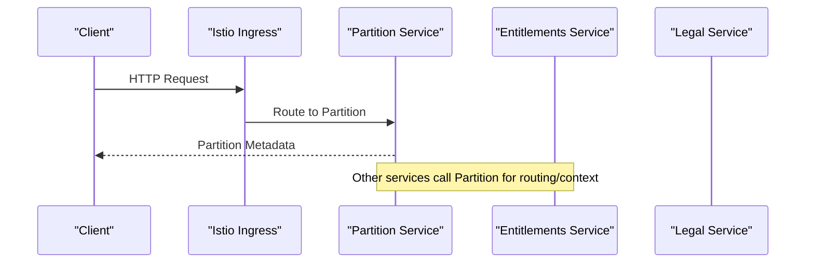

**Diagram sources**
- [services_core_partition.md:14-29](file://docs/src/services_core_partition.md#L14-L29)
- [services_core_entitlements.md:14-28](file://docs/src/services_core_entitlements.md#L14-L28)
- [services_core_legal.md:14-36](file://docs/src/services_core_legal.md#L14-L36)

**Section sources**
- [services_core_partition.md:14-29](file://docs/src/services_core_partition.md#L14-L29)

### Entitlements Service
- Purpose: Provides access control and permissions across partitions and datasets.
- Communication: REST APIs; caches results in Redis; depends on Partition service for context.
- Security: Integrates with AAD and can enforce Istio mTLS.

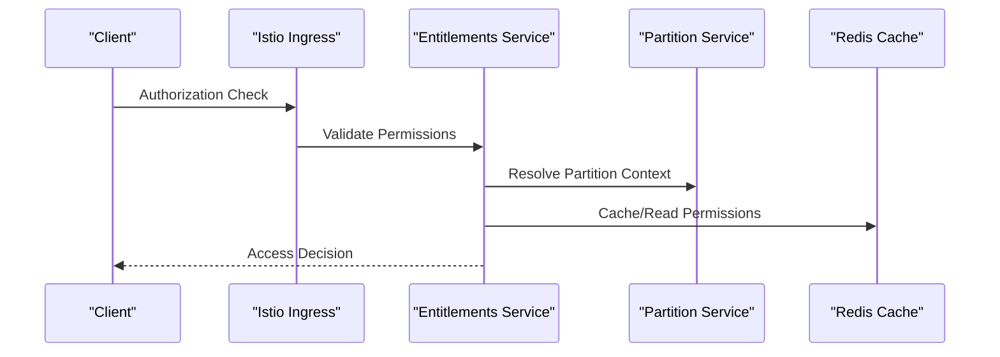

**Diagram sources**
- [services_core_entitlements.md:14-28](file://docs/src/services_core_entitlements.md#L14-L28)
- [services_core_partition.md:14-29](file://docs/src/services_core_partition.md#L14-L29)

**Section sources**
- [services_core_entitlements.md:14-28](file://docs/src/services_core_entitlements.md#L14-L28)

### Legal Service
- Purpose: Enforces legal tags and compliance requirements; emits events when legal state changes.
- Communication: REST APIs; publishes to Service Bus topic; consumes from Legal-specific subscriptions.
- Dependencies: Partition, Entitlements, Cosmos DB, Redis, Service Bus.

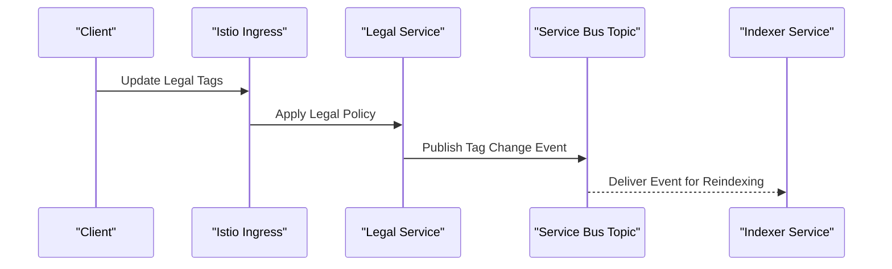

**Diagram sources**
- [services_core_legal.md:14-36](file://docs/src/services_core_legal.md#L14-L36)
- [services_core_indexer.md:14-31](file://docs/src/services_core_indexer.md#L14-L31)

**Section sources**
- [services_core_legal.md:14-36](file://docs/src/services_core_legal.md#L14-L36)

### Schema Service
- Purpose: Registry for data schemas; validates and serves schema definitions.
- Communication: REST APIs; optionally emits schema change events via Service Bus or Event Grid.
- Dependencies: Partition, Entitlements, Cosmos DB, Redis.

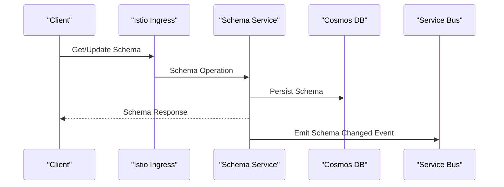

**Diagram sources**
- [services_core_schema.md:14-40](file://docs/src/services_core_schema.md#L14-L40)

**Section sources**
- [services_core_schema.md:14-40](file://docs/src/services_core_schema.md#L14-L40)

### Storage Service
- Purpose: Persists records and files; coordinates with Legal and Entitlements for access and compliance.
- Communication: REST APIs; publishes record events to Service Bus; uses Cosmos DB and Blob storage.
- Caching: Uses Redis for performance optimization.

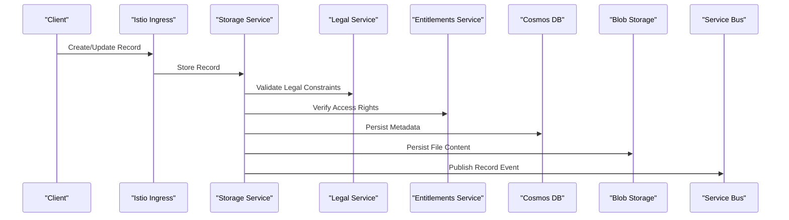

**Diagram sources**
- [services_core_storage.md:14-39](file://docs/src/services_core_storage.md#L14-L39)
- [services_core_legal.md:14-36](file://docs/src/services_core_legal.md#L14-L36)
- [services_core_entitlements.md:14-28](file://docs/src/services_core_entitlements.md#L14-L28)

**Section sources**
- [services_core_storage.md:14-39](file://docs/src/services_core_storage.md#L14-L39)

### Search Service
- Purpose: Provides full-text search capabilities over indexed records.
- Communication: REST APIs; reads from Elasticsearch; caches responses in Redis; depends on Partition and Entitlements for scoping.
- Optional Policy Integration: Can integrate with a policy service for advanced controls.

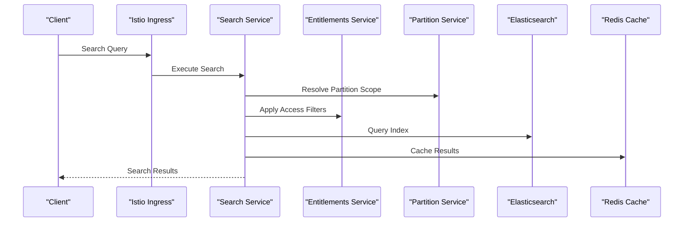

**Diagram sources**
- [services_core_search.md:14-38](file://docs/src/services_core_search.md#L14-L38)

**Section sources**
- [services_core_search.md:14-38](file://docs/src/services_core_search.md#L14-L38)

### Indexer Service
- Purpose: Consumes events to index records into searchable stores; interacts with Storage and Schema services.
- Communication: Subscribes to Service Bus topics; calls Storage query endpoints; uses Schema for validation.

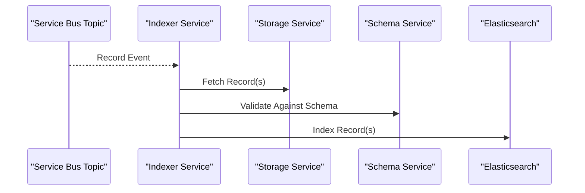

**Diagram sources**
- [services_core_indexer.md:14-31](file://docs/src/services_core_indexer.md#L14-L31)
- [services_core_storage.md:14-39](file://docs/src/services_core_storage.md#L14-L39)
- [services_core_schema.md:14-40](file://docs/src/services_core_schema.md#L14-L40)

**Section sources**
- [services_core_indexer.md:14-31](file://docs/src/services_core_indexer.md#L14-L31)

### Workflow Service
- Purpose: Orchestrates ingestion workflows; manages process startup records; integrates with Apache Airflow.
- Communication: REST APIs; triggers Airflow DAGs; persists workflow metadata in Cosmos DB.

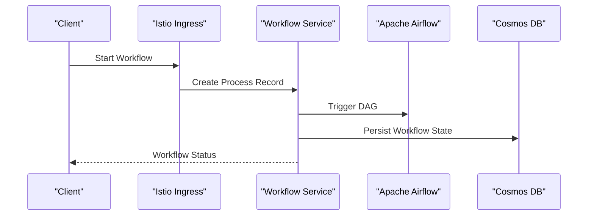

**Diagram sources**
- [services_core_workflow.md:14-39](file://docs/src/services_core_workflow.md#L14-L39)

**Section sources**
- [services_core_workflow.md:14-39](file://docs/src/services_core_workflow.md#L14-L39)

## Dependency Analysis
The installation sequence defines explicit dependencies among services and init jobs, ensuring correct bootstrapping and runtime interactions.

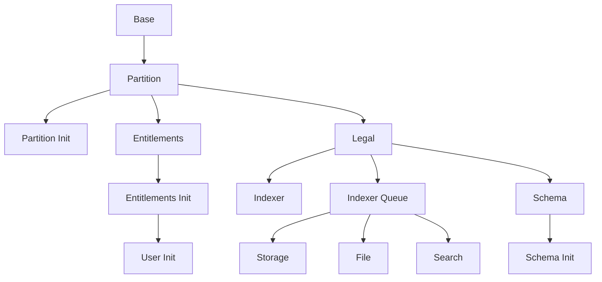

**Diagram sources**
- [base.yaml:1-72](file://software/applications/osdu-core/base.yaml#L1-L72)

**Section sources**
- [base.yaml:1-72](file://software/applications/osdu-core/base.yaml#L1-L72)

## Performance Considerations
- Caching: Redis is used across services (Partition, Entitlements, Legal, Storage, Search) to reduce latency for frequent operations such as permission checks and schema lookups.
- Messaging: Service Bus decouples producers and consumers, enabling scalable asynchronous processing for indexing and legal tag propagation.
- Search: Elasticsearch-backed search improves query performance; caching reduces repeated expensive queries.
- Scaling: Horizontal Pod Autoscaler (HPA) and KEDA ScaledObject are templated for services, allowing reactive scaling based on metrics or events.
- Network: Istio mTLS ensures secure inter-service communication; Gateway API routes external traffic efficiently.

[No sources needed since this section provides general guidance]

## Troubleshooting Guide
Common issues and diagnostics:
- Authentication failures: Ensure AAD client IDs, tenant IDs, and Key Vault URIs are correctly configured per service environment variables.
- Mesh connectivity: Verify Istio sidecars are injected and mTLS is enabled; check Gateway and HTTPRoute configurations.
- Messaging problems: Confirm Service Bus topics and subscriptions exist and that services publish/consume on expected names.
- Database connectivity: Validate Cosmos DB connection strings and database names; ensure network ACLs allow cluster access.
- Observability: Use Application Insights and logs emitted by Istio to trace requests across services.

**Section sources**
- [services_core_partition.md:14-29](file://docs/src/services_core_partition.md#L14-L29)
- [services_core_entitlements.md:14-28](file://docs/src/services_core_entitlements.md#L14-L28)
- [services_core_legal.md:14-36](file://docs/src/services_core_legal.md#L14-L36)
- [services_core_schema.md:14-40](file://docs/src/services_core_schema.md#L14-L40)
- [services_core_storage.md:14-39](file://docs/src/services_core_storage.md#L14-L39)
- [services_core_search.md:14-38](file://docs/src/services_core_search.md#L14-L38)
- [services_core_indexer.md:14-31](file://docs/src/services_core_indexer.md#L14-L31)
- [services_core_workflow.md:14-39](file://docs/src/services_core_workflow.md#L14-L39)

## Conclusion
The OSDU platform in this repository implements a robust microservices architecture on AKS with Istio for secure, observable, and scalable service communication. Core services coordinate via REST APIs and event-driven messaging, leveraging Redis for caching, Cosmos DB for persistence, and Elasticsearch for search. Deployment is managed declaratively with Bicep and GitOps, ensuring consistent environments and reliable rollbacks. The design supports horizontal scaling, flexible routing, and strong security posture through mTLS and identity integration.

[No sources needed since this section summarizes without analyzing specific files]

## Appendices

### API Gateway Implementation with Istio
- Gateways: Internal and external Istio gateways expose HTTP/HTTPS listeners and terminate TLS.
- Routes: HTTPRoutes define routing rules; ReferenceGrants allow cross-namespace routing to services.
- Certificates: cert-manager integrates with Istio CSR for automated certificate management.

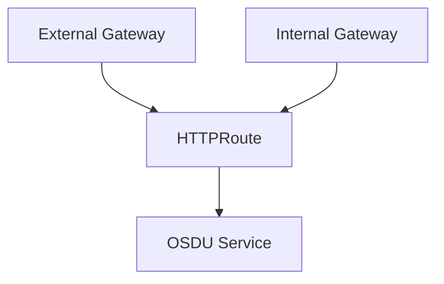

**Diagram sources**
- [gateways.yaml:64-95](file://charts/istio-ingress/templates/gateways.yaml#L64-L95)
- [httproutes.yaml:1-13](file://charts/istio-ingress/templates/httproutes.yaml#L1-L13)
- [reference-grant.yaml:1-21](file://charts/osdu-developer-service/templates/reference-grant.yaml#L1-L21)

**Section sources**
- [gateways.yaml:64-95](file://charts/istio-ingress/templates/gateways.yaml#L64-L95)
- [httproutes.yaml:1-13](file://charts/istio-ingress/templates/httproutes.yaml#L1-L13)
- [reference-grant.yaml:1-21](file://charts/osdu-developer-service/templates/reference-grant.yaml#L1-L21)

### Deployment Strategies and Service Discovery
- Deployment: Flux-managed HelmReleases deploy base, services, and components; dependencies enforced via dependsOn.
- Service Discovery: Kubernetes Services and Istio VirtualServices enable internal discovery; Gateway API handles external exposure.
- Scaling: HPA and KEDA templates support metric-driven and event-driven scaling for workloads.

**Section sources**
- [base.yaml:1-72](file://software/applications/osdu-core/base.yaml#L1-L72)
- [mesh.yaml:47-241](file://software/components/osdu-system/mesh.yaml#L47-L241)

### Data Architecture Summary
- Databases: Cosmos DB for structured metadata and system state.
- Caching: Redis for high-performance lookups and session/stateless caching.
- Storage: Azure Blob for large files and artifacts.
- Search: Elasticsearch for full-text indexing and querying.

**Section sources**
- [services_core_storage.md:14-39](file://docs/src/services_core_storage.md#L14-L39)
- [services_core_search.md:14-38](file://docs/src/services_core_search.md#L14-L38)
- [services_core_schema.md:14-40](file://docs/src/services_core_schema.md#L14-L40)
- [services_core_legal.md:14-36](file://docs/src/services_core_legal.md#L14-L36)