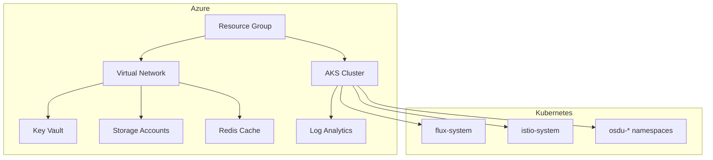
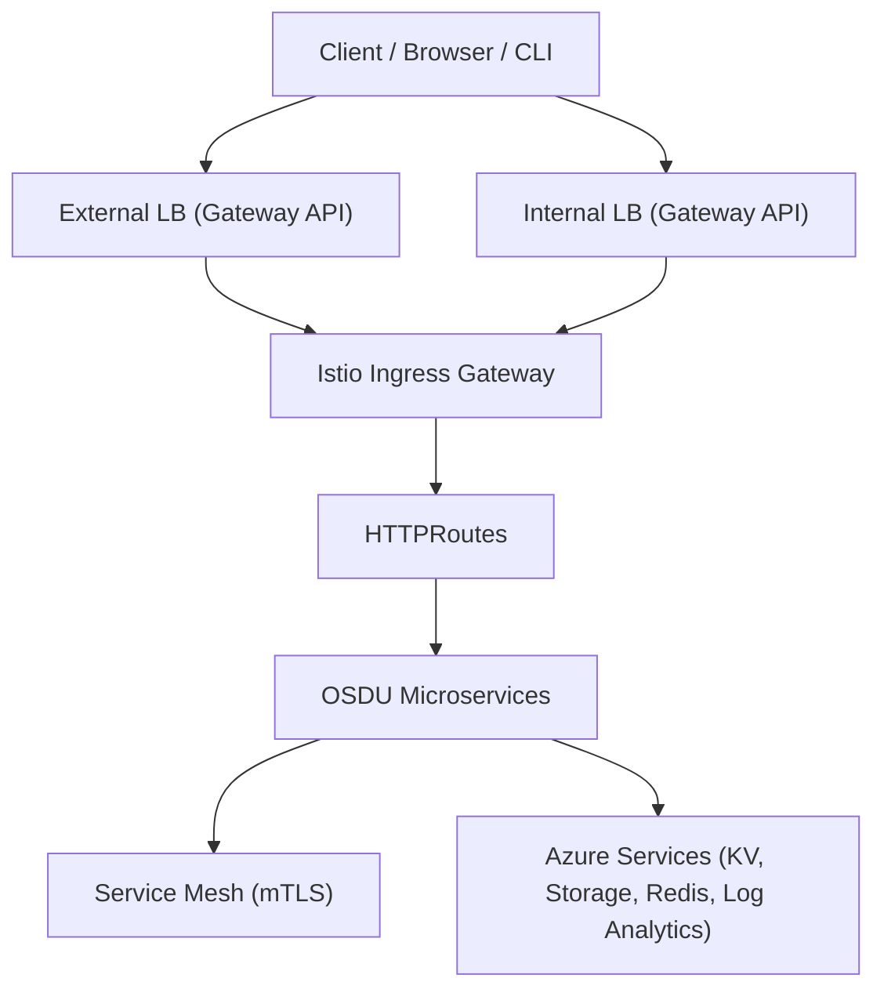
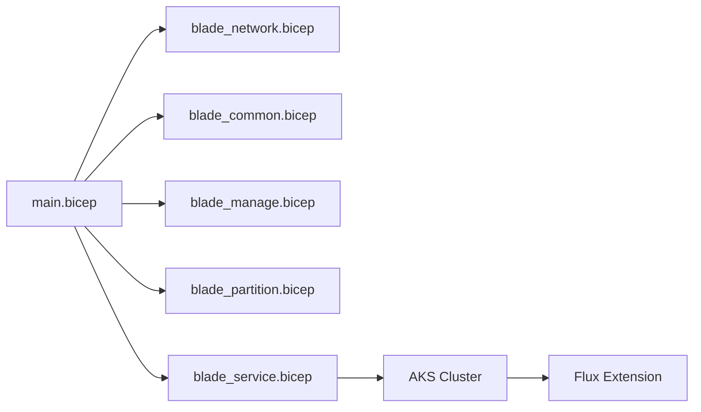
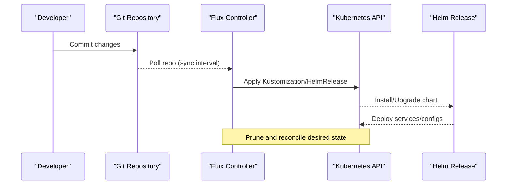
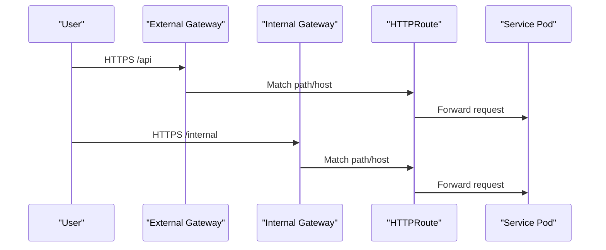
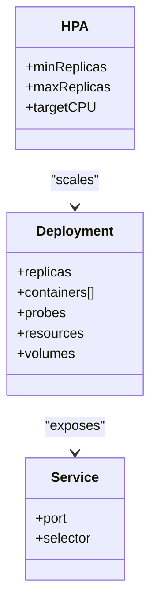
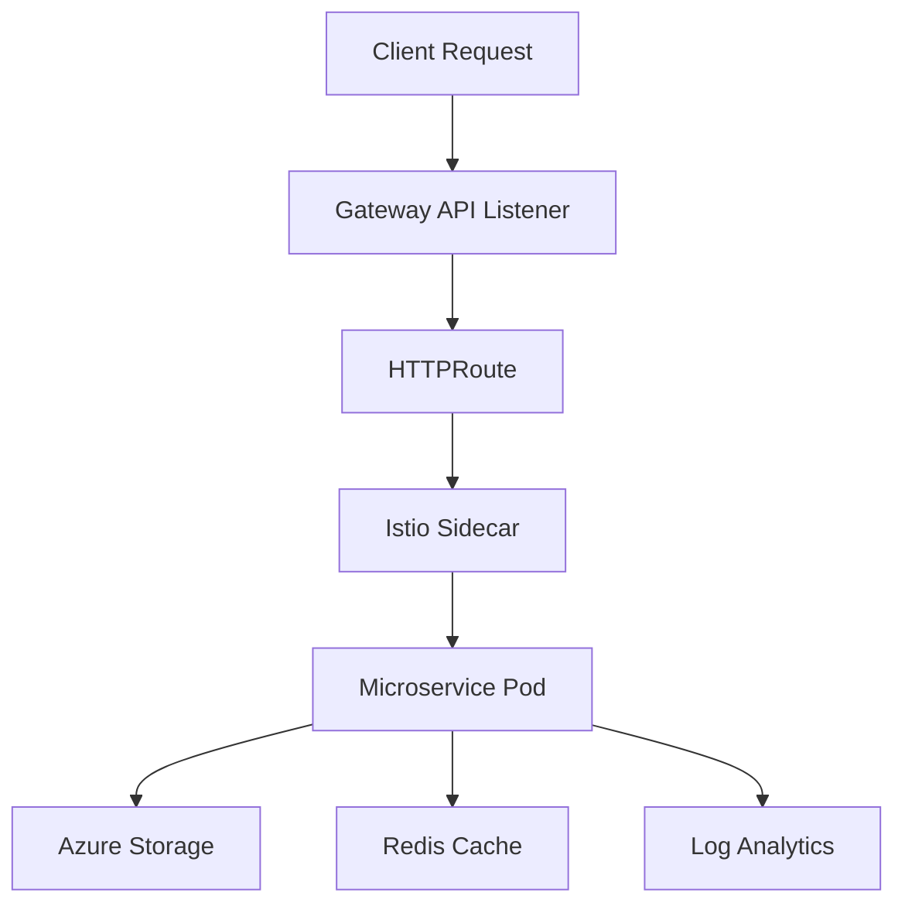
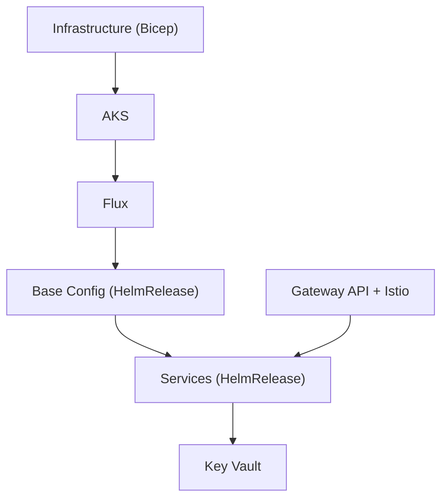

# System Architecture

<cite>
**Referenced Files in This Document**
- [README.md](file://README.md)
- [design_architecture.md](file://docs/src/design_architecture.md)
- [design_infrastructure.md](file://docs/src/design_infrastructure.md)
- [main.bicep](file://bicep/main.bicep)
- [gateway-migration-summary.md](file://docs/gateway-migration-summary.md)
- [gateways.yaml](file://charts/istio-ingress/templates/gateways.yaml)
- [Chart.yaml (osdu-developer-service)](file://charts/osdu-developer-service/Chart.yaml)
- [deployment.yaml (osdu-developer-service)](file://charts/osdu-developer-service/templates/deployment.yaml)
- [hpa.yaml (osdu-developer-service)](file://charts/osdu-developer-service/templates/hpa.yaml)
- [base.yaml (osdu-core HelmRelease)](file://software/applications/osdu-core/base.yaml)
- [services_overview.md](file://docs/src/services_overview.md)
- [README.MD (charts)](file://charts/README.MD)
</cite>

## Table of Contents
1. Introduction
2. Project Structure
3. Core Components
4. Architecture Overview
5. Detailed Component Analysis
6. Dependency Analysis
7. Performance Considerations
8. Troubleshooting Guide
9. Conclusion

## Introduction
This document describes the system architecture for the OSDU Developer platform deployed on Microsoft Azure. It explains how Azure infrastructure, an Azure Kubernetes Service (AKS) cluster, and microservices interact through a GitOps-driven deployment model using Flux CD and an Istio-based service mesh with Gateway API ingress. It also covers scalability, fault tolerance, and deployment topology considerations across Azure regions.

## Project Structure
The repository organizes infrastructure as code (IaC), application manifests, and charts to support a stamp-based, GitOps-managed deployment:
- Infrastructure as Code (Bicep): Defines Azure resources including AKS, networking, storage, identity, and monitoring.
- Software Applications and Components: Kubernetes manifests and Helm charts for core services, observability, and integrations.
- Charts: Reusable Helm packages for services, ingress, certificates, and base configurations.
- Documentation: Design guides for architecture, infrastructure, and services.

**Diagram sources**
- [design_infrastructure.md:132-308](file://docs/src/design_infrastructure.md#L132-L308)
- [main.bicep:353-421](file://bicep/main.bicep#L353-L421)

**Section sources**
- [design_architecture.md:11-28](file://docs/src/design_architecture.md#L11-L28)
- [design_infrastructure.md:1-22](file://docs/src/design_infrastructure.md#L1-L22)

## Core Components
- Azure Infrastructure: Virtual network, AKS cluster, storage accounts, Key Vault, Redis cache, and monitoring via Log Analytics and Application Insights.
- Kubernetes Platform: AKS hosts the microservices; Flux CD manages declarative applications; Istio provides service mesh capabilities and secure mTLS traffic.
- Ingress and Routing: Gateway API Gateways expose HTTP/HTTPS routes via external and internal Load Balancers.
- Services: Core OSDU services (Partition, Entitlements, Legal, Indexer, Schema, Storage, Search, File, Workflow) plus reference services and Airflow DAGs.

**Section sources**
- [services_overview.md:17-56](file://docs/src/services_overview.md#L17-L56)
- [design_infrastructure.md:190-308](file://docs/src/design_infrastructure.md#L190-L308)

## Architecture Overview
High-level design:
- Azure layer provisions networking, compute, storage, identity, and monitoring.
- AKS runs microservices orchestrated by Kubernetes.
- Flux CD watches a Git repository and reconciles desired state into the cluster.
- Istio secures and observes service-to-service communication; Gateway API exposes APIs externally and internally.

**Diagram sources**
- [gateways.yaml:1-96](file://charts/istio-ingress/templates/gateways.yaml#L1-L96)
- [gateway-migration-summary.md:8-47](file://docs/gateway-migration-summary.md#L8-L47)

## Detailed Component Analysis

### Azure Infrastructure and Stamp Pattern
- The main Bicep orchestrates resource groups, networking, AKS, storage, identity, and monitoring.
- Blade modules group related resources (network, common, manage, partition, service).
- Flux extension is installed on AKS to enable GitOps.

**Diagram sources**
- [design_infrastructure.md:24-38](file://docs/src/design_infrastructure.md#L24-L38)
- [main.bicep:353-421](file://bicep/main.bicep#L353-L421)

**Section sources**
- [main.bicep:1-157](file://bicep/main.bicep#L1-L157)
- [design_infrastructure.md:132-308](file://docs/src/design_infrastructure.md#L132-L308)

### GitOps with Flux CD
- Flux is installed via AKS extension and configured to sync from a Git repository.
- Kustomizations define components, applications, and experimental layers with dependencies and pruning.
- HelmReleases deploy base configurations and services into target namespaces.

**Diagram sources**
- [main.bicep:398-421](file://bicep/main.bicep#L398-L421)
- [base.yaml:1-72](file://software/applications/osdu-core/base.yaml#L1-L72)

**Section sources**
- [design_architecture.md:20-28](file://docs/src/design_architecture.md#L20-L28)
- [base.yaml:1-72](file://software/applications/osdu-core/base.yaml#L1-L72)

### Ingress and API Gateway (Gateway API + Istio)
- Two logical gateways are defined: external and internal, bound to physical LoadBalancer services.
- TLS termination occurs at the gateway using secrets.
- HTTPRoutes route traffic to services across namespaces with ReferenceGrants for cross-namespace access.

**Diagram sources**
- [gateways.yaml:1-96](file://charts/istio-ingress/templates/gateways.yaml#L1-L96)
- [gateway-migration-summary.md:21-47](file://docs/gateway-migration-summary.md#L21-L47)

**Section sources**
- [gateway-migration-summary.md:8-47](file://docs/gateway-migration-summary.md#L8-L47)

### Microservices Deployment and Scaling
- Each service is packaged as a Helm chart and deployed via HelmRelease.
- Deployments include readiness/liveness probes, resource requests/limits, and optional autoscaling via HPA.
- Workload Identity integrates with Azure for secure secret access.

**Diagram sources**
- [deployment.yaml:17-178](file://charts/osdu-developer-service/templates/deployment.yaml#L17-L178)
- [hpa.yaml:1-32](file://charts/osdu-developer-service/templates/hpa.yaml#L1-L32)

**Section sources**
- [Chart.yaml (osdu-developer-service):1-10](file://charts/osdu-developer-service/Chart.yaml#L1-L10)
- [deployment.yaml:17-178](file://charts/osdu-developer-service/templates/deployment.yaml#L17-L178)
- [hpa.yaml:1-32](file://charts/osdu-developer-service/templates/hpa.yaml#L1-L32)

### Data Flow Patterns
- External clients reach services through Gateway API listeners (HTTP/HTTPS).
- Istio enforces mTLS between services and provides observability.
- Services persist data to Azure Storage and use Redis for caching; logs/metrics flow to Log Analytics.

**Diagram sources**
- [gateways.yaml:1-96](file://charts/istio-ingress/templates/gateways.yaml#L1-L96)
- [main.bicep:191-247](file://bicep/main.bicep#L191-L247)
- [main.bicep:258-279](file://bicep/main.bicep#L258-L279)
- [main.bicep:715-792](file://bicep/main.bicep#L715-L792)

## Dependency Analysis
- Infrastructure depends on identity, networking, and monitoring resources.
- AKS depends on networking and identity; Flux extension depends on AKS.
- Applications depend on base configuration and secrets stored in Key Vault.
- Ingress depends on certificates and references grants for cross-namespace routing.

**Diagram sources**
- [main.bicep:353-421](file://bicep/main.bicep#L353-L421)
- [base.yaml:1-72](file://software/applications/osdu-core/base.yaml#L1-L72)
- [gateways.yaml:1-96](file://charts/istio-ingress/templates/gateways.yaml#L1-L96)

**Section sources**
- [design_infrastructure.md:132-308](file://docs/src/design_infrastructure.md#L132-L308)
- [base.yaml:1-72](file://software/applications/osdu-core/base.yaml#L1-L72)

## Performance Considerations
- Autoscaling: HorizontalPodAutoscaler scales deployments based on CPU utilization thresholds.
- Node Pools: Multiple node pools allow separating system and user workloads for better performance isolation.
- Caching: Redis cache reduces database load for frequently accessed data.
- Observability: Metrics and logs collected via Prometheus/Grafana and Log Analytics help identify bottlenecks.

[No sources needed since this section provides general guidance]

## Troubleshooting Guide
- Verify Gateway API status and addresses for both external and internal gateways.
- Check HTTPRoutes and ReferenceGrants for correct namespace permissions and path matching.
- Inspect pod health via readiness/liveness probes and resource limits.
- Validate Flux reconciliation errors and HelmRelease statuses when changes do not apply.

**Section sources**
- [gateway-migration-summary.md:122-138](file://docs/gateway-migration-summary.md#L122-L138)
- [deployment.yaml:102-116](file://charts/osdu-developer-service/templates/deployment.yaml#L102-L116)
- [base.yaml:18-25](file://software/applications/osdu-core/base.yaml#L18-L25)

## Conclusion
The OSDU Developer platform leverages Azure’s managed services, AKS, and a GitOps workflow with Flux CD to deliver a scalable, secure, and observable microservices architecture. Istio and Gateway API provide robust ingress and service mesh capabilities, while blade-based IaC ensures repeatable, modular infrastructure deployments. This design supports multi-region scaling, fault tolerance, and clear separation of concerns across infrastructure, platform, and application layers.