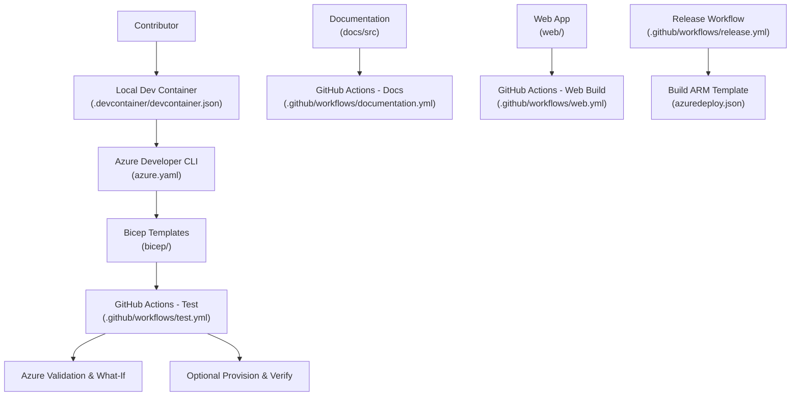
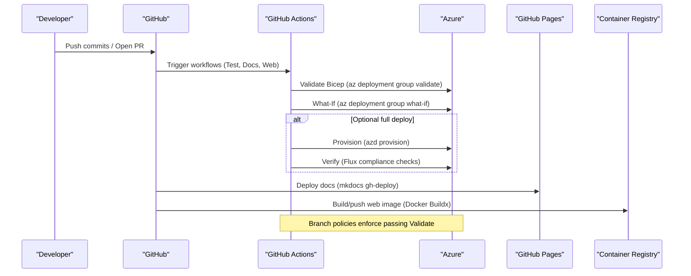
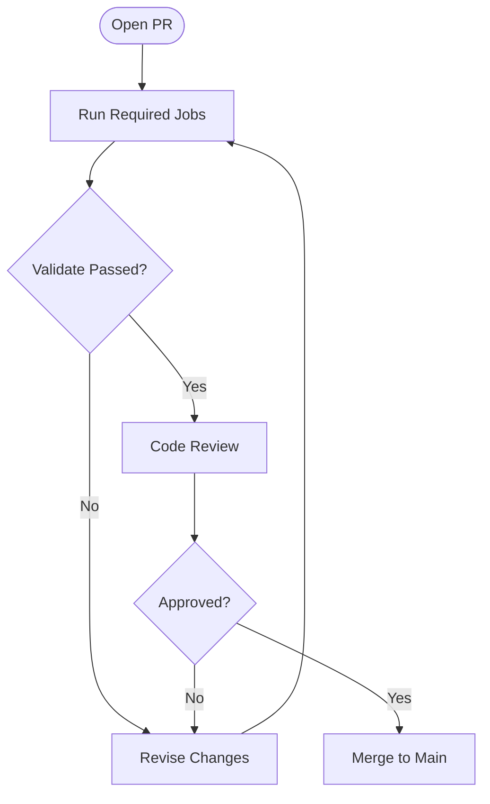
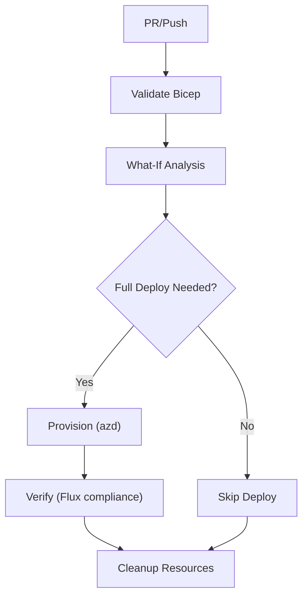
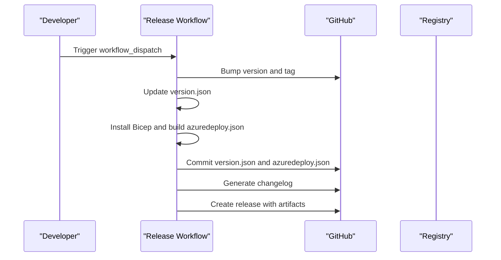
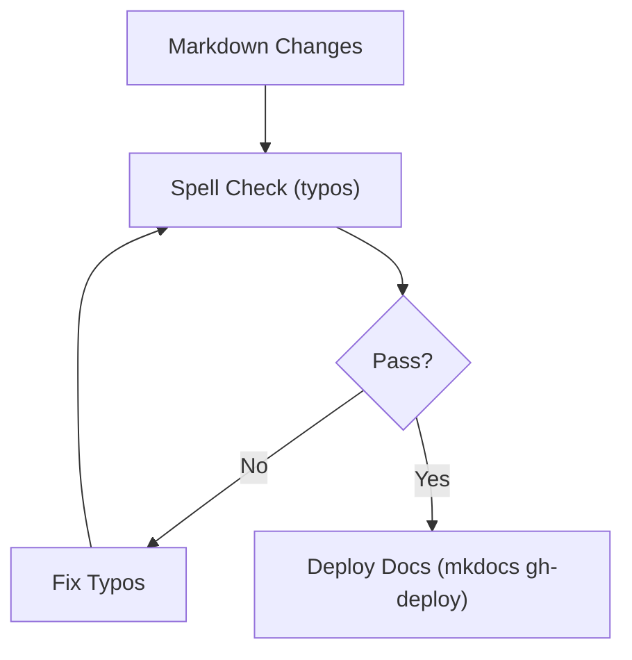
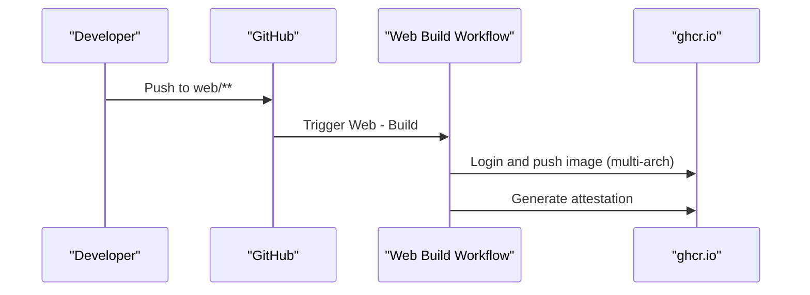
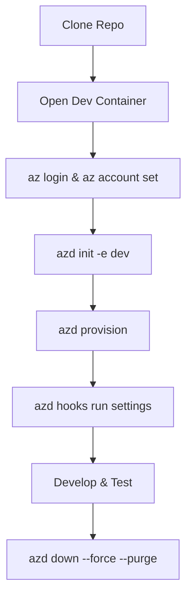
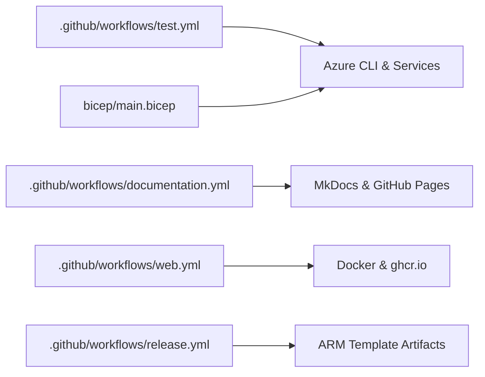

# Contributing Guide

<cite>
**Referenced Files in This Document**
- [CONTRIBUTING.md](file://CONTRIBUTING.md)
- [SECURITY.md](file://SECURITY.md)
- [CODE_OF_CONDUCT.md](file://CODE_OF_CONDUCT.md)
- [README.md](file://README.md)
- [CLAUDE.md](file://CLAUDE.md)
- [pipelines.md](file://docs/pipelines.md)
- [test.yml](file://.github/workflows/test.yml)
- [release.yml](file://.github/workflows/release.yml)
- [documentation.yml](file://.github/workflows/documentation.yml)
- [web.yml](file://.github/workflows/web.yml)
- [devcontainer.json](file://.devcontainer/devcontainer.json)
- [azure.yaml](file://azure.yaml)
- [docker-compose.yaml](file://docker-compose.yaml)
</cite>

## Table of Contents
1. Introduction
2. Project Structure
3. Core Components
4. Architecture Overview
5. Detailed Component Analysis
6. Dependency Analysis
7. Performance Considerations
8. Troubleshooting Guide
9. Conclusion
10. Appendices

## Introduction
This guide explains how to contribute to the OSDU Developer project on Azure. It covers development workflow, code and documentation standards, testing requirements, pull request process, code review procedures, release management, coding conventions, quality gates, issue reporting, feature requests, community participation, security reporting, licensing, contributor agreements, and environment setup for local development and testing.

The repository provides a simplified personal deployment of the OSDU data platform on Azure using Infrastructure as Code (Bicep), GitHub Actions for CI/CD, and Helm/Kustomize-based application manifests. Contributions are welcome and should follow the processes outlined below to ensure quality and consistency.

## Project Structure
At a high level:
- bicep: Infrastructure-as-Code templates and modules used to provision Azure resources.
- charts: Helm charts for deploying services and components into Kubernetes.
- docs: Documentation source (MkDocs) and pipeline documentation.
- scripts: Provisioning hooks and helper scripts.
- web: Web application assets and Docker configuration.
- .github/workflows: CI/CD workflows for validation, testing, documentation, releases, and web builds.
- .devcontainer: Development container configuration for consistent tooling.
- azure.yaml: Azure Developer CLI (azd) configuration with pre/post provisioning hooks.

**Diagram sources**
- [devcontainer.json:1-33](file://.devcontainer/devcontainer.json#L1-L33)
- [azure.yaml:1-26](file://azure.yaml#L1-L26)
- [test.yml:1-496](file://.github/workflows/test.yml#L1-L496)
- [documentation.yml:1-62](file://.github/workflows/documentation.yml#L1-L62)
- [web.yml:1-62](file://.github/workflows/web.yml#L1-L62)
- [release.yml:1-82](file://.github/workflows/release.yml#L1-L82)

**Section sources**
- [README.md:1-86](file://README.md#L1-L86)
- [pipelines.md:1-108](file://docs/pipelines.md#L1-L108)

## Core Components
- Contribution workflow and branch strategy: Feature branches target main; significant changes may use develop for full CI runs. PRs from forks require additional core team checks due to secret limitations.
- Enforced PR checks: Each workflow includes a Validate job required before merging. Bug-labeled PRs touching bicep or workflows must pass all relevant jobs.
- Continuous Integration:
  - Infra Test: Validates Bicep templates via Azure CLI validate and what-if, optional PSRule standards check, optional real deploy and verify steps.
  - Docs: Spell-check on markdown and automated publish to GitHub Pages.
  - Web: Builds and pushes multi-arch images to GitHub Container Registry.
  - Release: Version bump, Bicep build to ARM template, changelog generation, and GitHub release creation.
- Local development: Use the provided dev container with Azure CLI, Docker-in-Docker, Bicep, azd, and PowerShell. Hooks in azure.yaml run pre/post provisioning and settings tasks.

**Section sources**
- [CONTRIBUTING.md:1-58](file://CONTRIBUTING.md#L1-L58)
- [test.yml:1-496](file://.github/workflows/test.yml#L1-L496)
- [documentation.yml:1-62](file://.github/workflows/documentation.yml#L1-L62)
- [web.yml:1-62](file://.github/workflows/web.yml#L1-L62)
- [release.yml:1-82](file://.github/workflows/release.yml#L1-L82)
- [devcontainer.json:1-33](file://.devcontainer/devcontainer.json#L1-L33)
- [azure.yaml:1-26](file://azure.yaml#L1-L26)

## Architecture Overview
The contribution and delivery architecture integrates local development, CI/CD, and Azure infrastructure:

**Diagram sources**
- [test.yml:104-358](file://.github/workflows/test.yml#L104-L358)
- [documentation.yml:28-62](file://.github/workflows/documentation.yml#L28-L62)
- [web.yml:14-62](file://.github/workflows/web.yml#L14-L62)

## Detailed Component Analysis

### Pull Request Process and Quality Gates
- Create a feature branch and open a PR targeting main.
- Required checks:
  - Infra Test Validate job must pass (requires secrets/variables configured).
  - For bug-labeled PRs that modify bicep or workflows, all relevant jobs must pass.
- Fork PRs: Cannot access repository secrets; expect additional manual verification by core team. They may change the target branch to develop for full CI runs.
- Branch policies: Enforce passing the Validation stage.

**Section sources**
- [CONTRIBUTING.md:14-58](file://CONTRIBUTING.md#L14-L58)
- [test.yml:104-358](file://.github/workflows/test.yml#L104-L358)

### Testing Requirements
- Pre-deploy validation:
  - Azure CLI validate ensures compilation, parameter completeness, and control-plane acceptance.
  - Azure CLI what-if shows planned changes without creating resources.
- Standards checks:
  - PSRule for Azure evaluates Well-Architected Framework rules (non-blocking during rollout).
- Optional full deploy and verify:
  - Provision infrastructure and verify software installation via Flux compliance checks.
  - Cleanup job deletes resource groups and purges deleted Key Vaults and App Configurations.

**Diagram sources**
- [test.yml:169-358](file://.github/workflows/test.yml#L169-L358)
- [test.yml:360-496](file://.github/workflows/test.yml#L360-L496)

**Section sources**
- [pipelines.md:5-46](file://docs/pipelines.md#L5-L46)
- [test.yml:78-358](file://.github/workflows/test.yml#L78-L358)
- [test.yml:360-496](file://.github/workflows/test.yml#L360-L496)

### Release Management
- Manual release workflow:
  - Bumps version and generates next tag.
  - Updates version metadata.
  - Installs Bicep and builds ARM template (azuredeploy.json).
  - Commits generated artifacts.
  - Generates changelog and creates a GitHub release with the ARM template artifact.

**Diagram sources**
- [release.yml:18-82](file://.github/workflows/release.yml#L18-L82)

**Section sources**
- [release.yml:1-82](file://.github/workflows/release.yml#L1-L82)

### Documentation Standards and Automation
- Spell checking:
  - Markdown files are checked using typos with a custom config file.
- Automated publishing:
  - MkDocs builds and deploys to GitHub Pages on pushes to main affecting docs/src.
- Branch policy:
  - Spell check is enforced for merges to main.

**Diagram sources**
- [documentation.yml:28-62](file://.github/workflows/documentation.yml#L28-L62)

**Section sources**
- [documentation.yml:1-62](file://.github/workflows/documentation.yml#L1-L62)
- [pipelines.md:89-97](file://docs/pipelines.md#L89-L97)

### Web Build and Publishing
- Multi-architecture Docker image build and push to GitHub Container Registry.
- Tags include branch name and latest for main.
- Attestation generation for build provenance.

**Diagram sources**
- [web.yml:14-62](file://.github/workflows/web.yml#L14-L62)

**Section sources**
- [web.yml:1-62](file://.github/workflows/web.yml#L1-L62)

### Coding Conventions and Best Practices
- Keep changes minimal and simple; avoid large, complex changes.
- Follow existing patterns and conventions across Bicep, Helm, and scripts.
- Use the dev container to ensure consistent tooling and versions.
- Prefer IaC validation and what-if before actual deployments.
- Maintain clear commit messages and update documentation when behavior changes.

**Section sources**
- [CLAUDE.md:9-43](file://CLAUDE.md#L9-L43)
- [devcontainer.json:1-33](file://.devcontainer/devcontainer.json#L1-L33)
- [pipelines.md:5-46](file://docs/pipelines.md#L5-L46)

### Issue Reporting, Feature Requests, and Community Participation
- Start by reviewing active issues and labels to find good first issues.
- Engage respectfully following the Code of Conduct.
- For questions or concerns, contact the project maintainers via the channels listed in the Code of Conduct.

**Section sources**
- [CONTRIBUTING.md:5-11](file://CONTRIBUTING.md#L5-L11)
- [CODE_OF_CONDUCT.md:1-10](file://CODE_OF_CONDUCT.md#L1-L10)

### Security Reporting Procedures
- Do not report vulnerabilities through public GitHub issues.
- Report via Microsoft Security Response Center (MSRC) or email secure@microsoft.com.
- Include requested details such as type of issue, affected paths, reproduction steps, and impact.
- Microsoft follows Coordinated Vulnerability Disclosure.

**Section sources**
- [SECURITY.md:1-42](file://SECURITY.md#L1-L42)

### Licensing and Contributor Agreement
- The project uses the MIT license.
- Most contributions require signing a Contributor License Agreement (CLA).
- Refer to the CLA site for details and process.

**Section sources**
- [README.md:75-86](file://README.md#L75-L86)

### Development Environment Setup
- Use the provided dev container for consistent tools:
  - Azure CLI, Docker-in-Docker, Bicep, azd, PowerShell.
  - VS Code extensions recommended for resource monitoring and REST client usage.
- Initialize and provision locally:
  - Authenticate to Azure and set subscription.
  - Initialize environment and configure feature flags.
  - Run azd provision to deploy infrastructure.
  - Configure settings via hooks.
  - Clean up with azd down when done.
- Alternative local run:
  - docker-compose can be used to run the web service locally.

**Diagram sources**
- [devcontainer.json:1-33](file://.devcontainer/devcontainer.json#L1-L33)
- [azure.yaml:1-26](file://azure.yaml#L1-L26)
- [README.md:37-65](file://README.md#L37-L65)
- [docker-compose.yaml:1-13](file://docker-compose.yaml#L1-L13)

**Section sources**
- [devcontainer.json:1-33](file://.devcontainer/devcontainer.json#L1-L33)
- [azure.yaml:1-26](file://azure.yaml#L1-L26)
- [README.md:25-65](file://README.md#L25-L65)
- [docker-compose.yaml:1-13](file://docker-compose.yaml#L1-L13)

## Dependency Analysis
Key dependencies and integrations:
- GitHub Actions depend on Azure credentials (client ID, tenant ID, subscription ID) and optional secrets (email address, initial environment config).
- Bicep templates rely on Azure features and subscriptions; workflows validate and simulate deployments before any real changes.
- Documentation depends on MkDocs and GitHub Pages.
- Web build depends on Docker Buildx and GitHub Container Registry.
- Release workflow depends on version tagging and changelog generation.

**Diagram sources**
- [test.yml:1-496](file://.github/workflows/test.yml#L1-L496)
- [documentation.yml:1-62](file://.github/workflows/documentation.yml#L1-L62)
- [web.yml:1-62](file://.github/workflows/web.yml#L1-L62)
- [release.yml:1-82](file://.github/workflows/release.yml#L1-L82)

**Section sources**
- [test.yml:1-496](file://.github/workflows/test.yml#L1-L496)
- [documentation.yml:1-62](file://.github/workflows/documentation.yml#L1-L62)
- [web.yml:1-62](file://.github/workflows/web.yml#L1-L62)
- [release.yml:1-82](file://.github/workflows/release.yml#L1-L82)

## Performance Considerations
- Prefer validation and what-if over full deployments in PRs to reduce time and cost.
- Limit scope of changes to minimize CI runtime and risk.
- Use targeted paths in workflows to trigger only necessary jobs.
- Avoid unnecessary retries or long-running steps in PRs.

[No sources needed since this section provides general guidance]

## Troubleshooting Guide
Common issues and resolutions:
- Missing Azure variables/secrets: Ensure AZURE_TENANT_ID, AZURE_SUBSCRIPTION_ID, AZURE_CLIENT_ID are configured in GitHub vars/secrets.
- AKS preview features not registered: Workflows check and fail if features are still registering; register required features in your subscription.
- Active deployments blocking tests: Workflows detect running deployments; resolve conflicts before re-running.
- What-If failures: Inspect outputs for missing parameters or invalid configurations; fix templates accordingly.
- Docs build failures: Correct spelling errors flagged by typos; ensure mkdocs dependencies are installed.
- Web build failures: Verify Dockerfile and context; ensure registry permissions.

**Section sources**
- [test.yml:169-358](file://.github/workflows/test.yml#L169-L358)
- [test.yml:360-496](file://.github/workflows/test.yml#L360-L496)
- [documentation.yml:28-62](file://.github/workflows/documentation.yml#L28-L62)
- [web.yml:14-62](file://.github/workflows/web.yml#L14-L62)

## Conclusion
By following the development workflow, adhering to quality gates, and leveraging the provided tooling and automation, contributors can confidently add value to the OSDU Developer project. Focus on simplicity, validate early, document changes, and engage constructively with the community.

[No sources needed since this section summarizes without analyzing specific files]

## Appendices

### Quick Reference: Key Workflows and Triggers
- Infra - Test: Runs on push/PR to main for bicep changes; schedule and dispatch available.
- Auto - Doc: Spell checks markdown on PRs; publishes docs on main pushes affecting docs/src.
- Web - Build: Builds and pushes multi-arch images on pushes to web/**.
- Infra - Release: Manual workflow to build ARM templates and create releases.

**Section sources**
- [test.yml:1-496](file://.github/workflows/test.yml#L1-L496)
- [documentation.yml:1-62](file://.github/workflows/documentation.yml#L1-L62)
- [web.yml:1-62](file://.github/workflows/web.yml#L1-L62)
- [release.yml:1-82](file://.github/workflows/release.yml#L1-L82)