# Core Services

<cite>
**Referenced Files in This Document**
- [README.md](file://README.md)
- [services_overview.md](file://docs/src/services_overview.md)
- [design_architecture.md](file://docs/src/design_architecture.md)
- [services_core.md](file://docs/src/services_core.md)
- [services_core_partition.md](file://docs/src/services_core_partition.md)
- [services_core_entitlements.md](file://docs/src/services_core_entitlements.md)
- [services_core_legal.md](file://docs/src/services_core_legal.md)
- [services_core_schema.md](file://docs/src/services_core_schema.md)
- [services_core_storage.md](file://docs/src/services_core_storage.md)
- [services_core_indexer.md](file://docs/src/services_core_indexer.md)
- [services_core_search.md](file://docs/src/services_core_search.md)
- [services_core_file.md](file://docs/src/services_core_file.md)
- [kustomization.yaml](file://software/applications/osdu-core/kustomization.yaml)
- [base.yaml](file://software/applications/osdu-core/base.yaml)
</cite>

## Table of Contents
1. [Introduction](#introduction)
2. [Project Structure](#project-structure)
3. [Core Components](#core-components)
4. [Architecture Overview](#architecture-overview)
5. [Detailed Component Analysis](#detailed-component-analysis)
6. [Dependency Analysis](#dependency-analysis)
7. [Performance Considerations](#performance-considerations)
8. [Troubleshooting Guide](#troubleshooting-guide)
9. [Conclusion](#conclusion)
10. [Appendices](#appendices)

## Introduction
This document explains the OSDU core services that form the foundation of the data platform. It covers the service-oriented architecture, inter-service communication patterns, shared infrastructure components, and deployment model using GitOps on Kubernetes with Istio for secure service mesh networking. The core ecosystem includes partition management, entitlements, legal compliance, schema registry, file storage, search indexing, and workflow orchestration. It also details service dependencies, data sharing mechanisms, API contracts between services, deployment configurations, scaling considerations, and monitoring approaches for the core service mesh.

## Project Structure
The repository organizes core services as individual Spring Boot applications with per-service configuration documented under docs/src. Deployment is managed via Kustomize and Flux HelmReleases targeting a dedicated namespace. The base release configures resource limits, request authentication, and Azure integration flags. A blob upload job provisions initial legal metadata.

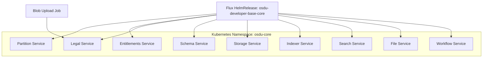

**Diagram sources**
- [base.yaml:1-72](file://software/applications/osdu-core/base.yaml#L1-L72)
- [kustomization.yaml:1-18](file://software/applications/osdu-core/kustomization.yaml#L1-L18)

**Section sources**
- [kustomization.yaml:1-18](file://software/applications/osdu-core/kustomization.yaml#L1-L18)
- [base.yaml:1-72](file://software/applications/osdu-core/base.yaml#L1-L72)

## Core Components
The core services provide foundational capabilities for partitioning, access control, legal compliance, schema management, storage, indexing, search, files, and workflows. Each service exposes REST APIs and integrates with shared infrastructure such as Redis, Cosmos DB, Azure Key Vault, and message buses.

Key responsibilities:
- Partition: Data isolation and routing by partition ID.
- Entitlements: Access control and permissions enforcement.
- Legal: Compliance tagging and policy enforcement.
- Schema: Registry and validation of data schemas.
- Storage: Record persistence and retrieval.
- Indexer: Asynchronous indexing of records into search backends.
- Search: Querying indexed data across partitions and entitlements.
- File: Binary object storage and retrieval.
- Workflow: Orchestration of ingestion and processing pipelines (Airflow).

**Section sources**
- [services_overview.md:17-31](file://docs/src/services_overview.md#L17-L31)

## Architecture Overview
The platform follows a service-oriented architecture deployed on Kubernetes with Istio enabling mTLS, traffic policies, and observability. Configuration is declarative via GitOps (Flux + Kustomize), ensuring consistent deployments and rollbacks. Services communicate over HTTP/REST through the service mesh, enforcing authentication and authorization at the gateway and within the mesh. Shared infrastructure includes Redis for caching, Cosmos DB for metadata, Azure Storage for blobs/files, and message buses (Service Bus/Event Grid) for async events.

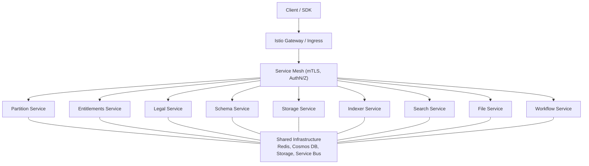

**Diagram sources**
- [design_architecture.md:111-169](file://docs/src/design_architecture.md#L111-L169)
- [base.yaml:1-72](file://software/applications/osdu-core/base.yaml#L1-L72)

## Detailed Component Analysis

### Partition Service
- Purpose: Manages data partitions to isolate and route requests efficiently.
- Dependencies: Redis for caching; optional Istio auth toggle.
- Configuration highlights: Application name, port, logging level, Azure AD settings, and Key Vault integration.

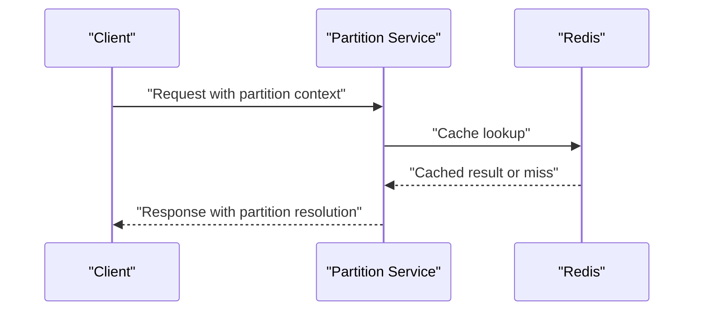

**Diagram sources**
- [services_core_partition.md:14-28](file://docs/src/services_core_partition.md#L14-L28)

**Section sources**
- [services_core_partition.md:1-51](file://docs/src/services_core_partition.md#L1-L51)

### Entitlements Service
- Purpose: Provides access control and permissions management for data within OSDU.
- Dependencies: Partition service endpoint; Redis TTL for caching; Azure AD session stateless mode.
- Configuration highlights: Domain name, root data group quota, and Istio auth enabled.

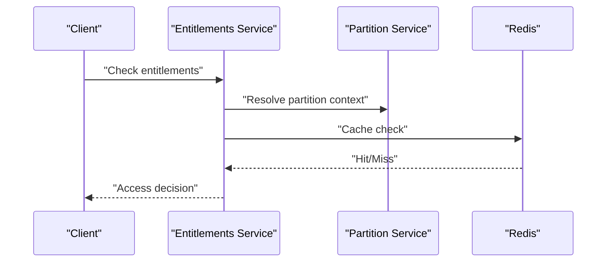

**Diagram sources**
- [services_core_entitlements.md:14-27](file://docs/src/services_core_entitlements.md#L14-L27)

**Section sources**
- [services_core_entitlements.md:1-42](file://docs/src/services_core_entitlements.md#L1-L42)

### Legal Service
- Purpose: Ensures data compliance and legal requirements are met, including privacy and governance.
- Dependencies: Partition and Entitlements endpoints; Redis; Service Bus topic for legal tags; Cosmos DB.
- Configuration highlights: Region, topics, and pod identity toggles.

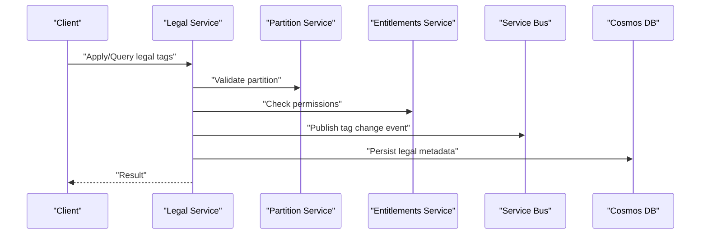

**Diagram sources**
- [services_core_legal.md:14-36](file://docs/src/services_core_legal.md#L14-L36)

**Section sources**
- [services_core_legal.md:1-50](file://docs/src/services_core_legal.md#L1-L50)

### Schema Service
- Purpose: Manages and provides access to data schemas defining structure and format.
- Dependencies: Partition and Entitlements endpoints; Azure Storage; Event Grid/Service Bus for schema change events; Cosmos DB.
- Configuration highlights: HTTPS for storage, topics, and pod identity toggles.

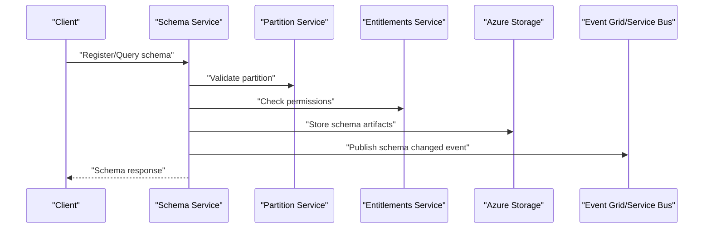

**Diagram sources**
- [services_core_schema.md:14-39](file://docs/src/services_core_schema.md#L14-L39)

**Section sources**
- [services_core_schema.md:1-40](file://docs/src/services_core_schema.md#L1-L40)

### Storage Service
- Purpose: Provides scalable storage solutions for managing and retrieving large volumes of data.
- Dependencies: Partition, Entitlements, and Legal endpoints; Redis; Service Bus topics; Cosmos DB.
- Configuration highlights: Topics for record events, legal topics/subscriptions, OPA toggle.

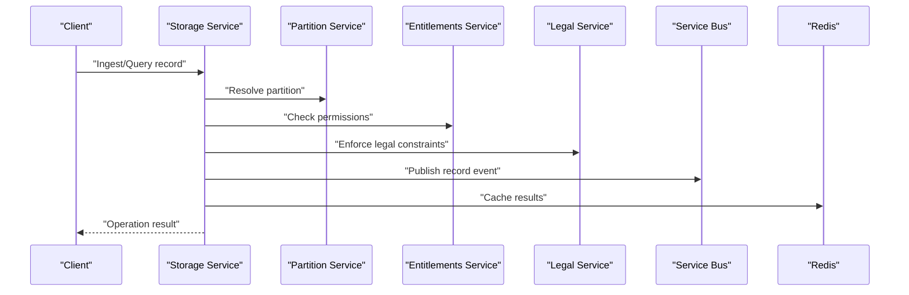

**Diagram sources**
- [services_core_storage.md:14-38](file://docs/src/services_core_storage.md#L14-L38)

**Section sources**
- [services_core_storage.md:1-40](file://docs/src/services_core_storage.md#L1-L40)

### Indexer Service
- Purpose: Indexes and categorizes data to enable efficient search and retrieval.
- Dependencies: Partition, Entitlements, Schema, and Storage endpoints; uses Storage query endpoints for batch operations.
- Configuration highlights: Endpoints for schema and storage, pod identity toggles.

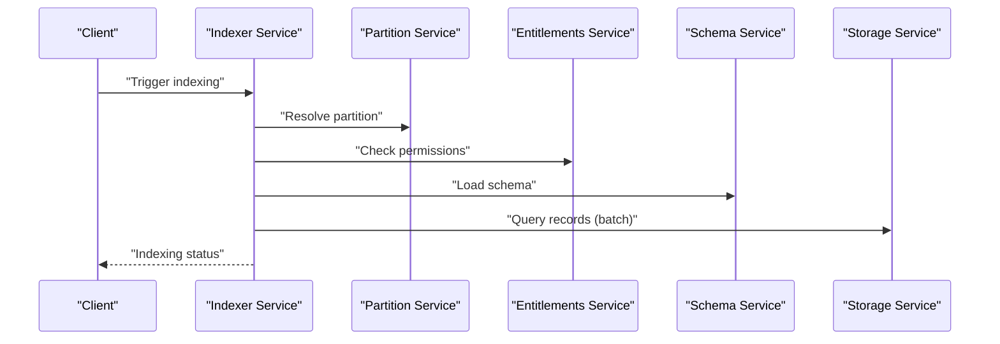

**Diagram sources**
- [services_core_indexer.md:14-30](file://docs/src/services_core_indexer.md#L14-L30)

**Section sources**
- [services_core_indexer.md:1-31](file://docs/src/services_core_indexer.md#L1-L31)

### Search Service
- Purpose: Facilitates searching and querying across stored data.
- Dependencies: Partition, Entitlements, and Policy endpoints; Redis cache; Cosmos DB; Elastic cache expiration settings.
- Configuration highlights: Logging level, policy service toggle, cache parameters.

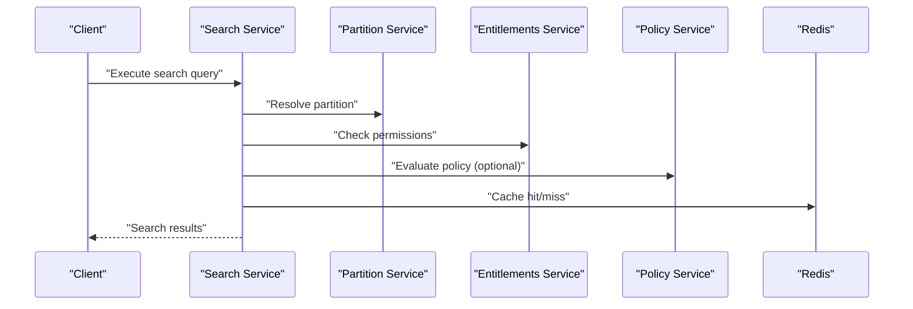

**Diagram sources**
- [services_core_search.md:14-37](file://docs/src/services_core_search.md#L14-L37)

**Section sources**
- [services_core_search.md:1-38](file://docs/src/services_core_search.md#L1-L38)

### File Service
- Purpose: Handles file operations such as storage, retrieval, and management.
- Dependencies: Partition and Entitlements endpoints; Azure Storage; pod identity toggles.
- Configuration highlights: Logging prefix, Istio auth enabled.

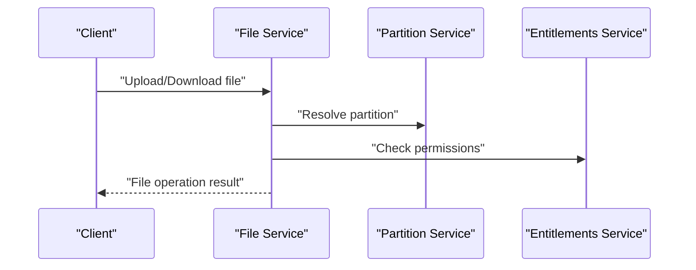

**Diagram sources**
- [services_core_file.md:14-26](file://docs/src/services_core_file.md#L14-L26)

**Section sources**
- [services_core_file.md:1-27](file://docs/src/services_core_file.md#L1-L27)

### Workflow Service
- Purpose: Orchestrates business processes and interacts with Apache Airflow for DAG execution and metadata management.
- Dependencies: Partition and Entitlements endpoints; Airflow URL; Cosmos DB for system/database; storage account for DAG content.
- Configuration highlights: Airflow credentials, version 2 toggle, custom operator handling.

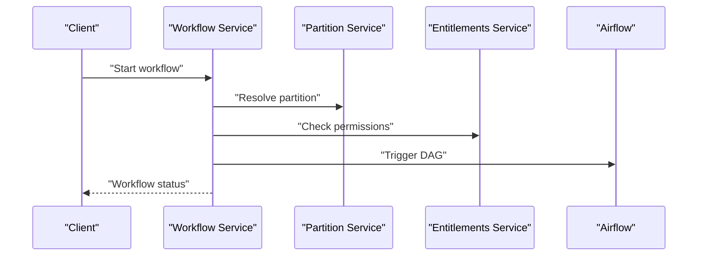

**Diagram sources**
- [services_core.md:344-383](file://docs/src/services_core.md#L344-L383)

**Section sources**
- [services_core.md:344-383](file://docs/src/services_core.md#L344-L383)

## Dependency Analysis
Inter-service dependencies follow a clear hierarchy:
- Partition and Entitlements are foundational and consumed by most services.
- Legal, Schema, Storage, Indexer, Search, File, and Workflow depend on Partition and/or Entitlements.
- Indexer depends on Schema and Storage for record queries and schema resolution.
- Search may integrate with a Policy service for additional authorization checks.
- Workflow orchestrates external systems like Airflow while leveraging Partition and Entitlements.

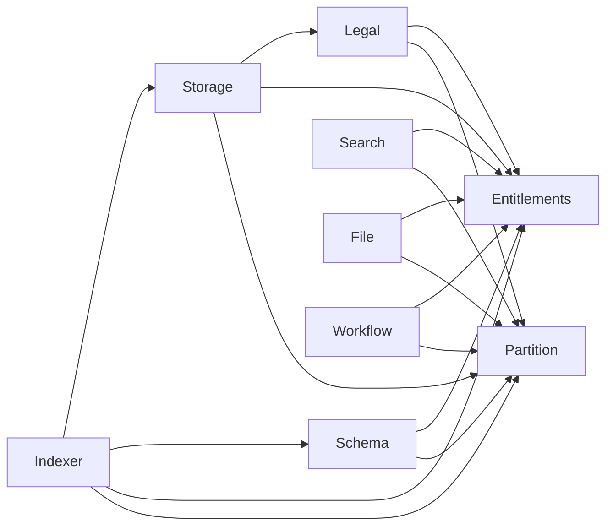

**Diagram sources**
- [services_core.md:21-383](file://docs/src/services_core.md#L21-L383)

**Section sources**
- [services_core.md:21-383](file://docs/src/services_core.md#L21-L383)

## Performance Considerations
- Caching: Use Redis strategically for frequently accessed metadata and query results to reduce latency and backend load. Tune TTLs per service (e.g., Entitlements, Search).
- Async Processing: Offload heavy tasks (indexing, legal tag propagation, schema change notifications) to message buses (Service Bus/Event Grid) to improve throughput.
- Scaling: Configure Horizontal Pod Autoscaler (HPA) and Vertical Pod Autoscaler (VPA) based on CPU/memory metrics and request rates. Ensure resource requests/limits are set appropriately in base HelmRelease values.
- Network: Leverage Istio for mTLS and traffic shaping; monitor sidecar overhead and adjust mesh policies for optimal performance.
- Storage: Enable HTTPS for Azure Storage and optimize connection pooling; use batch endpoints where available (e.g., Storage query:records:batch).
- Observability: Instrument services with Application Insights and expose metrics/logs for Prometheus/Grafana; trace requests across services with distributed tracing.

[No sources needed since this section provides general guidance]

## Troubleshooting Guide
Common issues and resolutions:
- Authentication failures: Verify Azure AD client IDs, app ID URIs, and Istio auth toggles. Ensure stateless sessions are enabled when required.
- Endpoint misconfiguration: Confirm PARTITION_SERVICE_ENDPOINT, ENTITLEMENTS_SERVICE_ENDPOINT, and other service URLs match the deployed environment.
- Message bus connectivity: Validate Service Bus topic names and subscriptions; ensure pod identity settings are correct for accessing Azure resources.
- Cache inconsistencies: Adjust Redis database numbers and TTLs; verify cache keys and invalidation strategies.
- Deployment drift: Use Flux reconciliation intervals and remediation retries to auto-heal; inspect HelmRelease statuses and Kustomize diffs.

**Section sources**
- [services_core.md:21-383](file://docs/src/services_core.md#L21-L383)
- [base.yaml:1-72](file://software/applications/osdu-core/base.yaml#L1-L72)

## Conclusion
The OSDU core services form a robust, extensible data platform built on a service-oriented architecture with strong security and compliance foundations. Through GitOps-driven deployments, Istio-based service mesh, and shared infrastructure, the platform supports scalable partitioning, entitlements, legal compliance, schema management, storage, indexing, search, files, and workflows. Proper configuration, caching, async processing, and observability are key to achieving high performance and reliability.

[No sources needed since this section summarizes without analyzing specific files]

## Appendices

### Deployment Configurations
- Base HelmRelease sets default resource requests/limits and enables request authentication and Azure integrations.
- Blob upload job initializes legal metadata during deployment.
- Kustomization aggregates all core service manifests into a single deployable unit.

**Section sources**
- [base.yaml:1-72](file://software/applications/osdu-core/base.yaml#L1-L72)
- [kustomization.yaml:1-18](file://software/applications/osdu-core/kustomization.yaml#L1-L18)

### Monitoring Approaches
- Application Insights: Enabled via APPINSIGHTS_KEY for telemetry and diagnostics.
- Logs and Metrics: Configure logging levels per service; integrate with Prometheus/Grafana for dashboards.
- Tracing: Use distributed tracing across services to diagnose latency and errors.

**Section sources**
- [services_core.md:21-383](file://docs/src/services_core.md#L21-L383)