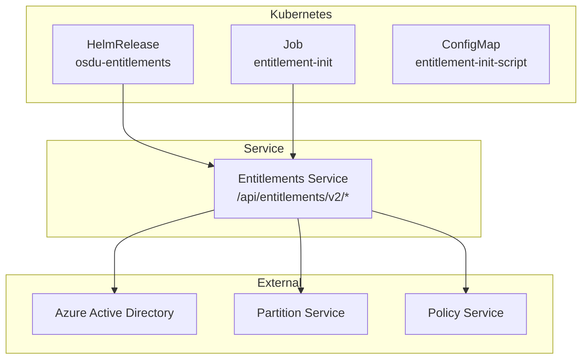
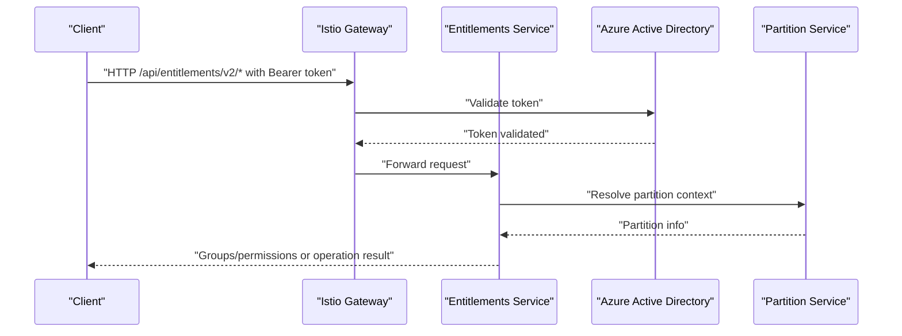
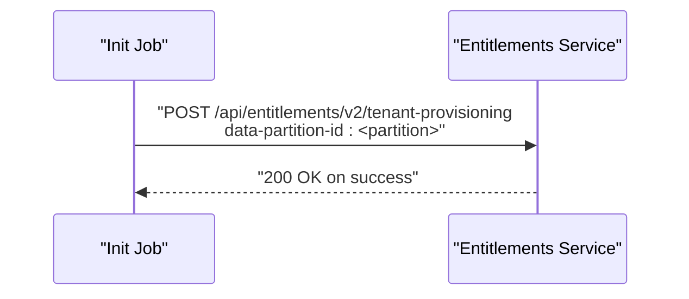
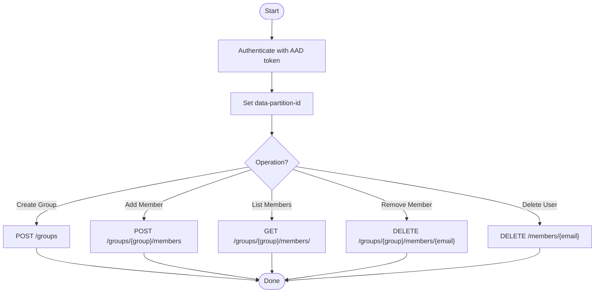
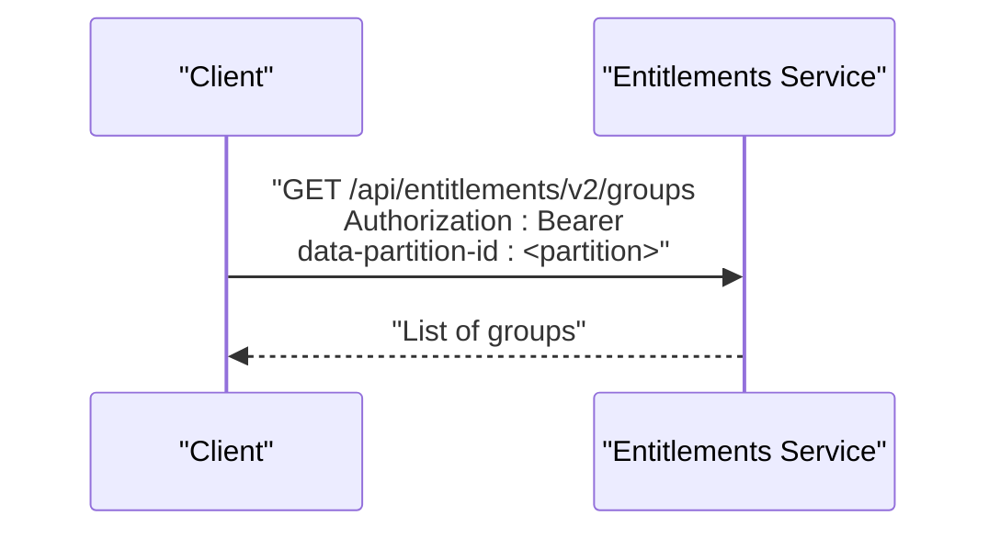
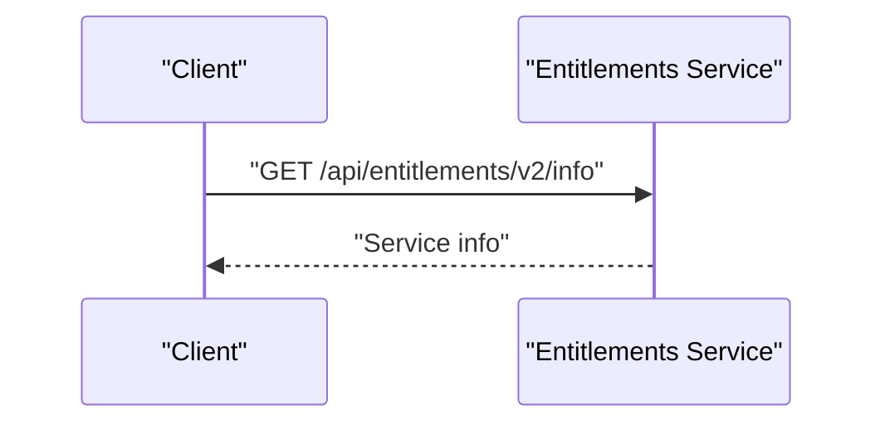
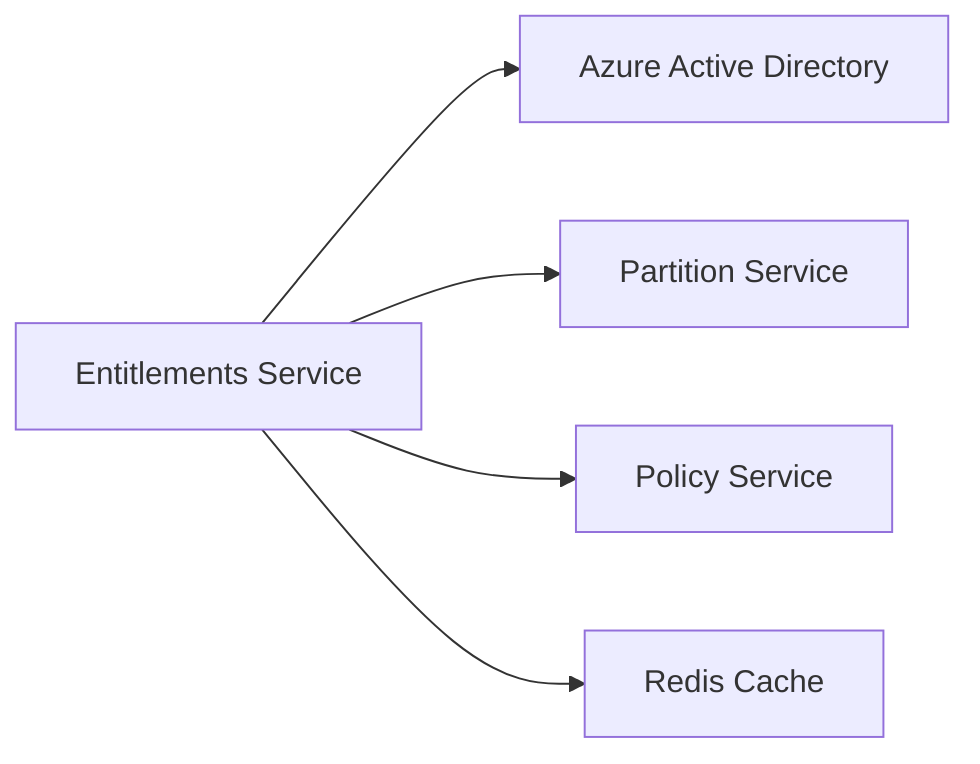

# Entitlements Service

<cite>
**Referenced Files in This Document**
- [services_core_entitlements.md](file://docs/src/services_core_entitlements.md)
- [entitlement.http](file://tools/rest-scripts/entitlement.http)
- [admin.http](file://tools/rest-scripts/admin.http)
- [local.http](file://tools/rest-scripts/local.http)
- [entitlement-init.yaml](file://charts/osdu-developer-init/templates/entitlement-init.yaml)
- [user-init.yaml](file://charts/osdu-developer-init/templates/user-init.yaml)
- [entitlements.yaml](file://software/applications/osdu-core/entitlements.yaml)
- [template.yaml](file://scripts/template.yaml)
</cite>

## Table of Contents
1. [Introduction](#introduction)
2. [Project Structure](#project-structure)
3. [Core Components](#core-components)
4. [Architecture Overview](#architecture-overview)
5. [Detailed Component Analysis](#detailed-component-analysis)
6. [Dependency Analysis](#dependency-analysis)
7. [Performance Considerations](#performance-considerations)
8. [Troubleshooting Guide](#troubleshooting-guide)
9. [Conclusion](#conclusion)
10. [Appendices](#appendices)

## Introduction
This document explains the OSDU Entitlements Service as it is configured and used within this repository. It focuses on how fine-grained access control and permission management are exposed via REST APIs, how roles and groups are managed, how Azure Active Directory (AAD) integration is enabled, and how caching and performance tuning are configured through environment variables and deployment manifests.

The entitlement service is deployed under a dedicated Helm release with Istio-based authentication and integrates with other core services such as Partition and Policy. The repository provides sample HTTP requests to exercise key endpoints for group and member management, tenant provisioning, and querying permissions.

## Project Structure
The entitlements-related artifacts in this repository include:
- Documentation describing local run configuration and environment variables for the entitlements service
- Sample HTTP request files demonstrating API usage
- Kubernetes/Helm manifests that deploy the entitlements service and initialization jobs
- Configuration templates that wire up AAD, Istio, Redis TTL, and partition endpoints

**Diagram sources**
- [entitlements.yaml:34-116](file://software/applications/osdu-core/entitlements.yaml#L34-L116)
- [entitlement-init.yaml:1-95](file://charts/osdu-developer-init/templates/entitlement-init.yaml#L1-L95)

**Section sources**
- [entitlements.yaml:34-116](file://software/applications/osdu-core/entitlements.yaml#L34-L116)
- [entitlement-init.yaml:1-95](file://charts/osdu-developer-init/templates/entitlement-init.yaml#L1-L95)

## Core Components
- Entitlements Service runtime: Deployed as a Helm release with Istio auth enabled, exposing /api/entitlements/v2 endpoints. Health checks are configured at /actuator/health.
- Initialization Job: Provisions tenant-level entitlements by calling the tenant-provisioning endpoint using Workload Identity or federated tokens.
- User Management: Adds users to groups with roles (e.g., MEMBER) via POST to group members endpoints.
- Permission Querying: GET /groups returns groups associated with the authenticated user/token context.
- Integration Points:
  - Azure Active Directory: Enabled via environment flags and client ID; supports stateless sessions.
  - Partition Service: Endpoint configured to scope entitlements per partition.
  - Policy Service: Referenced by other services; entitlements may be evaluated alongside policy decisions.

Key environment variables observed across configurations:
- AAD_CLIENT_ID, AZURE_ISTIOAUTH_ENABLED, AZURE_ACTIVEDIRECTORY_SESSION_STATELESS
- PARTITION_SERVICE_ENDPOINT
- REDIS_TTL_SECONDS (caching behavior)
- ROOT_DATA_GROUP_QUOTA (quota controls)
- SERVICE_DOMAIN_NAME (used in group identifiers)

**Section sources**
- [services_core_entitlements.md:14-27](file://docs/src/services_core_entitlements.md#L14-L27)
- [entitlements.yaml:74-116](file://software/applications/osdu-core/entitlements.yaml#L74-L116)
- [template.yaml:21-36](file://scripts/template.yaml#L21-L36)

## Architecture Overview
The entitlements service sits behind an Istio gateway with authentication enforced. Clients authenticate via AAD and present a bearer token. The service resolves the caller’s identity and groups, applies partition scoping, and enforces policies where applicable. Initialization jobs bootstrap tenant-level resources and default memberships.

**Diagram sources**
- [entitlements.yaml:63-116](file://software/applications/osdu-core/entitlements.yaml#L63-L116)
- [entitlement-init.yaml:66-81](file://charts/osdu-developer-init/templates/entitlement-init.yaml#L66-L81)

## Detailed Component Analysis

### Tenant Provisioning
Purpose: Initialize entitlements for a data partition during deployment.

Flow:
- An initialization job authenticates using Workload Identity or federated tokens.
- It calls the tenant-provisioning endpoint with the target partition header.
- On success, the partition is ready for group and member operations.

**Diagram sources**
- [entitlement-init.yaml:66-81](file://charts/osdu-developer-init/templates/entitlement-init.yaml#L66-L81)

**Section sources**
- [entitlement-init.yaml:66-81](file://charts/osdu-developer-init/templates/entitlement-init.yaml#L66-L81)

### Group and Member Management
Purpose: Create groups, add/remove members, and list members with roles.

Endpoints demonstrated in repository samples:
- Create group: POST /api/entitlements/v2/groups
- Add member to group: POST /api/entitlements/v2/groups/{group}@{domain}/members
- List members: GET /api/entitlements/v2/groups/{group}/members/
- Remove member: DELETE /api/entitlements/v2/groups/{group}/members/{email}
- Delete user: DELETE /api/entitlements/v2/members/{email}

Authentication:
- All requests require Authorization: Bearer <token>.
- Requests must include data-partition-id header for scoping.

Example flows:
- Adding a user to a group with role MEMBER
- Listing members in predefined roles (e.g., viewers, editors, admins, ops)

**Diagram sources**
- [admin.http:84-137](file://tools/rest-scripts/admin.http#L84-L137)
- [admin.http:144-356](file://tools/rest-scripts/admin.http#L144-L356)
- [user-init.yaml:74-82](file://charts/osdu-developer-init/templates/user-init.yaml#L74-L82)

**Section sources**
- [admin.http:84-137](file://tools/rest-scripts/admin.http#L84-L137)
- [admin.http:144-356](file://tools/rest-scripts/admin.http#L144-L356)
- [user-init.yaml:74-82](file://charts/osdu-developer-init/templates/user-init.yaml#L74-L82)

### Permission Querying
Purpose: Retrieve groups associated with the current token to determine permissions.

Endpoint:
- GET /api/entitlements/v2/groups

Headers:
- Authorization: Bearer <token>
- data-partition-id: <partition>

Notes:
- In local testing scenarios, x-user-id can be used to simulate a user context.

**Diagram sources**
- [entitlement.http:54-60](file://tools/rest-scripts/entitlement.http#L54-L60)
- [local.http:237-244](file://tools/rest-scripts/local.http#L237-L244)

**Section sources**
- [entitlement.http:54-60](file://tools/rest-scripts/entitlement.http#L54-L60)
- [local.http:237-244](file://tools/rest-scripts/local.http#L237-L244)

### Version and Info Endpoints
Purpose: Expose service metadata and health.

Endpoints:
- GET /api/entitlements/v2/info

Configuration:
- Health probe path configured at /actuator/health
- Swagger/API docs paths excluded from auth enforcement

**Diagram sources**
- [entitlement.http:44-48](file://tools/rest-scripts/entitlement.http#L44-L48)
- [entitlements.yaml:56-73](file://software/applications/osdu-core/entitlements.yaml#L56-L73)

**Section sources**
- [entitlement.http:44-48](file://tools/rest-scripts/entitlement.http#L44-L48)
- [entitlements.yaml:56-73](file://software/applications/osdu-core/entitlements.yaml#L56-L73)

## Dependency Analysis
The entitlements service depends on:
- Azure Active Directory for authentication and token validation
- Partition service for partition-scoped operations
- Optional Policy service for policy evaluation in downstream consumers
- Redis for caching (TTL configurable)

**Diagram sources**
- [entitlements.yaml:74-116](file://software/applications/osdu-core/entitlements.yaml#L74-L116)
- [template.yaml:21-36](file://scripts/template.yaml#L21-L36)

**Section sources**
- [entitlements.yaml:74-116](file://software/applications/osdu-core/entitlements.yaml#L74-L116)
- [template.yaml:21-36](file://scripts/template.yaml#L21-L36)

## Performance Considerations
- Caching:
  - REDIS_TTL_SECONDS controls cache expiration for entitlement lookups. Lower values increase freshness but raise load; higher values reduce latency at the cost of staleness.
- Quotas:
  - ROOT_DATA_GROUP_QUOTA sets limits on root data group sizes to prevent unbounded growth.
- Authentication overhead:
  - AZURE_ISTIOAUTH_ENABLED enables gateway-level token validation, reducing per-request auth costs.
  - AZURE_ACTIVEDIRECTORY_SESSION_STATELESS reduces session state dependencies.
- Partition scoping:
  - Ensure data-partition-id is always provided to avoid cross-partition queries and improve cache locality.

[No sources needed since this section provides general guidance]

## Troubleshooting Guide
Common issues and checks:
- Authentication failures:
  - Verify Authorization header contains a valid bearer token issued by AAD.
  - Confirm AZURE_ISTIOAUTH_ENABLED is set appropriately for your environment.
- Partition errors:
  - Ensure data-partition-id matches a valid partition and that tenant provisioning has completed successfully.
- Initialization failures:
  - Check the entitlement-init job logs for HTTP status codes and response bodies when calling tenant-provisioning.
- Health and readiness:
  - Use /actuator/health to verify service liveness.
  - Confirm swagger/api-docs paths are accessible if debugging locally.

Operational references:
- Tenant provisioning call and error handling in init job
- Health probe configuration
- Sample requests for troubleshooting flows

**Section sources**
- [entitlement-init.yaml:66-92](file://charts/osdu-developer-init/templates/entitlement-init.yaml#L66-L92)
- [entitlements.yaml:56-73](file://software/applications/osdu-core/entitlements.yaml#L56-L73)
- [entitlement.http:44-60](file://tools/rest-scripts/entitlement.http#L44-L60)

## Conclusion
The entitlements service in this repository provides a robust foundation for fine-grained access control through group and member management, partition-scoped operations, and AAD-backed authentication. Deployment is orchestrated via Helm releases with Istio enforcing security boundaries, while initialization jobs ensure tenants are provisioned correctly. Caching and quotas are tunable via environment variables to balance performance and consistency. Consumers integrate with the service to enforce RBAC and policy decisions consistently across the platform.

[No sources needed since this section summarizes without analyzing specific files]

## Appendices

### API Reference Summary
- GET /api/entitlements/v2/info
  - Purpose: Service information
  - Auth: Bearer token (info path excluded from auth in config)
- GET /api/entitlements/v2/groups
  - Purpose: Get groups for the authenticated user/token
  - Headers: Authorization, data-partition-id
- POST /api/entitlements/v2/groups
  - Purpose: Create a new group
  - Headers: Authorization, data-partition-id, Content-Type: application/json
- POST /api/entitlements/v2/groups/{group}@{domain}/members
  - Purpose: Add a member to a group with a role (e.g., MEMBER)
  - Headers: Authorization, data-partition-id, Content-Type: application/json
- GET /api/entitlements/v2/groups/{group}/members/
  - Purpose: List members of a group
  - Headers: Authorization, data-partition-id
- DELETE /api/entitlements/v2/groups/{group}/members/{email}
  - Purpose: Remove a member from a group
  - Headers: Authorization, data-partition-id
- DELETE /api/entitlements/v2/members/{email}
  - Purpose: Delete a user
  - Headers: Authorization, data-partition-id
- POST /api/entitlements/v2/tenant-provisioning
  - Purpose: Initialize entitlements for a partition
  - Headers: Authorization, data-partition-id

**Section sources**
- [entitlement.http:44-60](file://tools/rest-scripts/entitlement.http#L44-L60)
- [admin.http:84-137](file://tools/rest-scripts/admin.http#L84-L137)
- [admin.http:144-356](file://tools/rest-scripts/admin.http#L144-L356)
- [entitlement-init.yaml:75-81](file://charts/osdu-developer-init/templates/entitlement-init.yaml#L75-L81)