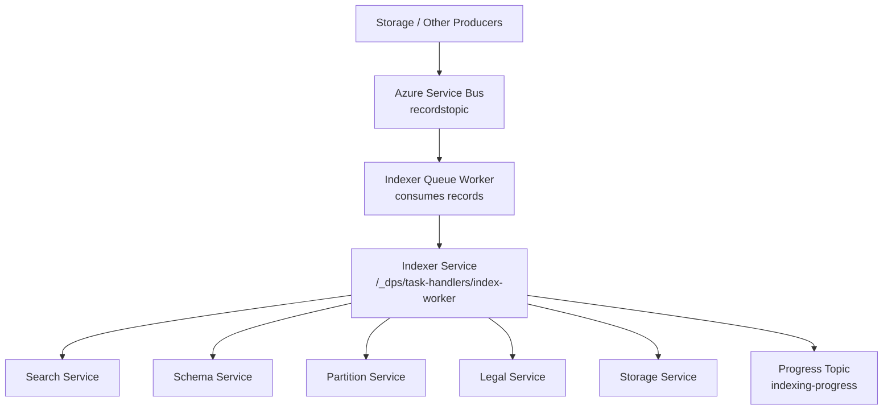
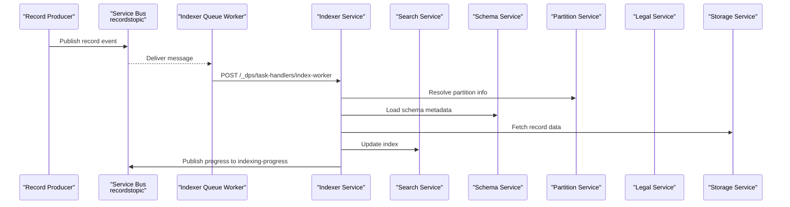
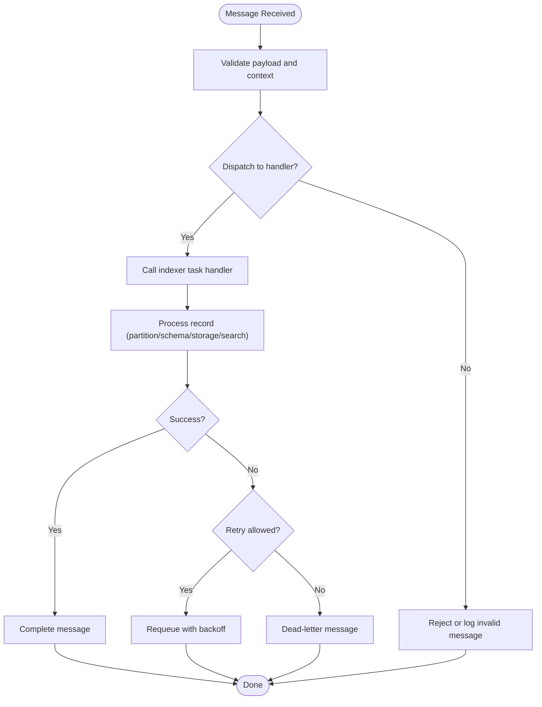
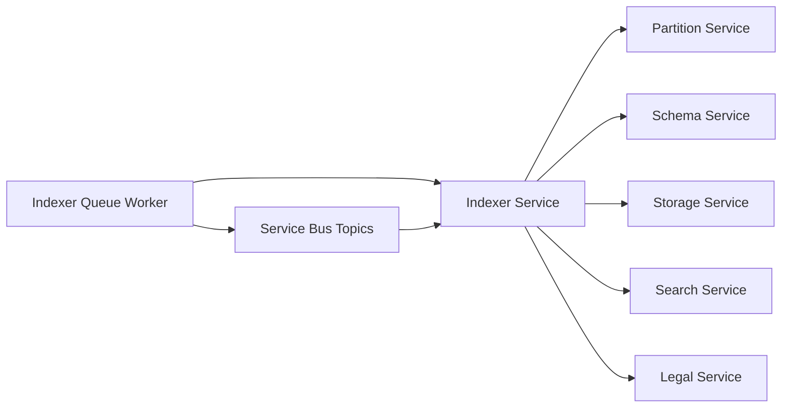

# Indexer Service

<cite>
**Referenced Files in This Document**
- [indexer.yaml](file://software/applications/osdu-core/indexer.yaml)
- [services_core_indexer.md](file://docs/src/services_core_indexer.md)
- [template.yaml](file://scripts/template.yaml)
- [blade_partition.bicep](file://bicep/modules/blade_partition.bicep)
- [docker-bake.hcl](file://src/docker-bake.hcl)
- [scaledobject.yaml](file://charts/osdu-developer-service/templates/scaledobject.yaml)
- [README.md](file://software/applications/osdu-core/README.md)
</cite>

## Table of Contents
1. [Introduction](#introduction)
2. [Project Structure](#project-structure)
3. [Core Components](#core-components)
4. [Architecture Overview](#architecture-overview)
5. [Detailed Component Analysis](#detailed-component-analysis)
6. [Dependency Analysis](#dependency-analysis)
7. [Performance Considerations](#performance-considerations)
8. [Troubleshooting Guide](#troubleshooting-guide)
9. [Conclusion](#conclusion)
10. [Appendices](#appendices)

## Introduction
This document explains the OSDU Indexer Service as deployed and configured in this repository. It covers the asynchronous processing pipeline, queue management with Azure Service Bus, error handling and retry behavior, scaling via Kubernetes Event-driven Autoscaling (KEDA), configuration options for batch processing and monitoring, and integration points with Partition, Storage, Schema, Search, and Legal services. It also provides guidance on custom processors, error recovery strategies, and performance optimization techniques based on the available deployment manifests and configuration.

## Project Structure
The indexer is composed of two primary components:
- Indexer service: exposes REST endpoints under /api/indexer/v2/ and performs indexing tasks.
- Indexer queue worker: consumes messages from Azure Service Bus topics and dispatches work to the indexer service.

**Diagram sources**
- [indexer.yaml:100-129](file://software/applications/osdu-core/indexer.yaml#L100-L129)
- [indexer.yaml:203-228](file://software/applications/osdu-core/indexer.yaml#L203-L228)
- [blade_partition.bicep:280-321](file://bicep/modules/blade_partition.bicep#L280-L321)

**Section sources**
- [indexer.yaml:1-130](file://software/applications/osdu-core/indexer.yaml#L1-L130)
- [indexer.yaml:131-228](file://software/applications/osdu-core/indexer.yaml#L131-L228)
- [README.md:1-33](file://software/applications/osdu-core/README.md#L1-L33)

## Core Components
- Indexer Service
  - Exposes internal task handlers under /api/indexer/v2/_dps/task-handlers/.
  - Integrates with Partition, Entitlements, Schema, Storage, and Search services.
  - Emits progress events to a Service Bus topic.
- Indexer Queue Worker
  - Subscribes to Service Bus topics for record updates, reindexing, and schema changes.
  - Calls the Indexer Service’s task handlers to process work items.
  - Configurable concurrency and delivery limits for reliability.

Key environment variables and endpoints are defined in the HelmRelease manifests and templates.

**Section sources**
- [indexer.yaml:38-129](file://software/applications/osdu-core/indexer.yaml#L38-L129)
- [indexer.yaml:167-228](file://software/applications/osdu-core/indexer.yaml#L167-L228)
- [template.yaml:153-175](file://scripts/template.yaml#L153-L175)

## Architecture Overview
The indexer uses an event-driven architecture:
- Producers publish record change events to Azure Service Bus topics.
- The indexer queue worker consumes these events and invokes the indexer service’s task handlers.
- The indexer service coordinates with downstream services to update search indexes and emits progress notifications.

**Diagram sources**
- [indexer.yaml:100-129](file://software/applications/osdu-core/indexer.yaml#L100-L129)
- [indexer.yaml:203-228](file://software/applications/osdu-core/indexer.yaml#L203-L228)
- [blade_partition.bicep:280-321](file://bicep/modules/blade_partition.bicep#L280-L321)

## Detailed Component Analysis

### Indexer Service
- Purpose: Process indexing tasks triggered by queue workers or other systems.
- Endpoints: Internal task handlers under /api/indexer/v2/_dps/task-handlers/, including index-worker and schema-worker.
- Integrations:
  - Partition service for partition resolution.
  - Schema service for schema information.
  - Storage service for record retrieval and conversion queries.
  - Search service for index updates.
  - Legal service for legal tagging and compliance.
- Observability: Health probes at /actuator/health; Application Insights instrumentation enabled.

Configuration highlights:
- Context path: /api/indexer/v2/
- Topics: indexing-progress for progress events
- Service URLs: partition, entitlements, schema, storage, search

**Section sources**
- [indexer.yaml:38-129](file://software/applications/osdu-core/indexer.yaml#L38-L129)
- [services_core_indexer.md:1-31](file://docs/src/services_core_indexer.md#L1-L31)

### Indexer Queue Worker
- Purpose: Consume Service Bus messages and dispatch them to the indexer service.
- Topics subscribed:
  - recordstopic (with subscription recordstopicsubscription)
  - reindextopic (with subscription reindextopicsubscription)
  - schemachangedtopic (with subscription schemachangedtopiceg)
- Concurrency and retries:
  - MAX_CONCURRENT_CALLS controls parallelism.
  - EXECUTOR_N_THREADS sets thread pool size.
  - MAX_DELIVERY_COUNT defines retry attempts before dead-lettering.
  - MAX_LOCK_RENEW_DURATION_SECONDS extends lock duration for long-running tasks.
- Worker endpoints:
  - INDEXER_WORKER_URL calls index-worker handler.
  - schema_worker_url calls schema-worker handler.

Scaling:
- KEDA ScaledObject triggers scale-out based on Azure Service Bus subscription backlog.

**Section sources**
- [indexer.yaml:167-228](file://software/applications/osdu-core/indexer.yaml#L167-L228)
- [template.yaml:153-175](file://scripts/template.yaml#L153-L175)
- [scaledobject.yaml:1-24](file://charts/osdu-developer-service/templates/scaledobject.yaml#L1-L24)

### Processing Pipeline and Error Handling
- Message consumption:
  - Messages delivered from Service Bus subscriptions with configurable maxDeliveryCount and lockDuration.
- Retry and dead-lettering:
  - Max delivery count enforced by Service Bus; after exceeding retries, messages may be moved to dead-letter queues depending on topic/subscription settings.
- Lock management:
  - Lock renewal duration extended to support longer processing windows.
- Progress reporting:
  - Progress events published to indexing-progress topic for observability.

**Diagram sources**
- [blade_partition.bicep:280-321](file://bicep/modules/blade_partition.bicep#L280-L321)
- [indexer.yaml:203-228](file://software/applications/osdu-core/indexer.yaml#L203-L228)

**Section sources**
- [blade_partition.bicep:280-321](file://bicep/modules/blade_partition.bicep#L280-L321)
- [indexer.yaml:203-228](file://software/applications/osdu-core/indexer.yaml#L203-L228)

### Configuration Options
- Scaling
  - Replica count per deployment (default 1).
  - KEDA autoscaling based on Service Bus subscription backlog.
- Batch processing
  - Executor threads and concurrent call limits control throughput.
  - Lock renewal duration supports longer batches.
- Monitoring
  - Health probe endpoint for liveness/readiness.
  - Application Insights instrumentation keys configured.
- Integration endpoints
  - Partition, Schema, Storage, Search, and Legal service URLs.
  - Service Bus topics and subscriptions for input/output.

**Section sources**
- [indexer.yaml:38-129](file://software/applications/osdu-core/indexer.yaml#L38-L129)
- [indexer.yaml:167-228](file://software/applications/osdu-core/indexer.yaml#L167-L228)
- [template.yaml:153-175](file://scripts/template.yaml#L153-L175)
- [scaledobject.yaml:1-24](file://charts/osdu-developer-service/templates/scaledobject.yaml#L1-L24)

### Custom Processors and Extensibility
- Task handlers:
  - index-worker and schema-worker endpoints accept tasks from the queue worker.
- Extensibility approach:
  - Add new handlers under the same task-handlers namespace to process specialized workflows.
  - Use existing integrations (Partition, Schema, Storage, Search, Legal) within handlers to perform domain-specific indexing logic.
- Example usage pattern:
  - Queue worker publishes a task to the indexer service’s handler.
  - Handler validates inputs, fetches necessary metadata/data, updates search indexes, and reports progress.

**Section sources**
- [indexer.yaml:100-129](file://software/applications/osdu-core/indexer.yaml#L100-L129)
- [indexer.yaml:203-228](file://software/applications/osdu-core/indexer.yaml#L203-L228)

### Performance Optimization Techniques
- Increase concurrency:
  - Adjust MAX_CONCURRENT_CALLS and EXECUTOR_N_THREADS to match workload and resource capacity.
- Tune retries and locks:
  - Set MAX_DELIVERY_COUNT appropriately to balance retries vs. dead-lettering.
  - Extend MAX_LOCK_RENEW_DURATION_SECONDS for long-running tasks to avoid premature timeouts.
- Scale out:
  - Enable KEDA autoscaling to dynamically add replicas based on queue depth.
- Optimize downstream calls:
  - Ensure efficient batching when querying Storage and Search services.
  - Cache frequently accessed metadata where appropriate.

**Section sources**
- [indexer.yaml:203-228](file://software/applications/osdu-core/indexer.yaml#L203-L228)
- [scaledobject.yaml:1-24](file://charts/osdu-developer-service/templates/scaledobject.yaml#L1-L24)

## Dependency Analysis
The indexer depends on several core services and infrastructure components:

**Diagram sources**
- [indexer.yaml:100-129](file://software/applications/osdu-core/indexer.yaml#L100-L129)
- [indexer.yaml:203-228](file://software/applications/osdu-core/indexer.yaml#L203-L228)
- [blade_partition.bicep:280-321](file://bicep/modules/blade_partition.bicep#L280-L321)

**Section sources**
- [indexer.yaml:100-129](file://software/applications/osdu-core/indexer.yaml#L100-L129)
- [indexer.yaml:203-228](file://software/applications/osdu-core/indexer.yaml#L203-L228)
- [blade_partition.bicep:280-321](file://bicep/modules/blade_partition.bicep#L280-L321)

## Performance Considerations
- Throughput tuning:
  - Align executor threads and concurrent calls with CPU and memory resources.
  - Monitor downstream service latency and adjust accordingly.
- Backpressure:
  - Use KEDA to scale workers based on queue depth to prevent overload.
- Reliability:
  - Configure max delivery count and lock durations to handle transient failures gracefully.
- Observability:
  - Leverage health probes and Application Insights metrics for proactive monitoring.

[No sources needed since this section provides general guidance]

## Troubleshooting Guide
Common issues and resolutions:
- Messages not being processed:
  - Verify Service Bus topics and subscriptions exist and are correctly named.
  - Check that the queue worker is running and has permissions to consume messages.
- Frequent retries and dead-lettering:
  - Review MAX_DELIVERY_COUNT and ensure payloads are valid.
  - Inspect logs for errors in task handlers and fix root causes.
- Long-running tasks timing out:
  - Increase MAX_LOCK_RENEW_DURATION_SECONDS to extend processing windows.
- Scaling not triggering:
  - Confirm KEDA ScaledObject is configured with correct subscription/topic names and connection settings.

**Section sources**
- [indexer.yaml:203-228](file://software/applications/osdu-core/indexer.yaml#L203-L228)
- [blade_partition.bicep:280-321](file://bicep/modules/blade_partition.bicep#L280-L321)
- [scaledobject.yaml:1-24](file://charts/osdu-developer-service/templates/scaledobject.yaml#L1-L24)

## Conclusion
The OSDU Indexer Service in this repository implements an asynchronous, event-driven indexing pipeline using Azure Service Bus. The indexer queue worker consumes record change events and dispatches tasks to the indexer service, which coordinates with Partition, Schema, Storage, Search, and Legal services to maintain accurate search indexes. Configuration supports scaling via KEDA, robust retry and dead-letter handling, and comprehensive observability through health probes and Application Insights. Operators can extend functionality by adding custom task handlers and optimize performance by tuning concurrency, retries, and autoscaling parameters.

[No sources needed since this section summarizes without analyzing specific files]

## Appendices

### Build Targets and Deployment Artifacts
- Docker build targets define separate images for indexer and indexer-queue, enabling independent deployment and scaling.

**Section sources**
- [docker-bake.hcl:98-118](file://src/docker-bake.hcl#L98-L118)

### Local Development Notes
- The indexer service can be run locally with Spring Boot using the specified module and main class. Environment variables mirror production configurations for consistency.

**Section sources**
- [services_core_indexer.md:1-31](file://docs/src/services_core_indexer.md#L1-L31)