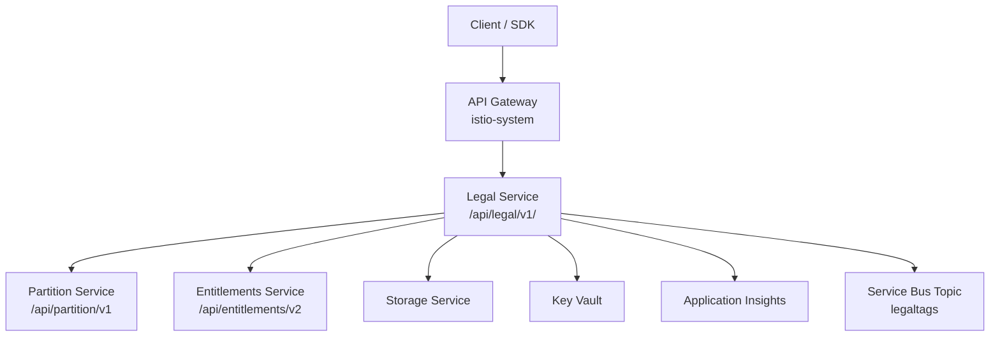
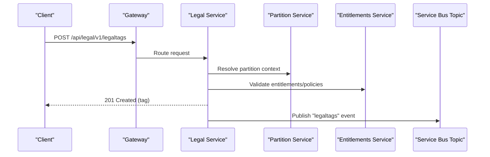
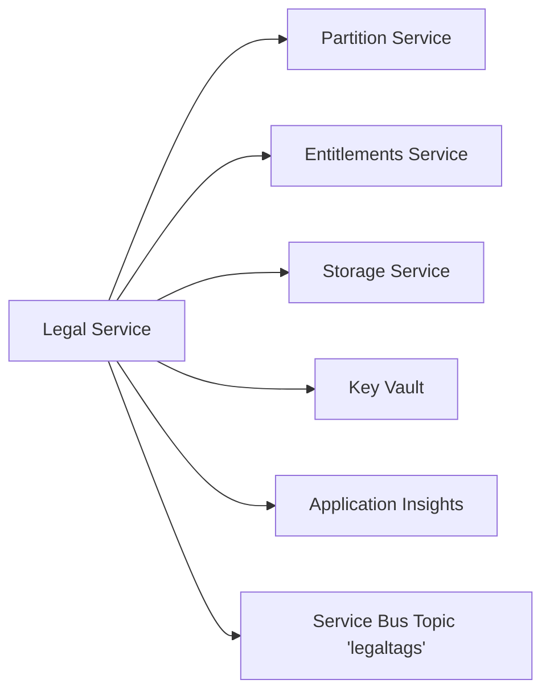

# Legal Service

<cite>
**Referenced Files in This Document**
- [services_core_legal.md](file://docs/src/services_core_legal.md)
- [legal.yaml](file://software/applications/osdu-core/legal.yaml)
- [legal.http](file://tools/rest-scripts/legal.http)
- [check-file.http](file://tools/rest-scripts/check-file.http)
- [storage.http](file://tools/rest-scripts/storage.http)
- [Legal_COO.json](file://Legal_COO.json)
</cite>

## Table of Contents
1. Introduction
2. Project Structure
3. Core Components
4. Architecture Overview
5. Detailed Component Analysis
6. Dependency Analysis
7. Performance Considerations
8. Troubleshooting Guide
9. Conclusion

## Introduction
This document explains the OSDU Legal Service as it is configured and used in this repository. It focuses on how legal tags are managed, how compliance-related metadata is attached to data records, and how the service integrates with other OSDU services for policy enforcement and auditability. The documentation covers:
- Legal tagging system and tag properties
- Compliance framework and policy enforcement via integration points
- API endpoints for managing legal tags
- Examples for setting up legal frameworks and applying tags
- Integration with external systems (partition, entitlements, storage, messaging)
- Reporting and observability considerations

## Project Structure
The Legal Service is deployed as part of the core OSDU platform using Helm/Flux manifests and exposed through an internal/external gateway. Configuration includes environment variables for Key Vault, Azure Active Directory, Application Insights, partition and entitlements endpoints, and messaging topics for legal tag change events.

**Diagram sources**
- [legal.yaml:39-73](file://software/applications/osdu-core/legal.yaml#L39-L73)
- [legal.yaml:74-124](file://software/applications/osdu-core/legal.yaml#L74-L124)

**Section sources**
- [legal.yaml:39-124](file://software/applications/osdu-core/legal.yaml#L39-L124)

## Core Components
- Legal Tags Management: Create, read, update, delete, and list legal tags; retrieve tag property definitions.
- Compliance Metadata: Tags carry attributes such as country of origin, contract identifiers, expiration dates, data type, security classification, personal data indicators, and export classification.
- Policy Enforcement Integration: Interacts with Partition and Entitlements services to enforce access and usage policies based on legal tags.
- Eventing: Publishes changes to a topic named legaltags to notify downstream consumers.
- Observability: Health checks and telemetry via Application Insights.

**Section sources**
- [legal.http:52-120](file://tools/rest-scripts/legal.http#L52-L120)
- [legal.yaml:109-124](file://software/applications/osdu-core/legal.yaml#L109-L124)

## Architecture Overview
The Legal Service exposes REST endpoints under /api/legal/v1/. Clients authenticate via OAuth and call the service through the gateway. The service persists legal tags and metadata, enforces rules by consulting Partition and Entitlements, and emits events when tags change.

**Diagram sources**
- [legal.yaml:42-73](file://software/applications/osdu-core/legal.yaml#L42-L73)
- [legal.yaml:113-124](file://software/applications/osdu-core/legal.yaml#L113-L124)
- [legal.http:67-89](file://tools/rest-scripts/legal.http#L67-L89)

## Detailed Component Analysis

### Legal Tag Model and Properties
Legal tags include descriptive fields and a properties object that captures compliance-relevant metadata. Typical properties include:
- countryOfOrigin: array of ISO codes
- contractId: identifier linking to contracts
- expirationDate: date when the tag or permission expires
- originator: entity that created the tag
- dataType: category of data (e.g., Transferred Data)
- securityClassification: sensitivity level
- personalData: indicator for personal data presence
- exportClassification: export control classification

These properties enable downstream policy engines to evaluate residency, sharing, and export constraints.

**Section sources**
- [legal.http:74-89](file://tools/rest-scripts/legal.http#L74-L89)
- [Legal_COO.json:1-20](file://Legal_COO.json#L1-L20)

### API Endpoints
The following endpoints are demonstrated in the repository’s sample scripts:

- GET /api/legal/v1/info
  - Purpose: Service info/health endpoint (exposed without auth per configuration).
  - Auth: Bearer token required except for explicitly allowed paths.

- GET /api/legal/v1/legaltags:properties
  - Purpose: Retrieve supported tag properties schema.

- GET /api/legal/v1/legaltags
  - Purpose: List all legal tags in the specified partition.

- POST /api/legal/v1/legaltags
  - Purpose: Create a new legal tag with name, description, and properties.

- GET /api/legal/v1/legaltags/{id}
  - Purpose: Get a specific legal tag by ID.

- PUT /api/legal/v1/legaltags
  - Purpose: Update an existing legal tag.

- DELETE /api/legal/v1/legaltags/{id}
  - Purpose: Delete a legal tag.

Notes:
- All requests require Authorization: Bearer <token>.
- Include data-partition-id header to scope operations to a partition.
- Some paths are exempt from authentication (e.g., /info, swagger/api-docs/webjars) as configured.

**Section sources**
- [legal.http:41-120](file://tools/rest-scripts/legal.http#L41-L120)
- [legal.yaml:63-73](file://software/applications/osdu-core/legal.yaml#L63-L73)

### Applying Tags to Data Records
While tag creation and management are handled by the Legal Service, attaching tags to data records typically involves the Storage Service. A common workflow:
1. Create or obtain a legal tag via the Legal Service.
2. Create or update a record in the Storage Service, associating the relevant legal tag(s).
3. Downstream services (Search, Indexer, Workflow) use these tags for policy evaluation and access control.

Example references:
- Creating a tag: see POST /api/legal/v1/legaltags.
- Creating a record: see PUT /records in the Storage script.

**Section sources**
- [legal.http:67-89](file://tools/rest-scripts/legal.http#L67-L89)
- [storage.http:65-107](file://tools/rest-scripts/storage.http#L65-L107)

### Compliance Framework and Policy Enforcement
- Partition Context: The service resolves the active partition to scope legal tags and policies.
- Entitlements Integration: The service calls the Entitlements endpoint to validate permissions and apply policy decisions based on tag properties.
- Residency and Export Controls: Country-specific residency risk and exemptions can be derived from reference data (e.g., Legal_COO.json), enabling residency checks and export controls.

Operational notes:
- Ensure PARTITION_SERVICE_ENDPOINT and ENTITLEMENTS_SERVICE_ENDPOINT are correctly configured.
- Use tag properties like countryOfOrigin, exportClassification, and personalData to drive policy decisions.

**Section sources**
- [legal.yaml:119-124](file://software/applications/osdu-core/legal.yaml#L119-L124)
- [Legal_COO.json:1-20](file://Legal_COO.json#L1-L20)

### Audit Capabilities and Eventing
- Change Events: On tag changes, the service publishes events to a Service Bus topic named legaltags. Consumers can subscribe to these events to maintain audit logs, trigger workflows, or update downstream systems.
- Telemetry: Application Insights is enabled for logging and metrics collection.

**Section sources**
- [legal.yaml:113-118](file://software/applications/osdu-core/legal.yaml#L113-L118)
- [legal.yaml:83-90](file://software/applications/osdu-core/legal.yaml#L83-L90)

### External Integrations
- Partition Service: Used to resolve partition-scoped contexts for legal tags and policies.
- Entitlements Service: Used to enforce access and usage policies based on user roles and tag properties.
- Storage Service: Used to associate legal tags with data records during ingestion or updates.
- Messaging: Service Bus topic legaltags for asynchronous notifications of tag changes.

**Section sources**
- [legal.yaml:113-124](file://software/applications/osdu-core/legal.yaml#L113-L124)

## Dependency Analysis
The Legal Service depends on several core services and infrastructure components:

**Diagram sources**
- [legal.yaml:74-124](file://software/applications/osdu-core/legal.yaml#L74-L124)

**Section sources**
- [legal.yaml:74-124](file://software/applications/osdu-core/legal.yaml#L74-L124)

## Performance Considerations
- Authentication and Authorization: Requests are authenticated via OAuth and routed through Istio gateways; ensure proper caching and minimal token refresh overhead.
- Partition Scoping: Always provide data-partition-id to avoid cross-partition lookups and reduce latency.
- Event Publishing: Tag change events are published asynchronously; design consumers to handle idempotency and backpressure.
- Health Checks: The service exposes health endpoints for liveness/readiness probes; monitor uptime and error rates.

[No sources needed since this section provides general guidance]

## Troubleshooting Guide
Common issues and resolutions:
- Missing or invalid data-partition-id: Ensure the header is included in every request to the Legal Service.
- Authentication failures: Verify bearer token validity and that the client has appropriate scopes.
- Endpoint misconfiguration: Confirm PARTITION_SERVICE_ENDPOINT and ENTITLEMENTS_SERVICE_ENDPOINT point to correct internal URLs.
- Health and readiness: Use the configured health probe path to verify service status.

Operational references:
- Health endpoints are excluded from authentication per configuration.
- Environment variables for Key Vault, Application Insights, and service endpoints must be set correctly.

**Section sources**
- [legal.yaml:56-73](file://software/applications/osdu-core/legal.yaml#L56-L73)
- [legal.yaml:74-124](file://software/applications/osdu-core/legal.yaml#L74-L124)

## Conclusion
The OSDU Legal Service in this repository provides a robust foundation for managing legal tags and enforcing compliance policies across partitions. By combining tag-based metadata with integration to Partition and Entitlements services, organizations can implement fine-grained access control, residency checks, and export controls. Event-driven architecture enables scalable auditing and downstream processing. Use the provided HTTP samples to interact with the service and extend workflows as needed.

[No sources needed since this section summarizes without analyzing specific files]