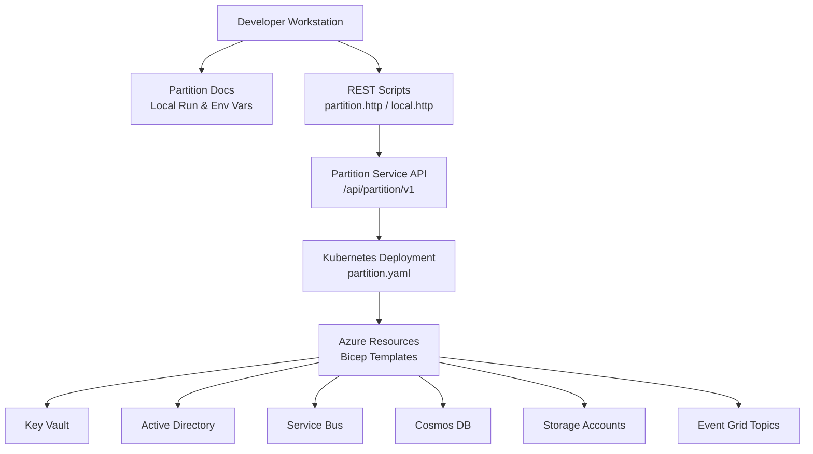
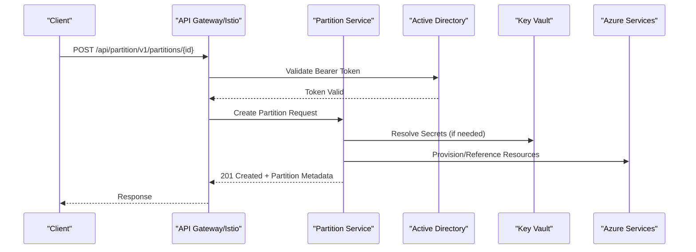
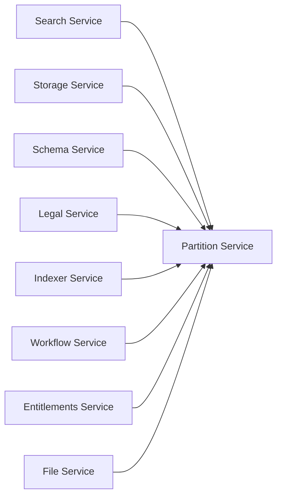

# Partition Service

<cite>
**Referenced Files in This Document**
- [services_core_partition.md](file://docs/src/services_core_partition.md)
- [partition.http](file://tools/rest-scripts/partition.http)
- [local.http](file://tools/rest-scripts/local.http)
- [partition.yaml](file://software/applications/osdu-core/partition.yaml)
- [services_core.md](file://docs/src/services_core.md)
- [services_core_search.md](file://docs/src/services_core_search.md)
- [services_core_storage.md](file://docs/src/services_core_storage.md)
- [services_core_schema.md](file://docs/src/services_core_schema.md)
- [services_core_legal.md](file://docs/src/services_core_legal.md)
- [services_core_indexer.md](file://docs/src/services_core_indexer.md)
- [services_core_workflow.md](file://docs/src/services_core_workflow.md)
- [services_core_entitlements.md](file://docs/src/services_core_entitlements.md)
- [services_core_file.md](file://docs/src/services_core_file.md)
- [main.bicep](file://bicep/main.bicep)
- [blade_configuration.bicep](file://bicep/modules/blade_configuration.bicep)
- [blade_partition.bicep](file://bicep/modules/blade_partition.bicep)
</cite>

## Table of Contents
1. [Introduction](#introduction)
2. [Project Structure](#project-structure)
3. [Core Components](#core-components)
4. [Architecture Overview](#architecture-overview)
5. [Detailed Component Analysis](#detailed-component-analysis)
6. [Dependency Analysis](#dependency-analysis)
7. [Performance Considerations](#performance-considerations)
8. [Troubleshooting Guide](#troubleshooting-guide)
9. [Conclusion](#conclusion)
10. [Appendices](#appendices)

## Introduction
The OSDU Partition Service provides multi-tenant data isolation by managing partitions, which are logical boundaries that scope data and configuration per tenant or environment. It exposes a REST API to create, list, retrieve, and delete partitions, and it integrates with Azure services (Key Vault, Active Directory, Storage, Cosmos DB, Event Grid, Service Bus) to provision the resources required for each partition. Other core OSDU services depend on this service to discover and validate partition metadata at runtime.

## Project Structure
This repository contains:
- Documentation for running and testing the Partition Service locally and in cloud environments
- Example HTTP requests demonstrating partition operations
- Kubernetes/Helm deployment manifests for the Partition Service
- Infrastructure-as-code templates (Bicep) for provisioning Azure resources used by partitions



**Diagram sources**
- [partition.yaml:1-57](file://software/applications/osdu-core/partition.yaml#L1-L57)
- [services_core_partition.md:1-51](file://docs/src/services_core_partition.md#L1-L51)
- [partition.http:1-220](file://tools/rest-scripts/partition.http#L1-L220)
- [main.bicep:1-200](file://bicep/main.bicep#L1-L200)

**Section sources**
- [services_core_partition.md:1-51](file://docs/src/services_core_partition.md#L1-L51)
- [partition.yaml:1-57](file://software/applications/osdu-core/partition.yaml#L1-L57)
- [partition.http:1-220](file://tools/rest-scripts/partition.http#L1-L220)

## Core Components
- Partition REST API: Provides version/info endpoints and CRUD operations over partitions.
- Local run configuration: Spring Boot application entry point and required environment variables.
- Integration points: Azure Key Vault for secrets, Active Directory for authentication, Redis for caching, and various Azure data/messaging services configured per partition.
- Deployment: Helm/Kubernetes manifest defines service exposure, health probes, and configuration injection.

Key responsibilities:
- Enforce tenant isolation via partition-scoped configuration and resource references
- Provide a single source of truth for partition metadata consumed by other services
- Support lifecycle management (create, read, update, delete) of partitions

**Section sources**
- [services_core_partition.md:1-51](file://docs/src/services_core_partition.md#L1-L51)
- [partition.yaml:1-57](file://software/applications/osdu-core/partition.yaml#L1-L57)
- [partition.http:1-220](file://tools/rest-scripts/partition.http#L1-L220)

## Architecture Overview
The Partition Service is deployed as a Kubernetes service and exposed through internal/external gateways. Consumers authenticate via Azure Active Directory and call the service using a bearer token. The service reads/writes partition metadata and may orchestrate creation of Azure resources referenced by partition properties.



**Diagram sources**
- [partition.http:52-197](file://tools/rest-scripts/partition.http#L52-L197)
- [services_core_partition.md:14-28](file://docs/src/services_core_partition.md#L14-L28)
- [partition.yaml:34-57](file://software/applications/osdu-core/partition.yaml#L34-L57)

## Detailed Component Analysis

### Partition REST API
- Base path: /api/partition/v1
- Endpoints demonstrated in scripts:
  - GET /info
  - POST /partitions/{id}
  - GET /partitions
  - GET /partitions/{id}
  - DELETE /partitions/{id}
- Authentication: Bearer token obtained from Azure AD client credentials flow
- Tenant scoping: data-partition-id header used by consumers; partition ID in URL scopes the operation

```mermaid
flowchart TD
Start(["Request Received"]) --> Auth["Validate Bearer Token"]
Auth --> |Valid| Route{"Endpoint?"}
Auth --> |Invalid| Err401["Return 401 Unauthorized"]
Route --> |GET /info| Info["Return Service Info"]
Route --> |POST /partitions/{id}| Create["Create Partition"]
Route --> |GET /partitions| List["List Partitions"]
Route --> |GET /partitions/{id}| Get["Get Partition"]
Route --> |DELETE /partitions/{id}| Delete["Delete Partition"]
Create --> Done(["Response"])
List --> Done
Get --> Done
Delete --> Done
Info --> Done
Err401 --> Done
```

**Diagram sources**
- [partition.http:41-220](file://tools/rest-scripts/partition.http#L41-L220)
- [local.http:28-54](file://tools/rest-scripts/local.http#L28-L54)

**Section sources**
- [partition.http:1-220](file://tools/rest-scripts/partition.http#L1-L220)
- [local.http:1-54](file://tools/rest-scripts/local.http#L1-L54)

### Local Development Setup
- Java SDK: zulu-17
- Module: partition-azure
- Main class: opengroup.osdu.partition.provider.azure.PartitionApplication
- Required environment variables include Application Insights key, Key Vault URI, AAD client ID, server port, Spring application name, Redis database number, logging level, Istio auth flag, and AAD session settings.
- Testing can be executed via JUnit in IntelliJ under the partition-test-azure module.

**Section sources**
- [services_core_partition.md:3-28](file://docs/src/services_core_partition.md#L3-L28)
- [services_core_partition.md:31-51](file://docs/src/services_core_partition.md#L31-L51)

### Configuration and Environment Variables
- Partition Service endpoint used by other services: PARTITION_SERVICE_ENDPOINT set to http://{host}/api/partition/v1 (or cluster-internal hostname).
- Additional variables for integration tests and local runs include tenant ID, tester client ID/secret, and base URL.

**Section sources**
- [services_core.md:78-364](file://docs/src/services_core.md#L78-L364)
- [services_core_search.md:14-38](file://docs/src/services_core_search.md#L14-L38)
- [services_core_storage.md:1-40](file://docs/src/services_core_storage.md#L1-L40)
- [services_core_schema.md:1-40](file://docs/src/services_core_schema.md#L1-L40)
- [services_core_legal.md:1-40](file://docs/src/services_core_legal.md#L1-L40)
- [services_core_indexer.md:1-40](file://docs/src/services_core_indexer.md#L1-L40)
- [services_core_workflow.md:1-40](file://docs/src/services_core_workflow.md#L1-L40)
- [services_core_entitlements.md:1-40](file://docs/src/services_core_entitlements.md#L1-L40)
- [services_core_file.md:1-40](file://docs/src/services_core_file.md#L1-L40)

### Azure Integration Settings
- Key Vault: Used to store sensitive values referenced by partitions (e.g., connection strings, keys).
- Active Directory: Used for authentication and authorization flows.
- Service Bus: Per-partition topics/subscriptions configured via Bicep parameters.
- Storage Accounts: Blob/file storage accounts referenced in partition properties.
- Cosmos DB: Database/container references stored in partition properties.
- Event Grid: Topics for schema changes, legal tags, status changes, etc.

These integrations are typically provisioned by Bicep modules and injected into the Partition Service via configuration maps/secrets.

**Section sources**
- [blade_configuration.bicep:272-337](file://bicep/modules/blade_configuration.bicep#L272-L337)
- [blade_partition.bicep:634-679](file://bicep/modules/blade_partition.bicep#L634-L679)
- [partition.yaml:138-156](file://software/applications/osdu-core/partition.yaml#L138-L156)

### Deployment and Exposure
- Deployed via HelmRelease referencing osdu-developer-service chart
- Service type ClusterIP with port 80
- Health probe configured on /actuator/health
- Gateways: internal-gateway and external-gateway allow both internal and external access
- Repository and tag for container image specified

**Section sources**
- [partition.yaml:1-57](file://software/applications/osdu-core/partition.yaml#L1-L57)

## Dependency Analysis
Other core services depend on the Partition Service to resolve partition metadata and enforce tenant isolation. They reference the service via PARTITION_SERVICE_ENDPOINT.



**Diagram sources**
- [services_core_search.md:14-38](file://docs/src/services_core_search.md#L14-L38)
- [services_core_storage.md:1-40](file://docs/src/services_core_storage.md#L1-L40)
- [services_core_schema.md:1-40](file://docs/src/services_core_schema.md#L1-L40)
- [services_core_legal.md:1-40](file://docs/src/services_core_legal.md#L1-L40)
- [services_core_indexer.md:1-40](file://docs/src/services_core_indexer.md#L1-L40)
- [services_core_workflow.md:1-40](file://docs/src/services_core_workflow.md#L1-L40)
- [services_core_entitlements.md:1-40](file://docs/src/services_core_entitlements.md#L1-L40)
- [services_core_file.md:1-40](file://docs/src/services_core_file.md#L1-L40)

**Section sources**
- [services_core_search.md:14-38](file://docs/src/services_core_search.md#L14-L38)
- [services_core_storage.md:1-40](file://docs/src/services_core_storage.md#L1-L40)
- [services_core_schema.md:1-40](file://docs/src/services_core_schema.md#L1-L40)
- [services_core_legal.md:1-40](file://docs/src/services_core_legal.md#L1-L40)
- [services_core_indexer.md:1-40](file://docs/src/services_core_indexer.md#L1-L40)
- [services_core_workflow.md:1-40](file://docs/src/services_core_workflow.md#L1-L40)
- [services_core_entitlements.md:1-40](file://docs/src/services_core_entitlements.md#L1-L40)
- [services_core_file.md:1-40](file://docs/src/services_core_file.md#L1-L40)

## Performance Considerations
- Caching: Redis is configured per environment; ensure appropriate cache TTLs and sizing to reduce repeated lookups.
- Health checks: Liveness/readiness probes help autoscaling and rolling updates without downtime.
- Concurrency: Ensure adequate replicas for expected request volume; monitor CPU/memory and scale horizontally.
- Network: Use internal gateway for intra-cluster calls to minimize latency and egress costs.
- Azure backends: Tune timeouts and retry policies for Key Vault, Cosmos DB, Storage, and Event Grid based on workload characteristics.

[No sources needed since this section provides general guidance]

## Troubleshooting Guide
Common issues and resolutions:
- Authentication failures: Verify AAD client ID, secret, and token acquisition flow; ensure AZURE_ISTIOAUTH_ENABLED matches your deployment mode.
- Missing secrets: Confirm KEYVAULT_URI and permissions; ensure partition properties reference valid Key Vault entries.
- Endpoint misconfiguration: Validate PARTITION_SERVICE_ENDPOINT across dependent services; ensure correct host/port and trailing slash behavior.
- Health probe failures: Check actuator endpoint availability and container readiness.
- Resource provisioning errors: Review Azure RBAC and quotas for Service Bus, Storage, Cosmos DB, and Event Grid when creating partitions.

Operational tips:
- Use the provided REST scripts to reproduce issues locally or against the target environment.
- Enable detailed logging via PARTITION_SPRING_LOGGING_LEVEL during investigations.
- Inspect Kubernetes events and pod logs for deployment and runtime errors.

**Section sources**
- [services_core_partition.md:14-28](file://docs/src/services_core_partition.md#L14-L28)
- [partition.http:1-220](file://tools/rest-scripts/partition.http#L1-L220)
- [partition.yaml:34-57](file://software/applications/osdu-core/partition.yaml#L34-L57)

## Conclusion
The Partition Service centralizes multi-tenant isolation in OSDU by managing partition metadata and orchestrating Azure resource references. It exposes a straightforward REST API, integrates tightly with Azure identity and data services, and is deployed as a Kubernetes service with clear health and routing configuration. Proper environment setup, secure secret management, and careful tuning of dependencies ensure reliable operation across development and production environments.

[No sources needed since this section summarizes without analyzing specific files]

## Appendices

### Practical Examples of Partition Operations
- Obtain an OAuth token using client credentials
- Call /info to verify service availability
- Create a partition with required properties (storage, cosmos, event grid, indexer flags)
- List and retrieve partitions
- Delete a partition when decommissioning

References:
- [partition.http:14-220](file://tools/rest-scripts/partition.http#L14-L220)
- [local.http:28-54](file://tools/rest-scripts/local.http#L28-L54)

**Section sources**
- [partition.http:14-220](file://tools/rest-scripts/partition.http#L14-L220)
- [local.http:28-54](file://tools/rest-scripts/local.http#L28-L54)