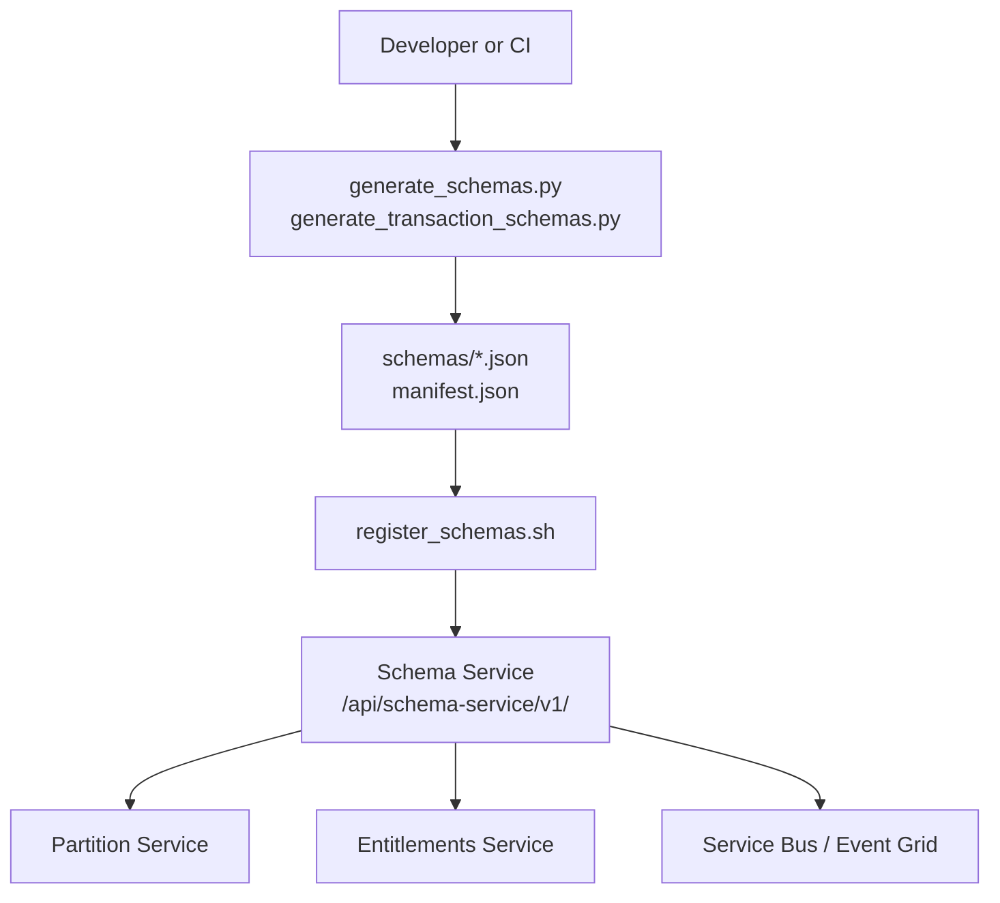
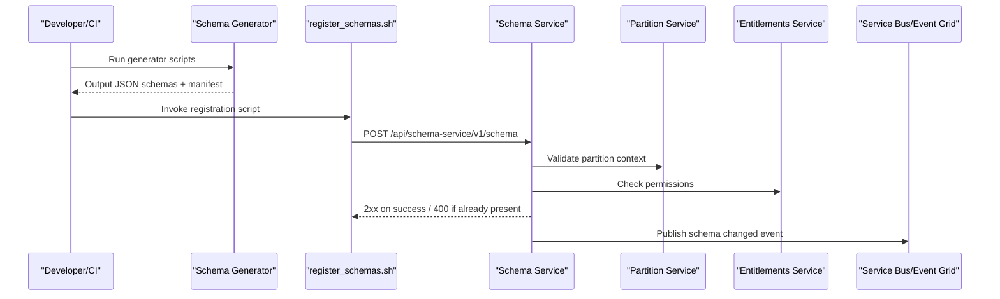
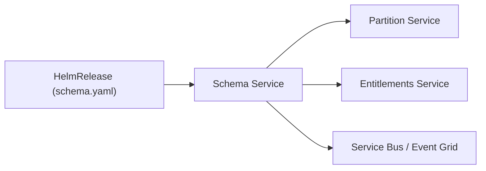

# Schema Service

<cite>
**Referenced Files in This Document**
- [services_core_schema.md](file://docs/src/services_core_schema.md)
- [schema.yaml](file://software/applications/osdu-core/schema.yaml)
- [register_schemas.sh](file://ofp-schema-deploy/register_schemas.sh)
- [generate_schemas.py](file://ofp-schema-deploy/generate_schemas.py)
- [generate_transaction_schemas.py](file://ofp-schema-deploy/generate_transaction_schemas.py)
- [README.md](file://ofp-schema-deploy/README.md)
- [manifest.json](file://ofp-schema-deploy/schemas/manifest.json)
- [EmissionScopeType schema](file://ofp-schema-deploy/schemas/ofp_wks_reference-data--EmissionScopeType_3.0.0.json)
- [schema.http](file://tools/rest-scripts/schema.http)
</cite>

## Table of Contents
1. Introduction
2. Project Structure
3. Core Components
4. Architecture Overview
5. Detailed Component Analysis
6. Dependency Analysis
7. Performance Considerations
8. Troubleshooting Guide
9. Conclusion
10. Appendices

## Introduction
This document explains the OSDU Schema Service as used in this repository to provide a versioned schema registry and validation surface for data ingestion pipelines. It covers:
- Schema definition format (JSON Schema draft-07 with OSDU system properties)
- Versioning strategy and lifecycle states
- Validation rules enforced by schemas
- Migration patterns and compatibility considerations
- API endpoints for registration, retrieval, update, and system-level operations
- Examples for defining custom schemas and evolving them over time
- Integration points with deployment and data ingestion workflows

The service is deployed as part of the core platform and exposed under a well-defined path, with configuration sourced from environment variables and secrets.

## Project Structure
The repository includes:
- Deployment manifests that configure and expose the Schema Service
- Documentation describing local run configuration and environment variables
- Scripts to generate and register schemas into the service
- Example HTTP requests demonstrating API usage
- Generated schema payloads and manifests for an Open Footprint domain model

**Diagram sources**
- [schema.yaml:40-115](file://software/applications/osdu-core/schema.yaml#L40-L115)
- [register_schemas.sh:33-49](file://ofp-schema-deploy/register_schemas.sh#L33-L49)
- [generate_schemas.py:105-133](file://ofp-schema-deploy/generate_schemas.py#L105-L133)
- [generate_transaction_schemas.py:99-130](file://ofp-schema-deploy/generate_transaction_schemas.py#L99-L130)

**Section sources**
- [schema.yaml:1-169](file://software/applications/osdu-core/schema.yaml#L1-L169)
- [services_core_schema.md:1-40](file://docs/src/services_core_schema.md#L1-L40)

## Core Components
- Schema Service runtime and exposure:
  - Exposed path: /api/schema-service/v1/
  - Health and info endpoints are unauthenticated
  - Authenticated endpoints require bearer token and partition header
- Configuration:
  - Environment variables include Key Vault URI, Azure storage container name, partition and entitlements endpoints, logging prefix, and messaging toggles
  - Kubernetes/Helm release configures replicas, probes, and gateway routing
- Local development:
  - Java SDK and Spring Boot application class are documented
  - Required environment variables for local runs are listed

Key responsibilities:
- Accept schema definitions and metadata via REST
- Persist and version schemas per partition
- Enforce access control via entitlements and partitions
- Emit change events to messaging when schemas change

**Section sources**
- [schema.yaml:32-115](file://software/applications/osdu-core/schema.yaml#L32-L115)
- [services_core_schema.md:5-40](file://docs/src/services_core_schema.md#L5-L40)

## Architecture Overview
The Schema Service integrates with platform services and tooling to manage schema lifecycles:

**Diagram sources**
- [register_schemas.sh:33-49](file://ofp-schema-deploy/register_schemas.sh#L33-L49)
- [schema.yaml:104-115](file://software/applications/osdu-core/schema.yaml#L104-L115)
- [services_core_schema.md:14-39](file://docs/src/services_core_schema.md#L14-L39)

## Detailed Component Analysis

### Schema Definition Format
- Base standard: JSON Schema draft-07
- OSDU record envelope:
  - System properties: id, kind, version, acl, legal, tags, createTime/createUser, modifyTime/modifyUser
  - Data object: holds entity-specific fields; required top-level keys include kind, acl, legal, data
- Self-contained schemas:
  - No external $ref to avoid resolution failures during first deploy
  - Optional later refactor to reference shared OSDU abstractions
- Property mapping:
  - Types mapped from source models to JSON Schema types
  - Arrays must declare items for indexer compatibility
  - Date/time fields use string type with date-time format

Examples and references:
- See the generated schema payload structure and system property definitions
- See a concrete example schema file for a reference-data entity

**Section sources**
- [generate_schemas.py:48-96](file://ofp-schema-deploy/generate_schemas.py#L48-L96)
- [generate_schemas.py:105-133](file://ofp-schema-deploy/generate_schemas.py#L105-L133)
- [EmissionScopeType schema:17-143](file://ofp-schema-deploy/schemas/ofp_wks_reference-data--EmissionScopeType_3.0.0.json#L17-L143)
- [README.md:37-46](file://ofp-schema-deploy/README.md#L37-L46)

### Versioning Strategy and Lifecycle
- Version identity: authority:source:entityType:major.minor.patch
- Statuses:
  - DEVELOPMENT: mutable via PUT; safe for iterative changes
  - PUBLISHED: frozen permanently; superseded by higher versions
- Irreversibility:
  - Schemas cannot be deleted
  - Promote to PUBLISHED only after validating records against the new schema

Operational notes:
- Registration defaults to DEVELOPMENT scope
- Use PUT to evolve schemas within DEVELOPMENT
- Create a new version for breaking changes and promote when validated

**Section sources**
- [README.md:66-70](file://ofp-schema-deploy/README.md#L66-L70)
- [generate_schemas.py:130-133](file://ofp-schema-deploy/generate_schemas.py#L130-L133)
- [generate_transaction_schemas.py:123-126](file://ofp-schema-deploy/generate_transaction_schemas.py#L123-L126)

### Validation Rules
- Top-level requirements: kind, acl, legal, data
- Data object:
  - additionalProperties disabled to enforce strict schemas
  - required fields declared explicitly
- Type enforcement:
  - String, integer, number, boolean, array (with items), object
  - Date/time strings use date-time format
- Indexer compatibility:
  - Arrays must define items to map correctly

**Section sources**
- [EmissionScopeType schema:104-143](file://ofp-schema-deploy/schemas/ofp_wks_reference-data--EmissionScopeType_3.0.0.json#L104-L143)
- [generate_schemas.py:63-67](file://ofp-schema-deploy/generate_schemas.py#L63-L67)
- [generate_schemas.py:117-128](file://ofp-schema-deploy/generate_schemas.py#L117-L128)

### API Endpoints
- Register schema:
  - Method: POST
  - Path: /api/schema-service/v1/schema
  - Headers: Authorization (Bearer token), data-partition-id, Content-Type: application/json
  - Body: schemaInfo + schema
- Retrieve schema:
  - Method: GET
  - Path: /api/schema-service/v1/schema/{kind}
  - Headers: Authorization (Bearer token), data-partition-id
- Update schema:
  - Method: PUT
  - Path: /api/schema-service/v1/schema
  - Headers: Authorization (Bearer token), data-partition-id, Content-Type: application/json
  - Body: updated schemaInfo + schema
- System schema management:
  - Method: PUT
  - Path: /api/schema-service/v1/schemas/system
  - Requires elevated privileges

Notes:
- Health/info endpoints are unauthenticated
- Partition and entitlements services are consulted for authorization and context

**Section sources**
- [schema.http:62-147](file://tools/rest-scripts/schema.http#L62-L147)
- [schema.yaml:58-67](file://software/applications/osdu-core/schema.yaml#L58-L67)
- [schema.yaml:112-115](file://software/applications/osdu-core/schema.yaml#L112-L115)

### Migration Patterns and Compatibility
- Backward-compatible evolution:
  - Add optional fields in data objects
  - Keep existing required fields unchanged
  - Maintain type stability for existing fields
- Breaking changes:
  - Introduce a new version (increment major/minor/patch)
  - Migrate producers/consumers to the new version
  - Promote new version to PUBLISHED after validation
- Governance:
  - Start in DEVELOPMENT for iteration
  - Only promote to PUBLISHED once validated with real records
  - Never delete schemas; rely on versioning

Practical guidance:
- Use the provided generators to keep schema bodies aligned with canonical models
- Use manifests to ensure dependency order when registering multiple kinds

**Section sources**
- [README.md:66-70](file://ofp-schema-deploy/README.md#L66-L70)
- [manifest.json:1-211](file://ofp-schema-deploy/schemas/manifest.json#L1-L211)
- [generate_schemas.py:105-133](file://ofp-schema-deploy/generate_schemas.py#L105-L133)

### Integration with Data Ingestion Pipelines
- Schemas validate incoming records before indexing/storage
- Strict data schemas prevent drift and ensure consistent indexing
- Change events can trigger downstream reprocessing or pipeline updates
- Partition-scoped schemas align with multi-tenant isolation

Operational tips:
- Ensure tokens have sufficient permissions for schema-service.editors
- Confirm partition headers match target tenant
- Validate locally using sample payloads before pushing to production

**Section sources**
- [schema.yaml:104-115](file://software/applications/osdu-core/schema.yaml#L104-L115)
- [services_core_schema.md:14-39](file://docs/src/services_core_schema.md#L14-L39)

## Dependency Analysis
- External dependencies:
  - Partition service for tenant context
  - Entitlements service for authorization
  - Messaging (Service Bus/Event Grid) for schema change notifications
- Internal dependencies:
  - HelmRelease configures service exposure, probes, and environment
  - Init job enables schema initialization tasks

**Diagram sources**
- [schema.yaml:112-115](file://software/applications/osdu-core/schema.yaml#L112-L115)
- [schema.yaml:104-111](file://software/applications/osdu-core/schema.yaml#L104-L111)

**Section sources**
- [schema.yaml:1-169](file://software/applications/osdu-core/schema.yaml#L1-L169)

## Performance Considerations
- Prefer self-contained schemas to minimize remote $ref resolution overhead
- Keep data objects minimal and strictly typed to reduce validation cost
- Batch registrations where possible using manifests to reduce round-trips
- Monitor health endpoints for readiness and liveness checks

[No sources needed since this section provides general guidance]

## Troubleshooting Guide
Common issues and resolutions:
- Authentication errors:
  - Ensure bearer token has schema-service.editors permissions
  - Verify partition header matches target partition
- Already registered:
  - 400 responses may indicate duplicate registration; skip or update via PUT
- Invalid schema:
  - Validate JSON Schema syntax and required fields
  - Ensure arrays declare items for indexer compatibility
- Health and diagnostics:
  - Use unauthenticated health/info endpoints to verify service status

**Section sources**
- [register_schemas.sh:33-49](file://ofp-schema-deploy/register_schemas.sh#L33-L49)
- [schema.yaml:54-67](file://software/applications/osdu-core/schema.yaml#L54-L67)
- [services_core_schema.md:14-39](file://docs/src/services_core_schema.md#L14-L39)

## Conclusion
The OSDU Schema Service in this repository provides a robust, versioned registry for enforcing data contracts across ingestion pipelines. By combining JSON Schema-based validation, clear versioning and lifecycle policies, and integration with partitioning and entitlements, it ensures reliable schema governance. The included generators and registration scripts streamline creation and rollout, while manifests help maintain correct dependency ordering. Adopt backward-compatible changes where possible, introduce new versions for breaking changes, and promote to published only after thorough validation.

[No sources needed since this section summarizes without analyzing specific files]

## Appendices

### Appendix A: Example Workflows

#### Define a Custom Schema
- Generate or author a schema body with schemaInfo and schema sections
- Include system properties and a data object with explicit required fields
- Set status to DEVELOPMENT and appropriate scope

References:
- [generate_schemas.py:105-133](file://ofp-schema-deploy/generate_schemas.py#L105-L133)
- [EmissionScopeType schema:17-143](file://ofp-schema-deploy/schemas/ofp_wks_reference-data--EmissionScopeType_3.0.0.json#L17-L143)

#### Implement Validation Logic
- Enforce required fields and types in the data object
- Disable additional properties to prevent drift
- Use date-time formats for temporal fields

References:
- [generate_schemas.py:63-67](file://ofp-schema-deploy/generate_schemas.py#L63-L67)
- [generate_schemas.py:117-128](file://ofp-schema-deploy/generate_schemas.py#L117-L128)

#### Manage Schema Evolution
- Iterate in DEVELOPMENT using PUT updates
- Create a new version for breaking changes
- Promote to PUBLISHED after successful validation

References:
- [README.md:66-70](file://ofp-schema-deploy/README.md#L66-L70)
- [schema.http:101-139](file://tools/rest-scripts/schema.http#L101-L139)

#### Integrate with Ingestion Pipelines
- Ensure records conform to the latest schema before ingestion
- Handle schema change events to refresh caches or reprocess data
- Validate partition and entitlements contexts

References:
- [schema.yaml:104-115](file://software/applications/osdu-core/schema.yaml#L104-L115)
- [services_core_schema.md:14-39](file://docs/src/services_core_schema.md#L14-L39)