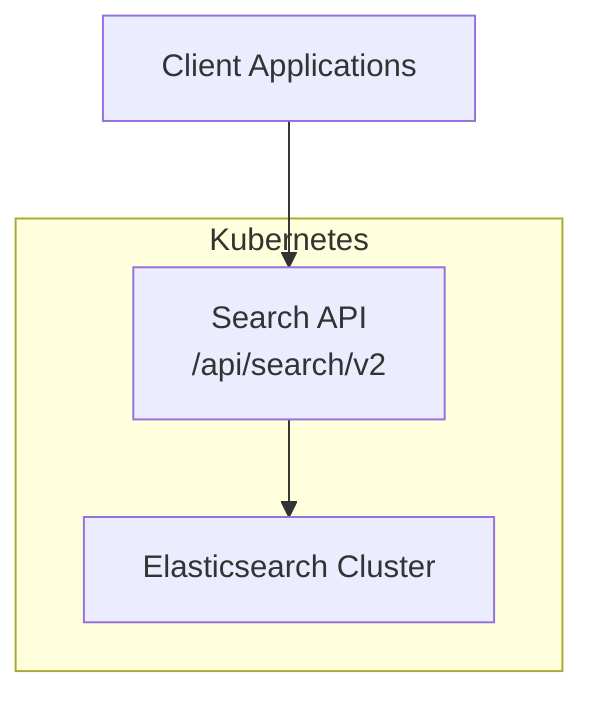
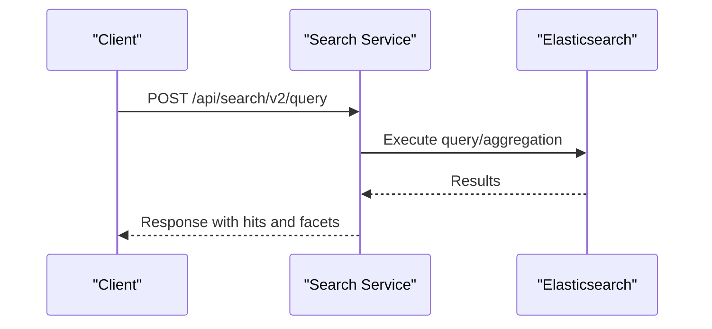
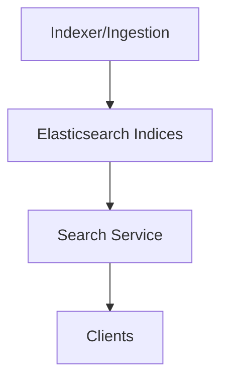
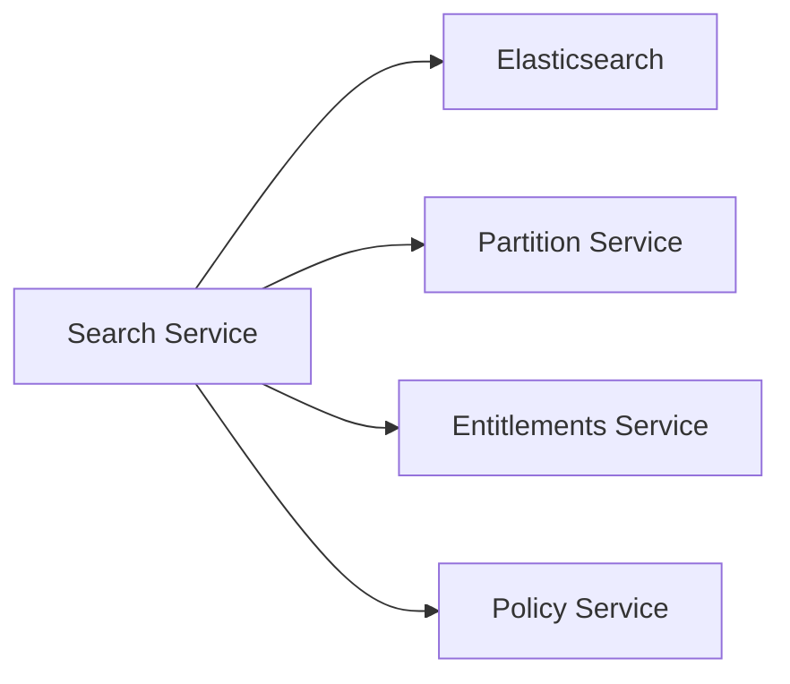

# Search Service

<cite>
**Referenced Files in This Document**
- [services_core_search.md](file://docs/src/services_core_search.md)
- [elastic-search.yaml](file://software/components/elastic-search/elastic-search.yaml)
- [elastic.yaml](file://software/components/osdu-system/elastic.yaml)
- [elastic-init.yaml](file://charts/osdu-developer-init/templates/elastic-init.yaml)
- [partition.http](file://tools/rest-scripts/partition.http)
- [check-csv.http](file://tools/rest-scripts/check-csv.http)
- [docker-bake.hcl](file://src/docker-bake.hcl)
- [README.md (Airflow DAGs)](file://charts/airflow-dags/scripts/README.md)
</cite>

## Table of Contents
1. Introduction
2. Project Structure
3. Core Components
4. Architecture Overview
5. Detailed Component Analysis
6. Dependency Analysis
7. Performance Considerations
8. Troubleshooting Guide
9. Conclusion
10. Appendices

## Introduction
This document describes the OSDU Search Service, which provides full-text search and metadata querying over Elasticsearch. It explains how the service integrates with Elasticsearch for indexing and querying, outlines the API surface used by clients, and covers operational aspects such as scalability, backup/recovery, and monitoring. The content is derived from repository configuration and documentation artifacts that define the search service runtime, its dependencies on Elasticsearch, and example client usage.

## Project Structure
The repository includes:
- Documentation describing local run configuration and environment variables for the Search service.
- Kubernetes manifests that deploy an Elasticsearch cluster managed by the Elastic Cloud on Kubernetes (ECK) operator.
- Initialization scripts that configure Elasticsearch security (roles and users).
- REST request examples demonstrating how to call the Search API.
- Build configuration that packages the Search service modules.

[No sources needed since this diagram shows conceptual workflow, not actual code structure]

**Section sources**
- [services_core_search.md:1-38](file://docs/src/services_core_search.md#L1-L38)
- [elastic-search.yaml:1-89](file://software/components/elastic-search/elastic-search.yaml#L1-L89)
- [elastic.yaml:1-29](file://software/components/osdu-system/elastic.yaml#L1-L29)
- [docker-bake.hcl:120-130](file://src/docker-bake.hcl#L120-L130)

## Core Components
- Search Service Runtime: A Spring Boot application configured via environment variables for local and cloud execution. It exposes a search API endpoint under /api/search/v2.
- Elasticsearch Cluster: Deployed using ECK with three nodes, each acting as master, data, and ingest node. TLS is disabled in this deployment; storage is provisioned via persistent volumes.
- Security Initialization: A script creates a custom role and user for the Search service to authenticate against Elasticsearch.
- Partition Configuration: Per-partition properties include Elasticsearch endpoint and credentials, enabling multi-tenant isolation.

Key responsibilities:
- Accepting search queries and translating them into Elasticsearch requests.
- Managing index interactions through partition-scoped endpoints and credentials.
- Supporting faceted search and aggregations via standard Elasticsearch query constructs.

**Section sources**
- [services_core_search.md:1-38](file://docs/src/services_core_search.md#L1-L38)
- [elastic-search.yaml:1-89](file://software/components/elastic-search/elastic-search.yaml#L1-L89)
- [elastic-init.yaml:81-176](file://charts/osdu-developer-init/templates/elastic-init.yaml#L81-L176)
- [partition.http:59-108](file://tools/rest-scripts/partition.http#L59-L108)

## Architecture Overview
The Search Service acts as an abstraction layer over Elasticsearch. Clients send structured queries to the Search API, which then issues corresponding requests to Elasticsearch. The Elasticsearch cluster is deployed with ECK and secured with a custom role/user created during initialization.

**Diagram sources**
- [check-csv.http:724-734](file://tools/rest-scripts/check-csv.http#L724-L734)
- [elastic-search.yaml:1-89](file://software/components/elastic-search/elastic-search.yaml#L1-L89)
- [elastic-init.yaml:81-176](file://charts/osdu-developer-init/templates/elastic-init.yaml#L81-L176)

**Section sources**
- [check-csv.http:724-734](file://tools/rest-scripts/check-csv.http#L724-L734)
- [elastic-search.yaml:1-89](file://software/components/elastic-search/elastic-search.yaml#L1-L89)
- [elastic-init.yaml:81-176](file://charts/osdu-developer-init/templates/elastic-init.yaml#L81-L176)

## Detailed Component Analysis

### Search API Endpoints
- Base path: /api/search/v2
- Query endpoint: POST /query
  - Typical payload includes kind, query string, offset, and limit.
  - Example usage is provided in REST scripts.

Notes:
- The base URL can be discovered via service discovery or configuration injected into consumers (e.g., Airflow DAGs).
- Authentication headers and data-partition-id are required per partition scoping.

**Section sources**
- [check-csv.http:45-45](file://tools/rest-scripts/check-csv.http#L45-L45)
- [check-csv.http:724-734](file://tools/rest-scripts/check-csv.http#L724-L734)
- [README.md (Airflow DAGs):42-42](file://charts/airflow-dags/scripts/README.md#L42-L42)

### Indexing and Data Flow
- Indexing is typically performed by upstream services (e.g., Indexer), which write documents to Elasticsearch indices associated with a data partition.
- The Search Service reads from these indices to fulfill queries.
- Partition properties define the Elasticsearch endpoint and credentials used by the Search Service.

[No sources needed since this diagram shows conceptual workflow, not actual code structure]

**Section sources**
- [partition.http:59-108](file://tools/rest-scripts/partition.http#L59-L108)
- [elastic-search.yaml:1-89](file://software/components/elastic-search/elastic-search.yaml#L1-L89)

### Query Language and Aggregations
- The Search API accepts a query string and supports standard Elasticsearch query constructs.
- Faceted search and aggregations can be expressed within the query payload to compute counts, ranges, and other metrics.
- Examples demonstrate basic text and field-based queries; advanced aggregation queries follow Elasticsearch DSL patterns.

**Section sources**
- [check-csv.http:724-734](file://tools/rest-scripts/check-csv.http#L724-L734)

### Security and Access Control
- A custom role and user are created for the Search service to access Elasticsearch indices with read/write privileges.
- Credentials are stored securely and referenced via partition properties.

**Section sources**
- [elastic-init.yaml:81-176](file://charts/osdu-developer-init/templates/elastic-init.yaml#L81-L176)
- [partition.http:59-108](file://tools/rest-scripts/partition.http#L59-L108)

### Deployment and Packaging
- The Search service is built as part of the Docker bake target, including core and Azure provider modules.
- Environment variables control logging, caching, and integration with Partition, Entitlements, and Policy services.

**Section sources**
- [docker-bake.hcl:120-130](file://src/docker-bake.hcl#L120-L130)
- [services_core_search.md:1-38](file://docs/src/services_core_search.md#L1-L38)

## Dependency Analysis
The Search Service depends on:
- Elasticsearch cluster for storage and retrieval.
- Partition service for resolving per-tenant endpoints and credentials.
- Optional Policy and Entitlements services for authorization and policy enforcement.

**Diagram sources**
- [services_core_search.md:14-38](file://docs/src/services_core_search.md#L14-L38)
- [elastic-search.yaml:1-89](file://software/components/elastic-search/elastic-search.yaml#L1-L89)

**Section sources**
- [services_core_search.md:14-38](file://docs/src/services_core_search.md#L1-L38)
- [elastic-search.yaml:1-89](file://software/components/elastic-search/elastic-search.yaml#L1-L89)

## Performance Considerations
- Elasticsearch sizing: The cluster uses 3 nodes with persistent storage and resource limits set for CPU and memory. Adjust node count and resources based on workload.
- JVM heap: Node-level Java options are configured; ensure heap settings align with available memory.
- Query optimization: Use targeted queries, appropriate filters, and avoid deep pagination where possible.
- Caching: The Search service includes cache-related configuration (e.g., expiration and max value size) to reduce load on Elasticsearch.

[No sources needed since this section provides general guidance]

**Section sources**
- [elastic-search.yaml:67-79](file://software/components/elastic-search/elastic-search.yaml#L67-L79)
- [services_core_search.md:34-35](file://docs/src/services_core_search.md#L34-L35)

## Troubleshooting Guide
Common issues and checks:
- Connectivity: Verify the Elasticsearch endpoint and network policies allow traffic from the Search service.
- Authentication: Ensure the custom role and user exist and have correct permissions on indices.
- Partition configuration: Confirm partition properties contain valid Elasticsearch endpoint and credentials.
- Logs and metrics: Enable debug logging for the Search service and monitor Elasticsearch health via Kibana or cluster APIs.

Operational references:
- Local run configuration and environment variables for the Search service.
- Elasticsearch cluster manifest for node roles, storage, and resource constraints.
- Initialization script for creating roles and users.

**Section sources**
- [services_core_search.md:1-38](file://docs/src/services_core_search.md#L1-L38)
- [elastic-search.yaml:1-89](file://software/components/elastic-search/elastic-search.yaml#L1-L89)
- [elastic-init.yaml:81-176](file://charts/osdu-developer-init/templates/elastic-init.yaml#L81-L176)

## Conclusion
The OSDU Search Service provides a robust interface for full-text search and metadata queries backed by an Elasticsearch cluster. Its design isolates tenants via partitions, secures access through custom roles and users, and offers flexible querying capabilities. Proper sizing, query optimization, and monitoring are essential for performance at scale.

[No sources needed since this section summarizes without analyzing specific files]

## Appendices

### API Reference
- Base path: /api/search/v2
- Endpoint: POST /query
  - Request fields: kind, query, offset, limit
  - Headers: Authorization, data-partition-id

Example invocation pattern:
- See REST script examples for constructing and sending queries.

**Section sources**
- [check-csv.http:45-45](file://tools/rest-scripts/check-csv.http#L45-L45)
- [check-csv.http:724-734](file://tools/rest-scripts/check-csv.http#L724-L734)

### Elasticsearch Cluster Details
- Version: 8.15.2
- Nodes: 3 (master, data, ingest)
- Storage: Persistent volumes with specified capacity and storage class
- TLS: Disabled in this deployment
- Resource limits: CPU and memory constraints per pod

**Section sources**
- [elastic-search.yaml:1-89](file://software/components/elastic-search/elastic-search.yaml#L1-L89)

### Operator and Helm Integration
- ECK operator installed via Helm release in the osdu-system namespace.
- Flux manages the Helm repository and release lifecycle.

**Section sources**
- [elastic.yaml:1-29](file://software/components/osdu-system/elastic.yaml#L1-L29)