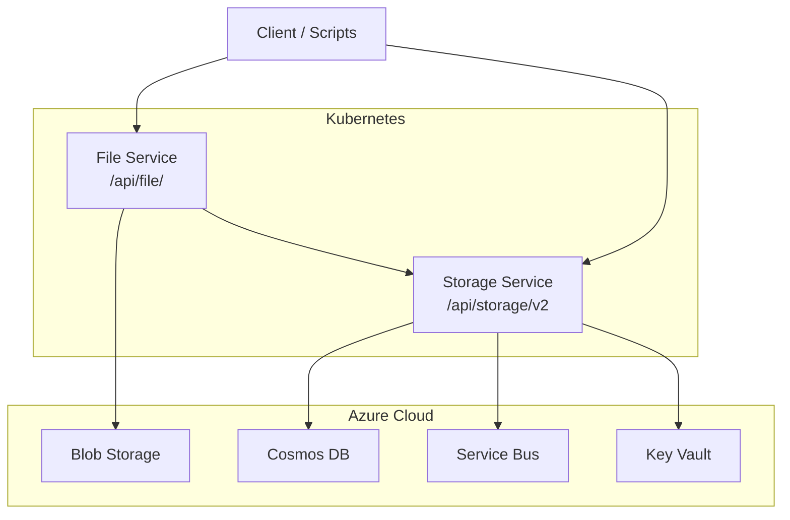
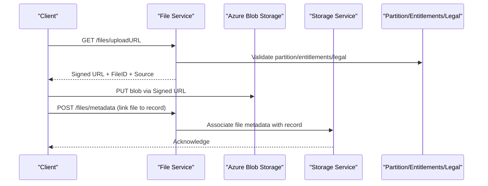
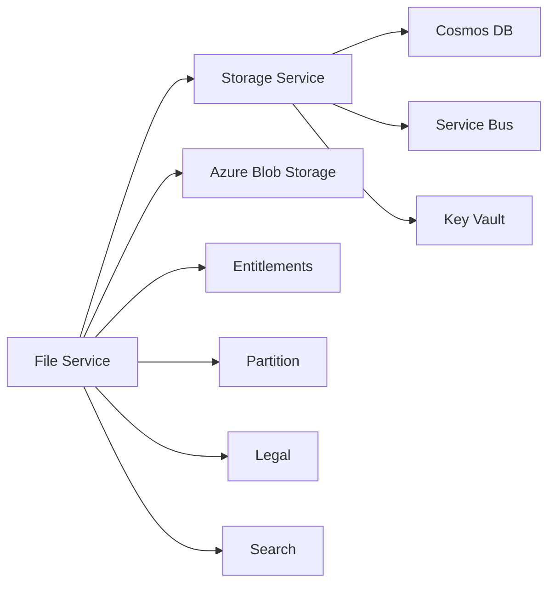

# Storage Service

<cite>
**Referenced Files in This Document**
- [services_core_storage.md](file://docs/src/services_core_storage.md)
- [services_core_file.md](file://docs/src/services_core_file.md)
- [storage.yaml](file://software/applications/osdu-core/storage.yaml)
- [file.yaml](file://software/applications/osdu-core/file.yaml)
- [storage.http](file://tools/rest-scripts/storage.http)
- [check-file.http](file://tools/rest-scripts/check-file.http)
- [check-csv.http](file://tools/rest-scripts/check-csv.http)
- [main.bicep](file://bicep/modules/blade_partition.bicep)
- [main.json](file://bicep/modules/storage-account/main.json)
- [main.bicep (storage account)](file://bicep/modules/storage-account/main.bicep)
</cite>

## Table of Contents
1. Introduction
2. Project Structure
3. Core Components
4. Architecture Overview
5. Detailed Component Analysis
6. Dependency Analysis
7. Performance Considerations
8. Troubleshooting Guide
9. Conclusion

## Introduction
This document provides comprehensive documentation for the OSDU Storage and File services, focusing on secure file upload/download, metadata management, versioning, access control integration, and operational configuration. It explains how the storage service persists records and integrates with Azure Blob Storage via signed URLs, while the file service orchestrates large file transfers and associates files with OSDU records. The guide also covers API endpoints, chunked uploads, retry strategies, monitoring, and extensibility considerations for custom storage backends.

## Project Structure
The repository includes:
- Documentation describing local run configurations and environment variables for both storage and file services.
- Kubernetes/Helm manifests that deploy the storage and file services into a cluster with Istio-based routing and authentication.
- REST client scripts demonstrating end-to-end workflows for record operations and file uploads/downloads.
- Infrastructure definitions for Azure storage accounts and containers used by the services.

**Diagram sources**
- [storage.yaml:38-104](file://software/applications/osdu-core/storage.yaml#L38-L104)
- [file.yaml:38-100](file://software/applications/osdu-core/file.yaml#L38-L100)
- [main.bicep:46-64](file://bicep/modules/blade_partition.bicep#L46-L64)

**Section sources**
- [services_core_storage.md:1-40](file://docs/src/services_core_storage.md#L1-L40)
- [services_core_file.md:1-27](file://docs/src/services_core_file.md#L1-L27)
- [storage.yaml:1-141](file://software/applications/osdu-core/storage.yaml#L1-L141)
- [file.yaml:1-140](file://software/applications/osdu-core/file.yaml#L1-L140)

## Core Components
- Storage Service: Persists OSDU records to Cosmos DB, publishes events to Service Bus, and exposes APIs for CRUD, querying, and versioning. It is configured to use Key Vault for secrets and supports health probes and context path routing under /api/storage/v2/.
- File Service: Orchestrates secure file uploads/downloads using signed URLs to Azure Blob Storage, manages file metadata association with records, and integrates with entitlements, partition, and search services.

Key capabilities:
- Secure upload via signed URLs to minimize server load and improve reliability.
- Metadata management tied to OSDU records with ACLs and legal tags.
- Versioned record retrieval and listing.
- Event-driven integrations via Service Bus topics.

**Section sources**
- [storage.yaml:38-141](file://software/applications/osdu-core/storage.yaml#L38-L141)
- [file.yaml:38-140](file://software/applications/osdu-core/file.yaml#L38-L140)
- [services_core_storage.md:14-39](file://docs/src/services_core_storage.md#L14-L39)
- [services_core_file.md:14-27](file://docs/src/services_core_file.md#L14-L27)

## Architecture Overview
The storage architecture combines:
- Record persistence in Cosmos DB with event publishing to Service Bus.
- File handling through the File Service, which issues signed URLs to Azure Blob Storage for direct client uploads/downloads.
- Security enforced by AAD/Istio and Key Vault-backed secrets.
- Integration points with Partition, Entitlements, Legal, and Search services.

**Diagram sources**
- [check-csv.http:546-573](file://tools/rest-scripts/check-csv.http#L546-L573)
- [check-file.http:203-215](file://tools/rest-scripts/check-file.http#L203-L215)
- [file.yaml:115-128](file://software/applications/osdu-core/file.yaml#L115-L128)
- [storage.yaml:117-134](file://software/applications/osdu-core/storage.yaml#L117-L134)

## Detailed Component Analysis

### Storage Service API Endpoints
- Info endpoint for service discovery and status.
- Records CRUD: create, get by ID, get by version, list versions, delete.
- Query endpoints: GET and POST query patterns for filtering attributes.

Examples from scripts:
- Create records in bulk or single.
- Retrieve a specific record or a specific version.
- List all versions for a record ID.
- Delete a record using a dedicated endpoint.

Operational notes:
- Context path: /api/storage/v2/
- Health probe path: /actuator/health
- Authentication exemptions for health/info/docs endpoints.

**Section sources**
- [storage.http:54-197](file://tools/rest-scripts/storage.http#L54-L197)
- [storage.yaml:52-75](file://software/applications/osdu-core/storage.yaml#L52-L75)

### File Service Operations
- Upload flow:
  - Request an upload URL; receive a signed URL and file identifier.
  - Upload directly to Azure Blob Storage using the signed URL.
  - Post file metadata to associate it with an OSDU record.
- Download flow:
  - Request a download URL for a file; receive a signed URL.
  - Download directly from Azure Blob Storage using the signed URL.

These flows are demonstrated in the REST scripts and align with the file service’s configuration and environment variables.

**Section sources**
- [check-csv.http:546-573](file://tools/rest-scripts/check-csv.http#L546-L573)
- [check-file.http:134-198](file://tools/rest-scripts/check-file.http#L134-L198)
- [check-file.http:203-215](file://tools/rest-scripts/check-file.http#L203-L215)
- [file.yaml:74-140](file://software/applications/osdu-core/file.yaml#L74-L140)

### Metadata Management and Schemas
- File metadata is posted to the file service and associated with OSDU records managed by the storage service.
- OSDU records include standard fields such as kind, acl, legal, data, and meta.
- Scripts demonstrate setting ACLs, legal tags, and data properties when creating records and associating files.

Best practices:
- Always set appropriate ACLs and legal tags for compliance.
- Use consistent kinds and schema versions for records.
- Keep metadata minimal and structured for efficient indexing and retrieval.

**Section sources**
- [storage.http:102-139](file://tools/rest-scripts/storage.http#L102-L139)
- [check-file.http:142-187](file://tools/rest-scripts/check-file.http#L142-L187)

### Access Control Integration
- The file and storage services integrate with Partition and Entitlements services to enforce access policies.
- Environment variables configure endpoints for these services.
- Istio and AAD provide transport security and identity enforcement at the gateway level.

Configuration highlights:
- Partition service endpoint.
- Entitlements service endpoint.
- Legal service endpoint and region.
- OPA flag for policy evaluation.

**Section sources**
- [services_core_storage.md:14-39](file://docs/src/services_core_storage.md#L14-L39)
- [services_core_file.md:14-27](file://docs/src/services_core_file.md#L14-L27)
- [storage.yaml:117-136](file://software/applications/osdu-core/storage.yaml#L117-L136)
- [file.yaml:115-128](file://software/applications/osdu-core/file.yaml#L115-L128)

### Large File Handling and Chunking
- The file service uses signed URLs to offload large file transfers directly to Azure Blob Storage, improving throughput and resilience.
- While the repository does not define explicit chunking logic, clients can implement resumable uploads to Azure Block Blobs using the signed URL and block management APIs.
- The file service configures a checksum calculation limit to manage resource usage during integrity checks.

Recommendations:
- Implement client-side chunking and resume capability for large files.
- Use appropriate blob types and headers for performance.
- Monitor upload success and handle retries gracefully.

**Section sources**
- [check-csv.http:546-573](file://tools/rest-scripts/check-csv.http#L546-L573)
- [file.yaml:135-140](file://software/applications/osdu-core/file.yaml#L135-L140)

### Bulk Operations
- The storage service supports bulk creation of records via a single request containing multiple record payloads.
- Scripts demonstrate sending arrays of records and receiving IDs and versions for each created item.

Use cases:
- Batch ingestion of reference data.
- Bulk initialization of datasets with consistent schemas and legal tags.

**Section sources**
- [storage.http:102-139](file://tools/rest-scripts/storage.http#L102-L139)

### Custom Storage Backends
- The storage service is containerized and configurable via environment variables, enabling deployment across different environments.
- To extend or replace storage backends:
  - Provide environment variables for connection details and feature toggles.
  - Ensure compatibility with Cosmos DB and Service Bus integrations.
  - Configure Key Vault for secret management.
  - Update routing and health probes accordingly.

Note: The repository demonstrates Azure-centric configuration; adapting to other backends requires aligning with the service’s expected interfaces and configuration keys.

**Section sources**
- [storage.yaml:76-141](file://software/applications/osdu-core/storage.yaml#L76-L141)
- [services_core_storage.md:14-39](file://docs/src/services_core_storage.md#L14-L39)

## Dependency Analysis
The services depend on several core components:
- Cosmos DB for record persistence.
- Service Bus for event-driven communication.
- Azure Blob Storage for file content.
- Key Vault for secrets.
- Partition, Entitlements, Legal, and Search services for governance and discovery.

**Diagram sources**
- [storage.yaml:105-136](file://software/applications/osdu-core/storage.yaml#L105-L136)
- [file.yaml:115-128](file://software/applications/osdu-core/file.yaml#L115-L128)
- [main.bicep:46-64](file://bicep/modules/blade_partition.bicep#L46-L64)

**Section sources**
- [storage.yaml:105-141](file://software/applications/osdu-core/storage.yaml#L105-L141)
- [file.yaml:115-140](file://software/applications/osdu-core/file.yaml#L115-L140)
- [main.bicep:46-64](file://bicep/modules/blade_partition.bicep#L46-L64)

## Performance Considerations
- Prefer signed URL uploads to reduce server load and improve scalability.
- Tune replica counts and resource requests based on workload characteristics.
- Use Service Bus topics for asynchronous processing and decoupling.
- Enable health probes and monitor application metrics via Application Insights.
- Configure appropriate timeouts and limits for network calls and blob operations.

[No sources needed since this section provides general guidance]

## Troubleshooting Guide
Common issues and resolutions:
- Authentication failures: Verify AAD client ID, tenant, and scopes; ensure Istio auth is enabled where required.
- Missing permissions: Confirm entitlements and legal tags are correctly set for partitions and resources.
- Upload errors: Check signed URL validity and blob headers; implement retries with exponential backoff.
- Service connectivity: Validate endpoints for partition, entitlements, legal, and search services; confirm network policies and gateways.

Monitoring and diagnostics:
- Use health endpoints (/actuator/health) to verify service readiness.
- Inspect logs prefixed per service for detailed traces.
- Leverage Application Insights for distributed tracing and error tracking.

**Section sources**
- [storage.yaml:52-75](file://software/applications/osdu-core/storage.yaml#L52-L75)
- [file.yaml:53-74](file://software/applications/osdu-core/file.yaml#L53-L74)
- [services_core_storage.md:14-39](file://docs/src/services_core_storage.md#L14-L39)
- [services_core_file.md:14-27](file://docs/src/services_core_file.md#L14-L27)

## Conclusion
The OSDU Storage and File services provide a robust foundation for secure, scalable, and compliant data management. By leveraging signed URLs for file transfers, integrating with governance services, and utilizing event-driven architectures, the platform supports high-throughput workloads and strict access controls. Operators should focus on proper configuration, monitoring, and resilient client implementations to maximize reliability and performance.

[No sources needed since this section summarizes without analyzing specific files]