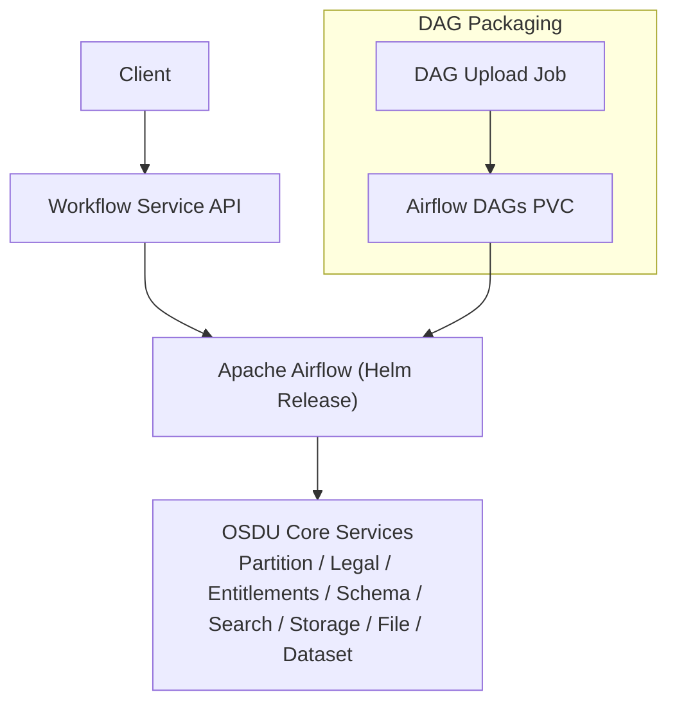
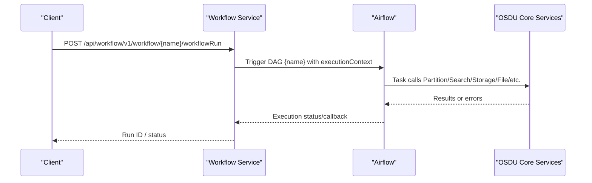
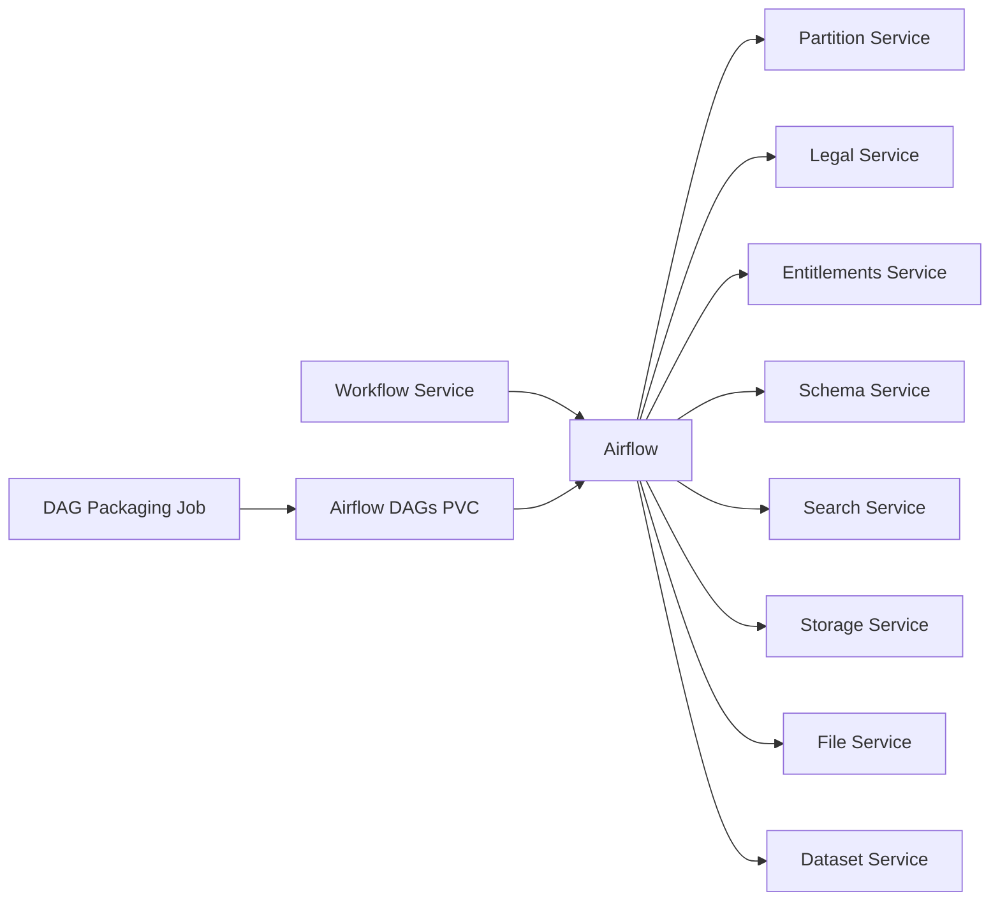

# Workflow Service

<cite>
**Referenced Files in This Document**
- [services_core_workflow.md](file://docs/src/services_core_workflow.md)
- [services_core.md](file://docs/src/services_core.md)
- [release.yaml](file://software/components/airflow/release.yaml)
- [dag-jobs.yaml](file://software/components/airflow/dag-jobs.yaml)
- [workflow-init.yaml](file://charts/osdu-developer-init/templates/workflow-init.yaml)
- [workflow.http](file://tools/rest-scripts/workflow.http)
- [local.http](file://tools/rest-scripts/local.http)
- [dag-manifest-job.yaml](file://charts/airflow-dags/templates/dag-manifest-job.yaml)
- [_helpers.tpl](file://charts/airflow-dags/templates/_helpers.tpl)
- [README.md](file://charts/airflow-dags/scripts/README.md)
</cite>

## Table of Contents
1. [Introduction](#introduction)
2. [Project Structure](#project-structure)
3. [Core Components](#core-components)
4. [Architecture Overview](#architecture-overview)
5. [Detailed Component Analysis](#detailed-component-analysis)
6. [Dependency Analysis](#dependency-analysis)
7. [Performance Considerations](#performance-considerations)
8. [Troubleshooting Guide](#troubleshooting-guide)
9. [Conclusion](#conclusion)
10. [Appendices](#appendices)

## Introduction
This document explains the OSDU Workflow Service that orchestrates business processes using Apache Airflow. It covers workflow definition formats, task orchestration patterns, integration with other services, API endpoints for execution and management, examples for creating custom workflows, handling dependencies, and implementing error recovery. It also addresses scaling considerations, monitoring workflow execution, and debugging failed tasks.

## Project Structure
The Workflow Service is a Spring Boot application that exposes an HTTP API to manage and trigger workflows. Workflows are defined as Airflow DAGs and executed by an Airflow deployment configured via Helm. The repository includes:
- Workflow service configuration and environment variables
- Airflow Helm release with executor, concurrency settings, and environment variables
- DAG packaging jobs that download and deploy DAG artifacts into Airflow’s persistent storage
- Initialization scripts that register system workflows via the Workflow Service API
- REST client samples demonstrating how to call the Workflow Service APIs

**Diagram sources**
- [release.yaml:41-130](file://software/components/airflow/release.yaml#L41-L130)
- [dag-jobs.yaml:41-56](file://software/components/airflow/dag-jobs.yaml#L41-L56)
- [dag-manifest-job.yaml:1-108](file://charts/airflow-dags/templates/dag-manifest-job.yaml#L1-L108)

**Section sources**
- [release.yaml:41-130](file://software/components/airflow/release.yaml#L41-L130)
- [dag-jobs.yaml:41-56](file://software/components/airflow/dag-jobs.yaml#L41-L56)
- [dag-manifest-job.yaml:1-108](file://charts/airflow-dags/templates/dag-manifest-job.yaml#L1-L108)

## Core Components
- Workflow Service (Spring Boot): Exposes REST endpoints to list, create, run, and delete workflows; integrates with Airflow to execute DAGs.
- Apache Airflow: Orchestrates DAG execution using KubernetesExecutor; configured with high concurrency and external database.
- DAG Packaging Jobs: Download DAG archives from remote repositories and place them into Airflow’s DAG volume.
- Initialization Job: Registers system workflows with the Workflow Service during deployment.

Key responsibilities:
- Workflow Service: API surface, authentication context propagation, partition scoping, and Airflow invocation.
- Airflow: Scheduling, execution, retries, and observability hooks.
- DAG Packaging: Reliable delivery of DAG code to Airflow.
- Init Job: Declarative registration of system workflows.

**Section sources**
- [services_core_workflow.md:1-39](file://docs/src/services_core_workflow.md#L1-L39)
- [release.yaml:41-130](file://software/components/airflow/release.yaml#L41-L130)
- [dag-jobs.yaml:41-56](file://software/components/airflow/dag-jobs.yaml#L41-L56)
- [workflow-init.yaml:53-126](file://charts/osdu-developer-init/templates/workflow-init.yaml#L53-L126)

## Architecture Overview
The Workflow Service acts as the entry point for users and systems to define and run workflows. It delegates execution to Airflow, which runs DAGs composed of tasks that call OSDU core services. DAGs are packaged and deployed via Kubernetes Jobs that write to a shared PVC consumed by Airflow.

**Diagram sources**
- [workflow.http:59-115](file://tools/rest-scripts/workflow.http#L59-L115)
- [release.yaml:133-201](file://software/components/airflow/release.yaml#L133-L201)

**Section sources**
- [workflow.http:59-115](file://tools/rest-scripts/workflow.http#L59-L115)
- [release.yaml:133-201](file://software/components/airflow/release.yaml#L133-L201)

## Detailed Component Analysis

### Workflow Service API Endpoints
The following endpoints are demonstrated in the repository’s REST client samples:
- GET /api/workflow/v1/info
- GET /api/workflow/v1/workflow
- POST /api/workflow/v1/workflow/{name}/workflowRun
- DELETE /api/workflow/v1/workflow/{name}
- POST /api/workflow/v1/workflow/system (system workflow registration)

Authentication and scoping:
- Authorization: Bearer token required on all requests
- data-partition-id header for multi-tenant partitioning

Request/response patterns:
- Execution requests include an executionContext object passed into the DAG run
- Responses return identifiers and status information for tracking

Examples are provided in:
- tools/rest-scripts/workflow.http
- tools/rest-scripts/local.http

**Section sources**
- [workflow.http:59-115](file://tools/rest-scripts/workflow.http#L59-L115)
- [local.http:380-411](file://tools/rest-scripts/local.http#L380-L411)
- [workflow-init.yaml:90-108](file://charts/osdu-developer-init/templates/workflow-init.yaml#L90-L108)

### Airflow Configuration and Concurrency
Airflow is deployed via Helm with:
- KubernetesExecutor for scalable task execution
- High concurrency settings for parallelism and DAG scheduling
- External PostgreSQL database and Redis disabled
- Environment variables injected for service endpoints and secrets
- Persistent DAG storage via PVC

These settings enable horizontal scaling and robust execution under load.

**Section sources**
- [release.yaml:41-130](file://software/components/airflow/release.yaml#L41-L130)
- [release.yaml:133-201](file://software/components/airflow/release.yaml#L133-L201)
- [release.yaml:219-240](file://software/components/airflow/release.yaml#L219-L240)

### DAG Packaging and Deployment
DAGs are delivered to Airflow through Jobs that:
- Download DAG archives from remote URLs
- Optionally compress contents into ZIP
- Write to a shared PVC mounted by Airflow
- Use retry logic for downloads

Configuration values control which DAG sets are enabled and where they are sourced.

**Section sources**
- [dag-jobs.yaml:41-56](file://software/components/airflow/dag-jobs.yaml#L41-L56)
- [dag-manifest-job.yaml:1-108](file://charts/airflow-dags/templates/dag-manifest-job.yaml#L1-L108)
- [_helpers.tpl:84-101](file://charts/airflow-dags/templates/_helpers.tpl#L84-L101)
- [README.md:22-68](file://charts/airflow-dags/scripts/README.md#L22-L68)

### System Workflow Registration
During initialization, a Job registers system workflows by calling the Workflow Service API with:
- workflowName and description
- registrationInstructions including active flag, dagName, and concurrency limits

This ensures that system-level DAGs are available for execution post-deployment.

**Section sources**
- [workflow-init.yaml:53-126](file://charts/osdu-developer-init/templates/workflow-init.yaml#L53-L126)

### Integration with OSDU Core Services
Airflow tasks integrate with core services via environment variables pointing to internal cluster endpoints:
- Partition, Legal, Entitlements, Schema, Search, Storage, File, Dataset, and Workflow services

These variables are injected into the Airflow environment so tasks can call services securely within the cluster.

**Section sources**
- [release.yaml:133-201](file://software/components/airflow/release.yaml#L133-L201)

## Dependency Analysis
The Workflow Service depends on Airflow for execution, while Airflow depends on OSDU core services for data operations. DAG packaging jobs depend on network access to fetch DAG archives and write to persistent volumes.

**Diagram sources**
- [release.yaml:133-201](file://software/components/airflow/release.yaml#L133-L201)
- [dag-jobs.yaml:41-56](file://software/components/airflow/dag-jobs.yaml#L41-L56)

**Section sources**
- [release.yaml:133-201](file://software/components/airflow/release.yaml#L133-L201)
- [dag-jobs.yaml:41-56](file://software/components/airflow/dag-jobs.yaml#L41-L56)

## Performance Considerations
- Concurrency: Airflow is configured with high parallelism and DAG concurrency to support large-scale workloads.
- Executor: KubernetesExecutor enables dynamic pod creation per task, improving scalability.
- Persistence: DAGs and logs are persisted to PVCs to survive pod restarts and facilitate debugging.
- External Database: Using an external PostgreSQL instance decouples metadata storage from compute resources.
- Network: Ensure service endpoints are reachable within the cluster and consider Istio policies for secure communication.

[No sources needed since this section provides general guidance]

## Troubleshooting Guide
Common issues and steps:
- Authentication failures: Verify Bearer tokens and partition headers in API calls.
- DAG not found: Confirm DAG name matches the registered workflow and that DAG packaging completed successfully.
- Task failures: Inspect Airflow logs and task instances; check service endpoint connectivity and credentials.
- DAG packaging errors: Review job logs for download retries and PVC write permissions.

Useful references:
- REST client samples demonstrate correct headers and payloads.
- DAG packaging job templates include retry logic and verbose logging.

**Section sources**
- [workflow.http:59-115](file://tools/rest-scripts/workflow.http#L59-L115)
- [dag-manifest-job.yaml:60-108](file://charts/airflow-dags/templates/dag-manifest-job.yaml#L60-L108)

## Conclusion
The OSDU Workflow Service provides a unified API to define, manage, and execute business workflows backed by Apache Airflow. With configurable concurrency, reliable DAG packaging, and tight integration with OSDU core services, it supports scalable and observable process orchestration. Proper use of authentication, partitioning, and monitoring practices ensures robust operation in production environments.

[No sources needed since this section summarizes without analyzing specific files]

## Appendices

### Example: Creating a Custom Workflow
- Register a new workflow via the system registration endpoint with a unique dagName and desired concurrency limits.
- Package your DAGs and ensure they are deployed to Airflow’s DAG volume.
- Execute the workflow by calling the run endpoint with an executionContext containing parameters for your DAG.

**Section sources**
- [workflow-init.yaml:90-108](file://charts/osdu-developer-init/templates/workflow-init.yaml#L90-L108)
- [workflow.http:59-115](file://tools/rest-scripts/workflow.http#L59-L115)

### Example: Handling Dependencies and Error Recovery
- Define task dependencies within your DAG to enforce ordering.
- Configure retries and backoff in Airflow tasks for transient failures.
- Use Airflow’s built-in alerting and logging to detect and recover from errors.

[No sources needed since this section provides general guidance]

### Monitoring and Debugging
- Monitor Airflow UI and metrics for scheduler and worker health.
- Check task logs in Airflow for detailed failure traces.
- Validate service endpoints and secrets via environment variables and secrets management.

**Section sources**
- [release.yaml:104-130](file://software/components/airflow/release.yaml#L104-L130)
- [release.yaml:219-240](file://software/components/airflow/release.yaml#L219-L240)