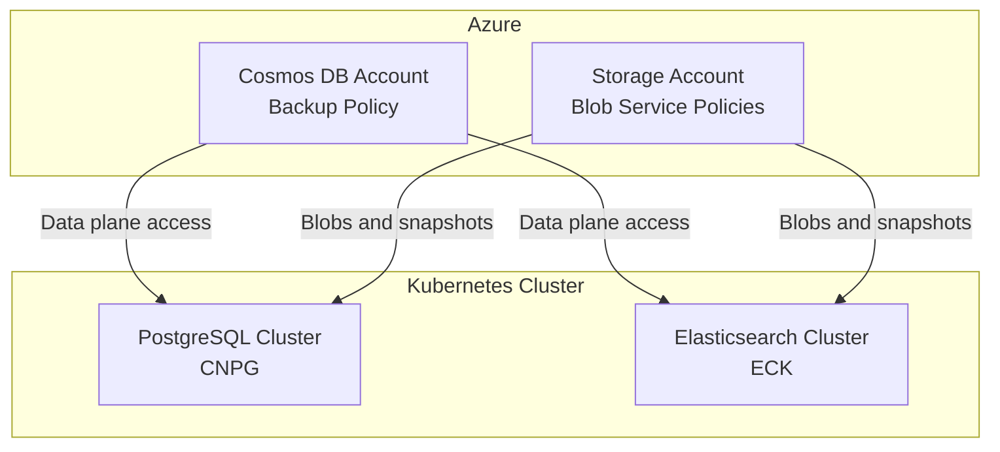
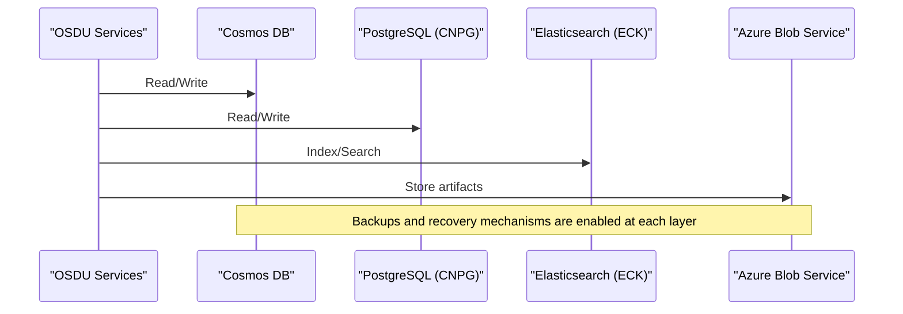
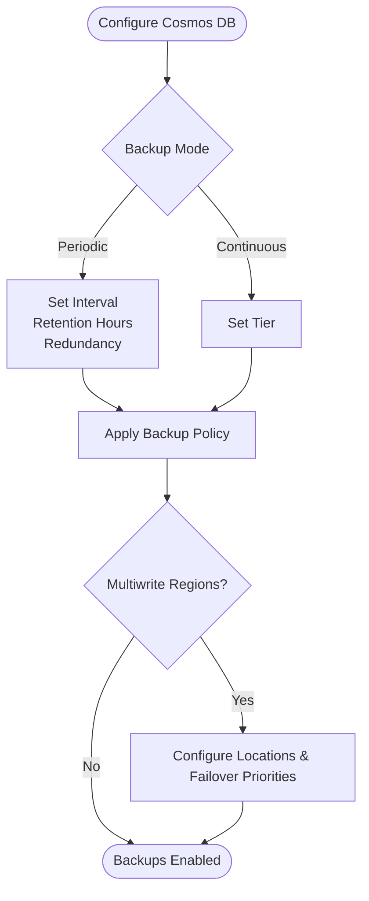
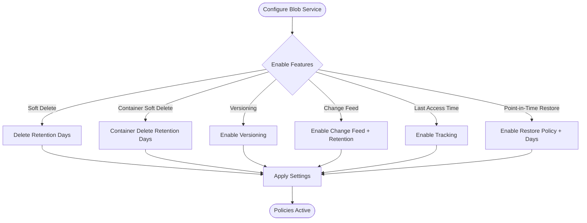
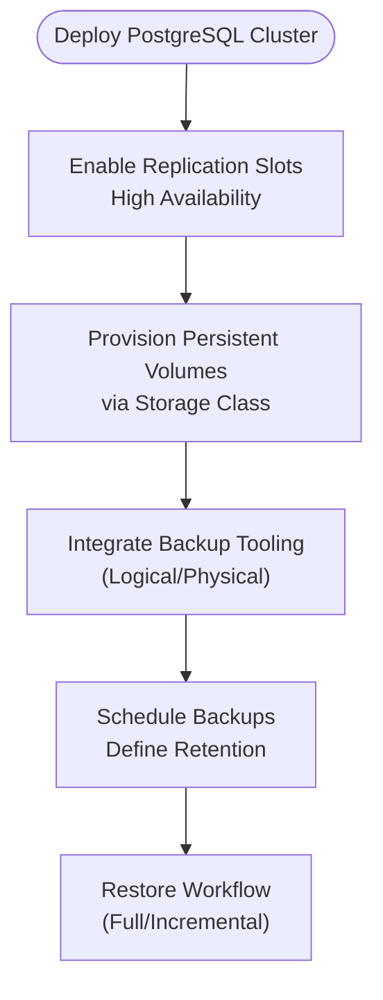
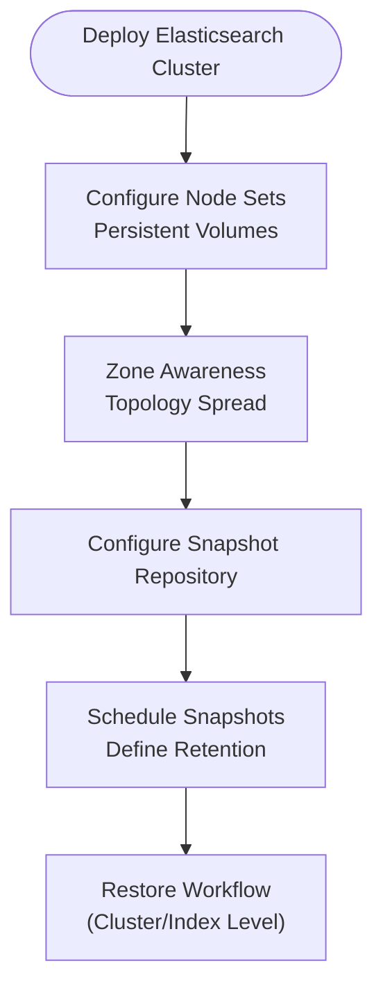
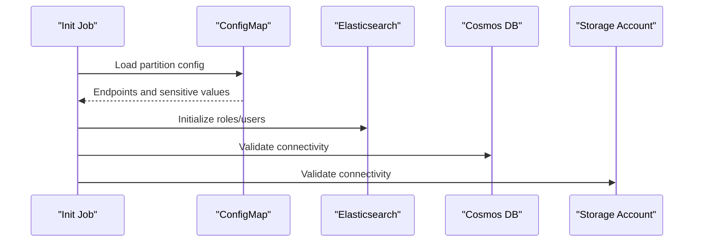
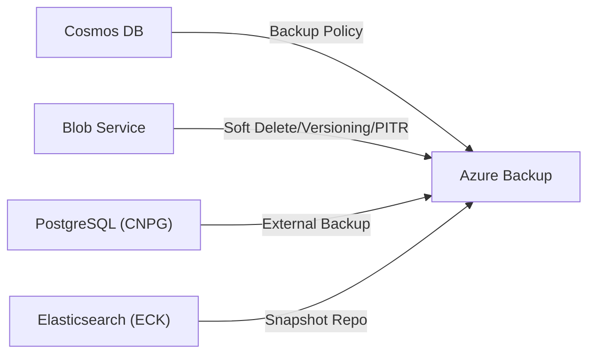

# Backup and Recovery Procedures

<cite>
**Referenced Files in This Document**
- [main.bicep](file://bicep/modules/cosmos-db/main.bicep)
- [README.md](file://bicep/modules/cosmos-db/README.md)
- [blob-service main.bicep](file://bicep/modules/storage-account/blob-service/main.bicep)
- [postgresql.yaml](file://software/components/database/postgresql.yaml)
- [elastic-search.yaml](file://software/components/elastic-search/elastic-search.yaml)
- [storage-class.yaml](file://software/components/elastic-storage/storage-class.yaml)
- [partition-init.yaml](file://charts/osdu-developer-init/templates/partition-init.yaml)
- [local.http](file://tools/rest-scripts/local.http)
- [partition.http](file://tools/rest-scripts/partition.http)
</cite>

## Table of Contents
1. [Introduction](#introduction)
2. [Project Structure](#project-structure)
3. [Core Components](#core-components)
4. [Architecture Overview](#architecture-overview)
5. [Detailed Component Analysis](#detailed-component-analysis)
6. [Dependency Analysis](#dependency-analysis)
7. [Performance Considerations](#performance-considerations)
8. [Troubleshooting Guide](#troubleshooting-guide)
9. [Conclusion](#conclusion)
10. [Appendices](#appendices)

## Introduction
This document provides comprehensive backup and recovery procedures for the OSDU platform components, focusing on automated strategies for Azure Cosmos DB, PostgreSQL (in-cluster), Elasticsearch (in-cluster), and Azure Storage accounts. It covers disaster recovery workflows, point-in-time recovery options, retention policies, cross-region replication considerations, and configuration backups for production environments. The guidance is grounded in the repository’s infrastructure-as-code and Kubernetes manifests to ensure operational alignment with the deployed environment.

## Project Structure
The repository defines:
- Azure resources via Bicep modules for Cosmos DB and Storage Account Blob Service
- In-cluster data stores via Kubernetes manifests for PostgreSQL and Elasticsearch
- Configuration templates and scripts that reference service endpoints and credentials

**Diagram sources**
- [main.bicep:101-131](file://bicep/modules/cosmos-db/main.bicep#L101-L131)
- [blob-service main.bicep:75-117](file://bicep/modules/storage-account/blob-service/main.bicep#L75-L117)
- [postgresql.yaml:1-89](file://software/components/database/postgresql.yaml#L1-L89)
- [elastic-search.yaml:1-89](file://software/components/elastic-search/elastic-search.yaml#L1-L89)

**Section sources**
- [main.bicep:101-131](file://bicep/modules/cosmos-db/main.bicep#L101-L131)
- [blob-service main.bicep:75-117](file://bicep/modules/storage-account/blob-service/main.bicep#L75-L117)
- [postgresql.yaml:1-89](file://software/components/database/postgresql.yaml#L1-L89)
- [elastic-search.yaml:1-89](file://software/components/elastic-search/elastic-search.yaml#L1-L89)

## Core Components
- Azure Cosmos DB: Configured with backup policy parameters supporting periodic or continuous modes, retention intervals, and storage redundancy. Multi-region write locations can be configured for cross-region resilience.
- Azure Storage (Blob Service): Supports soft delete, container soft delete, versioning, change feed, last access time tracking, and optional point-in-time restore policy.
- PostgreSQL (CNPG): Deployed as a managed cluster with replication slots and high availability settings; persistent volumes are provisioned via storage classes.
- Elasticsearch (ECK): Deployed with node sets, persistent volumes, and zone-aware topology spread constraints.

These components collectively define the foundation for backup scheduling, retention, and recovery strategies.

**Section sources**
- [main.bicep:101-131](file://bicep/modules/cosmos-db/main.bicep#L101-L131)
- [blob-service main.bicep:75-117](file://bicep/modules/storage-account/blob-service/main.bicep#L75-L117)
- [postgresql.yaml:1-89](file://software/components/database/postgresql.yaml#L1-L89)
- [elastic-search.yaml:1-89](file://software/components/elastic-search/elastic-search.yaml#L1-L89)

## Architecture Overview
The backup and recovery architecture integrates Azure-native capabilities with in-cluster data stores:
- Cosmos DB uses built-in backup policies (periodic or continuous) with configurable retention and redundancy.
- Storage Account Blob Service offers soft delete, versioning, change feed, and optional point-in-time restore.
- PostgreSQL relies on CNPG-managed clusters with replication and persistent storage; external backup tooling typically leverages CNPG features.
- Elasticsearch relies on ECK-managed clusters with persistent volumes; external backup tooling typically leverages snapshot repositories.

[No sources needed since this diagram shows conceptual workflow, not actual code structure]

## Detailed Component Analysis

### Azure Cosmos DB Backup and Recovery
- Backup modes: Periodic or Continuous
  - Periodic mode supports configurable interval and retention hours, plus storage redundancy options.
  - Continuous mode supports tiered retention windows.
- Cross-region replication: Multiwrite regions can be configured to enable multi-region writes and failover priorities.
- Diagnostics: Logs and metrics can be streamed to diagnostic destinations for observability.

**Diagram sources**
- [main.bicep:101-131](file://bicep/modules/cosmos-db/main.bicep#L101-L131)
- [main.bicep:269-307](file://bicep/modules/cosmos-db/main.bicep#L269-L307)

**Section sources**
- [main.bicep:101-131](file://bicep/modules/cosmos-db/main.bicep#L101-L131)
- [main.bicep:269-307](file://bicep/modules/cosmos-db/main.bicep#L269-L307)
- [README.md:9-52](file://bicep/modules/cosmos-db/README.md#L9-L52)

### Azure Storage Account (Blob Service) Backup and Recovery
- Soft delete and container soft delete: Retain deleted blobs/shares for a configurable number of days.
- Versioning: Maintain previous versions of blobs.
- Change feed: Enable event logging for downstream processing.
- Last access time tracking: Track blob access patterns.
- Point-in-time restore: Optional restore policy with a defined window.

**Diagram sources**
- [blob-service main.bicep:75-117](file://bicep/modules/storage-account/blob-service/main.bicep#L75-L117)

**Section sources**
- [blob-service main.bicep:75-117](file://bicep/modules/storage-account/blob-service/main.bicep#L75-L117)

### PostgreSQL (CNPG) Backup and Recovery
- Cluster configuration includes replication slots and high availability settings.
- Persistent volumes are provisioned using storage classes for durability.
- External backup tooling typically integrates with CNPG to perform logical or physical backups and restores.

**Diagram sources**
- [postgresql.yaml:1-89](file://software/components/database/postgresql.yaml#L1-L89)
- [storage-class.yaml:1-13](file://software/components/elastic-storage/storage-class.yaml#L1-L13)

**Section sources**
- [postgresql.yaml:1-89](file://software/components/database/postgresql.yaml#L1-L89)
- [storage-class.yaml:1-13](file://software/components/elastic-storage/storage-class.yaml#L1-L13)

### Elasticsearch (ECK) Backup and Recovery
- Cluster configuration includes node sets, persistent volumes, and zone-aware distribution.
- External backup tooling typically integrates with ECK to create and manage snapshot repositories and perform restores.

**Diagram sources**
- [elastic-search.yaml:1-89](file://software/components/elastic-search/elastic-search.yaml#L1-L89)

**Section sources**
- [elastic-search.yaml:1-89](file://software/components/elastic-search/elastic-search.yaml#L1-L89)

### Configuration and Secrets Management
- Partition and application configurations reference endpoints and credentials for Elasticsearch, Cosmos DB, and Storage services.
- These references should be backed up as part of configuration management to support restoration and drift detection.

**Diagram sources**
- [partition-init.yaml:57-94](file://charts/osdu-developer-init/templates/partition-init.yaml#L57-L94)
- [local.http:49-98](file://tools/rest-scripts/local.http#L49-L98)
- [partition.http:59-108](file://tools/rest-scripts/partition.http#L59-L108)

**Section sources**
- [partition-init.yaml:57-94](file://charts/osdu-developer-init/templates/partition-init.yaml#L57-L94)
- [local.http:49-98](file://tools/rest-scripts/local.http#L49-L98)
- [partition.http:59-108](file://tools/rest-scripts/partition.http#L59-L108)

## Dependency Analysis
- Cosmos DB backup policy depends on selected mode (Periodic/Continuous) and associated parameters.
- Storage Account Blob Service policies depend on enabling soft delete/versioning/change feed and optional point-in-time restore.
- PostgreSQL and Elasticsearch rely on persistent storage classes and external backup integrations.

[No sources needed since this diagram shows conceptual relationships, not direct code mappings]

**Section sources**
- [main.bicep:101-131](file://bicep/modules/cosmos-db/main.bicep#L101-L131)
- [blob-service main.bicep:75-117](file://bicep/modules/storage-account/blob-service/main.bicep#L75-L117)
- [postgresql.yaml:1-89](file://software/components/database/postgresql.yaml#L1-L89)
- [elastic-search.yaml:1-89](file://software/components/elastic-search/elastic-search.yaml#L1-L89)

## Performance Considerations
- Cosmos DB: Choose backup mode based on RPO/RTO needs; continuous mode may incur additional costs but enables finer-grained recovery points.
- Storage Account: Enabling versioning and change feed increases storage usage and throughput; tune retention periods accordingly.
- PostgreSQL/Elasticsearch: Ensure sufficient IOPS and capacity on persistent volumes; schedule backups during low-traffic windows to minimize impact.

[No sources needed since this section provides general guidance]

## Troubleshooting Guide
- Verify backup policies are applied:
  - Cosmos DB: Confirm backup policy type and retention settings.
  - Blob Service: Confirm soft delete, versioning, change feed, and restore policy states.
- Validate connectivity and credentials:
  - Use provided HTTP examples to test endpoints and sensitive values referenced in partition configuration.
- Monitor diagnostics:
  - Ensure logs and metrics are streaming to configured destinations for observability.

**Section sources**
- [main.bicep:101-131](file://bicep/modules/cosmos-db/main.bicep#L101-L131)
- [blob-service main.bicep:75-117](file://bicep/modules/storage-account/blob-service/main.bicep#L75-L117)
- [partition-init.yaml:57-94](file://charts/osdu-developer-init/templates/partition-init.yaml#L57-L94)
- [local.http:49-98](file://tools/rest-scripts/local.http#L49-L98)
- [partition.http:59-108](file://tools/rest-scripts/partition.http#L59-L108)

## Conclusion
The OSDU platform leverages Azure-native backup capabilities for Cosmos DB and Storage, combined with in-cluster data stores managed by CNPG and ECK. By configuring appropriate backup modes, retention policies, and optional point-in-time recovery features, the platform can meet robust RPO/RTO requirements. Integrating external backup tooling for PostgreSQL and Elasticsearch completes the strategy, while configuration backups ensure recoverable system state.

[No sources needed since this section summarizes without analyzing specific files]

## Appendices

### Backup Scheduling and Retention Summary
- Cosmos DB:
  - Periodic: Configure interval and retention hours; choose redundancy level.
  - Continuous: Select tier for extended recovery points.
- Storage Account (Blob Service):
  - Soft delete and container soft delete: Set retention days.
  - Versioning: Enable to maintain historical versions.
  - Change feed: Enable with retention for downstream processing.
  - Point-in-time restore: Enable with a defined restore window.
- PostgreSQL (CNPG):
  - Integrate backup tooling to schedule full/incremental backups and define retention.
- Elasticsearch (ECK):
  - Configure snapshot repository and schedule snapshots with retention policies.

[No sources needed since this section provides general guidance]

### Disaster Recovery Procedures
- Cosmos DB:
  - Use continuous or periodic backups to restore to a specific point-in-time where supported.
  - For multi-region scenarios, leverage configured failover priorities and region settings.
- Storage Account:
  - Restore from soft-deleted items or versions; use point-in-time restore if enabled.
- PostgreSQL:
  - Perform full restore followed by replay of incremental backups to reach target time.
- Elasticsearch:
  - Restore indices or entire cluster from snapshots stored in a repository.

[No sources needed since this section provides general guidance]

### Business Continuity Planning
- Define RPO/RTO targets per component and align backup modes and retention accordingly.
- Automate backup schedules and retention cleanup to reduce manual intervention.
- Regularly test restore procedures to validate effectiveness and update runbooks.

[No sources needed since this section provides general guidance]