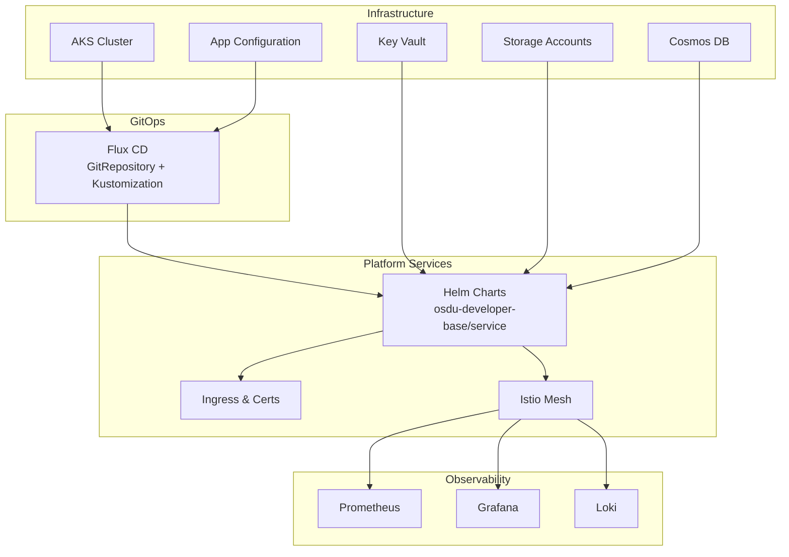
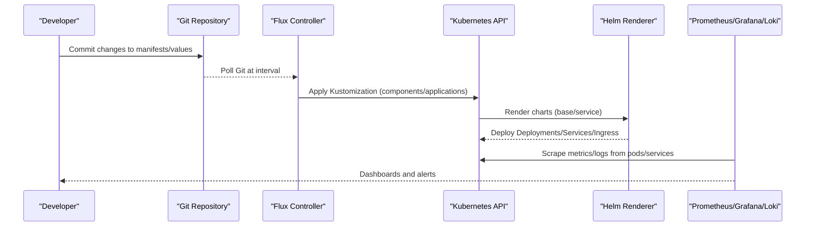
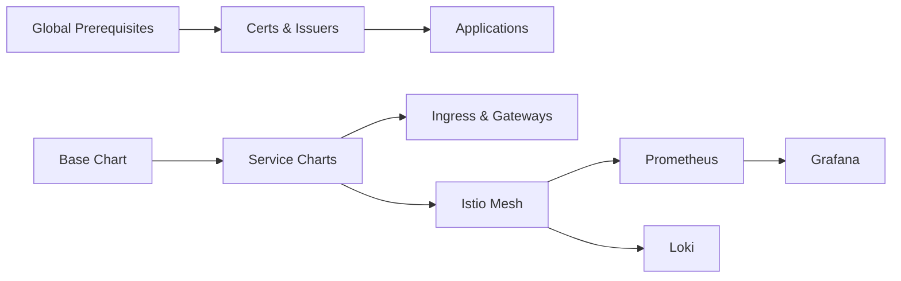

# Deployment and Operations

<cite>
**Referenced Files in This Document**
- [README.md](file://README.md)
- [bicep/README.md](file://bicep/README.md)
- [bicep/main.bicep](file://bicep/main.bicep)
- [bicep/modules/blade_configuration.bicep](file://bicep/modules/blade_configuration.bicep)
- [charts/README.MD](file://charts/README.MD)
- [charts/config-maps/README.md](file://charts/config-maps/README.md)
- [charts/istio-ingress/README.md](file://charts/istio-ingress/README.md)
- [charts/osdu-developer-base/values.yaml](file://charts/osdu-developer-base/values.yaml)
- [charts/osdu-developer-service/values.yaml](file://charts/osdu-developer-service/values.yaml)
- [charts/osdu-developer-service/templates/auth-policy.yaml](file://charts/osdu-developer-service/templates/auth-policy.yaml)
- [charts/osdu-developer-base/templates/resource-limits.yaml](file://charts/osdu-developer-base/templates/resource-limits.yaml)
- [stamp/components/kustomize.yaml](file://stamp/components/kustomize.yaml)
- [software/components/observability/prometheus.yaml](file://software/components/observability/prometheus.yaml)
- [software/components/observability/grafana.yaml](file://software/components/observability/grafana.yaml)
- [software/components/observability/loki.yaml](file://software/components/observability/loki.yaml)
- [software/components/observability/subnet_monitoring.yaml](file://software/components/observability/subnet_monitoring.yaml)
- [docs/src/design_platform.md](file://docs/src/design_platform.md)
- [docs/src/design_infrastructure.md](file://docs/src/design_infrastructure.md)
- [docs/src/index.md](file://docs/src/index.md)
</cite>

## Table of Contents
1. Introduction
2. Project Structure
3. Core Components
4. Architecture Overview
5. Detailed Component Analysis
6. Dependency Analysis
7. Performance Considerations
8. Troubleshooting Guide
9. Conclusion
10. Appendices

## Introduction
This document provides production-grade deployment and operations guidance for the OSDU platform on Azure Kubernetes Service (AKS). It covers Helm chart customization, Kubernetes manifest management, GitOps with Flux CD, scaling strategies, resource optimization, performance tuning, backup and recovery, log management, monitoring setup, troubleshooting methodologies, security hardening, network policies, and compliance considerations. The repository uses Bicep to provision infrastructure, Helm charts to package application components, Kustomize overlays for environment-specific manifests, and Flux CD to continuously reconcile desired state from Git into the cluster.

## Project Structure
The project is organized into several key areas:
- Infrastructure as Code (Bicep): Provisions AKS, networking, storage, databases, identity, and observability resources.
- Application Packaging (Helm Charts): Encapsulates services, ingress, certificates, config maps, and base configurations.
- Manifests and Stamps (Kustomize): Composes component stacks and defines Flux Kustomizations that sync software from a Git repository path.
- Observability Stack: Prometheus, Grafana, Loki, and related integrations deployed via Helm-managed manifests.
- Documentation: MkDocs-based docs describing architecture, features, and operational guides.

**Diagram sources**
- [bicep/README.md:4-86](file://bicep/README.md#L4-L86)
- [bicep/modules/blade_configuration.bicep:494-525](file://bicep/modules/blade_configuration.bicep#L494-L525)
- [stamp/components/kustomize.yaml:21-91](file://stamp/components/kustomize.yaml#L21-L91)
- [software/components/observability/prometheus.yaml:1-554](file://software/components/observability/prometheus.yaml#L1-L554)
- [software/components/observability/grafana.yaml:1-59](file://software/components/observability/grafana.yaml#L1-L59)
- [software/components/observability/loki.yaml:1-290](file://software/components/observability/loki.yaml#L1-L290)

**Section sources**
- [README.md:16-35](file://README.md#L16-L35)
- [bicep/README.md:4-86](file://bicep/README.md#L4-L86)
- [docs/src/index.md:122-136](file://docs/src/index.md#L122-L136)

## Core Components
- Infrastructure provisioning via Bicep modules orchestrates AKS, networking, storage, databases, identity, and observability.
- Helm charts encapsulate reusable application components and base settings, including resource limits, secrets integration, and service exposure.
- Kustomize stamps define Flux Kustomizations that pull manifests from a Git repository path and apply them to the cluster with health checks and pruning.
- Observability stack includes Prometheus for metrics, Grafana for dashboards, and Loki for logs, integrated with AKS monitoring and Istio sidecars.

Key configuration points:
- Default resource requests/limits are templated via a LimitRange to ensure consistent pod scheduling and protection against noisy neighbors.
- Service-level values allow per-service image selection, ingress paths, probes, KeyVault-backed secrets, and environment variables.
- Ingress and certificate management are provided by dedicated Helm charts for Istio gateways and certificate issuance.

**Section sources**
- [charts/osdu-developer-base/values.yaml:1-38](file://charts/osdu-developer-base/values.yaml#L1-L38)
- [charts/osdu-developer-base/templates/resource-limits.yaml:15-27](file://charts/osdu-developer-base/templates/resource-limits.yaml#L15-L27)
- [charts/osdu-developer-service/values.yaml:15-142](file://charts/osdu-developer-service/values.yaml#L15-L142)
- [charts/istio-ingress/README.md:1-15](file://charts/istio-ingress/README.md#L1-L15)
- [charts/config-maps/README.md:1-36](file://charts/config-maps/README.md#L1-L36)

## Architecture Overview
The production architecture combines IaC, GitOps, and a microservices mesh:
- Bicep provisions AKS and supporting Azure services.
- Flux CD watches a Git repository and applies Kustomizations to deploy components and applications.
- Helm charts render Kubernetes objects for services, ingress, and mesh policies.
- Observability tools collect metrics and logs, visualized through Grafana and queried via Loki.

**Diagram sources**
- [bicep/modules/blade_configuration.bicep:494-525](file://bicep/modules/blade_configuration.bicep#L494-L525)
- [stamp/components/kustomize.yaml:21-91](file://stamp/components/kustomize.yaml#L21-L91)
- [software/components/observability/prometheus.yaml:39-196](file://software/components/observability/prometheus.yaml#L39-L196)
- [software/components/observability/grafana.yaml:28-59](file://software/components/observability/grafana.yaml#L28-L59)
- [software/components/observability/loki.yaml:28-75](file://software/components/observability/loki.yaml#L28-L75)

## Detailed Component Analysis

### Helm Chart Customization
- Base chart sets default resource requests/limits via a LimitRange, ensuring all containers without explicit resources receive sensible defaults.
- Service chart allows per-service configuration including replicas, ingress paths, readiness/liveness probes, KeyVault-backed secrets, PVC mounts, and Istio authorization bypass paths.
- Config map chart demonstrates generating ConfigMaps from App Configuration using Azure credentials and workload identity.

Operational tips:
- Use a custom values file per environment to override defaults safely.
- Enable KeyVault-backed secrets where sensitive data must be injected at runtime.
- Configure auth bypass paths for health endpoints or documentation routes to avoid authentication loops.

**Section sources**
- [charts/osdu-developer-base/values.yaml:13-38](file://charts/osdu-developer-base/values.yaml#L13-L38)
- [charts/osdu-developer-base/templates/resource-limits.yaml:15-27](file://charts/osdu-developer-base/templates/resource-limits.yaml#L15-L27)
- [charts/osdu-developer-service/values.yaml:20-142](file://charts/osdu-developer-service/values.yaml#L20-L142)
- [charts/config-maps/README.md:1-36](file://charts/config-maps/README.md#L1-L36)

### Kubernetes Manifest Management with Kustomize and Flux
- Stamp components define Flux Kustomizations that depend on global prerequisites and target specific paths under software/components and software/applications.
- Each Kustomization specifies prune, wait, retry intervals, timeouts, and health checks to ensure reliable reconciliation and safe rollouts.

Best practices:
- Keep component dependencies explicit via dependsOn to control rollout order.
- Use healthChecks to validate critical components before proceeding.
- Set appropriate prune and wait flags to maintain cluster state consistency.

**Section sources**
- [stamp/components/kustomize.yaml:21-91](file://stamp/components/kustomize.yaml#L21-L91)

### GitOps Workflows with Flux CD
- Flux configuration is provisioned via Bicep module, pointing to a Git repository URL, branch/tag, and paths for components and applications.
- Sync intervals and timeouts are configured to balance responsiveness with stability.

Workflow overview:
- Developers commit changes to Git.
- Flux polls the repository and reconciles Kustomizations.
- Kustomizations render and apply manifests, triggering deployments and updates.

**Section sources**
- [bicep/modules/blade_configuration.bicep:494-525](file://bicep/modules/blade_configuration.bicep#L494-L525)

### Scaling Strategies
- Node Auto Provisioning dynamically scales node pools based on pending workloads.
- Horizontal Pod Autoscaler (HPA) can be enabled per service via chart values to scale based on CPU/memory or custom metrics.
- Vertical Pod Autoscaler (VPA) optimizes resource requests/limits based on observed usage patterns.
- Event-driven autoscaling via KEDA supports scaling on external triggers (queues, HTTP, etc.).

Recommendations:
- Start with HPA for predictable workloads; use VPA to right-size requests/limits.
- Leverage KEDA for bursty or event-driven services.
- Monitor autoscaling decisions via metrics and adjust thresholds to avoid flapping.

**Section sources**
- [docs/src/design_platform.md:151-166](file://docs/src/design_platform.md#L151-L166)
- [charts/osdu-developer-service/values.yaml:20-25](file://charts/osdu-developer-service/values.yaml#L20-L25)

### Resource Optimization and Performance Tuning
- LimitRange ensures consistent resource requests/limits across namespaces.
- Tune scrape intervals and retention in Prometheus to balance visibility and storage costs.
- Configure Loki storage and retention policies aligned with log volume and compliance requirements.
- Use readiness and liveness probes to improve reliability and reduce restart storms.

Tuning pointers:
- Adjust Prometheus scrape intervals for high-cardinality environments.
- Set Loki retention periods to meet data lifecycle policies.
- Ensure probes are realistic to avoid false positives during startup or maintenance.

**Section sources**
- [charts/osdu-developer-base/templates/resource-limits.yaml:15-27](file://charts/osdu-developer-base/templates/resource-limits.yaml#L15-L27)
- [software/components/observability/prometheus.yaml:39-48](file://software/components/observability/prometheus.yaml#L39-L48)
- [software/components/observability/loki.yaml:28-75](file://software/components/observability/loki.yaml#L28-L75)

### Backup and Recovery
- Cosmos DB supports periodic or continuous backup modes with configurable intervals and retention.
- Storage accounts can export secrets to Key Vault and enforce network ACLs for secure access.
- Ensure database backups are retained according to compliance and recovery objectives.

Recovery steps:
- Restore Cosmos DB from backup points within retention windows.
- Re-import secrets from Key Vault if needed.
- Validate data integrity post-recovery and re-run initialization jobs if required.

**Section sources**
- [bicep/modules/cosmos-db/main.bicep:281-293](file://bicep/modules/cosmos-db/main.bicep#L281-L293)
- [bicep/modules/blade_partition.bicep:516-545](file://bicep/modules/blade_partition.bicep#L516-L545)

### Log Management
- Loki is deployed with filesystem storage and retention settings suitable for development or small-scale production.
- AKS monitoring integrates with Log Analytics for cluster-level diagnostics and telemetry.
- Fluent Bit annotations can filter logs by pod annotations for selective collection.

Operational guidance:
- Align Loki retention with storage capacity and compliance needs.
- Use Log Analytics queries to correlate logs with metrics and traces.
- Filter noisy logs via annotations to reduce ingestion costs.

**Section sources**
- [software/components/observability/loki.yaml:28-75](file://software/components/observability/loki.yaml#L28-L75)
- [software/components/observability/subnet_monitoring.yaml:70-95](file://software/components/observability/subnet_monitoring.yaml#L70-L95)

### Monitoring Setup
- Prometheus scrapes Kubernetes APIs, nodes, services, and pods with annotation-driven discovery.
- Grafana is preconfigured with Prometheus and Loki datasources for unified dashboards.
- Istio integration enables mesh observability via Kiali and metrics exposed by sidecars.

Setup checklist:
- Verify Prometheus scrape targets are healthy and collecting metrics.
- Create Grafana dashboards for SLOs and error budgets.
- Enable Kiali for traffic visualization and latency analysis.

**Section sources**
- [software/components/observability/prometheus.yaml:39-196](file://software/components/observability/prometheus.yaml#L39-L196)
- [software/components/observability/grafana.yaml:28-59](file://software/components/observability/grafana.yaml#L28-L59)

### Security Hardening and Network Policies
- Istio AuthorizationPolicy can deny unauthenticated requests except for explicitly allowed paths (e.g., health checks).
- Storage account network ACLs restrict access to trusted IPs and services; default actions should be tightened to Deny in production.
- Use workload identity and Key Vault for secret management instead of embedding credentials in manifests.

Hardening recommendations:
- Enforce least privilege RBAC roles for service accounts.
- Restrict egress traffic via network policies and firewall rules.
- Rotate secrets regularly and audit access via Key Vault logs.

**Section sources**
- [charts/osdu-developer-service/templates/auth-policy.yaml:1-28](file://charts/osdu-developer-service/templates/auth-policy.yaml#L1-L28)
- [bicep/modules/blade_partition.bicep:516-531](file://bicep/modules/blade_partition.bicep#L516-L531)

### Compliance Requirements
- Configure backup policies and retention to meet regulatory obligations.
- Enable diagnostic logs and stream to Log Analytics for auditability.
- Use private endpoints and restricted network access to minimize exposure.

Compliance checklist:
- Review data residency and encryption settings.
- Validate role assignments align with least privilege principles.
- Periodically audit access logs and configuration drift.

**Section sources**
- [bicep/modules/cosmos-db/main.bicep:281-293](file://bicep/modules/cosmos-db/main.bicep#L281-L293)
- [docs/src/design_infrastructure.md:111-169](file://docs/src/design_infrastructure.md#L111-L169)

## Dependency Analysis
Component relationships and coupling:
- Flux Kustomizations depend on global prerequisites (certs, issuers) before deploying applications.
- Helm-rendered services rely on base configurations for resource limits and secrets injection.
- Observability components depend on Istio sidecars and annotated services for metrics and logs.

**Diagram sources**
- [stamp/components/kustomize.yaml:21-91](file://stamp/components/kustomize.yaml#L21-L91)
- [charts/osdu-developer-base/values.yaml:1-38](file://charts/osdu-developer-base/values.yaml#L1-L38)
- [software/components/observability/prometheus.yaml:39-196](file://software/components/observability/prometheus.yaml#L39-L196)
- [software/components/observability/grafana.yaml:28-59](file://software/components/observability/grafana.yaml#L28-L59)
- [software/components/observability/loki.yaml:28-75](file://software/components/observability/loki.yaml#L28-L75)

**Section sources**
- [stamp/components/kustomize.yaml:21-91](file://stamp/components/kustomize.yaml#L21-L91)
- [charts/osdu-developer-base/values.yaml:1-38](file://charts/osdu-developer-base/values.yaml#L1-L38)

## Performance Considerations
- Right-size pods using VPA recommendations and monitor resource utilization via Prometheus.
- Tune scrape intervals and retention to balance observability depth with cost.
- Use HPA/KEDA to handle variable loads efficiently and avoid overprovisioning.
- Optimize network policies and DNS resolution to reduce latency.

[No sources needed since this section provides general guidance]

## Troubleshooting Guide
Common operational scenarios and diagnostics:
- Service not reachable: Check Istio AuthorizationPolicy and ingress routing; verify health endpoints are excluded from auth when necessary.
- High memory/CPU usage: Inspect Prometheus metrics and Grafana dashboards; adjust resource requests/limits and consider autoscaling.
- Logs missing: Confirm Fluent Bit annotations and Loki configuration; validate log collection settings in AKS monitoring.
- Backup issues: Review Cosmos DB backup policy and retention; ensure storage account ACLs permit required access.

Diagnostic tools:
- kubectl describe/get for resources and events.
- Prometheus query explorer for metrics analysis.
- Grafana dashboards for trend analysis and alerting.
- Loki log queries for filtering and correlation.

**Section sources**
- [charts/osdu-developer-service/templates/auth-policy.yaml:1-28](file://charts/osdu-developer-service/templates/auth-policy.yaml#L1-L28)
- [software/components/observability/prometheus.yaml:39-196](file://software/components/observability/prometheus.yaml#L39-L196)
- [software/components/observability/grafana.yaml:28-59](file://software/components/observability/grafana.yaml#L28-L59)
- [software/components/observability/loki.yaml:28-75](file://software/components/observability/loki.yaml#L28-L75)

## Conclusion
This guide outlines a robust production deployment model for OSDU on AKS using Bicep, Helm, Kustomize, and Flux CD. By following the recommended practices for scaling, resource optimization, monitoring, logging, backup/recovery, and security hardening, teams can operate a compliant and performant platform. Continuous reconciliation via GitOps ensures consistent state and simplifies change management.

[No sources needed since this section summarizes without analyzing specific files]

## Appendices

### Appendix A: Helm Chart Quick Reference
- Base chart: Default resource limits via LimitRange.
- Service chart: Per-service images, probes, secrets, env vars, and auth bypass paths.
- Ingress chart: Gateway and certificate configuration.

**Section sources**
- [charts/osdu-developer-base/values.yaml:13-38](file://charts/osdu-developer-base/values.yaml#L13-L38)
- [charts/osdu-developer-service/values.yaml:20-142](file://charts/osdu-developer-service/values.yaml#L20-L142)
- [charts/istio-ingress/README.md:1-15](file://charts/istio-ingress/README.md#L1-L15)

### Appendix B: Flux Kustomization Example
- Defines component/application paths, dependencies, pruning, waits, and health checks.

**Section sources**
- [stamp/components/kustomize.yaml:21-91](file://stamp/components/kustomize.yaml#L21-L91)

### Appendix C: Observability Configuration Highlights
- Prometheus scrape configs and retention.
- Grafana datasources for Prometheus and Loki.
- Loki single-binary deployment with retention and storage settings.

**Section sources**
- [software/components/observability/prometheus.yaml:39-196](file://software/components/observability/prometheus.yaml#L39-L196)
- [software/components/observability/grafana.yaml:28-59](file://software/components/observability/grafana.yaml#L28-L59)
- [software/components/observability/loki.yaml:28-75](file://software/components/observability/loki.yaml#L28-L75)