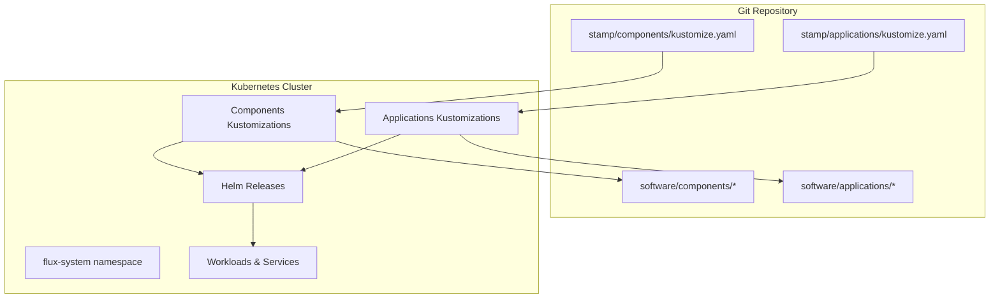
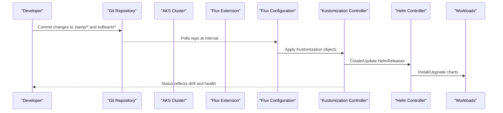
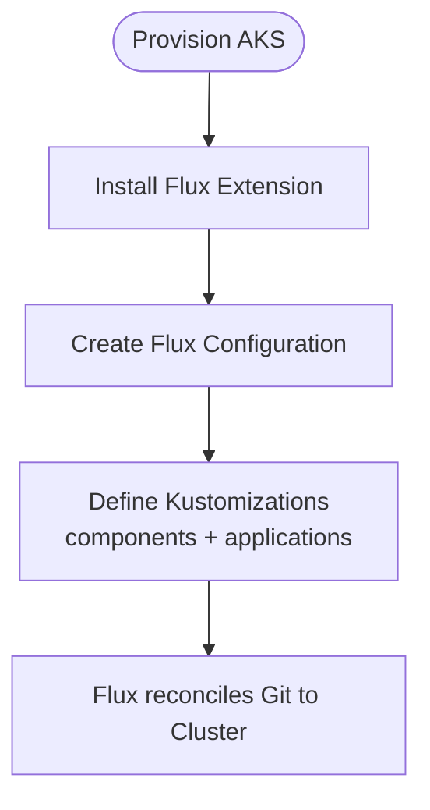
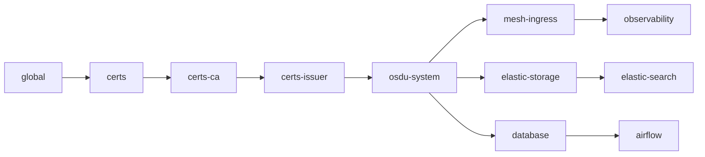
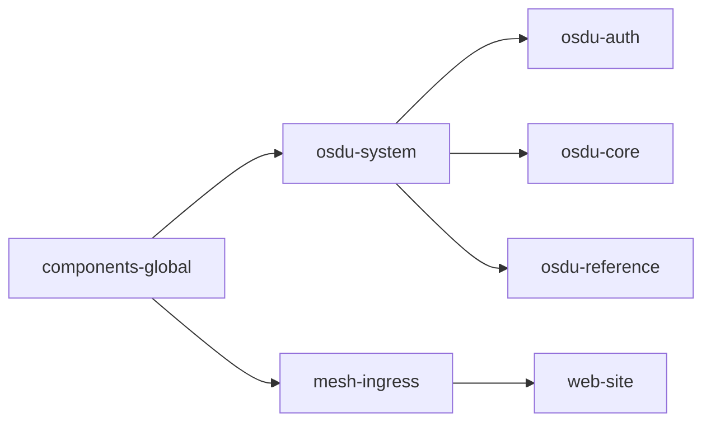
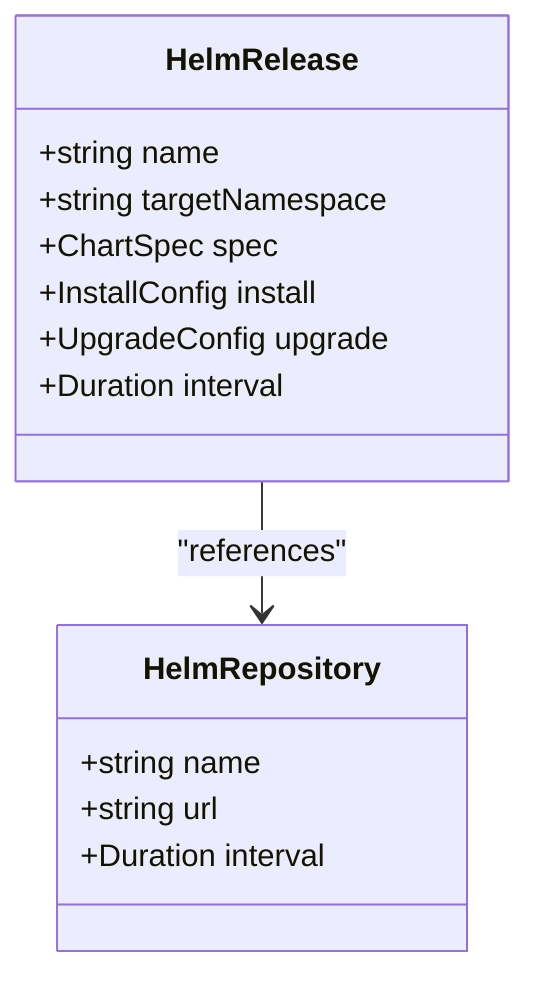
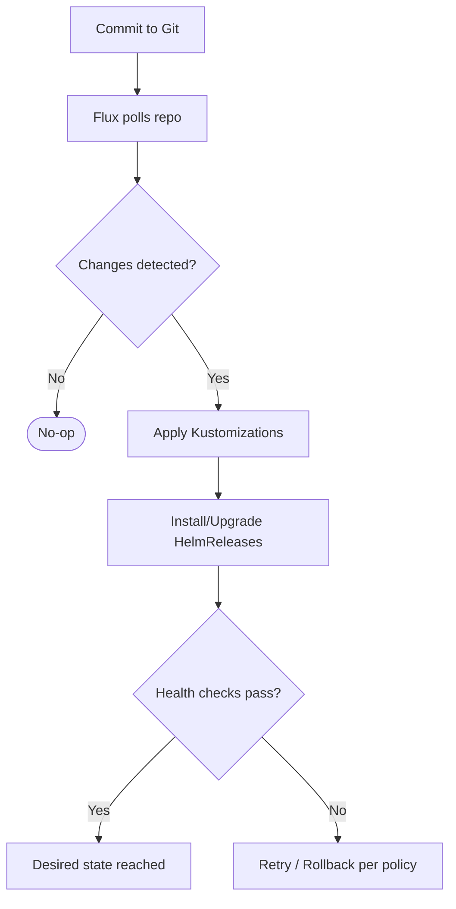
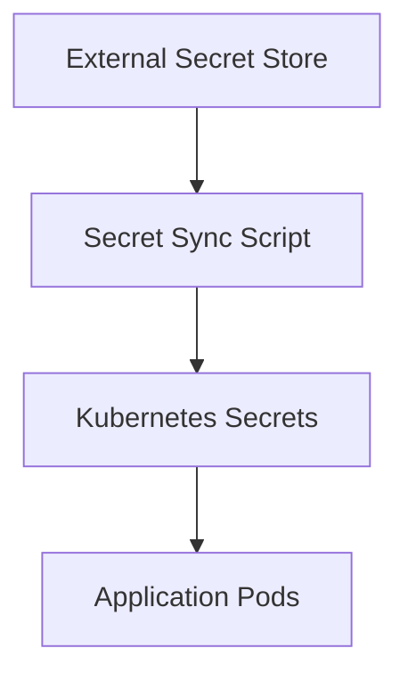
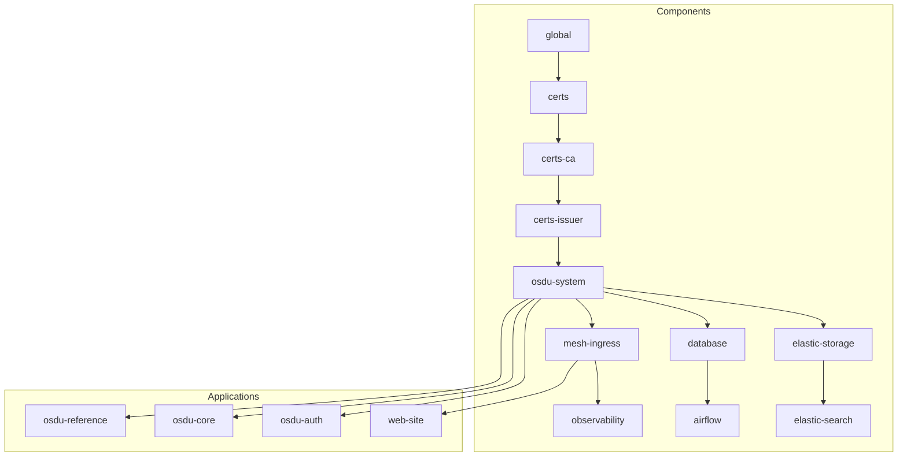

# GitOps with Flux CD

<cite>
**Referenced Files in This Document**
- [main.bicep](file://bicep/modules/flux-configuration/main.bicep)
- [main.bicep](file://bicep/modules/flux-extension/main.bicep)
- [blade_configuration.bicep](file://bicep/modules/blade_configuration.bicep)
- [kustomize.yaml](file://stamp/components/kustomize.yaml)
- [kustomize.yaml](file://stamp/applications/kustomize.yaml)
- [source.yaml](file://software/components/global/source.yaml)
- [release.yaml](file://software/components/global/release.yaml)
- [source.yaml](file://software/components/airflow/source.yaml)
- [release.yaml](file://software/components/airflow/release.yaml)
- [script.sh](file://bicep/modules/software-upload/script.sh)
- [README.md](file://software/components/README.md)
- [index.md](file://docs/src/index.md)
</cite>

## Table of Contents
1. Introduction
2. Project Structure
3. Core Components
4. Architecture Overview
5. Detailed Component Analysis
6. Dependency Analysis
7. Performance Considerations
8. Troubleshooting Guide
9. Conclusion

## Introduction
This document explains how the repository implements GitOps using Flux CD to declaratively manage applications and platform components on Kubernetes. It covers installation via Azure Bicep modules, repository structure for components and applications, synchronization workflows, version management, rollbacks, CI/CD integration points, multi-environment strategies, secret handling with Kubernetes Secrets, monitoring of Flux operations, troubleshooting, and best practices.

The project uses:
- Azure Bicep to provision AKS and configure the Flux extension and Flux Configuration resources
- Flux Kustomization objects to reconcile component and application directories from a Git repository
- HelmRelease and HelmRepository resources to install and update Helm charts
- Health checks and dependency ordering to ensure reliable rollout across layers

**Section sources**
- [index.md:122-136](file://docs/src/index.md#L122-L136)

## Project Structure
At a high level, the repository separates infrastructure provisioning (Bicep), GitOps manifests (Flux Kustomizations), and software definitions (components and applications). The key layout relevant to Flux is:
- stamp/components/kustomize.yaml: Defines Flux Kustomizations that reconcile software/components/* into the cluster
- stamp/applications/kustomize.yaml: Defines Flux Kustomizations that reconcile software/applications/* into the cluster
- software/components/*: Contains per-component manifests (namespaces, releases, sources, secrets)
- software/applications/*: Contains per-application manifests (namespaces, releases, ingress/routes)
- bicep/modules/*: Provisions AKS, installs the Flux extension, and creates a Flux Configuration pointing to the Git source

**Diagram sources**
- [kustomize.yaml:1-306](file://stamp/components/kustomize.yaml#L1-L306)
- [kustomize.yaml:1-205](file://stamp/applications/kustomize.yaml#L1-L205)

**Section sources**
- [kustomize.yaml:1-306](file://stamp/components/kustomize.yaml#L1-L306)
- [kustomize.yaml:1-205](file://stamp/applications/kustomize.yaml#L1-L205)

## Core Components
- Flux Extension and Configuration: Provisioned via Bicep to connect the AKS cluster to a Git repository and define top-level Kustomizations.
- Components Layer: Infrastructure and middleware (certs, mesh, databases, observability) reconciled by dedicated Kustomizations with health checks.
- Applications Layer: Platform services (OSDU core, auth, reference data, web site) reconciled by application Kustomizations with dependencies on components.
- Helm Integration: HelmRepository and HelmRelease resources manage third-party charts (e.g., Airflow, Blob CSI Driver).

Key responsibilities:
- Declarative desired state stored in Git
- Periodic reconciliation with configurable intervals and timeouts
- Pruning of orphaned resources
- Health checks to gate progression

**Section sources**
- [main.bicep:77-91](file://bicep/modules/flux-configuration/main.bicep#L77-L91)
- [main.bicep:65-88](file://bicep/modules/flux-extension/main.bicep#L65-L88)
- [kustomize.yaml:1-306](file://stamp/components/kustomize.yaml#L1-L306)
- [kustomize.yaml:1-205](file://stamp/applications/kustomize.yaml#L1-L205)

## Architecture Overview
The deployment flow starts with Bicep provisioning the AKS cluster and installing the Flux extension. A Flux Configuration resource then points to a Git repository containing Kustomization manifests. Flux continuously reconciles those Kustomizations to apply components first, then applications, ensuring correct ordering and health.

**Diagram sources**
- [blade_configuration.bicep:494-525](file://bicep/modules/blade_configuration.bicep#L494-L525)
- [kustomize.yaml:1-306](file://stamp/components/kustomize.yaml#L1-L306)
- [kustomize.yaml:1-205](file://stamp/applications/kustomize.yaml#L1-L205)

## Detailed Component Analysis

### Flux Installation and Initialization via Bicep
- The Flux extension is installed on the AKS cluster using a Bicep module that configures extension settings and optional release/target namespaces.
- A Flux Configuration resource is created to point to a Git repository, specifying sync intervals, timeouts, and kustomization paths for components and applications.
- The configuration supports different source kinds (GitRepository or Bucket/AzureBlob) and can suspend reconciliation if needed.

**Diagram sources**
- [main.bicep:65-88](file://bicep/modules/flux-extension/main.bicep#L65-L88)
- [main.bicep:77-91](file://bicep/modules/flux-configuration/main.bicep#L77-L91)
- [blade_configuration.bicep:494-525](file://bicep/modules/blade_configuration.bicep#L494-L525)

**Section sources**
- [main.bicep:65-88](file://bicep/modules/flux-extension/main.bicep#L65-L88)
- [main.bicep:77-91](file://bicep/modules/flux-configuration/main.bicep#L77-L91)
- [blade_configuration.bicep:494-525](file://bicep/modules/blade_configuration.bicep#L494-L525)

### Components Layer: Kustomizations and Dependencies
- Each component has a dedicated Kustomization referencing a path under software/components/*.
- Dependencies are enforced via dependsOn to ensure certs, mesh, databases, and observability are ready before dependent workloads.
- Health checks validate critical deployments/services before considering a Kustomization healthy.

**Diagram sources**
- [kustomize.yaml:1-306](file://stamp/components/kustomize.yaml#L1-L306)
- [README.md:1-29](file://software/components/README.md#L1-L29)

**Section sources**
- [kustomize.yaml:1-306](file://stamp/components/kustomize.yaml#L1-L306)
- [README.md:1-29](file://software/components/README.md#L1-L29)

### Applications Layer: Kustomizations and Dependencies
- Application Kustomizations target software/applications/* and depend on required components.
- Health checks verify key application deployments after reconciliation.

**Diagram sources**
- [kustomize.yaml:1-205](file://stamp/applications/kustomize.yaml#L1-L205)

**Section sources**
- [kustomize.yaml:1-205](file://stamp/applications/kustomize.yaml#L1-L205)

### Helm Integration: Sources and Releases
- HelmRepository resources declare external chart repositories (e.g., official Airflow, community Airflow, Blob CSI driver).
- HelmRelease resources install and manage chart versions, values, and upgrade behavior including retries and rollback strategies.

**Diagram sources**
- [source.yaml:1-9](file://software/components/global/source.yaml#L1-L9)
- [release.yaml:1-43](file://software/components/global/release.yaml#L1-L43)
- [source.yaml:1-18](file://software/components/airflow/source.yaml#L1-L18)
- [release.yaml:1-301](file://software/components/airflow/release.yaml#L1-L301)

**Section sources**
- [source.yaml:1-9](file://software/components/global/source.yaml#L1-L9)
- [release.yaml:1-43](file://software/components/global/release.yaml#L1-L43)
- [source.yaml:1-18](file://software/components/airflow/source.yaml#L1-L18)
- [release.yaml:1-301](file://software/components/airflow/release.yaml#L1-L301)

### Synchronization Workflow and Version Management
- Flux polls the Git repository at configured intervals and applies Kustomizations in dependency order.
- Versions are managed by:
  - Pinning Helm chart versions in HelmRelease specs
  - Pointing Flux Configuration to specific branches/tags in the Git repository
  - Updating Kustomization paths to new commits when changing manifests
- Rollbacks can be achieved by:
  - Reverting Git commits and allowing Flux to re-sync
  - Using Helm’s built-in rollback strategy on upgrades where configured

**Diagram sources**
- [blade_configuration.bicep:494-525](file://bicep/modules/blade_configuration.bicep#L494-L525)
- [release.yaml:1-301](file://software/components/airflow/release.yaml#L1-L301)

**Section sources**
- [blade_configuration.bicep:494-525](file://bicep/modules/blade_configuration.bicep#L494-L525)
- [release.yaml:1-301](file://software/components/airflow/release.yaml#L1-L301)

### Multi-Environment Deployments
- Use separate Flux Configurations per environment, each pointing to environment-specific branches or tags in the same repository.
- Alternatively, maintain separate repositories per environment and configure each cluster accordingly.
- Environment-specific values can be injected via:
  - Separate Kustomization paths per environment
  - ValuesFrom references to environment-scoped ConfigMaps or Secrets
  - Different HelmRelease values per environment

[No sources needed since this section provides general guidance]

### Secret Management with Kubernetes Secrets
- Secrets are referenced by name and keys within HelmRelease values and application configurations.
- For example, Airflow reads credentials and keys from Kubernetes Secrets such as airflow-secrets and airflow-variables.
- External secret stores (e.g., Key Vault) can be integrated via operators or scripts that populate Kubernetes Secrets prior to reconciliation.

**Diagram sources**
- [release.yaml:1-301](file://software/components/airflow/release.yaml#L1-L301)
- [script.sh:1-48](file://bicep/modules/software-upload/script.sh#L1-L48)

**Section sources**
- [release.yaml:1-301](file://software/components/airflow/release.yaml#L1-L301)
- [script.sh:1-48](file://bicep/modules/software-upload/script.sh#L1-L48)

### Monitoring Flux Operations
- Use Flux’s built-in status on Kustomization and HelmRelease objects to observe reconciliation results, health checks, and errors.
- Integrate with Prometheus/Grafana and logging tools already deployed by the observability component for dashboards and alerting.
- Monitor cluster events and logs in flux-system namespace for debugging reconciliation issues.

[No sources needed since this section provides general guidance]

## Dependency Analysis
The following diagram shows how Flux Kustomizations orchestrate the lifecycle of components and applications, enforcing strict ordering and health validation.

**Diagram sources**
- [kustomize.yaml:1-306](file://stamp/components/kustomize.yaml#L1-L306)
- [kustomize.yaml:1-205](file://stamp/applications/kustomize.yaml#L1-L205)

**Section sources**
- [kustomize.yaml:1-306](file://stamp/components/kustomize.yaml#L1-L306)
- [kustomize.yaml:1-205](file://stamp/applications/kustomize.yaml#L1-L205)

## Performance Considerations
- Tune reconciliation intervals per Kustomization to balance freshness and load.
- Use prune judiciously to avoid unintended deletions; enable wait and healthChecks for critical paths.
- Limit concurrent updates by structuring dependencies rather than relying on global concurrency limits.
- Pin Helm chart versions to reduce unexpected churn and speed up reconciliation.

[No sources needed since this section provides general guidance]

## Troubleshooting Guide
Common scenarios and remedies:
- Flux not syncing:
  - Verify the Flux Configuration points to the correct repository URL, branch/tag, and has appropriate permissions.
  - Check network egress from the cluster to the Git provider.
- Kustomization stuck or unhealthy:
  - Inspect Kustomization status and events for error messages.
  - Validate healthChecks targets exist and are healthy.
- HelmRelease failures:
  - Review HelmRelease logs and events for chart rendering or dependency issues.
  - Adjust retry counts and rollback strategies as needed.
- Secrets missing or misreferenced:
  - Ensure referenced Secrets exist in the expected namespaces and contain required keys.
  - Confirm any external secret sync processes have completed successfully.

Operational tips:
- Use “kubectl get kustomization,helmrelease -A” to inspect statuses.
- Enable verbose logging in Flux controllers for deeper diagnostics.
- Temporarily suspend reconciliation to investigate drift without auto-repair.

[No sources needed since this section provides general guidance]

## Conclusion
This repository implements a robust GitOps workflow with Flux CD:
- Infrastructure is provisioned via Bicep, which installs Flux and configures it to reconcile a Git repository.
- Components and applications are organized into layered Kustomizations with explicit dependencies and health checks.
- Versions are managed through pinned Helm charts and Git refs, enabling safe rollbacks by reverting commits.
- Secrets are managed via Kubernetes Secrets, with optional external secret synchronization.
- Monitoring leverages existing observability components and Flux status APIs.

Adhering to these patterns ensures reproducible, auditable, and resilient deployments across environments.

[No sources needed since this section summarizes without analyzing specific files]