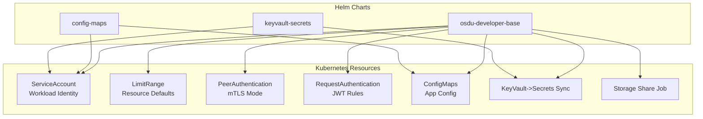
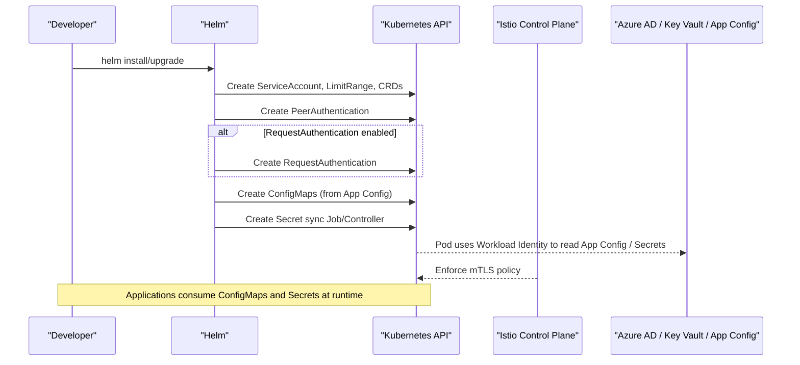
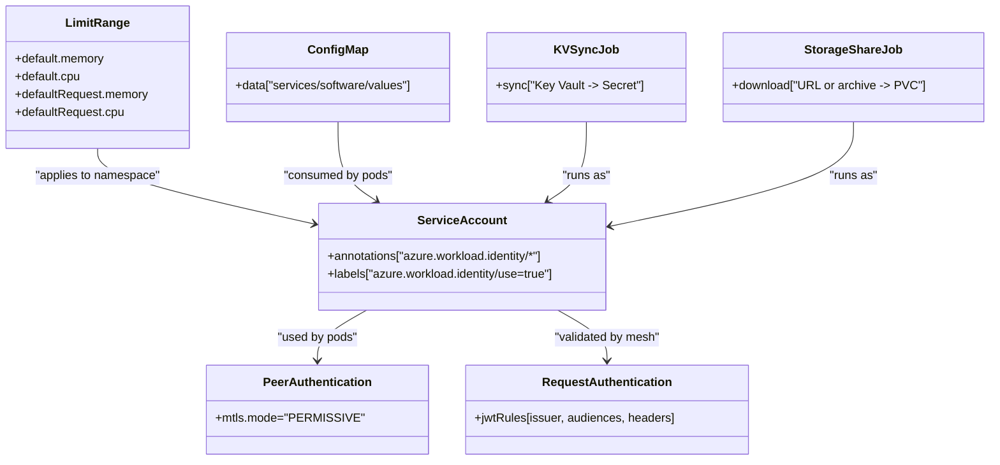
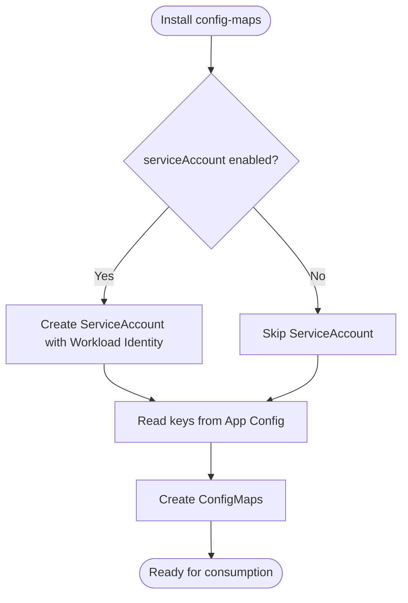
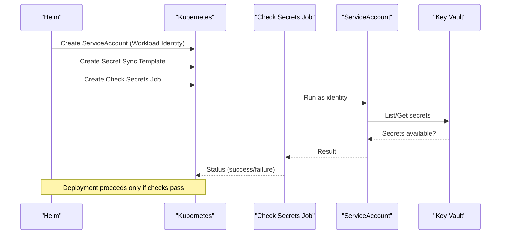

# Base Charts and Foundation

<cite>
**Referenced Files in This Document**
- [Chart.yaml](file://charts/osdu-developer-base/Chart.yaml)
- [values.yaml](file://charts/osdu-developer-base/values.yaml)
- [serviceaccount.yaml](file://charts/osdu-developer-base/templates/serviceaccount.yaml)
- [resource-limits.yaml](file://charts/osdu-developer-base/templates/resource-limits.yaml)
- [peer-authentication.yaml](file://charts/osdu-developer-base/templates/peer-authentication.yaml)
- [request-authentication.yaml](file://charts/osdu-developer-base/templates/request-authentication.yaml)
- [config-map-services.yaml](file://charts/osdu-developer-base/templates/config-map-services.yaml)
- [config-map-software.yaml](file://charts/osdu-developer-base/templates/config-map-software.yaml)
- [config-map-values.yaml](file://charts/osdu-developer-base/templates/config-map-values.yaml)
- [kv-secrets.yaml](file://charts/osdu-developer-base/templates/kv-secrets.yaml)
- [envoy-filter.yaml](file://charts/osdu-developer-base/templates/envoy-filter.yaml)
- [storage-share-job.yaml](file://charts/osdu-developer-base/templates/storage-share-job.yaml)
- [Chart.yaml](file://charts/config-maps/Chart.yaml)
- [values.yaml](file://charts/config-maps/values.yaml)
- [config-map-airflow.yaml](file://charts/config-maps/templates/config-map-airflow.yaml)
- [service-account.yaml](file://charts/config-maps/templates/service-account.yaml)
- [Chart.yaml](file://charts/keyvault-secrets/Chart.yaml)
- [values.yaml](file://charts/keyvault-secrets/values.yaml)
- [serviceaccount.yaml](file://charts/keyvault-secrets/templates/serviceaccount.yaml)
- [check-secrets.yaml](file://charts/keyvault-secrets/templates/check-secrets.yaml)
- [kv-secrets.yaml](file://charts/keyvault-secrets/templates/kv-secrets.yaml)
</cite>

## Table of Contents
1. Introduction
2. Project Structure
3. Core Components
4. Architecture Overview
5. Detailed Component Analysis
6. Dependency Analysis
7. Performance Considerations
8. Troubleshooting Guide
9. Conclusion

## Introduction
This document explains the OSDU base Helm charts that provide foundational infrastructure for development environments. It focuses on:
- osdu-developer-base: service accounts, resource limits, authentication policies, configuration maps, and optional secret sync and storage share jobs.
- config-maps: application configuration via Azure App Configuration-backed ConfigMaps and an optional service account for Workload Identity.
- keyvault-secrets: secure synchronization of Key Vault secrets into Kubernetes Secrets with validation and a dedicated service account.

These charts are designed to be extended per environment (dev/test/prod) through values overrides and dependency management.

## Project Structure
The base charts reside under charts/ and follow standard Helm conventions: Chart.yaml defines metadata; templates render Kubernetes manifests; values.yaml provides defaults and customization points.

**Diagram sources**
- [serviceaccount.yaml](file://charts/osdu-developer-base/templates/serviceaccount.yaml)
- [resource-limits.yaml](file://charts/osdu-developer-base/templates/resource-limits.yaml)
- [peer-authentication.yaml](file://charts/osdu-developer-base/templates/peer-authentication.yaml)
- [request-authentication.yaml](file://charts/osdu-developer-base/templates/request-authentication.yaml)
- [config-map-services.yaml](file://charts/osdu-developer-base/templates/config-map-services.yaml)
- [config-map-software.yaml](file://charts/osdu-developer-base/templates/config-map-software.yaml)
- [config-map-values.yaml](file://charts/osdu-developer-base/templates/config-map-values.yaml)
- [kv-secrets.yaml](file://charts/osdu-developer-base/templates/kv-secrets.yaml)
- [storage-share-job.yaml](file://charts/osdu-developer-base/templates/storage-share-job.yaml)
- [service-account.yaml](file://charts/config-maps/templates/service-account.yaml)
- [config-map-airflow.yaml](file://charts/config-maps/templates/config-map-airflow.yaml)
- [serviceaccount.yaml](file://charts/keyvault-secrets/templates/serviceaccount.yaml)
- [kv-secrets.yaml](file://charts/keyvault-secrets/templates/kv-secrets.yaml)

**Section sources**
- [Chart.yaml](file://charts/osdu-developer-base/Chart.yaml)
- [Chart.yaml](file://charts/config-maps/Chart.yaml)
- [Chart.yaml](file://charts/keyvault-secrets/Chart.yaml)

## Core Components
- osdu-developer-base
  - ServiceAccount with Azure Workload Identity annotations for pod identity.
  - LimitRange to set default CPU/memory requests and limits across the namespace.
  - Istio PeerAuthentication to enable mTLS in permissive mode for smooth rollout.
  - Optional RequestAuthentication to validate JWTs from Azure AD for mesh ingress.
  - ConfigMaps for services, software, and values sourced from Azure App Configuration.
  - Optional Key Vault to Secret sync job and Storage Share download job.
- config-maps
  - Creates ConfigMaps from Azure App Configuration endpoints.
  - Optional ServiceAccount for Workload Identity when reading app config.
- keyvault-secrets
  - Synchronizes Key Vault secrets into Kubernetes Secrets.
  - Validates presence of required secrets before deployment proceeds.
  - Optional ServiceAccount for Workload Identity.

**Section sources**
- [values.yaml](file://charts/osdu-developer-base/values.yaml)
- [serviceaccount.yaml](file://charts/osdu-developer-base/templates/serviceaccount.yaml)
- [resource-limits.yaml](file://charts/osdu-developer-base/templates/resource-limits.yaml)
- [peer-authentication.yaml](file://charts/osdu-developer-base/templates/peer-authentication.yaml)
- [request-authentication.yaml](file://charts/osdu-developer-base/templates/request-authentication.yaml)
- [config-map-services.yaml](file://charts/osdu-developer-base/templates/config-map-services.yaml)
- [config-map-software.yaml](file://charts/osdu-developer-base/templates/config-map-software.yaml)
- [config-map-values.yaml](file://charts/osdu-developer-base/templates/config-map-values.yaml)
- [kv-secrets.yaml](file://charts/osdu-developer-base/templates/kv-secrets.yaml)
- [storage-share-job.yaml](file://charts/osdu-developer-base/templates/storage-share-job.yaml)
- [values.yaml](file://charts/config-maps/values.yaml)
- [service-account.yaml](file://charts/config-maps/templates/service-account.yaml)
- [config-map-airflow.yaml](file://charts/config-maps/templates/config-map-airflow.yaml)
- [values.yaml](file://charts/keyvault-secrets/values.yaml)
- [serviceaccount.yaml](file://charts/keyvault-secrets/templates/serviceaccount.yaml)
- [check-secrets.yaml](file://charts/keyvault-secrets/templates/check-secrets.yaml)
- [kv-secrets.yaml](file://charts/keyvault-secrets/templates/kv-secrets.yaml)

## Architecture Overview
The base charts establish a secure, configurable foundation:
- Identity: Workload Identity-enabled ServiceAccounts allow pods to access Azure resources securely without long-lived credentials.
- Security: Istio mTLS is enabled in permissive mode; optional JWT-based request authentication validates incoming tokens from Azure AD.
- Configuration: Centralized configuration via Azure App Configuration is materialized as ConfigMaps consumed by applications.
- Secrets: Key Vault secrets are synchronized into Kubernetes Secrets with pre-deployment checks to ensure availability.
- Resource Governance: Namespace-wide LimitRange enforces sensible defaults for CPU and memory.

**Diagram sources**
- [serviceaccount.yaml](file://charts/osdu-developer-base/templates/serviceaccount.yaml)
- [resource-limits.yaml](file://charts/osdu-developer-base/templates/resource-limits.yaml)
- [peer-authentication.yaml](file://charts/osdu-developer-base/templates/peer-authentication.yaml)
- [request-authentication.yaml](file://charts/osdu-developer-base/templates/request-authentication.yaml)
- [config-map-services.yaml](file://charts/osdu-developer-base/templates/config-map-services.yaml)
- [kv-secrets.yaml](file://charts/keyvault-secrets/templates/kv-secrets.yaml)

## Detailed Component Analysis

### osdu-developer-base chart
Purpose: Provide shared identity, security policies, resource governance, and centralized configuration/secrets for developer workloads.

Key elements:
- ServiceAccount with Workload Identity annotations for pod identity binding to Azure managed identity.
- LimitRange setting default CPU/memory requests and limits for containers in the namespace.
- Istio PeerAuthentication enabling mTLS in permissive mode to ease migration and debugging.
- Optional RequestAuthentication validating JWTs issued by Azure AD for inbound traffic.
- ConfigMaps populated from Azure App Configuration for services, software, and values.
- Optional Key Vault to Secret sync and Storage Share download job for bootstrapping data.

Customization:
- azure.tenantId, azure.clientId, azure.keyvaultName configure identity and vault access.
- resourceLimits.* sets default CPU/memory requests and limits.
- blobUpload and share sections control optional data bootstrap jobs.

**Diagram sources**
- [serviceaccount.yaml](file://charts/osdu-developer-base/templates/serviceaccount.yaml)
- [resource-limits.yaml](file://charts/osdu-developer-base/templates/resource-limits.yaml)
- [peer-authentication.yaml](file://charts/osdu-developer-base/templates/peer-authentication.yaml)
- [request-authentication.yaml](file://charts/osdu-developer-base/templates/request-authentication.yaml)
- [config-map-services.yaml](file://charts/osdu-developer-base/templates/config-map-services.yaml)
- [config-map-software.yaml](file://charts/osdu-developer-base/templates/config-map-software.yaml)
- [config-map-values.yaml](file://charts/osdu-developer-base/templates/config-map-values.yaml)
- [kv-secrets.yaml](file://charts/osdu-developer-base/templates/kv-secrets.yaml)
- [storage-share-job.yaml](file://charts/osdu-developer-base/templates/storage-share-job.yaml)

**Section sources**
- [values.yaml](file://charts/osdu-developer-base/values.yaml)
- [serviceaccount.yaml](file://charts/osdu-developer-base/templates/serviceaccount.yaml)
- [resource-limits.yaml](file://charts/osdu-developer-base/templates/resource-limits.yaml)
- [peer-authentication.yaml](file://charts/osdu-developer-base/templates/peer-authentication.yaml)
- [request-authentication.yaml](file://charts/osdu-developer-base/templates/request-authentication.yaml)
- [config-map-services.yaml](file://charts/osdu-developer-base/templates/config-map-services.yaml)
- [config-map-software.yaml](file://charts/osdu-developer-base/templates/config-map-software.yaml)
- [config-map-values.yaml](file://charts/osdu-developer-base/templates/config-map-values.yaml)
- [kv-secrets.yaml](file://charts/osdu-developer-base/templates/kv-secrets.yaml)
- [storage-share-job.yaml](file://charts/osdu-developer-base/templates/storage-share-job.yaml)

### config-maps chart
Purpose: Materialize Azure App Configuration entries into Kubernetes ConfigMaps and optionally provision a Workload Identity ServiceAccount.

Key elements:
- ConfigMap generation from Azure App Configuration endpoint using client ID and tenant context.
- Optional ServiceAccount creation gated by a flag to enable Workload Identity for reading configuration.

Customization:
- azure.configEndpoint, azure.clientId, azure.keyvaultUri define connection details.
- serviceAccount toggles creation of the identity-bearing ServiceAccount.
- configMaps.airflow enables specific ConfigMap generation for Airflow.

**Diagram sources**
- [service-account.yaml](file://charts/config-maps/templates/service-account.yaml)
- [config-map-airflow.yaml](file://charts/config-maps/templates/config-map-airflow.yaml)
- [values.yaml](file://charts/config-maps/values.yaml)

**Section sources**
- [values.yaml](file://charts/config-maps/values.yaml)
- [service-account.yaml](file://charts/config-maps/templates/service-account.yaml)
- [config-map-airflow.yaml](file://charts/config-maps/templates/config-map-airflow.yaml)

### keyvault-secrets chart
Purpose: Securely synchronize Key Vault secrets into Kubernetes Secrets and validate their presence prior to deployment.

Key elements:
- ServiceAccount with Workload Identity annotations for accessing Key Vault.
- Secret synchronization template mapping Key Vault secret names to Kubernetes secret keys.
- Validation job to check that required secrets exist before proceeding.

Customization:
- azure.clientId, azure.keyvaultName, azure.tenantId configure identity and vault.
- secrets list defines mappings between Kubernetes secret keys and Key Vault secret names.

**Diagram sources**
- [serviceaccount.yaml](file://charts/keyvault-secrets/templates/serviceaccount.yaml)
- [kv-secrets.yaml](file://charts/keyvault-secrets/templates/kv-secrets.yaml)
- [check-secrets.yaml](file://charts/keyvault-secrets/templates/check-secrets.yaml)
- [values.yaml](file://charts/keyvault-secrets/values.yaml)

**Section sources**
- [values.yaml](file://charts/keyvault-secrets/values.yaml)
- [serviceaccount.yaml](file://charts/keyvault-secrets/templates/serviceaccount.yaml)
- [kv-secrets.yaml](file://charts/keyvault-secrets/templates/kv-secrets.yaml)
- [check-secrets.yaml](file://charts/keyvault-secrets/templates/check-secrets.yaml)

## Dependency Management
- Use Helm dependencies to compose environments:
  - Install osdu-developer-base first to establish identity, policies, and defaults.
  - Install config-maps to populate application configuration.
  - Install keyvault-secrets to provision secrets.
- Override values per environment (dev/test/prod) via values files or --set flags.
- Gate optional features with boolean flags (e.g., enableRequestAuthentication, serviceAccount).

Best practices:
- Pin chart versions for reproducibility.
- Keep environment-specific values in separate files and reference them during install.
- Validate prerequisites (e.g., Azure AD app registration, Key Vault permissions) before deploying dependent charts.

[No sources needed since this section provides general guidance]

## Performance Considerations
- Set reasonable default CPU/memory requests and limits via LimitRange to avoid noisy neighbor issues.
- Enable mTLS in permissive mode initially to identify compatibility gaps before enforcing strict mode.
- Avoid excessive secret sync frequency; batch updates where possible.
- Use ConfigMaps for non-sensitive configuration to reduce secret rotation overhead.

[No sources needed since this section provides general guidance]

## Troubleshooting Guide
Common issues and resolutions:
- Workload Identity not working:
  - Ensure ServiceAccount has correct azure.workload.identity/client-id and tenant-id annotations.
  - Verify Azure workload identity integration is configured in the cluster and the managed identity exists.
- RequestAuthentication failures:
  - Confirm issuer URLs, audiences, and header prefixes match your Azure AD setup.
  - Validate that enableRequestAuthentication is set appropriately for your environment.
- Missing Key Vault secrets:
  - The check-secrets job will fail if required secrets are absent; create them in Key Vault and re-run.
  - Ensure the ServiceAccount has sufficient permissions to read Key Vault.
- ConfigMaps not updated:
  - Verify azure.configEndpoint and clientId are correct.
  - Reinstall or upgrade the config-maps chart after updating App Configuration.

**Section sources**
- [serviceaccount.yaml](file://charts/osdu-developer-base/templates/serviceaccount.yaml)
- [request-authentication.yaml](file://charts/osdu-developer-base/templates/request-authentication.yaml)
- [check-secrets.yaml](file://charts/keyvault-secrets/templates/check-secrets.yaml)
- [service-account.yaml](file://charts/config-maps/templates/service-account.yaml)

## Conclusion
These base charts provide a secure, configurable foundation for OSDU developer environments:
- osdu-developer-base establishes identity, security policies, resource governance, and centralized configuration/secrets.
- config-maps centralizes application configuration via Azure App Configuration.
- keyvault-secrets ensures secrets are available and validated before deployments.

Adopt environment-specific values, pin chart versions, and extend functionality by composing these charts with your application releases.

[No sources needed since this section summarizes without analyzing specific files]