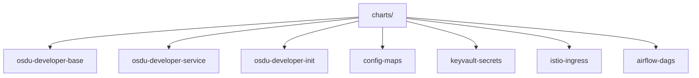
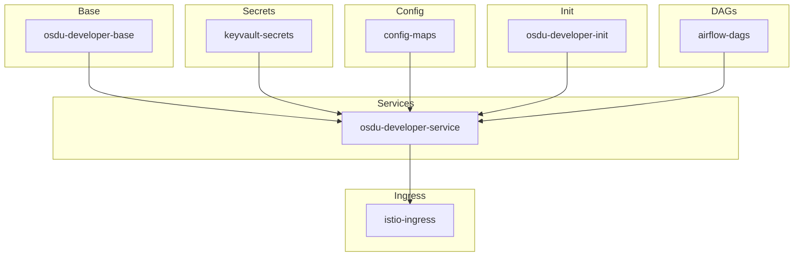
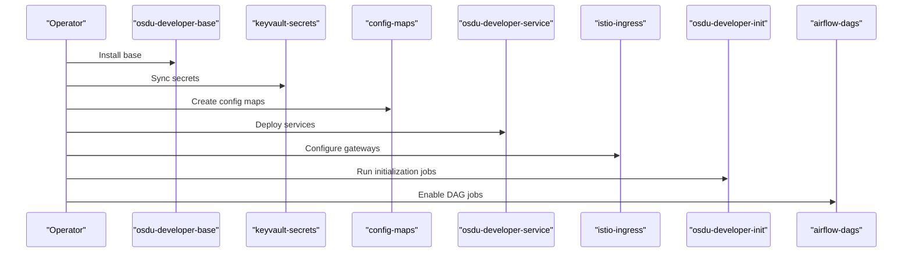

# Helm Charts Management

<cite>
**Referenced Files in This Document**
- [charts/README.MD](file://charts/README.MD)
- [charts/osdu-developer-base/Chart.yaml](file://charts/osdu-developer-base/Chart.yaml)
- [charts/osdu-developer-base/values.yaml](file://charts/osdu-developer-base/values.yaml)
- [charts/osdu-developer-service/Chart.yaml](file://charts/osdu-developer-service/Chart.yaml)
- [charts/osdu-developer-service/values.yaml](file://charts/osdu-developer-service/values.yaml)
- [charts/osdu-developer-init/Chart.yaml](file://charts/osdu-developer-init/Chart.yaml)
- [charts/osdu-developer-init/values.yaml](file://charts/osdu-developer-init/values.yaml)
- [charts/config-maps/Chart.yaml](file://charts/config-maps/Chart.yaml)
- [charts/config-maps/values.yaml](file://charts/config-maps/values.yaml)
- [charts/keyvault-secrets/Chart.yaml](file://charts/keyvault-secrets/Chart.yaml)
- [charts/keyvault-secrets/values.yaml](file://charts/keyvault-secrets/values.yaml)
- [charts/istio-ingress/Chart.yaml](file://charts/istio-ingress/Chart.yaml)
- [charts/istio-ingress/values.yaml](file://charts/istio-ingress/values.yaml)
- [charts/airflow-dags/Chart.yaml](file://charts/airflow-dags/Chart.yaml)
- [charts/airflow-dags/values.yaml](file://charts/airflow-dags/values.yaml)
</cite>

## Table of Contents
1. Introduction
2. Project Structure
3. Core Components
4. Architecture Overview
5. Detailed Component Analysis
6. Dependency Analysis
7. Performance Considerations
8. Troubleshooting Guide
9. Conclusion
10. Appendices

## Introduction
This document provides comprehensive guidance for managing and customizing the OSDU platform Helm charts used to deploy core services, configuration, secrets, ingress, and data processing DAGs. It focuses on structure, parameters, values configuration, template overrides, and dependency management across the following charts: osdu-developer-base, osdu-developer-service, osdu-developer-init, config-maps, keyvault-secrets, istio-ingress, and airflow-dags.

The goal is to enable environment-specific deployments, secure secret handling via Azure Key Vault, consistent service exposure through Istio gateways, and repeatable initialization workflows.

## Project Structure
The charts are organized under a single repository directory with one chart per component. Each chart includes:
- Chart metadata (Chart.yaml)
- Default values (values.yaml)
- Kubernetes templates (templates/)
- Optional scripts or helper files

**Section sources**
- [charts/README.MD:1-3](file://charts/README.MD#L1-L3)

## Core Components
This section summarizes each chart’s purpose and primary configuration surface.

- osdu-developer-base: Provides base resources such as shared ConfigMaps, RBAC/service account, resource limits, and optional blob upload or file share jobs.
- osdu-developer-service: Deploys application services with configurable images, paths, probes, autoscaling, persistent volumes, and environment variables.
- osdu-developer-init: Runs initialization jobs for partitioning, schemas, entitlements, users, and workflow setup.
- config-maps: Creates ConfigMaps for components like Airflow and optionally a dedicated ServiceAccount.
- keyvault-secrets: Synchronizes Azure Key Vault secrets into Kubernetes Secrets using managed identity credentials.
- istio-ingress: Defines internal and external gateways and TLS credentials for exposing services via Istio.
- airflow-dags: Installs batch jobs that run CSV and manifest DAGs within an Airflow environment.

**Section sources**
- [charts/osdu-developer-base/Chart.yaml:1-9](file://charts/osdu-developer-base/Chart.yaml#L1-L9)
- [charts/osdu-developer-service/Chart.yaml:1-10](file://charts/osdu-developer-service/Chart.yaml#L1-L10)
- [charts/osdu-developer-init/Chart.yaml:1-9](file://charts/osdu-developer-init/Chart.yaml#L1-L9)
- [charts/config-maps/Chart.yaml:1-27](file://charts/config-maps/Chart.yaml#L1-L27)
- [charts/keyvault-secrets/Chart.yaml:1-27](file://charts/keyvault-secrets/Chart.yaml#L1-L27)
- [charts/istio-ingress/Chart.yaml:1-27](file://charts/istio-ingress/Chart.yaml#L1-L27)
- [charts/airflow-dags/Chart.yaml:1-9](file://charts/airflow-dags/Chart.yaml#L1-L9)

## Architecture Overview
High-level deployment flow:
- Base layer sets up shared configuration and security context.
- Secrets are synchronized from Azure Key Vault into Kubernetes Secrets.
- Services are deployed with environment variables sourced from ConfigMaps or Secrets.
- Ingress exposes services via Istio gateways with TLS.
- Initialization jobs configure partitions, schemas, entitlements, users, and workflows.
- Airflow DAG jobs process data ingestion and transformation tasks.

[No sources needed since this diagram shows conceptual workflow, not actual code structure]

## Detailed Component Analysis

### osdu-developer-base
Purpose:
- Establishes shared configuration and runtime context for other components.
- Supports Azure integration via managed identity and Key Vault references.
- Provides default resource requests/limits and optional data loading jobs.

Key values:
- azure.enabled, tenantId, clientId, keyvaultName
- resourceLimits.defaultCpuRequests/defaultMemoryRequests/defaultCpuLimits/defaultMemoryLimits
- blobUpload.enabled and container
- share.enabled and items (name, pvc, file/url, compress)

Usage notes:
- Use fullnameOverride to standardize naming across releases.
- Enable blob upload or share jobs when initial data seeding is required.

Template highlights:
- Shared ConfigMaps for services/software/values
- Resource limits applied to workloads
- Optional storage share job for bootstrapping content

**Section sources**
- [charts/osdu-developer-base/values.yaml:1-38](file://charts/osdu-developer-base/values.yaml#L1-L38)
- [charts/osdu-developer-base/Chart.yaml:1-9](file://charts/osdu-developer-base/Chart.yaml#L1-L9)

### osdu-developer-service
Purpose:
- Deploys one or more OSDU services with flexible image selection, routing, and scaling.
- Supports readiness/liveness probes, persistent volume mounts, and environment variable injection from ConfigMaps or Secrets.
- Integrates with Istio authentication policies and can bypass auth for specific paths.

Key values:
- replicaCount
- service.type, port, target
- configuration array defining services with repository, tag, path, probe, keyvault, request/limit, pvc, auth.disable, env
- Example env entries show direct values, ConfigMap references, and Secret references

Deployment patterns:
- Define multiple services in the configuration list to deploy multiple pods/services from a single release.
- Use env[].config to bind ConfigMap keys to environment variables.
- Use env[].secret to bind Kubernetes Secret keys to environment variables.

Scaling:
- Horizontal Pod Autoscaler settings are available but commented by default; uncomment to enable.

**Section sources**
- [charts/osdu-developer-service/values.yaml:1-142](file://charts/osdu-developer-service/values.yaml#L1-L142)
- [charts/osdu-developer-service/Chart.yaml:1-10](file://charts/osdu-developer-service/Chart.yaml#L1-L10)

### osdu-developer-init
Purpose:
- Executes initialization jobs to set up partitions, schemas, entitlements, users, and workflows.

Key values:
- tenantId, clientId, clientSecret
- serviceBus
- partition

Operational guidance:
- Provide Azure credentials and partition details to initialize the platform.
- Run after base and secrets are available so services can connect to configured backends.

**Section sources**
- [charts/osdu-developer-init/values.yaml:1-6](file://charts/osdu-developer-init/values.yaml#L1-L6)
- [charts/osdu-developer-init/Chart.yaml:1-9](file://charts/osdu-developer-init/Chart.yaml#L1-L9)

### config-maps
Purpose:
- Creates ConfigMaps for components such as Airflow.
- Optionally creates a dedicated ServiceAccount for accessing Azure App Configuration.

Key values:
- nameOverride, fullnameOverride
- azure.configEndpoint, azure.clientId, azure.keyvaultUri
- serviceAccount boolean
- configMaps.airflow boolean

Operational guidance:
- Set azure fields to point to your App Configuration instance and provide managed identity client id.
- Toggle airflow ConfigMap creation based on whether Airflow is deployed.

**Section sources**
- [charts/config-maps/values.yaml:1-12](file://charts/config-maps/values.yaml#L1-L12)
- [charts/config-maps/Chart.yaml:1-27](file://charts/config-maps/Chart.yaml#L1-L27)

### keyvault-secrets
Purpose:
- Synchronizes secrets from Azure Key Vault into Kubernetes Secrets using managed identity.

Key values:
- azure.clientId, azure.keyvaultName, azure.tenantId
- secrets array: each entry defines a Kubernetes secretName and a list of mappings between vaultSecret names and Kubernetes secret keys

Operational guidance:
- Ensure the managed identity has read access to the specified Key Vault.
- Map multiple vault secrets into a single Kubernetes Secret if desired.

**Section sources**
- [charts/keyvault-secrets/values.yaml:1-11](file://charts/keyvault-secrets/values.yaml#L1-L11)
- [charts/keyvault-secrets/Chart.yaml:1-27](file://charts/keyvault-secrets/Chart.yaml#L1-L27)

### istio-ingress
Purpose:
- Configures internal and external Istio gateways with TLS termination.
- References certificate secrets created by the istio-certs chart.

Key values:
- ingress.internalGateway.enabled, requireSSL, hosts, tls.mode, tls.credentialName
- ingress.externalGateway.enabled, tls.mode, tls.credentialName

Operational guidance:
- Ensure the credentialName matches the secret provisioned by the certificates chart.
- Use wildcard hosts for broad routing or restrict to specific domains.

**Section sources**
- [charts/istio-ingress/values.yaml:1-18](file://charts/istio-ingress/values.yaml#L1-L18)
- [charts/istio-ingress/Chart.yaml:1-27](file://charts/istio-ingress/Chart.yaml#L1-L27)

### airflow-dags
Purpose:
- Installs jobs to run CSV and manifest DAGs for data ingestion and transformation.

Key values:
- fullnameOverride
- airflow.manifestdag.enabled
- airflow.csvdag.enabled

Operational guidance:
- Enable only the DAG types you need.
- Coordinate with config-maps and keyvault-secrets to provide necessary configuration and secrets to DAGs.

**Section sources**
- [charts/airflow-dags/values.yaml:1-13](file://charts/airflow-dags/values.yaml#L1-L13)
- [charts/airflow-dags/Chart.yaml:1-9](file://charts/airflow-dags/Chart.yaml#L1-L9)

## Dependency Analysis
Recommended deployment order and logical dependencies:
- Deploy base first to establish shared configuration and resource limits.
- Create secrets from Key Vault so services can authenticate to backends.
- Create ConfigMaps for application configuration.
- Deploy services referencing ConfigMaps and Secrets.
- Configure Istio ingress to expose services securely.
- Run init jobs to bootstrap partitions, schemas, entitlements, users, and workflows.
- Enable DAG jobs for data processing pipelines.

[No sources needed since this diagram shows conceptual workflow, not actual code structure]

## Performance Considerations
- Set appropriate resource requests and limits in osdu-developer-base defaults or per-service overrides to ensure stable scheduling and prevent noisy neighbor issues.
- Tune replicaCount and autoscaling targets in osdu-developer-service based on expected load.
- Use readiness and liveness probes to improve health detection and rolling update safety.
- Avoid over-provisioning persistent volumes; mount only what is necessary.
- For Istio ingress, ensure TLS offloading is correctly configured and certificate rotation is automated.

[No sources needed since this section provides general guidance]

## Troubleshooting Guide
Common issues and checks:
- Missing Key Vault permissions: Ensure the managed identity referenced by keyvault-secrets has read access to the specified vault and secrets.
- Incorrect gateway credentials: Verify that istio-ingress tls.credentialName matches the secret created by the certificates chart.
- Environment variables not resolved: Confirm that ConfigMaps and Secrets exist before deploying services and that env references match names and keys.
- Init jobs failing: Validate tenantId, clientId, clientSecret, and partition values provided to osdu-developer-init.
- DAGs not running: Ensure airflow-dags features are enabled and dependent ConfigMaps/Secrets are present.

**Section sources**
- [charts/keyvault-secrets/values.yaml:1-11](file://charts/keyvault-secrets/values.yaml#L1-L11)
- [charts/istio-ingress/values.yaml:1-18](file://charts/istio-ingress/values.yaml#L1-L18)
- [charts/osdu-developer-service/values.yaml:1-142](file://charts/osdu-developer-service/values.yaml#L1-L142)
- [charts/osdu-developer-init/values.yaml:1-6](file://charts/osdu-developer-init/values.yaml#L1-L6)
- [charts/airflow-dags/values.yaml:1-13](file://charts/airflow-dags/values.yaml#L1-L13)

## Conclusion
These charts provide a modular, secure, and scalable foundation for deploying the OSDU platform on Kubernetes with Azure integrations. By leveraging osdu-developer-base for shared context, keyvault-secrets for secure configuration, config-maps for application settings, osdu-developer-service for workload deployment, istio-ingress for secure exposure, osdu-developer-init for platform bootstrapping, and airflow-dags for data processing, teams can maintain consistent, versioned, and environment-specific deployments.

[No sources needed since this section summarizes without analyzing specific files]

## Appendices

### Chart Parameters Reference
- osdu-developer-base
  - azure.enabled, tenantId, clientId, keyvaultName
  - resourceLimits.*
  - blobUpload.enabled, container
  - share.enabled, items[*].name, pvc, file/url, compress
- osdu-developer-service
  - replicaCount
  - service.type, port, target
  - configuration[*].repository, tag, path, probe, keyvault, request, limit, pvc, auth.disable, env
- osdu-developer-init
  - tenantId, clientId, clientSecret, serviceBus, partition
- config-maps
  - nameOverride, fullnameOverride
  - azure.configEndpoint, azure.clientId, azure.keyvaultUri
  - serviceAccount
  - configMaps.airflow
- keyvault-secrets
  - azure.clientId, azure.keyvaultName, azure.tenantId
  - secrets[*].secretName, secrets[*].data[*].key, secrets[*].data[*].vaultSecret
- istio-ingress
  - ingress.internalGateway.enabled, requireSSL, hosts, tls.mode, tls.credentialName
  - ingress.externalGateway.enabled, tls.mode, tls.credentialName
- airflow-dags
  - fullnameOverride
  - airflow.manifestdag.enabled
  - airflow.csvdag.enabled

**Section sources**
- [charts/osdu-developer-base/values.yaml:1-38](file://charts/osdu-developer-base/values.yaml#L1-L38)
- [charts/osdu-developer-service/values.yaml:1-142](file://charts/osdu-developer-service/values.yaml#L1-L142)
- [charts/osdu-developer-init/values.yaml:1-6](file://charts/osdu-developer-init/values.yaml#L1-L6)
- [charts/config-maps/values.yaml:1-12](file://charts/config-maps/values.yaml#L1-L12)
- [charts/keyvault-secrets/values.yaml:1-11](file://charts/keyvault-secrets/values.yaml#L1-L11)
- [charts/istio-ingress/values.yaml:1-18](file://charts/istio-ingress/values.yaml#L1-L18)
- [charts/airflow-dags/values.yaml:1-13](file://charts/airflow-dags/values.yaml#L1-L13)

### Custom Deployment Examples
- Minimal service deployment with base, secrets, config, and ingress:
  - Install base with Azure settings and resource limits.
  - Sync secrets from Key Vault.
  - Create ConfigMaps for Airflow and other components.
  - Deploy a service with image, path, and environment variables.
  - Configure Istio ingress with TLS credentials.
  - Run init jobs to prepare partitions and schemas.
  - Enable DAG jobs if data processing is required.

- Environment-specific configurations:
  - Maintain separate values files per environment (dev, staging, prod).
  - Override azure endpoints, tenants, and Key Vault names per environment.
  - Adjust replica counts and resource limits according to environment capacity.
  - Pin image tags for reproducibility in non-dev environments.

**Section sources**
- [charts/osdu-developer-base/values.yaml:1-38](file://charts/osdu-developer-base/values.yaml#L1-L38)
- [charts/osdu-developer-service/values.yaml:1-142](file://charts/osdu-developer-service/values.yaml#L1-L142)
- [charts/config-maps/values.yaml:1-12](file://charts/config-maps/values.yaml#L1-L12)
- [charts/keyvault-secrets/values.yaml:1-11](file://charts/keyvault-secrets/values.yaml#L1-L11)
- [charts/istio-ingress/values.yaml:1-18](file://charts/istio-ingress/values.yaml#L1-L18)
- [charts/osdu-developer-init/values.yaml:1-6](file://charts/osdu-developer-init/values.yaml#L1-L6)
- [charts/airflow-dags/values.yaml:1-13](file://charts/airflow-dags/values.yaml#L1-L13)

### Best Practices for Chart Maintenance and Versioning
- Follow semantic versioning for chart versions in Chart.yaml.
- Keep values.yaml minimal and documented; move environment-specific overrides to separate files.
- Pin image repositories and tags for production stability.
- Use fullnameOverride consistently to avoid naming collisions across namespaces.
- Centralize secrets in Key Vault and reference them via keyvault-secrets rather than hardcoding.
- Review and update resource limits regularly based on usage metrics.
- Automate CI/CD to validate chart rendering and test deployments in isolated namespaces.

[No sources needed since this section provides general guidance]