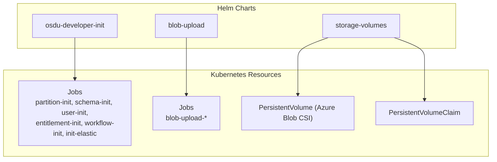
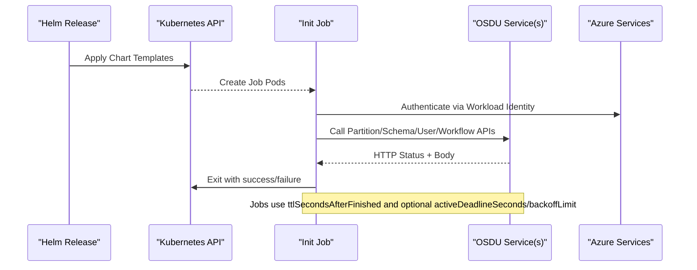
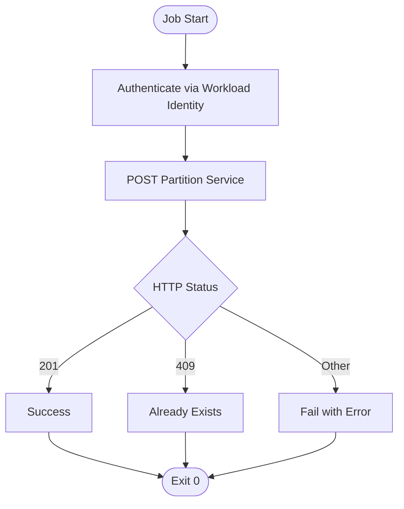
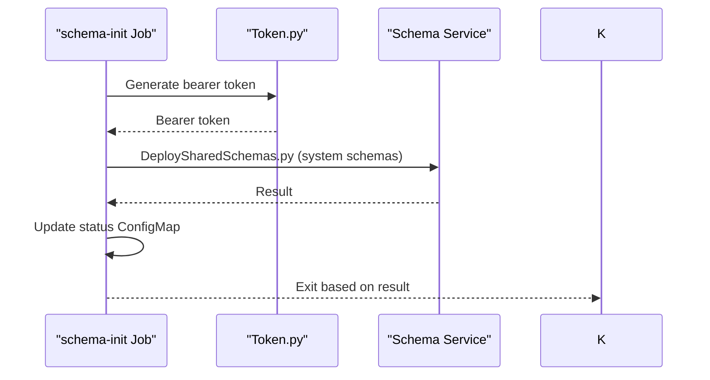
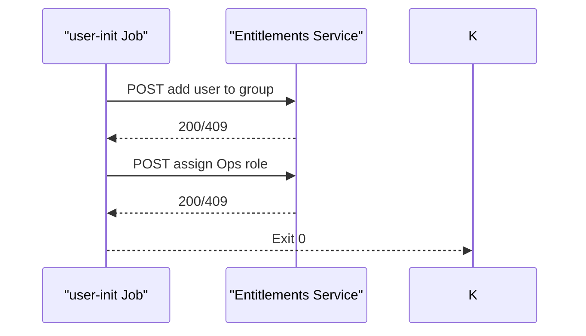
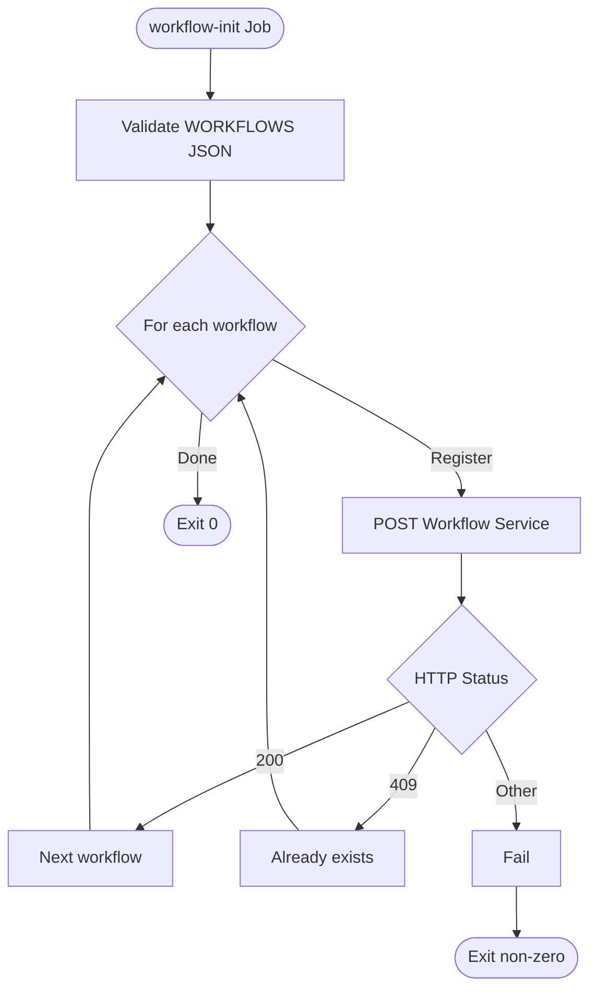
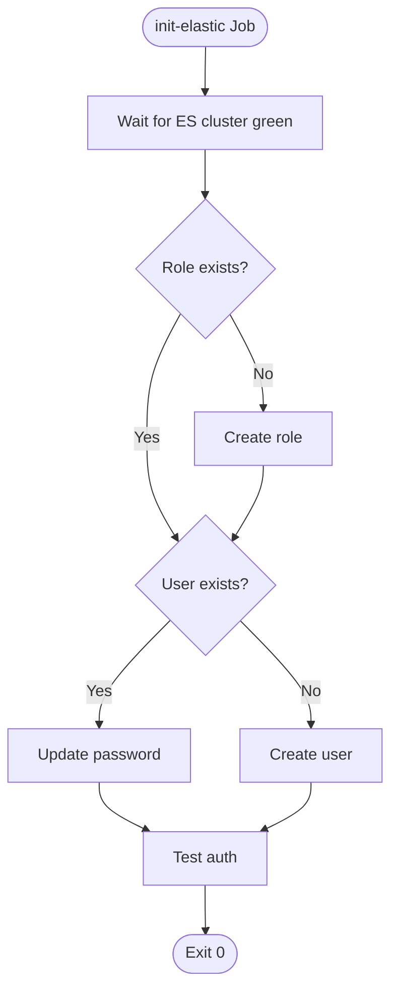
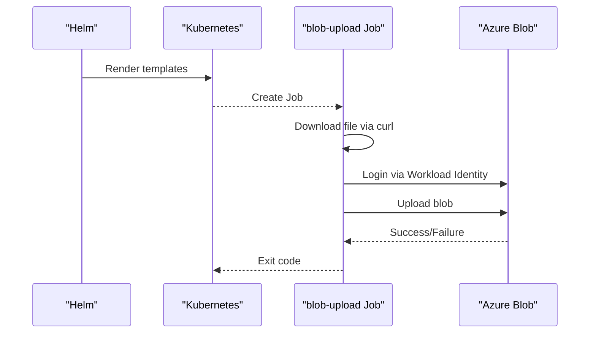
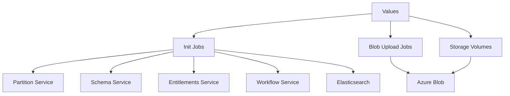

# Initialization and Setup Charts

<cite>
**Referenced Files in This Document**
- [Chart.yaml](file://charts/osdu-developer-init/Chart.yaml)
- [values.yaml](file://charts/osdu-developer-init/values.yaml)
- [partition-init.yaml](file://charts/osdu-developer-init/templates/partition-init.yaml)
- [schema-init.yaml](file://charts/osdu-developer-init/templates/schema-init.yaml)
- [user-init.yaml](file://charts/osdu-developer-init/templates/user-init.yaml)
- [entitlement-init.yaml](file://charts/osdu-developer-init/templates/entitlement-init.yaml)
- [workflow-init.yaml](file://charts/osdu-developer-init/templates/workflow-init.yaml)
- [elastic-init.yaml](file://charts/osdu-developer-init/templates/elastic-init.yaml)
- [Chart.yaml](file://charts/blob-upload/Chart.yaml)
- [values.yaml](file://charts/blob-upload/values.yaml)
- [storage-container-job.yaml](file://charts/blob-upload/templates/storage-container-job.yaml)
- [Chart.yaml](file://charts/storage-volumes/Chart.yaml)
- [values.yaml](file://charts/storage-volumes/values.yaml)
- [pv.yaml](file://charts/storage-volumes/templates/pv.yaml)
- [pvc.yaml](file://charts/storage-volumes/templates/pvc.yaml)
</cite>

## Table of Contents
1. [Introduction](#introduction)
2. [Project Structure](#project-structure)
3. [Core Components](#core-components)
4. [Architecture Overview](#architecture-overview)
5. [Detailed Component Analysis](#detailed-component-analysis)
6. [Dependency Analysis](#dependency-analysis)
7. [Performance Considerations](#performance-considerations)
8. [Troubleshooting Guide](#troubleshooting-guide)
9. [Conclusion](#conclusion)

## Introduction
This document explains the OSDU initialization and setup Helm charts used to bootstrap platform services, ingest data, and provision persistent storage. It focuses on:
- osdu-developer-init: Jobs that create partitions, register schemas, initialize users and entitlements, configure workflows, and prepare Elasticsearch.
- blob-upload: A job-driven workflow to download files and upload them to Azure Blob Storage using Workload Identity.
- storage-volumes: Kubernetes PersistentVolume and PersistentVolumeClaim definitions backed by Azure Blob via CSI for shared access patterns.

The documentation covers job configurations, retry policies, error handling, and monitoring guidance for each chart.

## Project Structure
The repository organizes these charts under charts/:
- osdu-developer-init: Application chart with multiple init jobs (partition, schema, user, entitlement, workflow, elastic).
- blob-upload: Application chart that generates one Job per configured item to upload files to a specified container.
- storage-volumes: Application chart that creates PV/PVC pairs bound to Azure Blob containers.

**Diagram sources**
- [Chart.yaml](file://charts/osdu-developer-init/Chart.yaml)
- [Chart.yaml](file://charts/blob-upload/Chart.yaml)
- [Chart.yaml](file://charts/storage-volumes/Chart.yaml)
- [partition-init.yaml](file://charts/osdu-developer-init/templates/partition-init.yaml)
- [schema-init.yaml](file://charts/osdu-developer-init/templates/schema-init.yaml)
- [user-init.yaml](file://charts/osdu-developer-init/templates/user-init.yaml)
- [entitlement-init.yaml](file://charts/osdu-developer-init/templates/entitlement-init.yaml)
- [workflow-init.yaml](file://charts/osdu-developer-init/templates/workflow-init.yaml)
- [elastic-init.yaml](file://charts/osdu-developer-init/templates/elastic-init.yaml)
- [storage-container-job.yaml](file://charts/blob-upload/templates/storage-container-job.yaml)
- [pv.yaml](file://charts/storage-volumes/templates/pv.yaml)
- [pvc.yaml](file://charts/storage-volumes/templates/pvc.yaml)

**Section sources**
- [Chart.yaml](file://charts/osdu-developer-init/Chart.yaml)
- [Chart.yaml](file://charts/blob-upload/Chart.yaml)
- [Chart.yaml](file://charts/storage-volumes/Chart.yaml)

## Core Components
- osdu-developer-init:
  - partition-init: Creates an OSDU partition via the Partition service using Workload Identity authentication.
  - schema-init: Loads system schemas into the Schema service using a dedicated image and token helper.
  - user-init: Adds an initial user and assigns roles via the Entitlements service.
  - entitlement-init: Provisions tenant-level entitlements for the partition.
  - workflow-init: Registers system workflows with the Workflow service.
  - elastic-init: Waits for Elasticsearch cluster health, then creates/updates a custom role and user.
- blob-upload:
  - storage-container-job: For each configured item, downloads a file and uploads it to a target Azure Blob container using Workload Identity.
- storage-volumes:
  - pv.yaml: Defines PersistentVolumes backed by Azure Blob CSI with FUSE mount options.
  - pvc.yaml: Defines PersistentVolumeClaims requesting the PVs.

Key configuration inputs:
- osdu-developer-init values include tenantId, clientId, clientSecret, serviceBus, partition, and feature toggles under jobs.*.
- blob-upload values include global.configmapNamespace, blobUpload.enabled, blobUpload.container, and items list.
- storage-volumes values include azure.* and volumes array with volumeName, containerName, storageSize, accessModes.

**Section sources**
- [values.yaml](file://charts/osdu-developer-init/values.yaml)
- [values.yaml](file://charts/blob-upload/values.yaml)
- [values.yaml](file://charts/storage-volumes/values.yaml)
- [partition-init.yaml](file://charts/osdu-developer-init/templates/partition-init.yaml)
- [schema-init.yaml](file://charts/osdu-developer-init/templates/schema-init.yaml)
- [user-init.yaml](file://charts/osdu-developer-init/templates/user-init.yaml)
- [entitlement-init.yaml](file://charts/osdu-developer-init/templates/entitlement-init.yaml)
- [workflow-init.yaml](file://charts/osdu-developer-init/templates/workflow-init.yaml)
- [elastic-init.yaml](file://charts/osdu-developer-init/templates/elastic-init.yaml)
- [storage-container-job.yaml](file://charts/blob-upload/templates/storage-container-job.yaml)
- [pv.yaml](file://charts/storage-volumes/templates/pv.yaml)
- [pvc.yaml](file://charts/storage-volumes/templates/pvc.yaml)

## Architecture Overview
Initialization flows rely on Kubernetes Jobs that authenticate via Azure Workload Identity and call internal services or external resources.

**Diagram sources**
- [partition-init.yaml](file://charts/osdu-developer-init/templates/partition-init.yaml)
- [schema-init.yaml](file://charts/osdu-developer-init/templates/schema-init.yaml)
- [user-init.yaml](file://charts/osdu-developer-init/templates/user-init.yaml)
- [entitlement-init.yaml](file://charts/osdu-developer-init/templates/entitlement-init.yaml)
- [workflow-init.yaml](file://charts/osdu-developer-init/templates/workflow-init.yaml)
- [elastic-init.yaml](file://charts/osdu-developer-init/templates/elastic-init.yaml)

## Detailed Component Analysis

### osdu-developer-init: Partition Creation
- Purpose: Create an OSDU partition via the Partition service.
- Job settings:
  - ttlSecondsAfterFinished: cleans up completed job pods after a short delay.
  - Uses Workload Identity via serviceAccountName and labels.
  - Mounts a ConfigMap containing the partition payload and a shell script.
- Authentication: Logs in using federated token from environment and obtains an access token.
- Error handling: Parses HTTP status codes; treats 201 as success, 409 as already exists, otherwise fails.
- Monitoring: Inspect Job logs and events; check exit code and response body for diagnostics.

**Diagram sources**
- [partition-init.yaml](file://charts/osdu-developer-init/templates/partition-init.yaml)

**Section sources**
- [partition-init.yaml](file://charts/osdu-developer-init/templates/partition-init.yaml)

### osdu-developer-init: Schema Registration
- Purpose: Load system schemas into the Schema service.
- Job settings:
  - activeDeadlineSeconds: limits execution time.
  - Uses a specialized image that includes schema loading scripts and a token helper.
  - Mounts ConfigMap with bootstrap script and Token.py.
- Authentication: Token.py exchanges federated token for an Azure management token; used to call Schema service.
- Error handling: Updates a ConfigMap with status/message; exits non-zero on failure.
- Monitoring: Check Job logs and the referenced ConfigMap for status updates.

**Diagram sources**
- [schema-init.yaml](file://charts/osdu-developer-init/templates/schema-init.yaml)

**Section sources**
- [schema-init.yaml](file://charts/osdu-developer-init/templates/schema-init.yaml)

### osdu-developer-init: User Initialization and Entitlements
- user-init:
  - Adds an initial user to the default group and assigns Ops role via Entitlements service.
  - Treats 200 as success and 409 as already exists; fails on other statuses.
- entitlement-init:
  - Provisions tenant provisioning endpoint for the partition.
  - Treats 200 as success; fails otherwise.
- Both jobs use Workload Identity and curl to call internal services.

**Diagram sources**
- [user-init.yaml](file://charts/osdu-developer-init/templates/user-init.yaml)
- [entitlement-init.yaml](file://charts/osdu-developer-init/templates/entitlement-init.yaml)

**Section sources**
- [user-init.yaml](file://charts/osdu-developer-init/templates/user-init.yaml)
- [entitlement-init.yaml](file://charts/osdu-developer-init/templates/entitlement-init.yaml)

### osdu-developer-init: Workflow Registration
- Purpose: Register system workflows with the Workflow service.
- Inputs: Array of workflows provided via values; validated as JSON before processing.
- Behavior: Iterates workflows, registers each with concurrent run limits; handles 200 and 409.
- Error handling: Fails if WORKFLOWS is invalid JSON or unexpected HTTP status.

**Diagram sources**
- [workflow-init.yaml](file://charts/osdu-developer-init/templates/workflow-init.yaml)

**Section sources**
- [workflow-init.yaml](file://charts/osdu-developer-init/templates/workflow-init.yaml)

### osdu-developer-init: Elasticsearch Initialization
- Purpose: Ensure Elasticsearch is healthy, then create/update a custom role and user.
- Health check: An initContainer polls cluster health until green.
- Role/User creation:
  - Reads credentials from mounted secret and KeyVault via CSI.
  - Creates role if missing; creates or updates user; tests authentication.
- Retry policy: backoffLimit controls retries; activeDeadlineSeconds sets timeout.
- Monitoring: Inspect Job logs for health polling and API responses.

**Diagram sources**
- [elastic-init.yaml](file://charts/osdu-developer-init/templates/elastic-init.yaml)

**Section sources**
- [elastic-init.yaml](file://charts/osdu-developer-init/templates/elastic-init.yaml)

### blob-upload: Data Ingestion Workflow
- Purpose: Download a file and upload it to a specific Azure Blob container.
- Generation: One Job per item in values.blobUpload.items; uses lookup to resolve storage account names from a ConfigMap.
- Authentication: Uses Workload Identity to obtain tokens and perform az storage blob upload.
- Error handling: Exits non-zero on login or upload failures; relies on Kubernetes Job restart behavior.
- Monitoring: Inspect Job logs for download/upload steps and errors.

**Diagram sources**
- [storage-container-job.yaml](file://charts/blob-upload/templates/storage-container-job.yaml)
- [values.yaml](file://charts/blob-upload/values.yaml)

**Section sources**
- [storage-container-job.yaml](file://charts/blob-upload/templates/storage-container-job.yaml)
- [values.yaml](file://charts/blob-upload/values.yaml)

### storage-volumes: Persistent Storage Provisioning
- Purpose: Provide PersistentVolumes and PersistentVolumeClaims backed by Azure Blob via CSI.
- PV template:
  - Uses blob.csi.azure.com driver with FUSE mount options.
  - References resourceGroup, storageAccountName, containerName, and clientId.
- PVC template:
  - Requests storage size and binds to the named PV.
- Access modes: Defaults to ReadWriteMany when not specified.

**Diagram sources**
- [pv.yaml](file://charts/storage-volumes/templates/pv.yaml)
- [pvc.yaml](file://charts/storage-volumes/templates/pvc.yaml)
- [values.yaml](file://charts/storage-volumes/values.yaml)

**Section sources**
- [pv.yaml](file://charts/storage-volumes/templates/pv.yaml)
- [pvc.yaml](file://charts/storage-volumes/templates/pvc.yaml)
- [values.yaml](file://charts/storage-volumes/values.yaml)

## Dependency Analysis
- Workload Identity dependency: All init jobs and blob-upload jobs rely on a Kubernetes ServiceAccount annotated for Workload Identity and Azure Federated Identity configuration.
- Internal service dependencies:
  - Partition service endpoint within the namespace.
  - Schema service endpoint within the namespace.
  - Entitlements service endpoints within the namespace.
  - Workflow service endpoint within the namespace.
  - Elasticsearch service endpoint within the namespace.
- External dependencies:
  - Azure Blob Storage for blob-upload and storage-volumes.
  - Azure CLI and curl inside job containers.
- Configuration coupling:
  - osdu-developer-init depends on values such as tenantId, clientId, partition, and feature flags under jobs.*.
  - blob-upload depends on a ConfigMap in global.configmapNamespace for storage account mapping.
  - storage-volumes depends on azure.* values and volumes array.

**Diagram sources**
- [values.yaml](file://charts/osdu-developer-init/values.yaml)
- [values.yaml](file://charts/blob-upload/values.yaml)
- [values.yaml](file://charts/storage-volumes/values.yaml)
- [partition-init.yaml](file://charts/osdu-developer-init/templates/partition-init.yaml)
- [schema-init.yaml](file://charts/osdu-developer-init/templates/schema-init.yaml)
- [user-init.yaml](file://charts/osdu-developer-init/templates/user-init.yaml)
- [entitlement-init.yaml](file://charts/osdu-developer-init/templates/entitlement-init.yaml)
- [workflow-init.yaml](file://charts/osdu-developer-init/templates/workflow-init.yaml)
- [elastic-init.yaml](file://charts/osdu-developer-init/templates/elastic-init.yaml)
- [storage-container-job.yaml](file://charts/blob-upload/templates/storage-container-job.yaml)
- [pv.yaml](file://charts/storage-volumes/templates/pv.yaml)

**Section sources**
- [values.yaml](file://charts/osdu-developer-init/values.yaml)
- [values.yaml](file://charts/blob-upload/values.yaml)
- [values.yaml](file://charts/storage-volumes/values.yaml)

## Performance Considerations
- Job timeouts and retries:
  - Use activeDeadlineSeconds to prevent long-running jobs from hanging.
  - Configure backoffLimit to control retries for transient failures.
- Resource usage:
  - Keep initContainers lightweight; avoid unnecessary package installs where possible.
  - Prefer idempotent operations to allow safe re-runs.
- Network calls:
  - Minimize repeated HTTP requests; cache tokens where appropriate.
  - Ensure DNS resolution to internal services is fast and reliable.
- Storage:
  - Choose appropriate accessModes and storageSize to match workload needs.
  - Tune FUSE mount options for performance and stability.

[No sources needed since this section provides general guidance]

## Troubleshooting Guide
- Common issues:
  - Authentication failures: Verify Workload Identity configuration and environment variables (tenantId, clientId, federated token path).
  - Service unavailability: Confirm internal services are running and reachable within the namespace.
  - HTTP errors: Inspect Job logs for response bodies and status codes; handle 409 as idempotent cases where applicable.
  - Elasticsearch readiness: Ensure cluster health reaches green before proceeding.
- Diagnostic steps:
  - View Job logs: kubectl logs <job-name> -n <namespace>.
  - Check Job events: kubectl describe job <job-name> -n <namespace>.
  - Validate ConfigMaps and Secrets used by jobs.
  - For blob-upload, verify storage account names resolved from the ConfigMap and container existence.
  - For storage-volumes, confirm CSI driver availability and Azure RBAC permissions.

**Section sources**
- [partition-init.yaml](file://charts/osdu-developer-init/templates/partition-init.yaml)
- [schema-init.yaml](file://charts/osdu-developer-init/templates/schema-init.yaml)
- [user-init.yaml](file://charts/osdu-developer-init/templates/user-init.yaml)
- [entitlement-init.yaml](file://charts/osdu-developer-init/templates/entitlement-init.yaml)
- [workflow-init.yaml](file://charts/osdu-developer-init/templates/workflow-init.yaml)
- [elastic-init.yaml](file://charts/osdu-developer-init/templates/elastic-init.yaml)
- [storage-container-job.yaml](file://charts/blob-upload/templates/storage-container-job.yaml)
- [pv.yaml](file://charts/storage-volumes/templates/pv.yaml)

## Conclusion
These three charts provide a cohesive foundation for initializing OSDU platform components, ingesting data into Azure Blob Storage, and provisioning persistent storage via CSI-backed volumes. By leveraging Kubernetes Jobs, Workload Identity, and well-defined error handling, they enable repeatable and observable setup processes. Proper configuration of values, combined with monitoring and troubleshooting practices, ensures reliable deployments across environments.

[No sources needed since this section summarizes without analyzing specific files]