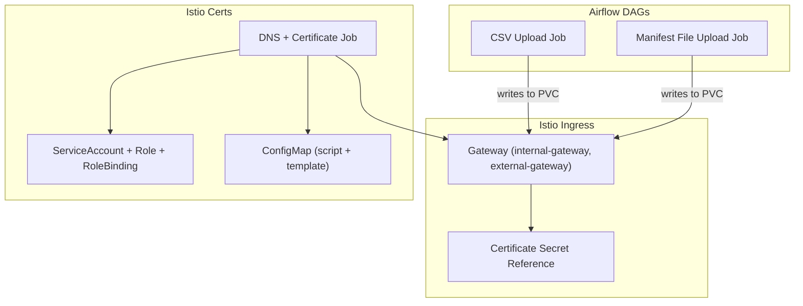
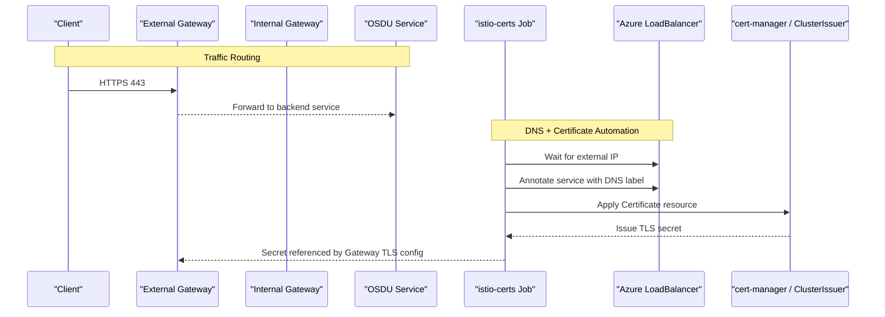
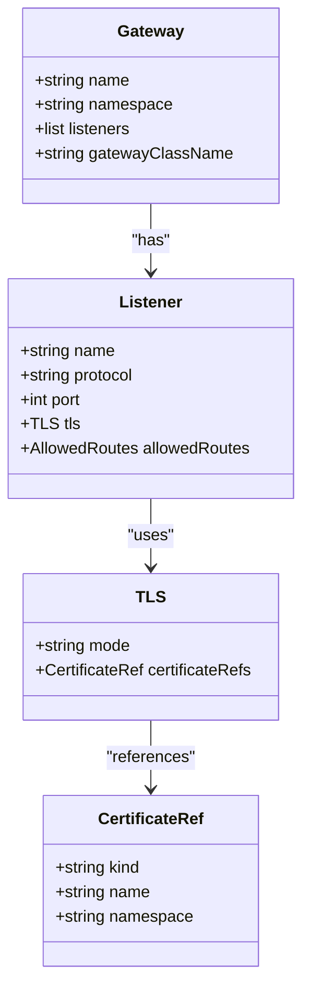
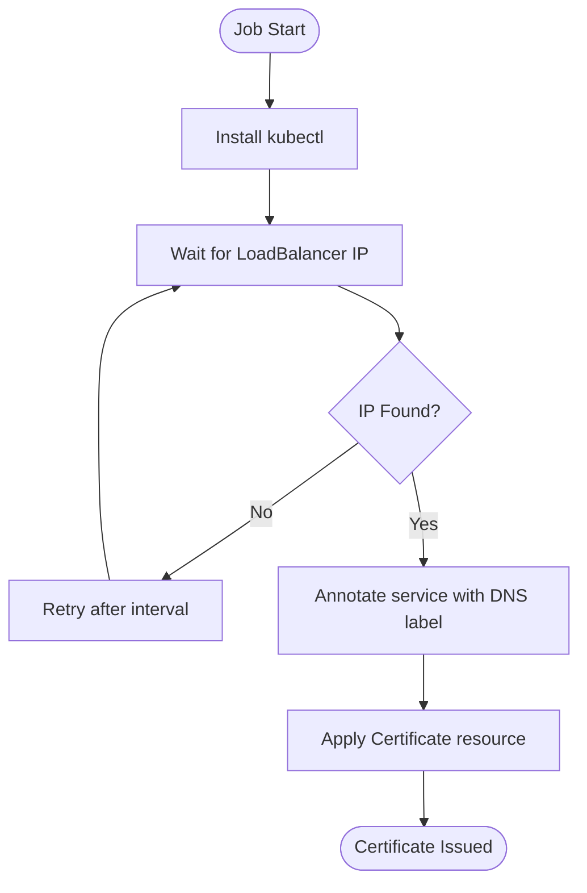
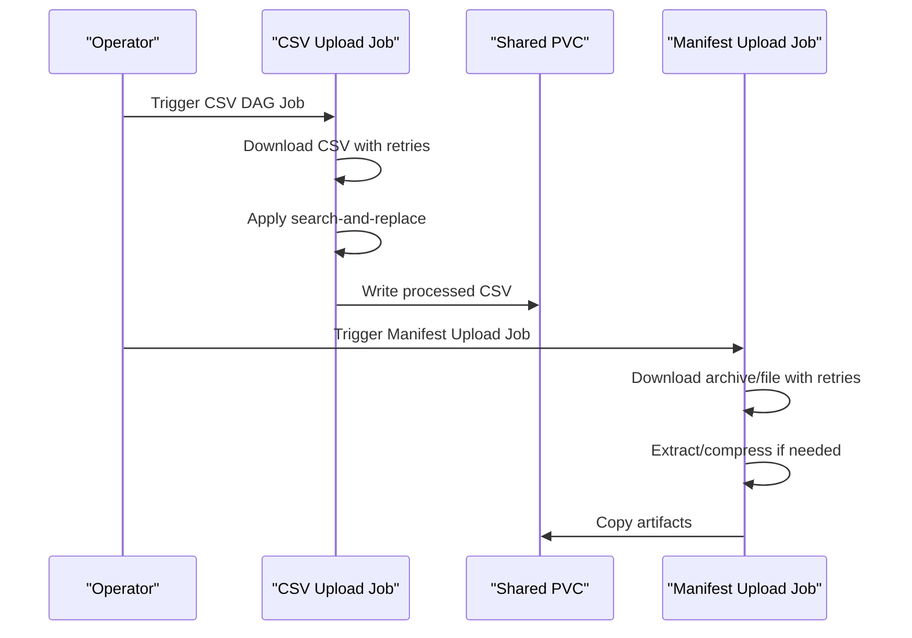
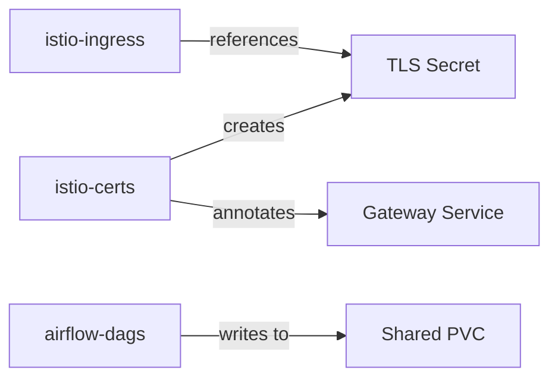

# Integration and External Services

<cite>
**Referenced Files in This Document**
- [Chart.yaml](file://charts/istio-ingress/Chart.yaml)
- [values.yaml](file://charts/istio-ingress/values.yaml)
- [gateways.yaml](file://charts/istio-ingress/templates/gateways.yaml)
- [certificate.yaml](file://charts/istio-ingress/templates/certificate.yaml)
- [httproutes.yaml](file://charts/istio-ingress/templates/httproutes.yaml)
- [_helpers.tpl](file://charts/istio-ingress/templates/_helpers.tpl)
- [Chart.yaml](file://charts/istio-certs/Chart.yaml)
- [values.yaml](file://charts/istio-certs/values.yaml)
- [job.yaml](file://charts/istio-certs/templates/job.yaml)
- [configmap.yaml](file://charts/istio-certs/templates/configmap.yaml)
- [access_control.yaml](file://charts/istio-certs/templates/access_control.yaml)
- [_helpers.tpl](file://charts/istio-certs/templates/_helpers.tpl)
- [Chart.yaml](file://charts/airflow-dags/Chart.yaml)
- [values.yaml](file://charts/airflow-dags/values.yaml)
- [dag-manifest-job.yaml](file://charts/airflow-dags/templates/dag-manifest-job.yaml)
- [dag-csv-job.yaml](file://charts/airflow-dags/templates/dag-csv-job.yaml)
- [_helpers.tpl](file://charts/airflow-dags/templates/_helpers.tpl)
</cite>

## Table of Contents
1. Introduction
2. Project Structure
3. Core Components
4. Architecture Overview
5. Detailed Component Analysis
6. Dependency Analysis
7. Performance Considerations
8. Troubleshooting Guide
9. Conclusion

## Introduction
This document provides comprehensive documentation for OSDU integration charts focused on:
- Istio ingress for traffic management and routing via Gateway API
- Istio certificates for automated TLS certificate lifecycle management
- Airflow DAGs for workflow orchestration and data ingestion tasks

It covers Istio gateway configurations, TLS automation with cert-manager, DAG job templates, and integration patterns with external services. Security considerations, performance optimization, and troubleshooting guidance are included to help operators deploy and operate these components reliably.

## Project Structure
The integration surface is composed of three Helm charts:
- istio-ingress: Defines Gateway resources for internal and external traffic, with TLS termination and route exposure
- istio-certs: Orchestrates DNS label assignment and certificate issuance using a Job that interacts with Kubernetes APIs and Azure Load Balancer annotations
- airflow-dags: Provides one-shot Jobs to prepare and upload data for Airflow DAG execution, including CSV processing and manifest-based file uploads

**Diagram sources**
- [gateways.yaml:1-96](file://charts/istio-ingress/templates/gateways.yaml#L1-L96)
- [job.yaml:1-47](file://charts/istio-certs/templates/job.yaml#L1-L47)
- [configmap.yaml:1-87](file://charts/istio-certs/templates/configmap.yaml#L1-L87)
- [access_control.yaml:1-37](file://charts/istio-certs/templates/access_control.yaml#L1-L37)
- [dag-csv-job.yaml:1-50](file://charts/airflow-dags/templates/dag-csv-job.yaml#L1-L50)
- [dag-manifest-job.yaml:1-108](file://charts/airflow-dags/templates/dag-manifest-job.yaml#L1-L108)

**Section sources**
- [Chart.yaml:1-27](file://charts/istio-ingress/Chart.yaml#L1-L27)
- [Chart.yaml:1-27](file://charts/istio-certs/Chart.yaml#L1-L27)
- [Chart.yaml:1-9](file://charts/airflow-dags/Chart.yaml#L1-L9)

## Core Components
- Istio Ingress Gateways:
  - Two Gateways are provisioned: internal-gateway and external-gateway, both exposing HTTP (80) and HTTPS (443) listeners
  - TLS termination is configured by referencing a secret created by the istio-certs chart
  - Allowed routes are scoped across all namespaces for simplicity during development
- Istio Certs Automation:
  - A Job waits for the external LoadBalancer IP, annotates the service with an Azure DNS label, and applies a cert-manager Certificate resource
  - RBAC grants minimal permissions to manage services and cert-manager resources
- Airflow DAG Jobs:
  - CSV job downloads and processes CSV files, optionally performing search-and-replace templating before writing to shared storage
  - Manifest job supports downloading archives or single files, optional compression, and copying into shared storage for downstream processing

**Section sources**
- [values.yaml:1-18](file://charts/istio-ingress/values.yaml#L1-L18)
- [gateways.yaml:1-96](file://charts/istio-ingress/templates/gateways.yaml#L1-L96)
- [configmap.yaml:1-87](file://charts/istio-certs/templates/configmap.yaml#L1-L87)
- [access_control.yaml:1-37](file://charts/istio-certs/templates/access_control.yaml#L1-L37)
- [dag-csv-job.yaml:1-50](file://charts/airflow-dags/templates/dag-csv-job.yaml#L1-L50)
- [dag-manifest-job.yaml:1-108](file://charts/airflow-dags/templates/dag-manifest-job.yaml#L1-L108)

## Architecture Overview
The architecture integrates traffic ingress, certificate automation, and workflow orchestration:
- External clients reach services through the external Gateway; internal clients use the internal Gateway
- The istio-certs Job ensures a stable FQDN is available and triggers certificate issuance via cert-manager
- Airflow DAG jobs prepare data in shared storage consumed by Airflow workflows

**Diagram sources**
- [gateways.yaml:1-96](file://charts/istio-ingress/templates/gateways.yaml#L1-L96)
- [job.yaml:1-47](file://charts/istio-certs/templates/job.yaml#L1-L47)
- [configmap.yaml:1-87](file://charts/istio-certs/templates/configmap.yaml#L1-L87)

## Detailed Component Analysis

### Istio Ingress Chart
- Purpose: Expose services via Gateway API with TLS termination and controlled routing
- Key elements:
  - Internal and external Gateways with HTTP and HTTPS listeners
  - TLS configuration referencing a secret managed by istio-certs
  - Labels and selectors for identification and management
- Configuration highlights:
  - Both gateways enabled by default
  - TLS mode set to terminate at the gateway
  - Credential name matches the secret produced by istio-certs

**Diagram sources**
- [gateways.yaml:1-96](file://charts/istio-ingress/templates/gateways.yaml#L1-L96)

**Section sources**
- [values.yaml:1-18](file://charts/istio-ingress/values.yaml#L1-L18)
- [gateways.yaml:1-96](file://charts/istio-ingress/templates/gateways.yaml#L1-L96)
- [_helpers.tpl:1-55](file://charts/istio-ingress/templates/_helpers.tpl#L1-L55)

### Istio Certs Chart
- Purpose: Automate DNS labeling and certificate issuance for the external Gateway LoadBalancer
- Workflow:
  - Install kubectl inside the Job container
  - Poll until the external IP is assigned to the Gateway service
  - Annotate the service with an Azure DNS label
  - Apply a cert-manager Certificate resource targeting the computed FQDN
- Security and access:
  - Dedicated ServiceAccount with minimal RBAC for service patching and cert-manager operations
  - Uses Azure Workload Identity annotation for secure authentication

**Diagram sources**
- [job.yaml:1-47](file://charts/istio-certs/templates/job.yaml#L1-L47)
- [configmap.yaml:1-87](file://charts/istio-certs/templates/configmap.yaml#L1-L87)
- [access_control.yaml:1-37](file://charts/istio-certs/templates/access_control.yaml#L1-L37)

**Section sources**
- [values.yaml:1-25](file://charts/istio-certs/values.yaml#L1-L25)
- [job.yaml:1-47](file://charts/istio-certs/templates/job.yaml#L1-L47)
- [configmap.yaml:1-87](file://charts/istio-certs/templates/configmap.yaml#L1-L87)
- [access_control.yaml:1-37](file://charts/istio-certs/templates/access_control.yaml#L1-L37)
- [_helpers.tpl:1-63](file://charts/istio-certs/templates/_helpers.tpl#L1-L63)

### Airflow DAGs Chart
- Purpose: Provide one-time Jobs to prepare data for Airflow DAG execution
- CSV DAG Job:
  - Downloads a CSV from a URL
  - Applies search-and-replace templating to inject environment-specific values
  - Writes processed content to a shared PVC for Airflow consumption
- Manifest DAG Job:
  - Downloads archives or single files with retry logic
  - Optionally extracts and compresses content into a ZIP
  - Copies artifacts into a shared PVC
- Templating and injection:
  - Search-and-replace configuration injects service endpoints, identity settings, and runtime parameters into DAG manifests

**Diagram sources**
- [dag-csv-job.yaml:1-50](file://charts/airflow-dags/templates/dag-csv-job.yaml#L1-L50)
- [dag-manifest-job.yaml:1-108](file://charts/airflow-dags/templates/dag-manifest-job.yaml#L1-L108)
- [_helpers.tpl:54-101](file://charts/airflow-dags/templates/_helpers.tpl#L54-L101)

**Section sources**
- [values.yaml:1-13](file://charts/airflow-dags/values.yaml#L1-L13)
- [dag-csv-job.yaml:1-50](file://charts/airflow-dags/templates/dag-csv-job.yaml#L1-L50)
- [dag-manifest-job.yaml:1-108](file://charts/airflow-dags/templates/dag-manifest-job.yaml#L1-L108)
- [_helpers.tpl:1-101](file://charts/airflow-dags/templates/_helpers.tpl#L1-L101)

## Dependency Analysis
- istio-ingress depends on:
  - A TLS secret created by istio-certs
  - Gateway API controller and cert-manager cluster issuer
- istio-certs depends on:
  - Azure LoadBalancer service for the external Gateway
  - RBAC permissions to annotate services and apply cert-manager resources
  - Azure Workload Identity for authenticated operations
- airflow-dags depends on:
  - Shared PVC for artifact persistence
  - Network access to download URLs
  - Optional integration with Airflow via injected endpoints and identity settings

**Diagram sources**
- [gateways.yaml:1-96](file://charts/istio-ingress/templates/gateways.yaml#L1-L96)
- [configmap.yaml:1-87](file://charts/istio-certs/templates/configmap.yaml#L1-L87)
- [dag-csv-job.yaml:1-50](file://charts/airflow-dags/templates/dag-csv-job.yaml#L1-L50)
- [dag-manifest-job.yaml:1-108](file://charts/airflow-dags/templates/dag-manifest-job.yaml#L1-L108)

**Section sources**
- [values.yaml:1-18](file://charts/istio-ingress/values.yaml#L1-L18)
- [values.yaml:1-25](file://charts/istio-certs/values.yaml#L1-L25)
- [values.yaml:1-13](file://charts/airflow-dags/values.yaml#L1-L13)

## Performance Considerations
- Gateway listeners:
  - Keep HTTP and HTTPS listeners minimal and only enable required hosts to reduce routing overhead
- TLS termination:
  - Ensure the correct credentialName is set to avoid repeated secret lookups
- Certificate automation:
  - Tune retry intervals and max retries in the istio-certs Job to match network conditions
  - Use appropriate certificate duration and renewal windows to balance security and operational load
- Data ingestion jobs:
  - Configure reasonable retry counts and timeouts for downloads
  - Avoid unnecessary compression when not required to reduce CPU and I/O usage
- Resource limits:
  - Set appropriate CPU and memory requests/limits for Jobs to prevent node pressure

[No sources needed since this section provides general guidance]

## Troubleshooting Guide
- External Gateway has no IP:
  - Verify the Gateway service exists and is assigned an external IP
  - Check the istio-certs Job logs for polling failures and adjust retry settings
- DNS label not applied:
  - Confirm the Azure DNS label annotation is present on the Gateway service
  - Validate Azure Workload Identity permissions and network egress
- Certificate not issued:
  - Ensure the FQDN resolves and the ACME challenge can be routed
  - Check cert-manager ClusterIssuer configuration and logs
  - Review the Certificate resource status and events
- Ingress TLS errors:
  - Confirm the secret name matches the credentialName in Gateway TLS config
  - Validate that the secret exists in the expected namespace
- Airflow DAG jobs fail:
  - Inspect Job logs for download or processing errors
  - Verify PVC availability and write permissions
  - Check injected environment variables and service endpoints for correctness

**Section sources**
- [job.yaml:1-47](file://charts/istio-certs/templates/job.yaml#L1-L47)
- [configmap.yaml:1-87](file://charts/istio-certs/templates/configmap.yaml#L1-L87)
- [gateways.yaml:1-96](file://charts/istio-ingress/templates/gateways.yaml#L1-L96)
- [dag-csv-job.yaml:1-50](file://charts/airflow-dags/templates/dag-csv-job.yaml#L1-L50)
- [dag-manifest-job.yaml:1-108](file://charts/airflow-dags/templates/dag-manifest-job.yaml#L1-L108)

## Conclusion
The integration charts provide a cohesive approach to traffic management, certificate automation, and workflow orchestration within OSDU deployments:
- Istio Gateways expose services securely with TLS termination
- Automated DNS labeling and certificate issuance streamline operational complexity
- Airflow DAG Jobs simplify data preparation and integration with external services

Operators should tailor configurations to their environments, enforce least-privilege access, monitor certificate lifecycles, and optimize resource usage for reliable operation.

[No sources needed since this section summarizes without analyzing specific files]