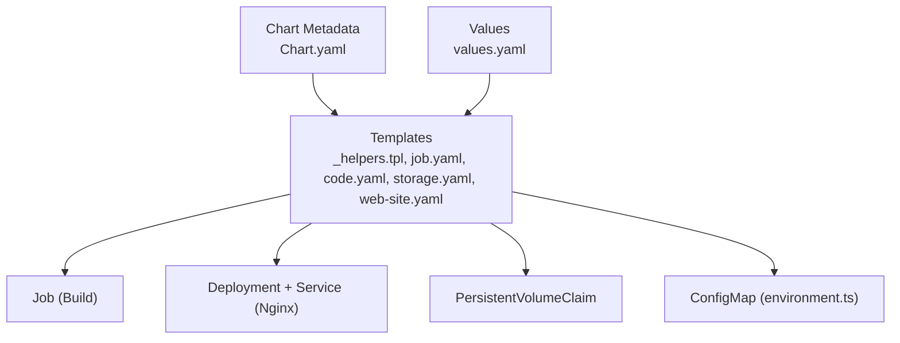
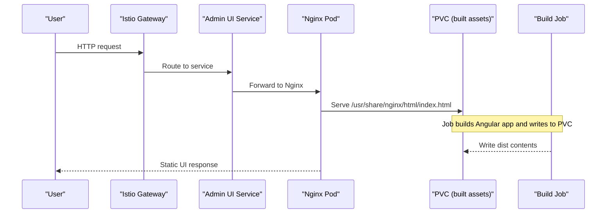
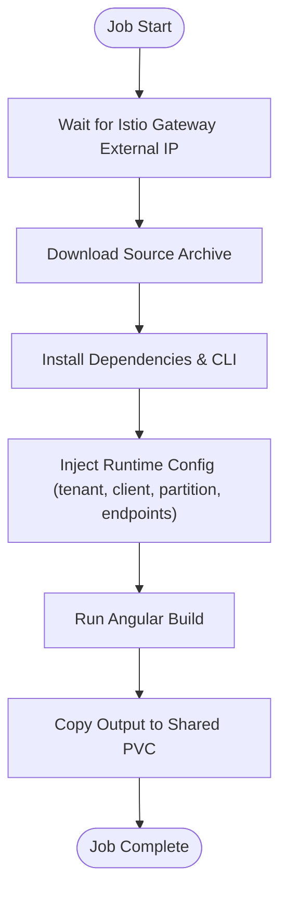
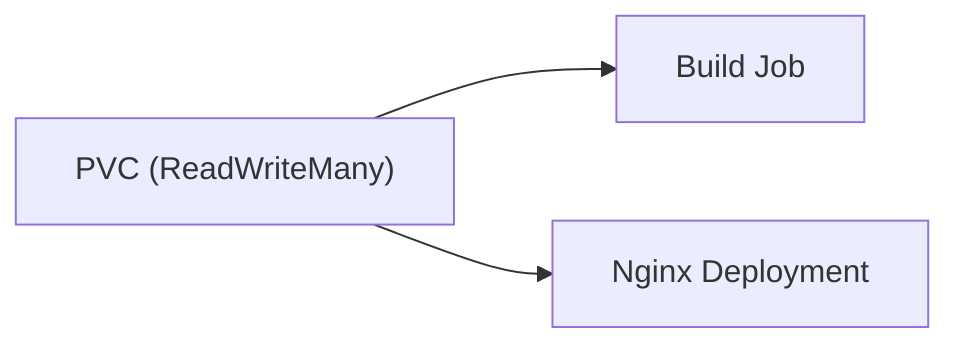
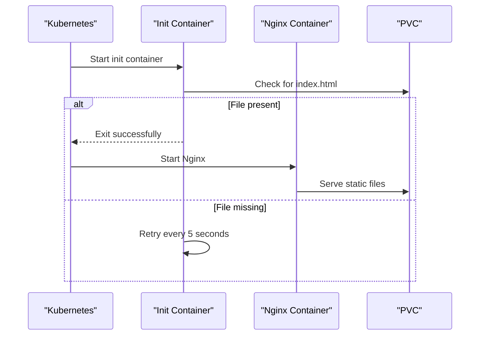
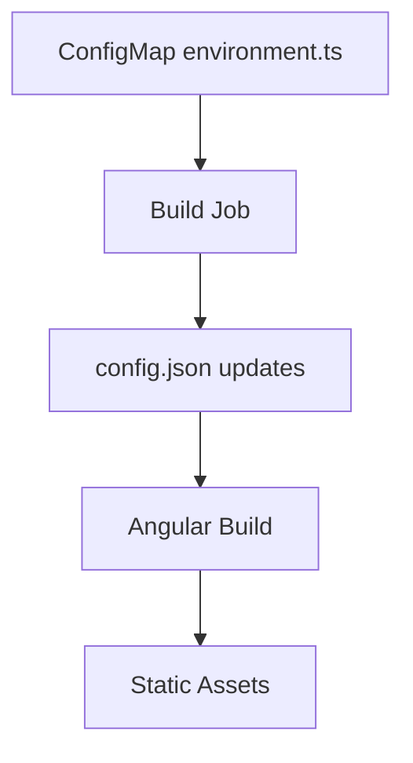
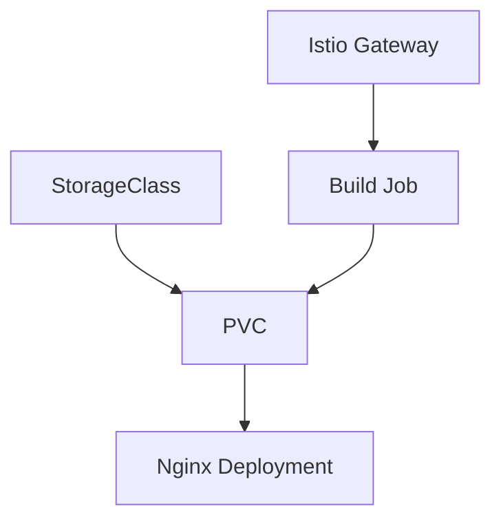

# OSDU Admin UI Chart

<cite>
**Referenced Files in This Document**
- [Chart.yaml](file://charts/osdu-admin-ui/Chart.yaml)
- [values.yaml](file://charts/osdu-admin-ui/values.yaml)
- [_helpers.tpl](file://charts/osdu-admin-ui/templates/_helpers.tpl)
- [job.yaml](file://charts/osdu-admin-ui/templates/job.yaml)
- [code.yaml](file://charts/osdu-admin-ui/templates/code.yaml)
- [storage.yaml](file://charts/osdu-admin-ui/templates/storage.yaml)
- [web-site.yaml](file://charts/osdu-admin-ui/templates/web-site.yaml)
- [admin-ui.yaml (HelmRelease)](file://software/applications/osdu-experimental/admin-ui.yaml)
- [release.yaml (HelmRelease)](file://software/experimental/admin-ui/release.yaml)
- [disk.yaml (StorageClass)](file://software/components/global/disk.yaml)
</cite>

## Table of Contents
1. Introduction
2. Project Structure
3. Core Components
4. Architecture Overview
5. Detailed Component Analysis
6. Dependency Analysis
7. Performance Considerations
8. Troubleshooting Guide
9. Conclusion

## Introduction
This document explains the OSDU Admin UI Helm chart that deploys the administrative web interface. It covers how the chart builds the Angular-based application, serves static files via Nginx, initializes configuration through a job, and persists build artifacts using storage volumes. It also documents environment setup, authentication integration points, customization options, SSL/TLS termination guidance, monitoring considerations, and troubleshooting strategies.

## Project Structure
The chart is located under charts/osdu-admin-ui and contains:
- Chart metadata and versioning
- Template resources for building the app, serving it, and managing storage
- Values to control feature toggles and shared settings

**Diagram sources**
- [Chart.yaml:1-9](file://charts/osdu-admin-ui/Chart.yaml#L1-L9)
- [_helpers.tpl:1-56](file://charts/osdu-admin-ui/templates/_helpers.tpl#L1-L56)
- [job.yaml:1-191](file://charts/osdu-admin-ui/templates/job.yaml#L1-L191)
- [code.yaml:1-30](file://charts/osdu-admin-ui/templates/code.yaml#L1-L30)
- [storage.yaml:1-16](file://charts/osdu-admin-ui/templates/storage.yaml#L1-L16)
- [web-site.yaml:1-70](file://charts/osdu-admin-ui/templates/web-site.yaml#L1-L70)

**Section sources**
- [Chart.yaml:1-9](file://charts/osdu-admin-ui/Chart.yaml#L1-L9)
- [values.yaml:1-1](file://charts/osdu-admin-ui/values.yaml#L1-L1)
- [_helpers.tpl:1-56](file://charts/osdu-admin-ui/templates/_helpers.tpl#L1-L56)

## Core Components
- Build Job: Downloads source, installs dependencies, injects runtime configuration, builds the Angular app, and writes output to persistent storage.
- Storage: A ReadWriteMany PersistentVolumeClaim mounts into both the build job and the Nginx deployment to share built assets.
- Web Server: A Deployment running Nginx serves the built static files from the shared volume.
- Environment Config: A ConfigMap provides an environment file used during build-time configuration injection.
- Feature Toggle: All resources are conditionally created when adminUIEnabled is not false.

Key behaviors:
- The job waits for Istio ingress external IP before proceeding to configure endpoints.
- The deployment includes an init container that waits until index.html exists before starting Nginx.
- Authentication-related values (tenant, client ID, redirect URI) are injected into the build process to generate correct client-side configuration.

**Section sources**
- [job.yaml:1-191](file://charts/osdu-admin-ui/templates/job.yaml#L1-L191)
- [storage.yaml:1-16](file://charts/osdu-admin-ui/templates/storage.yaml#L1-L16)
- [web-site.yaml:1-70](file://charts/osdu-admin-ui/templates/web-site.yaml#L1-L70)
- [code.yaml:1-30](file://charts/osdu-admin-ui/templates/code.yaml#L1-L30)

## Architecture Overview
The chart orchestrates a build-first workflow where a Kubernetes Job compiles the Angular application and writes the static assets to a shared PVC. A separate Nginx Deployment reads those assets and exposes them via a Service. An init container ensures the web server only starts after the build completes.

**Diagram sources**
- [web-site.yaml:1-70](file://charts/osdu-admin-ui/templates/web-site.yaml#L1-L70)
- [job.yaml:1-191](file://charts/osdu-admin-ui/templates/job.yaml#L1-L191)
- [storage.yaml:1-16](file://charts/osdu-admin-ui/templates/storage.yaml#L1-L16)

## Detailed Component Analysis

### Build Job
Responsibilities:
- Install tools (kubectl, jq, tar), wait for Istio gateway external IP, download source archive, install Node/Angular CLI, copy configuration files, update config with runtime values, build the Angular app, and copy output to the shared volume.
- Uses Workload Identity service account for secure access if needed by scripts or downstream steps.
- Mounts:
  - Script ConfigMap for the build script
  - App module ConfigMap for additional TypeScript modules
  - Environment ConfigMap for environment.ts
  - PVC for build output

Environment variables passed to the build step include telemetry keys, Azure AD tenant/client IDs, data domain/partition, redirect URI, and the URL to fetch the source archive.

**Diagram sources**
- [job.yaml:1-191](file://charts/osdu-admin-ui/templates/job.yaml#L1-L191)

**Section sources**
- [job.yaml:1-191](file://charts/osdu-admin-ui/templates/job.yaml#L1-L191)

### Storage Volumes
- A single PVC named after the release is created with ReadWriteMany access mode and a default size of 1Gi.
- The PVC uses a StorageClass provisioned for Azure managed disks.
- Both the build job and the Nginx deployment mount this PVC to share built assets.

**Diagram sources**
- [storage.yaml:1-16](file://charts/osdu-admin-ui/templates/storage.yaml#L1-L16)
- [disk.yaml:1-12](file://software/components/global/disk.yaml#L1-L12)

**Section sources**
- [storage.yaml:1-16](file://charts/osdu-admin-ui/templates/storage.yaml#L1-L16)
- [disk.yaml:1-12](file://software/components/global/disk.yaml#L1-L12)

### Web Application Deployment (Nginx)
- Creates a ConfigMap with a minimal Nginx configuration serving from /usr/share/nginx/html.
- Exposes a Service on port 80 targeting the Nginx container.
- Runs a Deployment with one replica; an init container waits for index.html to appear before starting Nginx.
- Mounts the same PVC used by the build job to serve built assets.

**Diagram sources**
- [web-site.yaml:1-70](file://charts/osdu-admin-ui/templates/web-site.yaml#L1-L70)

**Section sources**
- [web-site.yaml:1-70](file://charts/osdu-admin-ui/templates/web-site.yaml#L1-L70)

### Environment Configuration and Authentication Integration
- A ConfigMap generates an environment.ts file that defines runtime settings and constructs protected scope URLs based on API endpoints and identity provider scopes.
- During the build job, configuration is updated with:
  - Data partition and domain
  - Azure AD tenant and client IDs
  - Redirect URI
  - API endpoints derived from the Istio gateway external IP
- These values enable the UI to authenticate against Azure AD and call backend services securely.

**Diagram sources**
- [code.yaml:1-30](file://charts/osdu-admin-ui/templates/code.yaml#L1-L30)
- [job.yaml:1-191](file://charts/osdu-admin-ui/templates/job.yaml#L1-L191)

**Section sources**
- [code.yaml:1-30](file://charts/osdu-admin-ui/templates/code.yaml#L1-L30)
- [job.yaml:1-191](file://charts/osdu-admin-ui/templates/job.yaml#L1-L191)

### Flux Integration and Values Injection
Two HelmRelease examples show how values are provided at deploy time:
- One references secrets and config maps for client IDs, tenant ID, storage account name, and insights key.
- Another sets a local redirect URI for development scenarios.

These demonstrate how to customize the deployment without modifying chart templates.

**Section sources**
- [admin-ui.yaml (HelmRelease):1-55](file://software/applications/osdu-experimental/admin-ui.yaml#L1-L55)
- [release.yaml (HelmRelease):1-54](file://software/experimental/admin-ui/release.yaml#L1-L54)

## Dependency Analysis
- The chart depends on:
  - A working Istio Gateway with an assigned external IP (the build job polls until available).
  - A StorageClass capable of provisioning ReadWriteMany volumes (Azure managed disk in this repository).
  - Optional Workload Identity service account referenced by the job template.
- The Nginx deployment depends on the build job completing and writing index.html to the shared PVC.

**Diagram sources**
- [job.yaml:1-191](file://charts/osdu-admin-ui/templates/job.yaml#L1-L191)
- [storage.yaml:1-16](file://charts/osdu-admin-ui/templates/storage.yaml#L1-L16)
- [disk.yaml:1-12](file://software/components/global/disk.yaml#L1-L12)

**Section sources**
- [job.yaml:1-191](file://charts/osdu-admin-ui/templates/job.yaml#L1-L191)
- [storage.yaml:1-16](file://charts/osdu-admin-ui/templates/storage.yaml#L1-L16)
- [disk.yaml:1-12](file://software/components/global/disk.yaml#L1-L12)

## Performance Considerations
- Build resources: The job requests significant memory to accommodate Angular builds. Adjust resource requests/limits in the job template to match your cluster capacity and build times.
- Concurrency: Only one replica of Nginx is deployed by default. Scale replicas if you expect high concurrent users.
- Storage I/O: Ensure the underlying storage class supports the expected IOPS for large static assets. Monitor PVC usage and expand if necessary.
- Network latency: The job waits for the Istio gateway external IP; ensure DNS and load balancer provisioning are fast to reduce build delays.

[No sources needed since this section provides general guidance]

## Troubleshooting Guide
Common issues and resolutions:
- Build job fails due to missing external IP:
  - Verify Istio gateway is installed and has an assigned external IP. The job polls until it is available.
- Build job cannot write to PVC:
  - Confirm the StorageClass exists and supports ReadWriteMany. Check node affinity and CSI driver availability.
- Nginx shows blank page:
  - Ensure the init container can detect index.html. If missing, check the build job logs and PVC content.
- Authentication errors in UI:
  - Validate tenant ID, client ID, and redirect URI values are correctly set via values or valuesFrom.
  - Ensure the configured redirect URI matches the registered SPA redirect URIs in Azure AD.
- TLS/SSL termination:
  - Terminate TLS at the Istio Gateway using cert-manager or your certificate manager. Configure the Gateway listener with TLS mode Terminate and reference a valid Secret containing the certificate and private key. The Nginx pod itself serves HTTP internally.

**Section sources**
- [job.yaml:1-191](file://charts/osdu-admin-ui/templates/job.yaml#L1-L191)
- [web-site.yaml:1-70](file://charts/osdu-admin-ui/templates/web-site.yaml#L1-L70)
- [storage.yaml:1-16](file://charts/osdu-admin-ui/templates/storage.yaml#L1-L16)
- [disk.yaml:1-12](file://software/components/global/disk.yaml#L1-L12)

## Conclusion
The OSDU Admin UI chart implements a robust build-first pattern: a job compiles the Angular application and writes static assets to a shared PVC, while a Nginx Deployment serves those assets. Configuration is injected at build time to integrate with Azure AD and backend services. With proper storage, networking, and certificate management, the chart provides a scalable and maintainable way to deploy the OSDU administrative interface.

[No sources needed since this section summarizes without analyzing specific files]