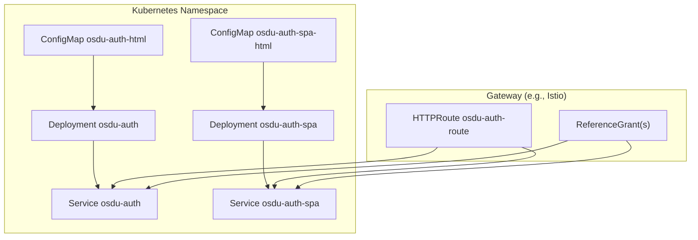
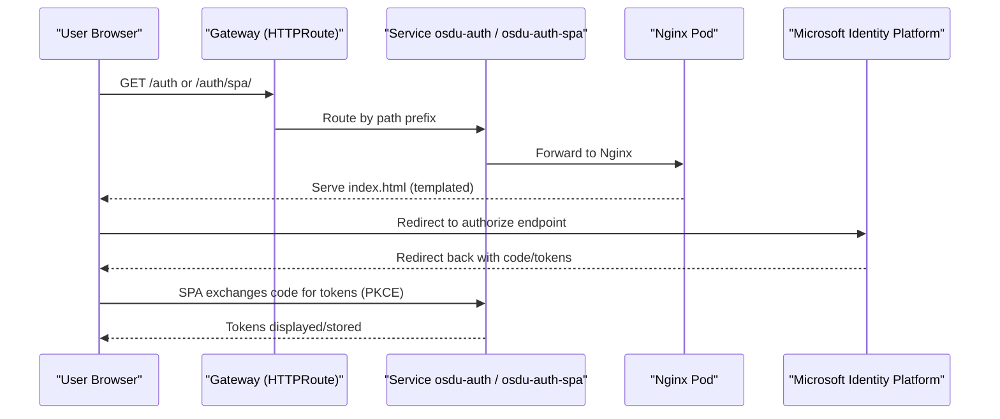
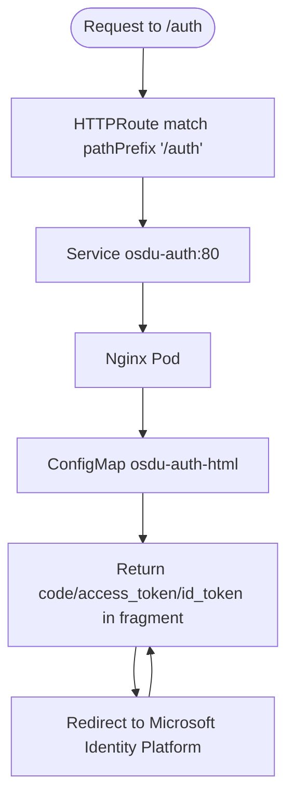
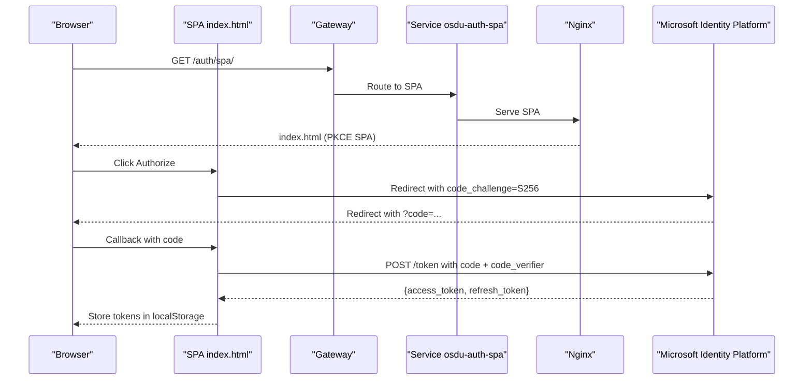
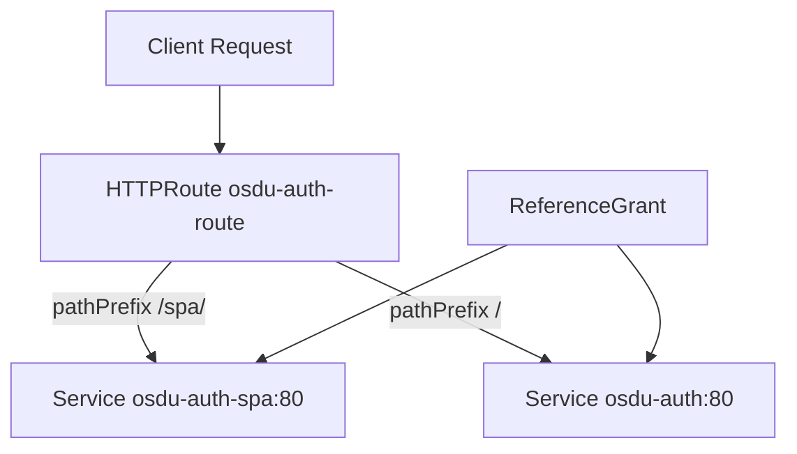
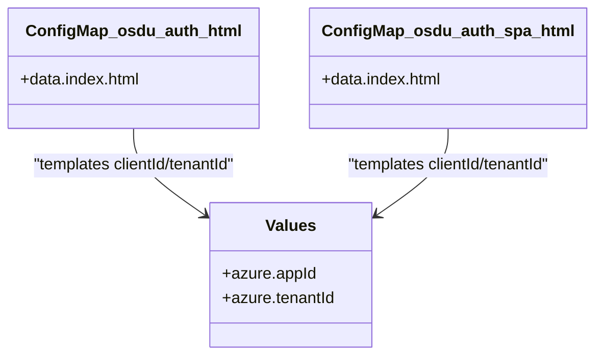
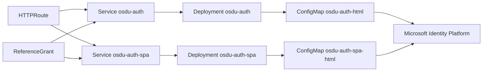

# OSDU Developer Auth Chart

<cite>
**Referenced Files in This Document**
- [Chart.yaml](file://charts/osdu-developer-auth/Chart.yaml)
- [README.md](file://charts/osdu-developer-auth/README.md)
- [deployment.yaml](file://charts/osdu-developer-auth/templates/deployment.yaml)
- [config-map.yaml](file://charts/osdu-developer-auth/templates/config-map.yaml)
- [http-route.yaml](file://charts/osdu-developer-auth/templates/http-route.yaml)
- [service.yaml](file://charts/osdu-developer-auth/templates/service.yaml)
- [deployment-spa.yaml](file://charts/osdu-developer-auth/templates/deployment-spa.yaml)
- [config-map-spa.yaml](file://charts/osdu-developer-auth/templates/config-map-spa.yaml)
- [service-spa.yaml](file://charts/osdu-developer-auth/templates/service-spa.yaml)
- [reference-grant.yaml](file://charts/osdu-developer-auth/templates/reference-grant.yaml)
- [_helpers.tpl](file://charts/osdu-developer-auth/templates/_helpers.tpl)
</cite>

## Table of Contents
1. [Introduction](#introduction)
2. [Project Structure](#project-structure)
3. [Core Components](#core-components)
4. [Architecture Overview](#architecture-overview)
5. [Detailed Component Analysis](#detailed-component-analysis)
6. [Dependency Analysis](#dependency-analysis)
7. [Performance Considerations](#performance-considerations)
8. [Troubleshooting Guide](#troubleshooting-guide)
9. [Conclusion](#conclusion)
10. [Appendices](#appendices)

## Introduction
This document provides comprehensive documentation for the OSDU Developer Authentication Helm chart that deploys a lightweight, client-side OAuth2/OpenID Connect experience using Nginx and Vue-based HTML pages. It explains how the chart renders authentication UIs, configures Microsoft Identity Platform (v2.0) flows, exposes routes via Kubernetes Gateway API, and integrates with an API gateway through HTTPRoute resources. The focus is on deployment, configuration maps, routing, and practical guidance for customization, multi-tenant usage, audit logging, and troubleshooting.

## Project Structure
The chart is a standard Helm application chart that installs:
- Two Nginx deployments serving static HTML pages for authentication flows
- Services exposing each deployment on port 80
- A ConfigMap per deployment containing the rendered HTML templates
- An HTTPRoute resource to expose paths via a Gateway (e.g., Istio)
- ReferenceGrant resources to allow cross-namespace references from the Gateway namespace

**Diagram sources**
- [deployment.yaml:1-31](file://charts/osdu-developer-auth/templates/deployment.yaml#L1-L31)
- [service.yaml:1-16](file://charts/osdu-developer-auth/templates/service.yaml#L1-L16)
- [config-map.yaml:1-169](file://charts/osdu-developer-auth/templates/config-map.yaml#L1-L169)
- [deployment-spa.yaml:1-31](file://charts/osdu-developer-auth/templates/deployment-spa.yaml#L1-L31)
- [service-spa.yaml:1-16](file://charts/osdu-developer-auth/templates/service-spa.yaml#L1-L16)
- [config-map-spa.yaml:1-235](file://charts/osdu-developer-auth/templates/config-map-spa.yaml#L1-L235)
- [http-route.yaml:1-36](file://charts/osdu-developer-auth/templates/http-route.yaml#L1-L36)
- [reference-grant.yaml:1-34](file://charts/osdu-developer-auth/templates/reference-grant.yaml#L1-L34)

**Section sources**
- [Chart.yaml:1-9](file://charts/osdu-developer-auth/Chart.yaml#L1-L9)
- [README.md:1-24](file://charts/osdu-developer-auth/README.md#L1-L24)

## Core Components
- Nginx Deployments: Serve static HTML pages for both legacy and modern SPA-based OAuth flows.
- ConfigMaps: Contain the rendered index.html files injected with Azure AD values (client ID, tenant ID).
- Services: Expose ports 80 for internal cluster access and external routing.
- HTTPRoute: Routes traffic under configured path prefixes to the appropriate Service.
- ReferenceGrant: Allows the Gateway (typically in istio-system) to reference Services in this namespace.

Key configuration inputs:
- Values for Azure identity provider: clientId and tenantId are templated into the HTML pages.
- Gateway integration: hosts, gateways, and path values control route exposure.

**Section sources**
- [deployment.yaml:1-31](file://charts/osdu-developer-auth/templates/deployment.yaml#L1-L31)
- [config-map.yaml:1-169](file://charts/osdu-developer-auth/templates/config-map.yaml#L1-L169)
- [http-route.yaml:1-36](file://charts/osdu-developer-auth/templates/http-route.yaml#L1-L36)
- [service.yaml:1-16](file://charts/osdu-developer-auth/templates/service.yaml#L1-L16)
- [deployment-spa.yaml:1-31](file://charts/osdu-developer-auth/templates/deployment-spa.yaml#L1-L31)
- [config-map-spa.yaml:1-235](file://charts/osdu-developer-auth/templates/config-map-spa.yaml#L1-L235)
- [service-spa.yaml:1-16](file://charts/osdu-developer-auth/templates/service-spa.yaml#L1-L16)
- [reference-grant.yaml:1-34](file://charts/osdu-developer-auth/templates/reference-grant.yaml#L1-L34)

## Architecture Overview
The chart deploys two independent Nginx services:
- Legacy flow: A simple page that builds an authorize URL to Microsoft Identity Platform and displays returned tokens in the URL fragment.
- Modern SPA flow: A Vue-based page implementing PKCE (code_challenge/code_verifier), exchanging authorization codes for tokens, and refreshing access tokens using stored refresh tokens.

Traffic enters via a Gateway-managed HTTPRoute, which forwards requests to either service based on path prefix.

**Diagram sources**
- [http-route.yaml:1-36](file://charts/osdu-developer-auth/templates/http-route.yaml#L1-L36)
- [service.yaml:1-16](file://charts/osdu-developer-auth/templates/service.yaml#L1-L16)
- [service-spa.yaml:1-16](file://charts/osdu-developer-auth/templates/service-spa.yaml#L1-L16)
- [config-map.yaml:1-169](file://charts/osdu-developer-auth/templates/config-map.yaml#L1-L169)
- [config-map-spa.yaml:1-235](file://charts/osdu-developer-auth/templates/config-map-spa.yaml#L1-L235)

## Detailed Component Analysis

### Authentication Service Deployment (Legacy Flow)
- Deployment runs a single replica of Nginx serving static HTML from a ConfigMap mounted at /usr/share/nginx/html/auth.
- The ConfigMap contains an HTML page that constructs an authorize URL to Microsoft Identity Platform v2.0 and parses returned parameters from the URL fragment.
- Service exposes port 80; HTTPRoute matches path prefix to forward to this Service.

**Diagram sources**
- [deployment.yaml:1-31](file://charts/osdu-developer-auth/templates/deployment.yaml#L1-L31)
- [config-map.yaml:1-169](file://charts/osdu-developer-auth/templates/config-map.yaml#L1-L169)
- [service.yaml:1-16](file://charts/osdu-developer-auth/templates/service.yaml#L1-L16)
- [http-route.yaml:1-36](file://charts/osdu-developer-auth/templates/http-route.yaml#L1-L36)

**Section sources**
- [deployment.yaml:1-31](file://charts/osdu-developer-auth/templates/deployment.yaml#L1-L31)
- [config-map.yaml:1-169](file://charts/osdu-developer-auth/templates/config-map.yaml#L1-L169)
- [service.yaml:1-16](file://charts/osdu-developer-auth/templates/service.yaml#L1-L16)
- [http-route.yaml:1-36](file://charts/osdu-developer-auth/templates/http-route.yaml#L1-L36)

### SPA-Based Authentication (Modern Flow with PKCE)
- Deployment serves a Vue-based SPA from a separate ConfigMap mounted at /usr/share/nginx/html/auth/spa.
- The SPA implements PKCE: generates a code verifier and SHA-256 code challenge, stores the verifier, and redirects to the authorize endpoint.
- On callback, it exchanges the authorization code for access and refresh tokens, storing them in localStorage and clearing the URL query string.
- Supports token refresh using stored refresh tokens.

**Diagram sources**
- [deployment-spa.yaml:1-31](file://charts/osdu-developer-auth/templates/deployment-spa.yaml#L1-L31)
- [config-map-spa.yaml:1-235](file://charts/osdu-developer-auth/templates/config-map-spa.yaml#L1-L235)
- [service-spa.yaml:1-16](file://charts/osdu-developer-auth/templates/service-spa.yaml#L1-L16)
- [http-route.yaml:1-36](file://charts/osdu-developer-auth/templates/http-route.yaml#L1-L36)

**Section sources**
- [deployment-spa.yaml:1-31](file://charts/osdu-developer-auth/templates/deployment-spa.yaml#L1-L31)
- [config-map-spa.yaml:1-235](file://charts/osdu-developer-auth/templates/config-map-spa.yaml#L1-L235)
- [service-spa.yaml:1-16](file://charts/osdu-developer-auth/templates/service-spa.yaml#L1-L16)
- [http-route.yaml:1-36](file://charts/osdu-developer-auth/templates/http-route.yaml#L1-L36)

### HTTP Route Configuration and Gateway Integration
- HTTPRoute defines two rules:
  - PathPrefix for SPA: routes to osdu-auth-spa Service on port 80
  - PathPrefix for main auth: routes to osdu-auth Service on port 80
- ReferenceGrant allows the Gateway (in istio-system) to reference these Services.
- Routing is gated by presence of hosts and gateways values.

**Diagram sources**
- [http-route.yaml:1-36](file://charts/osdu-developer-auth/templates/http-route.yaml#L1-L36)
- [reference-grant.yaml:1-34](file://charts/osdu-developer-auth/templates/reference-grant.yaml#L1-L34)

**Section sources**
- [http-route.yaml:1-36](file://charts/osdu-developer-auth/templates/http-route.yaml#L1-L36)
- [reference-grant.yaml:1-34](file://charts/osdu-developer-auth/templates/reference-grant.yaml#L1-L34)

### Configuration Maps and Templating
- ConfigMap osdu-auth-html: Renders a legacy Vue page with fields for ClientId, TenantId, RedirectUrl, ResponseType, ResponseMode, Scope, and buttons to authorize and decode tokens.
- ConfigMap osdu-auth-spa-html: Renders a modern SPA with PKCE support, token exchange, refresh, and decoding utilities.
- Both templates inject values from .Values.azure.appId and .Values.azure.tenantId.

**Diagram sources**
- [config-map.yaml:1-169](file://charts/osdu-developer-auth/templates/config-map.yaml#L1-L169)
- [config-map-spa.yaml:1-235](file://charts/osdu-developer-auth/templates/config-map-spa.yaml#L1-L235)

**Section sources**
- [config-map.yaml:1-169](file://charts/osdu-developer-auth/templates/config-map.yaml#L1-L169)
- [config-map-spa.yaml:1-235](file://charts/osdu-developer-auth/templates/config-map-spa.yaml#L1-L235)

### Helper Templates
- Standard Helm helpers define names, fullnames, chart metadata, labels, and selector labels used across templates.

**Section sources**
- [_helpers.tpl:1-52](file://charts/osdu-developer-auth/templates/_helpers.tpl#L1-L52)

## Dependency Analysis
- The chart depends on:
  - Kubernetes core objects: Deployment, Service, ConfigMap
  - Gateway API: HTTPRoute and ReferenceGrant
  - External identity provider: Microsoft Identity Platform (v2.0)
- Coupling:
  - HTTPRoute binds to specific Service names and ports
  - ReferenceGrant must exist when using a Gateway in a different namespace
  - HTML templates depend on provided Azure values for clientId and tenantId

**Diagram sources**
- [http-route.yaml:1-36](file://charts/osdu-developer-auth/templates/http-route.yaml#L1-L36)
- [reference-grant.yaml:1-34](file://charts/osdu-developer-auth/templates/reference-grant.yaml#L1-L34)
- [service.yaml:1-16](file://charts/osdu-developer-auth/templates/service.yaml#L1-L16)
- [service-spa.yaml:1-16](file://charts/osdu-developer-auth/templates/service-spa.yaml#L1-L16)
- [deployment.yaml:1-31](file://charts/osdu-developer-auth/templates/deployment.yaml#L1-L31)
- [deployment-spa.yaml:1-31](file://charts/osdu-developer-auth/templates/deployment-spa.yaml#L1-L31)
- [config-map.yaml:1-169](file://charts/osdu-developer-auth/templates/config-map.yaml#L1-L169)
- [config-map-spa.yaml:1-235](file://charts/osdu-developer-auth/templates/config-map-spa.yaml#L1-L235)

**Section sources**
- [http-route.yaml:1-36](file://charts/osdu-developer-auth/templates/http-route.yaml#L1-L36)
- [reference-grant.yaml:1-34](file://charts/osdu-developer-auth/templates/reference-grant.yaml#L1-L34)

## Performance Considerations
- Single-replica deployments: Suitable for development; scale horizontally if needed by increasing replicas in the Deployment specs.
- Static content delivery: Nginx efficiently serves static HTML; ensure CDN caching policies are applied at the Gateway level for improved latency.
- Token operations: Token exchange and refresh occur client-side; minimize unnecessary refresh calls and cache tokens appropriately in the SPA.
- Gateway routing: Use pathPrefix matching to reduce rule evaluation overhead and keep routes minimal.

[No sources needed since this section provides general guidance]

## Troubleshooting Guide
Common issues and resolutions:
- Missing or incorrect Azure values:
  - Ensure .Values.azure.appId and .Values.azure.tenantId are set correctly so templates render valid authorize URLs.
- Gateway not routing:
  - Verify hosts and gateways values are provided; HTTPRoute and ReferenceGrant are only created when both are present.
  - Confirm the Gateway namespace (default istio-system) matches your environment.
- CORS and security headers:
  - These are not configured in the chart; configure CORS and security headers at the Gateway or Nginx layer as needed.
- SPA token exchange failures:
  - Check that redirect_uri matches the registered reply URI in the identity provider.
  - Validate that code_challenge method is S256 and code_verifier is stored and sent during token exchange.
- Accessing tokens:
  - Legacy flow returns tokens in URL fragment; modern SPA uses query parameter and stores tokens in localStorage.

**Section sources**
- [config-map.yaml:1-169](file://charts/osdu-developer-auth/templates/config-map.yaml#L1-L169)
- [config-map-spa.yaml:1-235](file://charts/osdu-developer-auth/templates/config-map-spa.yaml#L1-L235)
- [http-route.yaml:1-36](file://charts/osdu-developer-auth/templates/http-route.yaml#L1-L36)
- [reference-grant.yaml:1-34](file://charts/osdu-developer-auth/templates/reference-grant.yaml#L1-L34)

## Conclusion
The OSDU Developer Auth chart provides a flexible, client-side OAuth2/OIDC experience backed by Nginx and modern SPA techniques. It integrates seamlessly with Kubernetes Gateway API for routing and supports both legacy and PKCE-based flows against Microsoft Identity Platform. With straightforward configuration via Helm values and clear separation between services and routes, it can be customized for multi-tenant scenarios, extended with additional logging, and adapted to various gateway configurations.

[No sources needed since this section summarizes without analyzing specific files]

## Appendices

### Customizing Authentication Flows
- Modify the SPA logic to adjust scopes, response modes, or add custom claims handling.
- Extend the legacy page to include additional parameters or integrate with other identity providers by changing the authorize endpoint and scopes.

**Section sources**
- [config-map.yaml:1-169](file://charts/osdu-developer-auth/templates/config-map.yaml#L1-L169)
- [config-map-spa.yaml:1-235](file://charts/osdu-developer-auth/templates/config-map-spa.yaml#L1-L235)

### Multi-Tenant Support
- Use Helm values to switch tenantId per release or environment.
- For runtime tenant selection, extend the SPA to accept tenant input and update the authorize URL accordingly.

**Section sources**
- [config-map.yaml:1-169](file://charts/osdu-developer-auth/templates/config-map.yaml#L1-L169)
- [config-map-spa.yaml:1-235](file://charts/osdu-developer-auth/templates/config-map-spa.yaml#L1-L235)

### Audit Logging
- Enable access logs in Nginx by mounting a custom Nginx configuration or sidecar container to capture request details.
- Integrate with observability tools via the Gateway to log authentication events and errors.

[No sources needed since this section provides general guidance]

### Implementing Custom Authentication Providers
- Replace the Microsoft Identity Platform endpoints in the HTML templates with your provider’s authorize/token endpoints.
- Adjust scopes, response types, and token parsing logic to match your provider’s specifications.

**Section sources**
- [config-map.yaml:1-169](file://charts/osdu-developer-auth/templates/config-map.yaml#L1-L169)
- [config-map-spa.yaml:1-235](file://charts/osdu-developer-auth/templates/config-map-spa.yaml#L1-L235)