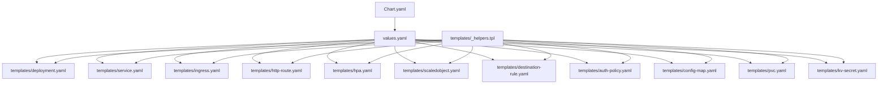
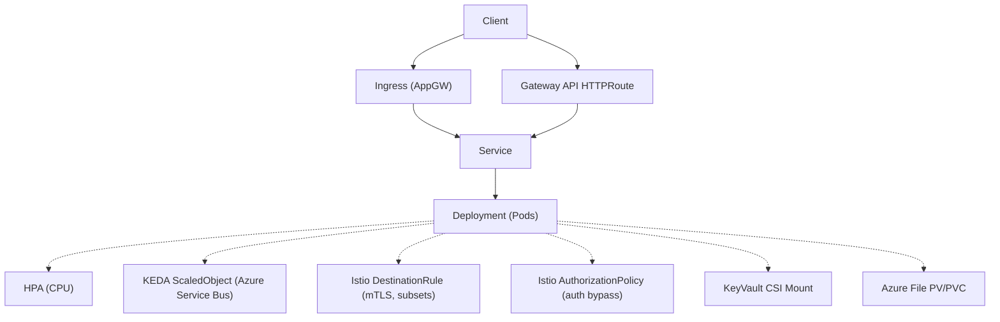
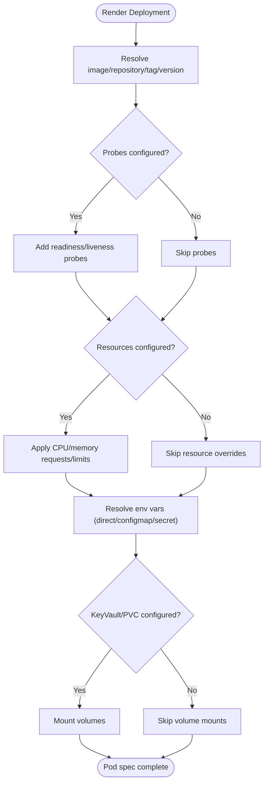
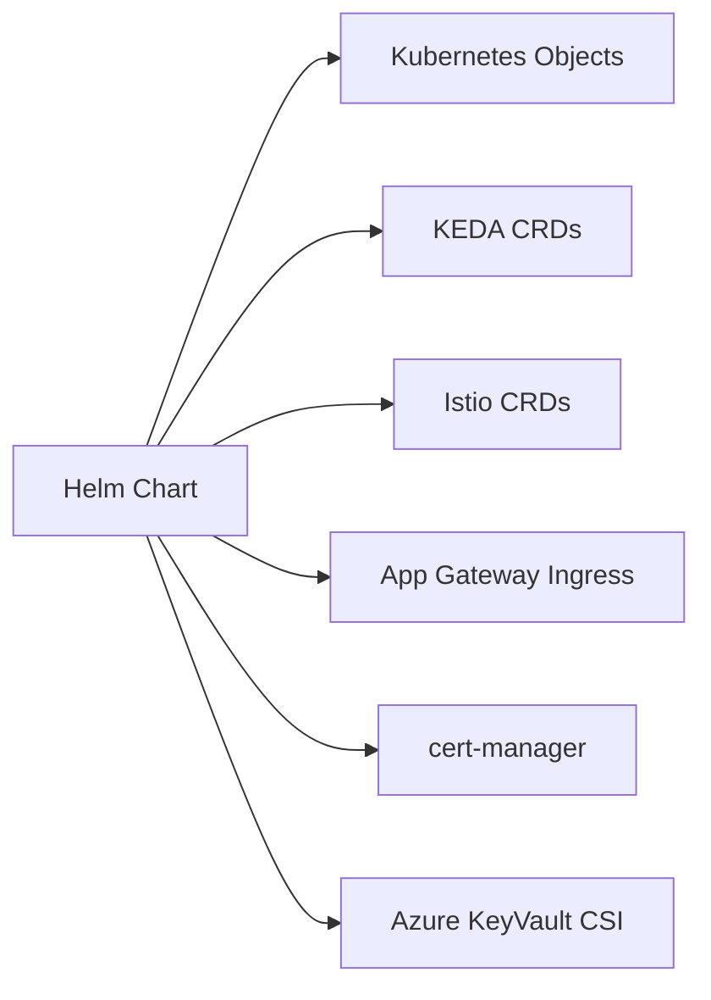

# OSDU Developer Service Chart

<cite>
**Referenced Files in This Document**
- [Chart.yaml](file://charts/osdu-developer-service/Chart.yaml)
- [values.yaml](file://charts/osdu-developer-service/values.yaml)
- [README.md](file://charts/osdu-developer-service/README.md)
- [_helpers.tpl](file://charts/osdu-developer-service/templates/_helpers.tpl)
- [deployment.yaml](file://charts/osdu-developer-service/templates/deployment.yaml)
- [hpa.yaml](file://charts/osdu-developer-service/templates/hpa.yaml)
- [scaledobject.yaml](file://charts/osdu-developer-service/templates/scaledobject.yaml)
- [service.yaml](file://charts/osdu-developer-service/templates/service.yaml)
- [ingress.yaml](file://charts/osdu-developer-service/templates/ingress.yaml)
- [http-route.yaml](file://charts/osdu-developer-service/templates/http-route.yaml)
- [auth-policy.yaml](file://charts/osdu-developer-service/templates/auth-policy.yaml)
- [destination-rule.yaml](file://charts/osdu-developer-service/templates/destination-rule.yaml)
- [config-map.yaml](file://charts/osdu-developer-service/templates/config-map.yaml)
- [pvc.yaml](file://charts/osdu-developer-service/templates/pvc.yaml)
- [kv-secret.yaml](file://charts/osdu-developer-service/templates/kv-secret.yaml)
- [base values.yaml](file://charts/osdu-developer-base/values.yaml)
</cite>

## Table of Contents
1. Introduction
2. Project Structure
3. Core Components
4. Architecture Overview
5. Detailed Component Analysis
6. Dependency Analysis
7. Performance Considerations
8. Troubleshooting Guide
9. Conclusion
10. Appendices

## Introduction
This document provides comprehensive documentation for the OSDU Developer Service Helm chart that deploys core microservices on Kubernetes. It explains deployment configuration, container specifications, resource limits, environment variables, service discovery, horizontal pod autoscaling (HPA), KEDA-based scaling, Kubernetes services, ingress routing, HTTP routes, health checks, monitoring endpoints, Istio integration, performance tuning, storage provisioning, and security configurations.

## Project Structure
The chart is located under charts/osdu-developer-service and includes:
- Chart metadata and versioning
- Default values for services, autoscaling, ingress, and per-service configuration
- Templates for Deployment, Service, Ingress, HTTPRoute, HPA, KEDA ScaledObject, Istio DestinationRule and AuthorizationPolicy, ConfigMap, PVC, and Azure KeyVault CSI SecretProviderClass
- Shared helpers for labels, selectors, and installation toggles

**Diagram sources**
- [Chart.yaml:1-10](file://charts/osdu-developer-service/Chart.yaml#L1-L10)
- [values.yaml:1-142](file://charts/osdu-developer-service/values.yaml#L1-L142)
- [_helpers.tpl:1-85](file://charts/osdu-developer-service/templates/_helpers.tpl#L1-L85)
- [deployment.yaml:1-178](file://charts/osdu-developer-service/templates/deployment.yaml#L1-L178)
- [service.yaml:1-26](file://charts/osdu-developer-service/templates/service.yaml#L1-L26)
- [ingress.yaml:1-42](file://charts/osdu-developer-service/templates/ingress.yaml#L1-L42)
- [http-route.yaml:1-45](file://charts/osdu-developer-service/templates/http-route.yaml#L1-L45)
- [hpa.yaml:1-33](file://charts/osdu-developer-service/templates/hpa.yaml#L1-L33)
- [scaledobject.yaml:1-25](file://charts/osdu-developer-service/templates/scaledobject.yaml#L1-L25)
- [destination-rule.yaml:1-27](file://charts/osdu-developer-service/templates/destination-rule.yaml#L1-L27)
- [auth-policy.yaml:1-29](file://charts/osdu-developer-service/templates/auth-policy.yaml#L1-L29)
- [config-map.yaml:1-15](file://charts/osdu-developer-service/templates/config-map.yaml#L1-L15)
- [pvc.yaml:1-51](file://charts/osdu-developer-service/templates/pvc.yaml#L1-L51)
- [kv-secret.yaml:1-37](file://charts/osdu-developer-service/templates/kv-secret.yaml#L1-L37)

**Section sources**
- [Chart.yaml:1-10](file://charts/osdu-developer-service/Chart.yaml#L1-L10)
- [values.yaml:1-142](file://charts/osdu-developer-service/values.yaml#L1-L142)
- [README.md:1-23](file://charts/osdu-developer-service/README.md#L1-L23)

## Core Components
- Deployment: Renders one or more service deployments from a list in values.yaml. Supports image repository/tag, pull policy, ports, readiness/liveness probes, resource requests/limits, persistent volume mounts, Azure KeyVault CSI mount, environment variables from direct values, ConfigMaps, and Secrets, plus node selection, affinity, tolerations, and subset labeling for traffic splitting.
- Service: Exposes each configured service with configurable type and port mapping to the container’s named port.
- Ingress: Creates an Application Gateway Ingress Controller resource with TLS via cert-manager or a pre-provisioned certificate, routing paths to services.
- HTTPRoute: Uses Gateway API to route traffic to services with optional CORS response header modification.
- HPA: Horizontal Pod Autoscaler based on CPU utilization when enabled.
- KEDA ScaledObject: Event-driven scaling using Azure Service Bus triggers for workloads defined via scaledObject entries.
- Istio Integration: DestinationRule for mTLS and subsets; AuthorizationPolicy to enforce authentication with bypass paths.
- Storage: Optional PersistentVolume/PersistentVolumeClaim for Azure File shares mounted into pods.
- Secrets: Optional SecretProviderClass to mount Azure KeyVault secrets into pods.

**Section sources**
- [deployment.yaml:1-178](file://charts/osdu-developer-service/templates/deployment.yaml#L1-L178)
- [service.yaml:1-26](file://charts/osdu-developer-service/templates/service.yaml#L1-L26)
- [ingress.yaml:1-42](file://charts/osdu-developer-service/templates/ingress.yaml#L1-L42)
- [http-route.yaml:1-45](file://charts/osdu-developer-service/templates/http-route.yaml#L1-L45)
- [hpa.yaml:1-33](file://charts/osdu-developer-service/templates/hpa.yaml#L1-L33)
- [scaledobject.yaml:1-25](file://charts/osdu-developer-service/templates/scaledobject.yaml#L1-L25)
- [destination-rule.yaml:1-27](file://charts/osdu-developer-service/templates/destination-rule.yaml#L1-L27)
- [auth-policy.yaml:1-29](file://charts/osdu-developer-service/templates/auth-policy.yaml#L1-L29)
- [pvc.yaml:1-51](file://charts/osdu-developer-service/templates/pvc.yaml#L1-L51)
- [kv-secret.yaml:1-37](file://charts/osdu-developer-service/templates/kv-secret.yaml#L1-L37)

## Architecture Overview
The chart renders a set of Kubernetes resources per service entry in values.configuration. Traffic can enter via Ingress or Gateway API HTTPRoute and is routed to the Service, which selects Pods managed by the Deployment. Scaling is handled by HPA (CPU-based) or KEDA (event-based). Security and traffic policies are enforced via Istio DestinationRule and AuthorizationPolicy. Secrets may be sourced from Azure KeyVault through CSI.

**Diagram sources**
- [ingress.yaml:1-42](file://charts/osdu-developer-service/templates/ingress.yaml#L1-L42)
- [http-route.yaml:1-45](file://charts/osdu-developer-service/templates/http-route.yaml#L1-L45)
- [service.yaml:1-26](file://charts/osdu-developer-service/templates/service.yaml#L1-L26)
- [deployment.yaml:1-178](file://charts/osdu-developer-service/templates/deployment.yaml#L1-L178)
- [hpa.yaml:1-33](file://charts/osdu-developer-service/templates/hpa.yaml#L1-L33)
- [scaledobject.yaml:1-25](file://charts/osdu-developer-service/templates/scaledobject.yaml#L1-L25)
- [destination-rule.yaml:1-27](file://charts/osdu-developer-service/templates/destination-rule.yaml#L1-L27)
- [auth-policy.yaml:1-29](file://charts/osdu-developer-service/templates/auth-policy.yaml#L1-L29)
- [kv-secret.yaml:1-37](file://charts/osdu-developer-service/templates/kv-secret.yaml#L1-L37)
- [pvc.yaml:1-51](file://charts/osdu-developer-service/templates/pvc.yaml#L1-L51)

## Detailed Component Analysis

### Deployment Configuration
- Container image and tag are templated per service entry; supports appending osduVersion when repository ends with a dash.
- Ports expose a named “http” port derived from service.port.
- Health probes:
  - Readiness probe always uses httpGet with path/port from .probe.
  - Optional liveness probe with delay and periodSeconds.
- Resources:
  - Requests and limits for CPU/memory are applied when provided.
- Environment variables:
  - Direct value, ConfigMap key reference, or Secret key reference.
  - Global envFrom referencing a ConfigMap name is supported.
- Storage:
  - Azure KeyVault CSI volume mount when .keyvault is true.
  - PVCs defined in .pvc are mounted with optional subPath.
- Scheduling:
  - Node selector, affinity zones/pools, and tolerations are supported.
- Identity:
  - Workload identity annotation is set; service account defaults to workload-identity-sa.

**Diagram sources**
- [deployment.yaml:1-178](file://charts/osdu-developer-service/templates/deployment.yaml#L1-L178)

**Section sources**
- [deployment.yaml:1-178](file://charts/osdu-developer-service/templates/deployment.yaml#L1-L178)
- [values.yaml:60-142](file://charts/osdu-developer-service/values.yaml#L60-L142)

### Service Discovery
- Service exposes TCP port(s) mapped to the named container port “http”.
- Selector matches labels generated by helpers for the release and app instance.

**Section sources**
- [service.yaml:1-26](file://charts/osdu-developer-service/templates/service.yaml#L1-L26)
- [_helpers.tpl:35-52](file://charts/osdu-developer-service/templates/_helpers.tpl#L35-L52)

### Ingress Routing
- Creates an Application Gateway Ingress resource with annotations for timeouts and connection draining.
- TLS termination via cert-manager cluster issuer or a pre-provisioned secret when using KeyVault-backed certificates.
- Routes host and path rules to services based on configuration entries.

**Section sources**
- [ingress.yaml:1-42](file://charts/osdu-developer-service/templates/ingress.yaml#L1-L42)
- [values.yaml:28-35](file://charts/osdu-developer-service/values.yaml#L28-L35)

### HTTP Route Configuration (Gateway API)
- Defines HTTPRoute resources bound to Gateways (e.g., Istio gateway) with path prefix matching.
- Optional CORS filters add response headers for cross-origin requests.

**Section sources**
- [http-route.yaml:1-45](file://charts/osdu-developer-service/templates/http-route.yaml#L1-L45)
- [values.yaml:60-142](file://charts/osdu-developer-service/values.yaml#L60-L142)

### Horizontal Pod Autoscaling (HPA)
- When autoscale is enabled, creates an HPA targeting the Deployment by name.
- Scales based on CPU utilization target percentage between min and max replicas.

**Section sources**
- [hpa.yaml:1-33](file://charts/osdu-developer-service/templates/hpa.yaml#L1-L33)
- [values.yaml:22-25](file://charts/osdu-developer-service/values.yaml#L22-L25)

### KEDA-Based Scaling
- For entries with scaledObject, creates a KEDA ScaledObject triggered by Azure Service Bus messages.
- Requires subscription/topic names and a connection reference.

**Section sources**
- [scaledobject.yaml:1-25](file://charts/osdu-developer-service/templates/scaledobject.yaml#L1-L25)
- [values.yaml:60-142](file://charts/osdu-developer-service/values.yaml#L60-L142)

### Istio Service Mesh Integration
- DestinationRule:
  - Sets mTLS mode to ISTIO_MUTUAL.
  - Defines subsets for traffic splitting based on version label.
  - Applies connection pool and load balancer settings.
- AuthorizationPolicy:
  - Denies requests unless they originate from authenticated principals.
  - Allows bypass paths for health checks, docs, and other public endpoints.

**Section sources**
- [destination-rule.yaml:1-27](file://charts/osdu-developer-service/templates/destination-rule.yaml#L1-L27)
- [auth-policy.yaml:1-29](file://charts/osdu-developer-service/templates/auth-policy.yaml#L1-L29)
- [values.yaml:106-122](file://charts/osdu-developer-service/values.yaml#L106-L122)

### Storage Provisioning
- PVC/PV:
  - Creates Azure File PV/PVC pairs for read-only sharing when configured.
  - Mount options include directory/file modes and user/group IDs.
- KeyVault CSI:
  - SecretProviderClass maps KeyVault secrets to Kubernetes secrets and mounts them into pods.

**Section sources**
- [pvc.yaml:1-51](file://charts/osdu-developer-service/templates/pvc.yaml#L1-L51)
- [kv-secret.yaml:1-37](file://charts/osdu-developer-service/templates/kv-secret.yaml#L1-L37)
- [values.yaml:96-104](file://charts/osdu-developer-service/values.yaml#L96-L104)
- [values.yaml:80-84](file://charts/osdu-developer-service/values.yaml#L80-L84)

### Environment Variables and Configuration
- Per-service environment variables support:
  - Direct values
  - Values from ConfigMaps
  - Values from Secrets
- Global ConfigMap injection via envFrom is supported.
- Additional ConfigMaps can be created per service entry.

**Section sources**
- [deployment.yaml:149-175](file://charts/osdu-developer-service/templates/deployment.yaml#L149-L175)
- [config-map.yaml:1-15](file://charts/osdu-developer-service/templates/config-map.yaml#L1-L15)
- [values.yaml:123-142](file://charts/osdu-developer-service/values.yaml#L123-L142)

### Health Checks and Monitoring Endpoints
- Configure readiness and optional liveness probes via .probe to ensure service availability and liveness.
- Use Istio AuthorizationPolicy bypass paths to allow unauthenticated access to health endpoints (e.g., actuator/health).

**Section sources**
- [deployment.yaml:102-116](file://charts/osdu-developer-service/templates/deployment.yaml#L102-L116)
- [values.yaml:70-79](file://charts/osdu-developer-service/values.yaml#L70-L79)
- [values.yaml:106-122](file://charts/osdu-developer-service/values.yaml#L106-L122)

### Customizing Service Deployments
- Define multiple services under configuration, each with:
  - repository, tag, path
  - replicaCount override
  - request/limit resources
  - pvc/mount definitions
  - auth bypass paths
  - env variables
  - keyvault usage flag
- Use base values for global defaults such as resourceLimits and Azure integration.

**Section sources**
- [values.yaml:60-142](file://charts/osdu-developer-service/values.yaml#L60-L142)
- [base values.yaml:1-38](file://charts/osdu-developer-base/values.yaml#L1-L38)

## Dependency Analysis
- The chart relies on:
  - Kubernetes API objects: Deployment, Service, Ingress, HTTPRoute, HPA, PVC/PV, ConfigMap, Secret
  - KEDA CRDs: ScaledObject
  - Istio CRDs: DestinationRule, AuthorizationPolicy
  - Azure App Gateway Ingress Controller annotations
  - cert-manager for TLS issuance (optional)
  - Azure KeyVault CSI driver for secrets mounting

**Diagram sources**
- [hpa.yaml:1-33](file://charts/osdu-developer-service/templates/hpa.yaml#L1-L33)
- [scaledobject.yaml:1-25](file://charts/osdu-developer-service/templates/scaledobject.yaml#L1-L25)
- [destination-rule.yaml:1-27](file://charts/osdu-developer-service/templates/destination-rule.yaml#L1-L27)
- [auth-policy.yaml:1-29](file://charts/osdu-developer-service/templates/auth-policy.yaml#L1-L29)
- [ingress.yaml:1-42](file://charts/osdu-developer-service/templates/ingress.yaml#L1-L42)
- [kv-secret.yaml:1-37](file://charts/osdu-developer-service/templates/kv-secret.yaml#L1-L37)

**Section sources**
- [hpa.yaml:1-33](file://charts/osdu-developer-service/templates/hpa.yaml#L1-L33)
- [scaledobject.yaml:1-25](file://charts/osdu-developer-service/templates/scaledobject.yaml#L1-L25)
- [destination-rule.yaml:1-27](file://charts/osdu-developer-service/templates/destination-rule.yaml#L1-L27)
- [auth-policy.yaml:1-29](file://charts/osdu-developer-service/templates/auth-policy.yaml#L1-L29)
- [ingress.yaml:1-42](file://charts/osdu-developer-service/templates/ingress.yaml#L1-L42)
- [kv-secret.yaml:1-37](file://charts/osdu-developer-service/templates/kv-secret.yaml#L1-L37)

## Performance Considerations
- Resource requests and limits:
  - Set appropriate CPU and memory requests/limits per service to ensure stable scheduling and prevent throttling.
- Autoscaling:
  - Use HPA with realistic CPU utilization targets to scale out under load.
  - For event-driven workloads, prefer KEDA ScaledObject with Azure Service Bus triggers to scale to zero and back up quickly.
- Connection pooling and timeouts:
  - Adjust Istio DestinationRule connectionPool.maxConnections and Ingress timeouts/drain settings for high-throughput scenarios.
- Storage:
  - Use ReadOnlyMany Azure File shares where possible to reduce contention.
  - Ensure adequate capacity and correct mount options for performance.
- Observability:
  - Expose metrics endpoints and configure Prometheus scraping at the cluster level.
  - Leverage Istio telemetry and enable tracing if needed.

[No sources needed since this section provides general guidance]

## Troubleshooting Guide
- Pods not ready:
  - Verify readiness/liveness probe paths and ports match the application endpoints.
  - Check events for probe failures and adjust initialDelaySeconds or periodSeconds.
- Scaling issues:
  - Confirm HPA metrics source availability and that CPU requests are set.
  - For KEDA, verify Service Bus topic/subscription names and credentials.
- Ingress routing:
  - Ensure hostnames and paths match configuration and that TLS secrets exist or cert-manager can issue certificates.
- Istio authorization errors:
  - Add necessary bypass paths in auth.disable to allow health checks and public endpoints.
  - Validate DestinationRule subsets and mTLS settings align with mesh configuration.
- Storage mount failures:
  - Validate PVC/PV bindings and Azure File share permissions.
  - Check KeyVault CSI SecretProviderClass parameters and identity permissions.

**Section sources**
- [deployment.yaml:102-116](file://charts/osdu-developer-service/templates/deployment.yaml#L102-L116)
- [hpa.yaml:1-33](file://charts/osdu-developer-service/templates/hpa.yaml#L1-L33)
- [scaledobject.yaml:1-25](file://charts/osdu-developer-service/templates/scaledobject.yaml#L1-L25)
- [ingress.yaml:1-42](file://charts/osdu-developer-service/templates/ingress.yaml#L1-L42)
- [auth-policy.yaml:1-29](file://charts/osdu-developer-service/templates/auth-policy.yaml#L1-L29)
- [pvc.yaml:1-51](file://charts/osdu-developer-service/templates/pvc.yaml#L1-L51)
- [kv-secret.yaml:1-37](file://charts/osdu-developer-service/templates/kv-secret.yaml#L1-L37)

## Conclusion
The OSDU Developer Service chart provides a flexible, secure, and scalable way to deploy core microservices on Kubernetes. It supports standard autoscaling via HPA and event-driven scaling via KEDA, integrates with Istio for secure service-to-service communication, and offers robust ingress and HTTP routing options. With configurable health checks, environment variables, storage mounts, and KeyVault-backed secrets, it enables tailored deployments for diverse environments while maintaining strong operational controls.

[No sources needed since this section summarizes without analyzing specific files]

## Appendices

### Quick Reference: Key Configuration Areas
- Services and containers:
  - repository, tag, path, probe, request/limit, pvc/mount, auth.disable, env
- Autoscaling:
  - autoscale.minReplicas, autoscale.maxReplicas, autoscale.targetUtilization
  - scaledObject with Azure Service Bus triggers
- Networking:
  - service.type, service.port, ingress.dns, ingress.issuer, ingress.enableKeyvaultCert
  - http-route gateways and cors
- Security:
  - istio destination rule subsets and mTLS
  - istio authorization policy bypass paths
- Storage:
  - pvc definitions and azure file share details
  - keyvault CSI SecretProviderClass parameters

**Section sources**
- [values.yaml:22-35](file://charts/osdu-developer-service/values.yaml#L22-L35)
- [values.yaml:60-142](file://charts/osdu-developer-service/values.yaml#L60-L142)
- [hpa.yaml:1-33](file://charts/osdu-developer-service/templates/hpa.yaml#L1-L33)
- [scaledobject.yaml:1-25](file://charts/osdu-developer-service/templates/scaledobject.yaml#L1-L25)
- [http-route.yaml:1-45](file://charts/osdu-developer-service/templates/http-route.yaml#L1-L45)
- [destination-rule.yaml:1-27](file://charts/osdu-developer-service/templates/destination-rule.yaml#L1-L27)
- [auth-policy.yaml:1-29](file://charts/osdu-developer-service/templates/auth-policy.yaml#L1-L29)
- [pvc.yaml:1-51](file://charts/osdu-developer-service/templates/pvc.yaml#L1-L51)
- [kv-secret.yaml:1-37](file://charts/osdu-developer-service/templates/kv-secret.yaml#L1-L37)