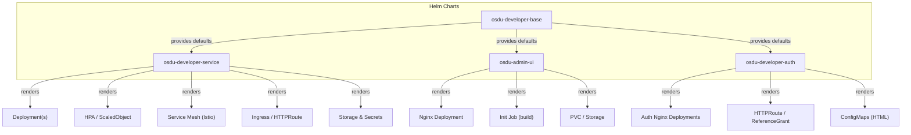
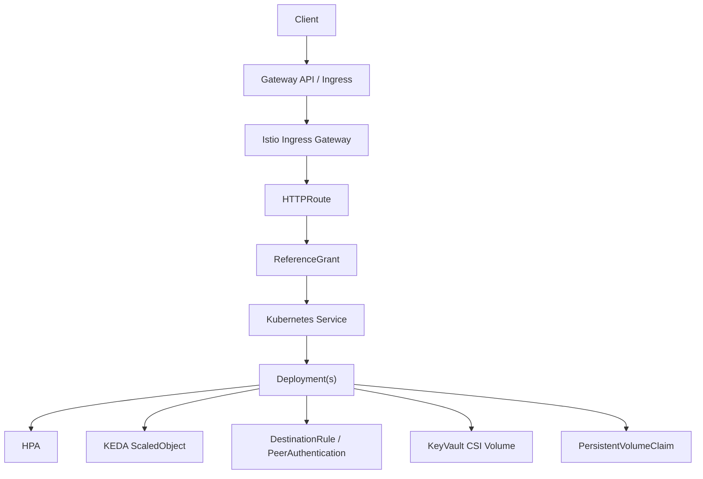
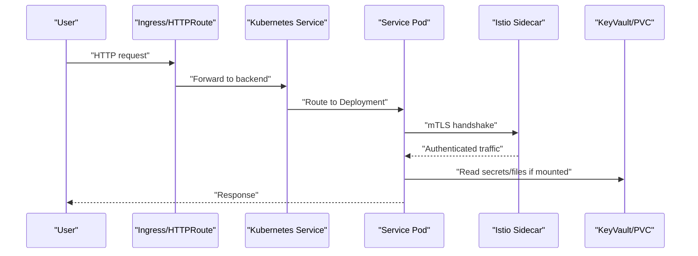
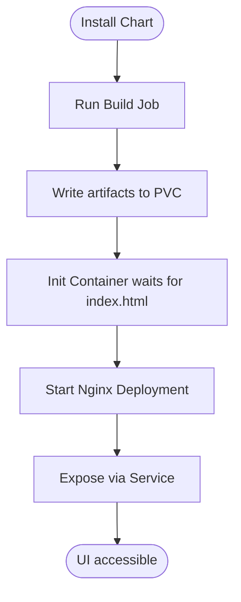
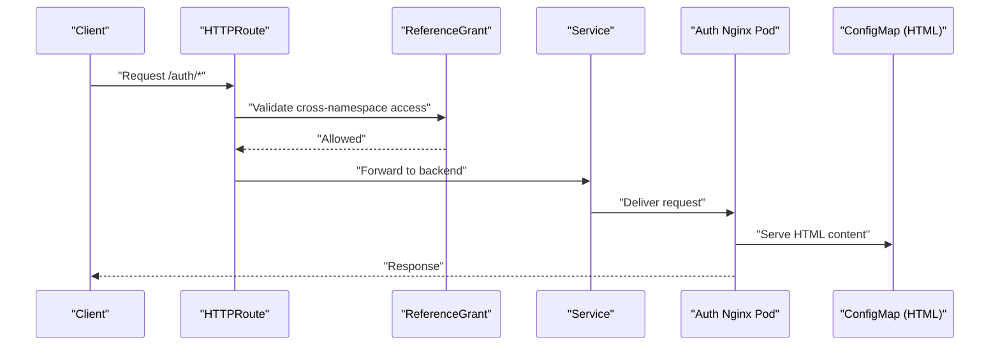
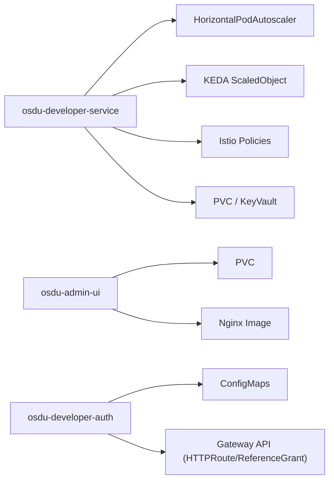

# Service Deployment Charts

<cite>
**Referenced Files in This Document**
- [Chart.yaml](file://charts/osdu-developer-service/Chart.yaml)
- [values.yaml](file://charts/osdu-developer-service/values.yaml)
- [deployment.yaml](file://charts/osdu-developer-service/templates/deployment.yaml)
- [hpa.yaml](file://charts/osdu-developer-service/templates/hpa.yaml)
- [scaledobject.yaml](file://charts/osdu-developer-service/templates/scaledobject.yaml)
- [destination-rule.yaml](file://charts/osdu-developer-service/templates/destination-rule.yaml)
- [auth-policy.yaml](file://charts/osdu-developer-service/templates/auth-policy.yaml)
- [http-route.yaml](file://charts/osdu-developer-service/templates/http-route.yaml)
- [ingress.yaml](file://charts/osdu-developer-service/templates/ingress.yaml)
- [service.yaml](file://charts/osdu-developer-service/templates/service.yaml)
- [pvc.yaml](file://charts/osdu-developer-service/templates/pvc.yaml)
- [kv-secret.yaml](file://charts/osdu-developer-service/templates/kv-secret.yaml)
- [config-map.yaml](file://charts/osdu-developer-service/templates/config-map.yaml)
- [Chart.yaml](file://charts/osdu-admin-ui/Chart.yaml)
- [web-site.yaml](file://charts/osdu-admin-ui/templates/web-site.yaml)
- [job.yaml](file://charts/osdu-admin-ui/templates/job.yaml)
- [storage.yaml](file://charts/osdu-admin-ui/templates/storage.yaml)
- [code.yaml](file://charts/osdu-admin-ui/templates/code.yaml)
- [Chart.yaml](file://charts/osdu-developer-auth/Chart.yaml)
- [deployment.yaml](file://charts/osdu-developer-auth/templates/deployment.yaml)
- [deployment-spa.yaml](file://charts/osdu-developer-auth/templates/deployment-spa.yaml)
- [service.yaml](file://charts/osdu-developer-auth/templates/service.yaml)
- [service-spa.yaml](file://charts/osdu-developer-auth/templates/service-spa.yaml)
- [http-route.yaml](file://charts/osdu-developer-auth/templates/http-route.yaml)
- [reference-grant.yaml](file://charts/osdu-developer-auth/templates/reference-grant.yaml)
- [config-map.yaml](file://charts/osdu-developer-auth/templates/config-map.yaml)
- [config-map-spa.yaml](file://charts/osdu-developer-auth/templates/config-map-spa.yaml)
- [Chart.yaml](file://charts/osdu-developer-base/Chart.yaml)
- [values.yaml](file://charts/osdu-developer-base/values.yaml)
</cite>

## Table of Contents
1. [Introduction](#introduction)
2. [Project Structure](#project-structure)
3. [Core Components](#core-components)
4. [Architecture Overview](#architecture-overview)
5. [Detailed Component Analysis](#detailed-component-analysis)
6. [Dependency Analysis](#dependency-analysis)
7. [Performance Considerations](#performance-considerations)
8. [Troubleshooting Guide](#troubleshooting-guide)
9. [Conclusion](#conclusion)
10. [Appendices](#appendices)

## Introduction
This document provides detailed guidance for deploying OSDU services using Helm charts, focusing on:
- osdu-developer-service: core microservices deployment with autoscaling and service mesh integration
- osdu-admin-ui: administrative interface deployment with build and storage workflows
- osdu-developer-auth: authentication UI deployment with HTTP routing and references

It covers deployment configurations, scaling options, health checks, monitoring integration points, service mesh setup, environment variables, storage configurations, and performance tuning parameters.

## Project Structure
The repository organizes deployments as Helm charts under charts/. Each chart contains templates that render Kubernetes resources and values files to customize behavior. The three primary charts are:
- osdu-developer-service: dynamic per-service configuration via a list of services; supports HPA and KEDA ScaledObject
- osdu-admin-ui: builds and serves static content via an init job and nginx deployment
- osdu-developer-auth: serves auth UI via nginx deployments and config maps

**Diagram sources**
- [deployment.yaml:17-177](file://charts/osdu-developer-service/templates/deployment.yaml#L17-L177)
- [hpa.yaml:1-33](file://charts/osdu-developer-service/templates/hpa.yaml#L1-L33)
- [scaledobject.yaml:1-25](file://charts/osdu-developer-service/templates/scaledobject.yaml#L1-L25)
- [web-site.yaml:1-70](file://charts/osdu-admin-ui/templates/web-site.yaml#L1-L70)
- [deployment.yaml:1-31](file://charts/osdu-developer-auth/templates/deployment.yaml#L1-L31)

**Section sources**
- [Chart.yaml:1-10](file://charts/osdu-developer-service/Chart.yaml#L1-L10)
- [Chart.yaml:1-9](file://charts/osdu-admin-ui/Chart.yaml#L1-L9)
- [Chart.yaml:1-9](file://charts/osdu-developer-auth/Chart.yaml#L1-L9)
- [Chart.yaml:1-9](file://charts/osdu-developer-base/Chart.yaml#L1-L9)

## Core Components
- osdu-developer-service
  - Dynamic per-service deployments from a configuration list
  - Optional HorizontalPodAutoscaler or KEDA ScaledObject for scaling
  - Health probes, resource requests/limits, PVC mounts, KeyVault CSI mount
  - Environment variables from direct values, ConfigMap, or Secret
  - Service mesh integration via DestinationRule and RequestAuthentication policies
  - Ingress/HTTPRoute exposure
- osdu-admin-ui
  - Build job producing static assets into a persistent volume
  - Nginx deployment serving the built UI from the same volume
  - ConfigMap for nginx configuration
- osdu-developer-auth
  - Nginx-based deployments serving auth HTML from ConfigMaps
  - HTTPRoute and ReferenceGrant for secure ingress exposure
  - Separate SPA deployment option

**Section sources**
- [values.yaml:15-142](file://charts/osdu-developer-service/values.yaml#L15-L142)
- [deployment.yaml:17-177](file://charts/osdu-developer-service/templates/deployment.yaml#L17-L177)
- [hpa.yaml:1-33](file://charts/osdu-developer-service/templates/hpa.yaml#L1-L33)
- [scaledobject.yaml:1-25](file://charts/osdu-developer-service/templates/scaledobject.yaml#L1-L25)
- [web-site.yaml:1-70](file://charts/osdu-admin-ui/templates/web-site.yaml#L1-L70)
- [deployment.yaml:1-31](file://charts/osdu-developer-auth/templates/deployment.yaml#L1-L31)

## Architecture Overview
The deployment architecture centers around Helm-rendered Kubernetes objects:
- Core services run as Deployments with optional autoscaling (HPA/KEDA)
- Admin UI is built by a Job and served by Nginx
- Auth UI is served by Nginx with HTML provided by ConfigMaps
- Ingress/HTTPRoute exposes services through the cluster gateway
- Istio service mesh integrates via DestinationRule and RequestAuthentication

**Diagram sources**
- [http-route.yaml](file://charts/osdu-developer-service/templates/http-route.yaml)
- [reference-grant.yaml](file://charts/osdu-developer-service/templates/reference-grant.yaml)
- [destination-rule.yaml](file://charts/osdu-developer-service/templates/destination-rule.yaml)
- [hpa.yaml:1-33](file://charts/osdu-developer-service/templates/hpa.yaml#L1-L33)
- [scaledobject.yaml:1-25](file://charts/osdu-developer-service/templates/scaledobject.yaml#L1-L25)
- [deployment.yaml:17-177](file://charts/osdu-developer-service/templates/deployment.yaml#L17-L177)
- [pvc.yaml](file://charts/osdu-developer-service/templates/pvc.yaml)
- [kv-secret.yaml](file://charts/osdu-developer-service/templates/kv-secret.yaml)

## Detailed Component Analysis

### osdu-developer-service
- Deployment generation
  - Iterates over configuration entries to create one Deployment per service
  - Supports replica overrides per service and global defaults
  - Injects labels, annotations, node selectors, tolerations, affinity
  - Mounts KeyVault CSI volumes when enabled
  - Mounts PVCs defined per service
  - Configures readiness/liveness probes based on per-service probe settings
  - Applies resource requests/limits per service
  - Injects environment variables from direct values, ConfigMap keys, or Secret keys
- Autoscaling
  - HPA: CPU utilization-based scaling when configured
  - KEDA ScaledObject: Azure Service Bus trigger-based scaling when configured
- Service mesh
  - DestinationRule and RequestAuthentication policies for mTLS and JWT validation
- Exposure
  - Service and either Ingress or HTTPRoute for external access

**Diagram sources**
- [deployment.yaml:17-177](file://charts/osdu-developer-service/templates/deployment.yaml#L17-L177)
- [hpa.yaml:1-33](file://charts/osdu-developer-service/templates/hpa.yaml#L1-L33)
- [scaledobject.yaml:1-25](file://charts/osdu-developer-service/templates/scaledobject.yaml#L1-L25)
- [destination-rule.yaml](file://charts/osdu-developer-service/templates/destination-rule.yaml)
- [auth-policy.yaml](file://charts/osdu-developer-service/templates/auth-policy.yaml)
- [http-route.yaml](file://charts/osdu-developer-service/templates/http-route.yaml)
- [pvc.yaml](file://charts/osdu-developer-service/templates/pvc.yaml)
- [kv-secret.yaml](file://charts/osdu-developer-service/templates/kv-secret.yaml)

**Section sources**
- [deployment.yaml:17-177](file://charts/osdu-developer-service/templates/deployment.yaml#L17-L177)
- [hpa.yaml:1-33](file://charts/osdu-developer-service/templates/hpa.yaml#L1-L33)
- [scaledobject.yaml:1-25](file://charts/osdu-developer-service/templates/scaledobject.yaml#L1-L25)
- [values.yaml:15-142](file://charts/osdu-developer-service/values.yaml#L15-L142)

#### Scaling Options
- Static replicas: set via per-service or global replicaCount
- HPA: configure minReplicas, maxReplicas, target CPU utilization
- KEDA: configure Azure Service Bus topic/subscription triggers

**Section sources**
- [values.yaml:20-25](file://charts/osdu-developer-service/values.yaml#L20-L25)
- [hpa.yaml:1-33](file://charts/osdu-developer-service/templates/hpa.yaml#L1-L33)
- [scaledobject.yaml:1-25](file://charts/osdu-developer-service/templates/scaledobject.yaml#L1-L25)

#### Health Checks
- Readiness and liveness probes can be specified per service
- Probe path and port are templated into container specs

**Section sources**
- [values.yaml:70-79](file://charts/osdu-developer-service/values.yaml#L70-L79)
- [deployment.yaml:102-115](file://charts/osdu-developer-service/templates/deployment.yaml#L102-L115)

#### Monitoring Integration
- Metrics collection for HPA relies on standard resource metrics
- For KEDA, ensure metrics endpoints are exposed for custom metrics if needed
- Istio sidecars expose telemetry for observability platforms

**Section sources**
- [hpa.yaml:1-33](file://charts/osdu-developer-service/templates/hpa.yaml#L1-L33)
- [scaledobject.yaml:1-25](file://charts/osdu-developer-service/templates/scaledobject.yaml#L1-L25)
- [destination-rule.yaml](file://charts/osdu-developer-service/templates/destination-rule.yaml)

#### Service Mesh Setup
- DestinationRule applies traffic policy and TLS settings
- RequestAuthentication validates JWTs at the gateway or sidecar level
- PeerAuthentication enforces mTLS between pods

**Section sources**
- [destination-rule.yaml](file://charts/osdu-developer-service/templates/destination-rule.yaml)
- [auth-policy.yaml](file://charts/osdu-developer-service/templates/auth-policy.yaml)

#### Custom Service Deployments
- Add entries under configuration with repository, tag, path, env, probes, resources, pvc mounts, and auth bypass paths
- Use keyvault flag to enable secret mounting via CSI
- Override replicaCount per service

**Section sources**
- [values.yaml:60-142](file://charts/osdu-developer-service/values.yaml#L60-L142)
- [deployment.yaml:17-177](file://charts/osdu-developer-service/templates/deployment.yaml#L17-L177)

#### Environment Variables
- Direct value, ConfigMap key reference, or Secret key reference supported per variable

**Section sources**
- [values.yaml:123-142](file://charts/osdu-developer-service/values.yaml#L123-L142)
- [deployment.yaml:149-175](file://charts/osdu-developer-service/templates/deployment.yaml#L149-L175)

#### Storage Configurations
- PVCs can be declared per service and mounted at specific paths
- KeyVault CSI volume can be mounted read-only

**Section sources**
- [values.yaml:96-104](file://charts/osdu-developer-service/values.yaml#L96-L104)
- [deployment.yaml:80-93](file://charts/osdu-developer-service/templates/deployment.yaml#L80-L93)
- [pvc.yaml](file://charts/osdu-developer-service/templates/pvc.yaml)
- [kv-secret.yaml](file://charts/osdu-developer-service/templates/kv-secret.yaml)

#### Performance Tuning Parameters
- Set resource requests/limits per service
- Configure HPA thresholds and bounds
- Use nodePool, tolerations, and affinity to place workloads optimally

**Section sources**
- [values.yaml:86-93](file://charts/osdu-developer-service/values.yaml#L86-L93)
- [hpa.yaml:1-33](file://charts/osdu-developer-service/templates/hpa.yaml#L1-L33)
- [deployment.yaml:46-79](file://charts/osdu-developer-service/templates/deployment.yaml#L46-L79)

### osdu-admin-ui
- Build and serve workflow
  - A Job prepares static assets and writes them to a PVC
  - An init container waits until the build completes before starting Nginx
  - Nginx serves the built UI from the shared PVC
- Configuration
  - Nginx configuration provided via ConfigMap
  - Service exposes port 80 internally

**Diagram sources**
- [job.yaml](file://charts/osdu-admin-ui/templates/job.yaml)
- [web-site.yaml:1-70](file://charts/osdu-admin-ui/templates/web-site.yaml#L1-L70)
- [storage.yaml](file://charts/osdu-admin-ui/templates/storage.yaml)
- [code.yaml](file://charts/osdu-admin-ui/templates/code.yaml)

**Section sources**
- [web-site.yaml:1-70](file://charts/osdu-admin-ui/templates/web-site.yaml#L1-L70)
- [job.yaml](file://charts/osdu-admin-ui/templates/job.yaml)
- [storage.yaml](file://charts/osdu-admin-ui/templates/storage.yaml)
- [code.yaml](file://charts/osdu-admin-ui/templates/code.yaml)

### osdu-developer-auth
- Nginx-based deployments serve static HTML from ConfigMaps
- HTTPRoute and ReferenceGrant provide secure exposure
- Optional SPA deployment template available

**Diagram sources**
- [deployment.yaml:1-31](file://charts/osdu-developer-auth/templates/deployment.yaml#L1-L31)
- [deployment-spa.yaml](file://charts/osdu-developer-auth/templates/deployment-spa.yaml)
- [http-route.yaml](file://charts/osdu-developer-auth/templates/http-route.yaml)
- [reference-grant.yaml](file://charts/osdu-developer-auth/templates/reference-grant.yaml)
- [config-map.yaml](file://charts/osdu-developer-auth/templates/config-map.yaml)
- [config-map-spa.yaml](file://charts/osdu-developer-auth/templates/config-map-spa.yaml)

**Section sources**
- [deployment.yaml:1-31](file://charts/osdu-developer-auth/templates/deployment.yaml#L1-L31)
- [deployment-spa.yaml](file://charts/osdu-developer-auth/templates/deployment-spa.yaml)
- [http-route.yaml](file://charts/osdu-developer-auth/templates/http-route.yaml)
- [reference-grant.yaml](file://charts/osdu-developer-auth/templates/reference-grant.yaml)
- [config-map.yaml](file://charts/osdu-developer-auth/templates/config-map.yaml)
- [config-map-spa.yaml](file://charts/osdu-developer-auth/templates/config-map-spa.yaml)

## Dependency Analysis
- osdu-developer-service depends on:
  - Kubernetes autoscaling APIs (HPA)
  - KEDA operator for ScaledObject
  - Istio CRDs for DestinationRule and RequestAuthentication
  - Persistent Volumes and KeyVault CSI driver
- osdu-admin-ui depends on:
  - Persistent storage for build artifacts
  - Nginx image for serving static content
- osdu-developer-auth depends on:
  - ConfigMaps for HTML content
  - Gateway API for HTTPRoute and ReferenceGrant

**Diagram sources**
- [hpa.yaml:1-33](file://charts/osdu-developer-service/templates/hpa.yaml#L1-L33)
- [scaledobject.yaml:1-25](file://charts/osdu-developer-service/templates/scaledobject.yaml#L1-L25)
- [destination-rule.yaml](file://charts/osdu-developer-service/templates/destination-rule.yaml)
- [pvc.yaml](file://charts/osdu-developer-service/templates/pvc.yaml)
- [kv-secret.yaml](file://charts/osdu-developer-service/templates/kv-secret.yaml)
- [web-site.yaml:1-70](file://charts/osdu-admin-ui/templates/web-site.yaml#L1-L70)
- [deployment.yaml:1-31](file://charts/osdu-developer-auth/templates/deployment.yaml#L1-L31)
- [http-route.yaml](file://charts/osdu-developer-auth/templates/http-route.yaml)
- [reference-grant.yaml](file://charts/osdu-developer-auth/templates/reference-grant.yaml)

**Section sources**
- [hpa.yaml:1-33](file://charts/osdu-developer-service/templates/hpa.yaml#L1-L33)
- [scaledobject.yaml:1-25](file://charts/osdu-developer-service/templates/scaledobject.yaml#L1-L25)
- [web-site.yaml:1-70](file://charts/osdu-admin-ui/templates/web-site.yaml#L1-L70)
- [deployment.yaml:1-31](file://charts/osdu-developer-auth/templates/deployment.yaml#L1-L31)

## Performance Considerations
- Resource requests and limits should be set per service to ensure proper scheduling and QoS
- Tune HPA targets based on observed CPU/memory usage patterns
- For KEDA, ensure appropriate Service Bus queue/topic sizing and connection pooling
- Use node affinity/tolerations to co-locate related services and reduce network latency
- Enable KeyVault CSI only when necessary to avoid extra mount overhead
- Monitor pod restarts and probe failures to adjust initialDelaySeconds and periodSeconds

[No sources needed since this section provides general guidance]

## Troubleshooting Guide
- Pods not ready
  - Verify readiness/liveness probe paths and ports match application endpoints
  - Check logs for startup errors and ensure dependencies are reachable
- Autoscaling not triggered
  - Confirm HPA metrics server is installed and reporting
  - For KEDA, verify Service Bus credentials and subscription/topic names
- Storage issues
  - Ensure PVCs are bound and have sufficient capacity
  - Validate KeyVault CSI class and permissions for secret access
- Service mesh errors
  - Validate DestinationRule and RequestAuthentication configurations
  - Ensure mTLS is properly configured across namespaces

**Section sources**
- [deployment.yaml:102-115](file://charts/osdu-developer-service/templates/deployment.yaml#L102-L115)
- [hpa.yaml:1-33](file://charts/osdu-developer-service/templates/hpa.yaml#L1-L33)
- [scaledobject.yaml:1-25](file://charts/osdu-developer-service/templates/scaledobject.yaml#L1-L25)
- [pvc.yaml](file://charts/osdu-developer-service/templates/pvc.yaml)
- [kv-secret.yaml](file://charts/osdu-developer-service/templates/kv-secret.yaml)
- [destination-rule.yaml](file://charts/osdu-developer-service/templates/destination-rule.yaml)
- [auth-policy.yaml](file://charts/osdu-developer-service/templates/auth-policy.yaml)

## Conclusion
These charts provide a flexible and extensible foundation for deploying OSDU services:
- osdu-developer-service supports dynamic per-service configuration, robust autoscaling, and service mesh integration
- osdu-admin-ui offers a reliable build-and-serve pattern for the admin interface
- osdu-developer-auth delivers a simple, secure auth UI with modern gateway routing

By leveraging environment variables, storage mounts, and performance tuning parameters, teams can tailor deployments to their operational needs while maintaining consistency and security.

[No sources needed since this section summarizes without analyzing specific files]

## Appendices

### Example: Custom Service Deployment
- Define a new entry under configuration with repository, tag, path, env, probes, resources, and optional pvc mounts
- Optionally enable KeyVault CSI and define auth bypass paths for public endpoints

**Section sources**
- [values.yaml:60-142](file://charts/osdu-developer-service/values.yaml#L60-L142)
- [deployment.yaml:17-177](file://charts/osdu-developer-service/templates/deployment.yaml#L17-L177)

### Example: Environment Variables
- Direct value: set name/value pairs
- From ConfigMap: reference name/key
- From Secret: reference name/key

**Section sources**
- [values.yaml:123-142](file://charts/osdu-developer-service/values.yaml#L123-L142)
- [deployment.yaml:149-175](file://charts/osdu-developer-service/templates/deployment.yaml#L149-L175)

### Example: Storage Configurations
- Declare PVCs and mount paths per service
- Mount KeyVault CSI volume for secrets

**Section sources**
- [values.yaml:96-104](file://charts/osdu-developer-service/values.yaml#L96-L104)
- [deployment.yaml:80-93](file://charts/osdu-developer-service/templates/deployment.yaml#L80-L93)
- [pvc.yaml](file://charts/osdu-developer-service/templates/pvc.yaml)
- [kv-secret.yaml](file://charts/osdu-developer-service/templates/kv-secret.yaml)

### Example: Performance Tuning Parameters
- Set resource requests/limits per service
- Configure HPA min/max replicas and target CPU utilization
- Use affinity/tolerations/nodeSelector for placement

**Section sources**
- [values.yaml:86-93](file://charts/osdu-developer-service/values.yaml#L86-L93)
- [hpa.yaml:1-33](file://charts/osdu-developer-service/templates/hpa.yaml#L1-L33)
- [deployment.yaml:46-79](file://charts/osdu-developer-service/templates/deployment.yaml#L46-L79)

### Example: Service Mesh Setup
- Apply DestinationRule for traffic policy and TLS
- Apply RequestAuthentication for JWT validation
- Ensure PeerAuthentication enforces mTLS

**Section sources**
- [destination-rule.yaml](file://charts/osdu-developer-service/templates/destination-rule.yaml)
- [auth-policy.yaml](file://charts/osdu-developer-service/templates/auth-policy.yaml)