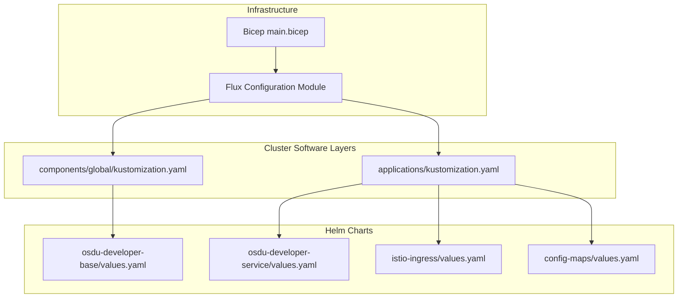
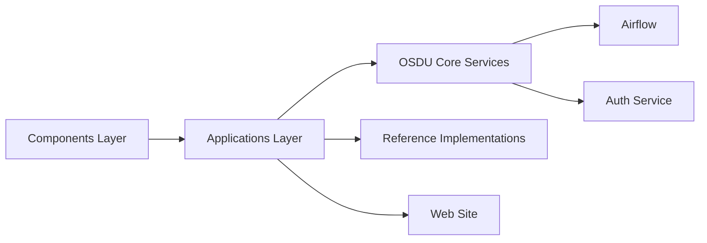

# Application Deployments

<cite>
**Referenced Files in This Document**
- [bicep/main.bicep](file://bicep/main.bicep)
- [bicep/modules/blade_configuration.bicep](file://bicep/modules/blade_configuration.bicep)
- [software/applications/kustomization.yaml](file://software/applications/kustomization.yaml)
- [software/components/global/kustomization.yaml](file://software/components/global/kustomization.yaml)
- [software/applications/osdu-core/base.yaml](file://software/applications/osdu-core/base.yaml)
- [software/components/airflow/release.yaml](file://software/components/airflow/release.yaml)
- [charts/osdu-developer-base/values.yaml](file://charts/osdu-developer-base/values.yaml)
- [charts/osdu-developer-service/values.yaml](file://charts/osdu-developer-service/values.yaml)
- [charts/istio-ingress/values.yaml](file://charts/istio-ingress/values.yaml)
- [charts/config-maps/values.yaml](file://charts/config-maps/values.yaml)
- [charts/README.MD](file://charts/README.MD)
- [software/applications/README.md](file://software/applications/README.md)
- [software/components/README.md](file://software/components/README.md)
</cite>

## Table of Contents
1. Introduction
2. Project Structure
3. Core Components
4. Architecture Overview
5. Detailed Component Analysis
6. Dependency Analysis
7. Performance Considerations
8. Troubleshooting Guide
9. Conclusion

## Introduction
This document explains how OSDU core services, reference implementations, and supporting applications (such as Airflow) are deployed using GitOps with Flux, Helm, and Kustomize on Azure Kubernetes Service. It covers deployment strategies, rolling updates and rollbacks, service mesh integration with Istio (traffic routing and security), configuration management via ConfigMaps and Secrets, environment-specific overrides, and scaling for high availability.

## Project Structure
The repository organizes deployments into:
- Infrastructure provisioning via Bicep modules that install and configure Flux, Git repositories, and cluster-level resources.
- Cluster software layers managed by Flux:
  - components: foundational platform services (mesh, certs, observability, storage, etc.)
  - applications: OSDU core, auth, reference implementations, web site
- Helm charts under charts/ define reusable templates for services, ingress, config maps, secrets, and more.
- Kustomization files compose and layer manifests for consistent multi-environment delivery.



**Diagram sources**
- [bicep/main.bicep:1-200](file://bicep/main.bicep#L1-L200)
- [bicep/modules/blade_configuration.bicep:486-564](file://bicep/modules/blade_configuration.bicep#L486-L564)
- [software/components/global/kustomization.yaml:1-9](file://software/components/global/kustomization.yaml#L1-L9)
- [software/applications/kustomization.yaml:1-10](file://software/applications/kustomization.yaml#L1-L10)
- [charts/osdu-developer-base/values.yaml:1-38](file://charts/osdu-developer-base/values.yaml#L1-L38)
- [charts/osdu-developer-service/values.yaml:1-142](file://charts/osdu-developer-service/values.yaml#L1-L142)
- [charts/istio-ingress/values.yaml:1-18](file://charts/istio-ingress/values.yaml#L1-L18)
- [charts/config-maps/values.yaml:1-12](file://charts/config-maps/values.yaml#L1-L12)

**Section sources**
- [bicep/main.bicep:1-200](file://bicep/main.bicep#L1-L200)
- [bicep/modules/blade_configuration.bicep:486-564](file://bicep/modules/blade_configuration.bicep#L486-L564)
- [software/components/README.md:1-29](file://software/components/README.md#L1-L29)
- [software/applications/README.md:1-17](file://software/applications/README.md#L1-L17)
- [charts/README.MD:1-3](file://charts/README.MD#L1-L3)

## Core Components
- Flux-managed HelmRelease objects orchestrate the installation order and upgrade behavior:
  - Base core services and blob upload jobs are declared as HelmReleases targeting the osdu-core namespace.
  - Airflow is installed via a HelmRelease with explicit upgrade remediation strategy including rollback.
- Kustomization layers group related releases:
  - components/global installs cluster-wide CRDs, release controllers, and shared storage classes.
  - applications composes core services, auth, reference implementations, and web site.

Key behaviors:
- Rolling updates: HelmRelease uses default Helm upgrade semantics; retries configured for install/upgrade.
- Rollback: Airflow HelmRelease explicitly sets upgrade remediation strategy to rollback.
- Dependencies: Blob upload depends on base core; Airflow depends on DAGs chart.

**Section sources**
- [software/applications/osdu-core/base.yaml:1-72](file://software/applications/osdu-core/base.yaml#L1-L72)
- [software/components/airflow/release.yaml:1-301](file://software/components/airflow/release.yaml#L1-L301)
- [software/components/global/kustomization.yaml:1-9](file://software/components/global/kustomization.yaml#L1-L9)
- [software/applications/kustomization.yaml:1-10](file://software/applications/kustomization.yaml#L1-L10)

## Architecture Overview
The deployment pipeline provisions infrastructure with Bicep, which installs Flux and points it at Git sources. Flux reconciles component and application layers, rendering Helm charts and Kustomizations into live Kubernetes resources. Services are exposed through an Istio-based ingress with internal and external gateways.

```mermaid
sequenceDiagram
participant Dev as "Developer/Git"
participant Flux as "Flux Controller"
participant AKS as "Kubernetes API"
participant Helm as "Helm Release"
participant Mesh as "Istio Ingress"
participant Svc as "OSDU Services"
Dev->>Flux : Push manifests (Git)
Flux->>AKS : Create/Update HelmRelease
AKS->>Helm : Install/Upgrade Chart
Helm-->>AKS : Rendered Resources (Deployments, Services, Routes)
Mesh->>Svc : Route traffic (internal/external)
Note over Flux,Helm : Rolling updates with retries; rollback on failure
```

**Diagram sources**
- [bicep/modules/blade_configuration.bicep:486-564](file://bicep/modules/blade_configuration.bicep#L486-L564)
- [software/applications/osdu-core/base.yaml:1-72](file://software/applications/osdu-core/base.yaml#L1-L72)
- [software/components/airflow/release.yaml:1-301](file://software/components/airflow/release.yaml#L1-L301)
- [charts/istio-ingress/values.yaml:1-18](file://charts/istio-ingress/values.yaml#L1-L18)

## Detailed Component Analysis

### OSDU Core Services Deployment
- A HelmRelease targets the osdu-core namespace and loads values from a ConfigMap.
- Resource limits are set at the base level to ensure predictable pod scheduling and stability.
- Blob upload job is defined as a dependent release to populate legal/service configurations.

Rolling update and rollback:
- Default Helm upgrade behavior applies; install remediation retries are configured.
- For critical services, consider adding explicit upgrade remediation strategy similar to Airflow.

Configuration:
- Values are sourced from a ConfigMap and per-release values blocks.
- Azure integration flags enable Key Vault and managed identity usage where supported.

Scaling:
- Base resource requests/limits are provided; per-service HPA or replica counts can be tuned via chart values.

**Section sources**
- [software/applications/osdu-core/base.yaml:1-72](file://software/applications/osdu-core/base.yaml#L1-L72)
- [charts/osdu-developer-base/values.yaml:1-38](file://charts/osdu-developer-base/values.yaml#L1-L38)

### Airflow Deployment
- Installed via a HelmRelease with upgrade remediation strategy set to rollback.
- Uses KubernetesExecutor and external PostgreSQL; Redis disabled due to executor model.
- Integrates with OSDU core services via environment variables pointing to internal service URLs.
- Secrets for credentials and keys are referenced from Kubernetes Secrets.

Rolling update and rollback:
- Upgrade remediation strategy includes rollback to previous revision on failure.
- Retry counts differ between install and upgrade to balance reliability and speed.

Scaling:
- Topology spread constraints across zones and node affinity improve resilience.
- Tolerations allow scheduling on dedicated nodes.

**Section sources**
- [software/components/airflow/release.yaml:1-301](file://software/components/airflow/release.yaml#L1-L301)

### Istio Ingress and Traffic Routing
- Internal and external gateways are enabled with TLS termination using a shared certificate secret.
- The credential name references a secret created by the istio-certs chart, ensuring consistent certificate management.
- Hosts are wildcarded for development flexibility; production should restrict hosts.

Security policies:
- PeerAuthentication and RequestAuthentication are templated in the base chart to enforce mTLS and JWT validation for services.
- Envoy filters can be used to augment request handling when needed.

Traffic routing:
- HTTP routes and gateway definitions are generated by charts; adjust paths and hostnames per service.

**Section sources**
- [charts/istio-ingress/values.yaml:1-18](file://charts/istio-ingress/values.yaml#L1-L18)
- [charts/osdu-developer-base/values.yaml:1-38](file://charts/osdu-developer-base/values.yaml#L1-L38)

### Configuration Management (ConfigMaps and Secrets)
- Global configuration values are loaded via a ConfigMap referenced by HelmRelease valuesFrom.
- Per-service ConfigMaps and Secrets are templated by charts; some values come from Azure App Configuration and Key Vault endpoints.
- Environment-specific overrides are applied by changing values in the ConfigMap or per-release values blocks.

Secrets:
- Airflow references secrets for database passwords, Fernet key, and webserver secret key.
- Base chart supports injecting Key Vault-backed secrets into pods via annotations and environment variables.

**Section sources**
- [software/applications/osdu-core/base.yaml:1-72](file://software/applications/osdu-core/base.yaml#L1-L72)
- [charts/config-maps/values.yaml:1-12](file://charts/config-maps/values.yaml#L1-L12)
- [software/components/airflow/release.yaml:1-301](file://software/components/airflow/release.yaml#L1-L301)

### Scaling and High Availability
- Horizontal Pod Autoscaler (HPA) templates are available in service charts; configure min/max replicas and target utilization.
- Node affinity and topology spread constraints distribute workloads across availability zones.
- Resource requests/limits are set at the base level to prevent noisy neighbor issues.

Best practices:
- Use separate node pools for system vs user workloads.
- Enable autoscaling for stateless services; keep stateful services (e.g., databases) on dedicated pools with appropriate sizing.

**Section sources**
- [charts/osdu-developer-service/values.yaml:1-142](file://charts/osdu-developer-service/values.yaml#L1-L142)
- [software/components/airflow/release.yaml:1-301](file://software/components/airflow/release.yaml#L1-L301)

## Dependency Analysis
Flux orchestrates layered dependencies:
- Components must be ready before applications are installed.
- Within applications, base core services precede dependent jobs like blob upload.
- Airflow depends on DAGs and core services being reachable.



**Diagram sources**
- [software/components/README.md:1-29](file://software/components/README.md#L1-L29)
- [software/applications/README.md:1-17](file://software/applications/README.md#L1-L17)
- [software/applications/osdu-core/base.yaml:1-72](file://software/applications/osdu-core/base.yaml#L1-L72)
- [software/components/airflow/release.yaml:1-301](file://software/components/airflow/release.yaml#L1-L301)

**Section sources**
- [software/components/README.md:1-29](file://software/components/README.md#L1-L29)
- [software/applications/README.md:1-17](file://software/applications/README.md#L1-L17)

## Performance Considerations
- Set appropriate CPU/memory requests and limits to avoid throttling and preemption.
- Use HPA to scale stateless services based on CPU or custom metrics.
- Spread workloads across zones with topology spread constraints for resilience.
- Monitor with Prometheus/Grafana and use Jaeger/Kiali for tracing and service mesh visibility.
- Tune Airflow concurrency settings and worker resources according to DAG complexity.

[No sources needed since this section provides general guidance]

## Troubleshooting Guide
Common issues and mitigations:
- HelmRelease upgrade failures: Check retry counts and remediation strategies; Airflow uses rollback on upgrade failure.
- Certificate errors: Ensure istio-certs chart creates the expected secret and that gateway values reference the correct credentialName.
- Secret resolution: Verify that referenced secrets exist and contain required keys; confirm Key Vault integration if used.
- Service reachability: Confirm internal DNS and service names match environment variables (e.g., partition, legal, search).
- Observability: Use Kiali for service mesh health, Prometheus for metrics, and Grafana dashboards for trends.

Operational tips:
- Inspect Flux reconciliation logs for HelmRelease status and events.
- Validate rendered manifests with kubectl diff before applying changes.
- Use feature flags and environment-specific values to isolate issues.

**Section sources**
- [software/components/airflow/release.yaml:1-301](file://software/components/airflow/release.yaml#L1-L301)
- [charts/istio-ingress/values.yaml:1-18](file://charts/istio-ingress/values.yaml#L1-L18)
- [charts/config-maps/values.yaml:1-12](file://charts/config-maps/values.yaml#L1-L12)

## Conclusion
This deployment model leverages Bicep to provision infrastructure and Flux to manage GitOps-driven releases of components and applications. Rolling updates are handled by Helm with configurable retries, and rollbacks are explicitly configured for critical services like Airflow. Istio ingress provides secure, TLS-terminated traffic routing with policy enforcement. Configuration is centralized via ConfigMaps and Secrets, with environment-specific overrides and scalable resource settings to support high availability.

[No sources needed since this section summarizes without analyzing specific files]