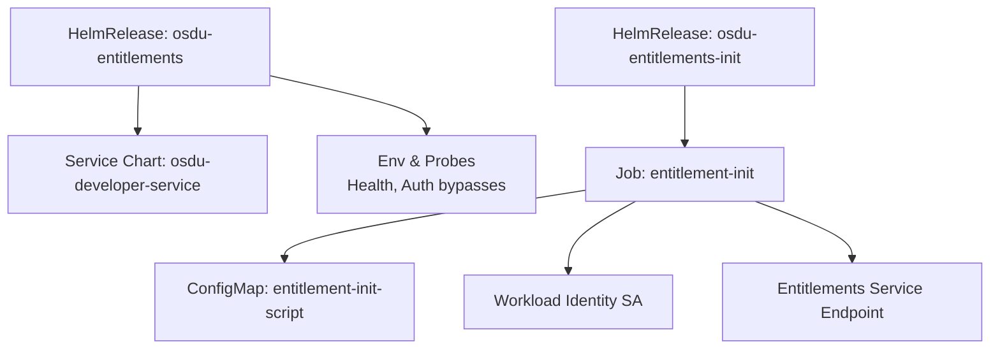
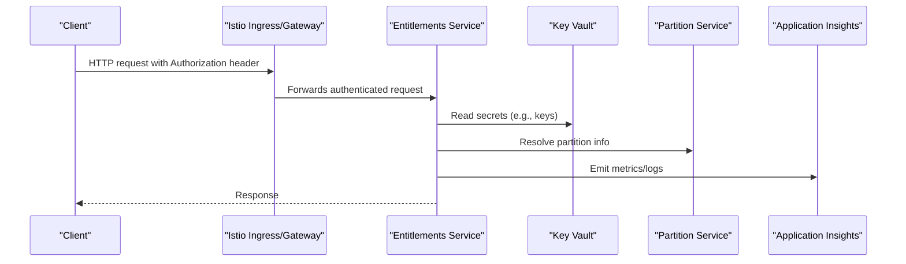
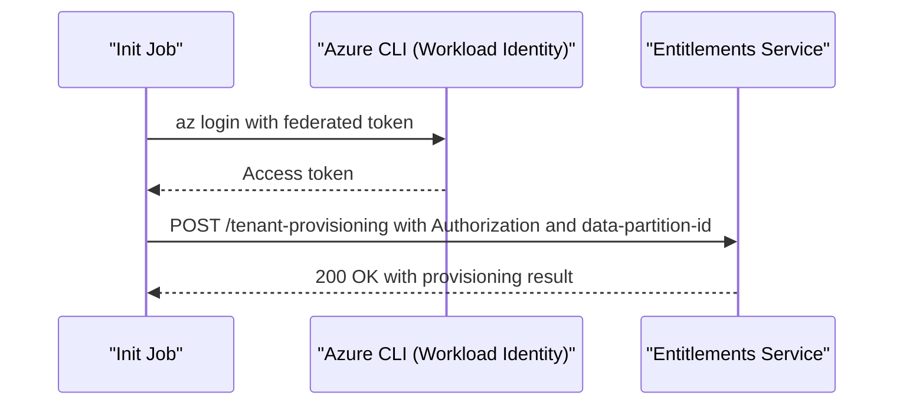
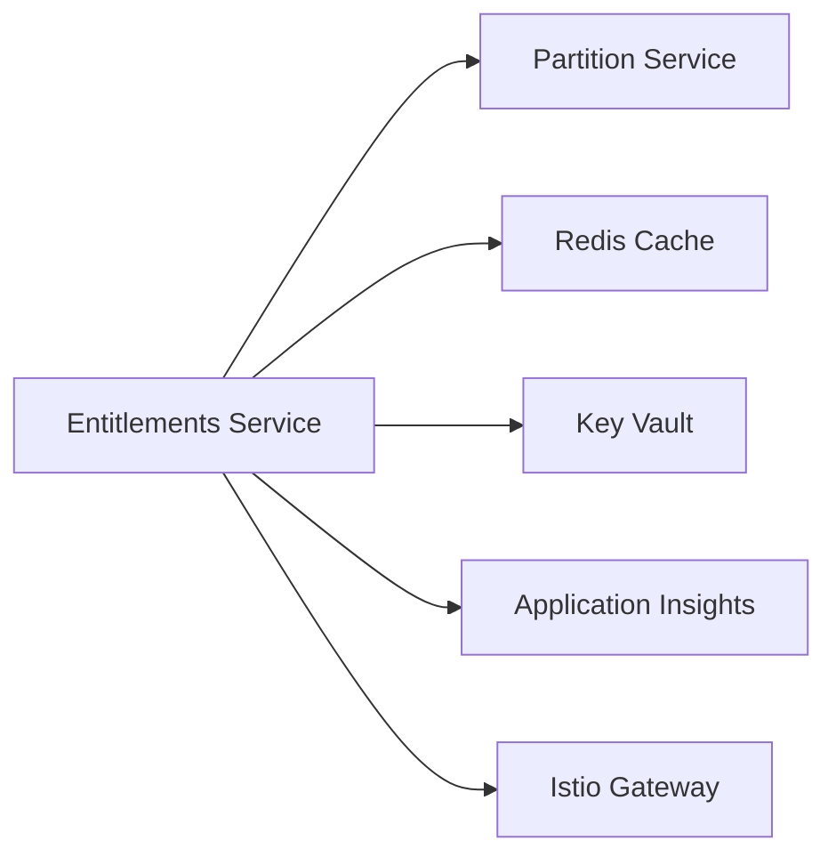

# Entitlements Service

<cite>
**Referenced Files in This Document**
- [entitlements.yaml](file://software/applications/osdu-core/entitlements.yaml)
- [entitlement-init.yaml](file://charts/osdu-developer-init/templates/entitlement-init.yaml)
- [values.yaml](file://charts/osdu-developer-service/values.yaml)
- [entitlement.http](file://tools/rest-scripts/entitlement.http)
- [admin.http](file://tools/rest-scripts/admin.http)
- [services_core_entitlements.md](file://docs/src/services_core_entitlements.md)
- [services_core_search.md](file://docs/src/services_core_search.md)
- [README.md](file://bicep/README.md)
</cite>

## Table of Contents
1. Introduction
2. Project Structure
3. Core Components
4. Architecture Overview
5. Detailed Component Analysis
6. Dependency Analysis
7. Performance Considerations
8. Troubleshooting Guide
9. Conclusion

## Introduction
This document provides deployment and operational guidance for the OSDU Entitlements service within an AKS-based platform. It covers Kubernetes manifests, access control configuration, permission management, security policies, RBAC concepts, identity provider integration, scaling strategies, database dependencies, monitoring configuration, API endpoints, authentication methods, and common use cases for managing permissions.

## Project Structure
The entitlements service is deployed via a HelmRelease that references a shared service chart and values. An initialization job provisions tenant-scoped data using Azure Workload Identity and calls into the running service.

**Diagram sources**
- [entitlements.yaml:1-167](file://software/applications/osdu-core/entitlements.yaml#L1-L167)
- [entitlement-init.yaml:1-95](file://charts/osdu-developer-init/templates/entitlement-init.yaml#L1-L95)

**Section sources**
- [entitlements.yaml:1-167](file://software/applications/osdu-core/entitlements.yaml#L1-L167)
- [entitlement-init.yaml:1-95](file://charts/osdu-developer-init/templates/entitlement-init.yaml#L1-L95)

## Core Components
- Deployment via HelmRelease with shared service chart and environment configuration.
- Health probes and auth bypass paths for health and documentation endpoints.
- Initialization Job to provision tenant data using federated workload identity.
- Integration with Key Vault, Application Insights, and Partition service.
- Istio-based authentication enabled with selective bypasses.

Key configuration highlights:
- Service context path and port configuration.
- Environment variables for Key Vault, App Insights, and partition endpoint.
- Auth bypass list for non-sensitive endpoints.
- Replica count and autoscaling options available through the shared service chart.

**Section sources**
- [entitlements.yaml:34-117](file://software/applications/osdu-core/entitlements.yaml#L34-L117)
- [values.yaml:15-142](file://charts/osdu-developer-service/values.yaml#L15-L142)
- [services_core_entitlements.md:14-27](file://docs/src/services_core_entitlements.md#L14-L27)

## Architecture Overview
The entitlements service runs behind Istio with OIDC-based authentication. Clients authenticate via Azure AD (OIDC), obtain tokens, and call the service over HTTPS. The service integrates with Key Vault for secrets, Partition service for partition metadata, and Application Insights for telemetry. An init job uses Azure Workload Identity to call a tenant provisioning endpoint during bootstrap.

**Diagram sources**
- [entitlements.yaml:74-103](file://software/applications/osdu-core/entitlements.yaml#L74-L103)
- [services_core_search.md:14-38](file://docs/src/services_core_search.md#L14-L38)

## Detailed Component Analysis

### Kubernetes Manifests and Deployment
- The HelmRelease defines the service image repository, tag, health probe, and environment variables.
- Authentication bypasses are configured for health and documentation endpoints.
- Secrets are sourced from Kubernetes Secrets populated by Key Vault integration.
- The service exposes a ClusterIP on port 80 with a servlet context path under /api/entitlements/v2/.

Operational notes:
- Liveness probe targets the Actuator health endpoint on port 8081.
- CORS allows local development origins.
- Two gateways (internal and external) are referenced for routing.

**Section sources**
- [entitlements.yaml:34-117](file://software/applications/osdu-core/entitlements.yaml#L34-L117)
- [values.yaml:39-42](file://charts/osdu-developer-service/values.yaml#L39-L42)

### Access Control Configuration and Security Policies
- Istio authentication is enabled; requests must include a valid bearer token.
- Auth bypass list excludes health and documentation endpoints from authentication checks.
- Workload Identity is used by the init job to call the service securely without client secrets.

Security considerations:
- Ensure only necessary endpoints are added to the bypass list.
- Use HTTPS at the ingress layer and enforce TLS termination at the gateway.
- Restrict network policies to allow only required traffic.

**Section sources**
- [entitlements.yaml:63-73](file://software/applications/osdu-core/entitlements.yaml#L63-L73)
- [entitlement-init.yaml:15-17](file://charts/osdu-developer-init/templates/entitlement-init.yaml#L15-L17)

### Permission Management and RBAC Concepts
- The entitlements service manages groups and memberships to implement role-based access control across OSDU resources.
- Typical roles include Reader, Contributor, Admin, Owner, which map to group memberships.
- Group membership determines access to data partitions and resources governed by policy.

Common operations:
- Create groups and add/remove members.
- Query group memberships to verify permissions.
- Use the data-partition-id header to scope operations to a specific partition.

**Section sources**
- [admin.http:102-151](file://tools/rest-scripts/admin.http#L102-L151)
- [admin.http:267-312](file://tools/rest-scripts/admin.http#L267-L312)

### Integration with Identity Providers
- Azure Active Directory (OIDC) is used for user and application authentication.
- The service reads AAD client ID from secrets and supports stateless sessions where applicable.
- The init job authenticates using Azure Workload Identity with federated tokens.

Integration points:
- AAD_CLIENT_ID injected via secret.
- AZURE_ISTIOAUTH_ENABLED enables Istio-side JWT validation.
- AZURE_PAAS_WORKLOADIDENTITY_ISENABLED enables pod-level workload identity.

**Section sources**
- [entitlements.yaml:79-94](file://software/applications/osdu-core/entitlements.yaml#L79-L94)
- [entitlement-init.yaml:66-73](file://charts/osdu-developer-init/templates/entitlement-init.yaml#L66-L73)
- [services_core_entitlements.md:14-27](file://docs/src/services_core_entitlements.md#L14-L27)

### Scaling Strategies
- Default replica count can be set via the shared service chart values.
- Horizontal Pod Autoscaler (HPA) or KEDA scaled objects can be configured in the service chart to scale based on CPU/memory or custom metrics.
- Ensure partition and downstream services can handle increased load.

Recommendations:
- Start with conservative replicas and scale out under load.
- Monitor latency and error rates when scaling.
- Tune resource requests/limits per pod to avoid throttling.

**Section sources**
- [values.yaml:15-25](file://charts/osdu-developer-service/values.yaml#L15-L25)
- [entitlements.yaml:34-38](file://software/applications/osdu-core/entitlements.yaml#L34-L38)

### Database Dependencies
- The entitlements service relies on Redis for caching with configurable TTL.
- Partition service is called for partition resolution and metadata.
- No direct relational database dependency is defined in the manifests; cache and partition service are primary dependencies.

Configuration:
- REDIS_TTL_SECONDS controls cache expiration behavior.
- PARTITION_SERVICE_ENDPOINT points to the partition service URL.

**Section sources**
- [entitlements.yaml:111-116](file://software/applications/osdu-core/entitlements.yaml#L111-L116)
- [services_core_entitlements.md:18-25](file://docs/src/services_core_entitlements.md#L18-L25)

### Monitoring Configuration
- Application Insights key and connection string are injected via secrets for telemetry.
- Logging level can be adjusted via environment variables.
- Health endpoints are exposed for liveness/readiness probes.

Best practices:
- Centralize logs and metrics in Application Insights.
- Set appropriate logging levels per environment (DEBUG in dev, INFO/WARN in prod).
- Alert on health check failures and elevated error rates.

**Section sources**
- [entitlements.yaml:83-108](file://software/applications/osdu-core/entitlements.yaml#L83-L108)
- [services_core_entitlements.md:14-27](file://docs/src/services_core_entitlements.md#L14-L27)

### API Endpoints and Authentication Methods
- Base path: /api/entitlements/v2
- Common endpoints:
  - GET /info: Service information
  - GET /groups: Retrieve groups for the authenticated user
  - POST /groups: Create a new group
  - GET /groups/{group}/members: List members of a group
  - POST /groups/{group}/members: Add a member to a group
  - DELETE /groups/{group}/members/{email}: Remove a member from a group
- Authentication:
  - Bearer token from Azure AD (OIDC)
  - Header: data-partition-id to scope requests to a partition

Sample usage:
- Use provided REST script files to obtain tokens and call endpoints.

**Section sources**
- [entitlement.http:36-60](file://tools/rest-scripts/entitlement.http#L36-L60)
- [admin.http:102-151](file://tools/rest-scripts/admin.http#L102-L151)
- [admin.http:267-312](file://tools/rest-scripts/admin.http#L267-L312)

### Tenant Provisioning Workflow
An initialization job provisions tenant-specific data by calling the service’s tenant-provisioning endpoint after authenticating via Workload Identity.

**Diagram sources**
- [entitlement-init.yaml:66-81](file://charts/osdu-developer-init/templates/entitlement-init.yaml#L66-L81)

**Section sources**
- [entitlement-init.yaml:1-95](file://charts/osdu-developer-init/templates/entitlement-init.yaml#L1-L95)

## Dependency Analysis
The entitlements service depends on:
- Partition service for partition metadata
- Redis for caching
- Key Vault for secrets
- Application Insights for telemetry
- Istio for mTLS and JWT validation

**Diagram sources**
- [entitlements.yaml:74-116](file://software/applications/osdu-core/entitlements.yaml#L74-L116)
- [services_core_search.md:14-38](file://docs/src/services_core_search.md#L14-L38)

**Section sources**
- [entitlements.yaml:74-116](file://software/applications/osdu-core/entitlements.yaml#L74-L116)
- [services_core_search.md:14-38](file://docs/src/services_core_search.md#L14-L38)

## Performance Considerations
- Tune Redis TTL to balance freshness and performance.
- Configure appropriate replica counts and resource limits to handle peak loads.
- Enable autoscaling based on CPU/memory or custom metrics if supported by your cluster.
- Monitor latency and error rates; adjust logging levels to reduce overhead in production.

[No sources needed since this section provides general guidance]

## Troubleshooting Guide
Common issues and resolutions:
- Authentication failures:
  - Verify bearer token validity and scopes.
  - Confirm Istio authentication is enabled and bypass list does not include sensitive endpoints.
- Init job errors:
  - Check Workload Identity configuration and federated token availability.
  - Validate tenant provisioning endpoint connectivity and response codes.
- Health probe failures:
  - Ensure Actuator health endpoint is reachable on the configured port.
  - Review container logs for startup errors.

Operational tips:
- Use the provided REST scripts to test endpoints interactively.
- Inspect Application Insights for traces and exceptions.
- Validate Key Vault secret retrieval and partition service connectivity.

**Section sources**
- [entitlements.yaml:56-73](file://software/applications/osdu-core/entitlements.yaml#L56-L73)
- [entitlement-init.yaml:66-92](file://charts/osdu-developer-init/templates/entitlement-init.yaml#L66-L92)
- [entitlement.http:36-60](file://tools/rest-scripts/entitlement.http#L36-L60)

## Conclusion
The OSDU Entitlements service is deployed via Helm with robust integration to Azure AD, Key Vault, Partition service, and Application Insights. Authentication is enforced through Istio with selective bypasses for health and documentation. RBAC is implemented via groups and memberships, enabling fine-grained access control across partitions. Scaling, monitoring, and troubleshooting are supported through standard Kubernetes and Azure observability tools. Follow the recommended configurations and best practices to ensure secure and performant operation.

[No sources needed since this section summarizes without analyzing specific files]