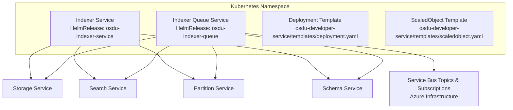
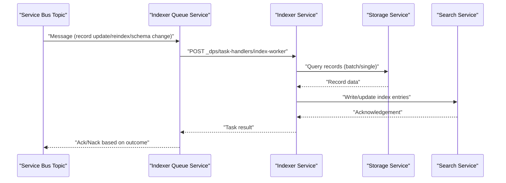
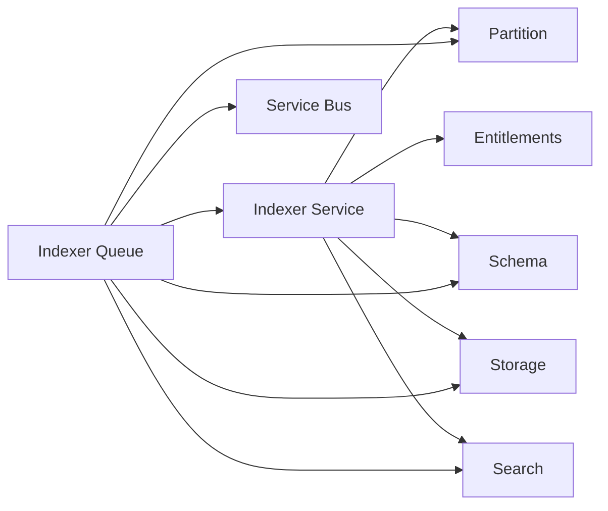

# Indexer Service

<cite>
**Referenced Files in This Document**
- [services_core_indexer.md](file://docs/src/services_core_indexer.md)
- [indexer.yaml](file://software/applications/osdu-core/indexer.yaml)
- [deployment.yaml](file://charts/osdu-developer-service/templates/deployment.yaml)
- [scaledobject.yaml](file://charts/osdu-developer-service/templates/scaledobject.yaml)
- [docker-bake.hcl](file://src/docker-bake.hcl)
- [README.md](file://software/applications/osdu-core/README.md)
- [partition-init.yaml](file://charts/osdu-developer-init/templates/partition-init.yaml)
- [blade_partition.bicep](file://bicep/modules/blade_partition.bicep)
</cite>

## Table of Contents
1. [Introduction](#introduction)
2. [Project Structure](#project-structure)
3. [Core Components](#core-components)
4. [Architecture Overview](#architecture-overview)
5. [Detailed Component Analysis](#detailed-component-analysis)
6. [Dependency Analysis](#dependency-analysis)
7. [Performance Considerations](#performance-considerations)
8. [Troubleshooting Guide](#troubleshooting-guide)
9. [Conclusion](#conclusion)
10. [Appendices](#appendices)

## Introduction
This document provides comprehensive deployment and operational guidance for the OSDU Indexer service, focusing on its event-driven architecture, message queue processing, background job handling, indexing pipeline configuration, retry mechanisms, error handling strategies, scaling, monitoring, performance optimization, integration with storage and search services, batch processing capabilities, and operational best practices. It is intended for operators and platform engineers deploying or managing the indexer components in Kubernetes-based environments.

## Project Structure
The indexer system is composed of two primary services:
- Indexer service (HTTP API and task handlers)
- Indexer Queue service (message consumer orchestrating indexing tasks)

These are deployed via HelmRelease manifests that reference a shared service chart template. The build targets for both services are defined in the Docker bake configuration. Installation order and dependencies among core services are documented in the software installation sequence.

**Diagram sources**
- [indexer.yaml:1-228](file://software/applications/osdu-core/indexer.yaml#L1-L228)
- [deployment.yaml:1-178](file://charts/osdu-developer-service/templates/deployment.yaml#L1-L178)
- [scaledobject.yaml:1-25](file://charts/osdu-developer-service/templates/scaledobject.yaml#L1-L25)

**Section sources**
- [indexer.yaml:1-228](file://software/applications/osdu-core/indexer.yaml#L1-L228)
- [docker-bake.hcl:98-118](file://src/docker-bake.hcl#L98-L118)
- [README.md:1-33](file://software/applications/osdu-core/README.md#L1-L33)

## Core Components
- Indexer Service: Exposes HTTP endpoints under /api/indexer/v2/, including internal task handlers for index-worker and schema-worker. It integrates with Storage, Search, Partition, and Schema services. Health probes are configured for readiness/liveness.
- Indexer Queue Service: Consumes Azure Service Bus topics and subscriptions to drive indexing workflows. It calls back into the Indexer service’s task handlers to execute work items.

Key environment variables and runtime settings are provided by the HelmRelease values, including topic names, subscription names, concurrency limits, executor thread counts, lock renewal durations, and service endpoints.

**Section sources**
- [indexer.yaml:31-129](file://software/applications/osdu-core/indexer.yaml#L31-L129)
- [indexer.yaml:159-228](file://software/applications/osdu-core/indexer.yaml#L159-L228)

## Architecture Overview
The indexer uses an event-driven architecture backed by Azure Service Bus. The Indexer Queue service subscribes to topics such as record updates, reindex requests, and schema change events. Upon receiving messages, it coordinates with the Indexer service’s task handlers to perform indexing operations against Storage and Search services. Scaling is managed via KEDA ScaledObjects triggered by Service Bus message backlog.

**Diagram sources**
- [indexer.yaml:100-129](file://software/applications/osdu-core/indexer.yaml#L100-L129)
- [indexer.yaml:203-228](file://software/applications/osdu-core/indexer.yaml#L203-L228)
- [scaledobject.yaml:1-25](file://charts/osdu-developer-service/templates/scaledobject.yaml#L1-L25)

## Detailed Component Analysis

### Indexer Service Deployment
- Exposed path: /api/indexer/v2/
- Health checks: readiness and liveness probes via actuator health endpoint
- Authentication: Istio auth enabled; certain paths disabled from auth enforcement (health, info, swagger, task handlers)
- Environment: Key Vault integration, Application Insights instrumentation, Workload Identity, context path, database and cache settings, service endpoints for partition, entitlements, schema, storage, and search

Operational notes:
- Probes ensure pod lifecycle management
- Auth exemptions allow internal task handlers and health endpoints without token overhead
- Context path centralizes routing under /api/indexer/v2/

**Section sources**
- [indexer.yaml:31-129](file://software/applications/osdu-core/indexer.yaml#L31-L129)
- [deployment.yaml:102-115](file://charts/osdu-developer-service/templates/deployment.yaml#L102-L115)

### Indexer Queue Service Deployment
- Subscriptions: recordstopicsubscription, reindextopicsubscription, schemachangedtopiceg
- Topics: recordstopic, reindextopic, schemachangedtopic
- Concurrency controls: MAX_CONCURRENT_CALLS, EXECUTOR_N_THREADS
- Retry and reliability: MAX_DELIVERY_COUNT, MAX_LOCK_RENEW_DURATION_SECONDS
- Worker callbacks: INDEXER_WORKER_URL and schema_worker_url point to Indexer task handlers

Operational notes:
- Adjust concurrency and thread pool sizes according to workload characteristics
- Tune delivery count and lock duration to balance throughput and idempotency
- Ensure worker URLs are reachable within the cluster network

**Section sources**
- [indexer.yaml:159-228](file://software/applications/osdu-core/indexer.yaml#L159-L228)

### Scaling Configuration
- Horizontal Pod Autoscaling via KEDA ScaledObject using Azure Service Bus trigger
- Triggered by subscription backlog; scales target deployment replicas based on message volume
- Requires appropriate Service Bus credentials and connection configuration

Best practices:
- Set min/max replica bounds at the deployment level
- Monitor queue depth and adjust scaling thresholds accordingly
- Use separate subscriptions per consumer group if needed

**Section sources**
- [scaledobject.yaml:1-25](file://charts/osdu-developer-service/templates/scaledobject.yaml#L1-L25)
- [indexer.yaml:159-228](file://software/applications/osdu-core/indexer.yaml#L159-L228)

### Message Queue Processing and Background Jobs
- Topics and subscriptions are provisioned in Azure infrastructure with configurable max delivery counts and lock durations
- Indexer Queue consumes messages and dispatches work to Indexer task handlers
- Task handlers coordinate with Storage and Search to read/write data and update indexes

Reliability considerations:
- Dead-lettering can be disabled for specific topics to enable custom retry logic
- Lock duration should exceed typical processing time to avoid premature message re-delivery

**Section sources**
- [blade_partition.bicep:369-435](file://bicep/modules/blade_partition.bicep#L369-L435)
- [indexer.yaml:203-228](file://software/applications/osdu-core/indexer.yaml#L203-L228)

### Event-Driven Architecture and Pipeline Configuration
- Events include record updates, reindex triggers, and schema changes
- Indexer Queue listens to these events and invokes Indexer task handlers
- Indexer interacts with Storage for data retrieval and Search for indexing

Configuration highlights:
- Topic and subscription names are set via environment variables
- Worker endpoints are configured to route tasks to the correct handler

**Section sources**
- [indexer.yaml:100-129](file://software/applications/osdu-core/indexer.yaml#L100-L129)
- [indexer.yaml:203-228](file://software/applications/osdu-core/indexer.yaml#L203-L228)

### Retry Mechanisms and Error Handling Strategies
- Max delivery count controls how many times a message is retried before dead-lettering
- Lock renewal duration ensures long-running tasks retain ownership
- Task handlers should implement idempotent processing to handle retries safely

Operational tips:
- Monitor dead-letter queues for persistent failures
- Implement exponential backoff in client code where applicable
- Log detailed error contexts for diagnostics

**Section sources**
- [blade_partition.bicep:369-435](file://bicep/modules/blade_partition.bicep#L369-L435)
- [indexer.yaml:215-222](file://software/applications/osdu-core/indexer.yaml#L215-L222)

### Integration with Storage and Search Services
- Storage endpoints: base URL, schema endpoint, query endpoints (single and batch)
- Search endpoint: base URL for indexing operations
- Partition and Schema services: used for metadata and schema resolution

Batch processing:
- Batch query endpoint supports efficient retrieval of multiple records for conversion and indexing

**Section sources**
- [indexer.yaml:112-129](file://software/applications/osdu-core/indexer.yaml#L112-L129)

### Monitoring Setup
- Application Insights: instrumentation key and connection string configured
- Health endpoints: actuator health exposed for readiness/liveness probes
- Logging: log prefix and structured logging recommended for observability

Recommendations:
- Correlate logs with request IDs and message IDs
- Create dashboards for queue depth, processing latency, and error rates
- Alert on probe failures and high dead-letter volumes

**Section sources**
- [indexer.yaml:72-99](file://software/applications/osdu-core/indexer.yaml#L72-L99)
- [indexer.yaml:177-202](file://software/applications/osdu-core/indexer.yaml#L177-L202)

### Performance Optimization
- Concurrency: tune MAX_CONCURRENT_CALLS and EXECUTOR_N_THREADS based on CPU and I/O capacity
- Lock duration: set sufficiently high to prevent premature reprocessing
- Batch queries: leverage batch endpoints to reduce round-trips to Storage
- Resource limits: define CPU/memory requests and limits to ensure stable scheduling

Monitoring and tuning:
- Track throughput and latency metrics
- Adjust scaling thresholds in KEDA based on observed queue behavior
- Profile task handlers to identify bottlenecks

**Section sources**
- [indexer.yaml:215-222](file://software/applications/osdu-core/indexer.yaml#L215-L222)
- [deployment.yaml:117-135](file://charts/osdu-developer-service/templates/deployment.yaml#L117-L135)

### Operational Best Practices
- Use Workload Identity for secure authentication to Azure services
- Keep health endpoints unauthenticated for reliable probing
- Separate subscriptions for different consumers to isolate workloads
- Version images and use immutable tags for reproducibility
- Regularly review and rotate secrets stored in Key Vault

**Section sources**
- [indexer.yaml:88-99](file://software/applications/osdu-core/indexer.yaml#L88-L99)
- [indexer.yaml:195-202](file://software/applications/osdu-core/indexer.yaml#L195-L202)

## Dependency Analysis
The indexer components depend on several core services and infrastructure resources:
- Partition service for partition metadata
- Entitlements service for access control (endpoint configured)
- Schema service for schema definitions
- Storage service for data retrieval and batch queries
- Search service for indexing operations
- Azure Service Bus for messaging
- Key Vault for secrets
- Application Insights for telemetry

**Diagram sources**
- [indexer.yaml:112-129](file://software/applications/osdu-core/indexer.yaml#L112-L129)
- [indexer.yaml:203-228](file://software/applications/osdu-core/indexer.yaml#L203-L228)

**Section sources**
- [indexer.yaml:112-129](file://software/applications/osdu-core/indexer.yaml#L112-L129)
- [indexer.yaml:203-228](file://software/applications/osdu-core/indexer.yaml#L203-L228)

## Performance Considerations
- Scale out workers using KEDA based on Service Bus subscription backlog
- Tune concurrency and thread pools to match resource availability
- Use batch queries to minimize network overhead
- Configure appropriate lock durations to avoid redundant processing
- Monitor resource utilization and adjust limits accordingly

[No sources needed since this section provides general guidance]

## Troubleshooting Guide
Common issues and resolutions:
- Probe failures: verify health endpoint accessibility and application startup time
- High queue depth: increase replicas or concurrency; check downstream service responsiveness
- Dead-lettered messages: inspect error logs and fix root causes; consider adjusting delivery count
- Authentication errors: ensure Workload Identity and Key Vault configurations are correct
- Timeouts: increase lock duration or optimize task processing time

Diagnostic steps:
- Check pod logs for errors and stack traces
- Review Service Bus metrics for message age and delivery counts
- Validate connectivity to Storage and Search services
- Inspect KEDA scaling events and thresholds

**Section sources**
- [indexer.yaml:50-70](file://software/applications/osdu-core/indexer.yaml#L50-L70)
- [indexer.yaml:215-222](file://software/applications/osdu-core/indexer.yaml#L215-L222)

## Conclusion
The OSDU Indexer service employs a robust, event-driven architecture leveraging Azure Service Bus for decoupled, scalable indexing workflows. Proper configuration of concurrency, retry policies, and scaling ensures reliable operation under varying loads. Integrations with Storage and Search services, combined with strong monitoring and operational practices, enable efficient and maintainable indexing pipelines.

[No sources needed since this section summarizes without analyzing specific files]

## Appendices

### Local Development Notes
- Java SDK and module details for local execution
- Required environment variables for local runs

**Section sources**
- [services_core_indexer.md:1-31](file://docs/src/services_core_indexer.md#L1-L31)

### Build Targets
- Docker bake targets for indexer and indexer-queue services

**Section sources**
- [docker-bake.hcl:98-118](file://src/docker-bake.hcl#L98-L118)

### Installation Sequence
- Dependency ordering for core services including indexer and indexer-queue

**Section sources**
- [README.md:1-33](file://software/applications/osdu-core/README.md#L1-L33)