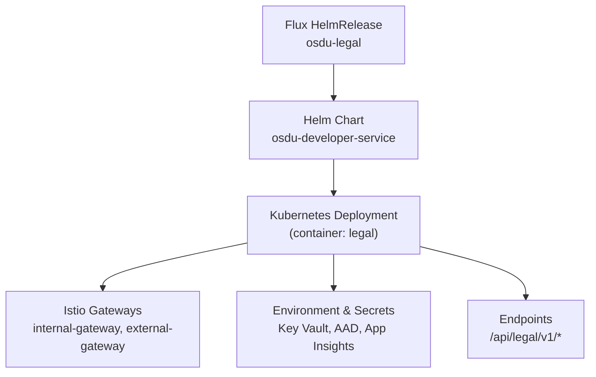
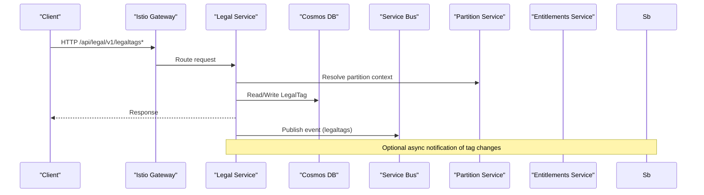
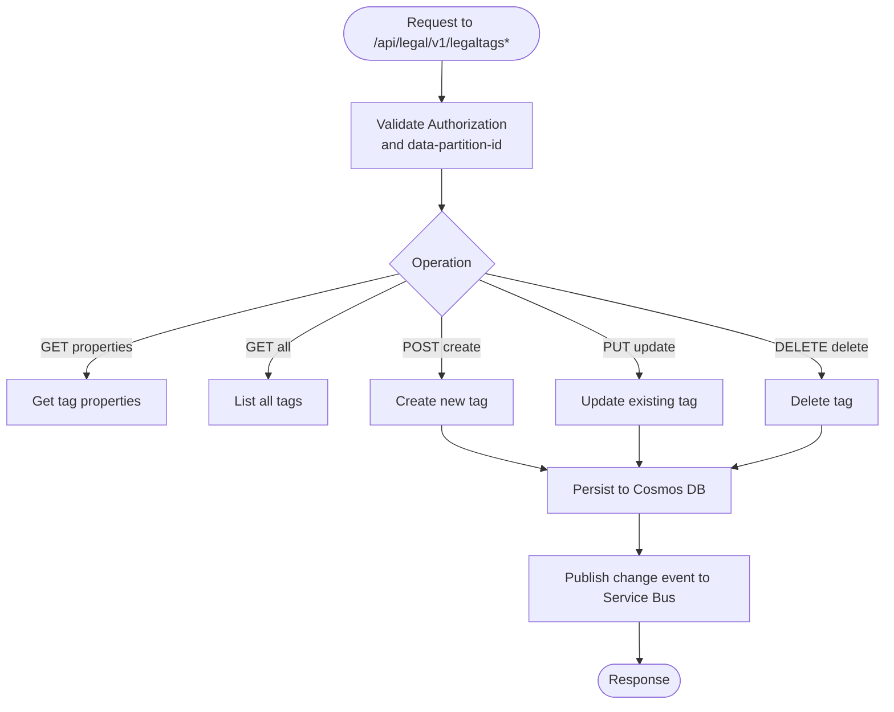
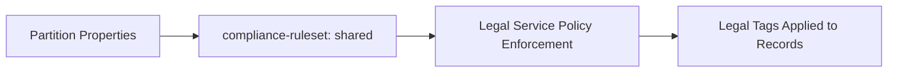
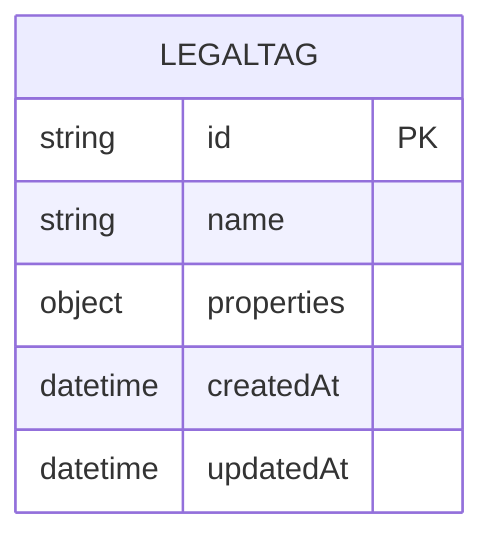
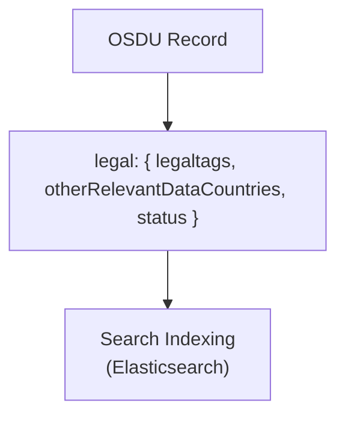
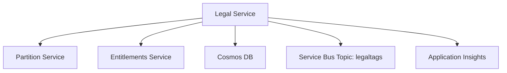

# Legal Service

<cite>
**Referenced Files in This Document**
- [legal.yaml](file://software/applications/osdu-core/legal.yaml)
- [services_core_legal.md](file://docs/src/services_core_legal.md)
- [Legal_COO.json](file://Legal_COO.json)
- [Legal_COO.json (deploy scripts)](file://bicep/modules/deploy-scripts/Legal_COO.json)
- [blade_partition.bicep](file://bicep/modules/blade_partition.bicep)
- [legal.http](file://tools/rest-scripts/legal.http)
- [partition-init.yaml](file://charts/osdu-developer-init/templates/partition-init.yaml)
- [services_core_storage.md](file://docs/src/services_core_storage.md)
</cite>

## Table of Contents
1. Introduction
2. Project Structure
3. Core Components
4. Architecture Overview
5. Detailed Component Analysis
6. Dependency Analysis
7. Performance Considerations
8. Troubleshooting Guide
9. Conclusion

## Introduction
This document provides comprehensive deployment and operational guidance for the OSDU Legal service. It covers Kubernetes manifests, compliance framework configuration, legal tag management, rights and obligations tracking, policy enforcement mechanisms, audit logging capabilities, database schema and indexing strategies, search integration, production deployment considerations, backup procedures, and compliance reporting features. The content is derived from the repository’s deployment artifacts, configuration files, and documentation.

## Project Structure
The Legal service is deployed as part of the core OSDU platform using Helm releases managed by Flux. The key deployment artifact is a HelmRelease that configures the service container image, environment variables, health probes, authentication exemptions, and routing through Istio gateways. Configuration values are sourced from ConfigMaps and Secrets, including Key Vault references and Azure Active Directory credentials.

**Diagram sources**
- [legal.yaml:1-124](file://software/applications/osdu-core/legal.yaml#L1-L124)

**Section sources**
- [legal.yaml:1-124](file://software/applications/osdu-core/legal.yaml#L1-L124)

## Core Components
- Deployment and Routing: The HelmRelease defines the service name, path prefix, CORS settings, gateway exposure, container image repository and tag, and health probe endpoints.
- Environment and Secrets: Sensitive values such as Key Vault URI, AAD client ID, and Application Insights keys are injected via Kubernetes Secrets. Additional runtime flags enable Istio auth and workload identity.
- Integration Points: The service integrates with Partition and Entitlements services via configured endpoints, uses Cosmos DB for persistence, Redis for caching, and Service Bus for messaging related to legal tags.

Operational notes:
- Health checks target /actuator/health on port 8081.
- Authentication is disabled for specific paths like info, swagger, and webjars.
- Context path is set to /api/legal/v1/.

**Section sources**
- [legal.yaml:34-124](file://software/applications/osdu-core/legal.yaml#L34-L124)
- [services_core_legal.md:14-36](file://docs/src/services_core_legal.md#L14-L36)

## Architecture Overview
The Legal service exposes REST APIs under /api/legal/v1 and participates in the broader OSDU ecosystem:
- Ingress via Istio gateways routes requests to the service.
- The service persists legal tags and metadata in Cosmos DB.
- It communicates with Partition and Entitlements services for data partitioning and access control.
- It publishes or consumes events on a Service Bus topic for legal tag changes.
- Audit and telemetry are sent to Application Insights.

**Diagram sources**
- [legal.yaml:42-73](file://software/applications/osdu-core/legal.yaml#L42-L73)
- [legal.yaml:109-124](file://software/applications/osdu-core/legal.yaml#L109-L124)

## Detailed Component Analysis

### Legal Tag Management API
The Legal service provides CRUD operations for legal tags used to enforce compliance policies across records. Example operations include retrieving tag properties, listing all tags, creating, updating, and deleting tags. These operations require an Authorization header and a data-partition-id header.

**Diagram sources**
- [legal.http:52-120](file://tools/rest-scripts/legal.http#L52-L120)
- [legal.yaml:109-124](file://software/applications/osdu-core/legal.yaml#L109-L124)

**Section sources**
- [legal.http:52-120](file://tools/rest-scripts/legal.http#L52-L120)
- [legal.yaml:109-124](file://software/applications/osdu-core/legal.yaml#L109-L124)

### Compliance Framework Configuration
Compliance rulesets are configured at the partition level. The partition initialization template includes a compliance-ruleset property, which can be set to “shared” or other values depending on organizational policy. This setting influences how legal tags and policies are applied across records within the partition.

**Diagram sources**
- [partition-init.yaml:57-63](file://charts/osdu-developer-init/templates/partition-init.yaml#L57-L63)

**Section sources**
- [partition-init.yaml:57-63](file://charts/osdu-developer-init/templates/partition-init.yaml#L57-L63)

### Rights and Obligations Tracking
Legal tags encapsulate rights and obligations metadata associated with data assets. Each tag can include properties such as country of origin, contract identifiers, expiration dates, data type, security classification, personal data indicators, and export classifications. These properties inform downstream processing and policy decisions.

Example tag properties referenced in test scripts include:
- countryOfOrigin
- contractId
- expirationDate
- originator
- dataType
- securityClassification
- personalData
- exportClassification

**Section sources**
- [legal.http:74-89](file://tools/rest-scripts/legal.http#L74-L89)

### Policy Enforcement Mechanisms
Policy enforcement leverages:
- Legal tags attached to records to determine applicable restrictions.
- Partition-level compliance rulesets to scope policy application.
- Integration with Entitlements service to validate access based on roles and permissions.
- Optional OPA (Open Policy Agent) integration indicated by configuration flags in related services.

Evidence:
- Partition configuration includes compliance-ruleset.
- Storage service documentation references OPA_ENABLED flag and legal service bus topics for notifications.

**Section sources**
- [partition-init.yaml:57-63](file://charts/osdu-developer-init/templates/partition-init.yaml#L57-L63)
- [services_core_storage.md:214-238](file://docs/src/services_core_storage.md#L214-L238)

### Audit Logging Capabilities
Audit and telemetry are enabled via Application Insights. The Legal service deployment injects Application Insights connection string and key into the container, allowing centralized logging and metrics collection.

**Section sources**
- [legal.yaml:83-90](file://software/applications/osdu-core/legal.yaml#L83-L90)

### Database Schema and Indexing Strategies
The Legal service stores legal tags in Cosmos DB. The partition module defines a LegalTag container with hash indexing on the id field, enabling efficient lookups by primary key.

Indexing strategy:
- Container kind: Hash
- Path index: /id

**Diagram sources**
- [blade_partition.bicep:139-144](file://bicep/modules/blade_partition.bicep#L139-L144)

**Section sources**
- [blade_partition.bicep:139-144](file://bicep/modules/blade_partition.bicep#L139-L144)

### Search Integration
While the Legal service itself focuses on tag management, OSDU records integrate legal metadata into their schemas. The legal field in record schemas includes legaltags and otherRelevantDataCountries, enabling search and filtering based on compliance attributes.

**Diagram sources**
- [ofp_wks_master-data--EmissionFactor_4.0.0.json:59-83](file://ofp-schema-deploy/schemas/ofp_wks_master-data--EmissionFactor_4.0.0.json#L59-L83)

**Section sources**
- [ofp_wks_master-data--EmissionFactor_4.0.0.json:59-83](file://ofp-schema-deploy/schemas/ofp_wks_master-data--EmissionFactor_4.0.0.json#L59-L83)

### Production Deployment Considerations
- Expose the service via both internal and external Istio gateways for flexible access patterns.
- Configure health probes to ensure readiness and liveness checks.
- Use secrets for sensitive configuration (Key Vault URI, AAD credentials, App Insights keys).
- Enable stateless sessions and workload identity where appropriate.
- Set CORS origins for local development if needed.

**Section sources**
- [legal.yaml:42-73](file://software/applications/osdu-core/legal.yaml#L42-L73)
- [legal.yaml:74-124](file://software/applications/osdu-core/legal.yaml#L74-L124)

### Backup Procedures
Cosmos DB backups are configured at the database level with continuous backup enabled. This ensures point-in-time recovery capabilities for the LegalTag container and other system containers.

**Section sources**
- [blade_partition.bicep:105-109](file://bicep/modules/blade_partition.bicep#L105-L109)

### Compliance Reporting Features
Compliance reporting relies on:
- Legal tags stored per record and managed via the Legal service.
- Country residency risk profiles defined in the COO dataset, which can be used to generate reports on data residency and transfer restrictions.
- Partition-level compliance rulesets to scope reporting contexts.

The COO dataset includes entries with fields such as name, alpha2 code, numeric code, residencyRisk, and typesNotApplyDataResidency.

**Section sources**
- [Legal_COO.json:1-12](file://Legal_COO.json#L1-L12)
- [Legal_COO.json (deploy scripts):1-12](file://bicep/modules/deploy-scripts/Legal_COO.json#L1-L12)

## Dependency Analysis
The Legal service depends on several core components:
- Partition service for resolving data partitions and compliance context.
- Entitlements service for access control validation.
- Cosmos DB for persistent storage of legal tags.
- Service Bus for asynchronous communication regarding tag changes.
- Application Insights for telemetry and logging.

**Diagram sources**
- [legal.yaml:109-124](file://software/applications/osdu-core/legal.yaml#L109-L124)

**Section sources**
- [legal.yaml:109-124](file://software/applications/osdu-core/legal.yaml#L109-L124)

## Performance Considerations
- Use hash indexing on primary keys for fast lookups in Cosmos DB.
- Configure appropriate replica counts and resource limits in deployments.
- Leverage health probes to maintain service availability.
- Minimize synchronous calls to external services; prefer asynchronous messaging where possible.
- Tune Service Bus topic throughput and subscription settings according to expected message volume.

[No sources needed since this section provides general guidance]

## Troubleshooting Guide
Common issues and resolutions:
- Authentication failures: Ensure AAD client ID and secret are correctly configured and that Istio auth is enabled when required.
- Health check failures: Verify /actuator/health endpoint accessibility and correct port configuration.
- Missing dependencies: Confirm Partition and Entitlements service endpoints are reachable and properly configured.
- Cosmos DB connectivity: Validate connection strings and primary keys in secrets.
- Service Bus errors: Check topic existence and permissions for publishing/consuming messages.

**Section sources**
- [legal.yaml:74-124](file://software/applications/osdu-core/legal.yaml#L74-L124)

## Conclusion
The OSDU Legal service provides essential capabilities for managing legal tags, enforcing compliance policies, and integrating with the broader OSDU ecosystem. Its deployment is orchestrated via Flux-managed Helm releases, with robust configuration for secrets, authentication, and observability. By leveraging Cosmos DB indexing, Service Bus messaging, and partition-level compliance rulesets, the service supports scalable and compliant data management across diverse environments. Proper attention to production considerations, backup strategies, and troubleshooting practices ensures reliable operation and adherence to regulatory requirements.