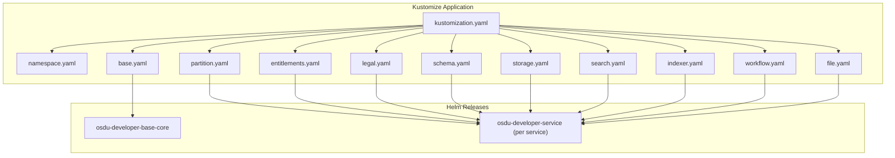
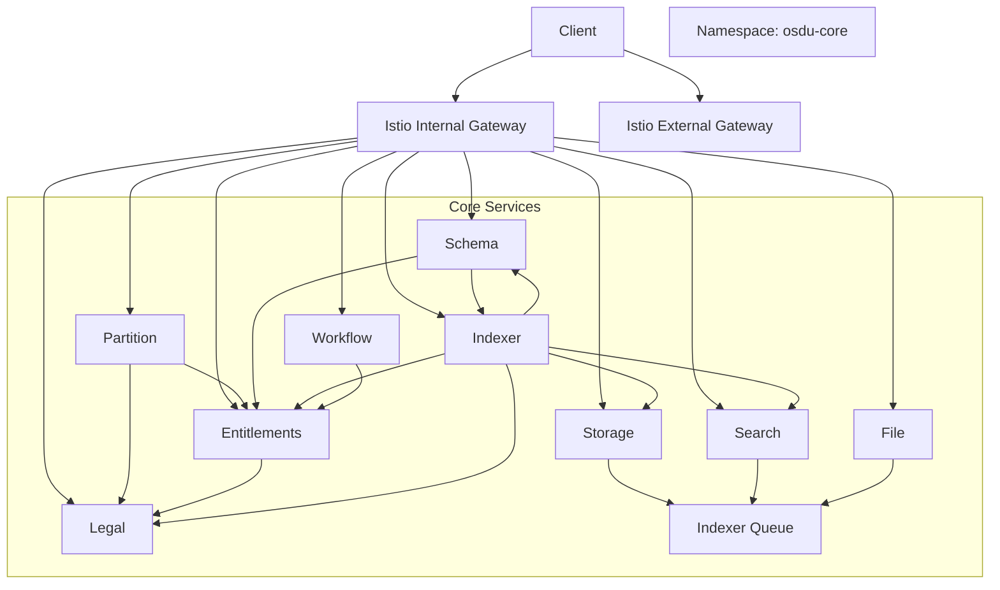
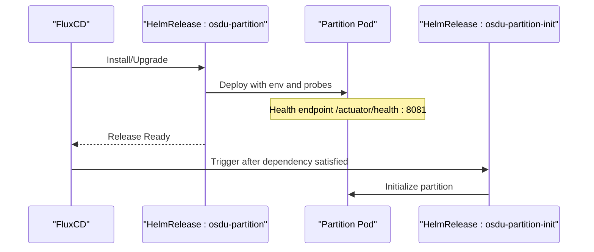
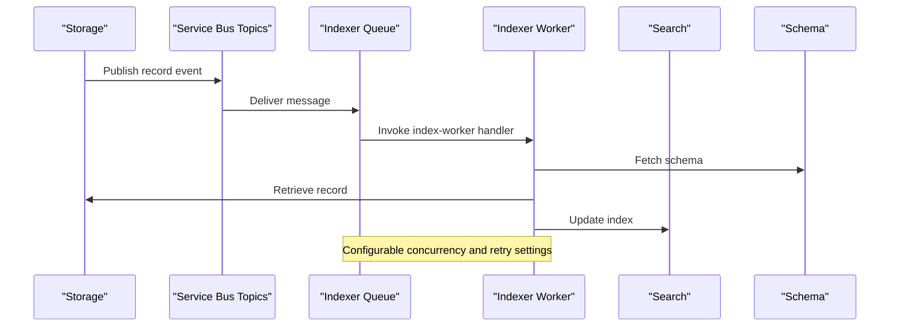
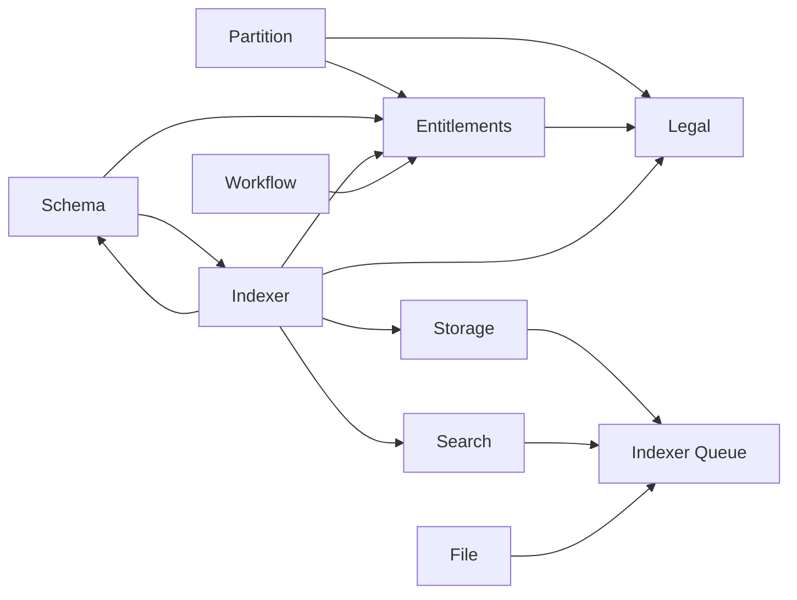

# OSDU Core Services

<cite>
**Referenced Files in This Document**
- [kustomization.yaml](file://software/applications/osdu-core/kustomization.yaml)
- [namespace.yaml](file://software/applications/osdu-core/namespace.yaml)
- [base.yaml](file://software/applications/osdu-core/base.yaml)
- [partition.yaml](file://software/applications/osdu-core/partition.yaml)
- [entitlements.yaml](file://software/applications/osdu-core/entitlements.yaml)
- [legal.yaml](file://software/applications/osdu-core/legal.yaml)
- [schema.yaml](file://software/applications/osdu-core/schema.yaml)
- [storage.yaml](file://software/applications/osdu-core/storage.yaml)
- [search.yaml](file://software/applications/osdu-core/search.yaml)
- [indexer.yaml](file://software/applications/osdu-core/indexer.yaml)
- [workflow.yaml](file://software/applications/osdu-core/workflow.yaml)
- [file.yaml](file://software/applications/osdu-core/file.yaml)
- [values.yaml (service chart)](file://charts/osdu-developer-service/values.yaml)
- [values.yaml (base chart)](file://charts/osdu-developer-base/values.yaml)
</cite>

## Table of Contents
1. Introduction
2. Project Structure
3. Core Components
4. Architecture Overview
5. Detailed Component Analysis
6. Dependency Analysis
7. Performance Considerations
8. Troubleshooting Guide
9. Conclusion

## Introduction
This document provides comprehensive deployment guidance for the OSDU core services: partition, entitlements, legal, schema, storage, search, indexer, and workflow. It explains Kubernetes manifests, configuration parameters, resource requirements, inter-service dependencies, base configuration patterns, namespace isolation, service discovery, scaling, health checks, and monitoring setup for production deployments.

## Project Structure
The OSDU core services are deployed as a Kustomize application that references HelmRelease resources to install each service using a shared service chart. A base release configures defaults such as authentication, Azure integration, and default resource limits. Each service is defined in its own file under software/applications/osdu-core with consistent patterns for image repository, path, probes, KeyVault secrets, and environment variables.

**Diagram sources**
- [kustomization.yaml:1-18](file://software/applications/osdu-core/kustomization.yaml#L1-L18)
- [base.yaml:1-72](file://software/applications/osdu-core/base.yaml#L1-L72)
- [partition.yaml:1-156](file://software/applications/osdu-core/partition.yaml#L1-L156)
- [entitlements.yaml:1-167](file://software/applications/osdu-core/entitlements.yaml#L1-L167)
- [legal.yaml:1-124](file://software/applications/osdu-core/legal.yaml#L1-L124)
- [schema.yaml:1-169](file://software/applications/osdu-core/schema.yaml#L1-L169)
- [storage.yaml:1-141](file://software/applications/osdu-core/storage.yaml#L1-L141)
- [search.yaml:1-123](file://software/applications/osdu-core/search.yaml#L1-L123)
- [indexer.yaml:1-228](file://software/applications/osdu-core/indexer.yaml#L1-L228)
- [workflow.yaml:1-198](file://software/applications/osdu-core/workflow.yaml#L1-L198)
- [file.yaml:1-140](file://software/applications/osdu-core/file.yaml#L1-L140)

**Section sources**
- [kustomization.yaml:1-18](file://software/applications/osdu-core/kustomization.yaml#L1-L18)
- [namespace.yaml:1-8](file://software/applications/osdu-core/namespace.yaml#L1-L8)
- [base.yaml:1-72](file://software/applications/osdu-core/base.yaml#L1-L72)

## Core Components
- Partition: Initializes partitions and exposes /api/partition/v1/. Health probe at /actuator/health on port 8081. Uses KeyVault and AAD. Depends on base; init job runs after service is ready.
- Entitlements: Authorization and entitlements API at /api/entitlements/v2/. Health probe configured. Depends on partition.
- Legal: Legal tagging and compliance API at /api/legal/v1/. Health probe configured. Depends on partition.
- Schema: Schema management API at /api/schema-service/v1/. Health probe configured. Depends on indexer queue and indexer service.
- Storage: Data storage API at /api/storage/v2/. Health probe configured. Depends on indexer queue.
- Search: Search API at /api/search/v2/. Health probe configured. Depends on indexer queue.
- Indexer: Indexing API at /api/indexer/v2/ plus worker endpoints. Health probe configured. Depends on legal. Includes a separate indexer-queue component consuming Service Bus topics.
- Workflow: Ingestion workflow orchestration at /api/workflow/. Health probe configured. Depends on partition. Includes an init job to register workflows.
- File: File handling API at /api/file/. Health probe configured. Depends on indexer queue.

Common patterns:
- All services use the same service chart with per-service configuration blocks including repository, tag, path, gateways, probes, KeyVault, auth bypasses, and environment variables.
- Secrets and configs are sourced from ConfigMaps and Secrets (KeyVault URI, AAD client ID, App Insights keys).
- Namespace isolation via dedicated namespace osdu-core with Istio injection enabled.

**Section sources**
- [partition.yaml:1-156](file://software/applications/osdu-core/partition.yaml#L1-L156)
- [entitlements.yaml:1-167](file://software/applications/osdu-core/entitlements.yaml#L1-L167)
- [legal.yaml:1-124](file://software/applications/osdu-core/legal.yaml#L1-L124)
- [schema.yaml:1-169](file://software/applications/osdu-core/schema.yaml#L1-L169)
- [storage.yaml:1-141](file://software/applications/osdu-core/storage.yaml#L1-L141)
- [search.yaml:1-123](file://software/applications/osdu-core/search.yaml#L1-L123)
- [indexer.yaml:1-228](file://software/applications/osdu-core/indexer.yaml#L1-L228)
- [workflow.yaml:1-198](file://software/applications/osdu-core/workflow.yaml#L1-L198)
- [file.yaml:1-140](file://software/applications/osdu-core/file.yaml#L1-L140)

## Architecture Overview
The system deploys core services into the osdu-core namespace. Each service is exposed via ClusterIP and routed through Istio gateways (internal and external). Services communicate over HTTP within the cluster using service names and paths. External access is managed by ingress/gateway configurations outside this scope.

**Diagram sources**
- [partition.yaml:1-156](file://software/applications/osdu-core/partition.yaml#L1-L156)
- [entitlements.yaml:1-167](file://software/applications/osdu-core/entitlements.yaml#L1-L167)
- [legal.yaml:1-124](file://software/applications/osdu-core/legal.yaml#L1-L124)
- [schema.yaml:1-169](file://software/applications/osdu-core/schema.yaml#L1-L169)
- [storage.yaml:1-141](file://software/applications/osdu-core/storage.yaml#L1-L141)
- [search.yaml:1-123](file://software/applications/osdu-core/search.yaml#L1-L123)
- [indexer.yaml:1-228](file://software/applications/osdu-core/indexer.yaml#L1-L228)
- [workflow.yaml:1-198](file://software/applications/osdu-core/workflow.yaml#L1-L198)
- [file.yaml:1-140](file://software/applications/osdu-core/file.yaml#L1-L140)

## Detailed Component Analysis

### Partition Service
- Purpose: Manages data partitions and serves as a foundational dependency for other services.
- Manifest highlights:
  - HelmRelease depends on base; targetNamespace osdu-core.
  - Service path: /api/partition/v1/; health probe at /actuator/health on port 8081.
  - Environment includes KeyVault URI, AAD client ID, App Insights keys, Istio auth flags, context path, and Redis database selection.
  - Init job triggers partition initialization after service readiness.
- Resource requirements: Default requests/limits inherited from base unless overridden per service.
- Dependencies: Base release; init job depends on partition service.

**Diagram sources**
- [partition.yaml:1-156](file://software/applications/osdu-core/partition.yaml#L1-L156)

**Section sources**
- [partition.yaml:1-156](file://software/applications/osdu-core/partition.yaml#L1-L156)

### Entitlements Service
- Purpose: Provides authorization and entitlement checks.
- Manifest highlights:
  - Path: /api/entitlements/v2/; health probe at /actuator/health:8081.
  - Depends on partition; uses KeyVault and AAD; sets service domain name and Redis TTL.
  - Points to partition endpoint for runtime resolution.
- Scaling: replicaCount set to 1 by default; can be adjusted via values or HPA if configured elsewhere.
- Dependencies: Partition service.

**Section sources**
- [entitlements.yaml:1-167](file://software/applications/osdu-core/entitlements.yaml#L1-L167)

### Legal Service
- Purpose: Handles legal tagging and compliance metadata.
- Manifest highlights:
  - Path: /api/legal/v1/; health probe at /actuator/health:8081.
  - Depends on partition; integrates with Cosmos DB, Service Bus topic for legal tags, and Redis.
  - References partition and entitlements endpoints.
- Monitoring: App Insights key and connection string provided via secrets.

**Section sources**
- [legal.yaml:1-124](file://software/applications/osdu-core/legal.yaml#L1-L124)

### Schema Service
- Purpose: Manages schemas used across OSDU services.
- Manifest highlights:
  - Path: /api/schema-service/v1/; health probe at /actuator/health:8081.
  - Depends on indexer queue and indexer service; uses Cosmos DB and Service Bus for schema change events.
  - References partition and entitlements endpoints.
- Eventing: Supports Event Grid and Service Bus toggles for schema change notifications.

**Section sources**
- [schema.yaml:1-169](file://software/applications/osdu-core/schema.yaml#L1-L169)

### Storage Service
- Purpose: Central data storage API for records and metadata.
- Manifest highlights:
  - Path: /api/storage/v2/; health probe at /actuator/health:8081.
  - Depends on indexer queue; uses Cosmos DB, Service Bus topics for record events, and Redis.
  - Integrates with legal, policy, and CRS conversion services via endpoints.
- Resource requests: CPU and memory requests explicitly set.

**Section sources**
- [storage.yaml:1-141](file://software/applications/osdu-core/storage.yaml#L1-L141)

### Search Service
- Purpose: Full-text search and query API.
- Manifest highlights:
  - Path: /api/search/v2/; health probe at /actuator/health:8081.
  - Depends on indexer queue; uses Cosmos DB and Redis cache; configurable logging level.
  - References partition, entitlements, and policy endpoints.
- Resource requests: CPU and memory requests explicitly set.

**Section sources**
- [search.yaml:1-123](file://software/applications/osdu-core/search.yaml#L1-L123)

### Indexer Service and Queue
- Purpose: Indexes records and processes background tasks; queue consumes Service Bus topics.
- Manifest highlights:
  - Indexer API at /api/indexer/v2/ with additional worker endpoints; health probe at /actuator/health:8081.
  - Depends on legal; uses Cosmos DB, Redis, Service Bus topics for indexing progress and reindexing.
  - References schema, storage, and search endpoints for data retrieval and updates.
  - Indexer Queue component subscribes to Service Bus topics and forwards work to indexer workers.
- Concurrency: Configurable max concurrent calls, delivery counts, executor threads, and lock renewal durations.

**Diagram sources**
- [indexer.yaml:1-228](file://software/applications/osdu-core/indexer.yaml#L1-L228)
- [storage.yaml:1-141](file://software/applications/osdu-core/storage.yaml#L1-L141)
- [schema.yaml:1-169](file://software/applications/osdu-core/schema.yaml#L1-L169)
- [search.yaml:1-123](file://software/applications/osdu-core/search.yaml#L1-L123)

**Section sources**
- [indexer.yaml:1-228](file://software/applications/osdu-core/indexer.yaml#L1-L228)

### Workflow Service
- Purpose: Orchestrates ingestion workflows and integrates with Airflow.
- Manifest highlights:
  - Path: /api/workflow/; health probe at /actuator/health:8081.
  - Depends on partition; uses Cosmos DB, Azure Storage, and Airflow credentials via secrets.
  - References entitlements and Airflow endpoints; supports workflow registration via init job.
- Initialization: Init job registers default workflows like manifest ingest and CSV parser.

**Section sources**
- [workflow.yaml:1-198](file://software/applications/osdu-core/workflow.yaml#L1-L198)

### File Service
- Purpose: Handles file operations and status changes.
- Manifest highlights:
  - Path: /api/file/; health probe at /actuator/health:8081.
  - Depends on indexer queue; uses Cosmos DB, Service Bus for status changes, and integrates with search and storage.
  - Configurable batch size, search query limit, and checksum calculation limit.

**Section sources**
- [file.yaml:1-140](file://software/applications/osdu-core/file.yaml#L1-L140)

## Dependency Analysis
- Base configuration:
  - The base HelmRelease sets default resource limits and enables Azure integration and request authentication.
  - Blob upload job is configured to load legal configuration files into storage containers.
- Namespace isolation:
  - All services deploy into the osdu-core namespace with Istio injection enabled for secure mesh communication.
- Service discovery:
  - Services discover each other via Kubernetes DNS using service names and configured paths (e.g., http://partition/api/partition/v1).
- Inter-service dependencies:
  - Partition is foundational; many services depend on it directly or indirectly.
  - Indexer depends on legal and interacts with schema, storage, and search.
  - Storage, search, and file depend on indexer queue for asynchronous processing.
  - Workflow depends on partition and integrates with entitlements and Airflow.

**Diagram sources**
- [partition.yaml:1-156](file://software/applications/osdu-core/partition.yaml#L1-L156)
- [entitlements.yaml:1-167](file://software/applications/osdu-core/entitlements.yaml#L1-L167)
- [legal.yaml:1-124](file://software/applications/osdu-core/legal.yaml#L1-L124)
- [schema.yaml:1-169](file://software/applications/osdu-core/schema.yaml#L1-L169)
- [storage.yaml:1-141](file://software/applications/osdu-core/storage.yaml#L1-L141)
- [search.yaml:1-123](file://software/applications/osdu-core/search.yaml#L1-L123)
- [indexer.yaml:1-228](file://software/applications/osdu-core/indexer.yaml#L1-L228)
- [workflow.yaml:1-198](file://software/applications/osdu-core/workflow.yaml#L1-L198)
- [file.yaml:1-140](file://software/applications/osdu-core/file.yaml#L1-L140)

**Section sources**
- [base.yaml:1-72](file://software/applications/osdu-core/base.yaml#L1-L72)
- [namespace.yaml:1-8](file://software/applications/osdu-core/namespace.yaml#L1-L8)

## Performance Considerations
- Replicas: Default replicaCount is 1 for most services; adjust based on workload and scale horizontally where needed.
- Resource requests/limits:
  - Base chart defines default CPU/memory requests and limits.
  - Some services override requests (e.g., storage, search, file) to ensure adequate scheduling.
- Probes:
  - Health probes at /actuator/health on port 8081 enable liveness/readiness checks for all services.
- Caching:
  - Redis databases are partitioned per service (e.g., different REDIS_DATABASE values) to isolate caches and reduce contention.
- Concurrency:
  - Indexer queue exposes MAX_CONCURRENT_CALLS, EXECUTOR_N_THREADS, and MAX_DELIVERY_COUNT to tune throughput and reliability.
- Autoscaling:
  - The service chart supports autoscale configuration (min/max replicas and target utilization); enable and configure as needed for production.

[No sources needed since this section provides general guidance]

## Troubleshooting Guide
- Health checks:
  - Use /actuator/health on port 8081 to verify service liveness and readiness.
- Authentication and secrets:
  - Ensure KeyVault URI, AAD client ID, and App Insights keys are correctly mounted via secrets.
  - Verify Azure Workload Identity and Istio auth flags are enabled where required.
- Service endpoints:
  - Confirm internal endpoints for partition, entitlements, legal, schema, storage, search, and workflow are reachable within the osdu-core namespace.
- Initialization jobs:
  - For partition, entitlements, schema, and workflow, ensure corresponding init HelmRelease jobs run successfully after service deployment.
- Logs and monitoring:
  - App Insights instrumentation key and connection string are provided via secrets; verify they are set to capture telemetry.

**Section sources**
- [partition.yaml:1-156](file://software/applications/osdu-core/partition.yaml#L1-L156)
- [entitlements.yaml:1-167](file://software/applications/osdu-core/entitlements.yaml#L1-L167)
- [legal.yaml:1-124](file://software/applications/osdu-core/legal.yaml#L1-L124)
- [schema.yaml:1-169](file://software/applications/osdu-core/schema.yaml#L1-L169)
- [storage.yaml:1-141](file://software/applications/osdu-core/storage.yaml#L1-L141)
- [search.yaml:1-123](file://software/applications/osdu-core/search.yaml#L1-L123)
- [indexer.yaml:1-228](file://software/applications/osdu-core/indexer.yaml#L1-L228)
- [workflow.yaml:1-198](file://software/applications/osdu-core/workflow.yaml#L1-L198)
- [file.yaml:1-140](file://software/applications/osdu-core/file.yaml#L1-L140)

## Conclusion
The OSDU core services are consistently deployed using a shared service chart pattern within a dedicated namespace, leveraging Istio for secure service mesh communication and KeyVault/Azure Workload Identity for secrets and authentication. Each service exposes standardized health endpoints and integrates with shared infrastructure such as Cosmos DB, Redis, and Service Bus. Production readiness requires tuning replicas, resource requests/limits, concurrency settings, and enabling autoscaling where appropriate. Monitoring is facilitated via App Insights, and service discovery relies on Kubernetes DNS within the osdu-core namespace.

[No sources needed since this section summarizes without analyzing specific files]