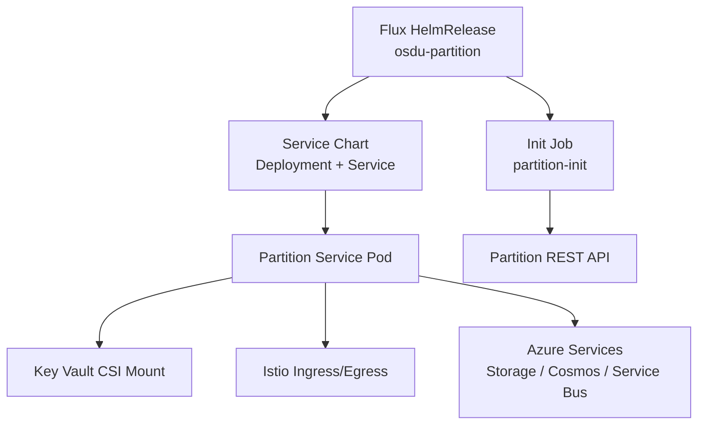
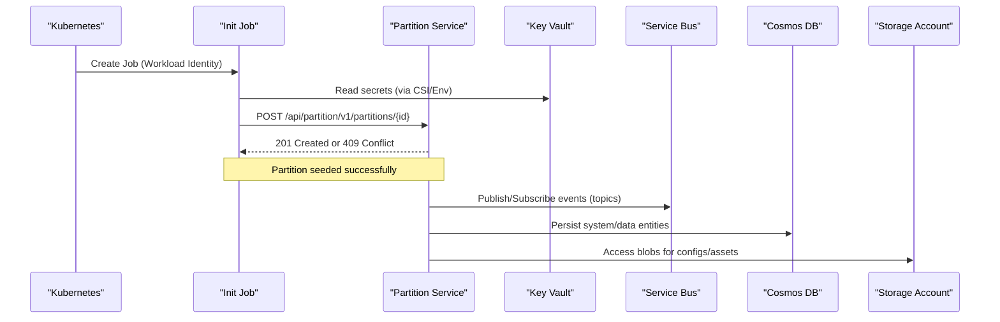

# Partition Service

<cite>
**Referenced Files in This Document**
- [partition.yaml](file://software/applications/osdu-core/partition.yaml)
- [partition-init.yaml](file://charts/osdu-developer-init/templates/partition-init.yaml)
- [deployment.yaml](file://charts/osdu-developer-service/templates/deployment.yaml)
- [hpa.yaml](file://charts/osdu-developer-service/templates/hpa.yaml)
- [values.yaml](file://charts/osdu-developer-service/values.yaml)
- [base.yaml](file://software/applications/osdu-core/base.yaml)
- [blade_partition.bicep](file://bicep/modules/blade_partition.bicep)
- [keyvault_secrets_partition.bicep](file://bicep/modules/keyvault_secrets_partition.bicep)
- [services_core_partition.md](file://docs/src/services_core_partition.md)
</cite>

## Table of Contents
1. Introduction
2. Project Structure
3. Core Components
4. Architecture Overview
5. Detailed Component Analysis
6. Dependency Analysis
7. Performance Considerations
8. Troubleshooting Guide
9. Conclusion

## Introduction
This document provides comprehensive deployment guidance for the OSDU Partition service on Kubernetes. It covers Helm-based manifests, resource requirements, scaling, health checks, partition-based data isolation, multi-tenant patterns, inter-service communication, configuration parameters, environment variables, and integration with core services. It also includes production considerations, monitoring setup, and troubleshooting guidance.

## Project Structure
The Partition service is deployed using a Flux-driven HelmRelease that references a shared service chart to render Deployment, Service, and optional autoscaling resources. An initialization Job provisions partition metadata via the Partition API. Infrastructure (storage, Cosmos DB, Service Bus) is provisioned by Bicep modules and secrets are stored in Key Vault.



**Diagram sources**
- [partition.yaml:1-106](file://software/applications/osdu-core/partition.yaml#L1-L106)
- [deployment.yaml:1-178](file://charts/osdu-developer-service/templates/deployment.yaml#L1-L178)
- [partition-init.yaml:1-244](file://charts/osdu-developer-init/templates/partition-init.yaml#L1-L244)
- [blade_partition.bicep:475-766](file://bicep/modules/blade_partition.bicep#L475-L766)

**Section sources**
- [partition.yaml:1-106](file://software/applications/osdu-core/partition.yaml#L1-L106)
- [base.yaml:1-72](file://software/applications/osdu-core/base.yaml#L1-L72)

## Core Components
- HelmRelease for Partition service: defines image, path, probes, auth bypasses, and environment variables sourced from Secrets and ConfigMaps.
- Shared service chart: renders Deployment, Service, readiness/liveness probes, resource requests/limits, and optional HorizontalPodAutoscaler.
- Initialization Job: uses Azure CLI with Workload Identity to call the Partition API and seed partition configuration.
- Infrastructure Bicep modules: provision Storage accounts, Cosmos DB databases/containers, Service Bus topics/subscriptions, and persist secrets into Key Vault.

Key responsibilities:
- Partition service exposes REST endpoints under a dedicated context path and integrates with Istio for authentication and routing.
- Init job ensures partition metadata exists before other services rely on it.
- Bicep modules enforce per-partition isolation through separate storage accounts, Cosmos DB instances, and Service Bus namespaces.

**Section sources**
- [partition.yaml:34-106](file://software/applications/osdu-core/partition.yaml#L34-L106)
- [deployment.yaml:19-178](file://charts/osdu-developer-service/templates/deployment.yaml#L19-L178)
- [partition-init.yaml:1-244](file://charts/osdu-developer-init/templates/partition-init.yaml#L1-L244)
- [blade_partition.bicep:475-766](file://bicep/modules/blade_partition.bicep#L475-L766)

## Architecture Overview
The Partition service runs as a stateless HTTP service behind Istio. Health probes are configured via Actuator endpoints. Secrets are mounted via Azure Key Vault CSI. The init Job authenticates using Workload Identity and calls the Partition API to create or update partition records.



**Diagram sources**
- [partition-init.yaml:201-244](file://charts/osdu-developer-init/templates/partition-init.yaml#L201-L244)
- [partition.yaml:73-106](file://software/applications/osdu-core/partition.yaml#L73-L106)
- [blade_partition.bicep:475-766](file://bicep/modules/blade_partition.bicep#L475-L766)

## Detailed Component Analysis

### HelmRelease and Service Configuration
- Target namespace: osdu-core
- Image repository and tag: configurable via values
- Context path: /api/partition/v1/
- Probes: readiness and liveness against /actuator/health on port 8081
- Auth bypass paths: actuator, swagger, info, webjars, liveness_check
- Environment variables:
  - KEYVAULT_URI, AAD_CLIENT_ID, APPINSIGHTS_KEY, APPLICATIONINSIGHTS_CONNECTION_STRING from Secrets
  - AZURE_ISTIOAUTH_ENABLED, AZURE_PAAS_WORKLOADIDENTITY_ISENABLED enabled
  - SERVER_SERVLET_CONTEXTPATH set to /api/partition/v1/
  - SERVER_PORT set to 80
  - ACCEPT_HTTP enabled
  - SPRING_APPLICATION_NAME set to partition
  - REDIS_DATABASE set to 1
  - PARTITION_SPRING_LOGGING_LEVEL set to DEBUG

Scaling and resources:
- Default replicaCount: 1 (overridable)
- Optional HPA based on CPU utilization (min/max/target)
- Resource requests/limits can be provided per service configuration

**Section sources**
- [partition.yaml:34-106](file://software/applications/osdu-core/partition.yaml#L34-L106)
- [hpa.yaml:1-33](file://charts/osdu-developer-service/templates/hpa.yaml#L1-L33)
- [values.yaml:15-142](file://charts/osdu-developer-service/values.yaml#L15-L142)

### Deployment Template
- Uses shared service chart to render Deployment with:
  - ServiceAccount for Workload Identity
  - Node selectors, tolerations, affinity
  - Volume mounts for Key Vault CSI
  - Readiness and liveness probes
  - Resource requests/limits
  - Environment variables from config maps and secrets

**Section sources**
- [deployment.yaml:19-178](file://charts/osdu-developer-service/templates/deployment.yaml#L19-L178)

### Initialization Job
- Runs once after Partition service is available
- Authenticates using Workload Identity (federated token)
- Calls Partition REST API to create/update partition record
- Handles 201 (Created) and 409 (Conflict) responses; fails on other status codes
- Injects tenant ID, client ID, partition name, and Service Bus name via values

**Section sources**
- [partition-init.yaml:1-244](file://charts/osdu-developer-init/templates/partition-init.yaml#L1-L244)

### Infrastructure and Data Isolation (Bicep)
- Per-partition Storage account with containers including legal-service-azure-configuration and partition-specific container
- Per-partition Cosmos DB account with system and data databases and multiple hash-indexed containers
- Per-partition Service Bus namespace with topics and subscriptions for indexing progress, legal tags, record updates, schema changes, status changes, reindexing, entitlements, replay
- Secrets exported to Key Vault: storage keys/endpoints, Cosmos connection strings, Service Bus connection string and namespace, Elastic credentials

Multi-tenant pattern:
- Each partition gets isolated infrastructure resources
- Secrets are namespaced per partition in Key Vault
- Service Bus topics/subscriptions are partition-scoped

**Section sources**
- [blade_partition.bicep:475-766](file://bicep/modules/blade_partition.bicep#L475-L766)
- [keyvault_secrets_partition.bicep:1-76](file://bicep/modules/keyvault_secrets_partition.bicep#L1-L76)

### Inter-Service Communication
- Istio ingress/egress routes expose internal and external gateways
- Authentication disabled for specific health and documentation endpoints
- Partition service communicates with:
  - Service Bus for event-driven workflows
  - Cosmos DB for persistence
  - Storage for assets and configurations
  - Elasticsearch via Key Vault-provided endpoint and credentials

**Section sources**
- [partition.yaml:42-73](file://software/applications/osdu-core/partition.yaml#L42-L73)
- [partition-init.yaml:201-244](file://charts/osdu-developer-init/templates/partition-init.yaml#L201-L244)
- [keyvault_secrets_partition.bicep:39-73](file://bicep/modules/keyvault_secrets_partition.bicep#L39-L73)

### Health Checks and Monitoring
- Liveness/readiness probes target /actuator/health on port 8081
- Application Insights key and connection string injected via Secrets
- Logging level configurable via environment variable

Local development notes:
- Java SDK 17 required
- Spring Boot module and main class documented
- Additional environment variables for local run and tests

**Section sources**
- [partition.yaml:54-106](file://software/applications/osdu-core/partition.yaml#L54-L106)
- [services_core_partition.md:1-51](file://docs/src/services_core_partition.md#L1-L51)

## Dependency Analysis
- Base platform dependencies:
  - osdu-developer-base-core provides default resource limits and request authentication
- Partition service depends on:
  - Key Vault for secrets
  - Active Directory for authentication
  - Istio for routing and mTLS
  - Azure Storage, Cosmos DB, Service Bus for data and messaging
- Init job depends on:
  - Partition service availability
  - Workload Identity federation

```mermaid
graph LR
Base["Base Platform<br/>Resource Limits & Auth"] --> Part["Partition Service"]
KV["Key Vault"] --> Part
AD["Active Directory"] --> Part
IST["Istio"] --> Part
SB["Service Bus"] <- --> Part
COS["Cosmos DB"] <- --> Part
ST["Storage Account"] <- --> Part
Init["Init Job"] --> Part
```

**Diagram sources**
- [base.yaml:27-35](file://software/applications/osdu-core/base.yaml#L27-L35)
- [partition.yaml:73-106](file://software/applications/osdu-core/partition.yaml#L73-L106)
- [blade_partition.bicep:475-766](file://bicep/modules/blade_partition.bicep#L475-L766)

**Section sources**
- [base.yaml:1-72](file://software/applications/osdu-core/base.yaml#L1-L72)
- [partition.yaml:1-106](file://software/applications/osdu-core/partition.yaml#L1-L106)

## Performance Considerations
- Replicas: Start with at least 2 replicas for high availability; adjust based on load.
- Autoscaling: Configure HPA with appropriate CPU utilization targets and min/max replicas to handle bursty traffic.
- Resources: Set meaningful CPU/memory requests and limits to ensure fair scheduling and prevent noisy neighbor issues.
- Probes: Tune initialDelaySeconds and periodSeconds to avoid premature restarts during startup.
- Networking: Ensure Istio policies and egress rules allow outbound access to Azure services without latency spikes.
- Storage and DB: Use appropriate throughput settings for Cosmos DB and size tiers for Service Bus topics based on expected message volume.

[No sources needed since this section provides general guidance]

## Troubleshooting Guide
Common issues and resolutions:
- Init job fails to authenticate:
  - Verify Workload Identity is enabled and federated token is available
  - Confirm client ID and tenant ID are correctly passed
- Partition already exists:
  - Expect 409 Conflict; this is idempotent behavior
- Health check failures:
  - Ensure /actuator/health is reachable on port 8081
  - Check probe configuration and application startup time
- Secret access errors:
  - Validate Key Vault permissions and CSI mount
  - Confirm secret names and keys match those referenced in environment variables
- Network connectivity:
  - Verify egress rules to Azure services (Storage, Cosmos, Service Bus)
  - Check NAT IP and firewall rules if applicable

Operational tips:
- Use kubectl logs for the init job to inspect curl output and HTTP status codes
- Inspect pod events and describe pods for probe failures
- Review Istio sidecar logs for authentication or routing issues

**Section sources**
- [partition-init.yaml:201-244](file://charts/osdu-developer-init/templates/partition-init.yaml#L201-L244)
- [partition.yaml:54-73](file://software/applications/osdu-core/partition.yaml#L54-L73)

## Conclusion
The Partition service is deployed via Flux-managed Helm releases with a robust initialization process and strong isolation per partition through dedicated Azure resources. Health checks, autoscaling, and monitoring are integrated to support production reliability. By following the configuration and operational guidance above, teams can deploy and operate the Partition service effectively within a multi-tenant OSDU environment.

[No sources needed since this section summarizes without analyzing specific files]